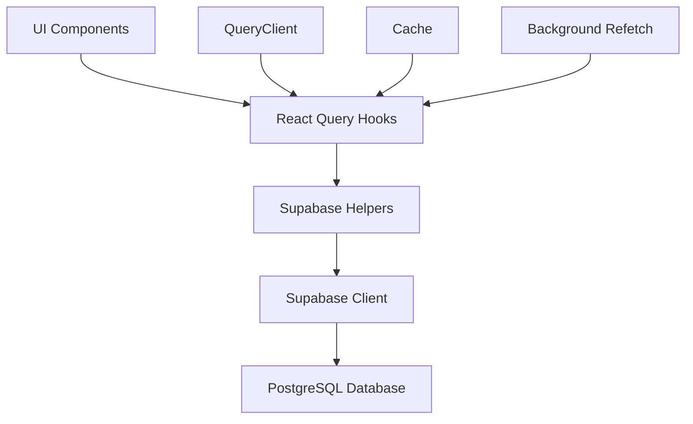
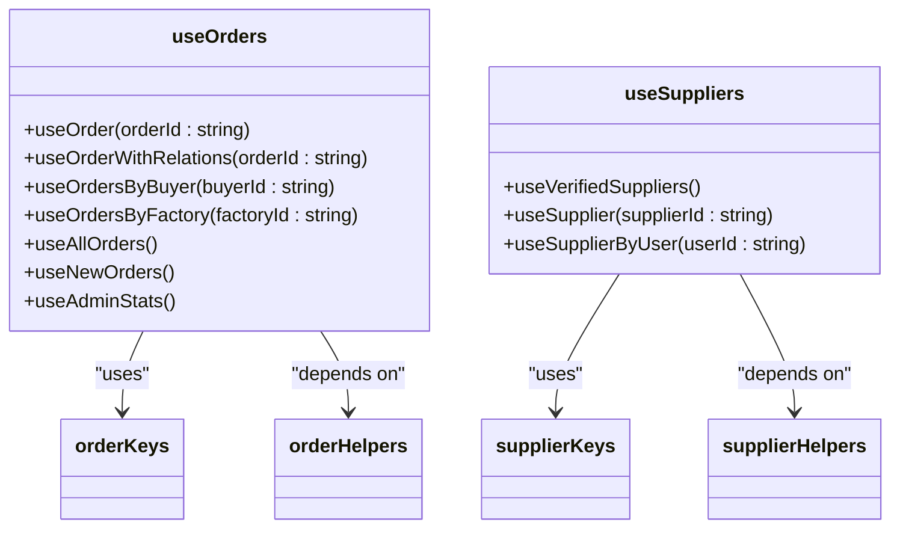
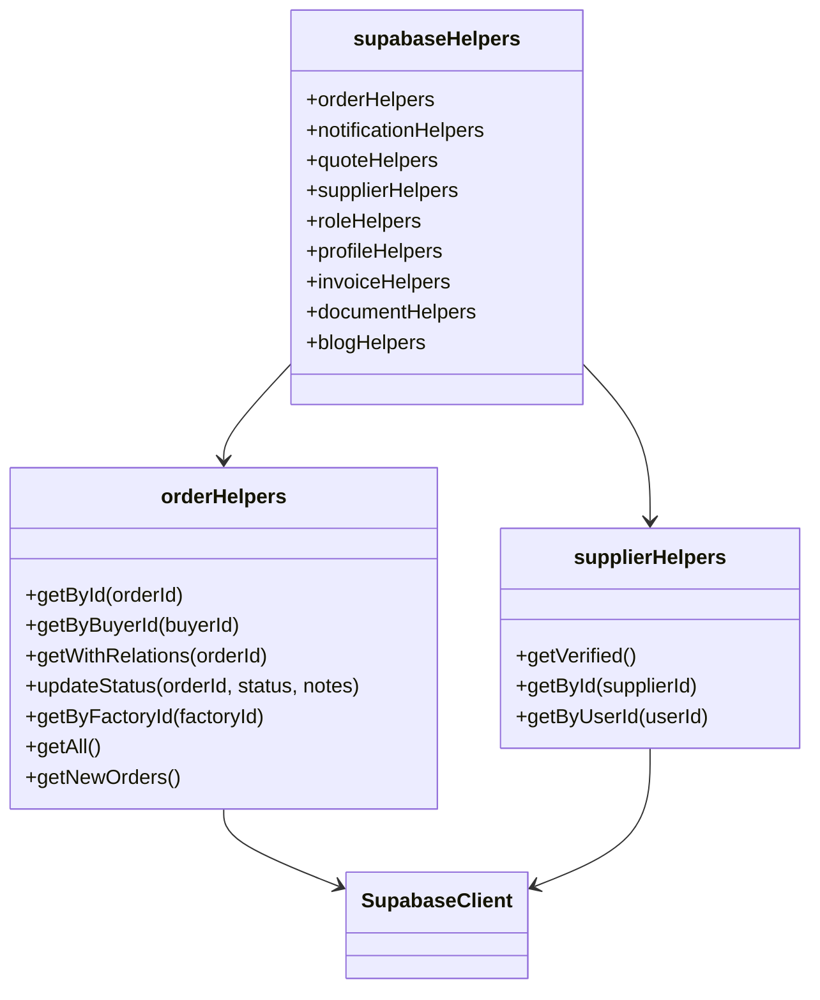
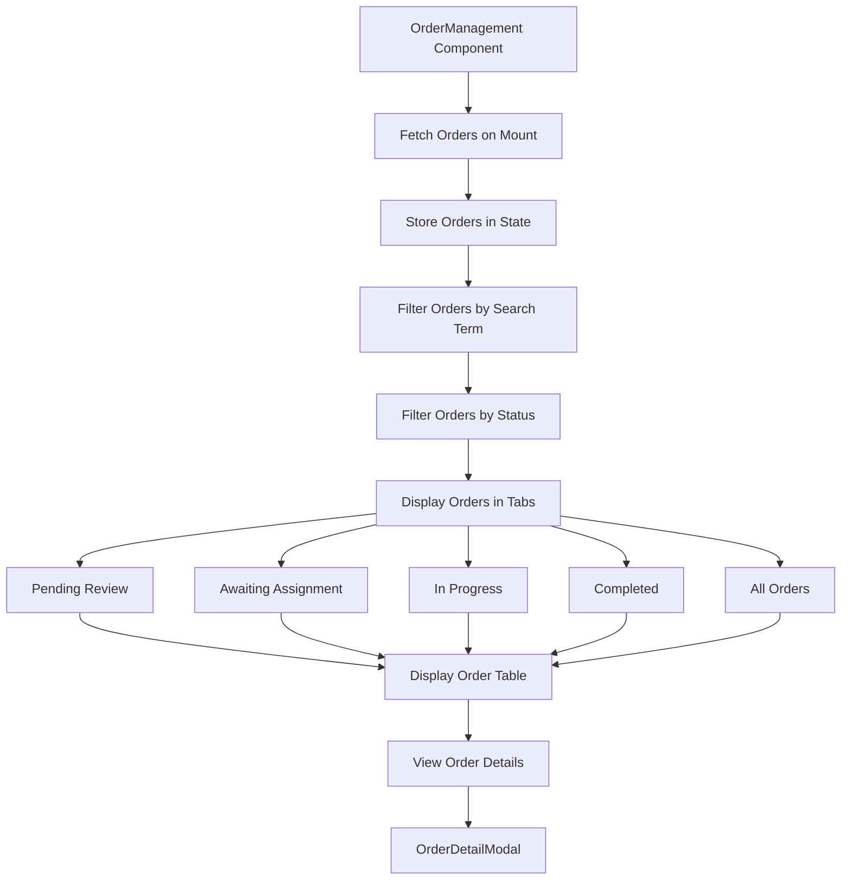
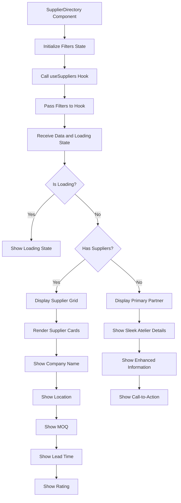
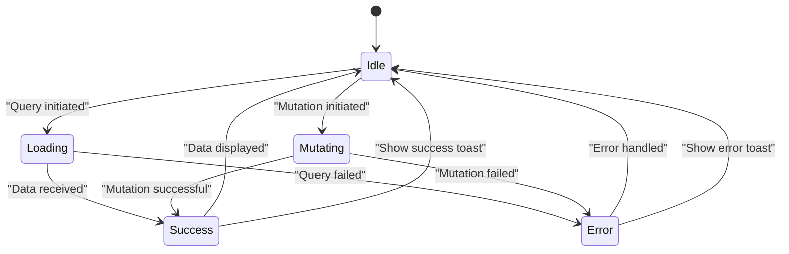
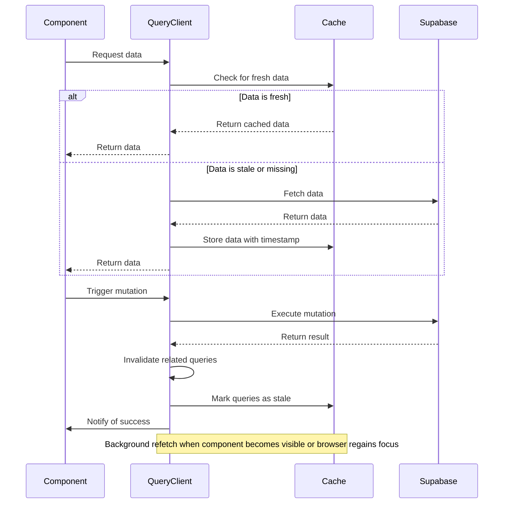
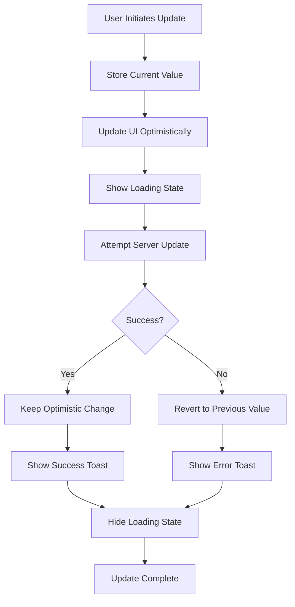
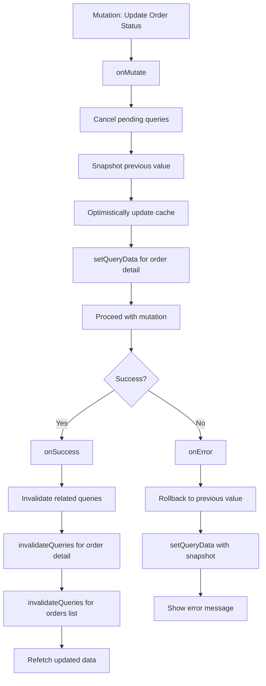

# Data Fetching and Query Management

<cite>
**Referenced Files in This Document**   
- [useOrders.ts](file://src/hooks/queries/useOrders.ts)
- [useSuppliers.ts](file://src/hooks/queries/useSuppliers.ts)
- [useOptimisticUpdate.ts](file://src/hooks/useOptimisticUpdate.ts)
- [supabaseHelpers.ts](file://src/lib/supabaseHelpers.ts)
- [OrderManagement.tsx](file://src/pages/admin/OrderManagement.tsx)
- [SupplierDirectory.tsx](file://src/pages/SupplierDirectory.tsx)
- [database.ts](file://src/types/database.ts)
</cite>

## Table of Contents
1. [Introduction](#introduction)
2. [Query Architecture Overview](#query-architecture-overview)
3. [Core Query Hooks Implementation](#core-query-hooks-implementation)
4. [Query Keys and Cache Management](#query-keys-and-cache-management)
5. [Data Fetching Abstraction Layer](#data-fetching-abstraction-layer)
6. [Usage in OrderManagement Page](#usage-in-ordermanagement-page)
7. [Usage in SupplierDirectory Page](#usage-in-supplierdirectory-page)
8. [Error Handling and Loading States](#error-handling-and-loading-states)
9. [Refetching and Background Updates](#refetching-and-background-updates)
10. [Optimistic Updates Integration](#optimistic-updates-integration)
11. [Query Composition and Cache Invalidation](#query-composition-and-cache-invalidation)

## Introduction

This document provides a comprehensive analysis of the data fetching and query management system in the application, focusing on React Query hooks that interface with Supabase. The system enables efficient data retrieval, caching, and state management for order and supplier data across the application. The implementation follows best practices for React Query usage, with a well-structured abstraction layer that separates data access concerns from component logic.

The core functionality revolves around two primary hooks: `useOrders` and `useSuppliers`, which provide a clean interface for accessing order and supplier data from Supabase. These hooks are complemented by an abstraction layer in the `supabaseHelpers.ts` file that encapsulates database operations with type safety. The system also incorporates optimistic updates through the `useOptimisticUpdate` hook, providing a responsive user experience while maintaining data consistency.

**Section sources**
- [useOrders.ts](file://src/hooks/queries/useOrders.ts#L1-L152)
- [useSuppliers.ts](file://src/hooks/queries/useSuppliers.ts#L1-L49)

## Query Architecture Overview

The application implements a robust query architecture using React Query to manage data fetching, caching, and synchronization with the Supabase backend. The architecture follows a layered approach with clear separation of concerns between data access, state management, and UI components.

At the core of the architecture are the query hooks located in the `src/hooks/queries` directory, which serve as the primary interface for components to access data. These hooks leverage React Query's powerful features including automatic caching, background refetching, and stale-while-revalidate strategies. The hooks are designed to be composable and reusable across different parts of the application.

The architecture incorporates a data access abstraction layer through the `supabaseHelpers.ts` file, which provides type-safe functions for interacting with Supabase. This layer ensures consistent query patterns and proper type inference throughout the application. The helpers encapsulate the low-level Supabase client operations, allowing the query hooks to focus on React Query integration and state management.



**Diagram sources**
- [useOrders.ts](file://src/hooks/queries/useOrders.ts#L1-L152)
- [supabaseHelpers.ts](file://src/lib/supabaseHelpers.ts#L1-L376)

**Section sources**
- [useOrders.ts](file://src/hooks/queries/useOrders.ts#L1-L152)
- [supabaseHelpers.ts](file://src/lib/supabaseHelpers.ts#L1-L376)

## Core Query Hooks Implementation

The application implements two primary query hooks for data fetching: `useOrders` and `useSuppliers`. These hooks provide a clean, type-safe interface for accessing order and supplier data from Supabase through React Query.

The `useOrders` hook exports several functions for different data access patterns:
- `useOrder`: Fetches a single order by ID
- `useOrderWithRelations`: Fetches an order with related data (supplier, documents, messages)
- `useOrdersByBuyer`: Fetches all orders for a specific buyer
- `useOrdersByFactory`: Fetches all orders for a specific factory
- `useAllOrders`: Fetches all orders
- `useNewOrders`: Fetches recently created orders
- `useAdminStats`: Fetches aggregated order statistics for admin dashboard

Similarly, the `useSuppliers` hook provides functions for supplier data access:
- `useVerifiedSuppliers`: Fetches all verified suppliers
- `useSupplier`: Fetches a single supplier by ID
- `useSupplierByUser`: Fetches supplier associated with a specific user

Both hooks follow consistent patterns for error handling, loading states, and data transformation. They leverage React Query's built-in features for automatic refetching, caching, and background updates.



**Diagram sources**
- [useOrders.ts](file://src/hooks/queries/useOrders.ts#L1-L152)
- [useSuppliers.ts](file://src/hooks/queries/useSuppliers.ts#L1-L49)

**Section sources**
- [useOrders.ts](file://src/hooks/queries/useOrders.ts#L1-L152)
- [useSuppliers.ts](file://src/hooks/queries/useSuppliers.ts#L1-L49)

## Query Keys and Cache Management

The application implements a comprehensive query key strategy using React Query's type-safe query key system. This approach ensures consistent cache management and enables powerful features like query invalidation and refetching.

The `orderKeys` object in `useOrders.ts` defines a hierarchical structure for order-related queries:
- `all`: Base key for all order queries
- `lists`: Key for order lists
- `list(filters)`: Key for filtered order lists
- `details`: Base key for order details
- `detail(id)`: Key for a specific order
- `withRelations(id)`: Key for order with related data
- `byBuyer(buyerId)`: Key for orders by buyer
- `byFactory(factoryId)`: Key for orders by factory
- `new()`: Key for new orders
- `adminStats()`: Key for admin statistics

Similarly, the `supplierKeys` object in `useSuppliers.ts` defines keys for supplier queries:
- `all`: Base key for all supplier queries
- `lists`: Base key for supplier lists
- `list(filters)`: Key for filtered supplier lists
- `verified()`: Key for verified suppliers
- `details`: Base key for supplier details
- `detail(id)`: Key for a specific supplier
- `byUser(userId)`: Key for supplier by user

This hierarchical structure enables precise cache management, allowing the application to invalidate or refetch specific subsets of data without affecting unrelated queries. The use of TypeScript's `const` assertions ensures type safety when working with query keys.

```mermaid
graph TD
A[orderKeys] --> B[all]
A --> C[lists]
A --> D[details]
C --> E[list(filters)]
D --> F[detail(id)]
D --> G[withRelations(id)]
C --> H[byBuyer(buyerId)]
C --> I[byFactory(factoryId)]
C --> J[new()]
C --> K[adminStats()]
L[supplierKeys] --> M[all]
L --> N[lists]
L --> O[details]
N --> P[list(filters)]
N --> Q[verified()]
O --> R[detail(id)]
M --> S[byUser(userId)]
```

**Diagram sources**
- [useOrders.ts](file://src/hooks/queries/useOrders.ts#L6-L17)
- [useSuppliers.ts](file://src/hooks/queries/useSuppliers.ts#L5-L13)

**Section sources**
- [useOrders.ts](file://src/hooks/queries/useOrders.ts#L6-L17)
- [useSuppliers.ts](file://src/hooks/queries/useSuppliers.ts#L5-L13)

## Data Fetching Abstraction Layer

The application implements a robust data fetching abstraction layer through the `supabaseHelpers.ts` file, which provides type-safe helper functions for Supabase operations. This layer serves as an intermediary between the React Query hooks and the Supabase client, ensuring consistent query patterns and proper type inference.

The abstraction layer is organized into several helper objects, each responsible for a specific domain:
- `orderHelpers`: Functions for order-related operations
- `notificationHelpers`: Functions for notification operations
- `quoteHelpers`: Functions for AI quote operations
- `supplierHelpers`: Functions for supplier operations
- `roleHelpers`: Functions for user role operations
- `profileHelpers`: Functions for profile operations
- `invoiceHelpers`: Functions for invoice operations
- `documentHelpers`: Functions for document operations
- `blogHelpers`: Functions for blog operations

Each helper function returns a consistent response structure with `data` and `error` properties, making it easy to handle success and error cases in the query hooks. The functions are designed to be composable and reusable, reducing code duplication across the application.

The abstraction layer also provides type safety by casting Supabase responses to the appropriate TypeScript interfaces defined in `database.ts`. This ensures that the data returned by the helpers has the correct shape and types, enabling better developer experience and reducing runtime errors.



**Diagram sources**
- [supabaseHelpers.ts](file://src/lib/supabaseHelpers.ts#L30-L223)

**Section sources**
- [supabaseHelpers.ts](file://src/lib/supabaseHelpers.ts#L30-L223)

## Usage in OrderManagement Page

The `OrderManagement.tsx` page demonstrates the practical usage of the data fetching hooks in a real-world component. This admin interface allows administrators to manage buyer orders, assign suppliers, and track margins across the platform.

The page uses a direct Supabase client approach for data fetching rather than the React Query hooks, implementing its own state management with React's `useState` and `useEffect` hooks. The component fetches all orders on mount and maintains them in local state. It provides filtering capabilities based on search terms and status filters, allowing administrators to quickly find specific orders.

The UI displays orders in a tabbed interface with categories for pending review, awaiting assignment, in progress, and completed orders. Each order is displayed with key information including order number, product type, quantity, status, buyer price, margin, and creation date. The component also includes a modal for viewing detailed order information.

While this implementation doesn't use the React Query hooks from `useOrders.ts`, it demonstrates the type of functionality that could be enhanced with the query system. The direct Supabase calls could be replaced with the appropriate query hooks to leverage React Query's caching and background update features.



**Diagram sources**
- [OrderManagement.tsx](file://src/pages/admin/OrderManagement.tsx#L1-L306)

**Section sources**
- [OrderManagement.tsx](file://src/pages/admin/OrderManagement.tsx#L1-L306)

## Usage in SupplierDirectory Page

The `SupplierDirectory.tsx` page demonstrates the usage of the `useSuppliers` hook in a consumer-facing component. This page displays a directory of verified manufacturing partners, allowing buyers to explore and select suppliers for their production needs.

The component uses the `useSuppliers` hook from `src/hooks/useSuppliers.ts` (not the one in the queries folder) to fetch supplier data with optional filters. The hook returns a `data` property containing the supplier list and a `isLoading` flag to indicate the loading state. The component maintains filter state in local state and passes it to the hook on changes.

The UI displays suppliers in a responsive grid layout, with each supplier card showing key information such as company name, location, MOQ, lead time, and average rating. The component includes a search bar and filters for product category and partner tier, allowing users to refine their search. For suppliers with ratings, the component calculates and displays an average rating.

The page also includes a special section for the primary manufacturing partner (Sleek Atelier) with enhanced information and a call-to-action for instant quotes. This demonstrates how the same data fetching system can be used to create different UI experiences based on business requirements.



**Diagram sources**
- [SupplierDirectory.tsx](file://src/pages/SupplierDirectory.tsx#L1-L378)

**Section sources**
- [SupplierDirectory.tsx](file://src/pages/SupplierDirectory.tsx#L1-L378)

## Error Handling and Loading States

The data fetching system implements comprehensive error handling and loading state management to provide a robust user experience. Both the query hooks and the components that use them follow consistent patterns for handling different states.

In the query hooks, error handling is implemented through React Query's built-in error handling mechanisms. When a query function throws an error, React Query automatically sets the `error` property on the query result. The hooks in `useOrders.ts` and `useSuppliers.ts` follow this pattern, throwing errors when Supabase operations fail. This allows components to check for errors in a consistent way.

Loading states are managed through React Query's `isLoading` property, which is automatically set when a query is in flight. Components can use this property to display loading indicators or skeleton screens while data is being fetched. The `SupplierDirectory.tsx` page demonstrates this by showing a loading message when suppliers are being fetched.

For mutation operations, the system uses React Query's `useMutation` hook, which provides additional state properties like `isPending` (formerly `isLoading`) to indicate when a mutation is in progress. The `useUpdateOrderStatus` function in `useOrders.ts` demonstrates this pattern, using the `onMutate` callback to implement optimistic updates and the `onError` callback to handle mutation failures.

Toast notifications are used to provide user feedback for both successful operations and errors. The `sonner` library is used to display these notifications, with success messages for successful operations and error messages for failures. This creates a consistent feedback mechanism across the application.



**Diagram sources**
- [useOrders.ts](file://src/hooks/queries/useOrders.ts#L110-L151)
- [SupplierDirectory.tsx](file://src/pages/SupplierDirectory.tsx#L126-L130)

**Section sources**
- [useOrders.ts](file://src/hooks/queries/useOrders.ts#L110-L151)
- [SupplierDirectory.tsx](file://src/pages/SupplierDirectory.tsx#L126-L130)

## Refetching and Background Updates

The data fetching system implements sophisticated refetching and background update strategies to ensure data freshness while maintaining performance. React Query's built-in features are leveraged to create an efficient caching and synchronization system.

The `useSuppliers` hook in `src/hooks/useSuppliers.ts` demonstrates explicit cache management with the `staleTime` and `gcTime` options. The `staleTime` is set to 10 minutes, meaning data is considered fresh for 10 minutes after it's fetched. During this period, multiple components requesting the same data will receive the cached version without making additional network requests. The `gcTime` is set to 15 minutes, determining how long unused queries are kept in memory before being garbage collected.

For mutation operations, the system uses query invalidation to trigger refetching of relevant data. The `useUpdateOrderStatus` mutation in `useOrders.ts` demonstrates this pattern, using `queryClient.invalidateQueries` in the `onSuccess` callback to invalidate both the specific order query and the orders list query. This ensures that updated data is reflected across the application without requiring a full page refresh.

The system also supports background refetching, where React Query automatically refetches stale queries when components that use them become visible or when the browser regains focus. This creates a seamless user experience where data is always up-to-date without requiring manual refresh actions.



**Diagram sources**
- [useSuppliers.ts](file://src/hooks/useSuppliers.ts#L95-L96)
- [useOrders.ts](file://src/hooks/queries/useOrders.ts#L146-L148)

**Section sources**
- [useSuppliers.ts](file://src/hooks/useSuppliers.ts#L95-L96)
- [useOrders.ts](file://src/hooks/queries/useOrders.ts#L146-L148)

## Optimistic Updates Integration

The application implements optimistic updates through the `useOptimisticUpdate.ts` hook, providing a responsive user experience while maintaining data consistency. This approach allows the UI to immediately reflect changes before they are confirmed by the server, creating a more fluid interaction.

The `useOptimisticUpdate` hook provides a generic solution for optimistic updates with automatic rollback on failure. It maintains the current value in state and provides an `update` function that first updates the local state optimistically, then attempts the actual update operation. If the operation succeeds, the change is confirmed; if it fails, the hook automatically reverts to the previous value.

The hook also includes specialized variants for specific use cases:
- `useOptimisticStageUpdate`: For production stage updates
- `useOptimisticOrderUpdate`: For order updates

These specialized hooks demonstrate how the generic optimistic update pattern can be adapted to specific domains. They handle the specific data structures and update operations for their respective domains while maintaining the core optimistic update behavior.

The implementation includes comprehensive error handling with automatic rollback, user feedback through toast notifications, and loading state management. When an update fails, the hook not only reverts the local state but also displays an error message to inform the user of the failure.



**Diagram sources**
- [useOptimisticUpdate.ts](file://src/hooks/useOptimisticUpdate.ts#L1-L76)

**Section sources**
- [useOptimisticUpdate.ts](file://src/hooks/useOptimisticUpdate.ts#L1-L76)

## Query Composition and Cache Invalidation

The application demonstrates effective patterns for query composition and cache invalidation, ensuring data consistency across the application. These patterns are critical for maintaining a reliable state management system when multiple components depend on related data.

Query composition is achieved through the hierarchical query key structure, which allows components to request specific subsets of data while still benefiting from shared caching. For example, the `useOrderWithRelations` hook composes a query that fetches an order with its related supplier, documents, and messages in a single request. This reduces the number of network requests and ensures data consistency.

Cache invalidation is implemented through React Query's `invalidateQueries` method, which marks queries as stale and triggers refetching. The `useUpdateOrderStatus` mutation demonstrates this pattern by invalidating both the specific order query and the orders list query after a successful update. This ensures that updated data is reflected across all components that display order information.

The system also uses queryClient's `setQueryData` method for optimistic updates, allowing components to update the cache directly before the server confirms the change. This is used in the `onMutate` callback of mutations to implement optimistic UI updates. The combination of optimistic updates and cache invalidation creates a responsive user experience while ensuring data consistency.



**Diagram sources**
- [useOrders.ts](file://src/hooks/queries/useOrders.ts#L119-L148)

**Section sources**
- [useOrders.ts](file://src/hooks/queries/useOrders.ts#L119-L148)