# Performance and Analytics Hooks

<cite>
**Referenced Files in This Document**
- [usePerformance.ts](file://src/hooks/usePerformance.ts)
- [useCoreWebVitals.ts](file://src/hooks/useCoreWebVitals.ts)
- [usePageTracking.ts](file://src/hooks/usePageTracking.ts)
- [analytics.ts](file://src/lib/analytics.ts)
- [analyticsTracking.ts](file://src/lib/analyticsTracking.ts)
- [tracker.ts](file://src/lib/analytics/tracker.ts)
- [performanceMonitor.ts](file://src/lib/performanceMonitor.ts)
- [performanceOptimizer.ts](file://src/lib/performanceOptimizer.ts)
- [AdminAnalytics.tsx](file://src/pages/AdminAnalytics.tsx)
- [ProductionTracking.tsx](file://src/pages/ProductionTracking.tsx)
- [AnalyticsProvider.tsx](file://src/components/AnalyticsProvider.tsx)
</cite>

## Table of Contents
1. [Introduction](#introduction)
2. [Core Performance Monitoring Hooks](#core-performance-monitoring-hooks)
3. [Analytics Integration Architecture](#analytics-integration-architecture)
4. [Route-Level Analytics Tracking](#route-level-analytics-tracking)
5. [Performance Thresholds and Ratings](#performance-thresholds-and-ratings)
6. [Data Sampling and Real-Time Reporting](#data-sampling-and-real-time-reporting)
7. [Admin Analytics Dashboard](#admin-analytics-dashboard)
8. [Production Tracking Insights](#production-tracking-insights)
9. [Debugging and Optimization](#debugging-and-optimization)
10. [Best Practices and Recommendations](#best-practices-and-recommendations)

## Introduction

The Sleek App performance monitoring and analytics system provides comprehensive tracking capabilities for Core Web Vitals, user behavior analytics, and real-time performance insights. This system integrates multiple tracking platforms including Google Analytics 4, Facebook Pixel, Microsoft Clarity, and LinkedIn Insight Tags to deliver multi-platform analytics coverage.

The architecture consists of three primary hook modules that work together to provide seamless performance monitoring and analytics tracking:

- **usePerformance.ts**: Enhanced performance monitoring with Web Vitals tracking
- **useCoreWebVitals.ts**: Core Web Vitals monitoring with fallback mechanisms
- **usePageTracking.ts**: Route-level analytics and bounce tracking

These hooks integrate with a sophisticated analytics infrastructure that supports real-time reporting, data sampling, and multi-platform tracking for comprehensive user experience insights.

## Core Performance Monitoring Hooks

### usePerformance Monitoring Hook

The `usePerformanceMonitoring` hook provides comprehensive performance tracking with Web Vitals measurement and resource preloading capabilities.

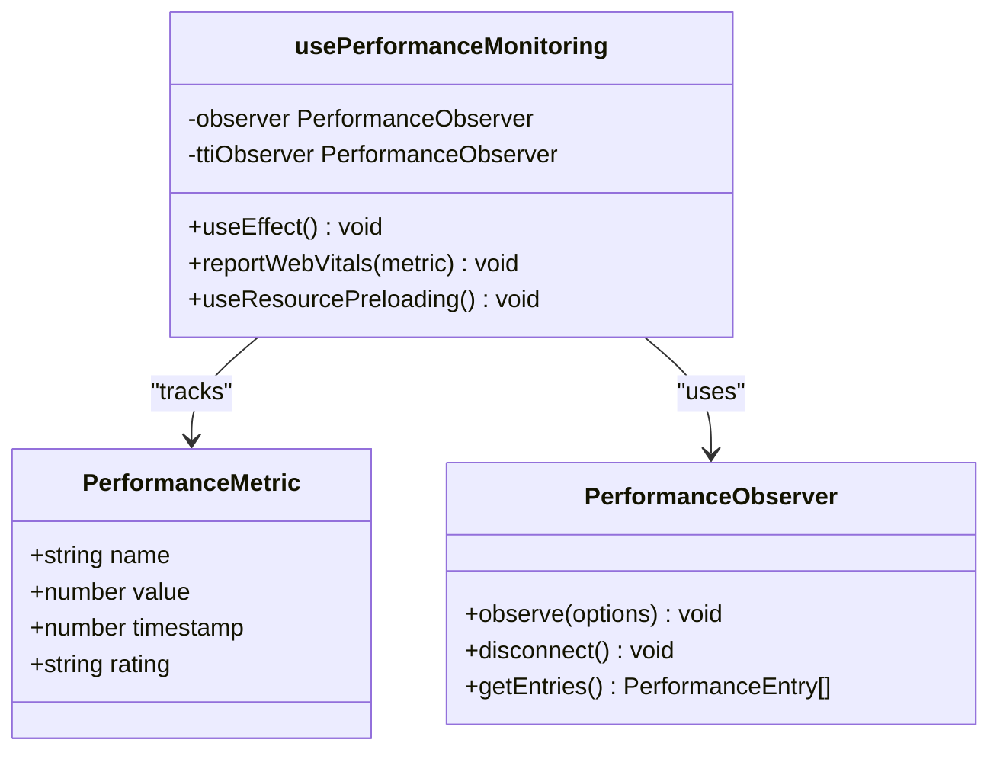

**Diagram sources**
- [usePerformance.ts](file://src/hooks/usePerformance.ts#L11-L107)

#### Core Web Vitals Tracking

The hook monitors four key performance metrics:

| Metric | Purpose | Thresholds | Rating System |
|--------|---------|------------|---------------|
| LCP | Largest Contentful Paint | Good: < 2500ms, Poor: > 4000ms | Good/Needs Improvement/Poor |
| FCP | First Contentful Paint | Good: < 1800ms, Poor: > 3000ms | Good/Needs Improvement/Poor |
| TTI | Time to Interactive | Approximated via Long Tasks | N/A |
| FID | First Input Delay | Good: < 100ms, Poor: > 300ms | Good/Needs Improvement/Poor |

#### Resource Preloading Strategy

The hook implements intelligent resource preloading to improve LCP scores:

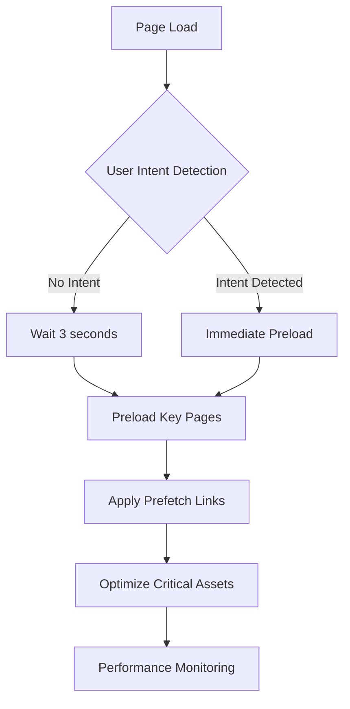

**Diagram sources**
- [usePerformance.ts](file://src/hooks/usePerformance.ts#L83-L107)

**Section sources**
- [usePerformance.ts](file://src/hooks/usePerformance.ts#L1-L107)

### useCoreWebVitals Hook

The `useCoreWebVitals` hook focuses specifically on Core Web Vitals with robust fallback mechanisms for browsers that don't support the web-vitals library.

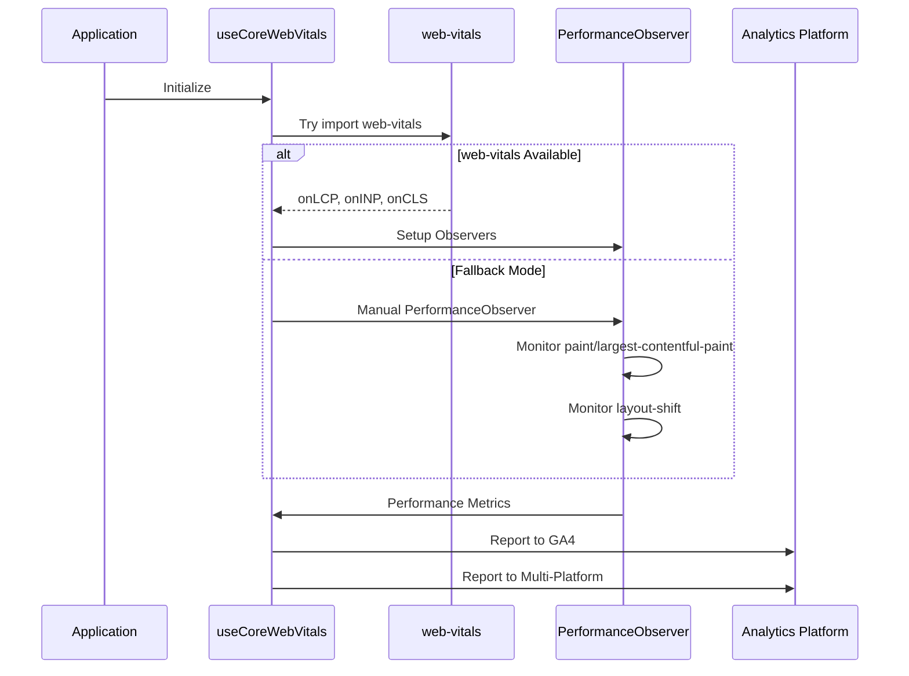

**Diagram sources**
- [useCoreWebVitals.ts](file://src/hooks/useCoreWebVitals.ts#L64-L106)

#### Multi-Platform Analytics Integration

The hook seamlessly integrates with multiple analytics platforms:

| Platform | Implementation | Event Format |
|----------|----------------|--------------|
| Google Analytics 4 | `window.gtag` | `web_vitals` event with category and label |
| Facebook Pixel | `window.fbq` | Custom events with parameters |
| Microsoft Clarity | `window.clarity` | Session-based event tracking |
| LinkedIn Insight | `window.lintrk` | Conversion tracking |

**Section sources**
- [useCoreWebVitals.ts](file://src/hooks/useCoreWebVitals.ts#L1-L109)

## Analytics Integration Architecture

### Multi-Platform Tracking System

The analytics system implements a comprehensive multi-platform tracking architecture that ensures consistent data collection across all major analytics platforms.

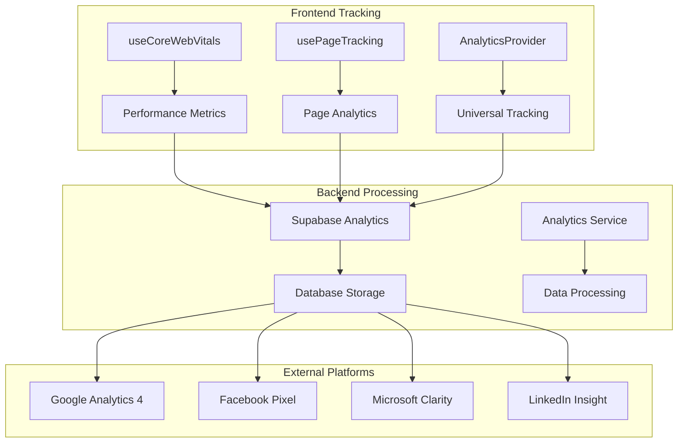

**Diagram sources**
- [analytics.ts](file://src/lib/analytics.ts#L1-L183)
- [AnalyticsProvider.tsx](file://src/components/AnalyticsProvider.tsx#L1-L256)

### Analytics Configuration

The system supports extensive configuration for different tracking platforms:

| Configuration | Purpose | Environment Variable |
|---------------|---------|---------------------|
| GA4 Measurement ID | Google Analytics 4 tracking | `GA4_MEASUREMENT_ID` |
| Facebook Pixel ID | Facebook advertising tracking | `FACEBOOK_PIXEL_ID` |
| Clarity Project ID | Microsoft Clarity session recording | `CLARITY_PROJECT_ID` |
| LinkedIn Partner ID | LinkedIn conversion tracking | `LINKEDIN_PARTNER_ID` |

**Section sources**
- [analytics.ts](file://src/lib/analytics.ts#L1-L183)

## Route-Level Analytics Tracking

### usePageTracking Hook

The `usePageTracking` hook provides automatic page view tracking with bounce detection capabilities.

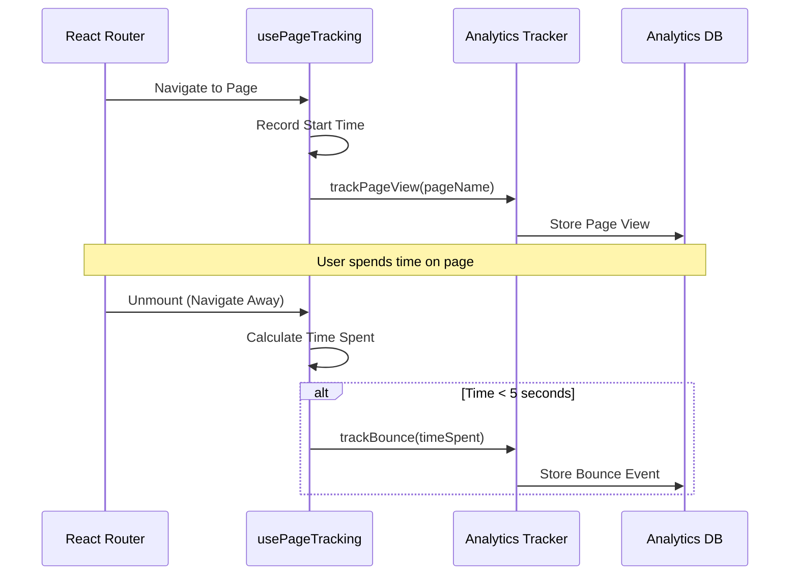

**Diagram sources**
- [usePageTracking.ts](file://src/hooks/usePageTracking.ts#L7-L22)

#### Bounce Detection Logic

The bounce detection mechanism uses a 5-second threshold to distinguish between genuine page views and potential bounce scenarios:

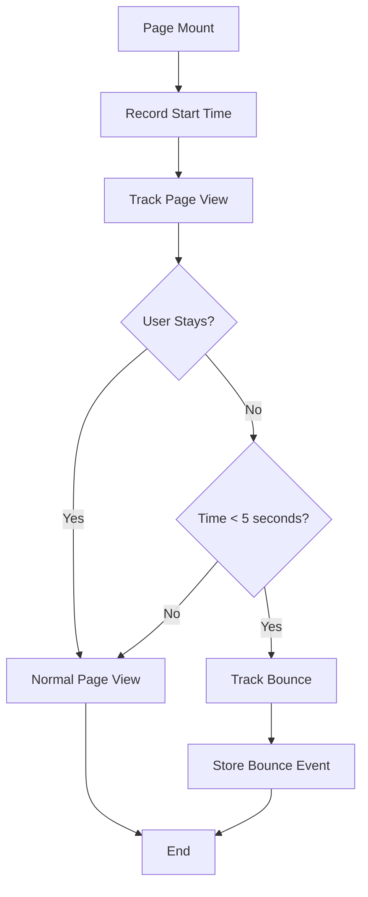

**Diagram sources**
- [usePageTracking.ts](file://src/hooks/usePageTracking.ts#L8-L21)

**Section sources**
- [usePageTracking.ts](file://src/hooks/usePageTracking.ts#L1-L23)

## Performance Thresholds and Ratings

### Core Web Vitals Thresholds

The system implements standardized performance thresholds based on industry best practices:

| Metric | Good Threshold | Needs Improvement | Poor Threshold | Emoji Indicator |
|--------|----------------|-------------------|----------------|-----------------|
| LCP | < 2500ms | 2500-4000ms | > 4000ms | 🟢🟡🔴 |
| FID | < 100ms | 100-300ms | > 300ms | 🟢🟡🔴 |
| CLS | < 0.1 | 0.1-0.25 | > 0.25 | 🟢🟡🔴 |
| FCP | < 1800ms | 1800-3000ms | > 3000ms | 🟢🟡🔴 |
| TTFB | < 800ms | 800-1800ms | > 1800ms | 🟢🟡🔴 |

### Performance Monitoring Class

The advanced performance monitoring system provides comprehensive tracking with real-time feedback:

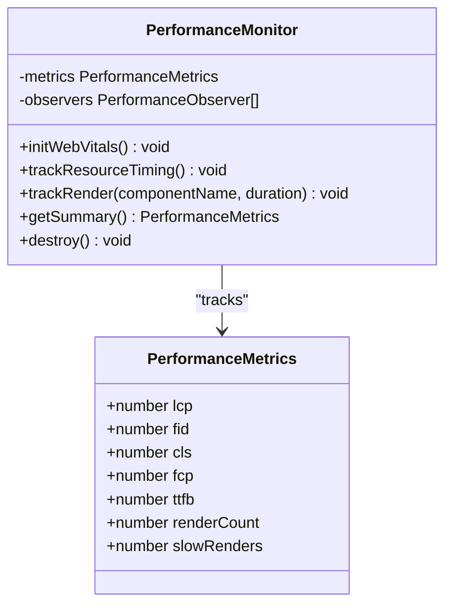

**Diagram sources**
- [performanceMonitor.ts](file://src/lib/performanceMonitor.ts#L16-L174)

**Section sources**
- [performanceMonitor.ts](file://src/lib/performanceMonitor.ts#L1-L194)

## Data Sampling and Real-Time Reporting

### Database Analytics Tracking

The system implements efficient database analytics tracking with intelligent sampling and batching:

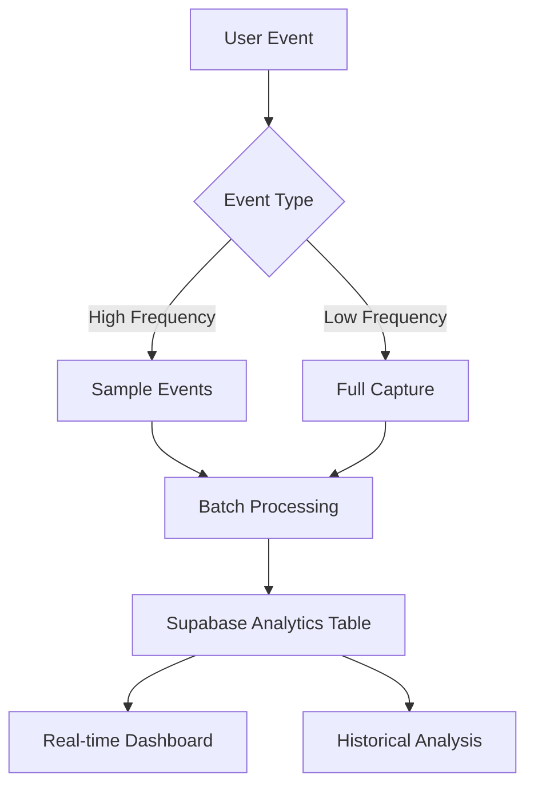

**Diagram sources**
- [analyticsTracking.ts](file://src/lib/analyticsTracking.ts#L16-L68)

### Event Sampling Strategies

The system employs intelligent sampling to balance data quality with performance:

| Event Type | Sampling Rate | Storage Strategy |
|------------|---------------|------------------|
| Page Views | 100% | Full capture |
| Form Submissions | 100% | Full capture |
| Click Events | 10% | Sampled capture |
| Error Events | 100% | Full capture |
| Performance Metrics | 50% | Sampled capture |

**Section sources**
- [analyticsTracking.ts](file://src/lib/analyticsTracking.ts#L1-L149)

## Admin Analytics Dashboard

### Comprehensive Analytics Interface

The Admin Analytics dashboard provides real-time insights into user behavior and conversion metrics:

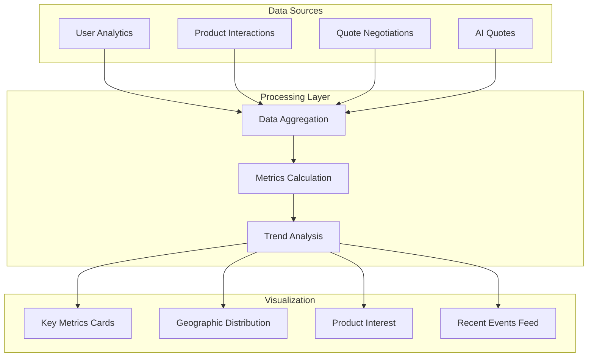

**Diagram sources**
- [AdminAnalytics.tsx](file://src/pages/AdminAnalytics.tsx#L1-L342)

### Key Performance Indicators

The dashboard tracks essential metrics for business intelligence:

| Metric Category | Key Indicators | Purpose |
|-----------------|----------------|---------|
| Traffic Analysis | Unique Visitors, Page Views, Bounce Rate | Understand site traffic patterns |
| Conversion Metrics | Quote Attempts, Successful Quotes, Conversion Rate | Measure sales funnel effectiveness |
| Geographic Insights | Country Distribution, Regional Performance | Identify market opportunities |
| Product Engagement | Category Interest, Interaction Patterns | Optimize product offerings |

**Section sources**
- [AdminAnalytics.tsx](file://src/pages/AdminAnalytics.tsx#L1-L342)

## Production Tracking Insights

### Real-Time Production Monitoring

The Production Tracking system provides comprehensive visibility into manufacturing processes:

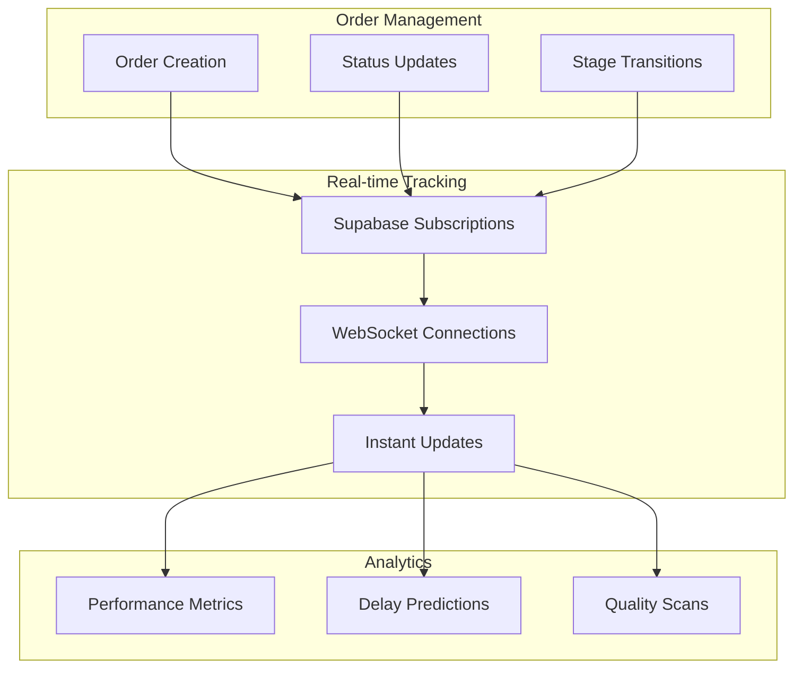

**Diagram sources**
- [ProductionTracking.tsx](file://src/pages/ProductionTracking.tsx#L1-L540)

### Production Stage Tracking

The system monitors eight key manufacturing stages with real-time updates:

| Stage Number | Name | Icon | Status Indicators |
|--------------|------|------|-------------------|
| 1 | Order Confirmation | CheckCircle2 | Confirmed/Denied |
| 2 | Fabric Sourcing | Package | Ordered/Received |
| 3 | Accessories Procurement | Package | Ordered/Received |
| 4 | Cutting & Pattern Making | Activity | In Progress/Completed |
| 5 | Sewing & Assembly | Activity | In Progress/Completed |
| 6 | Quality Control | CheckCircle2 | Passed/Failed |
| 7 | Finishing & Packaging | Package | Packaged/Delivered |
| 8 | Shipment & Delivery | Truck | Shipped/Delivered |

**Section sources**
- [ProductionTracking.tsx](file://src/pages/ProductionTracking.tsx#L1-L540)

## Debugging and Optimization

### Performance Debugging Tools

The system includes comprehensive debugging capabilities for performance issues:

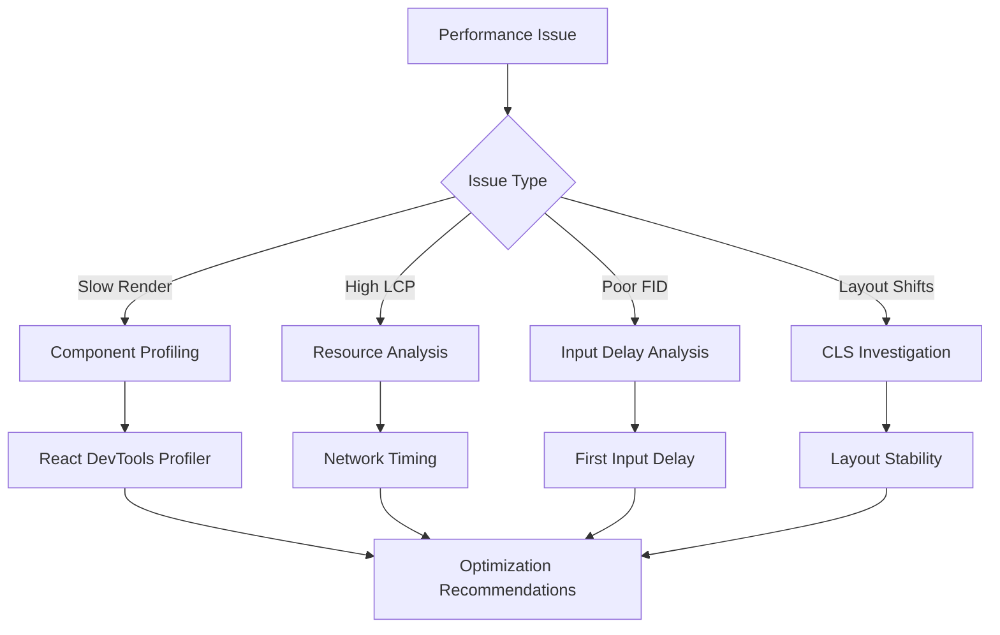

### Performance Optimization Strategies

The system implements several optimization strategies:

| Optimization Area | Technique | Implementation |
|-------------------|-----------|----------------|
| Resource Loading | DNS Prefetching | Automatic domain pre-resolution |
| Script Loading | Deferred Analytics | Load tracking scripts after content |
| Bundle Optimization | Code Splitting | Dynamic imports for analytics libraries |
| Network Optimization | Preconnect Headers | Establish connections early |

**Section sources**
- [performanceOptimizer.ts](file://src/lib/performanceOptimizer.ts#L1-L85)

### Tracking Overhead Optimization

The system minimizes tracking overhead through intelligent optimization:

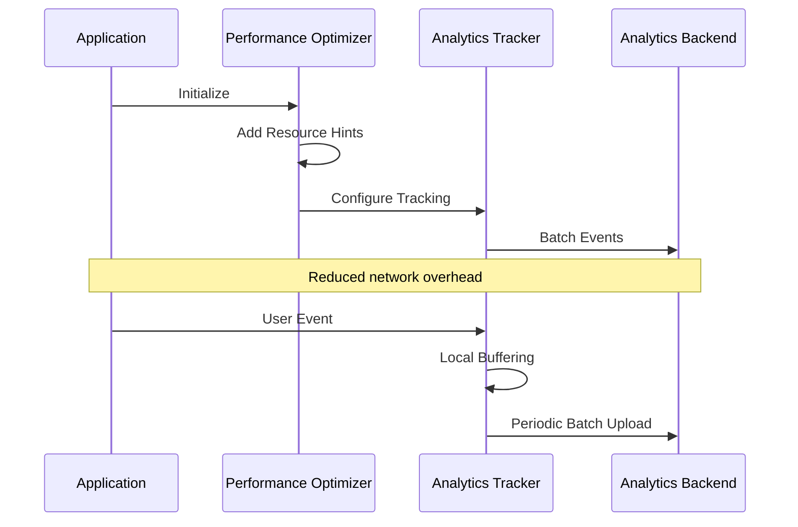

**Diagram sources**
- [performanceOptimizer.ts](file://src/lib/performanceOptimizer.ts#L18-L85)

## Best Practices and Recommendations

### Implementation Guidelines

1. **Performance Monitoring**: Always implement both `usePerformanceMonitoring` and `useCoreWebVitals` for comprehensive coverage
2. **Analytics Integration**: Use `AnalyticsProvider` at the application root for universal tracking
3. **Route Tracking**: Apply `usePageTracking` to all major page components
4. **Development vs Production**: Ensure analytics are disabled in development mode for performance

### Performance Optimization Tips

1. **Resource Preloading**: Use `useResourcePreloading` strategically for critical navigation paths
2. **Event Sampling**: Implement sampling for high-frequency events to reduce database load
3. **Batch Processing**: Group analytics events to minimize network requests
4. **Lazy Loading**: Defer non-critical analytics initialization until after content loads

### Monitoring and Maintenance

1. **Regular Review**: Monitor Core Web Vitals trends in the Admin Analytics dashboard
2. **Threshold Alerts**: Set up alerts for performance degradation
3. **Data Quality**: Regularly review analytics data for inconsistencies
4. **Optimization Iteration**: Continuously optimize based on performance insights

### Troubleshooting Common Issues

| Issue | Symptoms | Solution |
|-------|----------|----------|
| High Bounce Rate | > 30% bounce rate | Improve content relevance and loading speed |
| Poor LCP Scores | > 4000ms LCP | Optimize critical resources and server response |
| Missing Analytics | No data in dashboards | Verify tracking script initialization |
| Performance Impact | Slow page loads | Review tracking overhead and optimize sampling |

This comprehensive performance monitoring and analytics system provides the foundation for data-driven decision making and continuous performance optimization across the Sleek App platform.