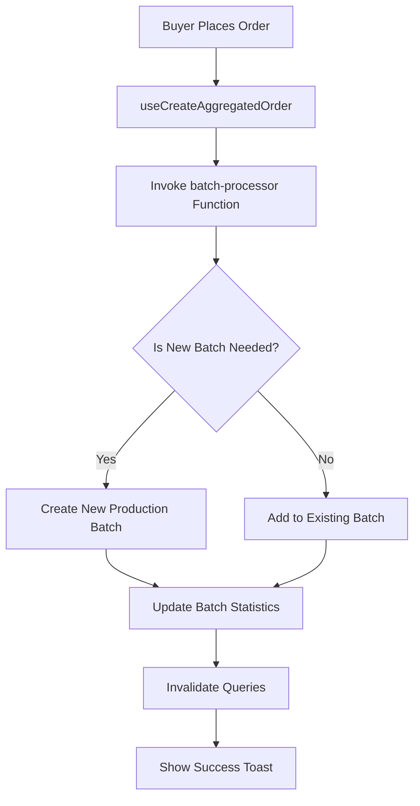
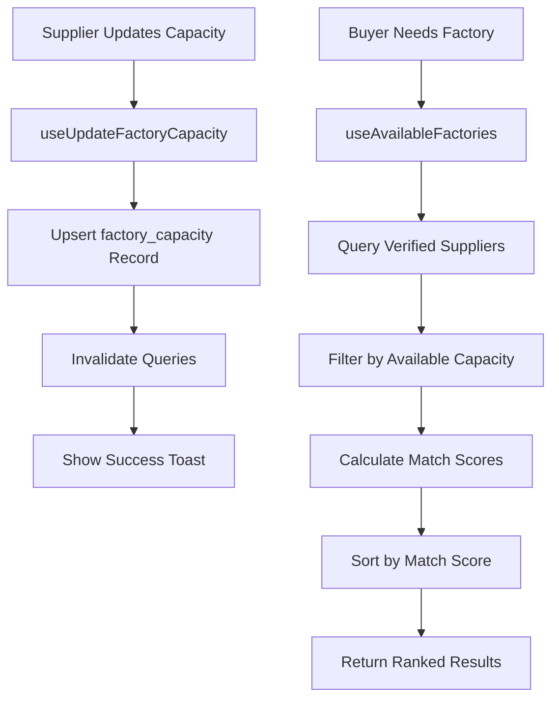
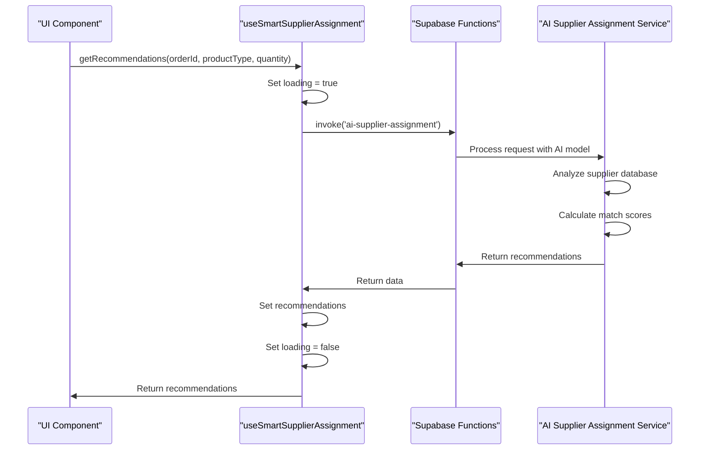
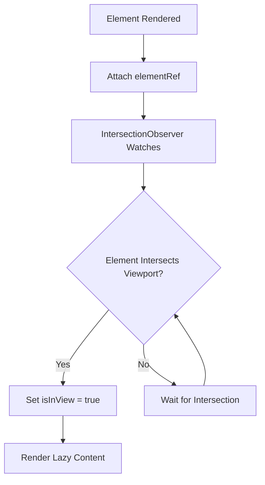
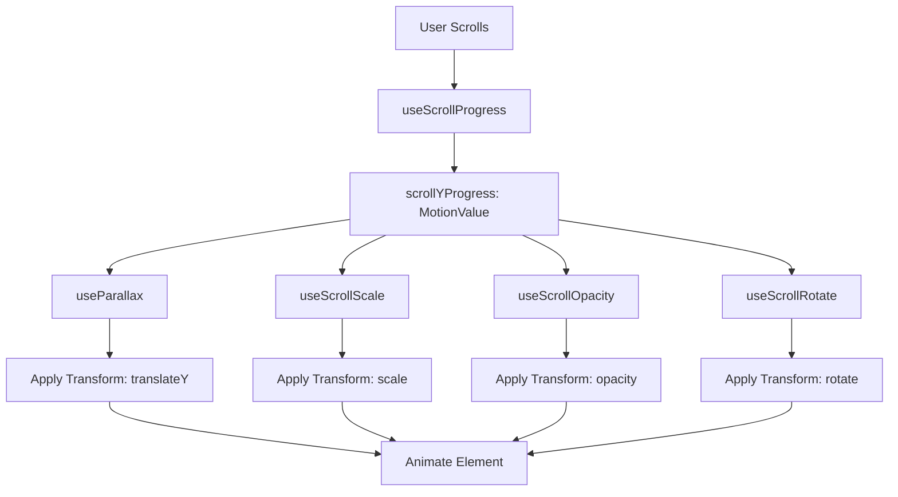
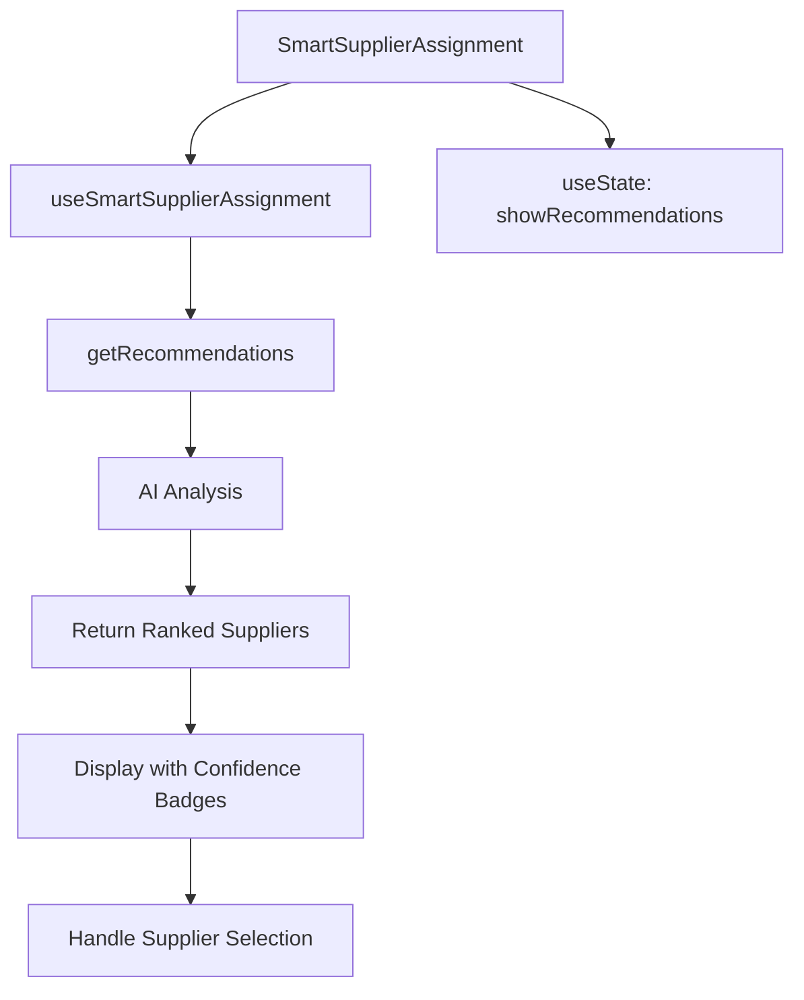

# Utility and Composable Logic Hooks

<cite>
**Referenced Files in This Document**   
- [useAggregation.ts](file://src/hooks/useAggregation.ts)
- [useFactoryCapacity.ts](file://src/hooks/useFactoryCapacity.ts)
- [useSmartSupplierAssignment.ts](file://src/hooks/useSmartSupplierAssignment.ts)
- [useSupplierCapabilities.ts](file://src/hooks/useSupplierCapabilities.ts)
- [useScrollProgress.ts](file://src/hooks/useScrollProgress.ts)
- [useLazyLoad.ts](file://src/hooks/useLazyLoad.ts)
- [SmartSupplierAssignment.tsx](file://src/components/admin/SmartSupplierAssignment.tsx)
- [ProductionStageTimeline.tsx](file://src/components/production/ProductionStageTimeline.tsx)
- [BatchProgressIndicator.tsx](file://src/components/aggregation/BatchProgressIndicator.tsx)
- [FactoryCapacityManager.tsx](file://src/components/supplier/FactoryCapacityManager.tsx)
</cite>

## Table of Contents
1. [Introduction](#introduction)
2. [Aggregation Workflow Hooks](#aggregation-workflow-hooks)
3. [Supplier Capacity Planning Hooks](#supplier-capacity-planning-hooks)
4. [AI-Driven Supplier Matching Hooks](#ai-driven-supplier-matching-hooks)
5. [Supplier Capabilities Filtering Hooks](#supplier-capabilities-filtering-hooks)
6. [Performance Optimization Hooks](#performance-optimization-hooks)
7. [Scroll-Based Animation Hooks](#scroll-based-animation-hooks)
8. [Hook Composition Examples](#hook-composition-examples)
9. [Integration Patterns](#integration-patterns)
10. [Conclusion](#conclusion)

## Introduction
This document provides comprehensive documentation for utility hooks that encapsulate cross-cutting logic in the SleekApparels application. The hooks are designed to promote reusability, maintainability, and separation of concerns by abstracting complex business logic, data fetching, and UI interactions into composable functions. These hooks serve as the foundation for various features including aggregation workflows, supplier capacity planning, AI-driven supplier matching, and performance optimization.

**Section sources**
- [useAggregation.ts](file://src/hooks/useAggregation.ts)
- [useFactoryCapacity.ts](file://src/hooks/useFactoryCapacity.ts)

## Aggregation Workflow Hooks
The `useAggregation.ts` hook provides functionality for managing batch processing in aggregation workflows, enabling multiple buyers to contribute to a single production batch for cost efficiency and economies of scale.

The hook exposes several key functions:
- `useActiveBatches`: Retrieves all active production batches that are either filling or confirmed, with optional filtering by product category
- `useMyBatchContributions`: Fetches all batch contributions made by the currently authenticated buyer
- `useCreateAggregatedOrder`: Handles the creation of new aggregated orders by invoking the batch processor function
- `useBatchStatistics`: Provides statistical insights about the current state of all production batches

The hook integrates with the Supabase backend and React Query for efficient data fetching and caching. When a new order is placed, it triggers the `batch-processor` serverless function which determines whether to create a new batch or add to an existing one. The hook automatically invalidates relevant queries upon successful mutation to ensure data consistency.

**Diagram sources**
- [useAggregation.ts](file://src/hooks/useAggregation.ts#L78-L117)

**Section sources**
- [useAggregation.ts](file://src/hooks/useAggregation.ts#L1-L143)
- [BatchProgressIndicator.tsx](file://src/components/aggregation/BatchProgressIndicator.tsx#L1-L108)

## Supplier Capacity Planning Hooks
The `useFactoryCapacity.ts` hook provides comprehensive functionality for supplier capacity planning, enabling suppliers to manage their production capacity and buyers to find factories with available capacity.

Key features include:
- `useFactoryCapacity`: Retrieves factory capacity data for a specific supplier within a date range
- `useUpdateFactoryCapacity`: Allows suppliers to update their factory capacity details including total capacity, machines, workers, and shift hours
- `useAvailableFactories`: Finds verified suppliers with sufficient available capacity for a given quantity and target date, ranking them by match score
- `useCapacityUtilizationLogs`: Retrieves historical capacity utilization data for performance analysis

The hook implements intelligent caching with a 2-minute stale time and 5-minute garbage collection time, recognizing that capacity data changes frequently. It leverages database functions like `calculate_factory_match_score` to efficiently compute supplier match scores based on multiple factors including capacity, performance history, and specialization.

**Diagram sources**
- [useFactoryCapacity.ts](file://src/hooks/useFactoryCapacity.ts#L57-L89)
- [useFactoryCapacity.ts](file://src/hooks/useFactoryCapacity.ts#L92-L138)

**Section sources**
- [useFactoryCapacity.ts](file://src/hooks/useFactoryCapacity.ts#L1-L161)
- [FactoryCapacityManager.tsx](file://src/components/supplier/FactoryCapacityManager.tsx#L1-L326)

## AI-Driven Supplier Matching Hooks
The `useSmartSupplierAssignment.ts` hook enables AI-driven supplier matching by leveraging machine learning models to recommend the most suitable suppliers for specific orders based on various factors.

The hook provides:
- State management for loading status and recommendations
- `getRecommendations` function that invokes the `ai-supplier-assignment` serverless function with order details
- Integration with toast notifications for user feedback

The AI matching system considers multiple factors including product type, quantity, quality requirements, supplier performance history, capacity availability, and specialization. The recommendations include a confidence score and reasoning to provide transparency into the AI's decision-making process.

**Diagram sources**
- [useSmartSupplierAssignment.ts](file://src/hooks/useSmartSupplierAssignment.ts#L18-L48)
- [SmartSupplierAssignment.tsx](file://src/components/admin/SmartSupplierAssignment.tsx#L27-L32)

**Section sources**
- [useSmartSupplierAssignment.ts](file://src/hooks/useSmartSupplierAssignment.ts#L1-L55)
- [SmartSupplierAssignment.tsx](file://src/components/admin/SmartSupplierAssignment.tsx#L1-L127)

## Supplier Capabilities Filtering Hooks
The `useSupplierCapabilities.ts` hook provides functionality for managing and filtering suppliers based on their production expertise and capabilities.

The hook includes:
- `useCreateSupplierCapabilities`: A mutation hook that allows suppliers to register their production capabilities including product categories, materials, techniques, and gauge ranges
- Strong typing with the `SupplierCapabilityInput` interface to ensure data consistency
- Integration with React Query for automatic cache invalidation when capabilities are updated
- Error handling with toast notifications for user feedback

This hook enables the platform to filter suppliers based on specific production requirements, ensuring that buyers can find suppliers with the exact expertise needed for their products. The capabilities data is used in conjunction with other factors like capacity and performance to provide comprehensive supplier matching.

**Section sources**
- [useSupplierCapabilities.ts](file://src/hooks/useSupplierCapabilities.ts#L1-L35)

## Performance Optimization Hooks
The `useLazyLoad.ts` hook implements performance optimization through lazy loading of elements using the Intersection Observer API.

Key features:
- Configurable threshold for when elements should be considered "in view"
- Customizable root margin to trigger loading before elements enter the viewport
- Option to trigger loading only once or repeatedly as elements enter and exit the viewport
- Returns a ref to attach to elements and a boolean indicating whether they are in view

This hook significantly improves application performance by deferring the loading of non-critical components, images, or data until they are needed. It reduces initial page load time, decreases network traffic, and improves overall user experience, especially on mobile devices or slow connections.

**Diagram sources**
- [useLazyLoad.ts](file://src/hooks/useLazyLoad.ts#L19-L51)

**Section sources**
- [useLazyLoad.ts](file://src/hooks/useLazyLoad.ts#L1-L52)

## Scroll-Based Animation Hooks
The `useScrollProgress.ts` hook provides functionality for creating scroll-based animations and effects using Framer Motion.

The hook exports several utility functions:
- `useScrollProgress`: Tracks scroll progress and returns a MotionValue that updates as the user scrolls
- `useParallax`: Creates parallax effects by transforming scroll progress into vertical movement
- `useScrollScale`: Animates scale transformations based on scroll position
- `useScrollOpacity`: Controls opacity changes during scrolling
- `useScrollRotate`: Creates rotation animations linked to scroll position

These hooks enable rich, engaging user experiences by linking visual effects to user scroll behavior. They are particularly useful for storytelling, product showcases, and progressive disclosure of information.

**Diagram sources**
- [useScrollProgress.ts](file://src/hooks/useScrollProgress.ts#L12-L20)
- [useScrollProgress.ts](file://src/hooks/useScrollProgress.ts#L26-L61)

**Section sources**
- [useScrollProgress.ts](file://src/hooks/useScrollProgress.ts#L1-L62)

## Hook Composition Examples
The utility hooks are designed to be composable, allowing complex functionality to be built by combining multiple hooks. Two key examples demonstrate this composition:

### SmartSupplierAssignment Component
The `SmartSupplierAssignment` component combines the `useSmartSupplierAssignment` hook with UI state management to create an intelligent supplier recommendation system. It handles the complete workflow from requesting AI recommendations to displaying them with confidence scores and allowing selection.

**Diagram sources**
- [SmartSupplierAssignment.tsx](file://src/components/admin/SmartSupplierAssignment.tsx#L24-L39)

### ProductionStageTimeline Component
The `ProductionStageTimeline` component demonstrates how UI components can be enhanced with animation hooks. While not directly using the scroll hooks in the provided code, it represents the type of component that would benefit from scroll-based animations to reveal production stages as the user scrolls.

**Section sources**
- [SmartSupplierAssignment.tsx](file://src/components/admin/SmartSupplierAssignment.tsx#L1-L127)
- [ProductionStageTimeline.tsx](file://src/components/production/ProductionStageTimeline.tsx#L1-L183)

## Integration Patterns
The utility hooks follow consistent integration patterns across the application:

### Parameterization
All hooks are designed to be parameterized, allowing them to be reused with different configurations. For example, `useFactoryCapacity` accepts optional parameters for supplier ID and date range, while `useActiveBatches` can filter by product category.

### Error Handling
Each hook implements robust error handling with user-friendly toast notifications. Errors are caught and displayed in a consistent manner, providing feedback without crashing the application.

### Loading States
Hooks manage their own loading states, exposing them to components for proper UI feedback. This separation of concerns allows components to focus on presentation while hooks handle data fetching complexity.

### Cache Management
The hooks leverage React Query's powerful caching mechanisms, with appropriate stale times and automatic invalidation after mutations to ensure data freshness.

### Type Safety
All hooks use TypeScript interfaces to ensure type safety and provide excellent developer experience with IntelliSense support.

**Section sources**
- [useAggregation.ts](file://src/hooks/useAggregation.ts)
- [useFactoryCapacity.ts](file://src/hooks/useFactoryCapacity.ts)
- [useSmartSupplierAssignment.ts](file://src/hooks/useSmartSupplierAssignment.ts)

## Conclusion
The utility and composable logic hooks in the SleekApparels application provide a robust foundation for building complex features while maintaining code quality and developer productivity. By encapsulating cross-cutting concerns like data fetching, AI integration, and performance optimization, these hooks enable rapid development of new features with consistent behavior and user experience.

The hooks demonstrate best practices in React development, including proper separation of concerns, type safety, error handling, and performance optimization. Their composable nature allows for flexible combination to create sophisticated functionality while keeping individual hooks focused and maintainable.

Future enhancements could include additional hooks for analytics tracking, real-time updates, and more advanced AI capabilities, building upon this solid foundation of utility hooks.