# Blog System and Content Management

<cite>
**Referenced Files in This Document**
- [Blog.tsx](file://src/pages/Blog.tsx)
- [BlogErrorBoundary.tsx](file://src/components/blog/BlogErrorBoundary.tsx)
- [BlogPostCard.tsx](file://src/components/blog/BlogPostCard.tsx)
- [NoBlogPosts.tsx](file://src/components/blog/NoBlogPosts.tsx)
- [SocialShareButtons.tsx](file://src/components/blog/SocialShareButtons.tsx)
- [BlogPost.tsx](file://src/pages/BlogPost.tsx)
- [blogDebugger.ts](file://src/lib/blogDebugger.ts)
- [seo.ts](file://src/lib/seo.ts)
- [SEO.tsx](file://src/components/SEO.tsx)
- [client.ts](file://src/integrations/supabase/client.ts)
- [database.ts](file://src/types/database.ts)
- [supabaseHelpers.ts](file://src/lib/supabaseHelpers.ts)
</cite>

## Table of Contents
1. [Introduction](#introduction)
2. [System Architecture](#system-architecture)
3. [Core Components](#core-components)
4. [Database Integration](#database-integration)
5. [Error Handling and Diagnostics](#error-handling-and-diagnostics)
6. [SEO Implementation](#seo-implementation)
7. [Content Management Features](#content-management-features)
8. [Responsive Design and Layout](#responsive-design-and-layout)
9. [Performance Optimization](#performance-optimization)
10. [Troubleshooting Guide](#troubleshooting-guide)

## Introduction

The Sleek Apparels Blog System is a comprehensive content management solution built with React, TypeScript, and Supabase. It provides a robust platform for publishing and managing blog content with advanced features including SEO optimization, social sharing, analytics tracking, and comprehensive error handling. The system is designed to handle various content scenarios from loading states to database connectivity issues, ensuring a seamless user experience.

## System Architecture

The blog system follows a modular architecture with clear separation of concerns:

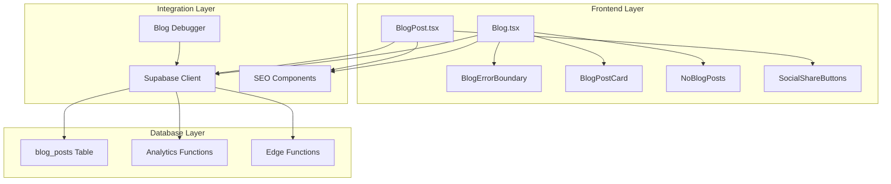

**Diagram sources**
- [Blog.tsx](file://src/pages/Blog.tsx#L1-L239)
- [BlogPost.tsx](file://src/pages/BlogPost.tsx#L1-L252)
- [BlogErrorBoundary.tsx](file://src/components/blog/BlogErrorBoundary.tsx#L1-L175)

## Core Components

### Blog Page Component

The main Blog page serves as the entry point for displaying all published blog posts. It implements sophisticated state management and error handling:

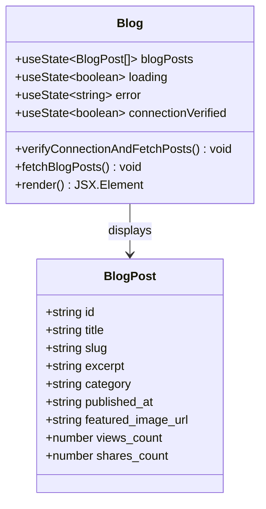

**Diagram sources**
- [Blog.tsx](file://src/pages/Blog.tsx#L18-L28)
- [Blog.tsx](file://src/pages/Blog.tsx#L30-L239)

### Blog Post Card Component

The BlogPostCard component provides a standardized display format for individual blog posts with interactive elements:

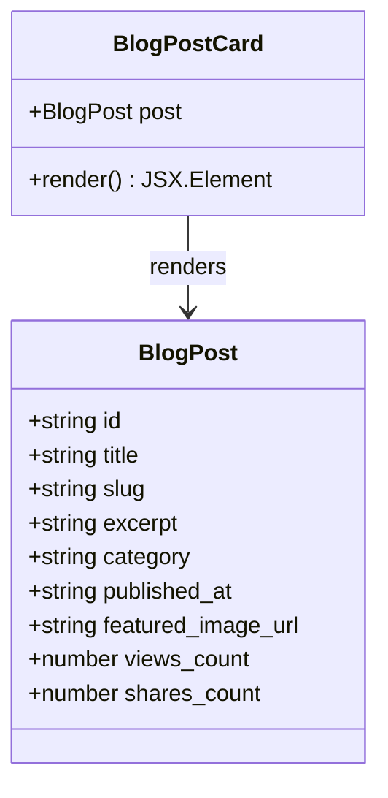

**Diagram sources**
- [BlogPostCard.tsx](file://src/components/blog/BlogPostCard.tsx#L7-L17)
- [BlogPostCard.tsx](file://src/components/blog/BlogPostCard.tsx#L23-L72)

### Error Boundary Component

The BlogErrorBoundary provides comprehensive error handling with graceful degradation:

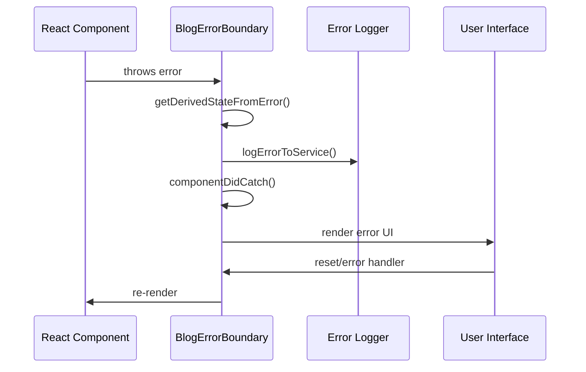

**Diagram sources**
- [BlogErrorBoundary.tsx](file://src/components/blog/BlogErrorBoundary.tsx#L29-L82)

**Section sources**
- [Blog.tsx](file://src/pages/Blog.tsx#L1-L239)
- [BlogPostCard.tsx](file://src/components/blog/BlogPostCard.tsx#L1-L72)
- [BlogErrorBoundary.tsx](file://src/components/blog/BlogErrorBoundary.tsx#L1-L175)

## Database Integration

### Supabase Configuration

The system integrates with Supabase for database operations and real-time features:

| Configuration Parameter | Environment Variable | Purpose |
|------------------------|---------------------|---------|
| VITE_SUPABASE_URL | Supabase Project URL | Database endpoint |
| VITE_SUPABASE_PUBLISHABLE_KEY | Public API key | Client-side access |
| Storage | LocalStorage | Session persistence |
| Auto Refresh Token | Enabled | Automatic authentication refresh |

### Database Schema

The blog system utilizes a comprehensive database schema optimized for content management:

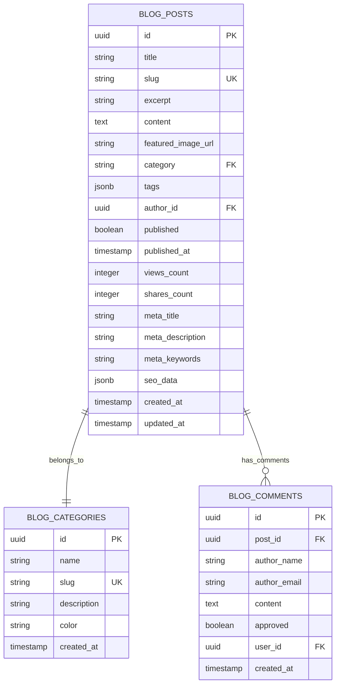

**Diagram sources**
- [database.ts](file://src/types/database.ts#L115-L136)

### Data Fetching Operations

The system implements efficient data fetching with multiple query strategies:

| Operation | Query Method | Purpose | Error Handling |
|-----------|-------------|---------|---------------|
| Connection Verification | `SELECT count(*) FROM blog_posts` | Health check | Immediate failure detection |
| Published Posts | `.select('*').eq('published', true)` | Frontend display | Graceful fallback |
| Single Post | `.select('*').eq('slug', slug).single()` | Individual articles | 404 handling |
| View Tracking | `RPC increment_blog_views` | Analytics | Silent failure |

**Section sources**
- [client.ts](file://src/integrations/supabase/client.ts#L1-L20)
- [database.ts](file://src/types/database.ts#L115-L136)
- [Blog.tsx](file://src/pages/Blog.tsx#L40-L122)

## Error Handling and Diagnostics

### Comprehensive Error Boundaries

The blog system implements multi-layered error handling:

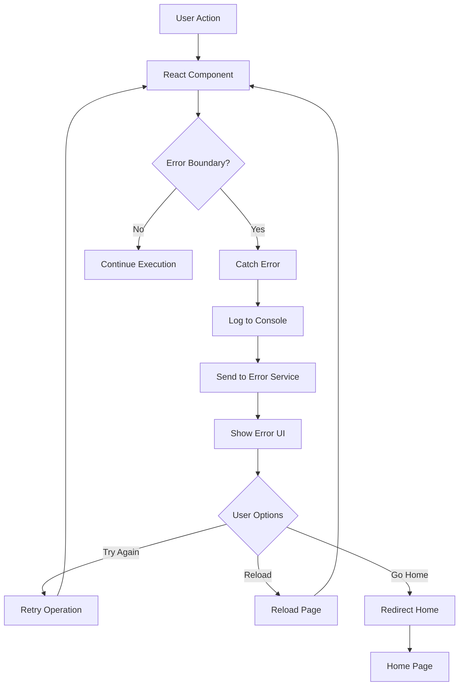

**Diagram sources**
- [BlogErrorBoundary.tsx](file://src/components/blog/BlogErrorBoundary.tsx#L89-L170)

### Blog Debugger Tools

The blogDebugger provides comprehensive diagnostic capabilities:

| Diagnostic Area | Checks Performed | Purpose |
|----------------|------------------|---------|
| Connection Status | Supabase URL, Anonymous Key | Verify database connectivity |
| Database Health | Simple query execution | Confirm database accessibility |
| Data Integrity | Post count, format validation | Ensure data consistency |
| Permissions | Read/write access testing | Verify user permissions |
| Query Performance | Execution time monitoring | Optimize slow queries |

### Error Recovery Strategies

The system implements several error recovery mechanisms:

1. **Connection Retry Logic**: Automatic retry with exponential backoff
2. **Graceful Degradation**: Fallback to cached or static content
3. **User Feedback**: Clear error messages with actionable solutions
4. **Logging Integration**: Comprehensive error tracking for debugging

**Section sources**
- [BlogErrorBoundary.tsx](file://src/components/blog/BlogErrorBoundary.tsx#L1-L175)
- [blogDebugger.ts](file://src/lib/blogDebugger.ts#L1-L246)

## SEO Implementation

### Structured SEO Configuration

The blog system implements comprehensive SEO optimization:

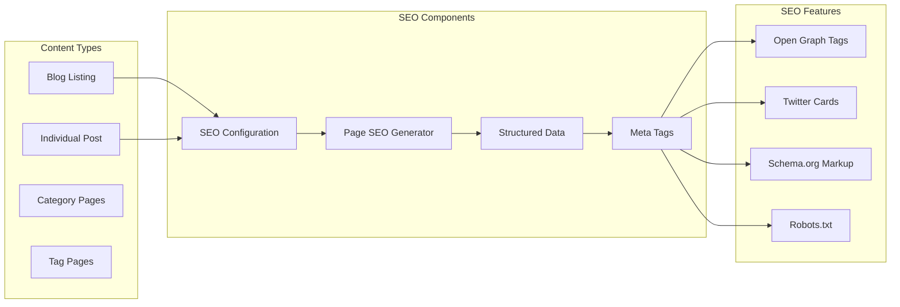

**Diagram sources**
- [seo.ts](file://src/lib/seo.ts#L18-L192)
- [SEO.tsx](file://src/components/SEO.tsx#L23-L105)

### Dynamic SEO Generation

The system generates SEO metadata dynamically based on content:

| SEO Element | Source Data | Dynamic Generation |
|-------------|-------------|-------------------|
| Title | Post title + Site name | `${title} \| Sleek Apparels` |
| Description | Post excerpt/meta description | Truncated to 160 chars |
| Canonical URL | Post slug + domain | `https://sleekapparels.com/blog/{slug}` |
| OG Image | Featured image URL | Default fallback image |
| Schema Markup | Post data + author info | Article schema with breadcrumbs |

### Structured Data Implementation

The blog implements rich structured data for improved search visibility:

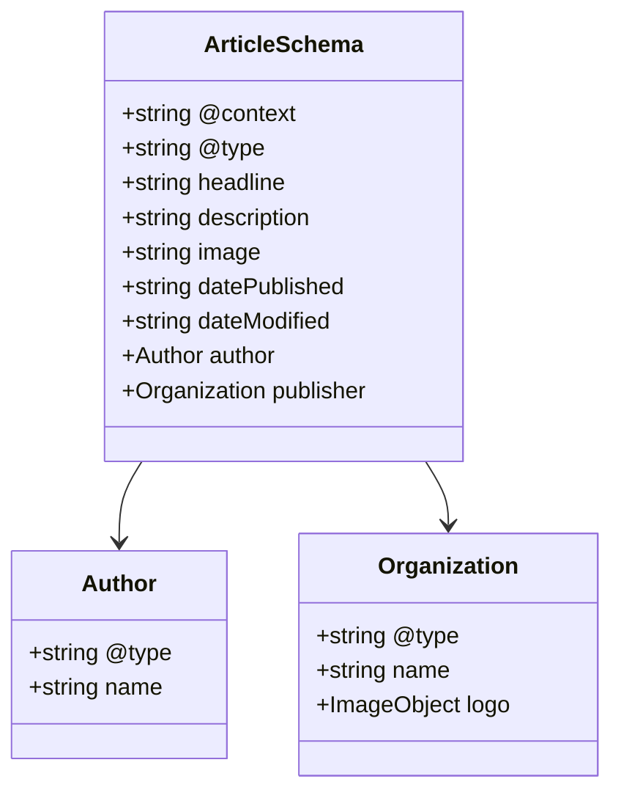

**Diagram sources**
- [SEO.tsx](file://src/components/SEO.tsx#L227-L255)

**Section sources**
- [seo.ts](file://src/lib/seo.ts#L1-L293)
- [SEO.tsx](file://src/components/SEO.tsx#L1-L255)
- [BlogPost.tsx](file://src/pages/BlogPost.tsx#L94-L119)

## Content Management Features

### Social Sharing Integration

The SocialShareButtons component provides comprehensive social media sharing capabilities:

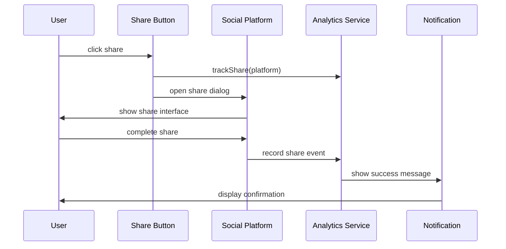

**Diagram sources**
- [SocialShareButtons.tsx](file://src/components/blog/SocialShareButtons.tsx#L17-L137)

### Analytics Tracking

The system implements comprehensive analytics for content performance:

| Metric | Tracking Method | Purpose |
|--------|----------------|---------|
| Views | RPC function call | Monitor content popularity |
| Shares | Edge function invocation | Measure content virality |
| Engagement | Click tracking | Understand user behavior |
| Referral Sources | URL parameters | Track traffic sources |

### Content Validation

The system implements robust content validation:

1. **Data Type Validation**: Ensures proper data types for all fields
2. **Format Validation**: Validates URLs, dates, and content formats
3. **Content Sanitization**: Prevents XSS attacks in HTML content
4. **Required Field Validation**: Ensures essential fields are present

**Section sources**
- [SocialShareButtons.tsx](file://src/components/blog/SocialShareButtons.tsx#L1-L137)
- [BlogPost.tsx](file://src/pages/BlogPost.tsx#L205-L213)

## Responsive Design and Layout

### Grid Layout System

The blog implements a responsive grid system optimized for content consumption:

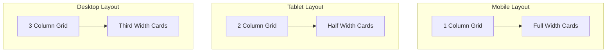

### Loading States

The system provides comprehensive loading state management:

| State | Visual Indicator | User Action | Fallback Behavior |
|-------|-----------------|-------------|------------------|
| Initial Load | Spinner animation | Wait for content | Static loading screen |
| Network Error | Error card with retry | Manual retry | Offline mode |
| Empty State | NoBlogPosts component | Subscribe or explore | Alternative content |
| Slow Loading | Progressive loading | Cancel or continue | Partial content |

### Accessibility Features

The blog system implements comprehensive accessibility features:

1. **Semantic HTML**: Proper heading hierarchy and element usage
2. **Keyboard Navigation**: Full keyboard accessibility for all interactive elements
3. **Screen Reader Support**: ARIA labels and roles for assistive technologies
4. **Color Contrast**: High contrast ratios for text and background combinations
5. **Focus Management**: Clear focus indicators and logical tab order

**Section sources**
- [Blog.tsx](file://src/pages/Blog.tsx#L142-L227)
- [NoBlogPosts.tsx](file://src/components/blog/NoBlogPosts.tsx#L1-L117)

## Performance Optimization

### Lazy Loading Implementation

The system implements intelligent lazy loading for optimal performance:

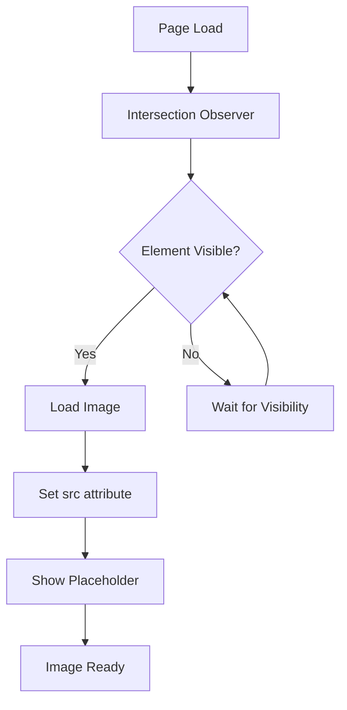

### Caching Strategies

The blog implements multiple caching layers:

1. **Browser Cache**: Static assets cached for offline access
2. **CDN Cache**: Global distribution of static content
3. **Database Cache**: Query result caching for frequently accessed data
4. **Component Cache**: React component memoization for expensive renders

### Performance Monitoring

The system includes built-in performance monitoring:

| Metric | Measurement Method | Threshold | Action |
|--------|-------------------|-----------|--------|
| Load Time | Performance API | >2 seconds | Show loading indicator |
| Error Rate | Error boundary tracking | >5% | Trigger diagnostics |
| Memory Usage | Memory API | >100MB | Cleanup unused components |
| Network Latency | Fetch timing | >1 second | Retry with backoff |

**Section sources**
- [Blog.tsx](file://src/pages/Blog.tsx#L187-L191)
- [BlogPost.tsx](file://src/pages/BlogPost.tsx#L196-L202)

## Troubleshooting Guide

### Common Issues and Solutions

#### Database Connectivity Problems

**Symptoms**: Error messages about database connection failures
**Diagnosis Steps**:
1. Check Supabase dashboard status
2. Verify environment variables
3. Test connection with blogDebugger
4. Review network connectivity

**Resolution**:
```typescript
// Use blogDebugger to diagnose issues
await runBlogDiagnostics();
```

#### Content Loading Failures

**Symptoms**: Blank pages or error messages when loading blog posts
**Diagnosis**:
1. Check browser console for JavaScript errors
2. Verify network requests in developer tools
3. Test with different browsers/devices
4. Review server logs for backend issues

#### SEO Configuration Issues

**Symptoms**: Missing meta tags or incorrect social media previews
**Diagnosis**:
1. Verify SEO configuration in getPageSEO
2. Check structured data validation
3. Test with SEO analysis tools
4. Review canonical URL implementation

### Diagnostic Tools

The blogDebugger provides comprehensive diagnostic capabilities:

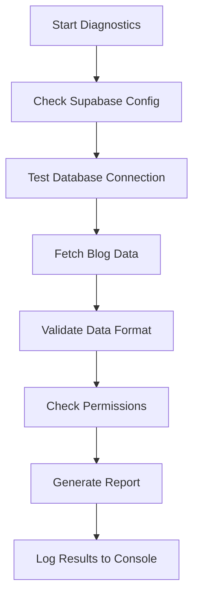

**Diagram sources**
- [blogDebugger.ts](file://src/lib/blogDebugger.ts#L231-L246)

### Development Mode Features

During development, the system provides enhanced debugging capabilities:

1. **Console Logging**: Detailed operation logs with timestamps
2. **Error Stack Traces**: Complete error context and call stacks
3. **Performance Metrics**: Timing information for all operations
4. **State Inspection**: Real-time component state monitoring

### Production Monitoring

In production, the system implements:

1. **Error Reporting**: Automated error tracking to monitoring services
2. **Performance Alerts**: Notifications for degraded performance
3. **User Experience Tracking**: Heatmaps and user interaction analytics
4. **Content Delivery Monitoring**: CDN and asset delivery tracking

**Section sources**
- [blogDebugger.ts](file://src/lib/blogDebugger.ts#L231-L246)
- [BlogErrorBoundary.tsx](file://src/components/blog/BlogErrorBoundary.tsx#L55-L74)