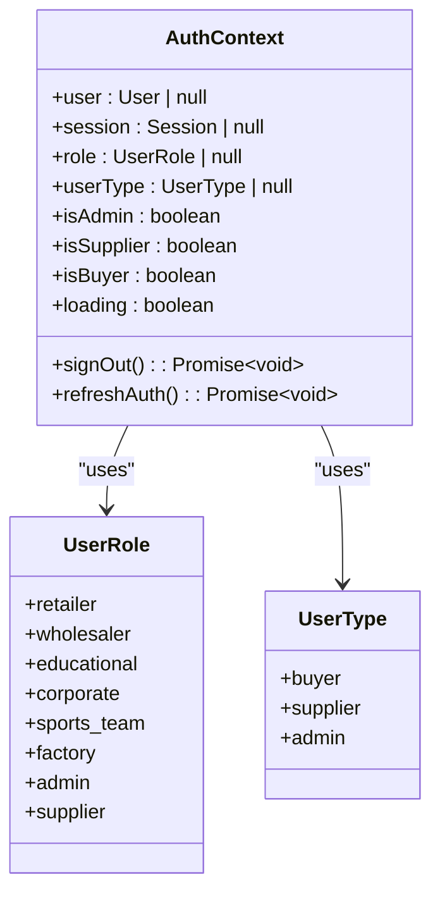
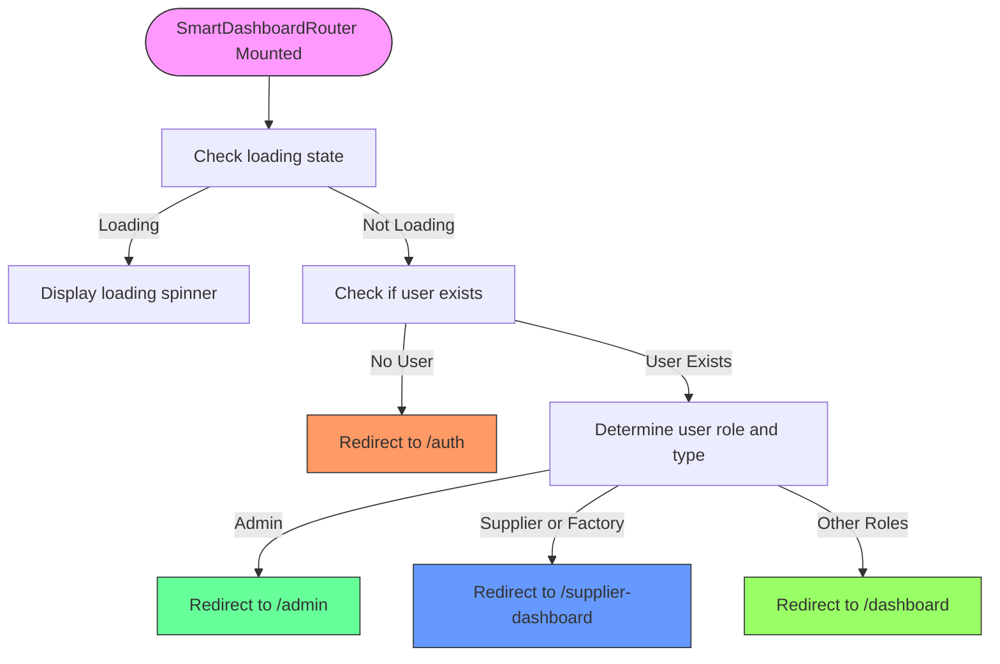
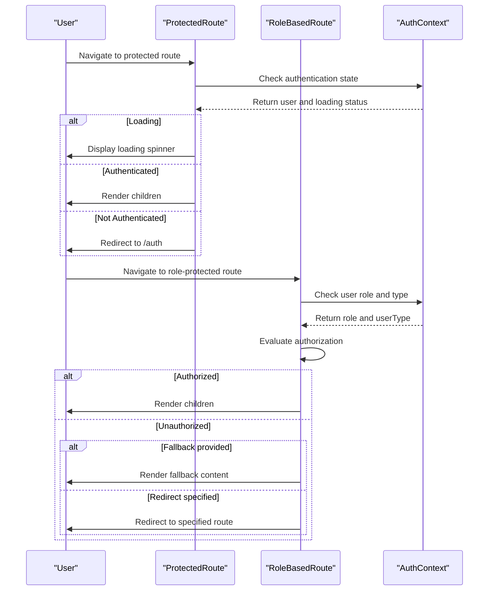

# Dashboard Routing and Authentication Flow

<cite>
**Referenced Files in This Document**   
- [SmartDashboardRouter.tsx](file://src/components/SmartDashboardRouter.tsx)
- [ProtectedRoute.tsx](file://src/components/routes/ProtectedRoute.tsx)
- [RoleBasedRoute.tsx](file://src/components/routes/RoleBasedRoute.tsx)
- [AuthContext.tsx](file://src/contexts/AuthContext.tsx)
- [App.tsx](file://src/App.tsx)
- [ModernBuyerDashboard.tsx](file://src/pages/ModernBuyerDashboard.tsx)
- [ModernSupplierDashboard.tsx](file://src/pages/ModernSupplierDashboard.tsx)
- [ModernAdminDashboard.tsx](file://src/pages/ModernAdminDashboard.tsx)
</cite>

## Table of Contents
1. [Introduction](#introduction)
2. [Authentication Context and State Management](#authentication-context-and-state-management)
3. [Smart Dashboard Router Implementation](#smart-dashboard-router-implementation)
4. [Protected Route Components](#protected-route-components)
5. [Role-Based Access Control](#role-based-access-control)
6. [Routing Flow and Dashboard Integration](#routing-flow-and-dashboard-integration)
7. [Error Handling and Loading States](#error-handling-and-loading-states)
8. [Security Considerations](#security-considerations)

## Introduction
The dashboard routing system in the Sleek Apparels application implements a sophisticated role-based routing mechanism that directs authenticated users to their appropriate dashboards based on their user type and role. This system combines authentication state management with protected routing components to ensure secure access to role-specific functionality. The architecture leverages React Context for authentication state, React Router for navigation, and custom route components for access control.

**Section sources**
- [SmartDashboardRouter.tsx](file://src/components/SmartDashboardRouter.tsx#L1-L49)
- [AuthContext.tsx](file://src/contexts/AuthContext.tsx#L1-L166)

## Authentication Context and State Management

The authentication system is built around the AuthContext which provides a centralized state management solution for user authentication data. This context maintains critical user information including the user object, session data, role, user type, and authentication status.

The AuthContext exposes several key properties:
- **user**: The authenticated user object from Supabase
- **session**: The current authentication session
- **role**: The specific user role (retailer, wholesaler, factory, admin, supplier, etc.)
- **userType**: The broader user category (buyer, supplier, admin)
- **loading**: A boolean indicating authentication state loading status
- **isAdmin**, **isSupplier**, **isBuyer**: Convenience boolean flags for role checking

The context automatically handles authentication state changes through Supabase's auth listeners, ensuring the application responds immediately to login, logout, or session expiration events. When a user authenticates, the system retrieves their role from the database and determines their user type based on role hierarchy.



**Diagram sources**
- [AuthContext.tsx](file://src/contexts/AuthContext.tsx#L5-L150)

**Section sources**
- [AuthContext.tsx](file://src/contexts/AuthContext.tsx#L1-L166)

## Smart Dashboard Router Implementation

The SmartDashboardRouter component serves as the central routing mechanism that directs users to their appropriate dashboards after authentication. This component uses the authentication context to determine the user's role and type, then navigates to the corresponding dashboard route.

The implementation follows a clear decision tree:
1. Wait for authentication state to load
2. If no user is authenticated, redirect to the authentication page
3. Based on user role and type, redirect to the appropriate dashboard:
   - Admin users (role: admin) → Admin dashboard
   - Supplier users (role: supplier or factory) → Supplier dashboard
   - All other users → Buyer dashboard

The component displays a loading state with a spinner while determining the appropriate route, providing visual feedback to the user during the redirection process.



**Diagram sources**
- [SmartDashboardRouter.tsx](file://src/components/SmartDashboardRouter.tsx#L6-L37)

**Section sources**
- [SmartDashboardRouter.tsx](file://src/components/SmartDashboardRouter.tsx#L1-L49)

## Protected Route Components

The application implements two layers of route protection through specialized components: ProtectedRoute and RoleBasedRoute. These components wrap protected routes and ensure only authorized users can access them.

### ProtectedRoute Component
The ProtectedRoute component provides basic authentication protection, ensuring that only authenticated users can access the wrapped content. It displays a loading spinner while authentication state is being determined and redirects unauthenticated users to the authentication page.

### RoleBasedRoute Component
The RoleBasedRoute component adds an additional layer of authorization by checking user roles and types. It supports multiple authorization strategies:
- **allowedRoles**: Specific roles that can access the route
- **allowedUserTypes**: Broader user categories that can access the route
- **fallback**: Optional content to display when user is unauthorized
- **redirectTo**: Alternative route for unauthorized users

The component evaluates both role and user type conditions, requiring the user to satisfy all specified conditions to gain access.



**Diagram sources**
- [ProtectedRoute.tsx](file://src/components/routes/ProtectedRoute.tsx#L1-L36)
- [RoleBasedRoute.tsx](file://src/components/routes/RoleBasedRoute.tsx#L1-L60)

**Section sources**
- [ProtectedRoute.tsx](file://src/components/routes/ProtectedRoute.tsx#L1-L36)
- [RoleBasedRoute.tsx](file://src/components/routes/RoleBasedRoute.tsx#L1-L60)

## Role-Based Access Control

The role-based access control system implements a hierarchical permission model that determines dashboard access based on user roles and types. The system defines three primary user types with distinct dashboard experiences:

### User Type Hierarchy
- **Admin**: Full system access with management capabilities
- **Supplier**: Factory and production management interface
- **Buyer**: Order management and purchasing interface

The RoleBasedRoute component enforces these access rules throughout the application, wrapping dashboard routes with appropriate authorization requirements. For example:
- Admin routes require the 'admin' role
- Supplier routes require the 'supplier' user type
- Buyer routes require the 'buyer' user type

This approach ensures that users can only access functionality relevant to their role, preventing unauthorized access to sensitive operations.

```mermaid
graph TD
A[User] --> B{Authentication}
B --> |Success| C{Role/Type Check}
B --> |Failure| D[Redirect to /auth]
C --> |Admin| E[Admin Dashboard]
C --> |Supplier| F[Supplier Dashboard]
C --> |Buyer| G[Buyer Dashboard]
E --> H[Admin Routes]
F --> I[Supplier Routes]
G --> J[Buyer Routes]
H --> K[/admin/*]
I --> L[/supplier-dashboard/*]
J --> M[/dashboard/*]
style E fill:#ff9999,stroke:#333
style F fill:#99ff99,stroke:#333
style G fill:#9999ff,stroke:#333
```

**Diagram sources**
- [App.tsx](file://src/App.tsx#L214-L243)
- [RoleBasedRoute.tsx](file://src/components/routes/RoleBasedRoute.tsx#L1-L60)

**Section sources**
- [App.tsx](file://src/App.tsx#L214-L243)

## Routing Flow and Dashboard Integration

The complete routing flow integrates authentication, role determination, and dashboard redirection into a seamless user experience. When a user accesses the application, the following sequence occurs:

1. The application checks authentication status through AuthContext
2. If authenticated, the user's role is retrieved from the database
3. The user type is determined based on their role
4. The SmartDashboardRouter directs the user to their appropriate dashboard
5. Protected routes ensure ongoing access control

The dashboard integration is implemented through specific route definitions in the application router. Each dashboard has multiple entry points and related routes that are protected by the appropriate authorization components.

### Dashboard Route Structure
- **Buyer Dashboard**: `/dashboard`, `/buyer-dashboard-modern`
- **Supplier Dashboard**: `/supplier-dashboard`, `/supplier-dashboard-modern`
- **Admin Dashboard**: `/admin`

Related functionality routes are also protected by role-based access, ensuring that features like order management, analytics, and supplier verification are only accessible to authorized users.

**Section sources**
- [App.tsx](file://src/App.tsx#L211-L243)
- [SmartDashboardRouter.tsx](file://src/components/SmartDashboardRouter.tsx#L1-L49)

## Error Handling and Loading States

The routing system implements comprehensive error handling and loading state management to provide a smooth user experience. Each component handles various states appropriately:

### Loading States
- During authentication checks, a spinner is displayed
- The SmartDashboardRouter shows a "Redirecting to your dashboard..." message
- Protected routes display a loading spinner while determining access

### Error Scenarios
- No active session: Redirect to authentication page
- Unauthorized access: Redirect to unauthorized page or show fallback content
- Authentication errors: Handled by the AuthContext with appropriate logging

The system gracefully handles edge cases such as role retrieval delays by waiting for the loading state to complete before making routing decisions. This prevents race conditions and ensures users are directed to the correct dashboard.

**Section sources**
- [SmartDashboardRouter.tsx](file://src/components/SmartDashboardRouter.tsx#L38-L47)
- [ProtectedRoute.tsx](file://src/components/routes/ProtectedRoute.tsx#L21-L27)
- [RoleBasedRoute.tsx](file://src/components/routes/RoleBasedRoute.tsx#L26-L31)

## Security Considerations

The routing and authentication system incorporates several security measures to protect against unauthorized access:

1. **Client-Side Validation**: All protected routes verify authentication and authorization before rendering content
2. **Role-Based Access**: Fine-grained control over who can access specific routes
3. **Session Management**: Integration with Supabase authentication for secure session handling
4. **Redirect Protection**: Preserving the original location when redirecting to authentication
5. **Type Safety**: TypeScript interfaces ensure proper data typing and reduce vulnerabilities

The system follows the principle of least privilege, ensuring users only have access to the functionality required for their role. Additionally, the use of React Router's Navigate component with replace=true prevents users from navigating back to protected routes after logout.

**Section sources**
- [ProtectedRoute.tsx](file://src/components/routes/ProtectedRoute.tsx#L30-L32)
- [RoleBasedRoute.tsx](file://src/components/routes/RoleBasedRoute.tsx#L51-L56)
- [AuthContext.tsx](file://src/contexts/AuthContext.tsx#L125-L145)