# Order Details Page

<cite>
**Referenced Files in This Document**
- [OrderDetails.tsx](file://src/pages/OrderDetails.tsx)
- [AIInsightsCard.tsx](file://src/components/AIInsightsCard.tsx)
- [ProductionUpdateForm.tsx](file://src/components/ProductionUpdateForm.tsx)
- [QCCheckForm.tsx](file://src/components/QCCheckForm.tsx)
- [ProductionTimeline.tsx](file://src/components/ProductionTimeline.tsx)
- [ProductionUpdatesFeed.tsx](file://src/components/ProductionUpdatesFeed.tsx)
- [QCChecksList.tsx](file://src/components/QCChecksList.tsx)
- [order.ts](file://src/types/order.ts)
- [AuthContext.tsx](file://src/contexts/AuthContext.tsx)
- [useAdminAuth.ts](file://src/hooks/useAdminAuth.ts)
- [use-mobile.tsx](file://src/hooks/use-mobile.tsx)
</cite>

## Table of Contents
1. [Introduction](#introduction)
2. [Page Architecture](#page-architecture)
3. [Core Components](#core-components)
4. [Data Management](#data-management)
5. [User Role Permissions](#user-role-permissions)
6. [Real-Time Features](#real-time-features)
7. [Responsive Design](#responsive-design)
8. [AI Insights Integration](#ai-insights-integration)
9. [Quality Control System](#quality-control-system)
10. [Production Tracking](#production-tracking)
11. [Error Handling](#error-handling)
12. [Performance Considerations](#performance-considerations)

## Introduction

The Order Details page serves as the central hub for comprehensive order management and monitoring within the Sleek Apparels platform. This sophisticated React component provides buyers, factories, and administrators with real-time visibility into order progress, production updates, quality control checks, and intelligent insights powered by AI analytics.

The page implements a modern, responsive design that adapts seamlessly across desktop, tablet, and mobile devices while maintaining optimal usability for different user roles. It integrates multiple specialized components to deliver a unified order management experience with advanced features for production oversight and quality assurance.

## Page Architecture

The Order Details page follows a modular architecture pattern with clear separation of concerns across multiple specialized components:

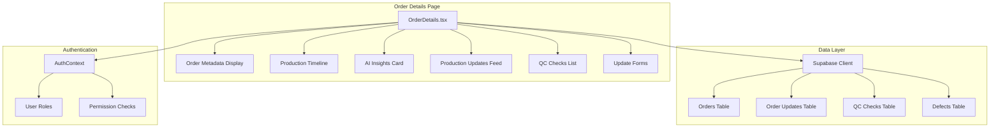

**Diagram sources**
- [OrderDetails.tsx](file://src/pages/OrderDetails.tsx#L38-L262)
- [AuthContext.tsx](file://src/contexts/AuthContext.tsx#L40-L166)

**Section sources**
- [OrderDetails.tsx](file://src/pages/OrderDetails.tsx#L1-L262)

## Core Components

### Order Metadata Display

The page begins with a comprehensive order metadata display that presents essential order information in a clean, organized layout:

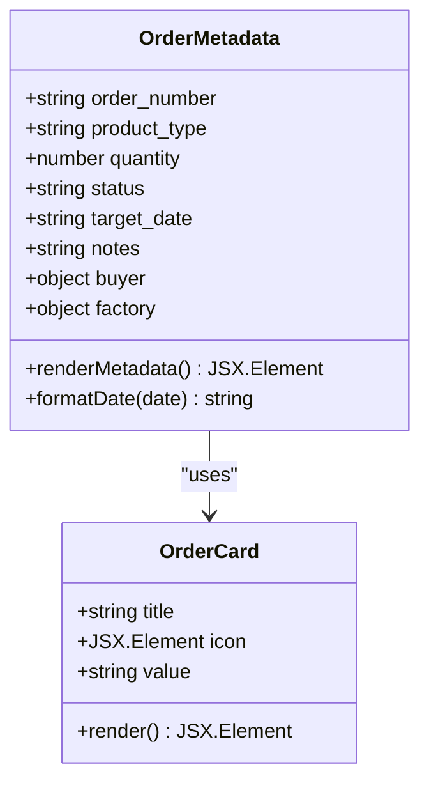

**Diagram sources**
- [OrderDetails.tsx](file://src/pages/OrderDetails.tsx#L170-L216)

The metadata display includes:
- **Order Number and Status**: Primary identification with status badges
- **Product Information**: Type and quantity details
- **Timeline Information**: Target delivery date with formatted display
- **Stakeholder Information**: Buyer and factory company details
- **Order Notes**: Additional contextual information

### Production Timeline Visualization

The production timeline component provides a visual representation of the manufacturing process stages:

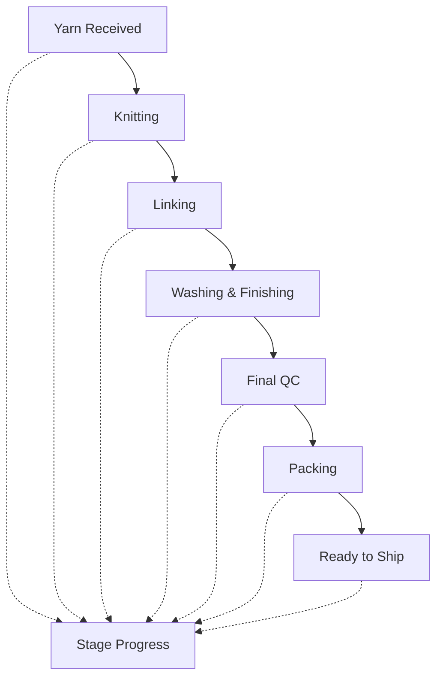

**Diagram sources**
- [ProductionTimeline.tsx](file://src/components/ProductionTimeline.tsx#L19-L31)

**Section sources**
- [OrderDetails.tsx](file://src/pages/OrderDetails.tsx#L227-L230)
- [ProductionTimeline.tsx](file://src/components/ProductionTimeline.tsx#L1-L128)

## Data Management

### Order Data Structure

The page manages complex order data through a well-defined TypeScript interface:

| Field | Type | Description | Usage |
|-------|------|-------------|-------|
| `id` | string | Unique order identifier | Primary key for all operations |
| `order_number` | string | Human-readable order reference | Display and search |
| `product_type` | string | Category of manufactured goods | Filtering and categorization |
| `quantity` | number | Total units ordered | Production planning |
| `status` | string | Current order lifecycle stage | Status indicators |
| `target_date` | string \| null | Expected delivery date | Timeline tracking |
| `notes` | string \| null | Additional order information | Contextual data |
| `current_stage` | ProductionStage | Active manufacturing stage | Timeline progression |
| `stage_progress` | Record<ProductionStage, number> | Completion percentages | Progress visualization |
| `buyer` | object | Order requester information | Stakeholder identification |
| `factory` | object \| null | Manufacturing partner details | Partner management |

### Data Fetching Strategy

The page implements a sophisticated data fetching strategy with multiple concurrent requests:

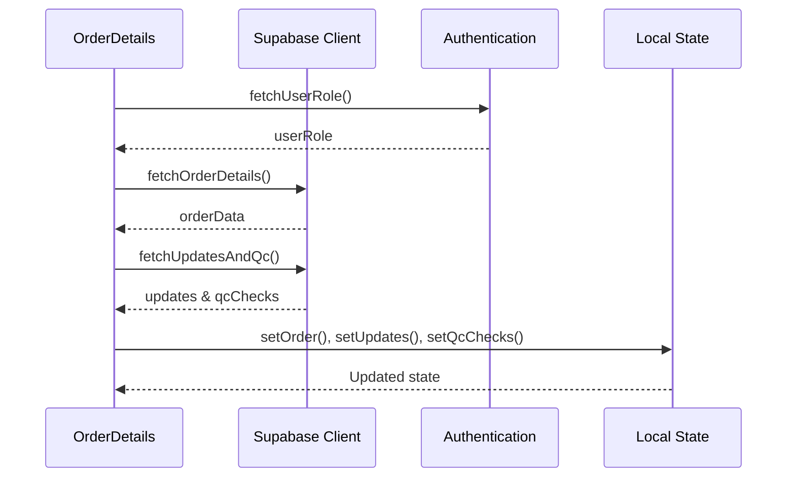

**Diagram sources**
- [OrderDetails.tsx](file://src/pages/OrderDetails.tsx#L48-L131)

**Section sources**
- [OrderDetails.tsx](file://src/pages/OrderDetails.tsx#L17-L36)
- [OrderDetails.tsx](file://src/pages/OrderDetails.tsx#L73-L131)

## User Role Permissions

### Role-Based Access Control

The page implements granular permission controls based on user roles:

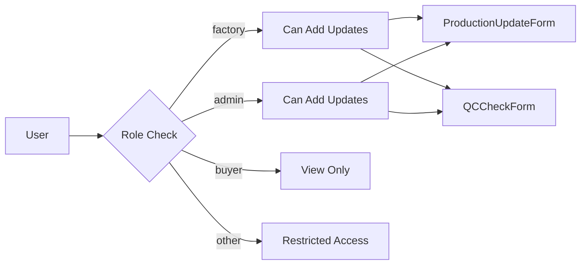

**Diagram sources**
- [OrderDetails.tsx](file://src/pages/OrderDetails.tsx#L155-L156)
- [AuthContext.tsx](file://src/contexts/AuthContext.tsx#L5-L13)

### Permission Implementation

The permission system operates through multiple layers:

| Role | Permissions | Form Access | Data Visibility |
|------|-------------|-------------|-----------------|
| Factory | Add production updates, QC checks | Yes | Full order details |
| Admin | Add production updates, QC checks | Yes | Full order details |
| Buyer | View only | No | Public order information |
| Other | Restricted | No | Limited access |

**Section sources**
- [OrderDetails.tsx](file://src/pages/OrderDetails.tsx#L46-L71)
- [AuthContext.tsx](file://src/contexts/AuthContext.tsx#L47-L65)

## Real-Time Features

### WebSocket Subscriptions

The page implements real-time functionality through Supabase's Postgres change notifications:

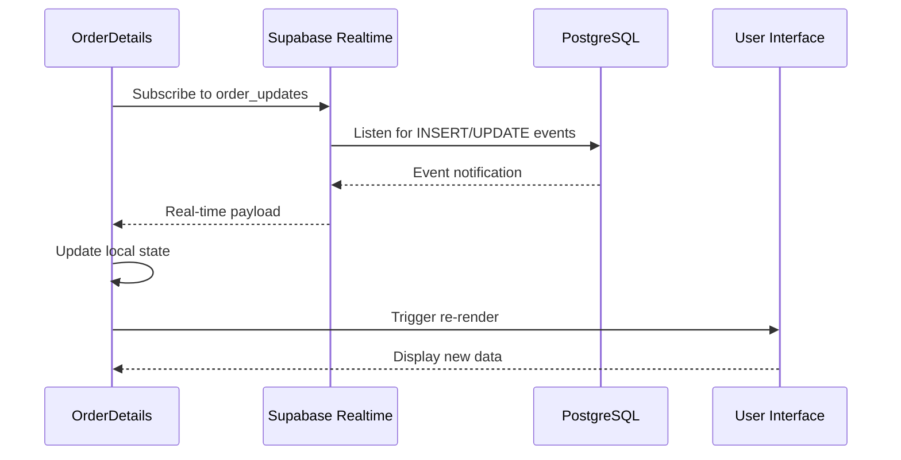

**Diagram sources**
- [ProductionUpdatesFeed.tsx](file://src/components/ProductionUpdatesFeed.tsx#L50-L131)

### Real-Time Update Mechanisms

The page features several real-time update mechanisms:

1. **Production Updates**: Immediate notification of new production stages
2. **QC Checks**: Real-time quality control record additions
3. **Status Changes**: Automatic order status updates
4. **Notification System**: Toast notifications for user feedback

**Section sources**
- [ProductionUpdatesFeed.tsx](file://src/components/ProductionUpdatesFeed.tsx#L50-L131)

## Responsive Design

### Mobile-First Approach

The page implements a mobile-first responsive design strategy:

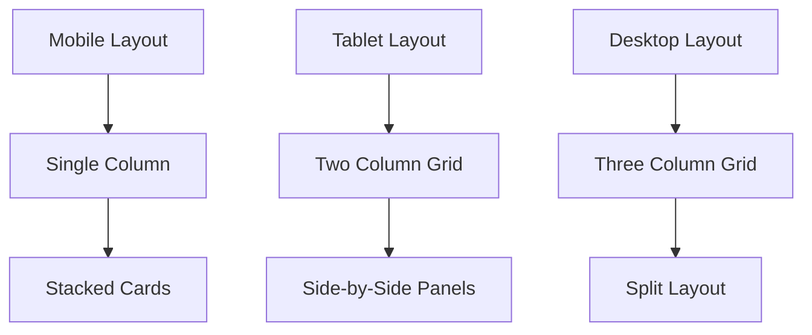

**Diagram sources**
- [OrderDetails.tsx](file://src/pages/OrderDetails.tsx#L219-L256)

### Breakpoint Strategy

The responsive system uses established breakpoints:

| Device Type | Breakpoint | Layout Pattern | Component Arrangement |
|-------------|------------|----------------|----------------------|
| Mobile | < 768px | Single column | Stacked vertically |
| Tablet | 768px - 1024px | Two column | Side-by-side panels |
| Desktop | > 1024px | Three column | Split layout |

**Section sources**
- [use-mobile.tsx](file://src/hooks/use-mobile.tsx#L1-L32)
- [OrderDetails.tsx](file://src/pages/OrderDetails.tsx#L219-L256)

## AI Insights Integration

### Intelligent Analysis Engine

The AI Insights Card provides automated analysis of order data:

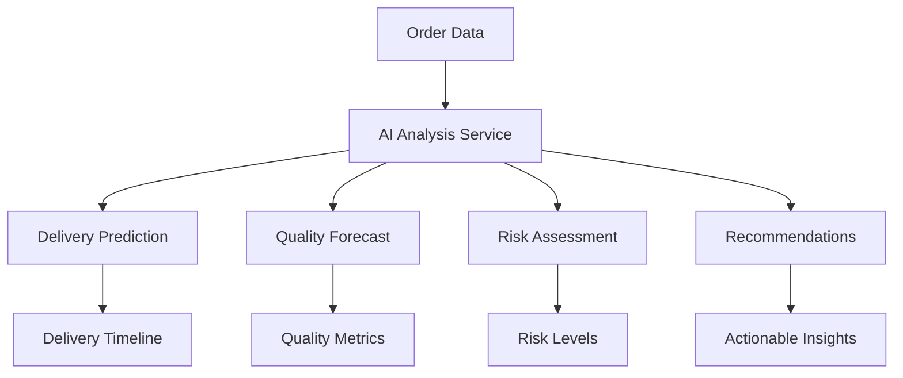

**Diagram sources**
- [AIInsightsCard.tsx](file://src/components/AIInsightsCard.tsx#L21-L32)

### AI Analysis Features

The AI system provides comprehensive insights:

| Analysis Type | Purpose | Output Format | Update Frequency |
|---------------|---------|---------------|------------------|
| Delivery Prediction | Estimate completion timeline | Text description | On-demand |
| Quality Forecast | Predict future quality trends | Confidence metrics | Real-time |
| Risk Assessment | Identify potential delays | Risk level (Low/Medium/High) | Continuous |
| Recommendations | Actionable suggestions | Bullet-point list | Dynamic |

**Section sources**
- [AIInsightsCard.tsx](file://src/components/AIInsightsCard.tsx#L1-L116)

## Quality Control System

### QC Check Management

The quality control system enables comprehensive inspection tracking:

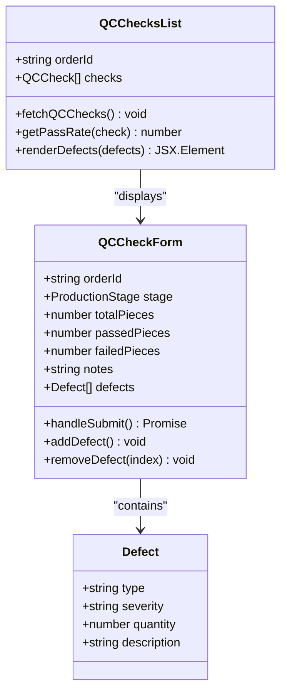

**Diagram sources**
- [QCCheckForm.tsx](file://src/components/QCCheckForm.tsx#L13-L23)
- [QCChecksList.tsx](file://src/components/QCChecksList.tsx#L9-L26)

### Defect Severity Classification

The system implements a three-tier defect severity model:

| Severity | Color | Impact Level | Action Required |
|----------|-------|--------------|-----------------|
| Minor | Yellow | Low impact | Monitor |
| Major | Orange | Moderate impact | Review |
| Critical | Red | High impact | Immediate action |

**Section sources**
- [QCCheckForm.tsx](file://src/components/QCCheckForm.tsx#L1-L277)
- [QCChecksList.tsx](file://src/components/QCChecksList.tsx#L1-L206)

## Production Tracking

### Update Submission System

The production update form enables detailed progress reporting:

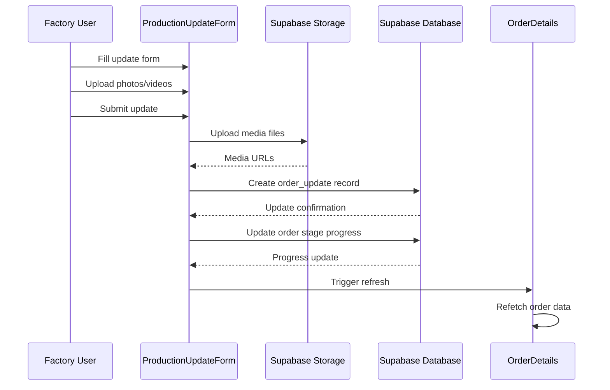

**Diagram sources**
- [ProductionUpdateForm.tsx](file://src/components/ProductionUpdateForm.tsx#L48-L99)

### Media Attachment Support

The update system supports comprehensive media uploads:

| Media Type | File Format | Maximum Files | Purpose |
|------------|-------------|---------------|---------|
| Images | JPEG, PNG, WebP | Multiple | Visual documentation |
| Videos | MP4, MOV | Multiple | Process demonstrations |
| Documents | PDF, DOCX | Multiple | Technical specifications |

**Section sources**
- [ProductionUpdateForm.tsx](file://src/components/ProductionUpdateForm.tsx#L1-L209)

## Error Handling

### Comprehensive Error Management

The page implements robust error handling across all components:

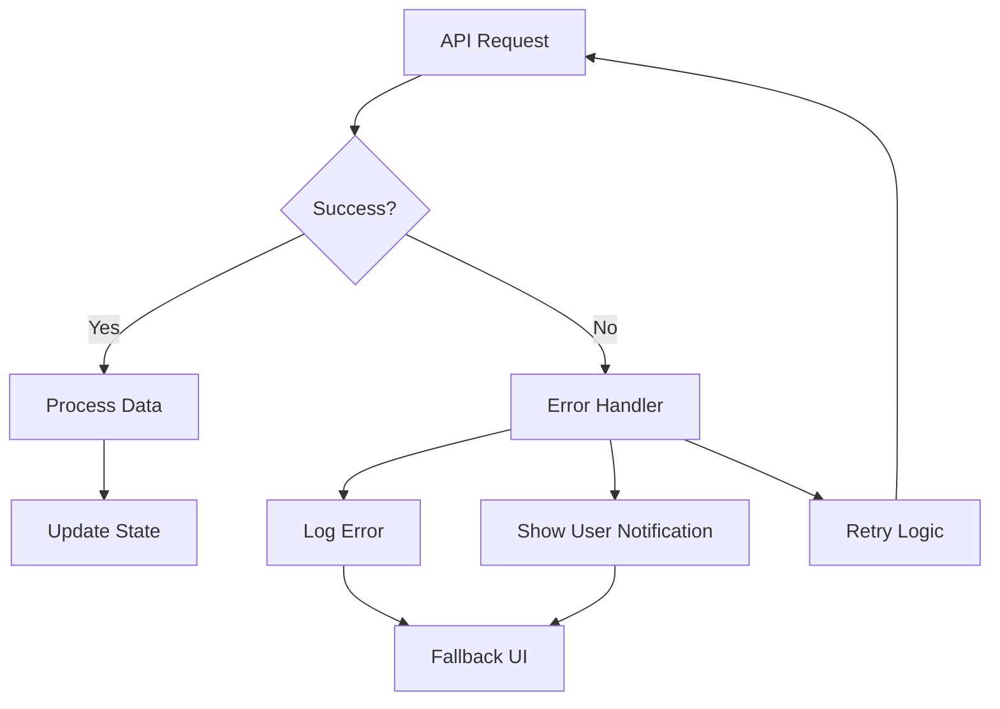

### Error Categories

The system handles multiple error scenarios:

| Error Type | Handling Strategy | User Feedback | Recovery Method |
|------------|-------------------|---------------|-----------------|
| Network Failure | Retry with exponential backoff | Offline indicator | Manual retry |
| Authentication | Redirect to login | Login prompt | Session refresh |
| Data Validation | Form validation errors | Inline error messages | User correction |
| Server Errors | Generic error message | Toast notification | System retry |

**Section sources**
- [OrderDetails.tsx](file://src/pages/OrderDetails.tsx#L107-L111)
- [AIInsightsCard.tsx](file://src/components/AIInsightsCard.tsx#L33-L42)

## Performance Considerations

### Optimization Strategies

The page implements several performance optimization techniques:

1. **Lazy Loading**: Components load only when needed
2. **Memoization**: Expensive calculations cached
3. **Efficient State Management**: Minimal re-renders
4. **Optimized Queries**: Selective data fetching
5. **Real-time Subscription Management**: Proper cleanup

### Memory Management

The system includes careful memory management practices:

- **Subscription Cleanup**: Real-time listeners removed on unmount
- **State Optimization**: Minimal state updates
- **Component Memoization**: Prevent unnecessary re-renders
- **Resource Cleanup**: Proper disposal of resources

**Section sources**
- [ProductionUpdatesFeed.tsx](file://src/components/ProductionUpdatesFeed.tsx#L127-L131)
- [OrderDetails.tsx](file://src/pages/OrderDetails.tsx#L48-L54)