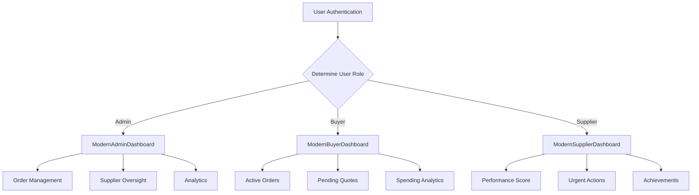
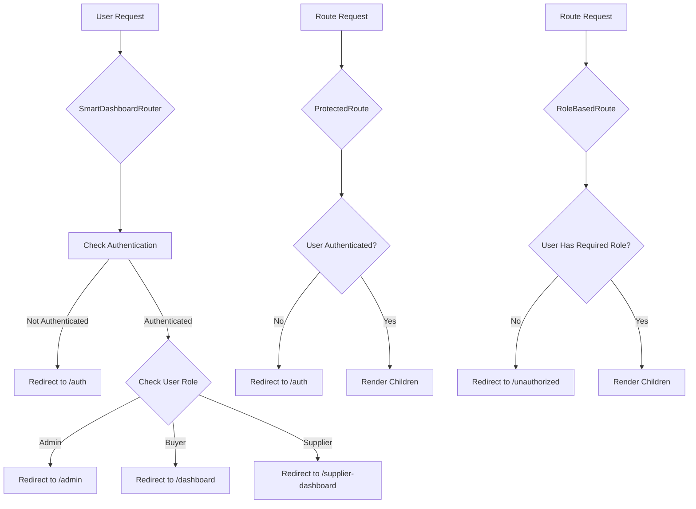
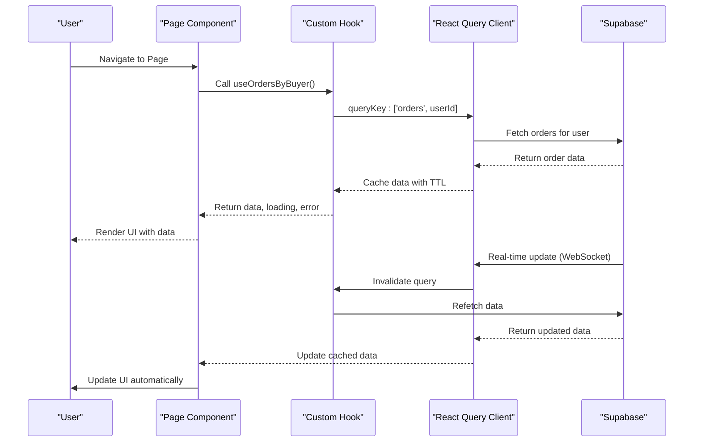
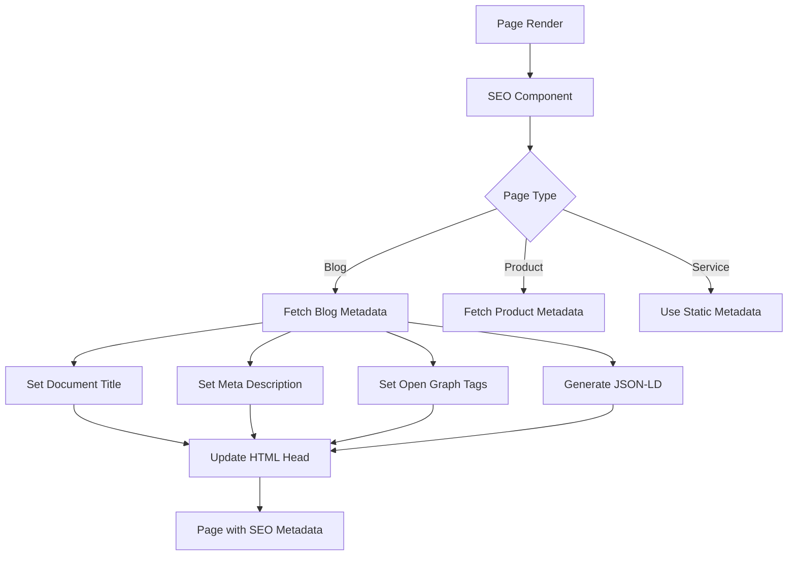
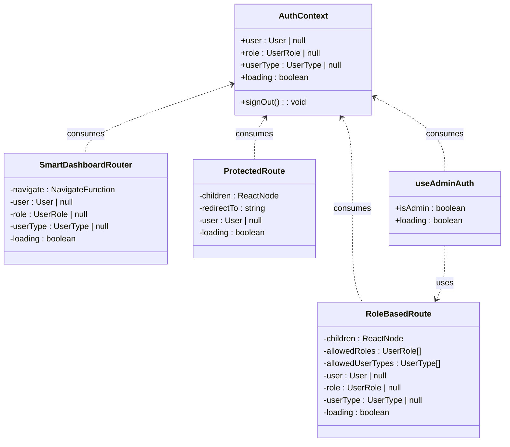

# Page Components and Route-Level Architecture

<cite>
**Referenced Files in This Document**   
- [QuoteGenerator.tsx](file://src/pages/QuoteGenerator.tsx)
- [ProductionTracking.tsx](file://src/pages/ProductionTracking.tsx)
- [ModernAdminDashboard.tsx](file://src/pages/ModernAdminDashboard.tsx)
- [ModernBuyerDashboard.tsx](file://src/pages/ModernBuyerDashboard.tsx)
- [ModernSupplierDashboard.tsx](file://src/pages/ModernSupplierDashboard.tsx)
- [SmartDashboardRouter.tsx](file://src/components/SmartDashboardRouter.tsx)
- [ProtectedRoute.tsx](file://src/components/routes/ProtectedRoute.tsx)
- [OrderDetails.tsx](file://src/pages/OrderDetails.tsx)
- [Blog.tsx](file://src/pages/Blog.tsx)
- [SEO.tsx](file://src/components/SEO.tsx)
- [useQuotes.ts](file://src/hooks/useQuotes.ts)
- [useOrders.ts](file://src/hooks/queries/useOrders.ts)
- [AuthContext.tsx](file://src/contexts/AuthContext.tsx)
</cite>

## Table of Contents
1. [Introduction](#introduction)
2. [Core Page Components](#core-page-components)
3. [Role-Specific Dashboards](#role-specific-dashboards)
4. [Layout Composition and Routing](#layout-composition-and-routing)
5. [Data Loading Patterns](#data-loading-patterns)
6. [Form Handling and User Interactions](#form-handling-and-user-interactions)
7. [SEO Implementation](#seo-implementation)
8. [Error Boundaries and Code Splitting](#error-boundaries-and-code-splitting)
9. [Mobile Responsiveness and Accessibility](#mobile-responsiveness-and-accessibility)
10. [Context and State Management](#context-and-state-management)
11. [Conclusion](#conclusion)

## Introduction
This document provides a comprehensive analysis of the page-level components and route-level architecture in the Sleek Apparels application. The pages directory contains route-level components that define user journeys and deliver tailored experiences based on user roles. The architecture leverages React Router for navigation, React Query for data management, and a sophisticated role-based access control system. Key pages include the AI-powered QuoteGenerator, real-time ProductionTracking, and role-specific dashboards for administrators, buyers, and suppliers. The system implements modern web practices including code splitting, error boundaries, SEO optimization, and responsive design to deliver a cohesive user experience across devices and user types.

## Core Page Components

The application's core functionality is delivered through specialized page components that serve distinct user needs. The QuoteGenerator.tsx component provides an AI-powered quoting experience that transforms natural language product descriptions into market-researched quotes with real-time pricing data. This page consumes the ConversationalQuoteBuilder component and implements SEO optimization through the SEO component with service schema markup. The ProductionTracking.tsx page delivers real-time manufacturing visibility with a comprehensive dashboard that displays order statistics, production timelines, and analytics. It implements real-time updates through Supabase's real-time subscriptions, allowing users to monitor production stage changes as they occur. Both pages follow a consistent layout pattern with Navbar, Footer, and FloatingContactWidget components, ensuring a cohesive user experience across the application.

**Section sources**
- [QuoteGenerator.tsx](file://src/pages/QuoteGenerator.tsx#L1-L42)
- [ProductionTracking.tsx](file://src/pages/ProductionTracking.tsx#L1-L540)

## Role-Specific Dashboards

The application delivers tailored experiences through role-specific dashboards that adapt to the user's identity and permissions. The ModernAdminDashboard provides administrators with comprehensive oversight of operations, suppliers, and orders through a feature-rich interface with multiple tabs for different administrative functions. It displays key metrics through StatCard components and provides quick access to critical actions like order management and supplier verification. The ModernBuyerDashboard offers buyers a streamlined view of their active orders, pending quotes, and spending patterns, with smart recommendations for reordering based on historical data. The ModernSupplierDashboard gamifies the supplier experience with a performance scoring system, tier benefits, and achievement tracking that incentivizes quality and timely delivery. Each dashboard consumes user role information from the AuthContext to determine the appropriate interface and functionality to display.

**Diagram sources**
- [ModernAdminDashboard.tsx](file://src/pages/ModernAdminDashboard.tsx#L1-L559)
- [ModernBuyerDashboard.tsx](file://src/pages/ModernBuyerDashboard.tsx#L1-L578)
- [ModernSupplierDashboard.tsx](file://src/pages/ModernSupplierDashboard.tsx#L1-L660)

**Section sources**
- [ModernAdminDashboard.tsx](file://src/pages/ModernAdminDashboard.tsx#L1-L559)
- [ModernBuyerDashboard.tsx](file://src/pages/ModernBuyerDashboard.tsx#L1-L578)
- [ModernSupplierDashboard.tsx](file://src/pages/ModernSupplierDashboard.tsx#L1-L660)

## Layout Composition and Routing

The application's routing architecture is built on React Router with a sophisticated composition of route protection and role-based access control. The SmartDashboardRouter component serves as a central routing mechanism that redirects users to their appropriate dashboard based on their role and user type. This component consumes authentication state from the AuthContext and performs client-side routing to ensure users are directed to the correct interface upon login or page refresh. The ProtectedRoute component wraps authenticated routes, verifying user authentication before rendering children and redirecting unauthenticated users to the login page. The RoleBasedRoute component provides granular access control by checking both user roles and types against specified permissions, allowing for fine-grained control over which users can access specific routes. This layered approach to routing ensures that users only access functionality appropriate to their permissions while maintaining a seamless navigation experience.

**Diagram sources**
- [SmartDashboardRouter.tsx](file://src/components/SmartDashboardRouter.tsx#L1-L49)
- [ProtectedRoute.tsx](file://src/components/routes/ProtectedRoute.tsx#L1-L36)
- [RoleBasedRoute.tsx](file://src/components/routes/RoleBasedRoute.tsx#L1-L59)

**Section sources**
- [SmartDashboardRouter.tsx](file://src/components/SmartDashboardRouter.tsx#L1-L49)
- [ProtectedRoute.tsx](file://src/components/routes/ProtectedRoute.tsx#L1-L36)
- [RoleBasedRoute.tsx](file://src/components/routes/RoleBasedRoute.tsx#L1-L59)

## Data Loading Patterns

The application implements efficient data loading patterns using React Query to manage server state and optimize data fetching. The useOrdersByBuyer and useOrdersByFactory hooks provide role-specific data access, fetching only the orders relevant to the current user's role while automatically handling loading and error states. The useQuotes hook manages quote data with appropriate filtering based on user permissions, ensuring that users only see quotes they are authorized to view. These custom hooks abstract the complexity of Supabase queries and provide a clean interface for components to consume data. The application also implements real-time data synchronization through Supabase's real-time subscriptions, particularly in the ProductionTracking page where production stage updates are pushed to clients as they occur in the database. This approach minimizes the need for manual refreshes and provides users with up-to-the-minute information on production status.

**Diagram sources**
- [useOrders.ts](file://src/hooks/queries/useOrders.ts)
- [useQuotes.ts](file://src/hooks/useQuotes.ts)
- [ProductionTracking.tsx](file://src/pages/ProductionTracking.tsx#L1-L540)

**Section sources**
- [useOrders.ts](file://src/hooks/queries/useOrders.ts)
- [useQuotes.ts](file://src/hooks/useQuotes.ts)
- [ProductionTracking.tsx](file://src/pages/ProductionTracking.tsx#L1-L540)

## Form Handling and User Interactions

Form handling in the application is implemented through dedicated components that manage complex user interactions while maintaining data integrity. The OrderDetails.tsx page demonstrates sophisticated form handling with multiple interactive elements including production update forms and quality check forms. These forms are conditionally rendered based on user role, with only factory and admin users able to submit updates. The form submission handlers trigger refetching of relevant data through React Query's invalidation mechanism, ensuring the UI stays synchronized with the latest data. The QuoteGenerator page implements a conversational form pattern through the ConversationalQuoteBuilder component, guiding users through a multi-step process to gather product requirements. This approach breaks down complex quoting into manageable steps while maintaining context throughout the interaction. All forms implement proper loading states and error handling to provide feedback during submission.

**Section sources**
- [OrderDetails.tsx](file://src/pages/OrderDetails.tsx#L1-L262)
- [QuoteGenerator.tsx](file://src/pages/QuoteGenerator.tsx#L1-L42)

## SEO Implementation

The application implements comprehensive SEO through the SEO component and strategic metadata management. The Blog.tsx page demonstrates content-focused SEO with server-side rendered metadata, structured data, and social sharing capabilities. It implements error boundaries to ensure the page remains accessible even when blog content cannot be loaded, providing users with alternative navigation options. The SEO component is reused across pages, accepting configuration objects that define title, description, and canonical URLs specific to each page. This consistent approach ensures all pages have optimized metadata while allowing for page-specific customization. The implementation also includes JSON-LD structured data for services, which helps search engines understand the nature of the business and improves visibility in search results. The system handles SEO for dynamic content by fetching metadata at render time and updating it as needed.

**Diagram sources**
- [Blog.tsx](file://src/pages/Blog.tsx#L1-L239)
- [SEO.tsx](file://src/components/SEO.tsx)
- [getPageSEO.ts](file://src/lib/seo.ts)

**Section sources**
- [Blog.tsx](file://src/pages/Blog.tsx#L1-L239)
- [SEO.tsx](file://src/components/SEO.tsx)
- [getPageSEO.ts](file://src/lib/seo.ts)

## Error Boundaries and Code Splitting

The application implements robust error handling through a layered approach using both error boundaries and code splitting. The RootErrorBoundary and RouteErrorBoundary components provide comprehensive error handling at different levels of the component tree, ensuring that errors in one part of the application don't bring down the entire interface. The Blog.tsx page demonstrates sophisticated error handling with a dedicated BlogErrorBoundary that provides users with actionable feedback and recovery options when content cannot be loaded. Code splitting is implemented through dynamic imports and route-based chunking, with Vite configuration optimizing the bundling process to minimize initial load times. The routePrefetch.ts utility implements intelligent prefetching of likely next pages, improving perceived performance by loading resources in advance when network conditions allow. This combination of error resilience and performance optimization creates a reliable user experience even under challenging conditions.

**Section sources**
- [Blog.tsx](file://src/pages/Blog.tsx#L1-L239)
- [ErrorBoundary.tsx](file://src/components/ErrorBoundary.tsx)
- [routePrefetch.ts](file://src/lib/routePrefetch.ts)

## Mobile Responsiveness and Accessibility

The application prioritizes mobile responsiveness and accessibility through a combination of responsive design techniques and accessibility best practices. The useIsMobile hook provides a reliable way for components to detect screen size and adapt their behavior accordingly, enabling mobile-specific interactions and layouts. The UI components are built with responsive design principles, using Tailwind CSS's responsive prefixes to adjust layouts across different screen sizes. Accessibility is implemented through proper semantic HTML, ARIA attributes, and keyboard navigation support. The dashboards use high-contrast colors and clear visual hierarchies to ensure information is easily digestible, while form elements include proper labels and error messages. The application also implements touch-friendly controls with appropriate tap targets for mobile users, ensuring a seamless experience across devices.

**Section sources**
- [use-mobile.tsx](file://src/hooks/use-mobile.tsx)
- [designTokens.ts](file://src/lib/designTokens.ts)
- [tailwind.config.ts](file://tailwind.config.ts)

## Context and State Management

The application's state management is centered around the AuthContext, which provides authentication state and user information to all components that need it. This context is consumed by routing components like SmartDashboardRouter and ProtectedRoute to determine user permissions and direct navigation. The context exposes user, role, userType, and loading states, allowing components to render appropriate content based on authentication status. Custom hooks like useAdminAuth abstract common authentication patterns, providing a clean interface for components to check specific role requirements. The state management approach follows React best practices by lifting state up to the appropriate level and using context for global state that is needed by many components. This creates a predictable data flow where authentication state changes trigger re-renders in all dependent components, ensuring the UI remains consistent with the user's authentication status.

**Diagram sources**
- [AuthContext.tsx](file://src/contexts/AuthContext.tsx)
- [SmartDashboardRouter.tsx](file://src/components/SmartDashboardRouter.tsx#L1-L49)
- [ProtectedRoute.tsx](file://src/components/routes/ProtectedRoute.tsx#L1-L36)
- [RoleBasedRoute.tsx](file://src/components/routes/RoleBasedRoute.tsx#L1-L59)
- [useAdminAuth.ts](file://src/hooks/useAdminAuth.ts)

**Section sources**
- [AuthContext.tsx](file://src/contexts/AuthContext.tsx)
- [SmartDashboardRouter.tsx](file://src/components/SmartDashboardRouter.tsx#L1-L49)
- [ProtectedRoute.tsx](file://src/components/routes/ProtectedRoute.tsx#L1-L36)
- [RoleBasedRoute.tsx](file://src/components/routes/RoleBasedRoute.tsx#L1-L59)
- [useAdminAuth.ts](file://src/hooks/useAdminAuth.ts)

## Conclusion

The page-level architecture of the Sleek Apparels application demonstrates a sophisticated approach to building role-based user experiences with modern React patterns. By combining React Router for navigation, React Query for data management, and a comprehensive context system for authentication, the application delivers tailored interfaces for administrators, buyers, and suppliers while maintaining code organization and reusability. The implementation of error boundaries, code splitting, and SEO optimization ensures a robust and discoverable user experience, while responsive design and accessibility considerations make the application usable across devices and for all users. The layered routing system with SmartDashboardRouter, ProtectedRoute, and RoleBasedRoute components provides fine-grained control over access while maintaining a seamless user journey. This architecture serves as a scalable foundation that can accommodate future features and user roles while maintaining performance and security.