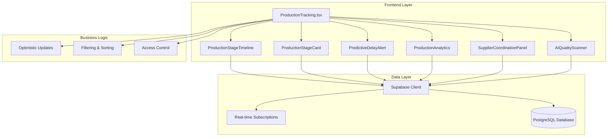
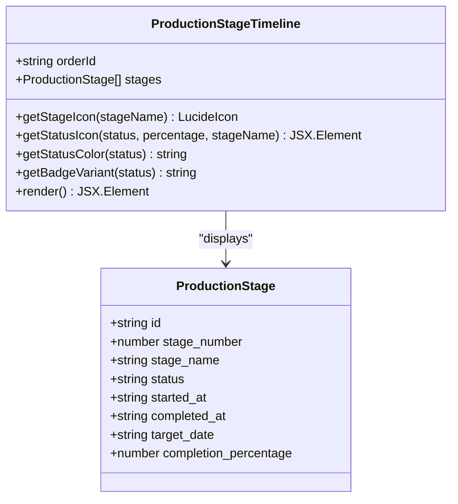
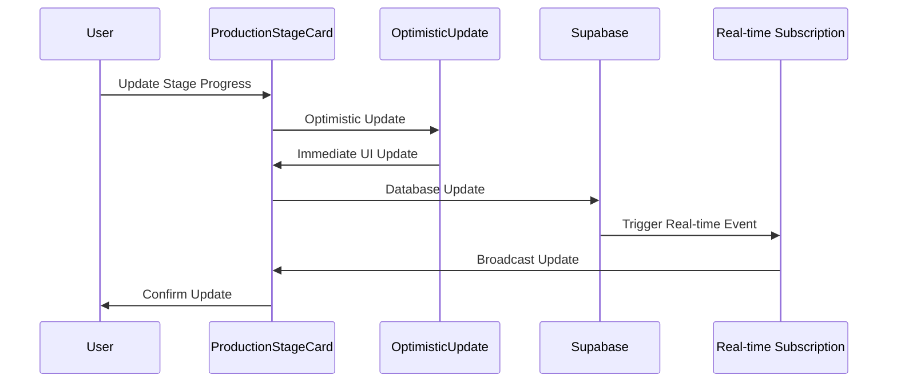
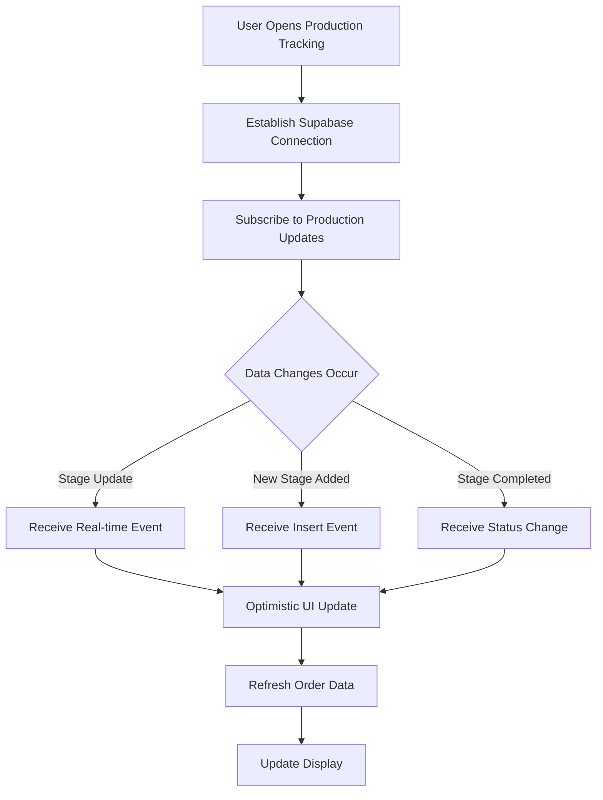
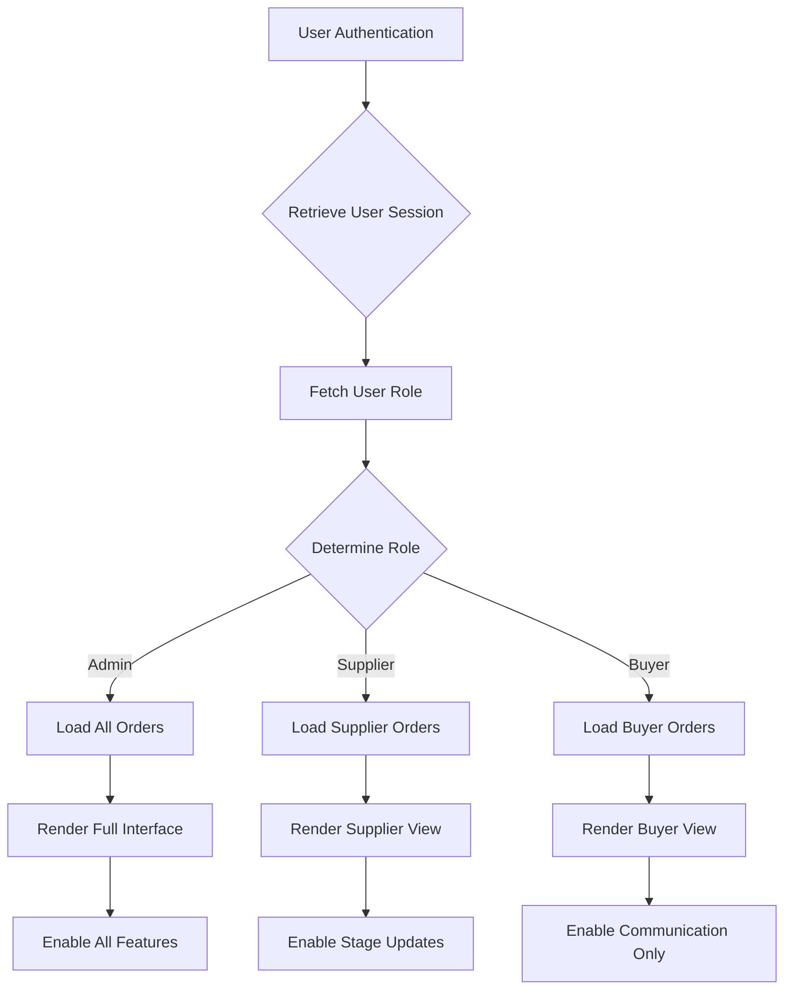
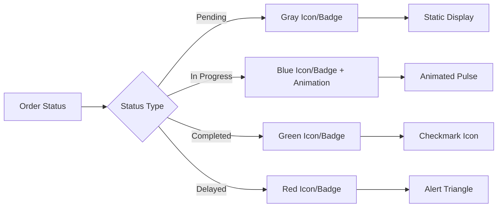
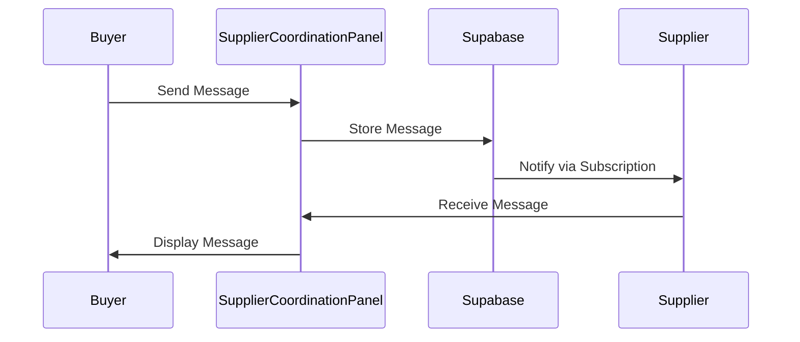
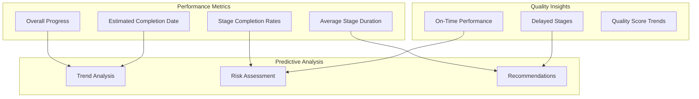
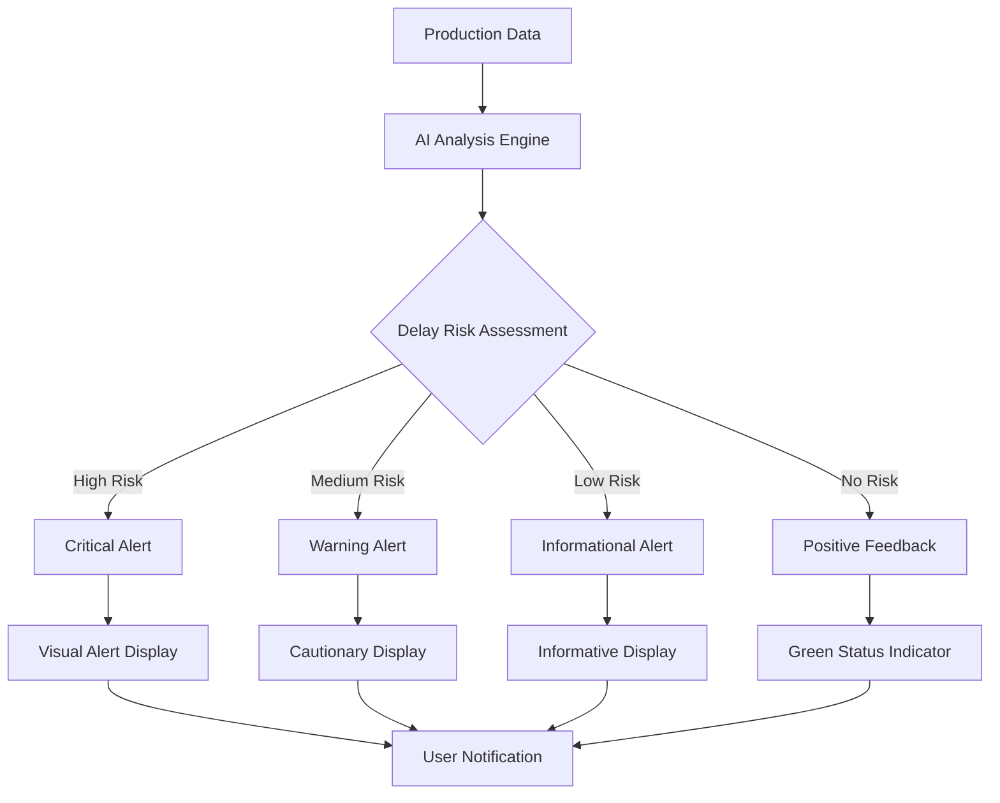

# Production Tracking Page

<cite>
**Referenced Files in This Document**
- [ProductionTracking.tsx](file://src/pages/ProductionTracking.tsx)
- [ProductionStageTimeline.tsx](file://src/components/production/ProductionStageTimeline.tsx)
- [ProductionStageCard.tsx](file://src/components/production/ProductionStageCard.tsx)
- [PredictiveDelayAlert.tsx](file://src/components/production/PredictiveDelayAlert.tsx)
- [ProductionAnalytics.tsx](file://src/components/production/ProductionAnalytics.tsx)
- [SupplierCoordinationPanel.tsx](file://src/components/production/SupplierCoordinationPanel.tsx)
- [AIQualityScanner.tsx](file://src/components/production/AIQualityScanner.tsx)
- [useOptimisticUpdate.ts](file://src/hooks/useOptimisticUpdate.ts)
- [types.ts](file://src/integrations/supabase/types.ts)
- [20251115150759_remix_migration_from_pg_dump.sql](file://supabase/migrations/20251115150759_remix_migration_from_pg_dump.sql)
- [20250123000000_relax_production_stages.sql](file://supabase/migrations/20250123000000_relax_production_stages.sql)
</cite>

## Table of Contents
1. [Introduction](#introduction)
2. [System Architecture](#system-architecture)
3. [Core Components](#core-components)
4. [Production Timeline Implementation](#production-timeline-implementation)
5. [Real-time Features](#real-time-features)
6. [Role-Based Access Control](#role-based-access-control)
7. [Data Filtering and Visualization](#data-filtering-and-visualization)
8. [Supplier Coordination](#supplier-coordination)
9. [Analytics and Insights](#analytics-and-insights)
10. [AI-Powered Features](#ai-powered-features)
11. [Performance Considerations](#performance-considerations)
12. [Troubleshooting Guide](#troubleshooting-guide)
13. [Conclusion](#conclusion)

## Introduction

The Production Tracking page serves as the central hub for real-time visibility into manufacturing processes within the LoopTrace™ technology platform. Built with React and TypeScript, this comprehensive system provides stakeholders across different roles (admin, supplier, buyer) with tailored views of production progress, automated alerts for potential delays, and integrated supplier coordination capabilities.

The page implements an eight-stage production timeline that covers the complete apparel manufacturing process, from initial order confirmation through final shipment. Through sophisticated real-time data synchronization powered by Supabase subscriptions, users receive instant updates on production status changes, ensuring optimal supply chain visibility and proactive delay management.

## System Architecture

The Production Tracking system follows a modular architecture pattern with clear separation of concerns across multiple specialized components:

**Diagram sources**
- [ProductionTracking.tsx](file://src/pages/ProductionTracking.tsx#L1-L540)
- [ProductionStageTimeline.tsx](file://src/components/production/ProductionStageTimeline.tsx#L1-L183)
- [ProductionStageCard.tsx](file://src/components/production/ProductionStageCard.tsx#L1-L412)

**Section sources**
- [ProductionTracking.tsx](file://src/pages/ProductionTracking.tsx#L1-L540)

## Core Components

### ProductionTracking Main Component

The main ProductionTracking component orchestrates the entire production tracking experience, managing state, user authentication, and coordinating data flow between specialized components.

Key responsibilities include:
- **User Authentication Management**: Handles user session retrieval and role-based access control
- **Data Fetching Strategy**: Implements role-specific data loading (admin sees all orders, suppliers see assigned orders, buyers see their orders)
- **Real-time Subscription Management**: Maintains persistent connections for live production updates
- **State Management**: Coordinates between local state and Supabase real-time data
- **Error Handling**: Provides comprehensive error handling with user-friendly toast notifications

### Eight-Stage Production Timeline

The system implements a comprehensive eight-stage production pipeline that mirrors industry-standard apparel manufacturing processes:

| Stage Number | Stage Name | Color Coding | Typical Duration |
|--------------|------------|--------------|------------------|
| 1 | Order Confirmation | Blue | 2 days |
| 2 | Fabric & Trim Sourcing | Purple | 10 days |
| 3 | Pattern & Grading | Pink | 5 days |
| 4 | Cutting | Orange | 3 days |
| 5 | Printing / Embroidery | Orange | 5 days |
| 6 | Sewing & Assembly | Green | 14 days |
| 7 | Washing & Finishing | Teal | 3 days |
| 8 | Quality Control | Teal | 2 days |
| 9 | Final Inspection | Teal | 2 days |
| 10 | Packaging | Indigo | 2 days |
| 11 | Logistics & Shipment | Red | 7 days |

**Section sources**
- [ProductionTracking.tsx](file://src/pages/ProductionTracking.tsx#L39-L48)
- [20250123000000_relax_production_stages.sql](file://supabase/migrations/20250123000000_relax_production_stages.sql#L12-L24)

## Production Timeline Implementation

### ProductionStageTimeline Component

The ProductionStageTimeline component provides a chronological visualization of production stages with interactive progress indicators and status tracking.

**Diagram sources**
- [ProductionStageTimeline.tsx](file://src/components/production/ProductionStageTimeline.tsx#L6-L20)

Key features:
- **Visual Timeline**: Chronological progression with milestone markers
- **Status Indicators**: Color-coded icons representing stage status (pending, in progress, completed, delayed)
- **Progress Tracking**: Visual progress bars with percentage completion
- **Date Management**: Target dates, start dates, and completion dates with visual indicators
- **Responsive Design**: Adapts to different screen sizes while maintaining readability

### ProductionStageCard Component

Each production stage is represented by an individual ProductionStageCard that provides detailed information and interactive controls for stage management.

**Diagram sources**
- [ProductionStageCard.tsx](file://src/components/production/ProductionStageCard.tsx#L1-L412)
- [useOptimisticUpdate.ts](file://src/hooks/useOptimisticUpdate.ts#L78-L125)

**Section sources**
- [ProductionStageTimeline.tsx](file://src/components/production/ProductionStageTimeline.tsx#L1-L183)
- [ProductionStageCard.tsx](file://src/components/production/ProductionStageCard.tsx#L1-L412)

## Real-time Features

### Supabase Real-time Subscriptions

The system implements sophisticated real-time data synchronization using Supabase's PostgreSQL change data capture (CDC) capabilities:

**Diagram sources**
- [ProductionTracking.tsx](file://src/pages/ProductionTracking.tsx#L65-L90)

### Optimistic Updates

The system employs optimistic updates to provide immediate feedback during user interactions:

- **Immediate UI Response**: Changes appear instantly without waiting for server confirmation
- **Automatic Rollback**: Failed updates revert to previous state with user notification
- **Conflict Resolution**: Handles concurrent updates gracefully
- **Error Recovery**: Provides clear error messages and recovery options

**Section sources**
- [ProductionTracking.tsx](file://src/pages/ProductionTracking.tsx#L65-L90)
- [useOptimisticUpdate.ts](file://src/hooks/useOptimisticUpdate.ts#L78-L125)

## Role-Based Access Control

The Production Tracking system implements a comprehensive role-based access control system that tailors the user experience based on organizational roles:

### Role Definitions and Permissions

| Role | Data Access | Actions Available | Restrictions |
|------|-------------|-------------------|--------------|
| Admin | All orders across the platform | Full editing capabilities, view all stages | None |
| Supplier | Orders assigned to their company | Update production stages, view assigned orders | Cannot edit other suppliers' orders |
| Buyer | Their own placed orders | View production progress, communicate with suppliers | Cannot modify production data |

### Implementation Strategy

**Diagram sources**
- [ProductionTracking.tsx](file://src/pages/ProductionTracking.tsx#L118-L131)

**Section sources**
- [ProductionTracking.tsx](file://src/pages/ProductionTracking.tsx#L118-L131)

## Data Filtering and Visualization

### Search and Filter System

The system provides comprehensive filtering capabilities to help users quickly locate specific orders:

- **Text Search**: Search by order number and product name
- **Status Filtering**: Filter by production status (all, in progress, completed, delayed)
- **Real-time Filtering**: Results update instantly as users type or apply filters
- **Combined Filters**: Support for multiple filter criteria simultaneously

### Status Visualization

**Diagram sources**
- [ProductionTracking.tsx](file://src/pages/ProductionTracking.tsx#L212-L236)

**Section sources**
- [ProductionTracking.tsx](file://src/pages/ProductionTracking.tsx#L238-L243)

## Supplier Coordination

### SupplierCoordinationPanel Component

The Supplier Coordination Panel facilitates seamless communication between buyers and suppliers throughout the production process:

**Diagram sources**
- [SupplierCoordinationPanel.tsx](file://src/components/production/SupplierCoordinationPanel.tsx#L48-L67)

### Key Features

- **Real-time Messaging**: Instant message delivery with push notifications
- **Message History**: Complete conversation history with timestamps
- **Supplier Information**: Direct access to supplier contact details
- **Attachment Support**: File sharing capabilities for production documentation
- **Read Receipts**: Message read confirmation system

**Section sources**
- [SupplierCoordinationPanel.tsx](file://src/components/production/SupplierCoordinationPanel.tsx#L1-L256)

## Analytics and Insights

### ProductionAnalytics Component

The analytics component provides comprehensive insights into production performance and trends:

**Diagram sources**
- [ProductionAnalytics.tsx](file://src/components/production/ProductionAnalytics.tsx#L1-L249)

### Analytics Features

- **Progress Tracking**: Overall production progress with percentage completion
- **Performance Metrics**: Average stage duration and estimated completion dates
- **Quality Monitoring**: On-time performance tracking and quality score analysis
- **Historical Analysis**: Trend analysis for continuous improvement
- **Custom Recommendations**: AI-driven suggestions for optimization

**Section sources**
- [ProductionAnalytics.tsx](file://src/components/production/ProductionAnalytics.tsx#L1-L249)

## AI-Powered Features

### PredictiveDelayAlert Component

The Predictive Delay Alert system uses machine learning algorithms to identify potential production delays before they occur:

**Diagram sources**
- [PredictiveDelayAlert.tsx](file://src/components/production/PredictiveDelayAlert.tsx#L40-L118)

### AIQualityScanner Component

The AI Quality Scanner provides computer vision-based defect detection for production quality control:

- **Defect Detection**: Automated identification of stitching irregularities, fabric tension issues, and other quality problems
- **Confidence Scoring**: Provides confidence levels for detected defects
- **Visual Markers**: Precise location marking on uploaded images
- **Quality Reporting**: Comprehensive quality assessment with actionable recommendations

**Section sources**
- [PredictiveDelayAlert.tsx](file://src/components/production/PredictiveDelayAlert.tsx#L1-L247)
- [AIQualityScanner.tsx](file://src/components/production/AIQualityScanner.tsx#L1-L224)

## Performance Considerations

### Optimization Strategies

The Production Tracking system implements several performance optimization techniques:

- **Efficient Data Fetching**: Role-based selective data loading reduces network overhead
- **Real-time Subscription Management**: Proper channel cleanup prevents memory leaks
- **Optimistic Updates**: Reduces perceived latency through immediate UI feedback
- **Component Memoization**: React.memo and useCallback prevent unnecessary re-renders
- **Lazy Loading**: Non-critical components load on demand

### Scalability Features

- **Database Indexing**: Proper indexing on frequently queried fields (supplier_order_id, status, target_date)
- **Pagination Support**: Handles large datasets efficiently
- **Connection Pooling**: Optimized database connection management
- **Caching Strategies**: Intelligent caching of static data and computed metrics

## Troubleshooting Guide

### Common Issues and Solutions

| Issue | Symptoms | Solution |
|-------|----------|----------|
| Real-time Updates Not Working | Stale data, manual refresh required | Check Supabase connection status, verify subscription setup |
| Slow Performance | Laggy interactions, delayed responses | Review network connectivity, check database query performance |
| Role Access Issues | Incorrect data visibility | Verify user role assignment in database, check authentication state |
| Missing Production Stages | Empty timeline, incomplete data | Ensure production stages are properly seeded, check data relationships |

### Debugging Tools

- **Console Logging**: Extensive logging throughout the component lifecycle
- **Network Monitoring**: Real-time monitoring of Supabase connections
- **State Inspection**: Developer tools support for React state debugging
- **Error Boundaries**: Comprehensive error handling with user-friendly messages

**Section sources**
- [ProductionTracking.tsx](file://src/pages/ProductionTracking.tsx#L133-L140)

## Conclusion

The Production Tracking page represents a comprehensive solution for real-time manufacturing visibility, combining sophisticated real-time data synchronization, role-based access control, and AI-powered insights. The modular architecture ensures maintainability and extensibility while providing an intuitive user experience across different organizational roles.

Key strengths of the system include:

- **Real-time Synchronization**: Instant updates across all connected clients
- **Role-based Personalization**: Tailored experiences for different stakeholders
- **AI Integration**: Predictive analytics and quality control capabilities
- **Supplier Coordination**: Seamless communication channels
- **Performance Optimization**: Efficient data management and user experience

The system successfully addresses the complex requirements of modern manufacturing visibility while maintaining scalability and reliability for enterprise-level deployments.