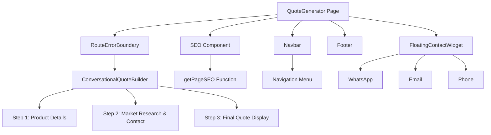
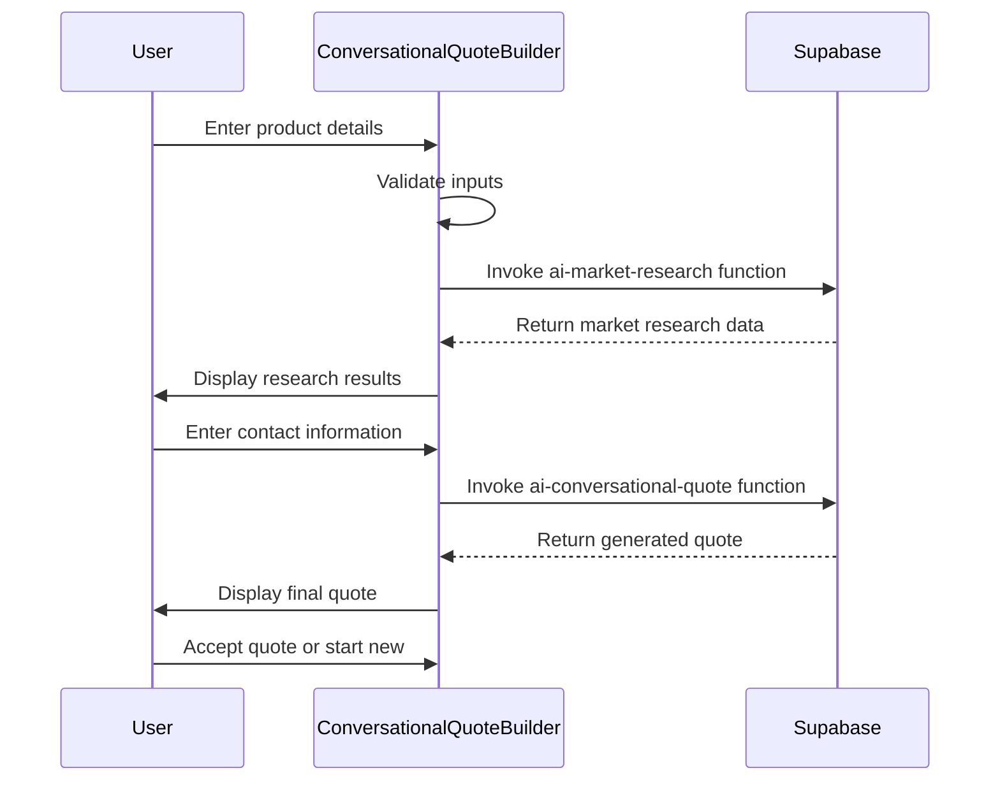
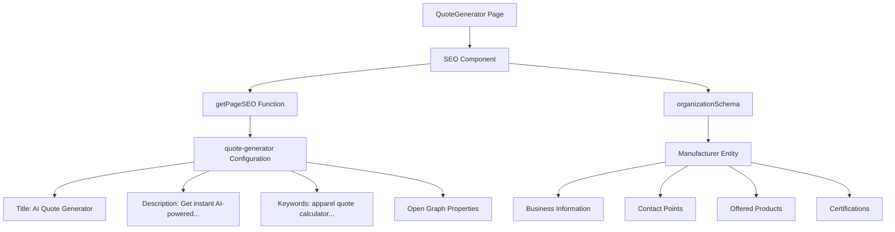
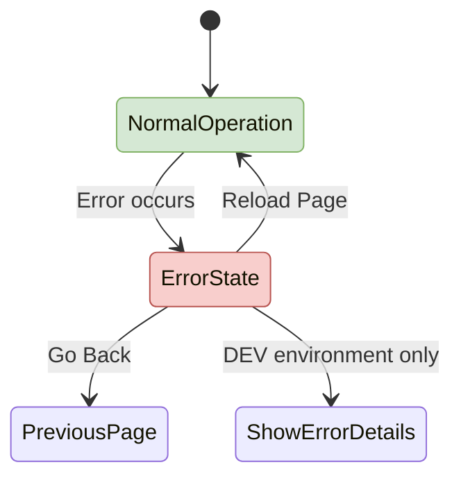
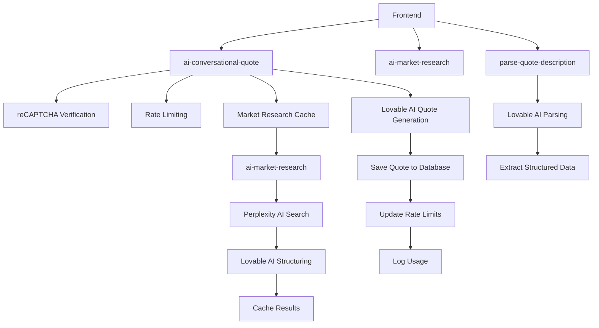
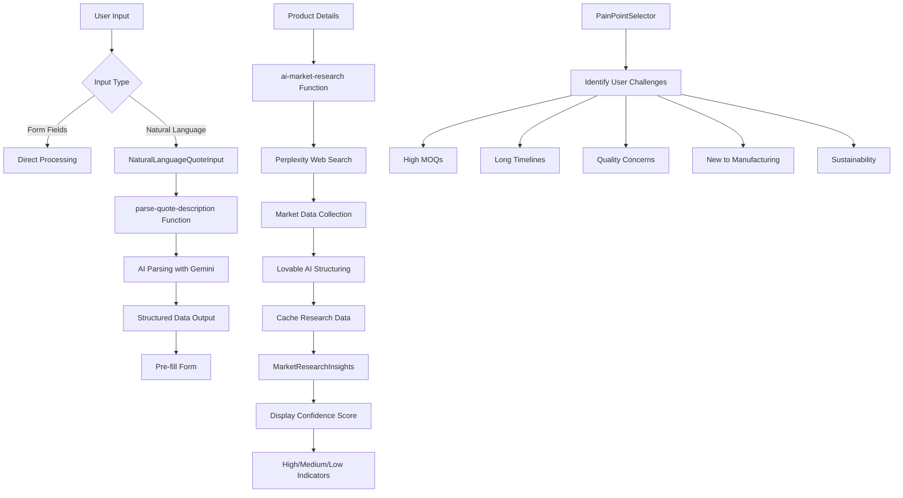
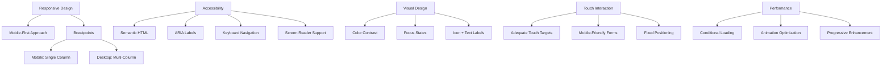

# Quote Generator Page

<cite>
**Referenced Files in This Document**   
- [QuoteGenerator.tsx](file://src/pages/QuoteGenerator.tsx)
- [ConversationalQuoteBuilder.tsx](file://src/components/quote/ConversationalQuoteBuilder.tsx)
- [seo.ts](file://src/lib/seo.ts)
- [RouteErrorBoundary.tsx](file://src/components/RouteErrorBoundary.tsx)
- [Navbar.tsx](file://src/components/Navbar.tsx)
- [Footer.tsx](file://src/components/Footer.tsx)
- [FloatingContactWidget.tsx](file://src/components/FloatingContactWidget.tsx)
- [MarketResearchInsights.tsx](file://src/components/quote/MarketResearchInsights.tsx)
- [InteractiveQuoteDisplay.tsx](file://src/components/quote/InteractiveQuoteDisplay.tsx)
- [NaturalLanguageQuoteInput.tsx](file://src/components/quote/NaturalLanguageQuoteInput.tsx)
- [PainPointSelector.tsx](file://src/components/quote/PainPointSelector.tsx)
- [ai-conversational-quote/index.ts](file://supabase/functions/ai-conversational-quote/index.ts)
- [ai-market-research/index.ts](file://supabase/functions/ai-market-research/index.ts)
- [parse-quote-description/index.ts](file://supabase/functions/parse-quote-description/index.ts)
</cite>

## Table of Contents
1. [Introduction](#introduction)
2. [Page Structure and Layout](#page-structure-and-layout)
3. [ConversationalQuoteBuilder Component](#conversationalquotebuilder-component)
4. [SEO Implementation](#seo-implementation)
5. [Error Handling with RouteErrorBoundary](#error-handling-with-routeerrorboundary)
6. [Backend Integration with Supabase Edge Functions](#backend-integration-with-supabase-edge-functions)
7. [Natural Language Processing and Market Research](#natural-language-processing-and-market-research)
8. [Mobile Responsiveness and Accessibility](#mobile-responsiveness-and-accessibility)
9. [Conclusion](#conclusion)

## Introduction

The Quote Generator page serves as the primary entry point for AI-powered quoting at Sleek Apparels, enabling customers to obtain instant, market-researched manufacturing quotes. This document details the implementation of the page, focusing on the ConversationalQuoteBuilder component, SEO integration, error handling, layout structure, and backend connectivity through Supabase Edge Functions.

The page follows a three-step conversational flow that begins with product details, incorporates market research data, and culminates in a comprehensive quote. It leverages AI to process natural language input, connect with backend services for real-time pricing data, and deliver a seamless user experience with robust error handling and accessibility features.

**Section sources**
- [QuoteGenerator.tsx](file://src/pages/QuoteGenerator.tsx#L1-L42)

## Page Structure and Layout

The Quote Generator page implements a consistent layout structure with several key components that provide navigation, content, and contact functionality. The page structure follows a standard pattern with a header, main content area, and footer, enhanced with floating elements for improved user engagement.

The layout begins with the SEO component that manages metadata and structured data, followed by the Navbar which provides site-wide navigation. The main content area contains the ConversationalQuoteBuilder, which is the core functionality of the page. The Footer provides additional navigation and contact information, while the FloatingContactWidget offers quick access to communication channels.

The page uses Tailwind CSS for responsive design, ensuring proper display across device sizes. The container pattern with mx-auto and responsive padding (px-4 on mobile, larger on desktop) creates a centered content area that adapts to screen size. The min-h-screen class ensures the page fills the viewport, with proper spacing through pt-24 to accommodate the fixed navbar.

**Diagram sources **
- [QuoteGenerator.tsx](file://src/pages/QuoteGenerator.tsx#L1-L42)
- [Navbar.tsx](file://src/components/Navbar.tsx#L1-L487)
- [Footer.tsx](file://src/components/Footer.tsx#L1-L158)
- [FloatingContactWidget.tsx](file://src/components/FloatingContactWidget.tsx#L1-L95)

**Section sources**
- [QuoteGenerator.tsx](file://src/pages/QuoteGenerator.tsx#L1-L42)
- [Navbar.tsx](file://src/components/Navbar.tsx#L1-L487)
- [Footer.tsx](file://src/components/Footer.tsx#L1-L158)
- [FloatingContactWidget.tsx](file://src/components/FloatingContactWidget.tsx#L1-L95)

## ConversationalQuoteBuilder Component

The ConversationalQuoteBuilder component implements a three-step process for generating manufacturing quotes. This component manages state for the current step, loading states, form data, and quote results, providing a guided experience that simplifies the quoting process for users.

The first step collects product details including product type, quantity, fabric type, complexity level, and additional requirements. These inputs are validated before proceeding to market research. The component uses React hooks for state management (useState) and toast notifications (useToast) to provide user feedback.

In the second step, market research data is displayed alongside contact information fields. The MarketResearchInsights component presents key metrics such as average unit cost, material costs, lead times, and market markup percentages. Users must provide their email address to proceed, with optional fields for name, country, and phone number.

The final step displays the generated quote through the InteractiveQuoteDisplay component, which shows unit price, total price, lead time, price breakdown, and AI-generated suggestions. Users can accept the quote or start a new one, with all state reset appropriately.

**Diagram sources **
- [ConversationalQuoteBuilder.tsx](file://src/components/quote/ConversationalQuoteBuilder.tsx#L1-L363)
- [MarketResearchInsights.tsx](file://src/components/quote/MarketResearchInsights.tsx#L1-L140)
- [InteractiveQuoteDisplay.tsx](file://src/components/quote/InteractiveQuoteDisplay.tsx#L1-L230)

**Section sources**
- [ConversationalQuoteBuilder.tsx](file://src/components/quote/ConversationalQuoteBuilder.tsx#L1-L363)

## SEO Implementation

The Quote Generator page implements comprehensive SEO through the getPageSEO function in the seo.ts utility. This function returns a configuration object with metadata tailored to the quote generator page, including title, description, keywords, and Open Graph properties.

The SEO configuration for the quote generator page includes a compelling title that highlights the AI-powered nature of the service and targets key search terms like "instant knitwear pricing" and "Europe & North America." The description emphasizes the benefits of the service, including email verification, detailed pricing, and production timelines, while specifying that it's free for EU and NA brands with a limit of four quotes per day.

The implementation includes structured data through the organizationSchema object, which provides schema.org markup for the manufacturer entity. This includes business information such as name, description, URL, logo, contact details, founder information, and areas served. The schema also specifies the types of products offered and relevant certifications, enhancing search engine understanding of the business.

The SEO component is integrated directly into the QuoteGenerator page, with the includeServiceSchema prop ensuring that service-specific schema markup is included. This comprehensive approach to SEO helps improve search visibility and provides rich snippets in search results.

**Diagram sources **
- [QuoteGenerator.tsx](file://src/pages/QuoteGenerator.tsx#L1-L42)
- [seo.ts](file://src/lib/seo.ts#L1-L293)

**Section sources**
- [seo.ts](file://src/lib/seo.ts#L1-L293)
- [QuoteGenerator.tsx](file://src/pages/QuoteGenerator.tsx#L1-L42)

## Error Handling with RouteErrorBoundary

The Quote Generator page implements robust error handling through the RouteErrorBoundary component, which wraps the main content area to catch and gracefully handle runtime errors. This component uses React's error boundary pattern to prevent the entire application from crashing when an error occurs within the quote generation process.

The RouteErrorBoundary component displays a user-friendly error message with options to reload the page or navigate back. It includes different messaging for development and production environments, showing detailed error information only in development to avoid exposing sensitive information in production.

When an error occurs, the component logs the error to the console with detailed information including the error object and error info. The fallback UI provides clear instructions to the user and actionable buttons to recover from the error state. The handleReset method reloads the page, which typically resolves transient issues.

The error boundary is configured with customizable fallback text through props, allowing the QuoteGenerator page to specify relevant error messaging such as "Quote Generator Error" and "The quote generator encountered an issue. Please try again." This contextual messaging helps users understand the specific nature of the problem.

**Diagram sources **
- [RouteErrorBoundary.tsx](file://src/components/RouteErrorBoundary.tsx#L1-L77)
- [QuoteGenerator.tsx](file://src/pages/QuoteGenerator.tsx#L1-L42)

**Section sources**
- [RouteErrorBoundary.tsx](file://src/components/RouteErrorBoundary.tsx#L1-L77)

## Backend Integration with Supabase Edge Functions

The Quote Generator page connects to backend AI services through Supabase Edge Functions, which provide serverless endpoints for AI-powered quote generation and market research. These functions handle the complex processing required for quote generation while maintaining security and rate limiting.

The primary function, ai-conversational-quote, orchestrates the quote generation process by first verifying reCAPTCHA tokens to prevent abuse, implementing rate limiting based on IP address and email, and then either retrieving cached market research or calling the ai-market-research function. It uses the Lovable AI service with Gemini 2.5 Pro to generate quotes based on market data and customer requirements.

The ai-market-research function performs web searches using Perplexity AI to gather current manufacturing costs, material prices, lead times, and market markup rates. It structures this data using Lovable AI and caches it in the market_research_cache table for 24 hours to improve performance and reduce costs for subsequent requests with similar parameters.

The parse-quote-description function enables natural language input by parsing free-text descriptions of manufacturing needs into structured data that can be used to pre-fill the quote form. This function uses Lovable AI with Gemini 2.5 Flash to extract product type, quantity, fabric type, complexity level, and additional requirements from user input.

All functions implement comprehensive logging and security measures, including reCAPTCHA verification, rate limiting, and security event logging for failed attempts. They also update rate limit counters and log AI usage for monitoring and cost tracking.

**Diagram sources **
- [ai-conversational-quote/index.ts](file://supabase/functions/ai-conversational-quote/index.ts#L1-L385)
- [ai-market-research/index.ts](file://supabase/functions/ai-market-research/index.ts#L1-L335)
- [parse-quote-description/index.ts](file://supabase/functions/parse-quote-description/index.ts#L1-L127)

**Section sources**
- [ai-conversational-quote/index.ts](file://supabase/functions/ai-conversational-quote/index.ts#L1-L385)
- [ai-market-research/index.ts](file://supabase/functions/ai-market-research/index.ts#L1-L335)
- [parse-quote-description/index.ts](file://supabase/functions/parse-quote-description/index.ts#L1-L127)

## Natural Language Processing and Market Research

The Quote Generator page incorporates advanced natural language processing capabilities through the NaturalLanguageQuoteInput component, which allows users to describe their manufacturing needs in plain English. This component sends the description to the parse-quote-description Edge Function, which uses AI to extract structured data including product type, quantity, fabric type, complexity level, and additional requirements.

The market research integration is a key differentiator of the quoting system, providing real-time pricing data from verified sources. When users enter product details, the system invokes the ai-market-research function, which uses Perplexity AI to search for current manufacturing costs in Bangladesh. The results include average unit costs, material costs per unit, lead times, market markup percentages, and comparable products with pricing.

The MarketResearchInsights component displays this data with visual indicators of confidence level, helping users understand the reliability of the information. The confidence score is calculated based on the quality and recency of the sources, with high confidence (85%+) indicated in green, medium confidence (70-84%) in yellow, and estimated data below 70% in orange.

The system also implements caching of market research data based on product category and quantity range, reducing API calls and improving response times for subsequent requests with similar parameters. This caching strategy balances data freshness with performance, with a 24-hour cache validity period.

The PainPointSelector component complements the quoting process by identifying common challenges faced by apparel buyers, such as high minimums, long production times, and quality concerns. This information could be used to tailor the quoting process or provide targeted educational content.

**Diagram sources **
- [NaturalLanguageQuoteInput.tsx](file://src/components/quote/NaturalLanguageQuoteInput.tsx#L1-L131)
- [PainPointSelector.tsx](file://src/components/quote/PainPointSelector.tsx#L1-L168)
- [MarketResearchInsights.tsx](file://src/components/quote/MarketResearchInsights.tsx#L1-L140)
- [ai-market-research/index.ts](file://supabase/functions/ai-market-research/index.ts#L1-L335)
- [parse-quote-description/index.ts](file://supabase/functions/parse-quote-description/index.ts#L1-L127)

**Section sources**
- [NaturalLanguageQuoteInput.tsx](file://src/components/quote/NaturalLanguageQuoteInput.tsx#L1-L131)
- [PainPointSelector.tsx](file://src/components/quote/PainPointSelector.tsx#L1-L168)
- [MarketResearchInsights.tsx](file://src/components/quote/MarketResearchInsights.tsx#L1-L140)

## Mobile Responsiveness and Accessibility

The Quote Generator page implements comprehensive mobile responsiveness and accessibility features to ensure an optimal user experience across all devices and for users with diverse needs.

The layout uses a mobile-first approach with responsive breakpoints that adapt the interface from mobile to desktop. On mobile devices, the navbar collapses into a hamburger menu with a video background for visual interest. The main content area uses a single-column layout that ensures form fields and information are easily accessible on smaller screens.

Accessibility features include proper semantic HTML with appropriate heading hierarchy, ARIA labels for interactive elements, and keyboard navigation support. Form fields have associated labels and clear visual focus states. The error boundary and toast notifications provide both visual and programmatic feedback for users.

The FloatingContactWidget uses a bouncing animation to draw attention on mobile devices, with a clean interface that expands to show contact options when clicked. The widget is positioned fixed in the bottom right corner, ensuring it's always accessible without obstructing content.

Color contrast meets WCAG standards, with sufficient contrast between text and background colors. Interactive elements have clear visual states for hover, focus, and active conditions. The use of icons with text labels ensures functionality is clear even if colors are not perceived.

The page also implements proper touch targets with adequate sizing for mobile interaction, following platform guidelines for minimum touch target sizes. Form fields and buttons are sufficiently large to be easily tapped on touchscreens.

**Diagram sources **
- [QuoteGenerator.tsx](file://src/pages/QuoteGenerator.tsx#L1-L42)
- [Navbar.tsx](file://src/components/Navbar.tsx#L1-L487)
- [FloatingContactWidget.tsx](file://src/components/FloatingContactWidget.tsx#L1-L95)

**Section sources**
- [Navbar.tsx](file://src/components/Navbar.tsx#L1-L487)
- [FloatingContactWidget.tsx](file://src/components/FloatingContactWidget.tsx#L1-L95)

## Conclusion

The Quote Generator page represents a sophisticated implementation of AI-powered quoting that combines user-friendly interface design with robust backend services. The page successfully integrates multiple components to create a seamless experience for obtaining manufacturing quotes, from initial product specification to final quote presentation.

Key strengths of the implementation include the three-step conversational flow that guides users through the quoting process, the integration of real-time market research data to ensure competitive pricing, and the natural language processing capabilities that lower the barrier to entry for users unfamiliar with manufacturing terminology.

The architecture demonstrates thoughtful consideration of performance through caching strategies, security through reCAPTCHA and rate limiting, and user experience through responsive design and accessibility features. The use of Supabase Edge Functions enables complex AI processing while maintaining a clean separation between frontend and backend concerns.

Future enhancements could include expanding the natural language processing to handle more complex manufacturing requirements, integrating with additional data sources for market research, and providing more personalized recommendations based on user history and preferences.

**Section sources**
- [QuoteGenerator.tsx](file://src/pages/QuoteGenerator.tsx#L1-L42)
- [ConversationalQuoteBuilder.tsx](file://src/components/quote/ConversationalQuoteBuilder.tsx#L1-L363)
- [seo.ts](file://src/lib/seo.ts#L1-L293)
- [RouteErrorBoundary.tsx](file://src/components/RouteErrorBoundary.tsx#L1-L77)
- [ai-conversational-quote/index.ts](file://supabase/functions/ai-conversational-quote/index.ts#L1-L385)
- [ai-market-research/index.ts](file://supabase/functions/ai-market-research/index.ts#L1-L335)
- [parse-quote-description/index.ts](file://supabase/functions/parse-quote-description/index.ts#L1-L127)