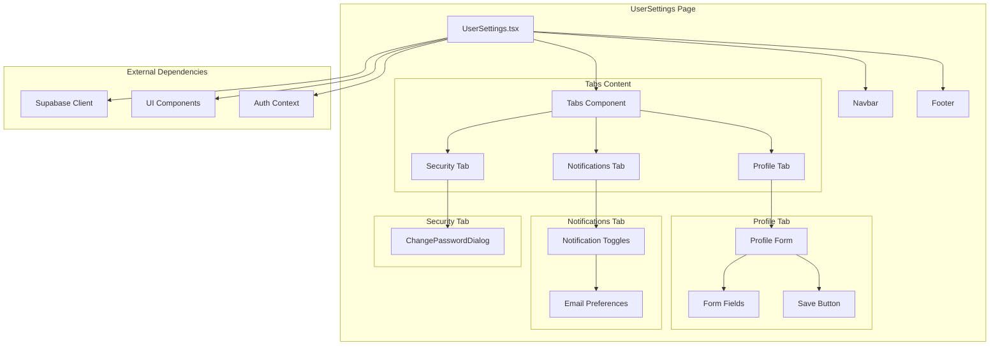
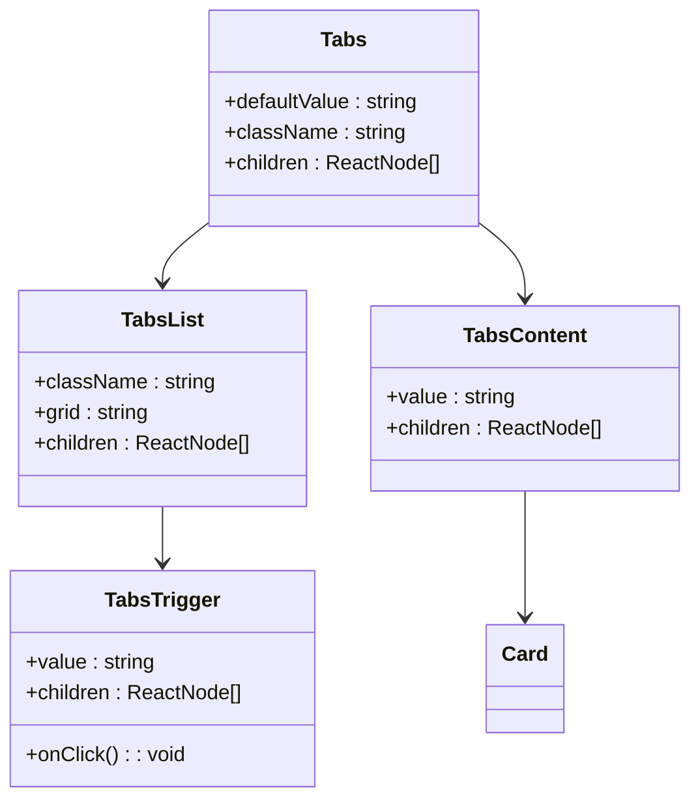
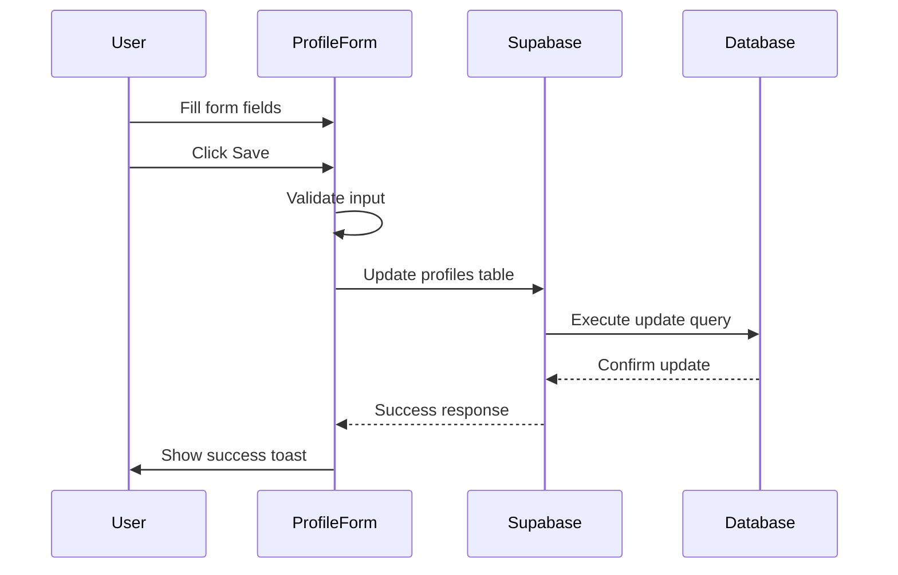
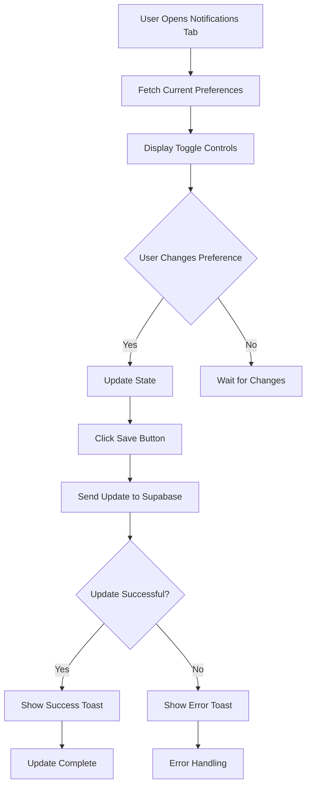
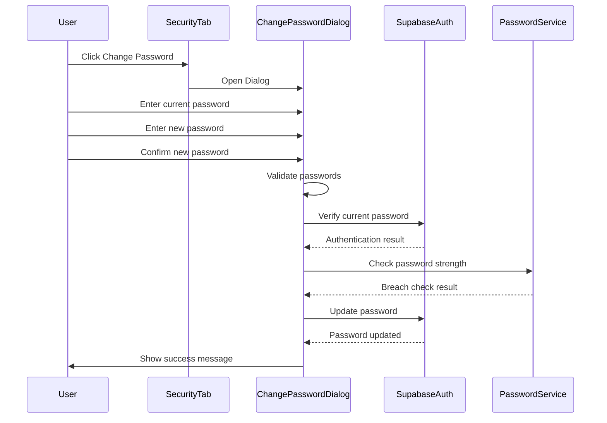
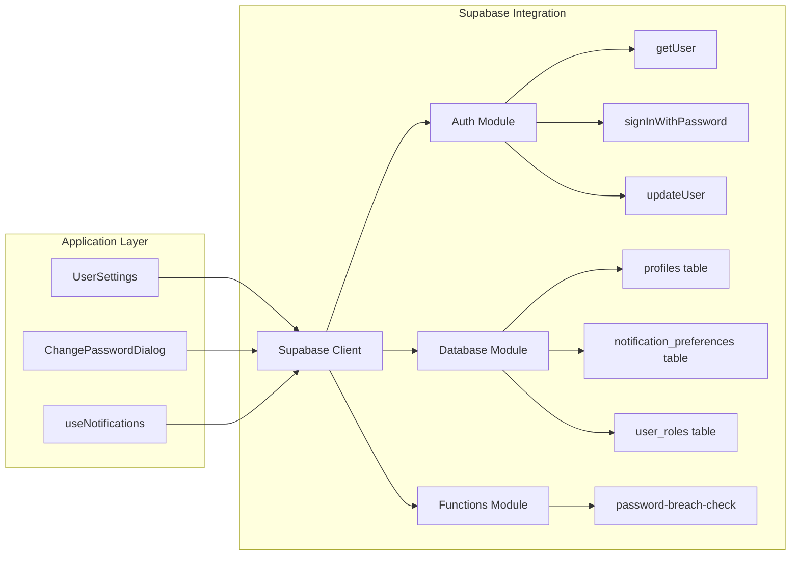
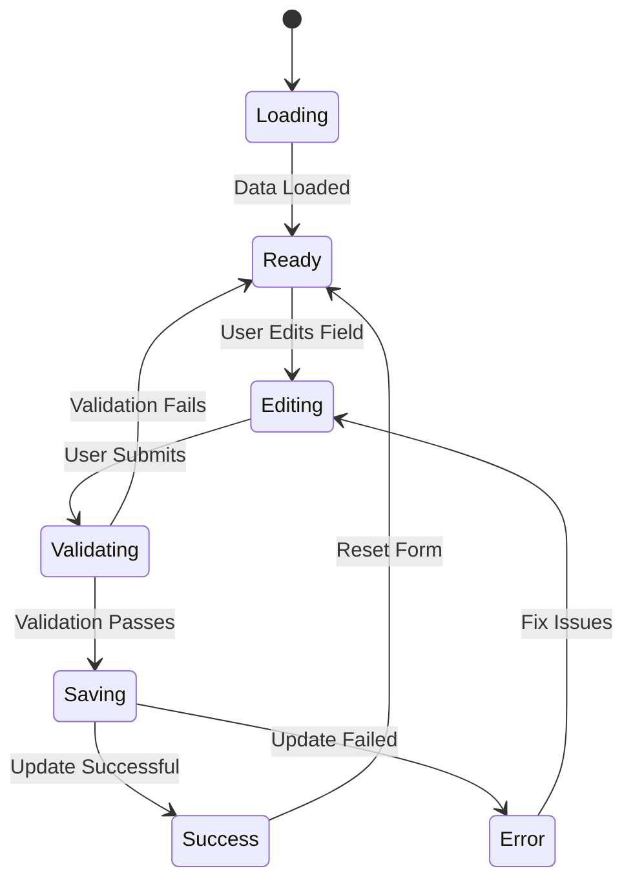
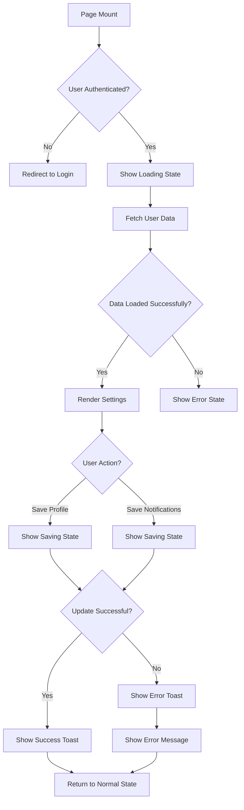
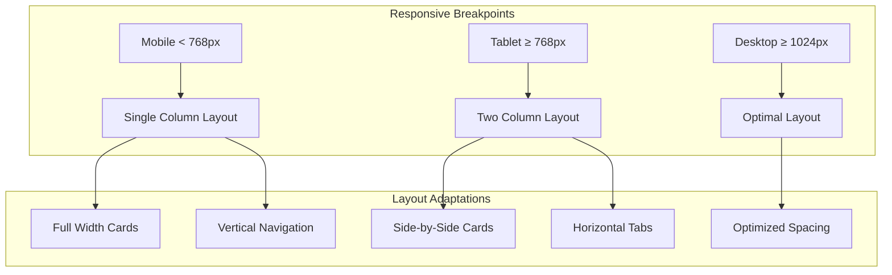

# User Settings Page

<cite>
**Referenced Files in This Document**
- [UserSettings.tsx](file://src/pages/UserSettings.tsx)
- [ChangePasswordDialog.tsx](file://src/components/ChangePasswordDialog.tsx)
- [client.ts](file://src/integrations/supabase/client.ts)
- [useNotifications.ts](file://src/hooks/useNotifications.ts)
- [database.ts](file://src/types/database.ts)
- [supabaseHelpers.ts](file://src/lib/supabaseHelpers.ts)
- [tabs.tsx](file://src/components/ui/tabs.tsx)
- [card.tsx](file://src/components/ui/card.tsx)
- [use-mobile.tsx](file://src/hooks/use-mobile.tsx)
- [AuthContext.tsx](file://src/contexts/AuthContext.tsx)
- [use-toast.ts](file://src/hooks/use-toast.ts)
</cite>

## Table of Contents
1. [Introduction](#introduction)
2. [Page Architecture](#page-architecture)
3. [Tabbed Interface Implementation](#tabbed-interface-implementation)
4. [Profile Management](#profile-management)
5. [Notification Preferences](#notification-preferences)
6. [Security Management](#security-management)
7. [Supabase Integration](#supabase-integration)
8. [Form Handling and Validation](#form-handling-and-validation)
9. [Loading and Error States](#loading-and-error-states)
10. [Responsive Design](#responsive-design)
11. [Performance Considerations](#performance-considerations)
12. [Troubleshooting Guide](#troubleshooting-guide)

## Introduction

The UserSettings.tsx page provides a comprehensive interface for users to manage their account preferences, including profile information, notification preferences, and security settings. Built with React and TypeScript, the page integrates seamlessly with Supabase for data persistence and authentication, offering a modern, responsive user experience across all device sizes.

The settings page is structured as a tabbed interface with three main sections: Profile Management, Notification Preferences, and Security Settings. Each section handles specific aspects of user account customization while maintaining consistent design patterns and error handling throughout.

## Page Architecture

The UserSettings page follows a modular architecture pattern with clear separation of concerns:



**Diagram sources**
- [UserSettings.tsx](file://src/pages/UserSettings.tsx#L16-L342)
- [tabs.tsx](file://src/components/ui/tabs.tsx#L1-L54)
- [card.tsx](file://src/components/ui/card.tsx#L1-L44)

**Section sources**
- [UserSettings.tsx](file://src/pages/UserSettings.tsx#L16-L342)

## Tabbed Interface Implementation

The tabbed interface is implemented using Radix UI's Tabs primitive, providing accessible and customizable navigation between different settings sections:



**Diagram sources**
- [tabs.tsx](file://src/components/ui/tabs.tsx#L6-L54)

The tab system supports three main sections:

| Tab | Icon | Purpose | Data Persistence |
|-----|------|---------|------------------|
| Profile | User | Edit personal/company information | `profiles` table |
| Notifications | Bell | Configure email preferences | `notification_preferences` table |
| Security | Lock | Manage password and account security | Supabase Auth |

**Section sources**
- [UserSettings.tsx](file://src/pages/UserSettings.tsx#L143-L156)

## Profile Management

The profile management section allows users to update their personal and company information stored in the `profiles` table:



**Diagram sources**
- [UserSettings.tsx](file://src/pages/UserSettings.tsx#L72-L96)
- [database.ts](file://src/types/database.ts#L459-L468)

### Profile Data Structure

The profile data is stored in the `profiles` table with the following schema:

| Field | Type | Description | Required |
|-------|------|-------------|----------|
| id | UUID | Primary key, references user_id | Yes |
| user_id | UUID | Foreign key to auth.users | Yes |
| full_name | String | User's complete name | No |
| company_name | String | Company/Organization name | No |
| phone | String | Contact phone number | No |
| address | String | Physical address | No |
| avatar_url | String | Profile image URL | No |

### Form Implementation Details

The profile form uses controlled components with real-time state updates:

- **Full Name Field**: Text input with automatic capitalization
- **Company Name Field**: Text input for organizational details  
- **Phone Number Field**: Tel input with international format support
- **Address Field**: Text input with multiline support

**Section sources**
- [UserSettings.tsx](file://src/pages/UserSettings.tsx#L159-L224)
- [database.ts](file://src/types/database.ts#L459-L468)

## Notification Preferences

The notification preferences section enables users to customize their email communication preferences:



**Diagram sources**
- [UserSettings.tsx](file://src/pages/UserSettings.tsx#L99-L121)

### Notification Preference Options

The system supports four distinct notification categories:

| Preference | Database Column | Description | Default |
|------------|----------------|-------------|---------|
| Order Updates | `email_orders` | Status changes for orders | Enabled |
| Messages | `email_messages` | New message notifications | Enabled |
| Production Updates | `email_production` | Manufacturing progress | Enabled |
| Payment Notifications | `email_payments` | Invoice and payment alerts | Enabled |

### Implementation Pattern

Each notification preference uses a controlled switch component that maintains state synchronization between the UI and database:

```typescript
// Example notification toggle implementation pattern
<Switch
  checked={notifications.email_orders}
  onCheckedChange={(checked) =>
    setNotifications({ ...notifications, email_orders: checked })
  }
/>
```

**Section sources**
- [UserSettings.tsx](file://src/pages/UserSettings.tsx#L226-L314)
- [database.ts](file://src/types/database.ts#L328-L337)

## Security Management

The security section integrates with the ChangePasswordDialog component for password management:



**Diagram sources**
- [ChangePasswordDialog.tsx](file://src/components/ChangePasswordDialog.tsx#L33-L98)
- [UserSettings.tsx](file://src/pages/UserSettings.tsx#L316-L334)

### Password Security Features

The password change functionality implements multiple security measures:

- **Current Password Verification**: Re-authenticates user before allowing password changes
- **Password Strength Validation**: Enforces minimum length and character requirements
- **Breach Detection**: Checks against known compromised password databases
- **Secure Storage**: Uses Supabase's built-in password hashing

**Section sources**
- [ChangePasswordDialog.tsx](file://src/components/ChangePasswordDialog.tsx#L1-L158)
- [UserSettings.tsx](file://src/pages/UserSettings.tsx#L316-L334)

## Supabase Integration

The UserSettings page integrates deeply with Supabase for data persistence and authentication:



**Diagram sources**
- [client.ts](file://src/integrations/supabase/client.ts#L1-L20)
- [UserSettings.tsx](file://src/pages/UserSettings.tsx#L2-L3)

### Database Operations

The page performs several key database operations:

| Operation | Method | Table | Purpose |
|-----------|--------|-------|---------|
| Fetch User Data | `getUser()` | auth.users | Retrieve authenticated user |
| Get Profile | `profiles.select()` | profiles | Load user profile information |
| Get Notifications | `notification_preferences.select()` | notification_preferences | Load notification preferences |
| Update Profile | `profiles.update()` | profiles | Save profile changes |
| Update Notifications | `notification_preferences.upsert()` | notification_preferences | Save notification preferences |

### Authentication Flow

The authentication system ensures secure access to user-specific data:

1. **Initial Load**: Fetch user from Supabase Auth
2. **Data Retrieval**: Use user ID to fetch associated records
3. **State Management**: Maintain synchronized state across components
4. **Error Handling**: Graceful degradation on authentication failures

**Section sources**
- [UserSettings.tsx](file://src/pages/UserSettings.tsx#L28-L69)
- [client.ts](file://src/integrations/supabase/client.ts#L1-L20)

## Form Handling and Validation

The form handling system implements robust validation and state management:



### Validation Strategies

The page implements multiple validation layers:

- **Client-side Validation**: Real-time field validation
- **Server-side Validation**: Supabase constraint enforcement
- **TypeScript Validation**: Compile-time type checking
- **User Experience Validation**: Immediate feedback and error messages

### State Management Patterns

The form uses controlled components with centralized state management:

```typescript
// State management pattern
const [profile, setProfile] = useState<Profile>({
  full_name: '',
  company_name: '',
  phone: '',
  address: ''
});

// Field update handler
const handleFieldChange = (field: keyof Profile, value: string) => {
  setProfile(prev => ({ ...prev, [field]: value }));
};
```

**Section sources**
- [UserSettings.tsx](file://src/pages/UserSettings.tsx#L18-L26)
- [UserSettings.tsx](file://src/pages/UserSettings.tsx#L168-L202)

## Loading and Error States

The page implements comprehensive loading and error handling:



### Loading States

The page displays appropriate loading indicators during various operations:

- **Initial Load**: Full-page spinner while fetching user data
- **Save Operations**: Disabled buttons with loading spinners
- **Network Requests**: Optimistic UI updates with loading states

### Error Handling

Multiple error handling strategies are implemented:

| Error Type | Handling Strategy | User Feedback |
|------------|------------------|---------------|
| Network Errors | Retry mechanism | Error toast with retry option |
| Validation Errors | Inline validation | Field-specific error messages |
| Authentication Errors | Redirect to login | Clear error message |
| Database Errors | Graceful degradation | User-friendly error message |

**Section sources**
- [UserSettings.tsx](file://src/pages/UserSettings.tsx#L123-L130)
- [UserSettings.tsx](file://src/pages/UserSettings.tsx#L72-L96)

## Responsive Design

The UserSettings page implements a mobile-first responsive design:



**Diagram sources**
- [use-mobile.tsx](file://src/hooks/use-mobile.tsx#L1-L31)

### Responsive Features

The page adapts to different screen sizes:

- **Mobile Devices**: Single column layout with stacked cards
- **Tablet Devices**: Two-column layout with horizontal tabs
- **Desktop Devices**: Optimal spacing with side-by-side content

### Accessibility Features

The responsive design includes accessibility considerations:

- **Touch Targets**: Minimum 44px touch targets
- **Keyboard Navigation**: Full keyboard accessibility
- **Screen Reader Support**: Proper ARIA labels and roles
- **Color Contrast**: WCAG AA compliant color schemes

**Section sources**
- [use-mobile.tsx](file://src/hooks/use-mobile.tsx#L1-L31)
- [UserSettings.tsx](file://src/pages/UserSettings.tsx#L134-L141)

## Performance Considerations

The UserSettings page implements several performance optimization strategies:

### Data Fetching Optimization

- **Selective Queries**: Only fetch necessary data fields
- **Caching**: Leverage Supabase's built-in caching
- **Debounced Updates**: Prevent excessive API calls during rapid changes
- **Optimistic Updates**: Immediate UI feedback with rollback capability

### Memory Management

- **State Cleanup**: Proper cleanup of subscriptions and timers
- **Component Unmounting**: Prevent memory leaks from lingering subscriptions
- **Efficient Re-renders**: Minimize unnecessary component re-renders

### Bundle Size Optimization

- **Code Splitting**: Separate authentication and settings logic
- **Tree Shaking**: Remove unused code from bundles
- **Lazy Loading**: Load components only when needed

## Troubleshooting Guide

Common issues and their solutions:

### Authentication Issues

**Problem**: User redirected to login page unexpectedly
**Solution**: Check browser cookies and local storage for authentication tokens

**Problem**: Session expiration during form editing
**Solution**: Implement session refresh logic before form submission

### Data Sync Issues

**Problem**: Profile changes not persisting
**Solution**: Verify database permissions and network connectivity

**Problem**: Notification preferences reverting to defaults
**Solution**: Check UPSERT operation and database constraints

### Performance Issues

**Problem**: Slow loading times
**Solution**: Optimize database queries and implement caching

**Problem**: Frequent re-renders
**Solution**: Use React.memo and optimize state updates

### Mobile Issues

**Problem**: Touch targets too small
**Solution**: Adjust CSS touch target sizes and padding

**Problem**: Navigation difficult on mobile
**Solution**: Implement proper mobile navigation patterns

**Section sources**
- [UserSettings.tsx](file://src/pages/UserSettings.tsx#L64-L67)
- [ChangePasswordDialog.tsx](file://src/components/ChangePasswordDialog.tsx#L38-L50)