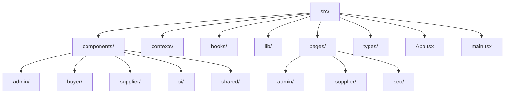
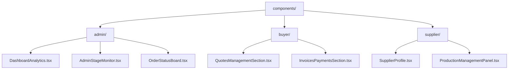
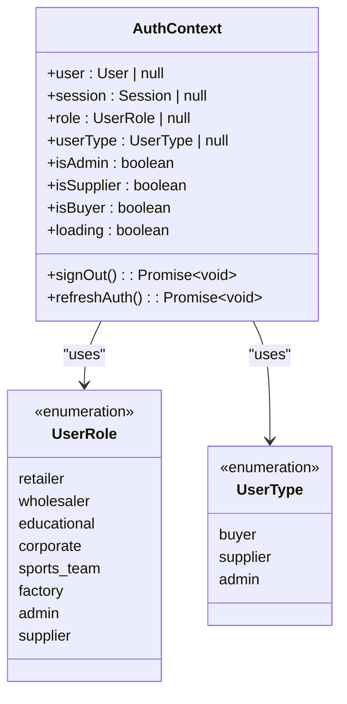
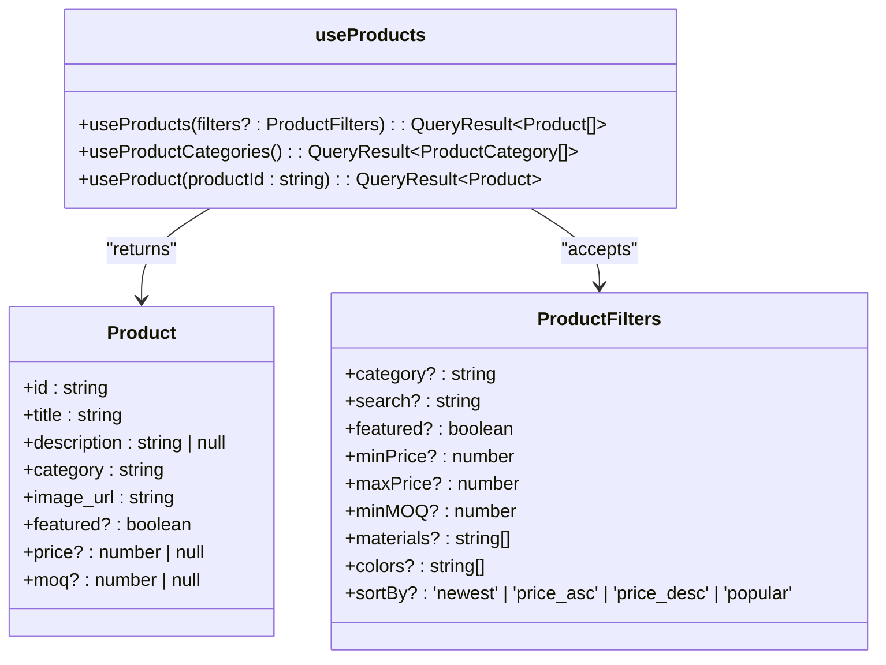
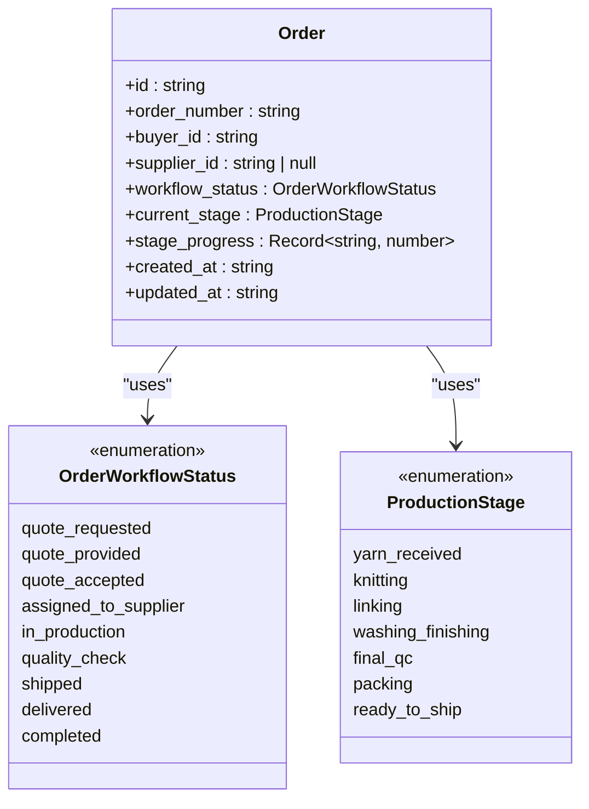
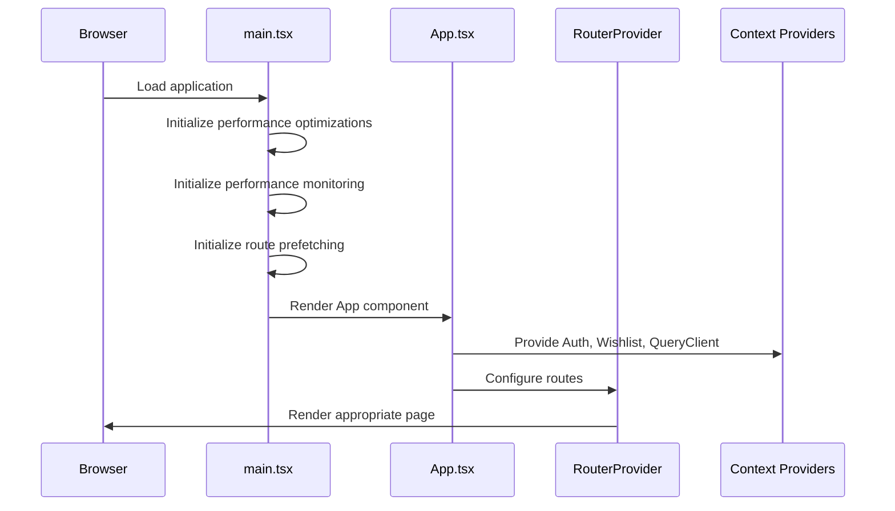

# Source Code Directory (src/)

<cite>
**Referenced Files in This Document**   
- [App.tsx](file://src/App.tsx)
- [main.tsx](file://src/main.tsx)
- [components/admin/DashboardAnalytics.tsx](file://src/components/admin/DashboardAnalytics.tsx)
- [components/supplier/SupplierProfile.tsx](file://src/components/supplier/SupplierProfile.tsx)
- [components/buyer/QuotesManagementSection.tsx](file://src/components/buyer/QuotesManagementSection.tsx)
- [contexts/AuthContext.tsx](file://src/contexts/AuthContext.tsx)
- [hooks/useProducts.ts](file://src/hooks/useProducts.ts)
- [lib/lazyLoadRoutes.ts](file://src/lib/lazyLoadRoutes.ts)
- [types/database.ts](file://src/types/database.ts)
- [types/order.ts](file://src/types/order.ts)
</cite>

## Table of Contents
1. [Introduction](#introduction)
2. [Core Architecture](#core-architecture)
3. [Component Organization](#component-organization)
4. [State Management](#state-management)
5. [Custom Hooks](#custom-hooks)
6. [Utility Functions](#utility-functions)
7. [Page Routing and Structure](#page-routing-and-structure)
8. [Type Definitions](#type-definitions)
9. [Code Splitting and Performance](#code-splitting-and-performance)
10. [Entry Points](#entry-points)

## Introduction

The `src/` directory serves as the core of the application's frontend implementation, containing all source code organized by concern and feature. This directory follows a well-structured architecture that separates concerns while maintaining feature cohesion. The organization enables efficient code navigation, promotes reusability, and facilitates team collaboration by grouping related functionality together. The structure supports modern frontend development practices including code splitting, lazy loading, and tree-shaking to optimize performance.

## Core Architecture

The application follows a feature-based architecture with clear separation of concerns. The core architecture is built around React with TypeScript, leveraging modern patterns for state management, routing, and data fetching. The structure is designed to scale with the application's complexity while maintaining developer productivity.

**Diagram sources**
- [App.tsx](file://src/App.tsx)
- [main.tsx](file://src/main.tsx)

**Section sources**
- [App.tsx](file://src/App.tsx#L1-L362)
- [main.tsx](file://src/main.tsx#L1-L39)

## Component Organization

Components are organized by feature and concern, with a clear hierarchy that separates presentational and logic components. The structure enables easy discovery of related functionality while promoting reusability across different parts of the application.

### Feature-Based Components

The component directory is organized by user role and feature, with dedicated subdirectories for admin, buyer, and supplier interfaces. This organization reflects the different user journeys within the application.

**Diagram sources**
- [components/admin/DashboardAnalytics.tsx](file://src/components/admin/DashboardAnalytics.tsx)
- [components/buyer/QuotesManagementSection.tsx](file://src/components/buyer/QuotesManagementSection.tsx)
- [components/supplier/SupplierProfile.tsx](file://src/components/supplier/SupplierProfile.tsx)

#### Admin Components

The admin components provide comprehensive monitoring and management capabilities for the platform. These components include analytics dashboards, order management interfaces, and supplier verification tools. The admin interface is designed for operational oversight, with components like `DashboardAnalytics.tsx` providing insights into quote conversion rates, revenue trends, and performance metrics.

#### Buyer Components

Buyer components focus on order management, quote tracking, and payment processing. The `QuotesManagementSection.tsx` component, for example, allows buyers to view their AI-generated quotes, filter by status, and convert approved quotes into orders. These components are optimized for the buyer's workflow from initial inquiry to order fulfillment.

#### Supplier Components

Supplier components enable production management, order tracking, and profile management. The `SupplierProfile.tsx` component allows suppliers to maintain their company information, verification status, and capabilities. These components support the supplier's role in the production process, from order acceptance to quality control and delivery.

### UI Components

The `ui/` directory contains reusable UI components based on the Radix UI primitives with Tailwind CSS styling. These components include buttons, cards, dialogs, and form elements that maintain a consistent design system across the application. The components are designed to be accessible and responsive, with variants for different use cases and visual styles.

### Shared Components

Shared components in the `shared/` directory contain functionality used across multiple user roles. These components include communication tools, messaging interfaces, and common data displays that are relevant to all users regardless of their role in the platform.

**Section sources**
- [components/admin/DashboardAnalytics.tsx](file://src/components/admin/DashboardAnalytics.tsx#L1-L200)
- [components/buyer/QuotesManagementSection.tsx](file://src/components/buyer/QuotesManagementSection.tsx#L1-L195)
- [components/supplier/SupplierProfile.tsx](file://src/components/supplier/SupplierProfile.tsx#L1-L200)

## State Management

The application uses React Context for global state management, with dedicated contexts for authentication and wishlist functionality. This approach provides a clean separation of concerns while enabling efficient state propagation throughout the component tree.

### Authentication Context

The `AuthContext.tsx` provides a comprehensive authentication state management system that handles user sessions, roles, and permissions. The context exposes user information, role-based access control, and authentication status to all components in the application.

**Diagram sources**
- [contexts/AuthContext.tsx](file://src/contexts/AuthContext.tsx#L1-L166)

### Context Structure

The context directory contains providers that wrap the application and make state available to child components. The `WishlistContext.tsx` manages user wishlist functionality, while the `AuthContext.tsx` handles authentication state. This pattern enables components to access global state without prop drilling, improving code maintainability and reducing complexity.

**Section sources**
- [contexts/AuthContext.tsx](file://src/contexts/AuthContext.tsx#L1-L166)

## Custom Hooks

Custom hooks in the `hooks/` directory encapsulate reusable logic and data fetching patterns. These hooks follow the React Hooks convention, enabling components to consume complex functionality with minimal boilerplate.

### Data Fetching Hooks

The application uses React Query for data fetching, with custom hooks that abstract API interactions. The `useProducts.ts` hook, for example, provides a clean interface for fetching product data with filtering and sorting capabilities.

**Diagram sources**
- [hooks/useProducts.ts](file://src/hooks/useProducts.ts#L1-L193)

### Utility Hooks

The hooks directory also contains utility hooks for common frontend patterns, such as `useMobile.tsx` for responsive design, `useToast.ts` for notifications, and `usePageTracking.ts` for analytics. These hooks encapsulate cross-cutting concerns and provide a consistent interface for common functionality.

**Section sources**
- [hooks/useProducts.ts](file://src/hooks/useProducts.ts#L1-L193)

## Utility Functions

The `lib/` directory contains utility functions and shared logic that are used across the application. These utilities are organized by concern, with subdirectories for specific functionality.

### Analytics and Tracking

The `lib/analytics/` directory contains functions for analytics tracking and monitoring. These utilities integrate with external services like Google Analytics and provide a consistent interface for tracking user interactions and application performance.

### API Utilities

API utilities in `lib/api/` provide a clean interface for interacting with external services. The `aiQuote.ts` module, for example, handles communication with the AI quote generation service, abstracting the API details from the components that use it.

### Performance Utilities

Performance optimization utilities include functions for route prefetching, image optimization, and resource preloading. The `performanceOptimizer.ts` and `routePrefetch.ts` modules help improve application performance by anticipating user navigation and optimizing resource loading.

**Section sources**
- [lib/lazyLoadRoutes.ts](file://src/lib/lazyLoadRoutes.ts#L1-L43)

## Page Routing and Structure

The application uses React Router for client-side routing, with a comprehensive routing configuration that supports role-based access control and protected routes.

### Route Organization

Pages are organized by feature and user role, with dedicated directories for admin, supplier, and SEO-focused pages. This organization reflects the different user journeys and content types within the application.

### Protected Routes

The routing system includes protected routes that require authentication and role-based access control. The `ProtectedRoute.tsx` and `RoleBasedRoute.tsx` components ensure that users can only access pages appropriate to their role and authentication status.

### Route Aliases

The application includes route aliases for SEO and legacy URL support, redirecting alternative paths to the canonical URLs. This ensures that users and search engines can access content through multiple entry points while maintaining a clean URL structure.

**Section sources**
- [App.tsx](file://src/App.tsx#L1-L362)

## Type Definitions

TypeScript interfaces in the `types/` directory provide type safety for the application's data structures. These definitions ensure consistency across the codebase and enable better developer tooling.

### Database Types

The `database.ts` file contains comprehensive type definitions for all database tables, including enums for status values and interfaces for each collection. These types are used throughout the application to ensure type-safe database operations.

**Diagram sources**
- [types/database.ts](file://src/types/database.ts#L1-L579)
- [types/order.ts](file://src/types/order.ts#L1-L47)

### Order Types

The `order.ts` file contains type definitions specific to order management, including interfaces for order data, updates, and quality checks. These types are used in conjunction with the database types to provide a comprehensive type system for order-related functionality.

**Section sources**
- [types/database.ts](file://src/types/database.ts#L1-L579)
- [types/order.ts](file://src/types/order.ts#L1-L47)

## Code Splitting and Performance

The application architecture is designed to facilitate code splitting, lazy loading, and tree-shaking to optimize performance and reduce initial bundle size.

### Lazy Loading

Components and pages are lazily loaded using React's `lazy` function and dynamic imports. This ensures that code is only loaded when needed, reducing the initial payload and improving time to interactive.

### Code Splitting

The `lazyLoadRoutes.ts` utility centralizes lazy loading configuration, making it easy to manage which components are loaded on demand. This approach enables fine-grained control over code splitting and helps maintain consistent patterns across the application.

### Tree-Shaking

The modular structure and ES6 module syntax enable effective tree-shaking during the build process. Unused code is automatically removed, resulting in smaller bundle sizes and improved performance.

**Section sources**
- [App.tsx](file://src/App.tsx#L1-L362)
- [lib/lazyLoadRoutes.ts](file://src/lib/lazyLoadRoutes.ts#L1-L43)

## Entry Points

The application has two primary entry points that orchestrate the initialization and rendering of the application.

### App.tsx

The `App.tsx` file serves as the main application component, providing the root structure and context providers. It configures React Query for data fetching, sets up routing with React Router, and wraps the application with necessary providers for authentication, analytics, and state management.

### main.tsx

The `main.tsx` file is the entry point for the application, responsible for rendering the React application into the DOM. It initializes performance optimizations, sets up error boundaries, and mounts the application to the root element.

**Diagram sources**
- [App.tsx](file://src/App.tsx#L1-L362)
- [main.tsx](file://src/main.tsx#L1-L39)

**Section sources**
- [App.tsx](file://src/App.tsx#L1-L362)
- [main.tsx](file://src/main.tsx#L1-L39)