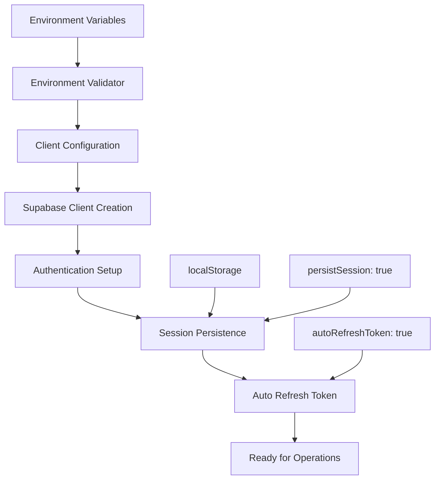
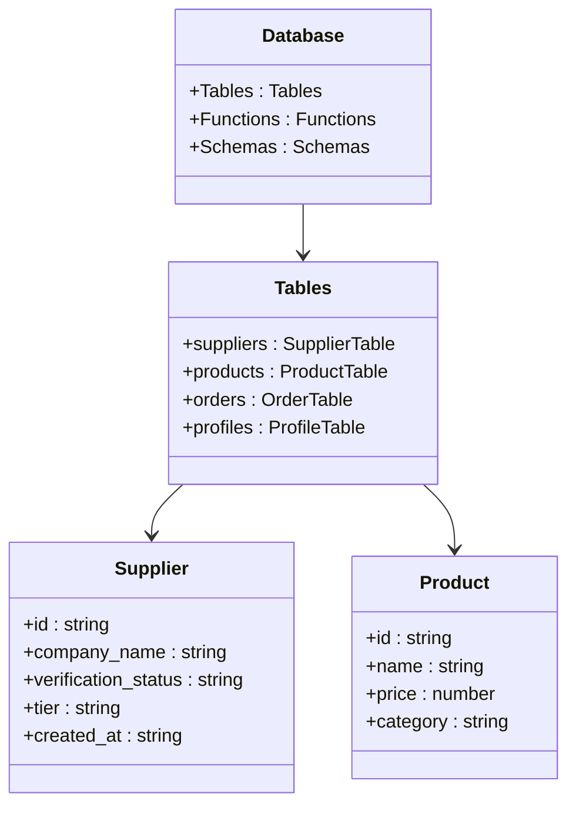
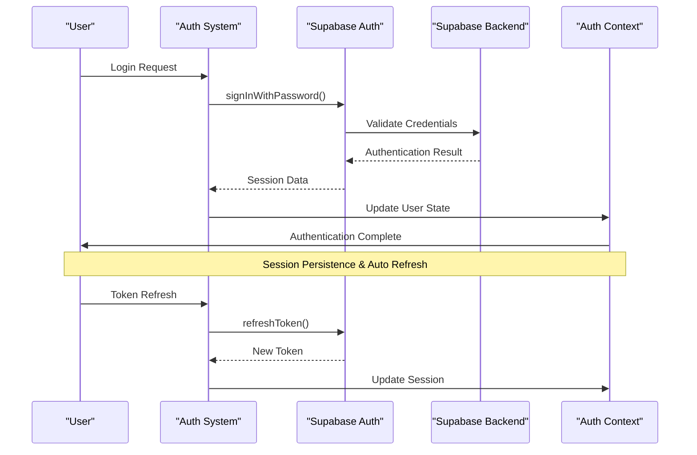
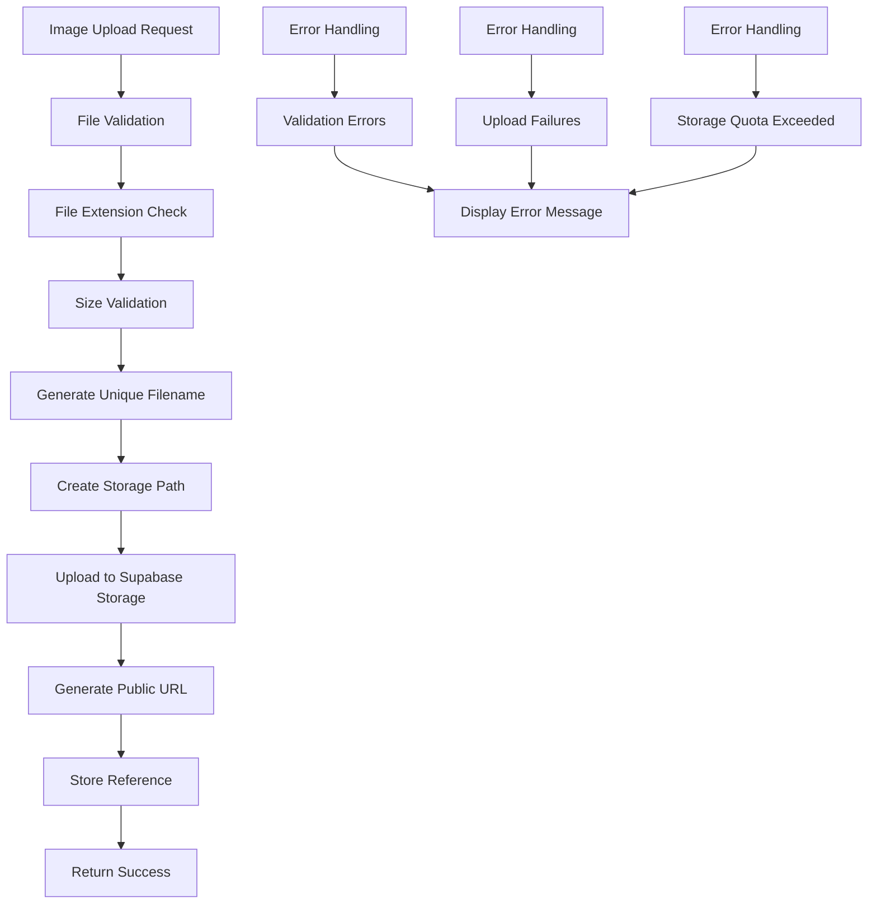
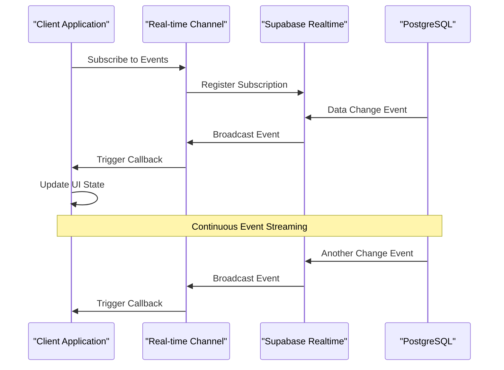
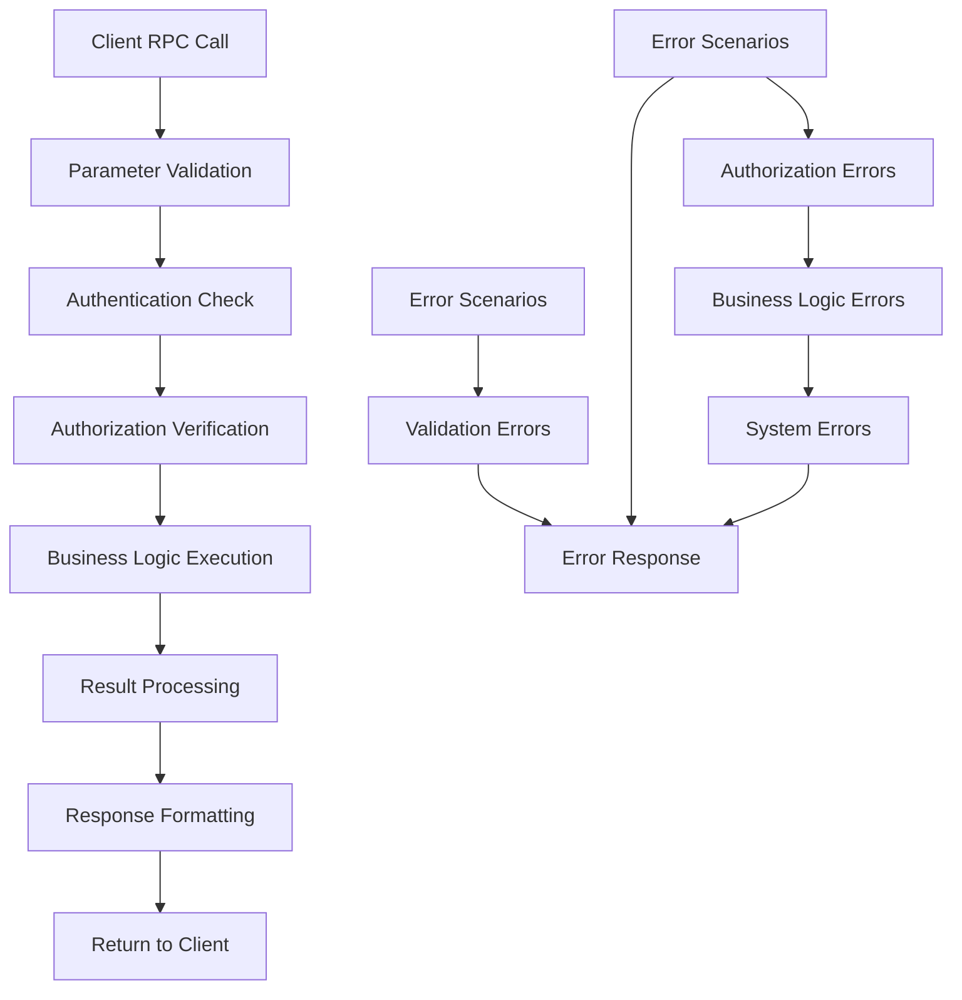
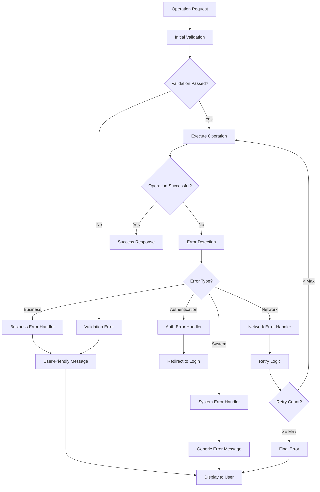

# Third-Party Integrations and Clients

<cite>
**Referenced Files in This Document**
- [client.ts](file://src/integrations/supabase/client.ts)
- [types.ts](file://src/integrations/supabase/types.ts)
- [env-validator.ts](file://src/lib/env-validator.ts)
- [useSuppliers.ts](file://src/hooks/useSuppliers.ts)
- [AdminStageMonitor.tsx](file://src/components/admin/AdminStageMonitor.tsx)
- [Auth.tsx](file://src/pages/Auth.tsx)
- [useRealtimeMessages.ts](file://src/hooks/useRealtimeMessages.ts)
- [ImageUploader.tsx](file://src/components/marketplace/ImageUploader.tsx)
- [ProductManagement.tsx](file://src/components/ProductManagement.tsx)
- [AuthContext.tsx](file://src/contexts/AuthContext.tsx)
- [ProductionUpdatesFeed.tsx](file://src/components/ProductionUpdatesFeed.tsx)
- [CommunicationCenter.tsx](file://src/components/shared/CommunicationCenter.tsx)
</cite>

## Table of Contents
1. [Introduction](#introduction)
2. [Supabase Client Initialization](#supabase-client-initialization)
3. [Type Safety and Database Operations](#type-safety-and-database-operations)
4. [Authentication Flow Integration](#authentication-flow-integration)
5. [Storage Access for Product Images](#storage-access-for-product-images)
6. [Real-time Subscriptions](#real-time-subscriptions)
7. [RPC Functions and Custom Operations](#rpc-functions-and-custom-operations)
8. [Error Handling and Connection Management](#error-handling-and-connection-management)
9. [Security Best Practices](#security-best-practices)
10. [Performance Considerations](#performance-considerations)
11. [Usage Examples](#usage-examples)
12. [Troubleshooting Guide](#troubleshooting-guide)

## Introduction

The Supabase integration serves as the primary backend connection for the Sleek Apparels application, providing a comprehensive suite of services including database operations, authentication, storage, and real-time capabilities. This integration is built around Supabase's JavaScript client library and implements robust type safety, security measures, and performance optimizations.

The integration manages connections to the Supabase backend through a centralized client configuration, implements Row Level Security (RLS) policies for data protection, and provides seamless authentication flows with OAuth providers. It also handles file uploads for product images, real-time subscriptions for live data updates, and custom RPC functions for specialized business logic.

## Supabase Client Initialization

The Supabase client initialization establishes the foundational connection to the backend services with comprehensive configuration options for authentication persistence and session management.



**Diagram sources**
- [client.ts](file://src/integrations/supabase/client.ts#L14-L20)
- [env-validator.ts](file://src/lib/env-validator.ts#L1-L143)

The client initialization process involves several critical steps:

### Environment Validation
The system validates required environment variables using a singleton validator pattern that ensures all necessary Supabase configuration is present before establishing connections. This validation occurs during module import and includes URL format checking, key length validation, and required field verification.

### Authentication Configuration
The client is configured with sophisticated authentication settings including localStorage-based session storage, automatic session persistence across browser sessions, and intelligent token refresh mechanisms that prevent unauthorized access while maintaining user convenience.

### Type Integration
The client is typed with the generated Database interface from Supabase's TypeScript definitions, enabling compile-time type safety across all database operations and reducing runtime errors.

**Section sources**
- [client.ts](file://src/integrations/supabase/client.ts#L1-L20)
- [env-validator.ts](file://src/lib/env-validator.ts#L1-L143)

## Type Safety and Database Operations

The type system provides comprehensive compile-time safety for all database operations, ensuring type correctness across queries, mutations, and real-time subscriptions.



**Diagram sources**
- [types.ts](file://src/integrations/supabase/types.ts#L1-L800)
- [useSuppliers.ts](file://src/hooks/useSuppliers.ts#L6-L29)

### Generated Type Definitions
The system utilizes Supabase's automated type generation to create comprehensive database interface definitions that include:

- **Row Types**: Complete schema definitions for each table with proper typing for all columns
- **Insert Types**: Type-safe insertion operations with optional field handling
- **Update Types**: Safe update operations with partial update capabilities
- **Relationship Types**: Foreign key relationships and join capabilities

### Query Type Safety
All database operations benefit from TypeScript's type inference, ensuring that:
- Column names are validated at compile time
- Data types match database schema definitions
- Relationship queries maintain type correctness
- Return types are accurately inferred

### Generic Type Support
The client supports generic typing for dynamic queries, allowing developers to create type-safe operations for custom scenarios while maintaining the benefits of compile-time validation.

**Section sources**
- [types.ts](file://src/integrations/supabase/types.ts#L1-L800)
- [useSuppliers.ts](file://src/hooks/useSuppliers.ts#L1-L215)

## Authentication Flow Integration

The authentication system provides comprehensive user management with support for multiple authentication methods, role-based access control, and seamless session management.



**Diagram sources**
- [Auth.tsx](file://src/pages/Auth.tsx#L403-L429)
- [AuthContext.tsx](file://src/contexts/AuthContext.tsx#L40-L166)

### Multi-Provider Authentication
The system supports multiple authentication providers including:
- **Email/Password**: Standard credential-based authentication
- **OAuth Providers**: Google authentication with automatic redirect handling
- **Magic Links**: Email-based authentication without passwords
- **Custom Providers**: Extensible authentication system for future providers

### Role-Based Access Control
Authentication integrates with the role system to provide:
- **User Roles**: Retailer, Wholesaler, Educational, Corporate, Sports Team, Factory, Admin, Supplier
- **User Types**: Buyer, Supplier, Admin categorization
- **Permission Inheritance**: Automatic permission assignment based on role hierarchy
- **Dynamic Role Resolution**: Runtime role determination with caching

### Session Management
Advanced session management includes:
- **Automatic Token Refresh**: Intelligent refresh mechanism prevents session expiration
- **Session Persistence**: Local storage-based session retention across browser restarts
- **Cross-Tab Synchronization**: Real-time session state synchronization across browser tabs
- **Secure Logout**: Comprehensive logout process with token revocation

**Section sources**
- [Auth.tsx](file://src/pages/Auth.tsx#L1-L429)
- [AuthContext.tsx](file://src/contexts/AuthContext.tsx#L1-L166)

## Storage Access for Product Images

The storage system provides secure, scalable image upload and retrieval capabilities specifically designed for product catalog management and user-generated content.



**Diagram sources**
- [ImageUploader.tsx](file://src/components/marketplace/ImageUploader.tsx#L87-L142)
- [ProductManagement.tsx](file://src/components/ProductManagement.tsx#L79-L113)

### File Upload Pipeline
The image upload system implements a comprehensive pipeline:

#### File Processing
- **Extension Validation**: Ensures only supported image formats are accepted
- **Size Limits**: Enforces reasonable file size constraints
- **Duplicate Prevention**: Prevents duplicate uploads with unique filename generation
- **Metadata Extraction**: Captures essential image metadata for optimization

#### Storage Organization
- **Path Structure**: Organized by product ID for easy content management
- **Bucket Management**: Dedicated storage buckets for different content types
- **Cache Control**: Configurable caching policies for optimal performance
- **Access Control**: Secure access restrictions with public URL generation

#### Error Handling
- **Network Resilience**: Retry mechanisms for transient failures
- **Quota Management**: Clear messaging for storage limitations
- **Format Compatibility**: Graceful degradation for unsupported formats
- **Progress Tracking**: Real-time upload progress feedback

### Image Optimization
The system includes built-in optimization features:
- **Automatic Compression**: Intelligent compression based on file type and size
- **Format Conversion**: Automatic conversion to optimal formats
- **Responsive Delivery**: Multiple resolution variants for different devices
- **CDN Integration**: Global content delivery network for fast access

**Section sources**
- [ImageUploader.tsx](file://src/components/marketplace/ImageUploader.tsx#L77-L168)
- [ProductManagement.tsx](file://src/components/ProductManagement.tsx#L79-L113)

## Real-time Subscriptions

The real-time system enables instant data synchronization across clients, providing live updates for messages, notifications, and production monitoring.



**Diagram sources**
- [useRealtimeMessages.ts](file://src/hooks/useRealtimeMessages.ts#L17-L61)
- [ProductionUpdatesFeed.tsx](file://src/components/ProductionUpdatesFeed.tsx#L80-L131)

### Subscription Management
The real-time system provides sophisticated subscription handling:

#### Channel Organization
- **Named Channels**: Logical grouping of related events
- **Event Filtering**: Precise event targeting with PostgreSQL filter expressions
- **Multi-Event Support**: Simultaneous listening for INSERT, UPDATE, DELETE events
- **Cleanup Management**: Automatic subscription cleanup on component unmount

#### Event Processing
- **Payload Parsing**: Structured event data with old/new state comparison
- **Conditional Logic**: Filter events based on business rules
- **Batch Processing**: Efficient handling of multiple simultaneous events
- **Error Recovery**: Robust error handling with automatic reconnection

### Production Monitoring
The system includes specialized monitoring capabilities:

#### Production Updates
- **Stage Tracking**: Real-time production stage progress updates
- **Completion Percentage**: Dynamic completion percentage updates
- **Photo Integration**: Live photo upload and display capabilities
- **User Notifications**: Instant notifications for significant updates

#### Message Systems
- **Two-Way Communication**: Real-time messaging between users
- **Thread Management**: Conversation threading with message history
- **Attachment Support**: File attachment handling within messages
- **Read Receipts**: Message read status tracking

**Section sources**
- [useRealtimeMessages.ts](file://src/hooks/useRealtimeMessages.ts#L1-L61)
- [ProductionUpdatesFeed.tsx](file://src/components/ProductionUpdatesFeed.tsx#L80-L131)
- [CommunicationCenter.tsx](file://src/components/shared/CommunicationCenter.tsx#L38-L131)

## RPC Functions and Custom Operations

Remote Procedure Calls enable custom business logic execution on the server side, providing powerful capabilities for complex operations that require server-side processing.



**Diagram sources**
- [setup-database.js](file://scripts/setup-database.js#L91-L126)

### Function Categories
The RPC system supports various types of custom functions:

#### Administrative Functions
- **Bootstrap Operations**: System initialization and configuration
- **Database Maintenance**: Schema updates and maintenance tasks
- **User Management**: Bulk user operations and administrative tasks
- **System Monitoring**: Health checks and performance monitoring

#### Business Logic Functions
- **Quote Generation**: AI-powered quote calculation and generation
- **Supplier Assignment**: Automated supplier matching and assignment
- **Order Processing**: Complex order workflow management
- **Analytics Calculation**: Aggregated data processing and reporting

#### Utility Functions
- **Data Migration**: Cross-system data transfer operations
- **Bulk Operations**: Mass data manipulation and updates
- **Report Generation**: Custom report creation and export
- **Integration Hooks**: External system integration points

### Error Handling
RPC functions implement comprehensive error handling:

#### Classification System
- **Validation Errors**: Input parameter validation failures
- **Authorization Errors**: Permission and access control violations
- **Business Logic Errors**: Domain-specific business rule violations
- **System Errors**: Infrastructure and service availability issues

#### Retry Mechanisms
- **Exponential Backoff**: Intelligent retry with increasing delays
- **Circuit Breaker**: Protection against cascading failures
- **Timeout Management**: Configurable operation timeouts
- **Graceful Degradation**: Fallback mechanisms for non-critical operations

**Section sources**
- [setup-database.js](file://scripts/setup-database.js#L91-L126)

## Error Handling and Connection Management

The error handling system provides comprehensive fault tolerance, graceful degradation, and meaningful error communication throughout the application.



**Diagram sources**
- [Auth.tsx](file://src/pages/Auth.tsx#L390-L400)
- [ProductManagement.tsx](file://src/components/ProductManagement.tsx#L95-L105)

### Network Error Management
The system implements sophisticated network error handling:

#### Connection Resilience
- **Automatic Retry**: Intelligent retry mechanisms with exponential backoff
- **Circuit Breaker**: Protection against continuous failure loops
- **Timeout Management**: Configurable timeouts for different operation types
- **Offline Detection**: Graceful handling of network connectivity issues

#### Error Classification
- **Transient Errors**: Temporary network or service issues
- **Permanent Errors**: Authentication failures and validation errors
- **Business Errors**: Application-specific business rule violations
- **System Errors**: Infrastructure and platform-level issues

### Authentication Error Handling
Specialized handling for authentication-related errors:

#### Session Management
- **Token Refresh**: Automatic token renewal before expiration
- **Session Validation**: Regular session health checks
- **Graceful Degradation**: Reduced functionality for expired sessions
- **User Notification**: Clear messaging for authentication issues

#### Security Considerations
- **Error Masking**: Generic error messages to prevent information leakage
- **Rate Limiting**: Protection against brute force attacks
- **Logging**: Secure logging of authentication events
- **Audit Trails**: Comprehensive audit trails for security monitoring

**Section sources**
- [Auth.tsx](file://src/pages/Auth.tsx#L390-L400)
- [ProductManagement.tsx](file://src/components/ProductManagement.tsx#L95-L105)

## Security Best Practices

The security implementation follows industry best practices for authentication, authorization, and data protection across all Supabase integrations.

### Authentication Security
- **Secure Token Storage**: Tokens stored securely with appropriate HTTP-only and SameSite attributes
- **CSRF Protection**: Cross-Site Request Forgery protection through secure cookie handling
- **Password Policies**: Strong password requirements with complexity validation
- **Multi-Factor Authentication**: Support for additional authentication factors

### Data Protection
- **Encryption**: Data encryption in transit and at rest
- **Access Controls**: Role-based access controls with least privilege principle
- **Audit Logging**: Comprehensive logging of all access and modification events
- **Data Validation**: Input validation and sanitization for all user inputs

### Network Security
- **HTTPS Enforcement**: Mandatory HTTPS for all communications
- **CORS Configuration**: Proper Cross-Origin Resource Sharing configuration
- **Rate Limiting**: Protection against abuse and denial-of-service attacks
- **IP Whitelisting**: Optional IP-based access restrictions

### Compliance
- **GDPR Compliance**: Data protection and privacy compliance measures
- **Data Retention**: Automated data cleanup and retention policies
- **Backup Security**: Encrypted backups with secure access controls
- **Incident Response**: Prepared incident response procedures

## Performance Considerations

The performance optimization strategies ensure efficient operation under various load conditions while maintaining responsiveness and reliability.

### Query Optimization
- **Index Utilization**: Strategic indexing for frequently queried columns
- **Query Planning**: Optimized query execution plans for complex operations
- **Caching Strategies**: Intelligent caching for frequently accessed data
- **Batch Operations**: Efficient bulk operations for large datasets

### Connection Pooling
- **Connection Reuse**: Efficient connection management and reuse
- **Pool Size Optimization**: Dynamic pool sizing based on load patterns
- **Idle Connection Management**: Automatic cleanup of unused connections
- **Load Balancing**: Distribution of connections across available resources

### Real-time Performance
- **Event Filtering**: Precise event filtering to reduce unnecessary traffic
- **Subscription Management**: Efficient subscription lifecycle management
- **Memory Optimization**: Careful memory management for long-running subscriptions
- **Bandwidth Conservation**: Optimized data transmission protocols

### Caching Strategies
- **Client-Side Caching**: Intelligent local caching with automatic invalidation
- **Server-Side Caching**: Application-level caching for expensive operations
- **CDN Integration**: Content delivery network for static assets
- **Cache Warming**: Proactive cache population for predictable loads

## Usage Examples

### Basic Database Operations
```typescript
// Supplier management example
const { data: suppliers, error } = await supabase
  .from('suppliers')
  .select('*')
  .eq('verification_status', 'verified')
  .order('tier', { ascending: false });

// Create new supplier
const { data: newSupplier, error } = await supabase
  .from('suppliers')
  .insert([{
    company_name: 'Example Supplier',
    factory_location: 'Bangladesh',
    moq_minimum: 100,
    lead_time_days: 30
  }])
  .select()
  .single();
```

### Real-time Subscriptions
```typescript
// Message subscription
const { channel } = useRealtimeMessages(userId, (message) => {
  console.log('New message:', message);
  // Update UI state with new message
});

// Production updates subscription
const channel = supabase
  .channel('production-updates')
  .on('postgres_changes', {
    event: 'INSERT',
    schema: 'public',
    table: 'order_updates',
    filter: `order_id=eq.${orderId}`
  }, (payload) => {
    // Handle new production update
    handleNewUpdate(payload.new);
  })
  .subscribe();
```

### Storage Operations
```typescript
// Image upload
const fileName = `${Date.now()}_${imageFile.name}`;
const { data, error } = await supabase.storage
  .from('product-images')
  .upload(fileName, imageFile, {
    upsert: false,
    contentType: imageFile.type
  });

// Get public URL
const { data: { publicUrl } } = supabase.storage
  .from('product-images')
  .getPublicUrl(data.path);
```

### Authentication Operations
```typescript
// Login with email/password
const { data: { user, session }, error } = await supabase.auth.signInWithPassword({
  email: 'user@example.com',
  password: 'password123'
});

// Sign up with OAuth
const { data: { url }, error } = await supabase.auth.signInWithOAuth({
  provider: 'google',
  options: {
    redirectTo: 'https://your-app.com/auth/callback'
  }
});

// User session management
const { data: { user } } = await supabase.auth.getUser();
if (user) {
  // User is authenticated
}
```

**Section sources**
- [useSuppliers.ts](file://src/hooks/useSuppliers.ts#L48-L98)
- [useRealtimeMessages.ts](file://src/hooks/useRealtimeMessages.ts#L17-L61)
- [ImageUploader.tsx](file://src/components/marketplace/ImageUploader.tsx#L104-L119)

## Troubleshooting Guide

### Common Issues and Solutions

#### Authentication Problems
**Issue**: Users unable to log in or session expires unexpectedly
**Solution**: 
- Verify environment variables are correctly configured
- Check network connectivity to Supabase endpoints
- Ensure proper CORS configuration
- Validate user account status and email verification

#### Storage Upload Failures
**Issue**: Image uploads failing or timing out
**Solution**:
- Check file size limits and supported formats
- Verify storage bucket permissions
- Monitor network connectivity
- Review storage quota limits

#### Real-time Subscription Issues
**Issue**: Subscriptions not receiving updates or disconnecting frequently
**Solution**:
- Verify PostgreSQL trigger configuration
- Check network stability
- Review subscription filter expressions
- Monitor connection limits

#### Database Query Performance
**Issue**: Slow database operations or timeouts
**Solution**:
- Review query execution plans
- Add appropriate indexes
- Optimize WHERE clause conditions
- Consider query batching for large datasets

### Debugging Tools
- **Console Logging**: Enable detailed logging for development
- **Network Monitoring**: Monitor network requests and responses
- **Database Profiling**: Analyze query performance and execution plans
- **Real-time Monitoring**: Track subscription health and event delivery

### Performance Monitoring
- **Response Times**: Monitor API response times and identify bottlenecks
- **Error Rates**: Track error rates and identify patterns
- **Resource Usage**: Monitor memory and CPU usage
- **Connection Metrics**: Track connection pool utilization

**Section sources**
- [Auth.tsx](file://src/pages/Auth.tsx#L390-L400)
- [ProductManagement.tsx](file://src/components/ProductManagement.tsx#L95-L105)
- [useRealtimeMessages.ts](file://src/hooks/useRealtimeMessages.ts#L33-L49)