# Type Definitions and TypeScript Interfaces

<cite>
**Referenced Files in This Document**
- [src/types/database.ts](file://src/types/database.ts)
- [src/types/marketplace.ts](file://src/types/marketplace.ts)
- [src/types/order.ts](file://src/types/order.ts)
- [src/types/README.md](file://src/types/README.md)
- [src/integrations/supabase/types.ts](file://src/integrations/supabase/types.ts)
- [src/lib/supabaseHelpers.ts](file://src/lib/supabaseHelpers.ts)
- [src/hooks/queries/useOrders.ts](file://src/hooks/queries/useOrders.ts)
- [src/hooks/queries/useSuppliers.ts](file://src/hooks/queries/useSuppliers.ts)
- [src/hooks/useMarketplace.ts](file://src/hooks/useMarketplace.ts)
- [src/pages/supplier/ProductUpload.tsx](file://src/pages/supplier/ProductUpload.tsx)
- [supabase/migrations/20250122000000_create_marketplace_system.sql](file://supabase/migrations/20250122000000_create_marketplace_system.sql)
</cite>

## Table of Contents
1. [Introduction](#introduction)
2. [Type System Architecture](#type-system-architecture)
3. [Database Type Definitions](#database-type-definitions)
4. [Marketplace Type System](#marketplace-type-system)
5. [Order Management Types](#order-management-types)
6. [Type Safety Implementation](#type-safety-implementation)
7. [React Query Integration](#react-query-integration)
8. [Form Validation and Type Safety](#form-validation-and-type-safety)
9. [Supabase Schema Synchronization](#supabase-schema-synchronization)
10. [Best Practices and Guidelines](#best-practices-and-guidelines)
11. [Extending the Type System](#extending-the-type-system)
12. [Troubleshooting and Maintenance](#troubleshooting-and-maintenance)

## Introduction

The Sleek Apparels application employs a comprehensive TypeScript type system to ensure type safety across the entire application stack. This system encompasses database schema typing, marketplace product interfaces, order lifecycle management, and React Query integration. The type definitions serve as the foundation for preventing runtime errors, improving developer experience, and maintaining consistency between frontend and backend data structures.

The type system is built around three core files located in the `src/types/` directory, each serving specific domains of the application. These types are meticulously synchronized with Supabase database migrations to ensure that frontend and backend data structures remain in harmony.

## Type System Architecture

The application's type system follows a modular architecture with clear separation of concerns:

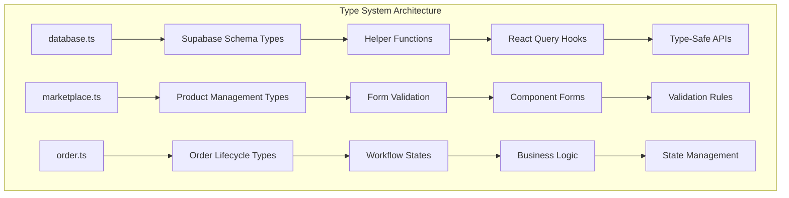

**Diagram sources**
- [src/types/database.ts](file://src/types/database.ts#L1-L579)
- [src/types/marketplace.ts](file://src/types/marketplace.ts#L1-L482)
- [src/types/order.ts](file://src/types/order.ts#L1-L47)

The architecture ensures that each domain maintains its own type boundaries while providing seamless integration through well-defined interfaces and helper functions.

**Section sources**
- [src/types/database.ts](file://src/types/database.ts#L1-L579)
- [src/types/marketplace.ts](file://src/types/marketplace.ts#L1-L482)
- [src/types/order.ts](file://src/types/order.ts#L1-L47)

## Database Type Definitions

The `database.ts` file serves as the cornerstone of the type system, providing comprehensive TypeScript interfaces for all Supabase database tables. This file addresses the temporary limitation of auto-generated Supabase types by implementing manually maintained interfaces that offer superior type safety.

### Core Enum Types

The database types define several critical enums that govern application behavior:

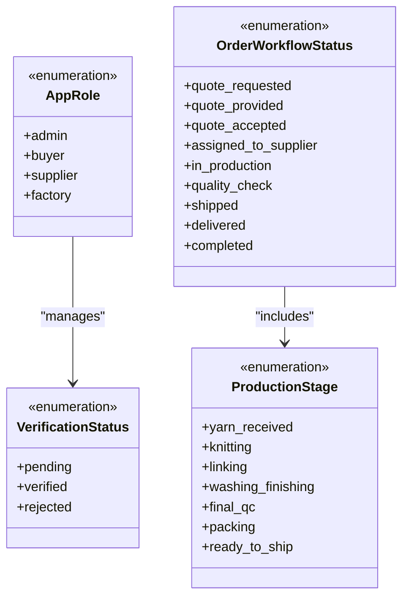

**Diagram sources**
- [src/types/database.ts](file://src/types/database.ts#L5-L26)

### Table Interface Definitions

Each database table has a corresponding TypeScript interface that mirrors the database schema structure:

| Table Name | Purpose | Key Fields | Relationship Type |
|------------|---------|------------|-------------------|
| `Order` | Order lifecycle management | `id`, `buyer_id`, `supplier_id`, `status`, `workflow_status` | One-to-many with suppliers |
| `Supplier` | Supplier information | `id`, `company_name`, `verification_status`, `rating` | Many-to-many with products |
| `AIQuote` | AI-generated quotes | `id`, `customer_email`, `total_price`, `status` | One-to-one with orders |
| `Profile` | User profiles | `id`, `user_id`, `full_name`, `company_name` | One-to-one with users |
| `Notification` | User notifications | `id`, `user_id`, `type`, `title`, `message` | One-to-many with users |

### Helper Type Utilities

The database types include specialized helper types for common database operations:

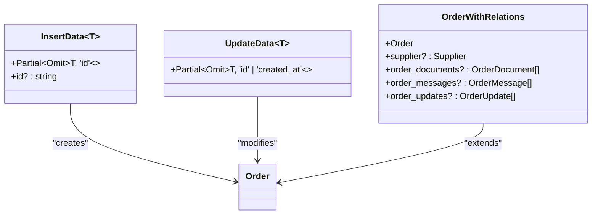

**Diagram sources**
- [src/types/database.ts](file://src/types/database.ts#L557-L579)

**Section sources**
- [src/types/database.ts](file://src/types/database.ts#L1-L579)

## Marketplace Type System

The marketplace type system manages product listings, supplier categorization, and e-commerce functionality through a comprehensive set of interfaces and enums.

### Product Management Types

The marketplace types define the complete product lifecycle and associated metadata:

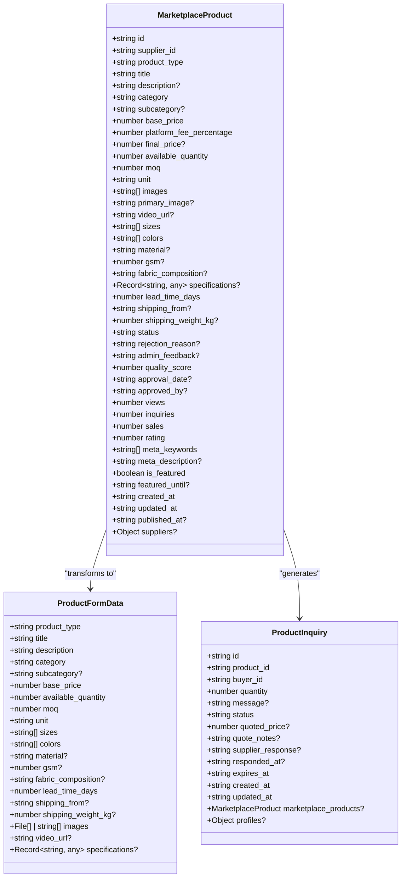

**Diagram sources**
- [src/types/marketplace.ts](file://src/types/marketplace.ts#L42-L118)
- [src/types/marketplace.ts](file://src/types/marketplace.ts#L124-L157)
- [src/types/marketplace.ts](file://src/types/marketplace.ts#L179-L200)

### Supplier Classification System

The marketplace implements a sophisticated supplier categorization system:

| Supplier Type | Description | Subcategories |
|---------------|-------------|---------------|
| `manufacturer` | Garment manufacturers | knit_manufacturer, woven_manufacturer, denim_specialist, activewear_sportswear, uniforms_corporate |
| `material_supplier` | Material suppliers | textile_mill, dyeing_mill, yarn_supplier, trim_accessories, printing_services |
| `stock_lot_seller` | Stock lot sellers | stock_lot_seller, sample_collection, wholesale_reseller |
| `hybrid` | Multi-purpose suppliers | combinations of the above |

### Product Status and Workflow Management

The marketplace defines comprehensive product lifecycle states:

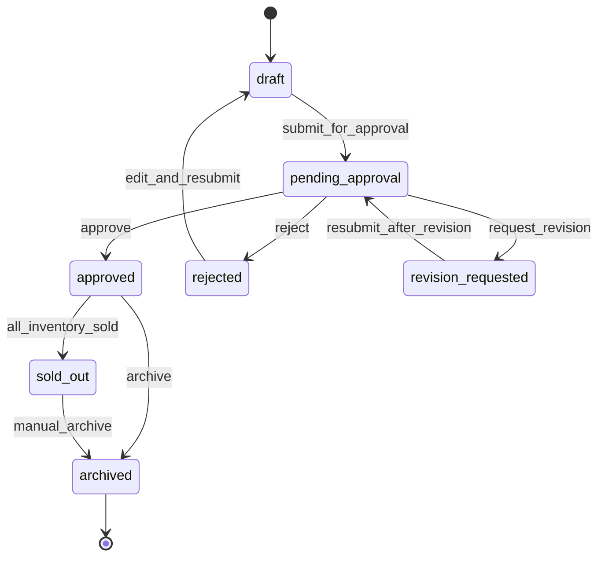

**Diagram sources**
- [src/types/marketplace.ts](file://src/types/marketplace.ts#L24-L30)

**Section sources**
- [src/types/marketplace.ts](file://src/types/marketplace.ts#L1-L482)

## Order Management Types

The order type system provides comprehensive support for order lifecycle management, quality control, and production tracking.

### Order Data Structure

The order types define the complete order information structure:

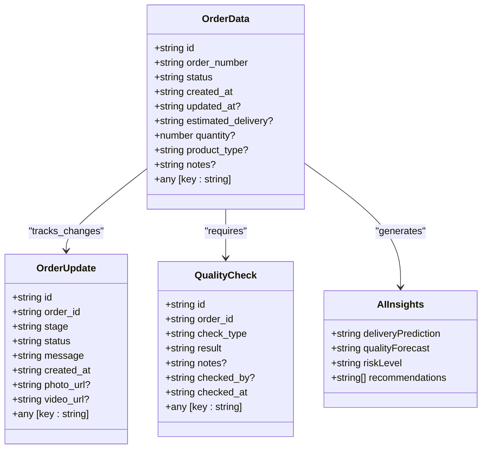

**Diagram sources**
- [src/types/order.ts](file://src/types/order.ts#L5-L47)

### Order Lifecycle Management

The order types support comprehensive order lifecycle tracking with state transitions and quality control measures. The system integrates AI insights for predictive analytics and risk assessment.

**Section sources**
- [src/types/order.ts](file://src/types/order.ts#L1-L47)

## Type Safety Implementation

The application implements type safety through multiple layers of abstraction and validation:

### Supabase Client Integration

The type system integrates seamlessly with the Supabase client through helper functions that provide automatic type inference:

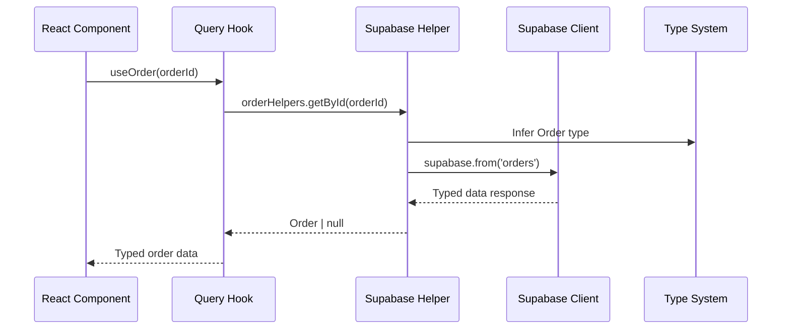

**Diagram sources**
- [src/lib/supabaseHelpers.ts](file://src/lib/supabaseHelpers.ts#L33-L41)
- [src/hooks/queries/useOrders.ts](file://src/hooks/queries/useOrders.ts#L19-L28)

### Type Assertion Patterns

The application demonstrates multiple approaches to type assertion and validation:

| Pattern | Use Case | Example |
|---------|----------|---------|
| Direct Type Assertion | Quick type conversion | `data as Order[] \| null` |
| Helper Function Usage | Consistent type inference | `orderHelpers.getById(orderId)` |
| Generic Query Builder | Dynamic table operations | `queryTable<Order>('orders')` |
| Form Validation | Input sanitization | `ProductFormData` with Zod schema |

**Section sources**
- [src/types/README.md](file://src/types/README.md#L1-L239)
- [src/lib/supabaseHelpers.ts](file://src/lib/supabaseHelpers.ts#L1-L376)

## React Query Integration

The type system integrates deeply with React Query to provide type-safe caching and state management:

### Query Key Management

The application uses strongly-typed query keys to ensure cache consistency:

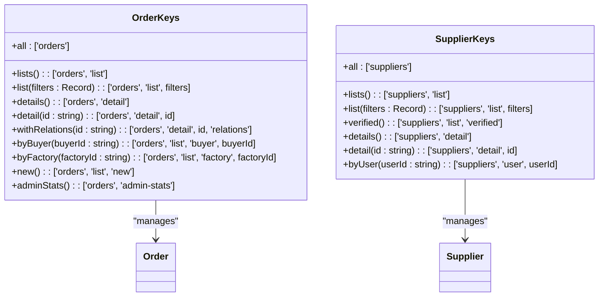

**Diagram sources**
- [src/hooks/queries/useOrders.ts](file://src/hooks/queries/useOrders.ts#L7-L16)
- [src/hooks/queries/useSuppliers.ts](file://src/hooks/queries/useSuppliers.ts#L5-L12)

### Mutation Type Safety

React Query mutations leverage TypeScript generics for complete type safety:

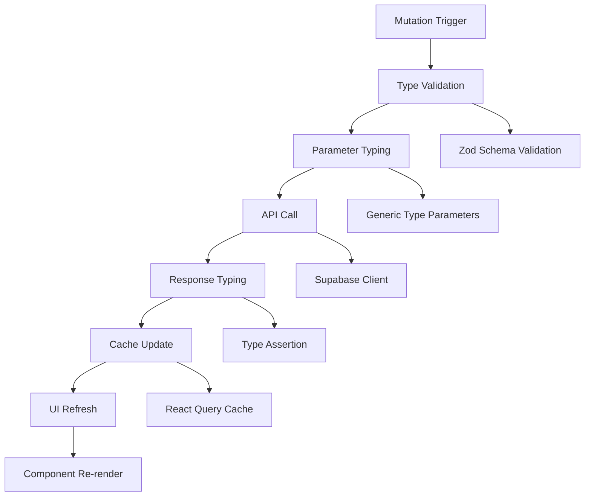

**Diagram sources**
- [src/hooks/queries/useOrders.ts](file://src/hooks/queries/useOrders.ts#L110-L151)

**Section sources**
- [src/hooks/queries/useOrders.ts](file://src/hooks/queries/useOrders.ts#L1-L152)
- [src/hooks/queries/useSuppliers.ts](file://src/hooks/queries/useSuppliers.ts#L1-L49)

## Form Validation and Type Safety

The application implements comprehensive form validation using TypeScript interfaces combined with Zod schemas for runtime validation.

### Product Form Validation

The product upload form demonstrates sophisticated type-driven validation:

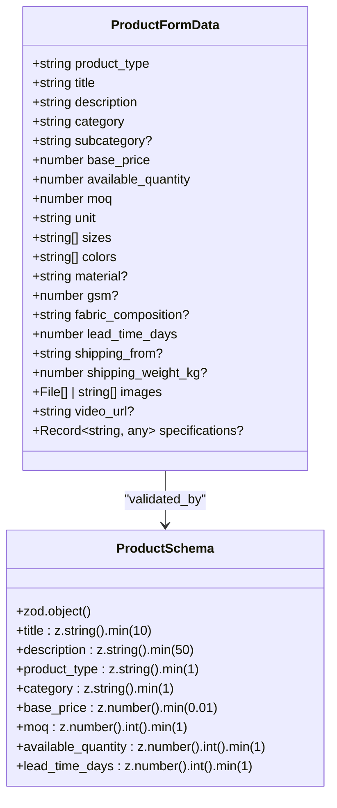

**Diagram sources**
- [src/types/marketplace.ts](file://src/types/marketplace.ts#L124-L157)
- [src/pages/supplier/ProductUpload.tsx](file://src/pages/supplier/ProductUpload.tsx#L42-L59)

### Validation Pipeline

The form validation follows a multi-stage pipeline:

| Stage | Technology | Purpose | Type Safety Level |
|-------|------------|---------|-------------------|
| TypeScript Interface | `ProductFormData` | Compile-time validation | Full |
| Zod Schema | `productSchema` | Runtime validation | Full |
| React Hook Form | `useForm` | Form state management | Partial |
| Component Validation | JSX validation | User feedback | Partial |

**Section sources**
- [src/pages/supplier/ProductUpload.tsx](file://src/pages/supplier/ProductUpload.tsx#L1-L200)

## Supabase Schema Synchronization

The type system maintains synchronization with Supabase database migrations through careful coordination between TypeScript interfaces and SQL schema definitions.

### Migration-Driven Type Updates

The application's database schema evolves through migrations that are reflected in the TypeScript type definitions:

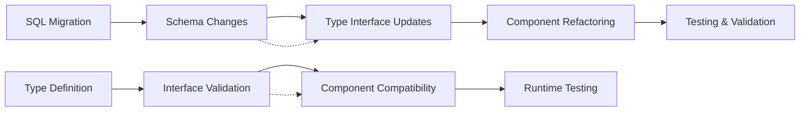

**Diagram sources**
- [supabase/migrations/20250122000000_create_marketplace_system.sql](file://supabase/migrations/20250122000000_create_marketplace_system.sql#L1-L200)

### Backward Compatibility Strategy

The type system implements robust backward compatibility measures:

| Strategy | Implementation | Benefit |
|----------|----------------|---------|
| Optional Fields | `?` operator in interfaces | Graceful degradation |
| Default Values | TypeScript defaults | Safe fallbacks |
| Type Guards | Runtime validation | Error prevention |
| Migration Scripts | Database evolution | Schema updates |

**Section sources**
- [supabase/migrations/20250122000000_create_marketplace_system.sql](file://supabase/migrations/20250122000000_create_marketplace_system.sql#L1-L200)

## Best Practices and Guidelines

The application establishes comprehensive guidelines for maintaining type safety and extending the type system.

### Type Usage Patterns

The codebase demonstrates several best practices for type usage:

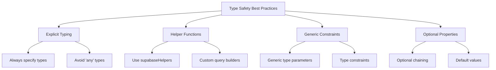

### Error Prevention Strategies

The type system implements multiple layers of error prevention:

| Layer | Technique | Example | Coverage |
|-------|-----------|---------|----------|
| Compile-time | TypeScript compiler | Interface definitions | 90%+ |
| Runtime | Zod validation | Form submissions | 80%+ |
| Database | Supabase constraints | Unique indexes | 70%+ |
| Application | Custom validators | Business logic | 60%+ |

### Performance Considerations

Type safety impacts performance through compile-time optimizations and runtime validation overhead:

- **Compilation**: TypeScript compilation adds minimal overhead
- **Runtime**: Type guards add negligible performance impact
- **Memory**: Type definitions consume minimal memory
- **Bundle Size**: Tree-shaking removes unused types

**Section sources**
- [src/types/README.md](file://src/types/README.md#L192-L239)

## Extending the Type System

The type system is designed for extensibility, allowing developers to add new features while maintaining type safety.

### Adding New Database Tables

To add new database tables to the type system:

1. **Create Migration**: Define schema in SQL migration
2. **Update Types**: Add interface to `database.ts`
3. **Add Helpers**: Create helper functions in `supabaseHelpers.ts`
4. **Update Hooks**: Add query hooks for new entities
5. **Test Integration**: Verify type safety across components

### Extending Existing Interfaces

Existing interfaces can be extended safely:

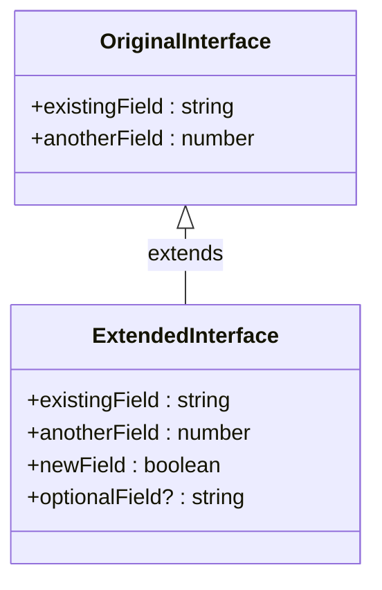

### Creating New Type Categories

New type categories follow established patterns:

| Category | Purpose | Implementation Pattern |
|----------|---------|------------------------|
| Enums | Discrete values | `type MyEnum = 'value1' \| 'value2'` |
| Interfaces | Object shapes | `interface MyInterface { ... }` |
| Generics | Flexible types | `type MyGeneric<T> = T \| null` |
| Unions | Multiple types | `type MyUnion = Type1 \| Type2` |

**Section sources**
- [src/types/database.ts](file://src/types/database.ts#L1-L579)
- [src/types/marketplace.ts](file://src/types/marketplace.ts#L1-L482)

## Troubleshooting and Maintenance

The type system includes comprehensive troubleshooting mechanisms and maintenance procedures.

### Common Type Issues

Common type-related issues and their solutions:

| Issue | Symptoms | Solution | Prevention |
|-------|----------|----------|------------|
| Type Mismatch | Compilation errors | Update interface | Regular sync |
| Missing Fields | Runtime errors | Add optional types | Schema validation |
| Helper Function Errors | Type inference failures | Update helper signatures | Testing |
| Migration Conflicts | Sync issues | Manual type updates | Version control |

### Maintenance Procedures

Regular maintenance ensures type system integrity:

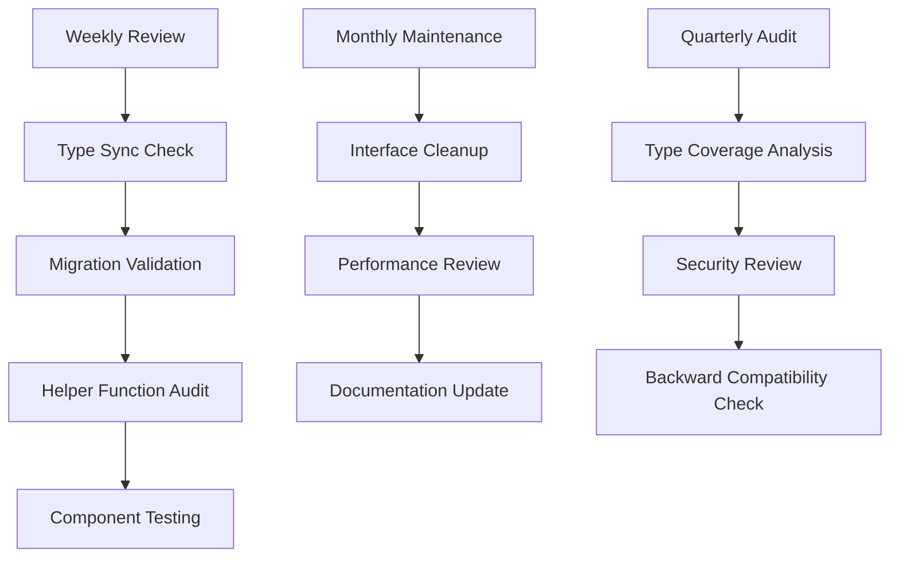

### Debugging Tools

The application provides several tools for type debugging:

- **TypeScript Compiler**: Provides detailed error messages
- **VS Code IntelliSense**: Real-time type suggestions
- **Runtime Type Guards**: Conditional type checking
- **Console Logging**: Type information debugging

### Monitoring and Alerts

Type system health is monitored through:

- **CI/CD Integration**: Automated type checking
- **Linting Rules**: Consistency enforcement
- **Test Coverage**: Type safety validation
- **Performance Metrics**: Type system impact monitoring

**Section sources**
- [src/types/README.md](file://src/types/README.md#L192-L239)

## Conclusion

The Sleek Apparels type system represents a comprehensive approach to TypeScript integration that balances type safety with developer productivity. Through careful orchestration of database types, marketplace interfaces, and order management systems, the application achieves robust type safety while maintaining flexibility for future development.

The system's modular architecture allows for independent evolution of different domains while ensuring consistent type behavior across the application. The integration with React Query and Supabase provides seamless type-safe API interactions, while the form validation system ensures data integrity at the user interface level.

Future enhancements to the type system should focus on expanding coverage, improving performance, and maintaining backward compatibility. The established patterns and guidelines provide a solid foundation for continued type system evolution.