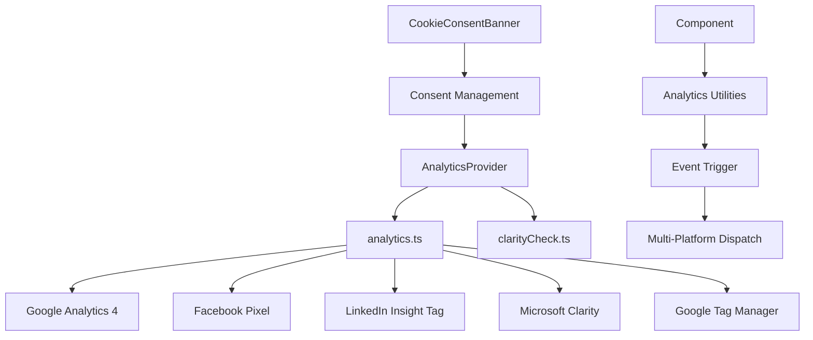
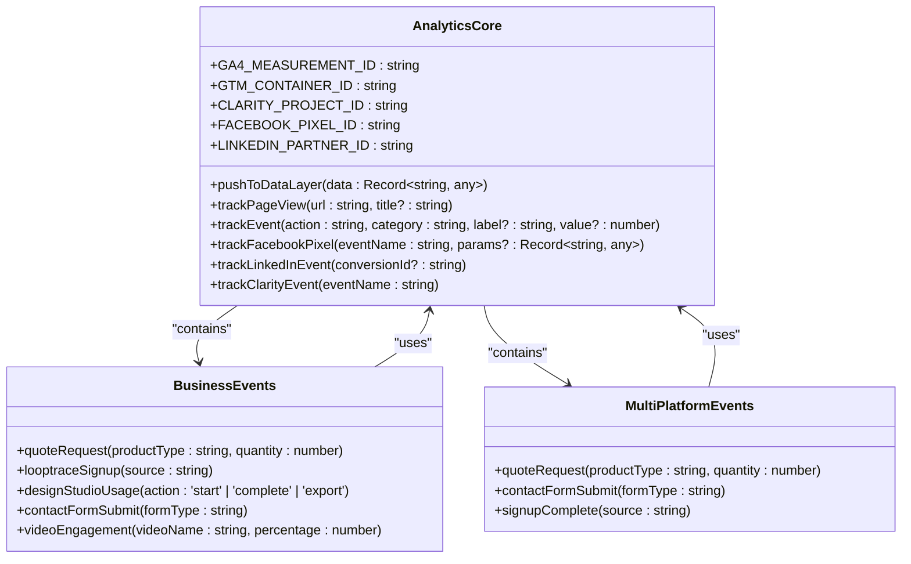
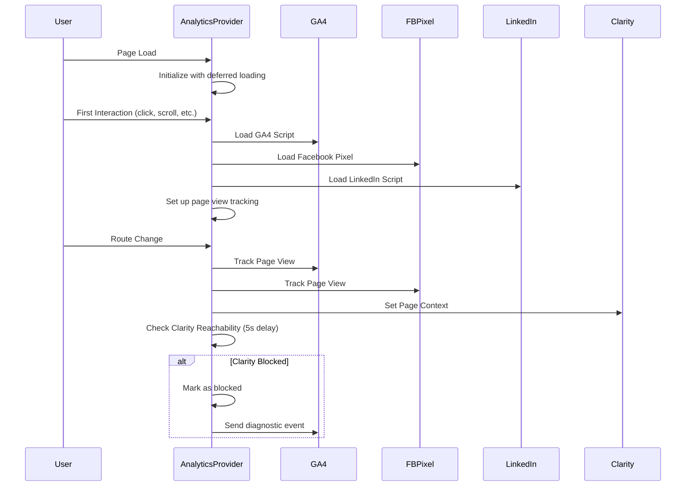
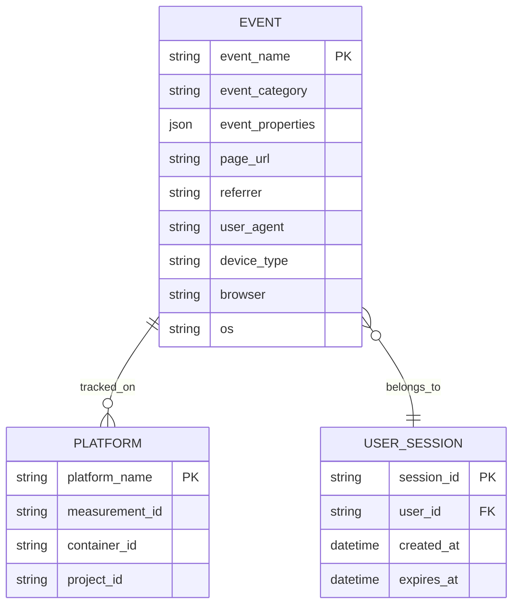
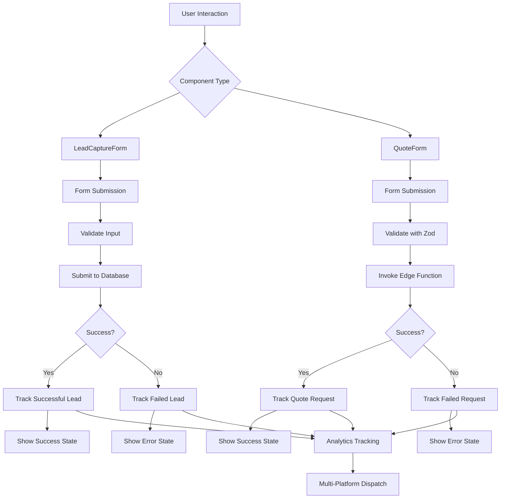
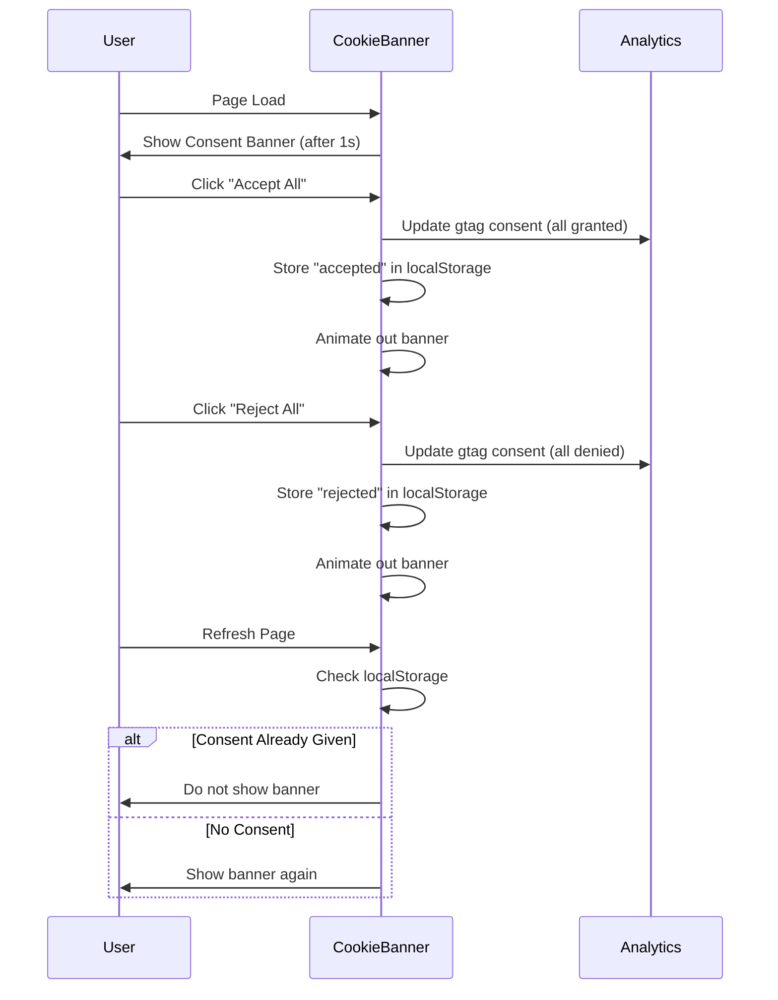
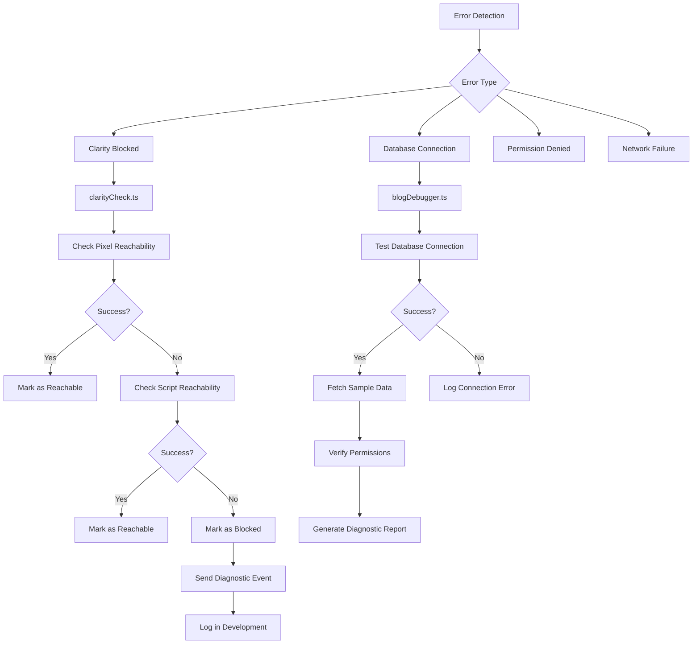
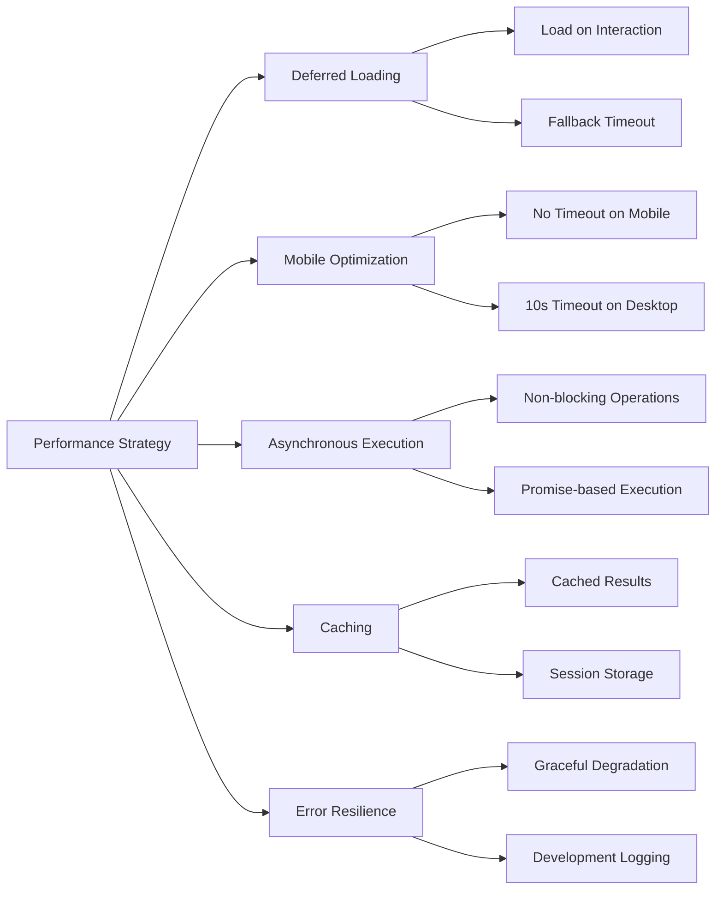
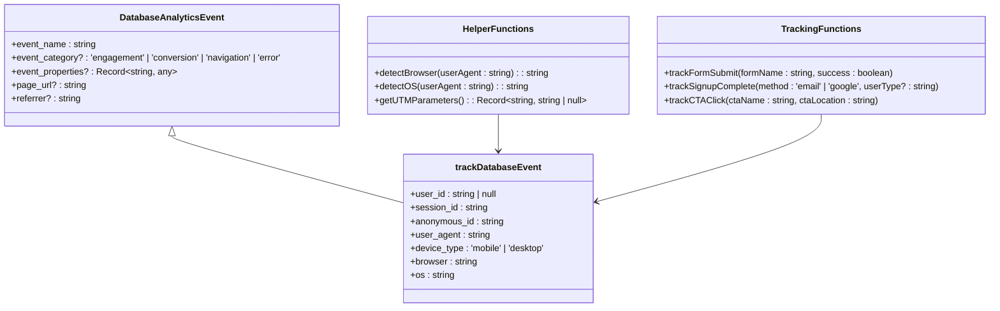

# Analytics Utilities

<cite>
**Referenced Files in This Document**   
- [analytics.ts](file://src/lib/analytics.ts)
- [analyticsTracking.ts](file://src/lib/analyticsTracking.ts)
- [tracker.ts](file://src/lib/analytics/tracker.ts)
- [clarityCheck.ts](file://src/lib/analytics/clarityCheck.ts)
- [blogDebugger.ts](file://src/lib/blogDebugger.ts)
- [AnalyticsProvider.tsx](file://src/components/AnalyticsProvider.tsx)
- [CookieConsentBanner.tsx](file://src/components/CookieConsentBanner.tsx)
- [LeadCaptureForm.tsx](file://src/components/LeadCaptureForm.tsx)
- [QuoteForm.tsx](file://src/components/QuoteForm.tsx)
- [App.tsx](file://src/App.tsx)
- [usePageTracking.ts](file://src/hooks/usePageTracking.ts)
</cite>

## Table of Contents
1. [Introduction](#introduction)
2. [Core Analytics Architecture](#core-analytics-architecture)
3. [Multi-Platform Tracking Implementation](#multi-platform-tracking-implementation)
4. [Analytics Provider and Initialization](#analytics-provider-and-initialization)
5. [Event Schema and Type Safety](#event-schema-and-type-safety)
6. [Component-Level Event Triggering](#component-level-event-triggering)
7. [Consent Management](#consent-management)
8. [Error Handling and Diagnostics](#error-handling-and-diagnostics)
9. [Performance Considerations](#performance-considerations)
10. [Database Analytics Integration](#database-analytics-integration)

## Introduction
The analytics utilities in the Sleek Apparels platform provide a comprehensive multi-platform tracking system that integrates Google Analytics 4, Facebook Pixel, LinkedIn Insight Tag, Google Tag Manager, and Microsoft Clarity. This documentation details the implementation of the analytics infrastructure, focusing on the central integration layer, event management, and component-level tracking. The system is designed to capture user behavior, conversion events, and engagement metrics across various touchpoints while maintaining performance and respecting user privacy through consent management.

## Core Analytics Architecture

The analytics architecture is built around a modular design that separates configuration, event tracking, and platform-specific implementations. The core components work together to provide a unified interface for tracking events across multiple analytics platforms.

**Diagram sources**
- [analytics.ts](file://src/lib/analytics.ts#L1-L183)
- [AnalyticsProvider.tsx](file://src/components/AnalyticsProvider.tsx#L1-L256)
- [CookieConsentBanner.tsx](file://src/components/CookieConsentBanner.tsx#L1-L109)

**Section sources**
- [analytics.ts](file://src/lib/analytics.ts#L1-L183)
- [AnalyticsProvider.tsx](file://src/components/AnalyticsProvider.tsx#L1-L256)

## Multi-Platform Tracking Implementation

The analytics.ts file serves as the central integration layer for multi-platform tracking, abstracting event tracking, page views, and user properties across different analytics services. It provides a unified interface that simplifies event tracking across platforms.

The implementation includes configuration constants for each analytics platform:
- Google Analytics 4 (GA4_MEASUREMENT_ID: G-1PYKLMP22J)
- Google Tag Manager (GTM_CONTAINER_ID: GTM-WGTH2FQ9)
- Microsoft Clarity (CLARITY_PROJECT_ID: txi3rcrykl)
- Facebook Pixel (FACEBOOK_PIXEL_ID: 1165081028902190)
- LinkedIn Insight Tag (LINKEDIN_PARTNER_ID: 514756254)

The system implements several key functions for cross-platform tracking:
- pushToDataLayer: Pushes custom events to GTM DataLayer
- trackPageView: Tracks page views in GA4
- trackEvent: Tracks custom events in GA4
- trackBusinessEvent: Tracks business-specific events with platform-specific parameters
- trackMultiPlatformEvent: Coordinates events across all platforms

**Diagram sources**
- [analytics.ts](file://src/lib/analytics.ts#L1-L183)

**Section sources**
- [analytics.ts](file://src/lib/analytics.ts#L1-L183)

## Analytics Provider and Initialization

The AnalyticsProvider component manages the initialization and lifecycle of analytics scripts, ensuring optimal performance and user experience. It implements deferred loading strategies to minimize impact on page load times.

Key features of the AnalyticsProvider:
- Deferred initialization on user interaction (mousedown, touchstart, scroll, keydown)
- Mobile/desktop-specific loading strategies
- Fallback mechanisms with timeouts
- Integration with React Router for page view tracking
- Error handling for blocked or failed script loading

The provider initializes each analytics platform separately:
- Google Analytics: Loads on first user interaction with 10-second fallback on desktop
- Facebook Pixel: Loads on interaction with 10-second fallback on desktop
- LinkedIn Insight Tag: Loads on interaction with 10-second fallback on desktop
- Microsoft Clarity: Checked for reachability after GTM initialization

**Diagram sources**
- [AnalyticsProvider.tsx](file://src/components/AnalyticsProvider.tsx#L1-L256)

**Section sources**
- [AnalyticsProvider.tsx](file://src/components/AnalyticsProvider.tsx#L1-L256)

## Event Schema and Type Safety

The analytics system implements a type-safe event schema to ensure consistency and prevent errors in event tracking. This is achieved through TypeScript interfaces and well-defined function signatures.

The primary event tracking functions include:
- trackEvent: Generic event tracking with action, category, label, and value parameters
- trackBusinessEvent: Predefined business events with specific parameters
- trackMultiPlatformEvent: Coordinated events across multiple platforms

Each analytics platform has specific event requirements:
- Google Analytics: Uses gtag function with event parameters
- Facebook Pixel: Uses fbq function with event names and parameters
- LinkedIn: Uses lintrk function with conversion IDs
- Microsoft Clarity: Uses clarity function with event names

The system also includes database analytics tracking through analyticsTracking.ts, which defines a DatabaseAnalyticsEvent interface with properties for event name, category, properties, page URL, and referrer.

**Diagram sources**
- [analytics.ts](file://src/lib/analytics.ts#L1-L183)
- [analyticsTracking.ts](file://src/lib/analyticsTracking.ts#L1-L149)

**Section sources**
- [analytics.ts](file://src/lib/analytics.ts#L1-L183)
- [analyticsTracking.ts](file://src/lib/analyticsTracking.ts#L1-L149)

## Component-Level Event Triggering

Analytics events are triggered from various components throughout the application, with LeadCaptureForm.tsx and QuoteForm.tsx serving as primary examples of event-driven components.

The LeadCaptureForm component tracks:
- Form submission success/failure
- Lead capture events with user type and source
- UTM parameters for campaign tracking

The QuoteForm component implements:
- Form validation with Zod schema
- Session tracking with localStorage
- Edge function integration for quote submission
- Success/error state management

Both components use the analytics utilities to track relevant events, ensuring consistent data collection across the platform.

**Diagram sources**
- [LeadCaptureForm.tsx](file://src/components/LeadCaptureForm.tsx#L1-L295)
- [QuoteForm.tsx](file://src/components/QuoteForm.tsx#L1-L213)

**Section sources**
- [LeadCaptureForm.tsx](file://src/components/LeadCaptureForm.tsx#L1-L295)
- [QuoteForm.tsx](file://src/components/QuoteForm.tsx#L1-L213)

## Consent Management

The CookieConsentBanner component handles user consent for tracking, complying with privacy regulations and user preferences. It provides a user-friendly interface for accepting or rejecting non-essential cookies.

Key features of the consent management system:
- Local storage persistence of consent choices
- GDPR-compliant consent workflow
- Dynamic updating of gtag consent settings
- Visual feedback for user actions
- Smooth animations for banner appearance/disappearance

When users accept or reject tracking, the system updates the gtag consent settings accordingly, controlling which analytics scripts are allowed to run.

**Diagram sources**
- [CookieConsentBanner.tsx](file://src/components/CookieConsentBanner.tsx#L1-L109)

**Section sources**
- [CookieConsentBanner.tsx](file://src/components/CookieConsentBanner.tsx#L1-L109)

## Error Handling and Diagnostics

The analytics system includes comprehensive error handling and diagnostic capabilities to ensure reliability and troubleshoot issues.

The clarityCheck.ts module implements reachability testing for Microsoft Clarity resources:
- Checks both tracking pixel and main script
- Uses cached results to prevent redundant checks
- Handles HTTPS inspection and firewall blocking
- Provides detailed error information

The blogDebugger.ts utility offers comprehensive debugging for blog data fetching:
- Connection status verification
- Supabase configuration validation
- Database connectivity testing
- Permission checks for read/write operations
- RLS policy verification
- Detailed diagnostic output

**Diagram sources**
- [clarityCheck.ts](file://src/lib/analytics/clarityCheck.ts#L1-L124)
- [blogDebugger.ts](file://src/lib/blogDebugger.ts#L1-L246)

**Section sources**
- [clarityCheck.ts](file://src/lib/analytics/clarityCheck.ts#L1-L124)
- [blogDebugger.ts](file://src/lib/blogDebugger.ts#L1-L246)

## Performance Considerations

The analytics implementation prioritizes performance through several key strategies:

1. **Deferred Loading**: Analytics scripts load only after user interaction or with delayed timeouts, preventing render-blocking behavior.

2. **Mobile Optimization**: Different loading strategies for mobile vs. desktop, recognizing that mobile users are more sensitive to performance impacts.

3. **Asynchronous Execution**: All analytics operations are non-blocking, ensuring they don't interfere with core application functionality.

4. **Caching**: Results are cached to prevent redundant network requests and processing.

5. **Error Resilience**: Failed analytics operations are handled gracefully without affecting user experience.

The system also implements performance monitoring through the usePageTracking hook, which tracks page views and bounce rates, providing insights into user engagement and potential performance issues.

**Diagram sources**
- [AnalyticsProvider.tsx](file://src/components/AnalyticsProvider.tsx#L1-L256)
- [usePageTracking.ts](file://src/hooks/usePageTracking.ts#L1-L23)

**Section sources**
- [AnalyticsProvider.tsx](file://src/components/AnalyticsProvider.tsx#L1-L256)
- [usePageTracking.ts](file://src/hooks/usePageTracking.ts#L1-L23)

## Database Analytics Integration

The analytics system integrates with the database through analyticsTracking.ts, providing server-side event tracking that complements client-side analytics.

Key features of the database analytics integration:
- Session management with sessionStorage
- Anonymous user tracking with session IDs
- Comprehensive user agent parsing
- Device type detection (mobile/desktop)
- Browser and OS identification
- UTM parameter capture
- Error handling with graceful degradation

The trackDatabaseEvent function captures detailed information about user interactions, including:
- Event name and category
- User authentication status
- Session and anonymous IDs
- Page URL and referrer
- Browser and device information
- Custom event properties

This database-level tracking provides a reliable backup to client-side analytics and enables analysis of user behavior that might not be captured by third-party services.

**Diagram sources**
- [analyticsTracking.ts](file://src/lib/analyticsTracking.ts#L1-L149)

**Section sources**
- [analyticsTracking.ts](file://src/lib/analyticsTracking.ts#L1-L149)