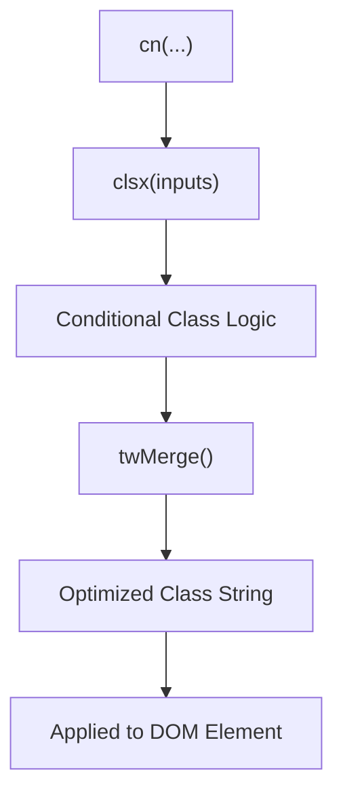
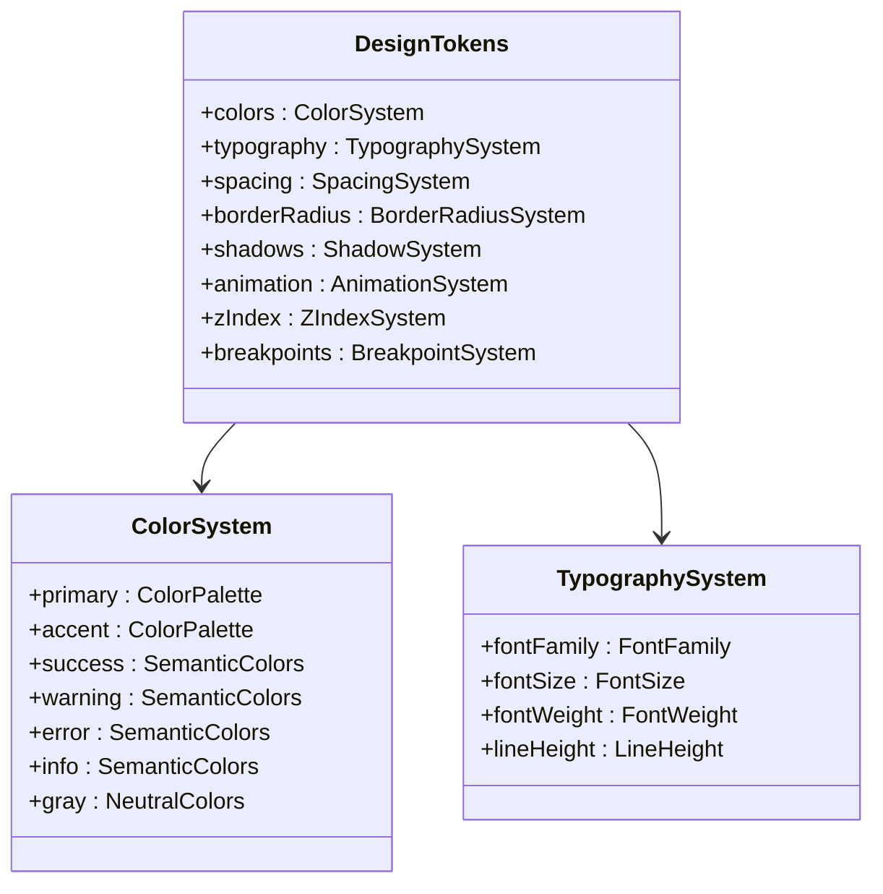
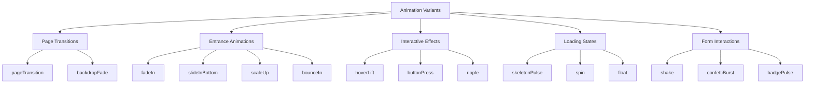
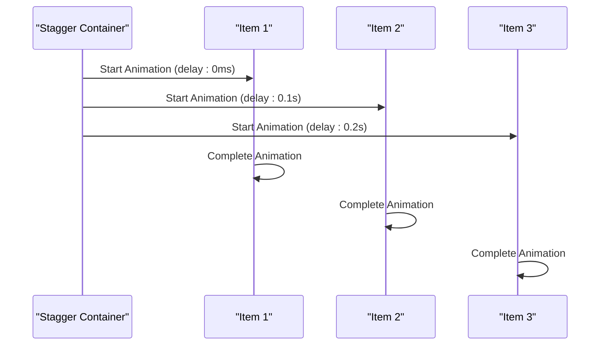
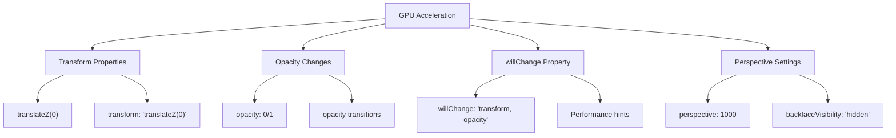
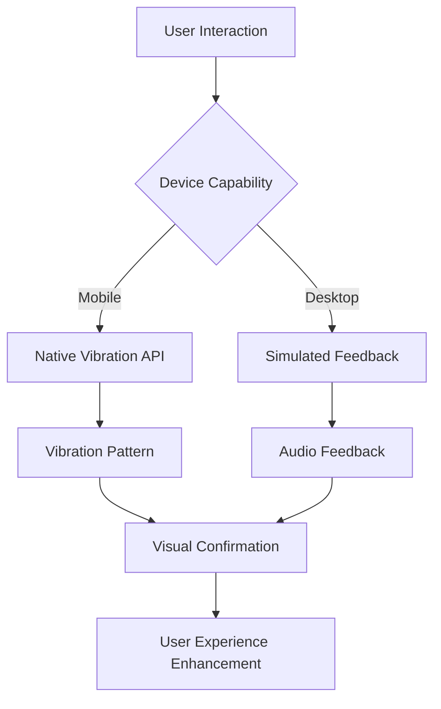
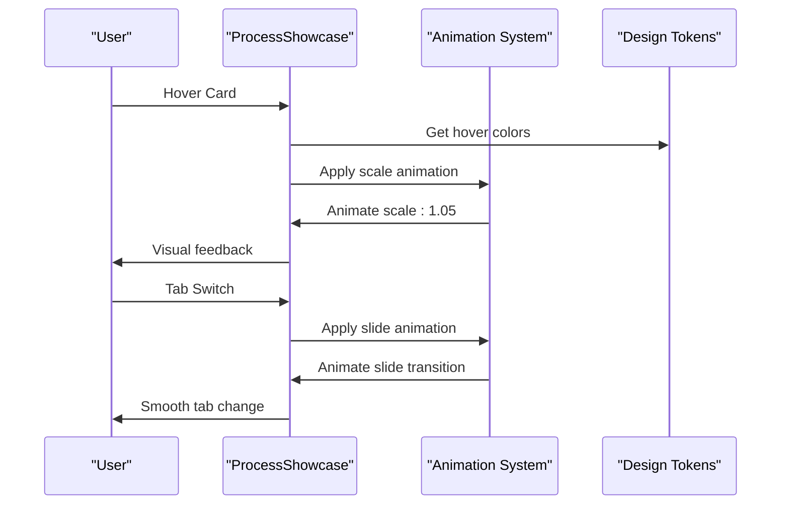
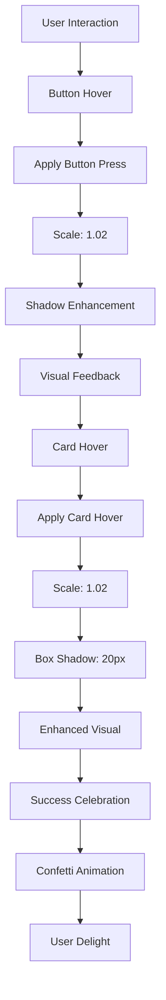
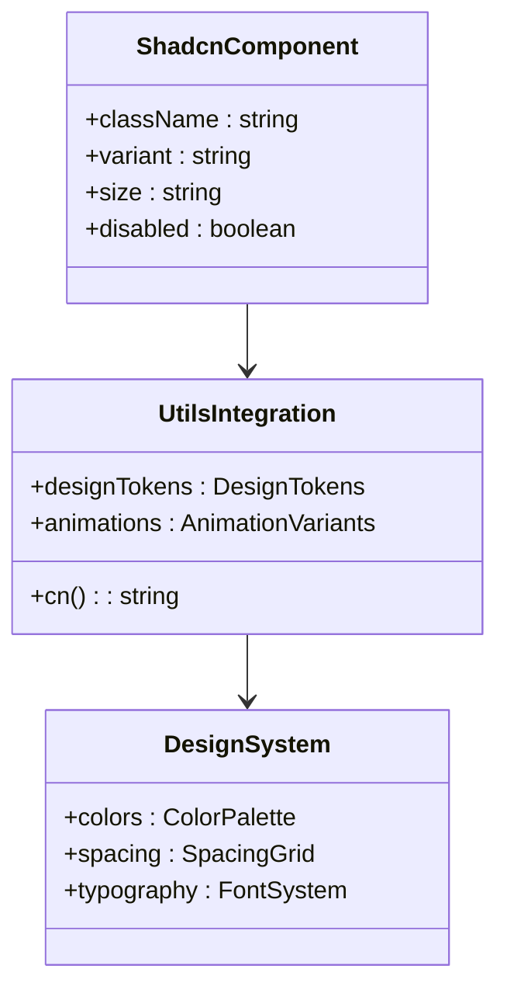
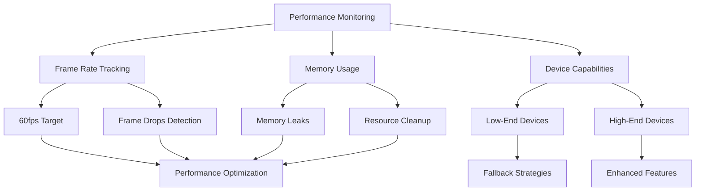

# Core Utility Functions

<cite>
**Referenced Files in This Document**
- [utils.ts](file://src/lib/utils.ts)
- [designTokens.ts](file://src/lib/designTokens.ts)
- [animations.ts](file://src/lib/animations.ts)
- [optimizedAnimations.ts](file://src/lib/optimizedAnimations.ts)
- [microInteractions.ts](file://src/lib/microInteractions.ts)
- [ProcessShowcase.tsx](file://src/components/ProcessShowcase.tsx)
- [ValuePropositions.tsx](file://src/components/ValuePropositions.tsx)
- [AnimatedSection.tsx](file://src/components/AnimatedSection.tsx)
</cite>

## Table of Contents
1. [Introduction](#introduction)
2. [Utility Foundation: utils.ts](#utility-foundation-utilsts)
3. [Design System Foundation: designTokens.ts](#design-system-foundation-designtokensts)
4. [Animation Framework: animations.ts](#animation-framework-animationsts)
5. [Performance-Optimized Animations: optimizedAnimations.ts](#performance-optimized-animations-optimizedanimationsts)
6. [Micro-Interaction Library: microInteractions.ts](#micro-interaction-library-microinteractionsts)
7. [Component Integration Examples](#component-integration-examples)
8. [Shadcn/UI Integration Patterns](#shadcnui-integration-patterns)
9. [Performance Considerations](#performance-considerations)
10. [Best Practices and Usage Guidelines](#best-practices-and-usage-guidelines)

## Introduction

The SleekApparels application employs a sophisticated suite of core utility functions that provide foundational support across the entire codebase. These utilities form the backbone of the application's design system, animation framework, and user interaction patterns, ensuring consistency, performance, and delightful user experiences.

The utility ecosystem consists of five primary modules:
- **utils.ts**: Provides fundamental class composition utilities for Tailwind CSS integration
- **designTokens.ts**: Centralizes design system values for colors, typography, spacing, and animations
- **animations.ts**: Offers comprehensive Framer Motion variants for complex animations
- **optimizedAnimations.ts**: Specialized GPU-accelerated animations for performance-critical scenarios
- **microInteractions.ts**: Delivers subtle UX enhancements including haptic feedback and visual effects

These utilities work together to create a cohesive design system that bridges the gap between design specifications and implementation, while maintaining optimal performance across all devices and browsers.

## Utility Foundation: utils.ts

The `utils.ts` module serves as the foundation for class composition in the application, providing a unified interface for combining Tailwind CSS classes with conditional logic.

### Core Functionality

The primary export is the `cn()` function, which combines the power of `clsx` for conditional class logic with `twMerge` for intelligent Tailwind class merging:

**Diagram sources**
- [utils.ts](file://src/lib/utils.ts#L4-L6)

### Implementation Details

The `cn()` function accepts multiple arguments of type `ClassValue[]`, allowing for flexible class composition patterns. It intelligently handles:
- Conditional class application based on boolean values
- Array concatenation for dynamic class lists
- Object key-value pairs for conditional classes
- String literals for static classes

### Usage Patterns

Common usage patterns include:
- Conditional styling based on component props
- Dynamic theme switching
- Responsive design class combinations
- State-based visual modifications

**Section sources**
- [utils.ts](file://src/lib/utils.ts#L1-L7)

## Design System Foundation: designTokens.ts

The `designTokens.ts` module establishes a comprehensive design system that governs all visual aspects of the application. It provides centralized values for colors, typography, spacing, and animation timing, ensuring consistency across the entire codebase.

### Design Token Architecture

**Diagram sources**
- [designTokens.ts](file://src/lib/designTokens.ts#L6-L204)

### Color System Design

The color system follows a hierarchical structure with semantic meaning:

| Color Category | Purpose | Usage Pattern |
|----------------|---------|---------------|
| Primary | Brand identity, primary actions | `colors.primary.500` |
| Accent | Highlight elements, secondary actions | `colors.accent.500` |
| Success | Positive feedback, confirmations | `colors.success.500` |
| Warning | Cautionary information | `colors.warning.500` |
| Error | Error states, destructive actions | `colors.error.500` |
| Info | Informational content | `colors.info.500` |
| Grays | Neutral tones, backgrounds | `colors.gray.500` |

### Typography System

The typography system implements a modular approach with consistent scaling:

| Size Category | Value | Use Case |
|---------------|-------|----------|
| xs | 0.75rem (12px) | Small captions, footnotes |
| sm | 0.875rem (14px) | Body text, secondary content |
| base | 1rem (16px) | Standard body text |
| lg | 1.125rem (18px) | Large body text |
| xl | 1.25rem (20px) | Heading levels |
| 2xl | 1.563rem (25px) | Major headings |
| 3xl | 1.953rem (31px) | Hero headings |
| 4xl | 2.441rem (39px) | Display text |
| 5xl | 3.052rem (49px) | Impact headings |
| 6xl | 3.815rem (61px) | Emphasis text |

### Animation Timing System

The animation system provides standardized timing values for consistent user experience:

| Duration | Value | Use Case |
|----------|-------|----------|
| fast | 150ms | Quick feedback, small transitions |
| base | 300ms | Standard interactions, moderate transitions |
| slow | 500ms | Notable animations, significant transitions |
| slower | 800ms | Major state changes, loading indicators |

**Section sources**
- [designTokens.ts](file://src/lib/designTokens.ts#L1-L205)

## Animation Framework: animations.ts

The `animations.ts` module provides a comprehensive library of Framer Motion variants designed for consistent, performant animations across the application. These variants serve as reusable building blocks for complex animation sequences.

### Animation Variant Categories

**Diagram sources**
- [animations.ts](file://src/lib/animations.ts#L1-L281)

### Performance-Optimized Variants

Each animation variant is carefully crafted for optimal performance:

#### Entrance Animations
- **Fade In**: Subtle opacity transition with smooth easing
- **Slide In Variants**: Directional entrance with momentum
- **Scale Up**: Bouncy entrance with spring physics
- **Bounce In**: Energy-filled entrance with spring animation

#### Interactive Effects
- **Hover Lift**: Subtle elevation on hover with shadow enhancement
- **Button Press**: Responsive scale transformation for tactile feedback
- **Ripple Effect**: Circular wave animation for touch interactions

#### Loading States
- **Skeleton Pulse**: Subtle opacity animation for loading placeholders
- **Spin Animation**: Continuous rotation for loading indicators
- **Float Animation**: Gentle vertical movement for decorative elements

### Animation Composition Patterns

The animation system supports complex compositions through staggered animations and container variants:

**Diagram sources**
- [animations.ts](file://src/lib/animations.ts#L110-L128)

**Section sources**
- [animations.ts](file://src/lib/animations.ts#L1-L281)

## Performance-Optimized Animations: optimizedAnimations.ts

The `optimizedAnimations.ts` module focuses specifically on GPU-accelerated animations that maximize performance while maintaining visual quality. These animations are designed for critical user interactions where smooth 60fps performance is essential.

### GPU Acceleration Strategies

**Diagram sources**
- [optimizedAnimations.ts](file://src/lib/optimizedAnimations.ts#L1-L158)

### Optimized Animation Variants

#### Fade In Animation
The optimized fade in animation uses GPU acceleration for smooth transitions:

- **Initial State**: Opacity 0, Y translation, forced GPU rendering
- **Transform Optimization**: `translateZ(0)` ensures hardware acceleration
- **Transition Timing**: Custom easing for natural feel
- **Exit State**: Optimized cleanup with minimal performance impact

#### Scale Animation
Spring-based scaling with physics-driven motion:

- **Physics Simulation**: Configurable stiffness and damping
- **Responsive Behavior**: Adapts to different device capabilities
- **Memory Efficiency**: Minimal DOM manipulation during animation

#### Button Interactions
Touch-responsive button animations:

- **Hover Effects**: Spring-based scale with immediate response
- **Tap Effects**: Subtle compression for tactile feedback
- **Performance Monitoring**: Automatic fallback for low-end devices

### Scroll Reveal Optimization

The scroll reveal animation incorporates viewport intersection detection with performance optimizations:

- **Viewport Detection**: Efficient intersection observer integration
- **Lazy Loading**: Automatic activation when elements enter viewport
- **Margin Adjustments**: Configurable trigger thresholds
- **Once Execution**: Prevents re-triggering for improved performance

**Section sources**
- [optimizedAnimations.ts](file://src/lib/optimizedAnimations.ts#L1-L158)

## Micro-Interaction Library: microInteractions.ts

The `microInteractions.ts` module delivers subtle yet impactful user experience enhancements that create a sense of delight and responsiveness. These micro-interactions bridge the gap between user input and visual feedback.

### Haptic Feedback System

**Diagram sources**
- [microInteractions.ts](file://src/lib/microInteractions.ts#L19-L35)

### Feedback Types and Patterns

The haptic feedback system supports six distinct feedback types:

| Style | Pattern | Frequency | Use Case |
|-------|---------|-----------|----------|
| Light | [10ms] | Single pulse | Button clicks, minor actions |
| Medium | [20ms] | Single pulse | Moderate interactions |
| Heavy | [30ms] | Single pulse | Significant actions |
| Success | [10, 50, 10] | Double pulse | Confirmations, completions |
| Warning | [20, 100, 20] | Double pulse | Cautionary warnings |
| Error | [30, 100, 30, 100, 30] | Triple pulse | Error states |

### Visual Effects Library

#### Success Celebrations
Confetti burst animations with particle physics:

- **Particle Generation**: Randomized colors and trajectories
- **Physics Simulation**: Gravity and velocity calculations
- **Performance Optimization**: Efficient DOM manipulation
- **Cleanup Management**: Automatic removal after animation completion

#### Ripple Effects
Touch-responsive ripple animations:

- **Dynamic Sizing**: Proportional to button dimensions
- **Position Tracking**: Precise mouse/touch coordinates
- **CSS Animation**: Hardware-accelerated ripple effect
- **State Management**: Automatic cleanup after animation

#### Error Handling Effects
Visual feedback for error states:

- **Shake Animation**: Horizontal oscillation for emphasis
- **Pulse Animation**: Attention-grabbing scale variations
- **Custom Timing**: Adjustable duration and intensity
- **Accessibility**: Screen reader compatible feedback

### Animation Utilities

#### Loading Indicators
Smooth loading animations with customizable patterns:

- **Dot Animation**: Staggered opacity transitions
- **Progress Indicators**: Linear and circular loading bars
- **Spinner Variants**: Multiple animation styles
- **Performance Monitoring**: Frame rate optimization

#### Smooth Scrolling
Hardware-accelerated scrolling with easing:

- **Physics Simulation**: Cubic bezier curve interpolation
- **Frame Rate Optimization**: RequestAnimationFrame usage
- **Memory Management**: Efficient animation state handling
- **Cross-Browser Compatibility**: Fallback mechanisms

**Section sources**
- [microInteractions.ts](file://src/lib/microInteractions.ts#L1-L339)

## Component Integration Examples

### ProcessShowcase.tsx Integration

The `ProcessShowcase` component demonstrates practical usage of design tokens and animations:

**Diagram sources**
- [ProcessShowcase.tsx](file://src/components/ProcessShowcase.tsx#L120-L210)
- [designTokens.ts](file://src/lib/designTokens.ts#L18-L22)

Key integration points:
- **Card Hover Effects**: Utilizes design tokens for consistent hover states
- **Tab Transitions**: Implements smooth slide animations
- **Image Scaling**: Applies optimized scale animations for visual interest
- **Responsive Layouts**: Leverages breakpoint tokens for adaptive design

### ValuePropositions.tsx Integration

The `ValuePropositions` component showcases micro-interaction usage:

**Diagram sources**
- [ValuePropositions.tsx](file://src/components/ValuePropositions.tsx#L57-L97)
- [microInteractions.ts](file://src/lib/microInteractions.ts#L70-L96)

Integration highlights:
- **Button Interactions**: Uses optimized button press animations
- **Card Enhancements**: Implements hover lift effects
- **Visual Consistency**: Leverages design tokens for color harmony
- **Performance Optimization**: GPU-accelerated transformations

**Section sources**
- [ProcessShowcase.tsx](file://src/components/ProcessShowcase.tsx#L1-L210)
- [ValuePropositions.tsx](file://src/components/ValuePropositions.tsx#L1-L97)

## Shadcn/UI Integration Patterns

The utility functions integrate seamlessly with shadcn/ui primitives, creating a cohesive component ecosystem that maintains design system consistency while leveraging the power of external libraries.

### Class Composition Patterns

**Diagram sources**
- [utils.ts](file://src/lib/utils.ts#L4-L6)
- [designTokens.ts](file://src/lib/designTokens.ts#L203-L205)

### Integration Strategies

#### Design Token Usage in Shadcn Components
- **Color Consistency**: Design tokens ensure shadcn components match the brand palette
- **Semantic Naming**: Semantic color tokens provide meaningful component states
- **Theme Adaptation**: Easy theme switching with token updates
- **Accessibility Compliance**: Proper contrast ratios maintained through token validation

#### Animation Integration
- **Motion Consistency**: Framer Motion variants align with design system timing
- **Performance Optimization**: GPU acceleration for shadcn component animations
- **Interaction Patterns**: Micro-interactions enhance shadcn component usability
- **Custom Variants**: Extended animations for specialized shadcn components

#### Utility Function Synergy
- **Class Composition**: `cn()` function enables dynamic shadcn class combinations
- **Responsive Design**: Design tokens provide responsive breakpoint values
- **Component Modifiers**: Animation variants modify shadcn component behavior
- **State Management**: Micro-interactions provide state feedback for shadcn components

**Section sources**
- [utils.ts](file://src/lib/utils.ts#L1-L7)
- [designTokens.ts](file://src/lib/designTokens.ts#L1-L205)

## Performance Considerations

### GPU Acceleration Benefits

The optimized animation system leverages GPU acceleration for superior performance:

#### Hardware Rendering
- **Transform Properties**: Forced GPU rendering through `translateZ(0)`
- **Opacity Changes**: Hardware-accelerated opacity transitions
- **Layer Management**: Efficient compositing layer creation
- **Frame Rate Optimization**: Consistent 60fps performance across devices

#### Memory Management
- **Animation Cleanup**: Automatic removal of animated elements
- **DOM Optimization**: Minimal DOM manipulation during animations
- **Resource Pooling**: Efficient reuse of animation resources
- **Garbage Collection**: Strategic memory allocation patterns

### Performance Monitoring

### Optimization Strategies

#### Animation Performance
- **Staggered Animations**: Reduced simultaneous animations
- **Batch Processing**: Grouped DOM updates for efficiency
- **Intersection Detection**: Viewport-aware animation triggering
- **Debounced Updates**: Prevent excessive animation recalculations

#### Memory Optimization
- **Animation Caching**: Reuse of animation configurations
- **Component Lifecycle**: Proper cleanup of animation listeners
- **Resource Sharing**: Shared animation resources across components
- **Lazy Loading**: On-demand animation loading

## Best Practices and Usage Guidelines

### Design Token Usage

#### Consistency Principles
- **Centralized Values**: All design values sourced from design tokens
- **Semantic Naming**: Meaningful token names for maintainability
- **Type Safety**: TypeScript interfaces for design token access
- **Documentation**: Comprehensive token documentation

#### Implementation Guidelines
- **Token Access**: Use destructured imports for frequently used tokens
- **Fallback Values**: Provide sensible defaults for token access
- **Theme Switching**: Dynamic token updates for theme changes
- **Performance**: Minimize token calculation overhead

### Animation Best Practices

#### Performance Optimization
- **GPU Acceleration**: Prefer transform and opacity properties
- **Staggered Animations**: Reduce simultaneous animation load
- **Viewport Awareness**: Trigger animations based on visibility
- **Device Adaptation**: Adjust animations for different device capabilities

#### User Experience Guidelines
- **Meaningful Motion**: Animations should serve a functional purpose
- **Timing Consistency**: Standardized animation durations
- **Accessibility**: Respect user preferences for reduced motion
- **Progressive Enhancement**: Graceful degradation for unsupported features

### Micro-Interaction Implementation

#### Haptic Feedback Guidelines
- **Contextual Appropriateness**: Match feedback to user action significance
- **Device Compatibility**: Graceful fallback for non-capable devices
- **Volume Control**: Respect user audio preferences
- **Frequency Limitation**: Avoid overwhelming users with too many haptic cues

#### Visual Effect Standards
- **Subtlety**: Micro-interactions should enhance, not distract
- **Performance**: Optimize for smooth 60fps playback
- **Accessibility**: Alternative visual cues for users with hearing impairments
- **Customization**: Allow users to disable micro-interactions if needed

### Integration Patterns

#### Component Architecture
- **Utility Abstraction**: Encapsulate utility usage in dedicated functions
- **Configuration Objects**: Centralized animation and interaction configuration
- **Event Delegation**: Efficient event handling for micro-interactions
- **State Management**: Coordinated state updates with animations

#### Testing Strategies
- **Animation Testing**: Verify animation timing and performance
- **Accessibility Testing**: Ensure micro-interactions meet accessibility standards
- **Cross-Platform Testing**: Validate behavior across different devices and browsers
- **Performance Testing**: Monitor frame rates and memory usage during animations