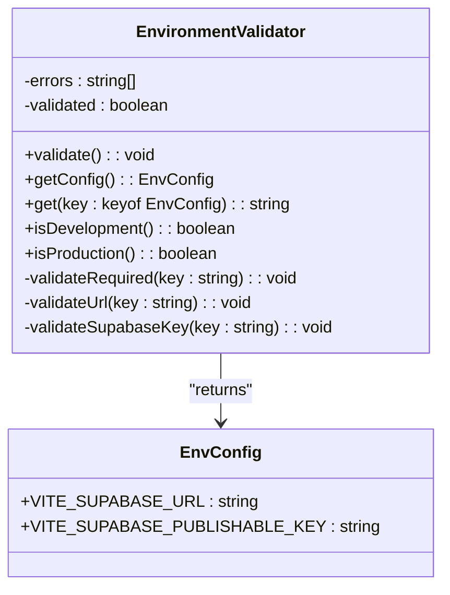
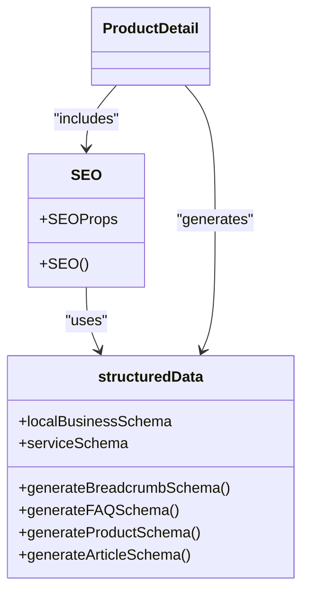
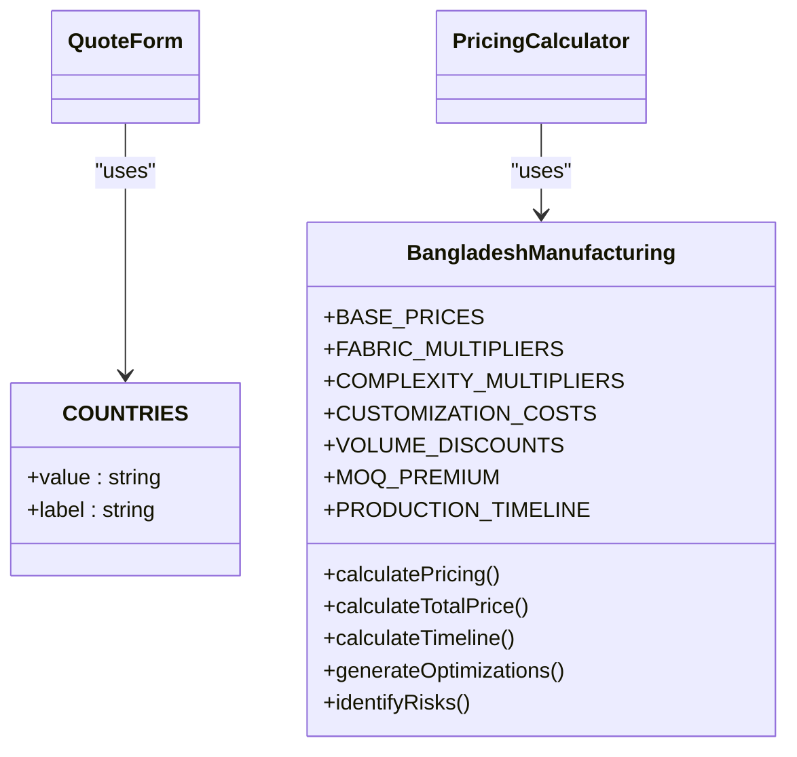
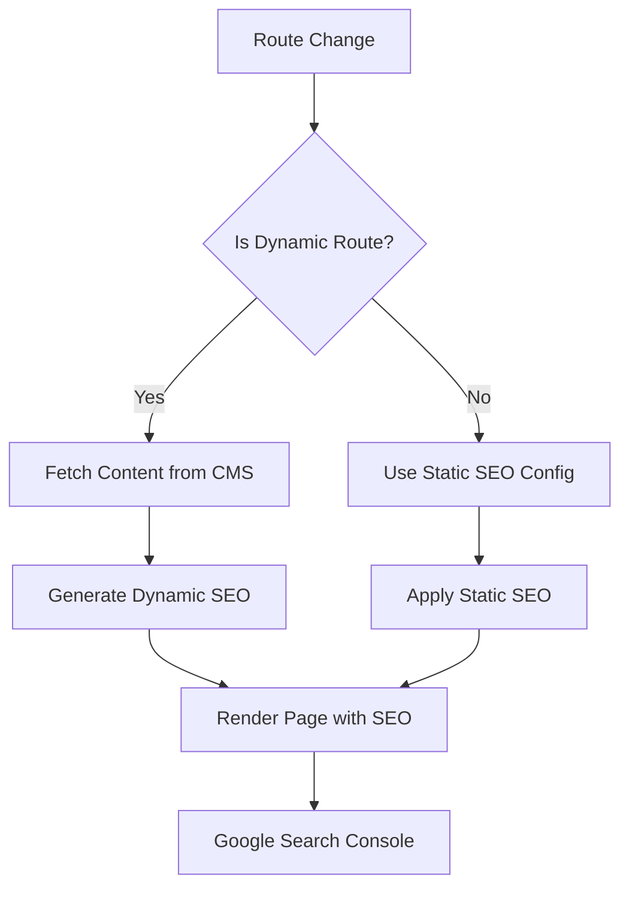
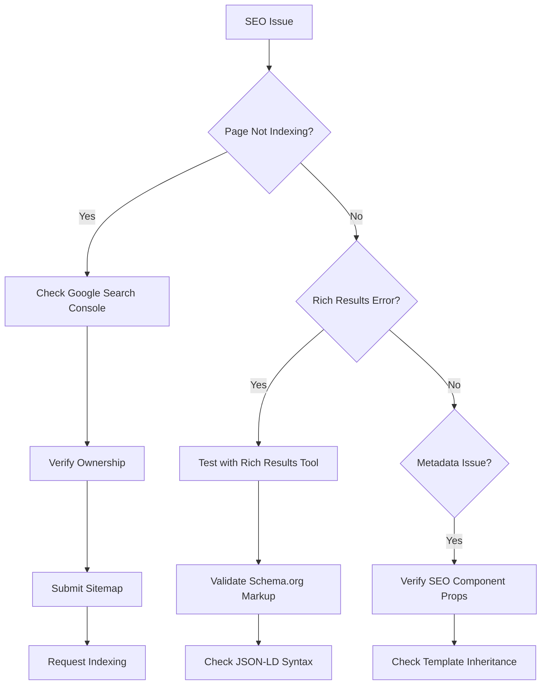

# Environment Validation and SEO Utilities

<cite>
**Referenced Files in This Document**   
- [env-validator.ts](file://src/lib/env-validator.ts)
- [structuredData.ts](file://src/lib/structuredData.ts)
- [SEO.tsx](file://src/components/SEO.tsx)
- [ProductDetail.tsx](file://src/pages/ProductDetail.tsx)
- [seo.ts](file://src/lib/seo.ts)
- [countries.ts](file://src/lib/countries.ts)
- [bangladeshManufacturing.ts](file://src/lib/bangladeshManufacturing.ts)
- [google-search-console-guide.md](file://public/google-search-console-guide.md)
</cite>

## Table of Contents
1. [Introduction](#introduction)
2. [Environment Validation System](#environment-validation-system)
3. [SEO and Structured Data Utilities](#seo-and-structured-data-utilities)
4. [Country and Manufacturing Data](#country-and-manufacturing-data)
5. [Integration with Dynamic Routes and CMS](#integration-with-dynamic-routes-and-cms)
6. [Debugging and Google Search Console Compatibility](#debugging-and-google-search-console-compatibility)
7. [Conclusion](#conclusion)

## Introduction
This document provides comprehensive documentation for the environment validation and SEO-related utilities within the Sleek Apparels application. The system ensures runtime correctness through strict environment variable validation and enhances search engine visibility through structured data generation. Key components include `env-validator.ts` for validating critical environment variables at startup, `structuredData.ts` for generating JSON-LD schema markup, and integration with dynamic routes and CMS-managed content. The documentation also covers country-specific logic in `countries.ts` and manufacturing region data in `bangladeshManufacturing.ts`, along with debugging tips for schema validation and Google Search Console compatibility.

## Environment Validation System

The environment validation system ensures that critical environment variables are present and correctly formatted before the application starts. This prevents runtime errors due to misconfigurations and ensures that the application can connect to essential services like Supabase.

**Diagram sources**
- [env-validator.ts](file://src/lib/env-validator.ts#L6-L103)

The `EnvironmentValidator` class implements the singleton pattern to ensure that environment validation occurs only once per application instance. It validates required environment variables such as `VITE_SUPABASE_URL` and `VITE_SUPABASE_PUBLISHABLE_KEY`, checking both their presence and format. The validation includes URL format verification for the Supabase URL and basic format checking for the publishable key. In production environments, the validation runs automatically on import, failing fast if any required variables are missing or invalid. The system provides methods to safely access environment variables and determine the current environment mode (development or production).

**Section sources**
- [env-validator.ts](file://src/lib/env-validator.ts#L1-L143)

## SEO and Structured Data Utilities

The SEO utilities provide comprehensive support for search engine optimization through metadata management and structured data generation. The system generates JSON-LD schema markup for Organization, Product, and FAQ entities, which are consumed by search engines to enhance search result displays.

**Diagram sources**
- [SEO.tsx](file://src/components/SEO.tsx#L4-L106)
- [structuredData.ts](file://src/lib/structuredData.ts#L1-L231)
- [ProductDetail.tsx](file://src/pages/ProductDetail.tsx#L66-L90)

The `SEO` component accepts configuration either directly through props or via a predefined `SEOConfig` object. It generates comprehensive metadata including title, description, canonical URL, Open Graph tags, and Twitter cards. The component also supports the inclusion of structured data schemas for Organization, Local Business, and Service entities. The `structuredData.ts` utility provides functions to generate JSON-LD schemas for various entity types including BreadcrumbList, FAQPage, Product, and Article. These schemas are automatically injected into the page head as script tags with `application/ld+json` type.

In the `ProductDetail` page, the SEO system is used to generate product-specific metadata and structured data. The page creates a product schema with detailed information including name, description, image, price, and aggregate rating. It also generates breadcrumb schema to show the navigation path to the product. The SEO component is configured with product-specific title, description, and Open Graph image, ensuring optimal search engine representation.

**Section sources**
- [SEO.tsx](file://src/components/SEO.tsx#L1-L255)
- [structuredData.ts](file://src/lib/structuredData.ts#L1-L231)
- [ProductDetail.tsx](file://src/pages/ProductDetail.tsx#L66-L115)

## Country and Manufacturing Data

The application includes comprehensive data for countries and Bangladesh manufacturing standards, supporting both user interface components and business logic calculations.

**Diagram sources**
- [countries.ts](file://src/lib/countries.ts#L4-L201)
- [bangladeshManufacturing.ts](file://src/lib/bangladeshManufacturing.ts#L23-L308)

The `countries.ts` file exports a comprehensive list of countries in a standardized format with ISO country codes and full names. This data is used in forms throughout the application, particularly in the quote generation process where users select their country of operation. The list includes all recognized countries, ensuring global coverage for the application's international user base.

The `bangladeshManufacturing.ts` file contains detailed data about manufacturing standards and pricing in Bangladesh. It includes base prices for various garment types, fabric multipliers, complexity multipliers, customization costs, volume discounts, and MOQ premiums. The file also defines production timelines and provides functions to calculate pricing, generate optimization suggestions, and identify potential risks for manufacturing orders. These utilities are used to provide accurate quotes and production estimates to customers.

**Section sources**
- [countries.ts](file://src/lib/countries.ts#L1-L202)
- [bangladeshManufacturing.ts](file://src/lib/bangladeshManufacturing.ts#L1-L309)

## Integration with Dynamic Routes and CMS

The SEO system is seamlessly integrated with the application's dynamic routing and CMS-managed content, ensuring consistent metadata across all pages.

**Diagram sources**
- [App.tsx](file://src/App.tsx#L184-L195)
- [seo.ts](file://src/lib/seo.ts#L18-L192)
- [ProductDetail.tsx](file://src/pages/ProductDetail.tsx#L94-L105)

The application uses React Router for client-side routing, with routes defined for both static pages and dynamic content. Static pages like Home, About, and Services use predefined SEO configurations from the `getPageSEO` function in `seo.ts`, which returns appropriate metadata for each page type. Dynamic routes like `ProductDetail` fetch content from the CMS (Supabase) and generate SEO metadata based on the retrieved data.

The `getPageSEO` function provides default SEO configurations for major site sections, including services, casualwear, cut-and-sew, uniforms, and sustainability pages. These configurations include optimized titles, descriptions, keywords, and Open Graph settings tailored to each page's content and target audience. For dynamic product pages, the SEO configuration is generated programmatically using product data, ensuring that each product has unique and relevant metadata.

The integration with CMS-managed content allows marketing teams to update page content without developer involvement, while the SEO system automatically generates appropriate metadata based on the content. This approach balances the need for SEO optimization with operational efficiency.

**Section sources**
- [App.tsx](file://src/App.tsx#L180-L195)
- [seo.ts](file://src/lib/seo.ts#L1-L293)
- [ProductDetail.tsx](file://src/pages/ProductDetail.tsx#L1-L546)

## Debugging and Google Search Console Compatibility

The application includes comprehensive guidance for debugging SEO issues and ensuring compatibility with Google Search Console.

**Diagram sources**
- [google-search-console-guide.md](file://public/google-search-console-guide.md#L5-L118)
- [SEO.tsx](file://src/components/SEO.tsx#L58-L88)
- [ProductDetail.tsx](file://src/pages/ProductDetail.tsx#L108-L115)

The `google-search-console-guide.md` provides step-by-step instructions for setting up and verifying Google Search Console ownership, submitting the XML sitemap, and requesting indexing for priority pages. It also includes troubleshooting steps for common issues such as JavaScript rendering problems, server response codes, meta noindex tags, and crawl errors.

To debug schema validation issues, developers should use Google's Rich Results Test tool and the Schema.org validator to check the JSON-LD markup generated by the application. The SEO component ensures that all structured data is properly formatted and included in the page head. For environment-specific overrides, the application uses Vite's environment variable system, with different `.env` files for development, staging, and production environments.

When troubleshooting indexing issues, verify that the HTML verification tag is correctly placed in the `index.html` file, the sitemap is accessible at `/sitemap.xml`, and there are no `noindex` meta tags on pages that should be indexed. The robots.txt file should allow crawling of all necessary pages and directories.

**Section sources**
- [google-search-console-guide.md](file://public/google-search-console-guide.md#L1-L118)
- [SEO.tsx](file://src/components/SEO.tsx#L1-L255)

## Conclusion
The environment validation and SEO utilities in the Sleek Apparels application provide a robust foundation for runtime correctness and search engine visibility. The environment validation system prevents misconfigurations by validating critical environment variables at startup, while the SEO utilities enhance search engine representation through comprehensive metadata and structured data generation. The integration of country data and manufacturing standards supports both user-facing components and business logic calculations. With proper setup and debugging practices, these utilities ensure that the application performs reliably in all environments and achieves optimal visibility in search engine results.