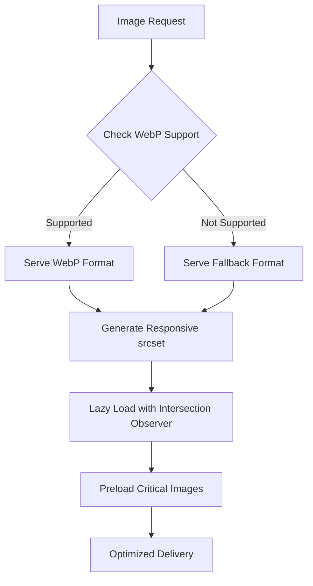
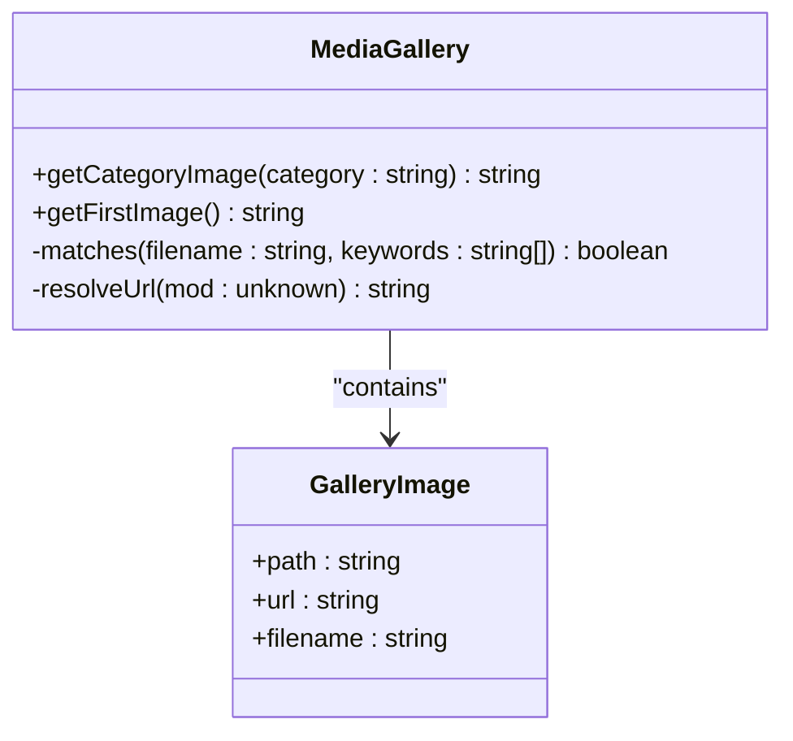
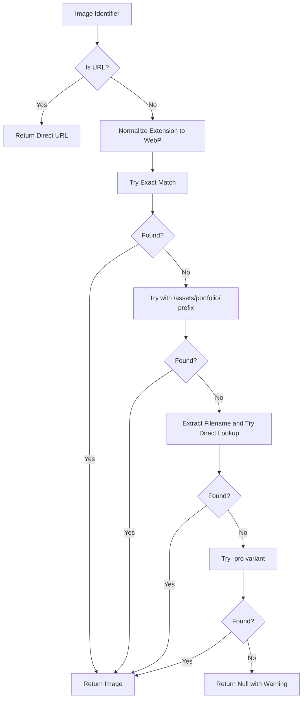
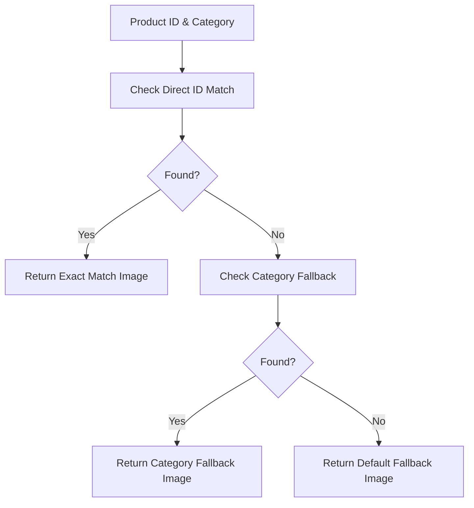
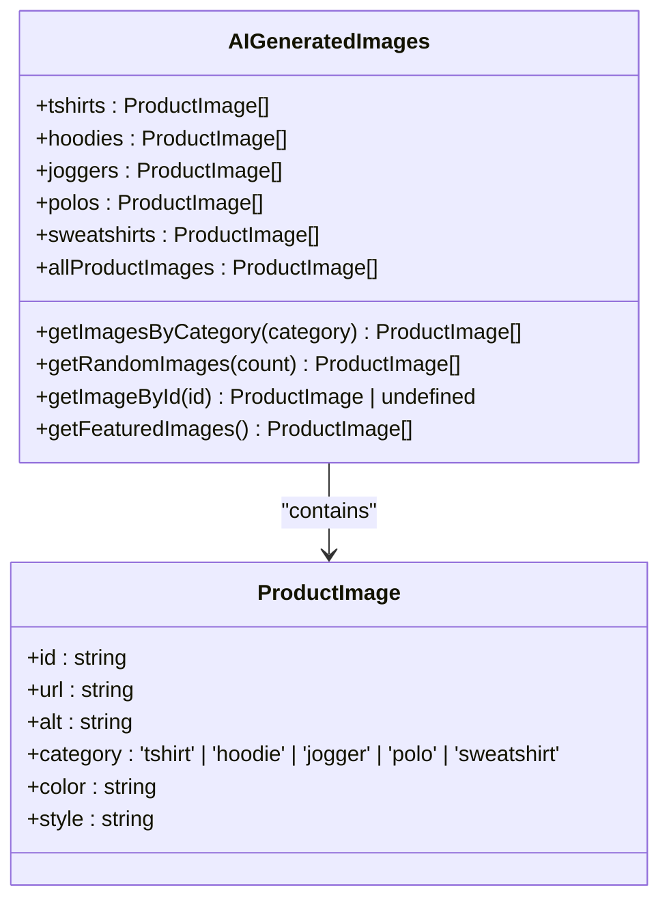
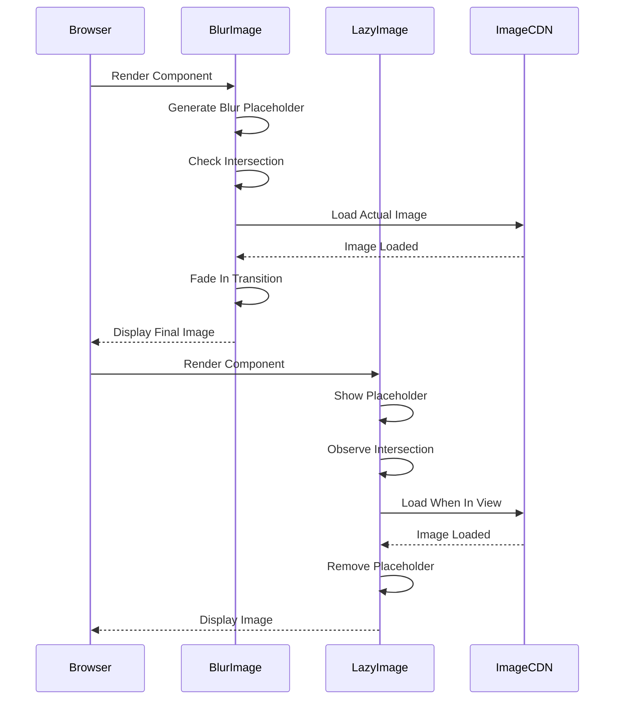
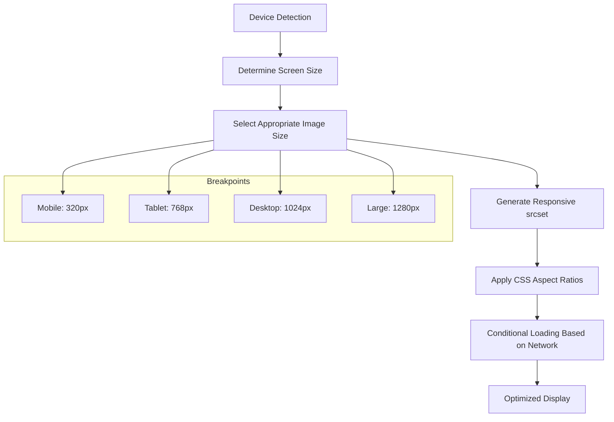
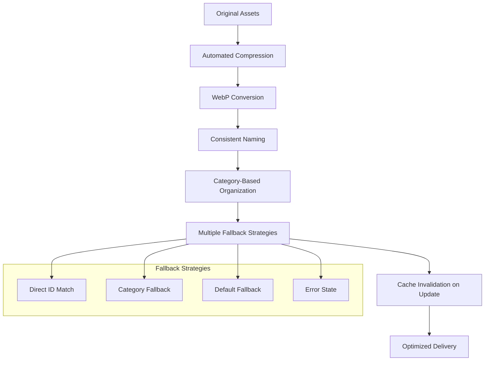
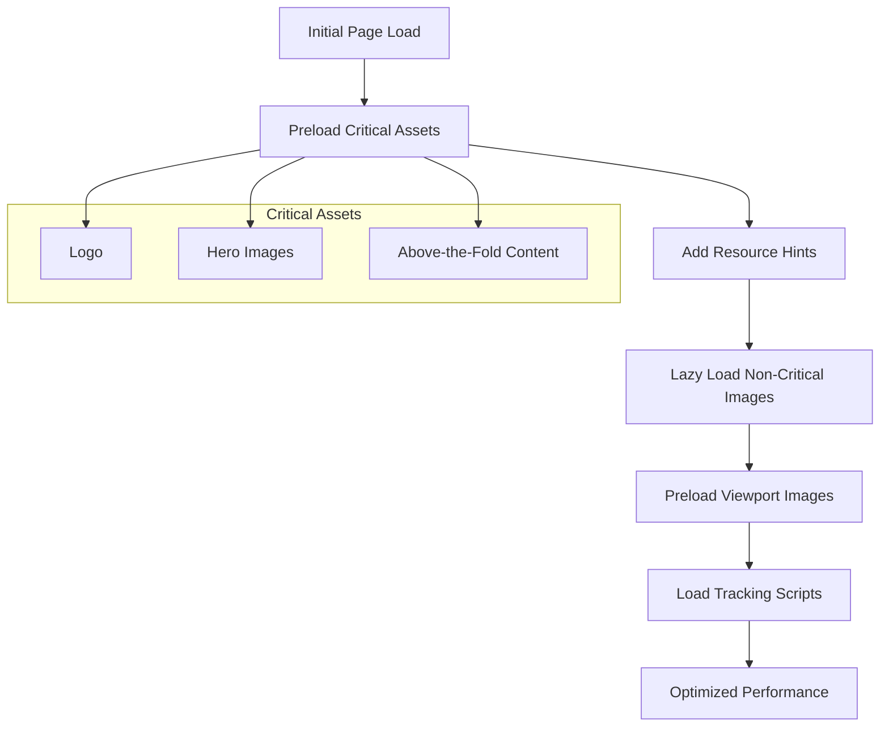

# Image and Media Optimization

<cite>
**Referenced Files in This Document**   
- [imageOptimizer.ts](file://src/lib/imageOptimizer.ts)
- [mediaGallery.ts](file://src/lib/mediaGallery.ts)
- [portfolioImages.ts](file://src/lib/portfolioImages.ts)
- [productImageMapping.ts](file://src/lib/productImageMapping.ts)
- [aiGeneratedProductImages.ts](file://src/lib/aiGeneratedProductImages.ts)
- [BlurImage.tsx](file://src/components/BlurImage.tsx)
- [LazyImage.tsx](file://src/components/LazyImage.tsx)
- [PortfolioGallery.tsx](file://src/components/PortfolioGallery.tsx)
- [portfolioImagesPhotorealistic.ts](file://src/lib/portfolioImagesPhotorealistic.ts)
- [imagePreloader.ts](file://src/lib/imagePreloader.ts)
- [OptimizedImage.tsx](file://src/components/OptimizedImage.tsx)
- [compress-images.js](file://scripts/compress-images.js)
</cite>

## Table of Contents
1. [Introduction](#introduction)
2. [Image Optimization Utilities](#image-optimization-utilities)
3. [Media Gallery Management](#media-gallery-management)
4. [Portfolio Image Handling](#portfolio-image-handling)
5. [Dynamic Product Image Mapping](#dynamic-product-image-mapping)
6. [AI-Generated Image Integration](#ai-generated-image-integration)
7. [UI Components for Progressive Loading](#ui-components-for-progressive-loading)
8. [Responsive Design Considerations](#responsive-design-considerations)
9. [Asset Management Best Practices](#asset-management-best-practices)
10. [Performance Optimization Strategy](#performance-optimization-strategy)

## Introduction
The image and media optimization system in this application ensures fast loading times and high visual fidelity across all devices. The architecture combines server-side optimization, client-side progressive loading techniques, and intelligent image selection strategies. This documentation covers the core utilities and components that work together to deliver an optimal user experience while maintaining visual quality.

## Image Optimization Utilities

The image optimization utilities provide a comprehensive set of functions for handling image performance and responsiveness. The system focuses on dynamic resizing, format conversion, and CDN-aware optimization to ensure optimal loading characteristics.

**Diagram sources**
- [imageOptimizer.ts](file://src/lib/imageOptimizer.ts#L5-L73)

**Section sources**
- [imageOptimizer.ts](file://src/lib/imageOptimizer.ts#L1-L74)
- [compress-images.js](file://scripts/compress-images.js#L1-L75)

## Media Gallery Management

The media gallery system provides dynamic management of product and portfolio galleries through intelligent image selection and categorization. It uses Vite's import.meta.glob functionality to automatically load images from the assets directory and organize them by category keywords.

**Diagram sources**
- [mediaGallery.ts](file://src/lib/mediaGallery.ts#L4-L50)

**Section sources**
- [mediaGallery.ts](file://src/lib/mediaGallery.ts#L1-L50)
- [PortfolioGallery.tsx](file://src/components/PortfolioGallery.tsx#L1-L64)

## Portfolio Image Handling

The portfolio image system manages curated image sets with multiple fallback strategies and normalization techniques. It supports both direct URL references and local asset resolution, with intelligent matching based on filename patterns and category keywords.

**Diagram sources**
- [portfolioImages.ts](file://src/lib/portfolioImages.ts#L86-L131)

**Section sources**
- [portfolioImages.ts](file://src/lib/portfolioImages.ts#L1-L131)
- [portfolioImagesPhotorealistic.ts](file://src/lib/portfolioImagesPhotorealistic.ts#L1-L162)

## Dynamic Product Image Mapping

The product image mapping system provides dynamic image resolution based on category and context through a UUID-based direct mapping approach. It combines exact product ID matching with category-based fallbacks to ensure consistent image presentation across the application.

**Diagram sources**
- [productImageMapping.ts](file://src/lib/productImageMapping.ts#L175-L190)

**Section sources**
- [productImageMapping.ts](file://src/lib/productImageMapping.ts#L1-L251)
- [PortfolioGallery.tsx](file://src/components/PortfolioGallery.tsx#L4-L8)

## AI-Generated Image Integration

The AI-generated image handling system manages a collection of AI-created product images organized by category, color, and style. These high-quality 4K images are generated using the Flux Pro Ultra model and provide a diverse set of visual options for product showcases.

**Diagram sources**
- [aiGeneratedProductImages.ts](file://src/lib/aiGeneratedProductImages.ts#L7-L331)

**Section sources**
- [aiGeneratedProductImages.ts](file://src/lib/aiGeneratedProductImages.ts#L1-L331)

## UI Components for Progressive Loading

The UI components implement progressive loading techniques to enhance perceived performance and user experience. The BlurImage and LazyImage components provide visual feedback during loading and optimize resource usage through intersection observation.

**Diagram sources**
- [BlurImage.tsx](file://src/components/BlurImage.tsx#L1-L144)
- [LazyImage.tsx](file://src/components/LazyImage.tsx#L1-L126)

**Section sources**
- [BlurImage.tsx](file://src/components/BlurImage.tsx#L1-L144)
- [LazyImage.tsx](file://src/components/LazyImage.tsx#L1-L126)
- [OptimizedImage.tsx](file://src/components/OptimizedImage.tsx#L1-L129)

## Responsive Design Considerations

The responsive design strategy ensures optimal image presentation across all device sizes and network conditions. The system combines CSS aspect ratios, responsive srcset generation, and conditional loading based on device characteristics.

**Diagram sources**
- [imageOptimizer.ts](file://src/lib/imageOptimizer.ts#L6-L17)
- [BlurImage.tsx](file://src/components/BlurImage.tsx#L89-L94)
- [use-mobile.tsx](file://src/hooks/use-mobile.tsx#L1-L31)

**Section sources**
- [imageOptimizer.ts](file://src/lib/imageOptimizer.ts#L6-L17)
- [BlurImage.tsx](file://src/components/BlurImage.tsx#L89-L94)
- [use-mobile.tsx](file://src/hooks/use-mobile.tsx#L1-L31)

## Asset Management Best Practices

The asset management system follows best practices for naming, fallback strategies, and cache invalidation to ensure maintainability and performance. The workflow includes automated compression, consistent naming conventions, and comprehensive fallback mechanisms.

**Diagram sources**
- [compress-images.js](file://scripts/compress-images.js#L1-L75)
- [portfolioImages.ts](file://src/lib/portfolioImages.ts#L93-L126)
- [productImageMapping.ts](file://src/lib/productImageMapping.ts#L175-L190)

**Section sources**
- [compress-images.js](file://scripts/compress-images.js#L1-L75)
- [portfolioImages.ts](file://src/lib/portfolioImages.ts#L93-L126)
- [productImageMapping.ts](file://src/lib/productImageMapping.ts#L175-L190)

## Performance Optimization Strategy

The performance optimization strategy combines preloading, resource hints, and lazy loading to maximize Core Web Vitals scores. The system prioritizes critical assets while deferring non-essential resources to improve initial load times.

**Diagram sources**
- [imagePreloader.ts](file://src/lib/imagePreloader.ts#L1-L57)
- [performanceOptimizer.ts](file://src/lib/performanceOptimizer.ts#L1-L85)
- [imageOptimizer.ts](file://src/lib/imageOptimizer.ts#L27-L52)

**Section sources**
- [imagePreloader.ts](file://src/lib/imagePreloader.ts#L1-L57)
- [performanceOptimizer.ts](file://src/lib/performanceOptimizer.ts#L1-L85)
- [imageOptimizer.ts](file://src/lib/imageOptimizer.ts#L27-L52)