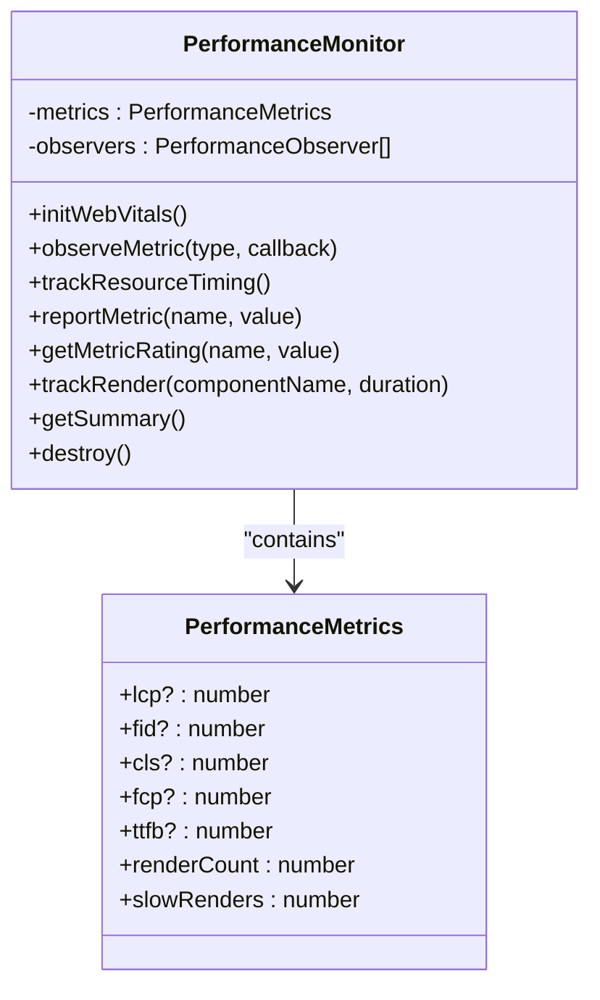
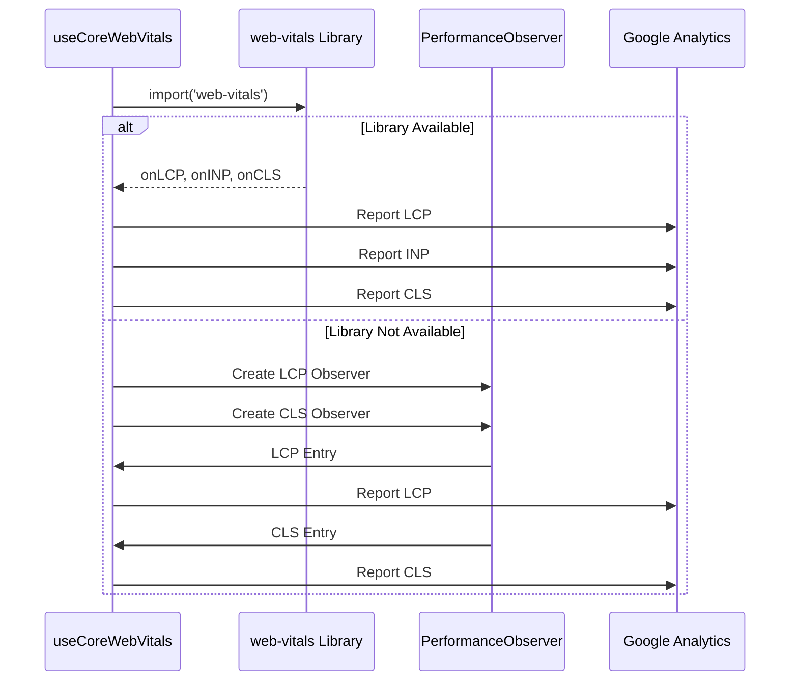
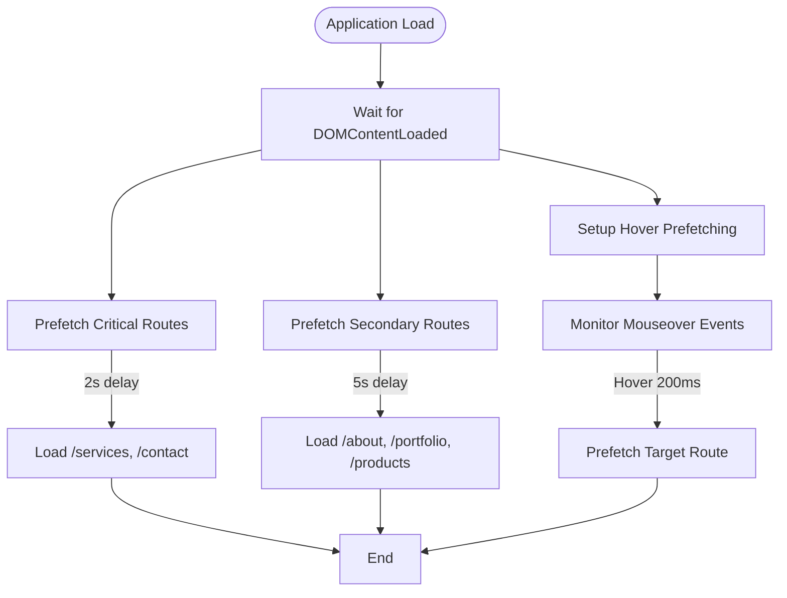
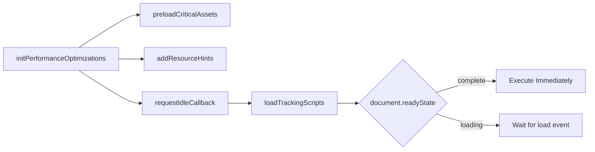
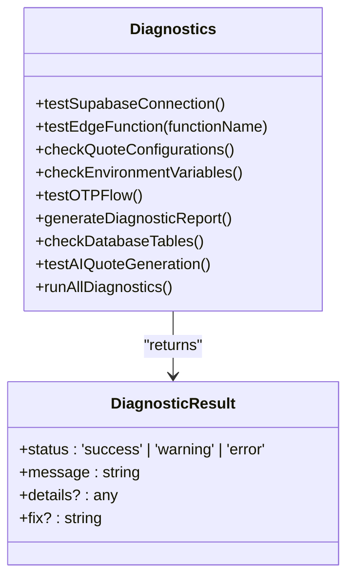
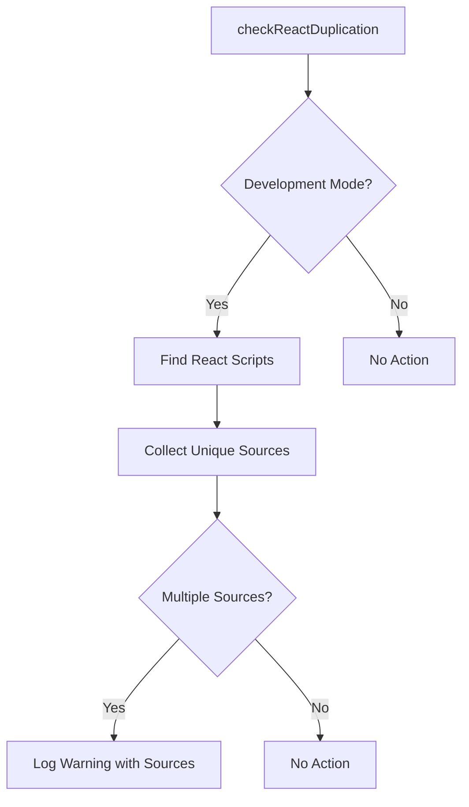
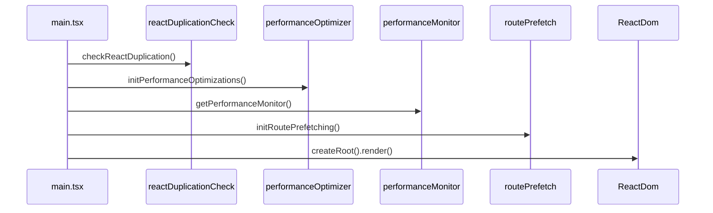
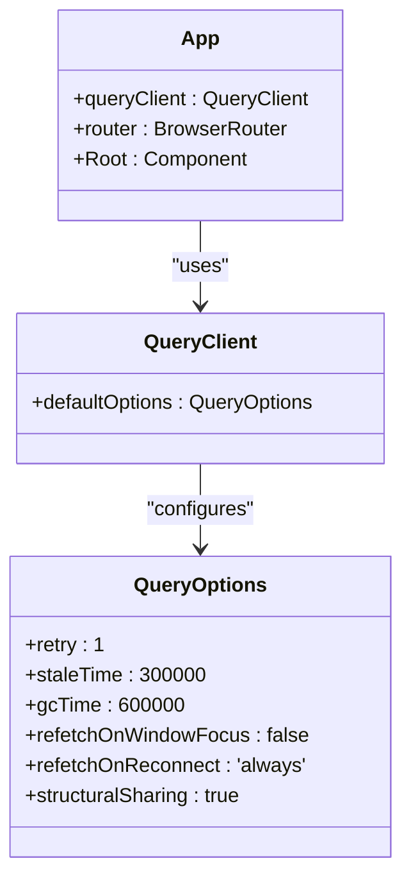
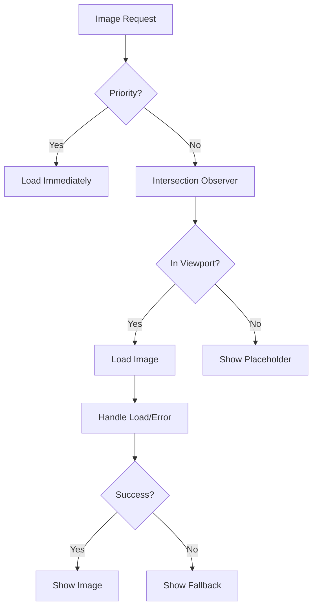

# Performance Monitoring and Optimization

<cite>
**Referenced Files in This Document**   
- [performanceMonitor.ts](file://src/lib/performanceMonitor.ts)
- [useCoreWebVitals.ts](file://src/hooks/useCoreWebVitals.ts)
- [performanceOptimizer.ts](file://src/lib/performanceOptimizer.ts)
- [routePrefetch.ts](file://src/lib/routePrefetch.ts)
- [imagePreloader.ts](file://src/lib/imagePreloader.ts)
- [diagnostics.ts](file://src/lib/diagnostics.ts)
- [reactDuplicationCheck.ts](file://src/lib/reactDuplicationCheck.ts)
- [App.tsx](file://src/App.tsx)
- [main.tsx](file://src/main.tsx)
- [LazyImage.tsx](file://src/components/LazyImage.tsx)
- [OptimizedImage.tsx](file://src/components/OptimizedImage.tsx)
- [usePerformance.ts](file://src/hooks/usePerformance.ts)
- [useLazyLoad.ts](file://src/hooks/useLazyLoad.ts)
</cite>

## Table of Contents
1. [Introduction](#introduction)
2. [Core Web Vitals Monitoring](#core-web-vitals-monitoring)
3. [Performance Optimization Utilities](#performance-optimization-utilities)
4. [Runtime Diagnostics and React Integrity](#runtime-diagnostics-and-react-integrity)
5. [Integration in Application Entry Points](#integration-in-application-entry-points)
6. [Performance Data Interpretation](#performance-data-interpretation)
7. [Critical Rendering Path Optimization](#critical-rendering-path-optimization)
8. [Conclusion](#conclusion)

## Introduction
This document provides comprehensive documentation for the performance monitoring and optimization utilities in the SleekApparels application. The system is designed to track Core Web Vitals (Largest Contentful Paint, First Input Delay, and Cumulative Layout Shift), optimize runtime efficiency through various techniques, and provide diagnostic capabilities for runtime issues. The performance infrastructure is implemented through a combination of monitoring utilities, optimization strategies, and diagnostic tools that work together to ensure optimal user experience and application responsiveness.

**Section sources**
- [performanceMonitor.ts](file://src/lib/performanceMonitor.ts)
- [performanceOptimizer.ts](file://src/lib/performanceOptimizer.ts)

## Core Web Vitals Monitoring

### Performance Monitor Implementation
The `performanceMonitor.ts` utility provides comprehensive tracking of Core Web Vitals and custom performance metrics. It implements a singleton pattern through the `getPerformanceMonitor()` function, ensuring a single instance manages performance data across the application. The monitor tracks LCP (Largest Contentful Paint), FID (First Input Delay), CLS (Cumulative Layout Shift), FCP (First Contentful Paint), and TTFB (Time to First Byte) using the Performance Observer API.

The implementation uses multiple PerformanceObserver instances to capture different metric types, with specific handling for each Core Web Vital:
- LCP is tracked by observing 'largest-contentful-paint' entries
- FID is calculated from 'first-input' entries by measuring processing delay
- CLS accumulates layout shift values, excluding shifts after user input
- FCP is identified from 'paint' entries with the appropriate name
- TTFB is derived from navigation timing API data



**Diagram sources**
- [performanceMonitor.ts](file://src/lib/performanceMonitor.ts#L16-L164)

**Section sources**
- [performanceMonitor.ts](file://src/lib/performanceMonitor.ts#L1-L195)

### Core Web Vitals Hook
The `useCoreWebVitals.ts` hook provides a React-specific interface for monitoring Core Web Vitals. It attempts to use the official web-vitals library for accurate measurement, with a fallback implementation using native Performance Observer API if the library cannot be loaded. The hook reports metrics to Google Analytics in production environments and logs them to the console in development.

The hook specifically tracks:
- LCP (Largest Contentful Paint) as a primary loading metric
- INP (Interaction to Next Paint) as the modern replacement for FID
- CLS (Cumulative Layout Shift) as a stability metric

The implementation includes automatic cleanup through the useEffect cleanup function to prevent memory leaks.



**Diagram sources**
- [useCoreWebVitals.ts](file://src/hooks/useCoreWebVitals.ts#L19-L109)

**Section sources**
- [useCoreWebVitals.ts](file://src/hooks/useCoreWebVitals.ts#L1-L109)

## Performance Optimization Utilities

### Route Prefetching Strategy
The `routePrefetch.ts` utility implements intelligent route prefetching to improve navigation performance. It uses a tiered approach with critical and secondary routes, applying different prefetching strategies based on route importance and user behavior.

The system prefetches routes by creating hidden link elements with rel="prefetch" in the document head. It implements three prefetching strategies:
1. **Critical routes**: Prefetched with high priority after a 2-second delay
2. **Secondary routes**: Prefetched with low priority after a 5-second delay  
3. **Hover-based prefetching**: Prefetches routes when users hover over navigation links for 200ms



**Diagram sources**
- [routePrefetch.ts](file://src/lib/routePrefetch.ts#L1-L124)

**Section sources**
- [routePrefetch.ts](file://src/lib/routePrefetch.ts#L1-L124)

### Image Preloading and Optimization
The `imagePreloader.ts` utility manages the preloading of critical images to improve LCP scores. It implements a deferred loading strategy using requestIdleCallback to avoid blocking the main thread during initial page rendering.

The preloader handles both static critical images defined in the CRITICAL_IMAGES array and dynamic image preloading through the preloadImage and preloadImages functions. It supports different resource types (images and videos) and can assign fetch priority to critical LCP images.

```mermaid
classDiagram
class ImagePreloader {
+CRITICAL_IMAGES : string[]
+preloadCriticalImages()
+preloadImage(src)
+preloadImages(sources)
+requestIdleCallback(cb, options)
}
class ImagePreloader : "Preloads critical images to improve LCP"
```

**Diagram sources**
- [imagePreloader.ts](file://src/lib/imagePreloader.ts#L1-L57)

**Section sources**
- [imagePreloader.ts](file://src/lib/imagePreloader.ts#L1-L57)

### Comprehensive Performance Optimization
The `performanceOptimizer.ts` utility coordinates various performance optimization techniques. It implements resource hints (DNS prefetch and preconnect) to reduce connection setup time for external resources, particularly the Supabase backend and analytics services.

The optimizer uses a requestIdleCallback polyfill to defer non-critical optimizations until the browser is idle, preventing interference with initial page load. It includes safeguards to prevent duplicate initialization through a window.__perfOptimized flag.



**Diagram sources**
- [performanceOptimizer.ts](file://src/lib/performanceOptimizer.ts#L1-L85)

**Section sources**
- [performanceOptimizer.ts](file://src/lib/performanceOptimizer.ts#L1-L85)

## Runtime Diagnostics and React Integrity

### Diagnostic Utilities
The `diagnostics.ts` utility provides comprehensive runtime diagnostics for the application. It includes tests for various system components:
- Supabase database connectivity
- Edge function availability
- Database table existence
- Environment variable configuration
- AI quote generation workflow
- OTP flow functionality

The diagnostic system returns structured results with status (success, warning, error), message, details, and suggested fixes. It can generate comprehensive diagnostic reports and run all diagnostics simultaneously through Promise.all.



**Diagram sources**
- [diagnostics.ts](file://src/lib/diagnostics.ts#L1-L269)

**Section sources**
- [diagnostics.ts](file://src/lib/diagnostics.ts#L1-L269)

### React Duplication Detection
The `reactDuplicationCheck.ts` utility detects potential React duplication issues that can cause problems with hooks and context. It runs only in development mode and checks for multiple React instances by examining script tags in the document.

The check identifies scripts with "react" in the source URL and warns if multiple different sources are detected. This helps prevent issues that arise when multiple versions of React are loaded simultaneously, which can break the React reconciliation process.



**Diagram sources**
- [reactDuplicationCheck.ts](file://src/lib/reactDuplicationCheck.ts#L1-L31)

**Section sources**
- [reactDuplicationCheck.ts](file://src/lib/reactDuplicationCheck.ts#L1-L31)

## Integration in Application Entry Points

### Main Application Entry
The `main.tsx` file serves as the primary entry point for the application and initializes all performance utilities early in the application lifecycle. This ensures that performance monitoring and optimization are active from the very beginning of the application's execution.

The initialization sequence in main.tsx is carefully ordered:
1. React duplication check (development only)
2. Performance optimization initialization
3. Performance monitoring initialization  
4. Route prefetching initialization



**Diagram sources**
- [main.tsx](file://src/main.tsx#L1-L39)

**Section sources**
- [main.tsx](file://src/main.tsx#L1-L39)

### Application Component Integration
The `App.tsx` component integrates performance monitoring through lazy loading of non-critical components and optimized React Query configuration. It implements code splitting to reduce initial bundle size and improve load performance.

The React Query client is configured with performance-optimized settings:
- 5-minute stale time to balance freshness and performance
- 10-minute garbage collection time for cache cleanup
- Disabled refetch on window focus to prevent unnecessary network requests
- Always refetch on reconnect to ensure data consistency



**Diagram sources**
- [App.tsx](file://src/App.tsx#L1-L362)

**Section sources**
- [App.tsx](file://src/App.tsx#L1-L362)

## Performance Data Interpretation

### Core Web Vitals Thresholds
The performance monitoring system uses standardized thresholds to evaluate Core Web Vitals metrics:

| Metric | Good | Needs Improvement | Poor |
|--------|------|-------------------|------|
| LCP | ≤ 2500ms | 2501-4000ms | > 4000ms |
| FID | ≤ 100ms | 101-300ms | > 300ms |
| CLS | ≤ 0.1 | 0.11-0.25 | > 0.25 |
| FCP | ≤ 1800ms | 1801-3000ms | > 3000ms |
| TTFB | ≤ 800ms | 801-1800ms | > 1800ms |

These thresholds are implemented in the getMetricRating method of the PerformanceMonitor class, which categorizes each metric value and returns an appropriate emoji indicator (🟢 for good, 🟡 for needs improvement, 🔴 for poor).

**Section sources**
- [performanceMonitor.ts](file://src/lib/performanceMonitor.ts#L121-L139)

### Performance Reporting
The system reports performance data through multiple channels:
- **Development**: Console logging with visual indicators (emojis) and rating information
- **Production**: Google Analytics events with web_vitals category
- **Resource monitoring**: Console warnings for slow-loading resources (>1000ms)

The reporting mechanism is designed to provide actionable insights without impacting application performance. In development, detailed information helps identify optimization opportunities, while in production, aggregated data is sent to analytics for trend analysis.

## Critical Rendering Path Optimization

### Image Loading Strategies
The application implements multiple image loading strategies to optimize the critical rendering path:

1. **LazyImage Component**: Implements intersection observer-based lazy loading with placeholder and error states
2. **OptimizedImage Component**: Provides responsive srcset generation, WebP support, and low-quality placeholder (LQIP) patterns
3. **Critical Image Preloading**: Preloads above-the-fold images to improve LCP

The LazyImage component uses a combination of CSS transitions and loading states to provide a smooth user experience, with skeleton loaders during image loading and fallback content on error.



**Section sources**
- [LazyImage.tsx](file://src/components/LazyImage.tsx#L1-L126)
- [OptimizedImage.tsx](file://src/components/OptimizedImage.tsx#L1-L129)

### Resource Loading Optimization
The application employs several techniques to optimize resource loading:

1. **Resource Hints**: DNS prefetch and preconnect to critical external domains
2. **Code Splitting**: Lazy loading of route components and non-critical utilities
3. **Bundle Optimization**: Tree-shaking and minification through Vite build process
4. **Caching Strategy**: Service worker implementation for offline capabilities

The public/init-critical.js file contains a polyfill for critical CSS loading, ensuring above-the-fold styles are applied quickly even on slower connections.

**Section sources**
- [performanceOptimizer.ts](file://src/lib/performanceOptimizer.ts#L1-L85)
- [init-critical.js](file://public/init-critical.js#L47-L94)

## Conclusion
The performance monitoring and optimization system in the SleekApparels application provides a comprehensive solution for tracking Core Web Vitals and enhancing runtime efficiency. By combining proactive monitoring with strategic optimization techniques, the system ensures a high-quality user experience across various network conditions and device capabilities.

Key strengths of the implementation include:
- Early initialization of performance utilities in the application lifecycle
- Comprehensive tracking of Core Web Vitals with standardized thresholds
- Intelligent prefetching strategies based on route priority and user behavior
- Robust diagnostic capabilities for identifying and resolving runtime issues
- Development-time safeguards against common React performance pitfalls

The system is designed to be both effective and unobtrusive, providing valuable performance insights without impacting the core functionality of the application. By following the documented thresholds and optimization strategies, developers can maintain and improve the application's performance over time.