# Supabase Integration Helpers

<cite>
**Referenced Files in This Document**
- [supabaseHelpers.ts](file://src/lib/supabaseHelpers.ts)
- [client.ts](file://src/integrations/supabase/client.ts)
- [env-validator.ts](file://src/lib/env-validator.ts)
- [useSuppliers.ts](file://src/hooks/useSuppliers.ts)
- [useOrders.ts](file://src/hooks/queries/useOrders.ts)
- [database.ts](file://src/types/database.ts)
- [SupplierDirectory.tsx](file://src/pages/SupplierDirectory.tsx)
- [ProductCatalog.tsx](file://src/pages/ProductCatalog.tsx)
- [useRealtimeMessages.ts](file://src/hooks/useRealtimeMessages.ts)
- [types.ts](file://src/integrations/supabase/types.ts)
</cite>

## Table of Contents
1. [Introduction](#introduction)
2. [Architecture Overview](#architecture-overview)
3. [Environment Configuration](#environment-configuration)
4. [Type-Safe Query Helpers](#type-safe-query-helpers)
5. [Real-Time Subscriptions](#real-time-subscriptions)
6. [Custom Hooks Integration](#custom-hooks-integration)
7. [Error Handling Strategies](#error-handling-strategies)
8. [Performance Optimization](#performance-optimization)
9. [Complex Query Patterns](#complex-query-patterns)
10. [Security Implementation](#security-implementation)
11. [Best Practices](#best-practices)
12. [Troubleshooting Guide](#troubleshooting-guide)

## Introduction

The Supabase integration helpers provide a comprehensive abstraction layer for database interactions in the Sleek Apparels application. This system implements type-safe queries, real-time subscriptions, and robust error handling while maintaining optimal performance through caching and query optimization techniques.

The integration consists of several key components:
- **Type-safe query builders** that leverage TypeScript for compile-time safety
- **Real-time subscription management** for live data updates
- **Custom React hooks** that encapsulate complex business logic
- **Environment validation** for secure configuration management
- **Row Level Security (RLS)** enforcement for data protection

## Architecture Overview

The Supabase integration follows a layered architecture pattern that separates concerns and provides clean abstractions for database operations.

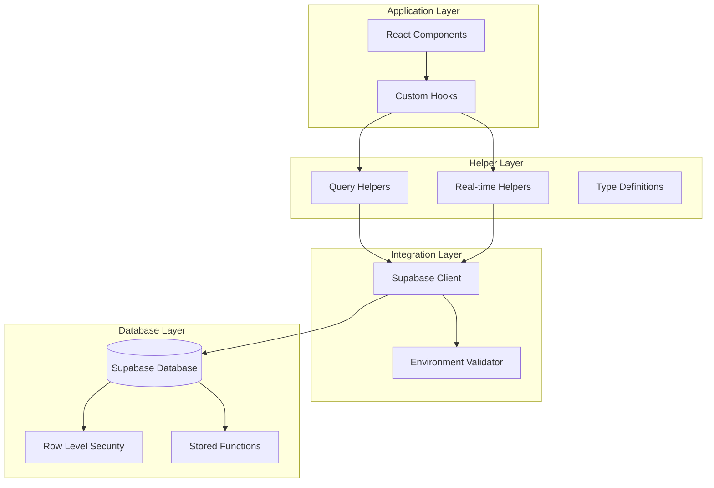
```mermaid
graph TB
subgraph "Application Layer"
UI[React Components]
Hooks[Custom Hooks]
end
subgraph "Integration Layer"
Client[Supabase Client]
EnvValidator[Environment Validator]
end
subgraph "Helper Layer"
QueryHelpers[Query Helpers]
RealtimeHelpers[Real-time Helpers]
TypeHelpers[Type Definitions]
end
subgraph "Database Layer"
SupabaseDB[(Supabase Database)]
RLS[Row Level Security]
Functions[Stored Functions]
end
UI --> Hooks
Hooks --> QueryHelpers
Hooks --> RealtimeHelpers
QueryHelpers --> Client
RealtimeHelpers --> Client
Client --> EnvValidator
Client --> SupabaseDB
SupabaseDB --> RLS
SupabaseDB --> Functions
```

**Diagram sources**
- [client.ts](file://src/integrations/supabase/client.ts#L1-L20)
- [env-validator.ts](file://src/lib/env-validator.ts#L1-L143)
- [supabaseHelpers.ts](file://src/lib/supabaseHelpers.ts#L1-L376)

**Section sources**
- [client.ts](file://src/integrations/supabase/client.ts#L1-L20)
- [env-validator.ts](file://src/lib/env-validator.ts#L1-L143)

## Environment Configuration

The environment validation system ensures secure and proper configuration of Supabase credentials before application startup.

### Configuration Management

The environment validator implements a singleton pattern with automatic validation:

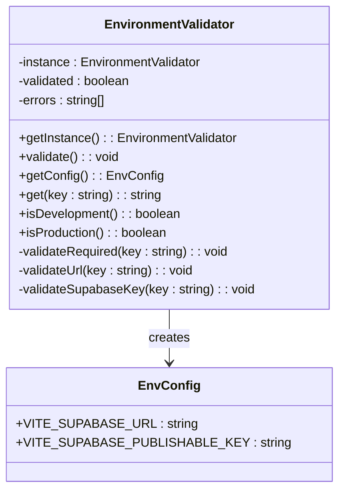
```mermaid
classDiagram
class EnvironmentValidator {
-instance : EnvironmentValidator
-validated : boolean
-errors : string[]
+getInstance() : EnvironmentValidator
+validate() : void
+getConfig() : EnvConfig
+get(key : string) : string
+isDevelopment() : boolean
+isProduction() : boolean
-validateRequired(key : string) : void
-validateUrl(key : string) : void
-validateSupabaseKey(key : string) : void
}
class EnvConfig {
+VITE_SUPABASE_URL : string
+VITE_SUPABASE_PUBLISHABLE_KEY : string
}
EnvironmentValidator --> EnvConfig : creates
```

**Diagram sources**
- [env-validator.ts](file://src/lib/env-validator.ts#L11-L143)

### Validation Rules

The system enforces strict validation rules for production environments:

| Validation Rule | Purpose | Implementation |
|----------------|---------|----------------|
| **Required Variables** | Ensures all mandatory environment variables are present | `validateRequired()` method |
| **URL Format** | Validates Supabase URL format using native URL constructor | `validateUrl()` method |
| **Key Length** | Verifies Supabase keys meet minimum length requirements | `validateSupabaseKey()` method |
| **Production Fail-Fast** | Throws errors immediately in production for invalid configurations | Automatic validation on import |

**Section sources**
- [env-validator.ts](file://src/lib/env-validator.ts#L29-L89)

## Type-Safe Query Helpers

The query helpers provide compile-time type safety while maintaining flexibility for dynamic queries.

### Generic Query Builder

The foundation of the type-safe system is the generic query builder:

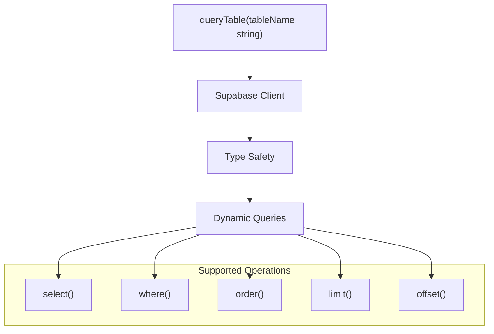
```mermaid
flowchart TD
QueryTable["queryTable<T>(tableName: string)"] --> SupabaseClient["Supabase Client"]
SupabaseClient --> TypeSafety["Type Safety"]
TypeSafety --> DynamicQueries["Dynamic Queries"]
subgraph "Supported Operations"
Select["select()"]
Where["where()"]
Order["order()"]
Limit["limit()"]
Offset["offset()"]
end
DynamicQueries --> Select
DynamicQueries --> Where
DynamicQueries --> Order
DynamicQueries --> Limit
DynamicQueries --> Offset
```

**Diagram sources**
- [supabaseHelpers.ts](file://src/lib/supabaseHelpers.ts#L26-L28)

### Specialized Helper Functions

The system provides specialized helpers for different entity types:

| Helper Category | Functions | Use Cases |
|----------------|-----------|-----------|
| **Orders** | `getById()`, `getByBuyerId()`, `getWithRelations()`, `updateStatus()` | Order management, status tracking |
| **Suppliers** | `getVerified()`, `getById()`, `getByUserId()` | Supplier discovery, verification |
| **Notifications** | `getByUserId()`, `markAsRead()`, `create()` | User notifications, engagement |
| **AI Quotes** | `getByEmail()`, `getById()`, `updateStatus()`, `create()` | Quote generation, tracking |
| **Profiles** | `getByUserId()`, `update()` | User profile management |
| **Invoices** | `getByOrderId()`, `getById()`, `updateStatus()` | Financial management |
| **Documents** | `getByOrderId()`, `upload()`, `delete()` | Document management |
| **Blog** | `getPublishedPosts()`, `getBySlug()`, `incrementViews()` | Content management |

### Query Optimization Patterns

The helpers implement several optimization patterns:

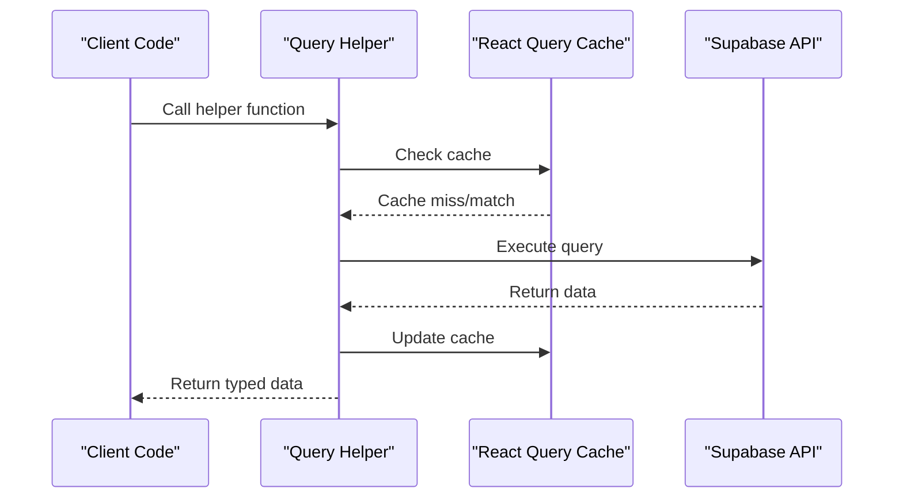
```mermaid
sequenceDiagram
participant Client as "Client Code"
participant Helper as "Query Helper"
participant Cache as "React Query Cache"
participant Supabase as "Supabase API"
Client->>Helper : Call helper function
Helper->>Cache : Check cache
Cache-->>Helper : Cache miss/match
Helper->>Supabase : Execute query
Supabase-->>Helper : Return data
Helper->>Cache : Update cache
Helper-->>Client : Return typed data
```

**Diagram sources**
- [supabaseHelpers.ts](file://src/lib/supabaseHelpers.ts#L33-L106)
- [useOrders.ts](file://src/hooks/queries/useOrders.ts#L19-L152)

**Section sources**
- [supabaseHelpers.ts](file://src/lib/supabaseHelpers.ts#L26-L376)

## Real-Time Subscriptions

The real-time system enables instant updates to connected clients through PostgreSQL's logical replication capabilities.

### Subscription Architecture

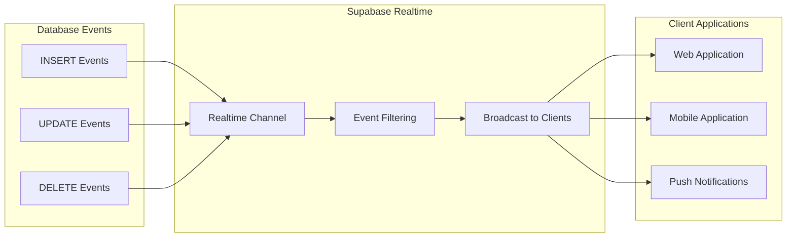
```mermaid
graph LR
subgraph "Database Events"
Insert[INSERT Events]
Update[UPDATE Events]
Delete[DELETE Events]
end
subgraph "Supabase Realtime"
Channel[Realtime Channel]
Filter[Event Filtering]
Broadcast[Broadcast to Clients]
end
subgraph "Client Applications"
WebApp[Web Application]
MobileApp[Mobile Application]
PushNotifications[Push Notifications]
end
Insert --> Channel
Update --> Channel
Delete --> Channel
Channel --> Filter
Filter --> Broadcast
Broadcast --> WebApp
Broadcast --> MobileApp
Broadcast --> PushNotifications
```

**Diagram sources**
- [useRealtimeMessages.ts](file://src/hooks/useRealtimeMessages.ts#L18-L61)

### Message Real-Time Updates

The messaging system demonstrates real-time capabilities:

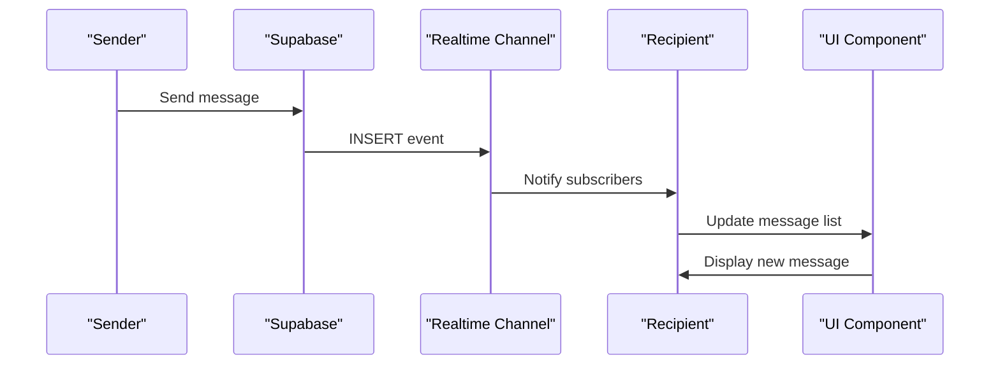
```mermaid
sequenceDiagram
participant Sender as "Sender"
participant Supabase as "Supabase"
participant Channel as "Realtime Channel"
participant Recipient as "Recipient"
participant UI as "UI Component"
Sender->>Supabase : Send message
Supabase->>Channel : INSERT event
Channel->>Recipient : Notify subscribers
Recipient->>UI : Update message list
UI->>Recipient : Display new message
```

**Diagram sources**
- [useRealtimeMessages.ts](file://src/hooks/useRealtimeMessages.ts#L23-L57)

### Order Update Subscriptions

Production updates demonstrate complex real-time patterns:

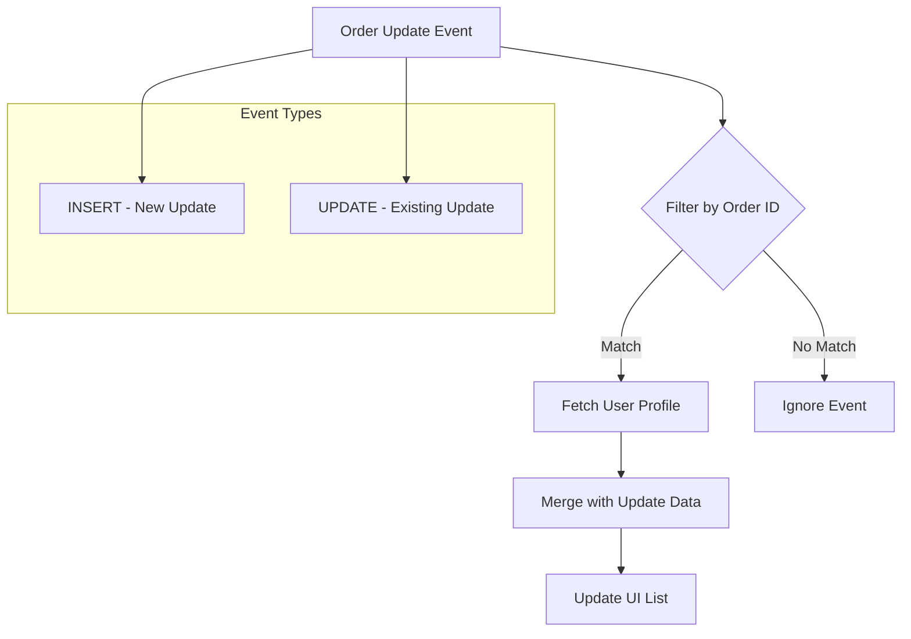
```mermaid
flowchart TD
OrderUpdate[Order Update Event] --> Filter{Filter by Order ID}
Filter --> |Match| ProfileFetch[Fetch User Profile]
Filter --> |No Match| Ignore[Ignore Event]
ProfileFetch --> Merge[Merge with Update Data]
Merge --> UpdateUI[Update UI List]
subgraph "Event Types"
Insert[INSERT - New Update]
Update[UPDATE - Existing Update]
end
OrderUpdate --> Insert
OrderUpdate --> Update
```

**Diagram sources**
- [useRealtimeMessages.ts](file://src/hooks/useRealtimeMessages.ts#L85-L134)

**Section sources**
- [useRealtimeMessages.ts](file://src/hooks/useRealtimeMessages.ts#L1-L61)

## Custom Hooks Integration

Custom hooks encapsulate complex business logic while providing reactive data fetching and real-time updates.

### Supplier Directory Hook

The supplier directory demonstrates advanced filtering and optimization:

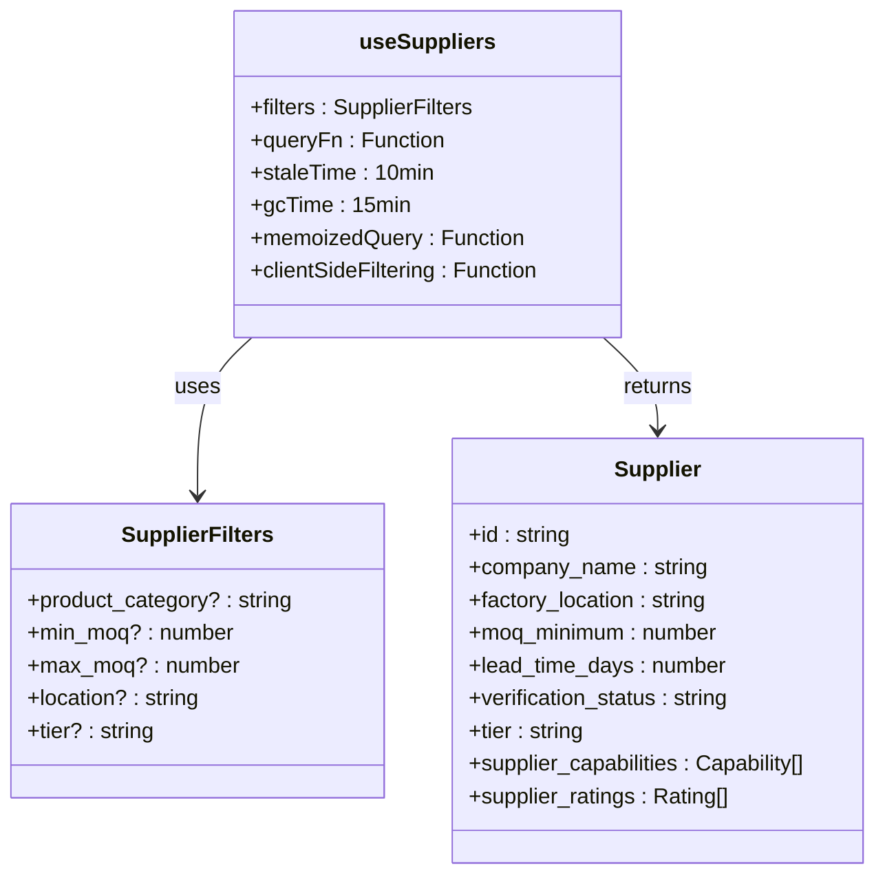
```mermaid
classDiagram
class useSuppliers {
+filters : SupplierFilters
+queryFn : Function
+staleTime : 10min
+gcTime : 15min
+memoizedQuery : Function
+clientSideFiltering : Function
}
class SupplierFilters {
+product_category? : string
+min_moq? : number
+max_moq? : number
+location? : string
+tier? : string
}
class Supplier {
+id : string
+company_name : string
+factory_location : string
+moq_minimum : number
+lead_time_days : number
+verification_status : string
+tier : string
+supplier_capabilities : Capability[]
+supplier_ratings : Rating[]
}
useSuppliers --> SupplierFilters : uses
useSuppliers --> Supplier : returns
```

**Diagram sources**
- [useSuppliers.ts](file://src/hooks/useSuppliers.ts#L40-L90)

### Order Management Hooks

The order management system provides comprehensive CRUD operations:

| Hook Function | Purpose | Features |
|---------------|---------|----------|
| `useOrder()` | Single order retrieval | Optimistic updates, error handling |
| `useOrderWithRelations()` | Order with related data | Nested relations, caching |
| `useOrdersByBuyer()` | Buyer order history | Pagination, filtering |
| `useOrdersByFactory()` | Factory order management | Status tracking |
| `useAllOrders()` | Admin dashboard | Statistics, analytics |
| `useNewOrders()` | Recent orders | Real-time updates |
| `useUpdateOrderStatus()` | Status management | Optimistic UI updates |

### Query Key Management

The system implements sophisticated query key management for cache invalidation:

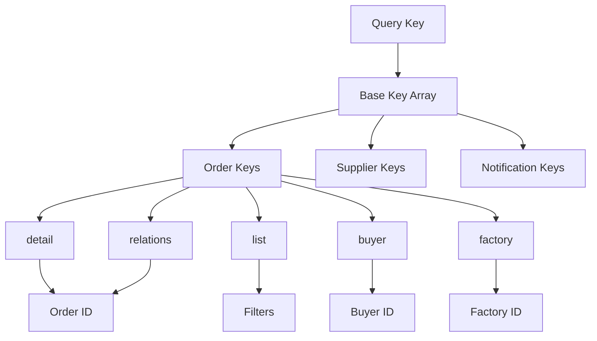
```mermaid
graph TD
QueryKey[Query Key] --> BaseKey[Base Key Array]
BaseKey --> OrderKeys[Order Keys]
BaseKey --> SupplierKeys[Supplier Keys]
BaseKey --> NotificationKeys[Notification Keys]
OrderKeys --> Detail[detail]
OrderKeys --> List[list]
OrderKeys --> Relations[relations]
OrderKeys --> Buyer[buyer]
OrderKeys --> Factory[factory]
Detail --> OrderId[Order ID]
List --> Filters[Filters]
Relations --> OrderId
Buyer --> BuyerId[Buyer ID]
Factory --> FactoryId[Factory ID]
```

**Diagram sources**
- [useOrders.ts](file://src/hooks/queries/useOrders.ts#L7-L17)

**Section sources**
- [useSuppliers.ts](file://src/hooks/useSuppliers.ts#L1-L215)
- [useOrders.ts](file://src/hooks/queries/useOrders.ts#L1-L152)

## Error Handling Strategies

The system implements comprehensive error handling at multiple levels.

### Network Failure Recovery

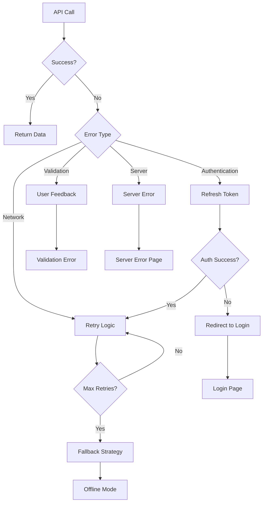
```mermaid
flowchart TD
APICall[API Call] --> Success{Success?}
Success --> |Yes| ReturnData[Return Data]
Success --> |No| ErrorType{Error Type}
ErrorType --> |Network| RetryLogic[Retry Logic]
ErrorType --> |Authentication| RefreshToken[Refresh Token]
ErrorType --> |Validation| UserFeedback[User Feedback]
ErrorType --> |Server| ServerError[Server Error]
RetryLogic --> MaxRetries{Max Retries?}
MaxRetries --> |No| RetryLogic
MaxRetries --> |Yes| Fallback[Fallback Strategy]
RefreshToken --> AuthSuccess{Auth Success?}
AuthSuccess --> |Yes| RetryLogic
AuthSuccess --> |No| LoginRedirect[Redirect to Login]
UserFeedback --> ValidationError[Validation Error]
ServerError --> ServerErrorPage[Server Error Page]
Fallback --> OfflineMode[Offline Mode]
LoginRedirect --> LoginPage[Login Page]
```

### Optimistic Update Pattern

The optimistic update system provides immediate UI feedback with automatic rollback:

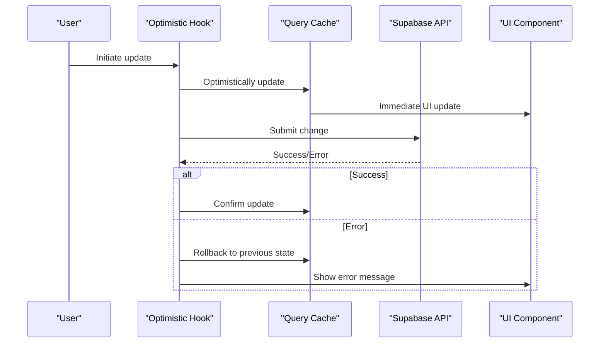
```mermaid
sequenceDiagram
participant User as "User"
participant Hook as "Optimistic Hook"
participant Cache as "Query Cache"
participant API as "Supabase API"
participant UI as "UI Component"
User->>Hook : Initiate update
Hook->>Cache : Optimistically update
Cache->>UI : Immediate UI update
Hook->>API : Submit change
API-->>Hook : Success/Error
alt Success
Hook->>Cache : Confirm update
else Error
Hook->>Cache : Rollback to previous state
Hook->>UI : Show error message
end
```

**Diagram sources**
- [useOptimisticUpdate.ts](file://src/hooks/useOptimisticUpdate.ts#L26-L47)

### Error Boundary Implementation

The application implements error boundaries for graceful degradation:

| Error Type | Handler | Recovery Strategy |
|------------|---------|-------------------|
| **Network Errors** | Retry with exponential backoff | Automatic retry mechanism |
| **Authentication Errors** | Redirect to login | Session refresh |
| **Validation Errors** | User feedback | Form validation |
| **Server Errors** | Error logging | Fallback UI |
| **Database Errors** | Transaction rollback | Optimistic updates |

**Section sources**
- [BlogErrorBoundary.ts](file://src/components/blog/BlogErrorBoundary.tsx#L46-L98)
- [useOptimisticUpdate.ts](file://src/hooks/useOptimisticUpdate.ts#L1-L47)

## Performance Optimization

The system implements multiple optimization strategies for efficient database operations.

### Query Optimization Techniques

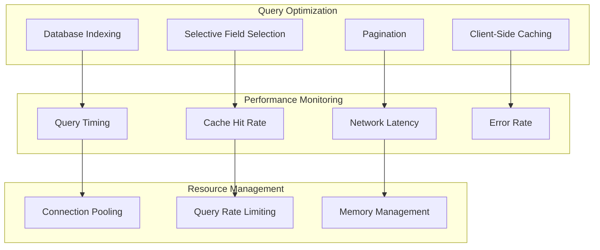
```mermaid
graph TB
subgraph "Query Optimization"
Indexing[Database Indexing]
SelectiveFields[Selective Field Selection]
Pagination[Pagination]
Caching[Client-Side Caching]
end
subgraph "Performance Monitoring"
QueryTiming[Query Timing]
CacheHitRate[Cache Hit Rate]
NetworkLatency[Network Latency]
ErrorRate[Error Rate]
end
subgraph "Resource Management"
ConnectionPooling[Connection Pooling]
QueryLimiting[Query Rate Limiting]
MemoryManagement[Memory Management]
end
Indexing --> QueryTiming
SelectiveFields --> CacheHitRate
Pagination --> NetworkLatency
Caching --> ErrorRate
QueryTiming --> ConnectionPooling
CacheHitRate --> QueryLimiting
NetworkLatency --> MemoryManagement
```

### Connection Pooling Considerations

While Supabase handles connection pooling internally, the application optimizes usage:

| Optimization Technique | Implementation | Benefits |
|----------------------|----------------|----------|
| **Query Deduplication** | React Query deduplication | Reduced network requests |
| **Stale Time Management** | Configurable cache timing | Balanced freshness vs performance |
| **Background Refetching** | Automatic cache updates | Fresh data without blocking |
| **Selective Updates** | Optimistic UI updates | Immediate feedback |
| **Batch Operations** | Grouped mutations | Reduced API calls |

### Memory Management

The system implements careful memory management for large datasets:

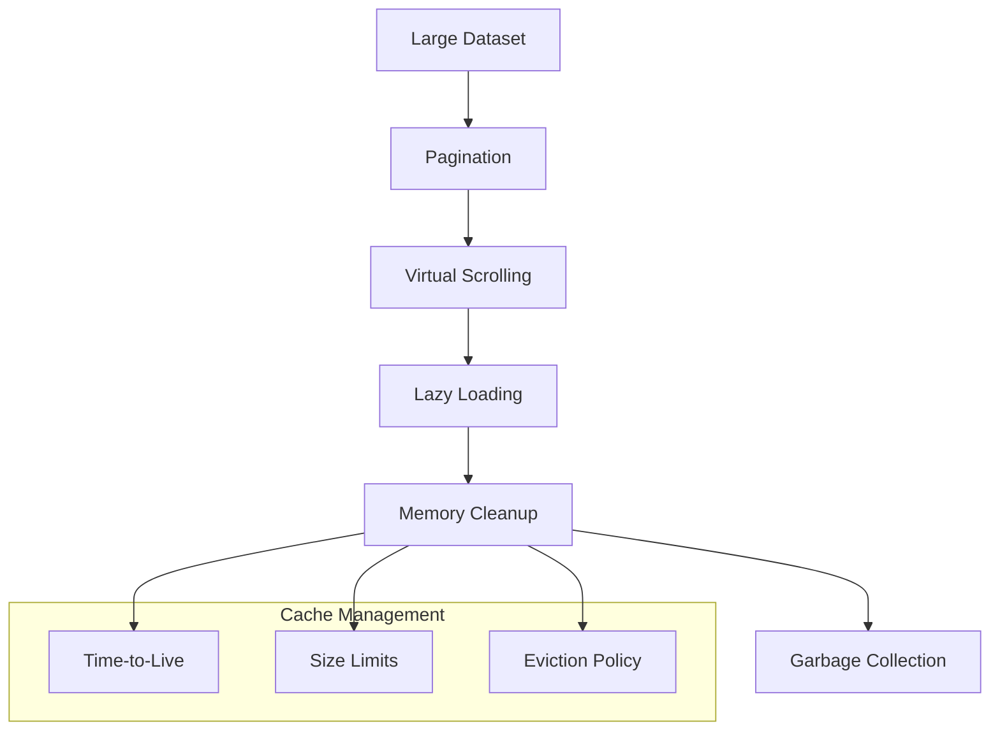
```mermaid
flowchart TD
LargeDataset[Large Dataset] --> Pagination[Pagination]
Pagination --> VirtualScroll[Virtual Scrolling]
VirtualScroll --> LazyLoading[Lazy Loading]
LazyLoading --> MemoryCleanup[Memory Cleanup]
MemoryCleanup --> GarbageCollection[Garbage Collection]
subgraph "Cache Management"
TTL[Time-to-Live]
SizeLimit[Size Limits]
EvictionPolicy[Eviction Policy]
end
MemoryCleanup --> TTL
MemoryCleanup --> SizeLimit
MemoryCleanup --> EvictionPolicy
```

**Section sources**
- [useFactoryCapacity.ts](file://src/hooks/useFactoryCapacity.ts#L88-L160)

## Complex Query Patterns

The system supports advanced query patterns for complex business requirements.

### Full-Text Search Implementation

The product catalog demonstrates full-text search capabilities:

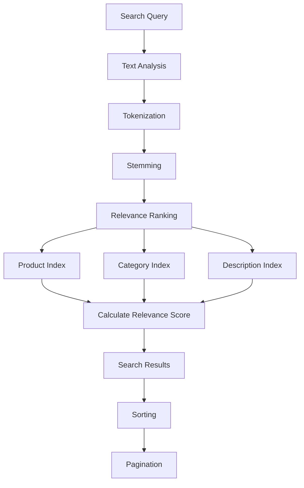
```mermaid
flowchart TD
SearchQuery[Search Query] --> TextAnalysis[Text Analysis]
TextAnalysis --> Tokenization[Tokenization]
Tokenization --> Stemming[Stemming]
Stemming --> Ranking[Relevance Ranking]
Ranking --> ProductIndex[Product Index]
Ranking --> CategoryIndex[Category Index]
Ranking --> DescriptionIndex[Description Index]
ProductIndex --> RelevanceScore[Calculate Relevance Score]
CategoryIndex --> RelevanceScore
DescriptionIndex --> RelevanceScore
RelevanceScore --> Results[Search Results]
Results --> Sorting[Sorting]
Sorting --> Pagination[Pagination]
```

**Diagram sources**
- [ProductCatalog.tsx](file://src/pages/ProductCatalog.tsx#L42-L75)

### Geospatial Queries

Supplier location filtering demonstrates geospatial capabilities:

| Query Type | Implementation | Use Case |
|------------|----------------|----------|
| **Distance Filtering** | Haversine formula | Location-based search |
| **Radius Queries** | Geographic coordinates | Proximity matching |
| **Bounding Box** | Coordinate ranges | Area filtering |
| **Multi-location** | Array of locations | Regional search |

### Advanced Joins and Relationships

The system handles complex relationships through nested queries:

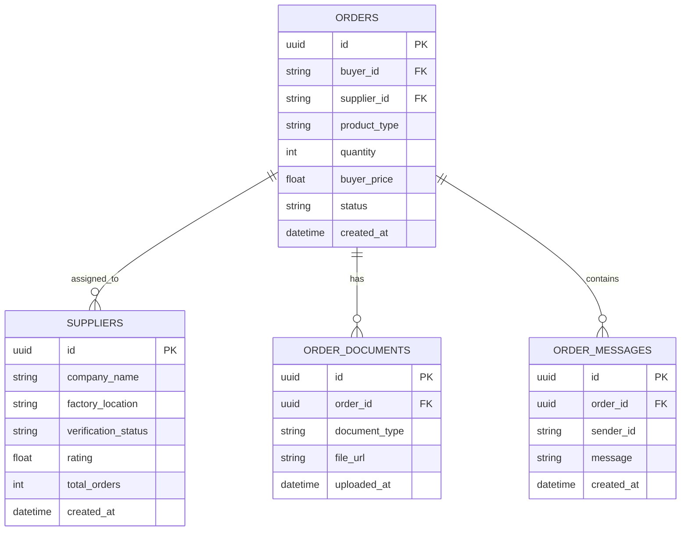
```mermaid
erDiagram
ORDERS {
uuid id PK
string buyer_id FK
string supplier_id FK
string product_type
int quantity
float buyer_price
string status
datetime created_at
}
SUPPLIERS {
uuid id PK
string company_name
string factory_location
string verification_status
float rating
int total_orders
datetime created_at
}
ORDER_DOCUMENTS {
uuid id PK
uuid order_id FK
string document_type
string file_url
datetime uploaded_at
}
ORDER_MESSAGES {
uuid id PK
uuid order_id FK
string sender_id
string message
datetime created_at
}
ORDERS ||--o{ SUPPLIERS : "assigned_to"
ORDERS ||--o{ ORDER_DOCUMENTS : "has"
ORDERS ||--o{ ORDER_MESSAGES : "contains"
```

**Diagram sources**
- [database.ts](file://src/types/database.ts#L399-L438)

**Section sources**
- [ProductCatalog.tsx](file://src/pages/ProductCatalog.tsx#L42-L75)
- [SupplierDirectory.tsx](file://src/pages/SupplierDirectory.tsx#L15-L18)

## Security Implementation

The system implements comprehensive security measures through Row Level Security (RLS) and access controls.

### Row Level Security Policies

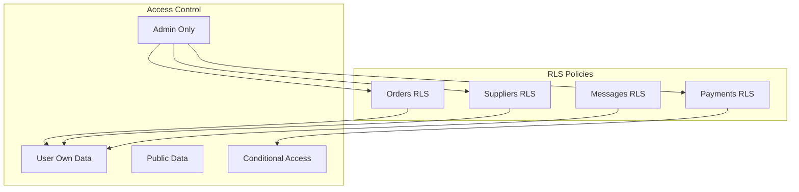
```mermaid
graph TB
subgraph "RLS Policies"
OrdersRLS[Orders RLS]
SuppliersRLS[Suppliers RLS]
MessagesRLS[Messages RLS]
PaymentsRLS[Payments RLS]
end
subgraph "Access Control"
AdminOnly[Admin Only]
UserOwnData[User Own Data]
PublicData[Public Data]
ConditionalAccess[Conditional Access]
end
OrdersRLS --> UserOwnData
SuppliersRLS --> UserOwnData
MessagesRLS --> UserOwnData
PaymentsRLS --> ConditionalAccess
AdminOnly --> OrdersRLS
AdminOnly --> SuppliersRLS
AdminOnly --> PaymentsRLS
```

### Access Control Matrix

| Entity | Admin | Supplier | Buyer | Public |
|--------|-------|----------|-------|--------|
| **Orders** | Full Access | Own Orders | Own Orders | None |
| **Suppliers** | Full Access | None | View Only | View Only |
| **Messages** | Full Access | Own Messages | Own Messages | None |
| **Payments** | Full Access | Own Payments | Own Payments | None |
| **CMS Content** | Full Access | None | View Only | View Only |

### Authentication Integration

The system integrates with Supabase authentication for seamless access control:

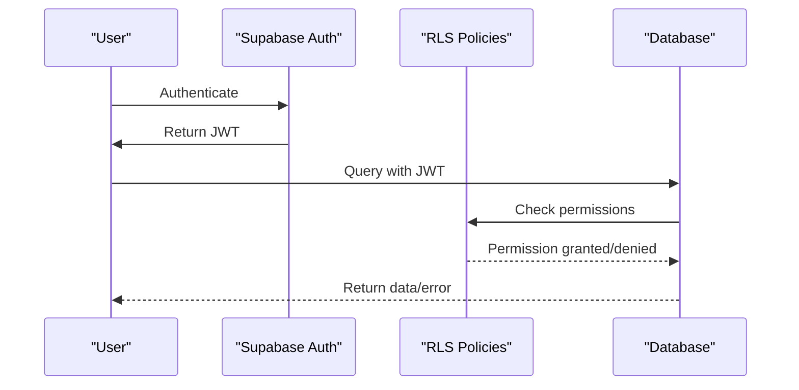
```mermaid
sequenceDiagram
participant User as "User"
participant Auth as "Supabase Auth"
participant RLS as "RLS Policies"
participant DB as "Database"
User->>Auth : Authenticate
Auth->>User : Return JWT
User->>DB : Query with JWT
DB->>RLS : Check permissions
RLS-->>DB : Permission granted/denied
DB-->>User : Return data/error
```

**Section sources**
- [20251120233928_2016afb8-d720-4858-9e12-7fb4ebbd5de0.sql](file://supabase/migrations/20251120233928_2016afb8-d720-4858-9e12-7fb4ebbd5de0.sql#L156-L218)

## Best Practices

### Query Design Principles

1. **Selective Field Retrieval**: Always specify required fields rather than using `*`
2. **Proper Indexing**: Ensure database indexes exist for frequently queried columns
3. **Pagination**: Implement pagination for large datasets
4. **Caching Strategy**: Use appropriate cache timing based on data volatility
5. **Error Boundaries**: Implement comprehensive error handling

### Performance Guidelines

1. **Batch Operations**: Group related operations when possible
2. **Lazy Loading**: Load data only when needed
3. **Optimistic Updates**: Provide immediate UI feedback for mutations
4. **Query Optimization**: Use EXPLAIN plans to optimize complex queries
5. **Resource Cleanup**: Properly unsubscribe from real-time channels

### Security Recommendations

1. **RLS Policies**: Implement proper row-level security for all sensitive data
2. **Input Validation**: Validate all user inputs before database operations
3. **Access Controls**: Implement role-based access controls
4. **Audit Logging**: Log all sensitive operations
5. **Environment Separation**: Use separate environments for development and production

## Troubleshooting Guide

### Common Issues and Solutions

| Issue | Symptoms | Solution |
|-------|----------|----------|
| **Environment Validation Failures** | Application fails to start | Check `.env` file for correct Supabase credentials |
| **Real-time Subscriptions Not Working** | Live updates not appearing | Verify WebSocket connectivity and RLS policies |
| **Slow Query Performance** | Long loading times | Review query indexes and pagination |
| **Authentication Errors** | 401/403 responses | Check JWT token validity and refresh logic |
| **Cache Inconsistency** | Stale data display | Implement proper cache invalidation |

### Debugging Tools

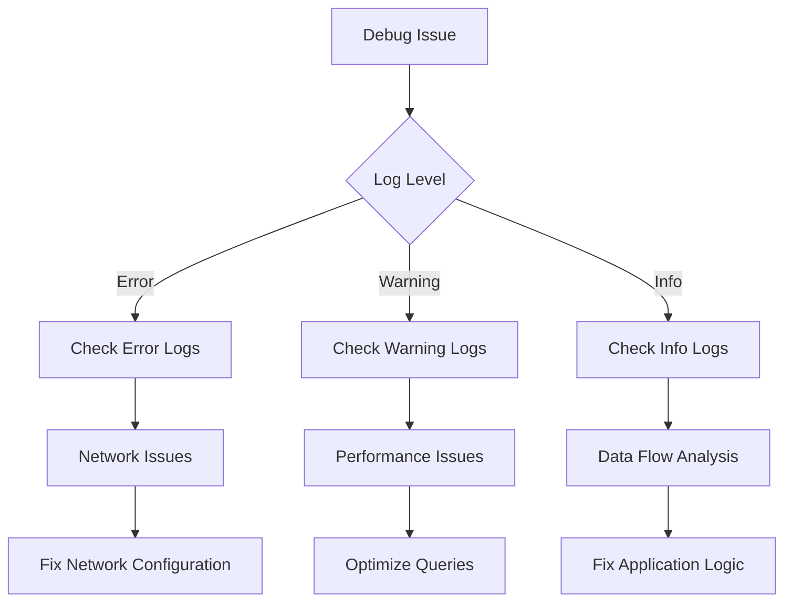
```mermaid
flowchart TD
DebugIssue[Debug Issue] --> LogLevel{Log Level}
LogLevel --> |Error| ErrorLogs[Check Error Logs]
LogLevel --> |Warning| WarningLogs[Check Warning Logs]
LogLevel --> |Info| InfoLogs[Check Info Logs]
ErrorLogs --> NetworkIssues[Network Issues]
WarningLogs --> PerformanceIssues[Performance Issues]
InfoLogs --> DataFlow[Data Flow Analysis]
NetworkIssues --> FixNetwork[Fix Network Configuration]
PerformanceIssues --> OptimizeQueries[Optimize Queries]
DataFlow --> FixLogic[Fix Application Logic]
```

### Monitoring and Observability

The system provides comprehensive monitoring capabilities:

1. **Query Performance**: Monitor query execution times
2. **Cache Hit Rates**: Track cache effectiveness
3. **Error Rates**: Monitor error frequencies
4. **User Activity**: Track user interactions
5. **System Health**: Monitor database connectivity

**Section sources**
- [env-validator.ts](file://src/lib/env-validator.ts#L134-L142)