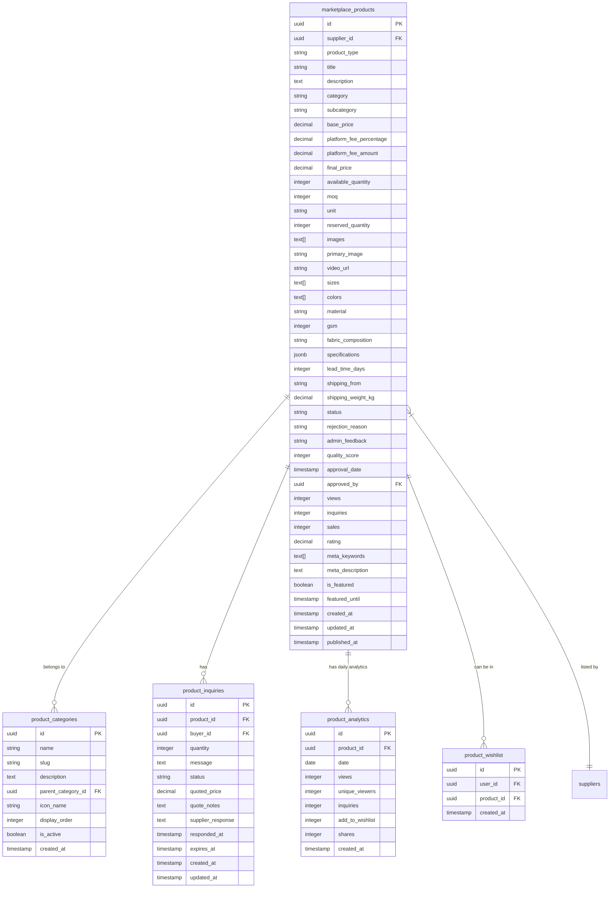
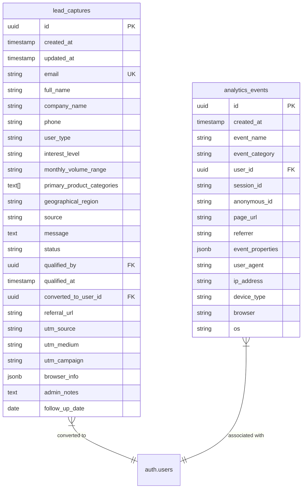
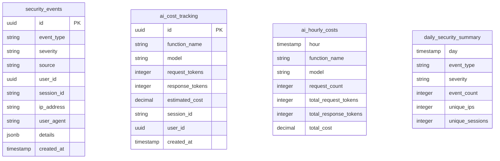
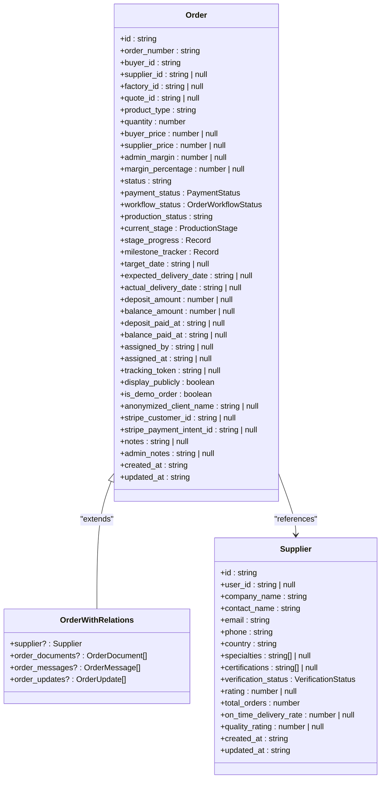

# Database Migrations

<cite>
**Referenced Files in This Document**   
- [add_supplier_to_quotes.sql](file://supabase/migrations/add_supplier_to_quotes.sql)
- [20250122000000_create_marketplace_system.sql](file://supabase/migrations/20250122000000_create_marketplace_system.sql)
- [20251123052149_create_lead_capture_system.sql](file://supabase/migrations/20251123052149_create_lead_capture_system.sql)
- [20251127194411_08e21416-fb07-4471-a062-d1c8e91e52c3.sql](file://supabase/migrations/20251127194411_08e21416-fb07-4471-a062-d1c8e91e52c3.sql)
- [20251127090507_170c0149-3daf-4f13-8481-8297b8efac19.sql](file://supabase/migrations/20251127090507_170c0149-3daf-4f13-8481-8297b8efac19.sql)
- [20251124153707_081333e0-a3e1-48b0-bf13-2cea6f895f71.sql](file://supabase/migrations/20251124153707_081333e0-a3e1-48b0-bf13-2cea6f895f71.sql)
- [20251124153727_2435295c-eb4c-4db9-8492-360d7f5a1bca.sql](file://supabase/migrations/20251124153727_2435295c-eb4c-4db9-8492-360d7f5a1bca.sql)
- [database.ts](file://src/types/database.ts)
- [types.ts](file://src/integrations/supabase/types.ts)
- [client.ts](file://src/integrations/supabase/client.ts)
</cite>

## Table of Contents
1. [Introduction](#introduction)
2. [Migration Workflow and Versioning Strategy](#migration-workflow-and-versioning-strategy)
3. [Core Migration Analysis](#core-migration-analysis)
4. [Marketplace System Migration](#marketplace-system-migration)
5. [Lead Capture System Migration](#lead-capture-system-migration)
6. [Audit Logging and Security Migrations](#audit-logging-and-security-migrations)
7. [TypeScript Type Integration](#typescript-type-integration)
8. [Best Practices for Database Migrations](#best-practices-for-database-migrations)
9. [Conclusion](#conclusion)

## Introduction

This document provides comprehensive documentation for the Supabase database schema evolution through migrations in the SleekApparels application. The migration system enables structured, version-controlled changes to the database schema, ensuring data integrity and consistency across development, staging, and production environments. The migrations implement critical business systems including the marketplace platform, lead capture functionality, and production tracking, while maintaining robust security and audit capabilities.

The migration files are stored in the `supabase/migrations` directory and follow a timestamp-based naming convention that enables chronological execution and proper versioning. Each migration represents an atomic change to the database schema, with clear documentation of its purpose and implementation details. The system supports both forward migrations to implement new features and backward compatibility considerations for potential rollbacks.

**Section sources**
- [20250122000000_create_marketplace_system.sql](file://supabase/migrations/20250122000000_create_marketplace_system.sql)
- [20251123052149_create_lead_capture_system.sql](file://supabase/migrations/20251123052149_create_lead_capture_system.sql)
- [add_supplier_to_quotes.sql](file://supabase/migrations/add_supplier_to_quotes.sql)

## Migration Workflow and Versioning Strategy

The Supabase migration system employs a timestamp-based versioning strategy where each migration file is prefixed with a 14-digit timestamp (YYYYMMDDHHMMSS) followed by a descriptive name. This approach ensures chronological execution of migrations and prevents conflicts when multiple developers create migrations simultaneously. The timestamp format provides microsecond precision, making collision extremely unlikely even in high-velocity development environments.

Migrations are executed sequentially in ascending order based on their timestamp prefixes. This linear execution model guarantees that database schema changes are applied in the correct dependency order. The system maintains a record of applied migrations, preventing re-execution of completed migrations and enabling reliable synchronization across different environments.

Each migration file is a self-contained SQL script that includes transactional operations where appropriate, comments explaining the purpose and implementation details, and idempotent operations using clauses like `IF NOT EXISTS` and `IF EXISTS`. This design allows for safe re-execution if needed and supports partial rollback scenarios. The migration process is integrated with the Supabase CLI, enabling developers to apply migrations locally during development and deploy them to remote databases in staging and production environments.

The workflow typically follows these steps: developers create a new migration file for each schema change, test the migration locally against a development database, commit the migration file to version control, and deploy the migration to target environments using the Supabase CLI or automated deployment pipelines. This structured approach ensures that all team members work with a consistent database schema and that production deployments are predictable and reliable.

**Section sources**
- [20250122000000_create_marketplace_system.sql](file://supabase/migrations/20250122000000_create_marketplace_system.sql)
- [20251123052149_create_lead_capture_system.sql](file://supabase/migrations/20251123052149_create_lead_capture_system.sql)
- [add_supplier_to_quotes.sql](file://supabase/migrations/add_supplier_to_quotes.sql)

## Core Migration Analysis

The database migration system in SleekApparels implements several critical business features through atomic, version-controlled schema changes. These migrations follow best practices for database evolution, including clear documentation, idempotent operations, and proper indexing for performance optimization.

The migration files are designed to be human-readable with extensive comments explaining the purpose, implementation details, and business context of each change. This documentation approach ensures that future developers can understand the rationale behind schema decisions and trace the evolution of the database over time. Each migration focuses on a specific business capability or feature enhancement, making it easier to reason about the changes and their impact on the application.

The migrations implement various database objects including tables, indexes, constraints, triggers, functions, and Row Level Security (RLS) policies. The use of RLS policies is particularly important in this application, as it enables fine-grained access control at the database level, ensuring that users can only access data they are authorized to see. This security-by-default approach reduces the risk of accidental data exposure and simplifies application-level security logic.

Performance considerations are integrated into the migration design through the creation of appropriate indexes on frequently queried columns, the use of generated columns for computed values, and the implementation of database functions for complex operations. These optimizations ensure that the application maintains responsive performance even as data volumes grow.

**Section sources**
- [20250122000000_create_marketplace_system.sql](file://supabase/migrations/20250122000000_create_marketplace_system.sql)
- [20251123052149_create_lead_capture_system.sql](file://supabase/migrations/20251123052149_create_lead_capture_system.sql)
- [add_supplier_to_quotes.sql](file://supabase/migrations/add_supplier_to_quotes.sql)

## Marketplace System Migration

The `20250122000000_create_marketplace_system.sql` migration implements a comprehensive B2B marketplace platform with product listings, supplier management, and buyer engagement features. This migration creates multiple interrelated tables that form the foundation of the marketplace functionality.

The core of this migration is the `marketplace_products` table, which stores detailed information about products available for purchase. This table includes fields for product metadata (title, description, category), pricing information (base_price, platform_fee_percentage, final_price), inventory details (available_quantity, moq), media assets (images, primary_image, video_url), and specifications (sizes, colors, material). The migration also implements computed columns for platform fees and final prices using generated columns, ensuring data consistency and reducing application-level calculation complexity.

Additional tables created by this migration include `product_approval_log` for tracking the review process of product listings, `product_inquiries` for managing buyer inquiries about products, `product_analytics` for tracking engagement metrics, and `product_categories` for organizing products into a hierarchical taxonomy. The migration also implements a wishlist system through the `product_wishlist` table, enabling buyers to save products for future consideration.

The migration establishes comprehensive Row Level Security policies to control access to marketplace data. These policies ensure that suppliers can only manage their own products, buyers can only view approved products, and administrators have full access for moderation and management. The security model is implemented directly in the database, providing a robust foundation for application security.

**Diagram sources**
- [20250122000000_create_marketplace_system.sql](file://supabase/migrations/20250122000000_create_marketplace_system.sql)

**Section sources**
- [20250122000000_create_marketplace_system.sql](file://supabase/migrations/20250122000000_create_marketplace_system.sql)

## Lead Capture System Migration

The `20251123052149_create_lead_capture_system.sql` migration implements a lead capture system designed to collect early interest from potential users before they complete full registration. This system serves dual purposes: gathering valuable market intelligence for business development and collecting training data for AI models that power the conversational quote system.

The migration creates two primary tables: `lead_captures` and `analytics_events`. The `lead_captures` table stores comprehensive information about potential customers who express interest in the platform, including contact details (email, full_name, company_name, phone), lead qualification data (user_type, interest_level), contextual information (monthly_volume_range, primary_product_categories, geographical_region), and status tracking (status, qualified_by, qualified_at, converted_to_user_id). This rich dataset enables the sales team to prioritize leads and tailor their outreach strategies.

The `analytics_events` table complements the lead capture functionality by tracking user interactions across the platform. This table records events such as button clicks, form submissions, and page views, providing insights into user behavior and conversion funnels. The event data includes technical metadata (user_agent, ip_address, device_type, browser, os) that helps identify patterns and optimize the user experience.

The migration implements Row Level Security policies to protect sensitive lead data, ensuring that only administrators can view and update lead records. It also includes helper functions like `convert_lead_to_user` that automate the process of upgrading a lead to a full user account when they complete registration. This function maintains data integrity by updating the lead status and linking it to the new user account.

**Diagram sources**
- [20251123052149_create_lead_capture_system.sql](file://supabase/migrations/20251123052149_create_lead_capture_system.sql)

**Section sources**
- [20251123052149_create_lead_capture_system.sql](file://supabase/migrations/20251123052149_create_lead_capture_system.sql)

## Audit Logging and Security Migrations

The audit logging and security migrations implement comprehensive monitoring and protection mechanisms for the application. These migrations address both operational security and compliance requirements, ensuring that all significant actions are properly recorded and suspicious activities are detected.

The `20251127194411_08e21416-fb07-4471-a062-d1c8e91e52c3.sql` migration creates tables for tracking security events and AI API costs. The `security_events` table records suspicious activities such as CAPTCHA failures, rate limit violations, and suspicious patterns, with severity levels to prioritize response efforts. The `ai_cost_tracking` table monitors the usage and cost of AI services, providing visibility into one of the application's most significant operational expenses.

The migration also creates views for aggregating this data, including `ai_hourly_costs` for analyzing AI service usage patterns and `daily_security_summary` for identifying security trends. These views enable efficient reporting and alerting without requiring complex queries on the raw data.

Security fix migrations like `20251127090507_170c0149-3daf-4f13-8481-8297b8efac19.sql` demonstrate the ongoing refinement of the security model. This migration tightens access controls by removing overly permissive policies and restricting certain operations to the service role only. For example, it modifies policies on tables like `supplier_ratings`, `social_shares`, and `product_interactions` to ensure that only authenticated users or the service role can perform specific actions.

**Diagram sources**
- [20251127194411_08e21416-fb07-4471-a062-d1c8e91e52c3.sql](file://supabase/migrations/20251127194411_08e21416-fb07-4471-a062-d1c8e91e52c3.sql)
- [20251127090507_170c0149-3daf-4f13-8481-8297b8efac19.sql](file://supabase/migrations/20251127090507_170c0149-3daf-4f13-8481-8297b8efac19.sql)

**Section sources**
- [20251127194411_08e21416-fb07-4471-a062-d1c8e91e52c3.sql](file://supabase/migrations/20251127194411_08e21416-fb07-4471-a062-d1c8e91e52c3.sql)
- [20251127090507_170c0149-3daf-4f13-8481-8297b8efac19.sql](file://supabase/migrations/20251127090507_170c0149-3daf-4f13-8481-8297b8efac19.sql)

## TypeScript Type Integration

The database migrations are closely integrated with TypeScript type definitions to ensure type safety across the frontend and backend. The `src/types/database.ts` file contains TypeScript interfaces that mirror the database schema, providing compile-time type checking for database operations.

These type definitions are automatically generated from the database schema using Supabase's type generation tools, ensuring they remain synchronized with the actual database structure. The types include interfaces for each database table (e.g., `Order`, `Supplier`, `BlogPost`) with properties that correspond to the table columns, including appropriate TypeScript types (string, number, boolean, etc.) and nullability based on database constraints.

The integration between the database schema and TypeScript types enables type-safe database queries throughout the application. When developers use the Supabase client to perform database operations, the TypeScript compiler validates that the data being inserted, updated, or queried matches the expected types. This prevents common errors such as misspelled column names, incorrect data types, or missing required fields.

The type system also supports relationships between tables through optional properties that reference related entities. For example, the `OrderWithRelations` interface extends the base `Order` interface to include related data such as the supplier, order documents, messages, and updates. This pattern enables efficient data fetching with proper typing, reducing the risk of runtime errors when accessing related data.

**Diagram sources**
- [database.ts](file://src/types/database.ts)

**Section sources**
- [database.ts](file://src/types/database.ts)
- [types.ts](file://src/integrations/supabase/types.ts)
- [client.ts](file://src/integrations/supabase/client.ts)

## Best Practices for Database Migrations

The migration system in SleekApparels exemplifies several best practices for database schema evolution in team environments. These practices ensure that schema changes are reliable, reversible, and well-documented, minimizing the risk of data loss or application downtime.

One key practice is the use of descriptive migration names and comprehensive comments within each migration file. Each migration includes a clear purpose statement, date, and detailed comments explaining the rationale and implementation of each change. This documentation approach creates an audit trail of schema evolution that is invaluable for onboarding new team members and troubleshooting issues.

The migrations are designed to be idempotent, using `IF NOT EXISTS` and `IF EXISTS` clauses to prevent errors when migrations are re-executed. This design allows for safe deployment in environments where migrations might be applied multiple times, such as during development or when recovering from deployment failures.

Another best practice is the focus on backward compatibility. When modifying existing tables, migrations typically add new columns rather than modifying or removing existing ones. When changes to existing columns are necessary, they are implemented in a way that preserves data integrity and application functionality. This approach enables rolling deployments and reduces the risk of breaking changes.

The use of transactions for related operations ensures data consistency. When multiple changes are interdependent, they are grouped within a single transaction so that either all changes are applied or none are, preventing partial updates that could leave the database in an inconsistent state.

Regular security reviews are integrated into the migration process, as evidenced by the security fix migrations that tighten access controls and address potential vulnerabilities. This proactive approach to security ensures that the database remains protected as new features are added.

Finally, the close integration between the database schema and TypeScript types demonstrates the importance of end-to-end type safety. By synchronizing database changes with type definitions, the team ensures that the entire application stack remains consistent and that type-related errors are caught at compile time rather than runtime.

**Section sources**
- [20250122000000_create_marketplace_system.sql](file://supabase/migrations/20250122000000_create_marketplace_system.sql)
- [20251123052149_create_lead_capture_system.sql](file://supabase/migrations/20251123052149_create_lead_capture_system.sql)
- [add_supplier_to_quotes.sql](file://supabase/migrations/add_supplier_to_quotes.sql)
- [database.ts](file://src/types/database.ts)

## Conclusion

The Supabase database migration system in SleekApparels provides a robust foundation for schema evolution, enabling the team to implement complex business features while maintaining data integrity and security. The timestamp-based versioning strategy, comprehensive documentation, and adherence to best practices ensure that database changes are reliable, reversible, and well-understood by all team members.

The migrations implement critical business systems including the marketplace platform, lead capture functionality, and production tracking, while maintaining robust security and audit capabilities. The close integration between the database schema and TypeScript types ensures type safety across the frontend and backend, reducing the risk of runtime errors and improving developer productivity.

By following best practices for database migrations, including idempotent operations, backward compatibility, and comprehensive documentation, the team has created a sustainable approach to database evolution that supports both rapid feature development and long-term maintainability. The security-focused design, with Row Level Security policies and audit logging, ensures that sensitive data is protected and all significant actions are properly recorded.

This migration system serves as a model for how database schema changes can be managed in a modern web application, balancing the need for agility with the requirements for reliability, security, and maintainability.