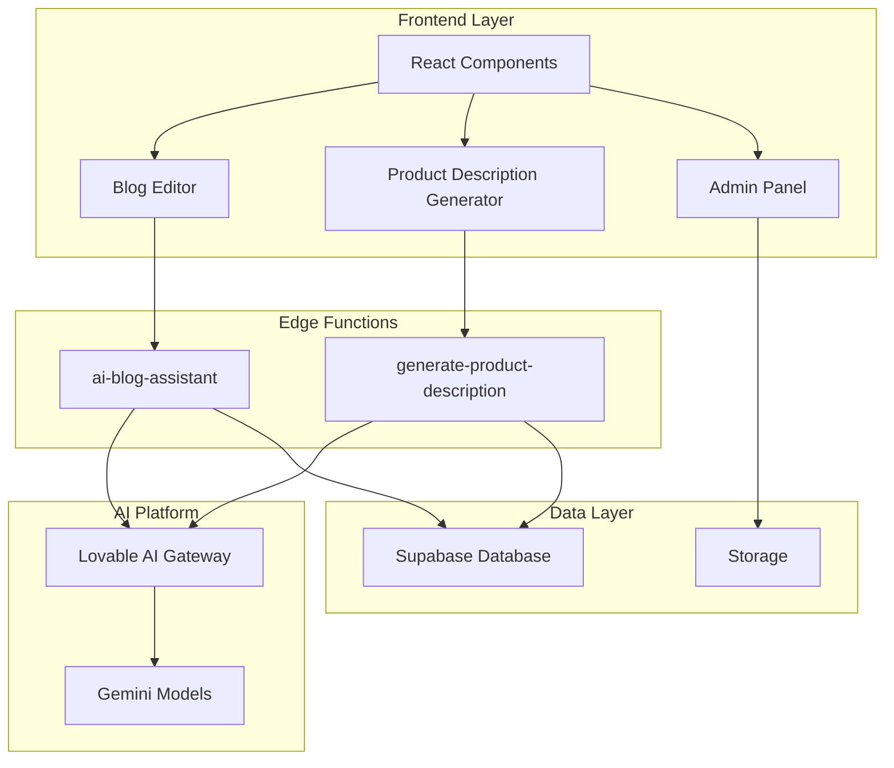
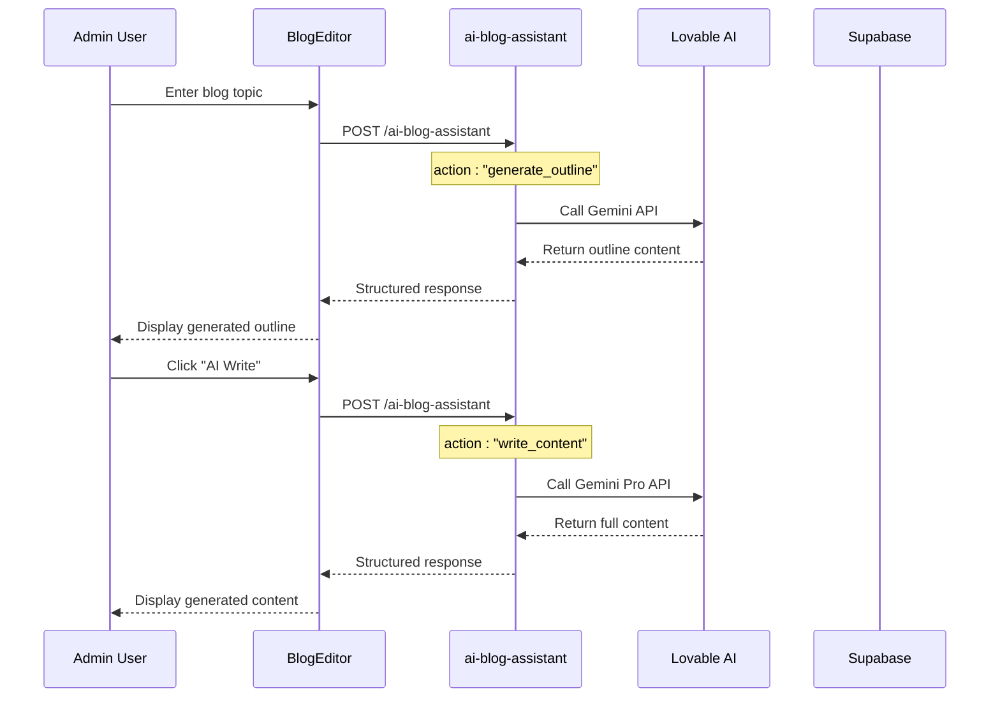
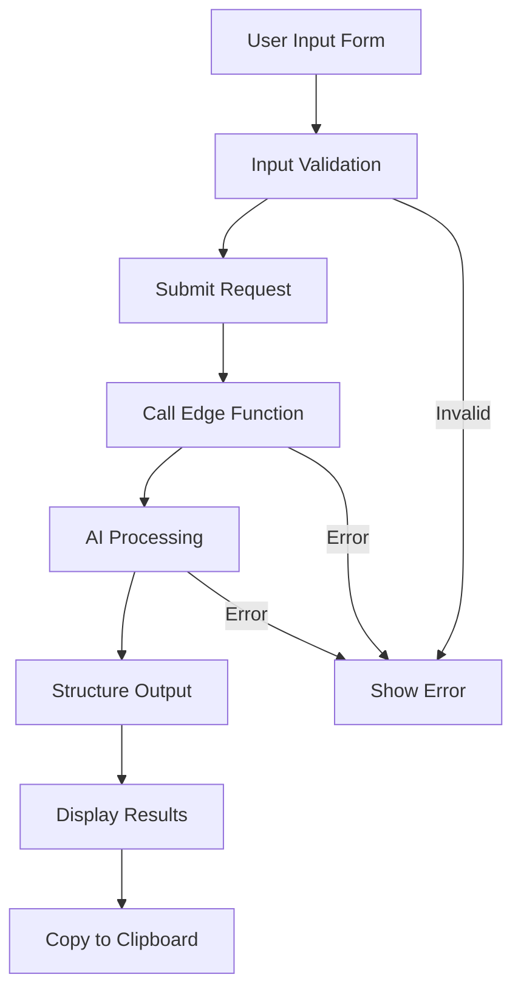
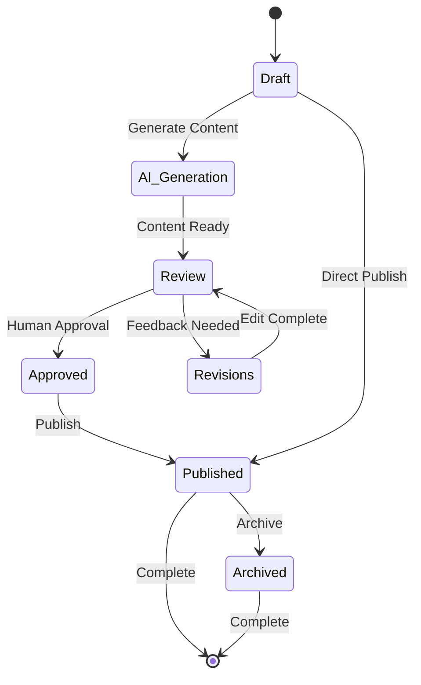
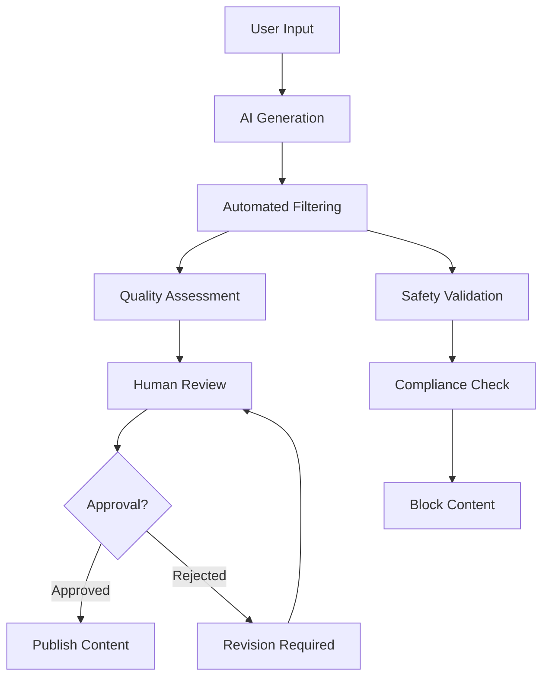

# AI Content Generation Suite

<cite>
**Referenced Files in This Document**
- [ProductDescriptionGenerator.tsx](file://src/components/admin/ProductDescriptionGenerator.tsx)
- [BlogEditor.tsx](file://src/components/blog/BlogEditor.tsx)
- [AdminBlogEditor.tsx](file://src/pages/AdminBlogEditor.tsx)
- [AdminProducts.tsx](file://src/pages\admin\AdminProducts.tsx)
- [ai-blog-assistant/index.ts](file://supabase/functions/ai-blog-assistant/index.ts)
- [generate-product-description/index.ts](file://supabase/functions/generate-product-description/index.ts)
- [seo.ts](file://src/lib/seo.ts)
- [auditLog.ts](file://src/lib/auditLog.ts)
- [blog_posts schema](file://supabase/migrations/20251115150759_remix_migration_from_pg_dump.sql#L866-L886)
</cite>

## Table of Contents
1. [Introduction](#introduction)
2. [System Architecture](#system-architecture)
3. [AI Blog Assistant](#ai-blog-assistant)
4. [Product Description Generator](#product-description-generator)
5. [Frontend Integration](#frontend-integration)
6. [Content Structure & Validation](#content-structure--validation)
7. [Human-in-the-Loop Workflow](#human-in-the-loop-workflow)
8. [Brand Voice & Consistency](#brand-voice--consistency)
9. [Content Moderation](#content-moderation)
10. [Performance & Optimization](#performance--optimization)
11. [Troubleshooting Guide](#troubleshooting-guide)
12. [Best Practices](#best-practices)

## Introduction

The AI Content Generation suite is a comprehensive system that automates the creation of marketing and product content for Sleek Apparels. Built on the Lovable AI/Gemini platform, it provides intelligent content generation capabilities for blog posts, product descriptions, and marketing materials while maintaining brand consistency and editorial control.

The suite consists of two primary components:
- **AI Blog Assistant**: Generates SEO-optimized blog posts and outlines
- **Product Description Generator**: Creates compelling product titles, features, and meta descriptions

Both systems integrate seamlessly with the admin dashboard and support human-in-the-loop workflows for quality assurance and brand alignment.

## System Architecture

The AI Content Generation suite follows a serverless architecture with Supabase Edge Functions as the backend layer:



**Diagram sources**
- [BlogEditor.tsx](file://src/components/blog/BlogEditor.tsx#L1-L297)
- [ProductDescriptionGenerator.tsx](file://src/components/admin/ProductDescriptionGenerator.tsx#L1-L176)
- [ai-blog-assistant/index.ts](file://supabase/functions/ai-blog-assistant/index.ts#L1-L84)
- [generate-product-description/index.ts](file://supabase/functions/generate-product-description/index.ts#L1-L91)

**Section sources**
- [BlogEditor.tsx](file://src/components/blog/BlogEditor.tsx#L1-L297)
- [ProductDescriptionGenerator.tsx](file://src/components/admin/ProductDescriptionGenerator.tsx#L1-L176)

## AI Blog Assistant

The AI Blog Assistant provides intelligent content generation for blog posts with two primary modes: outline generation and full content writing.

### System Prompts & Configuration

The system uses different configurations based on the action type:

#### Outline Generation
```typescript
// System Prompt for Outline Generation
const systemPrompt = "You are an expert content strategist for apparel manufacturing industry.";

// User Prompt Template
const userPrompt = `Create a comprehensive blog post outline for: "${topic}"
      
Include:
- Engaging title
- Introduction hook
- 5-7 main sections with subpoints
- Conclusion
- SEO keywords to target`;
```

#### Content Writing
```typescript
// System Prompt for Content Writing
const systemPrompt = "You are an expert content writer specializing in apparel manufacturing, creating comprehensive, SEO-optimized blog posts.";

// User Prompt Template
const userPrompt = `Write a full blog post (1800-2500 words) based on this outline:
${outline}

Requirements:
- Professional yet engaging tone
- Include statistics and facts where relevant
- SEO-optimized with natural keyword placement
- Clear section headers
- Actionable insights for readers
- Strong conclusion with CTA`;
```

### Model Selection Strategy

The system intelligently selects AI models based on content complexity:

| Action Type | Model | Reasoning |
|-------------|-------|-----------|
| Outline Generation | `google/gemini-2.5-flash` | Fast response for brainstorming |
| Content Writing | `google/gemini-2.5-pro` | Higher capability for long-form content |
| SEO Optimization | `google/gemini-2.5-flash` | Balanced speed and quality |

### Workflow Implementation



**Diagram sources**
- [BlogEditor.tsx](file://src/components/blog/BlogEditor.tsx#L45-L96)
- [ai-blog-assistant/index.ts](file://supabase/functions/ai-blog-assistant/index.ts#L25-L48)

**Section sources**
- [ai-blog-assistant/index.ts](file://supabase/functions/ai-blog-assistant/index.ts#L1-L84)
- [BlogEditor.tsx](file://src/components/blog/BlogEditor.tsx#L45-L96)

## Product Description Generator

The Product Description Generator creates comprehensive product content with structured output using function calling capabilities.

### Input Parameters

The system accepts four primary parameters:

| Parameter | Type | Required | Default | Description |
|-----------|------|----------|---------|-------------|
| `product_type` | string | Yes | - | Type of product (e.g., "Custom T-Shirt") |
| `material` | string | No | "Cotton blend" | Material composition |
| `features` | string[] | No | [] | Comma-separated feature list |
| `target_audience` | string | No | "B2B buyers" | Target customer segment |

### Output Structure

The AI generates content in a structured format using function calling:

```typescript
interface GeneratedContent {
  title: string;           // Catchy product title with main keyword
  description: string;     // 200-300 word SEO-optimized description
  features: string[];      // 5-7 feature bullet points
  meta_description: string; // 150-160 character SEO description
}
```

### System Prompt Configuration

```typescript
const systemPrompt = `You are an expert copywriter specializing in apparel product descriptions.
Create compelling, SEO-optimized product descriptions that highlight quality, features, and benefits.`;

const userPrompt = `Generate a complete product description for:
Product Type: ${product_type}
Material: ${material}
Key Features: ${features?.join(', ')}
Target Audience: ${target_audience}

Provide:
1. Product title (catchy, includes main keyword)
2. Full description (200-300 words, SEO-optimized)
3. Feature bullet points (5-7 points)
4. Meta description (150-160 characters for SEO)`;
```

### Function Calling Implementation

The system uses Gemini's function calling to ensure structured output:

```typescript
const toolDefinition = {
  type: "function",
  function: {
    name: "generate_product_content",
    parameters: {
      type: "object",
      properties: {
        title: { type: "string" },
        description: { type: "string" },
        features: { type: "array", items: { type: "string" } },
        meta_description: { type: "string" }
      },
      required: ["title", "description", "features", "meta_description"]
    }
  }
};
```

**Section sources**
- [generate-product-description/index.ts](file://supabase/functions/generate-product-description/index.ts#L1-L91)
- [ProductDescriptionGenerator.tsx](file://src/components/admin/ProductDescriptionGenerator.tsx#L1-L176)

## Frontend Integration

The AI Content Generation suite integrates seamlessly with multiple frontend components, providing intuitive interfaces for content creation and management.

### BlogEditor Integration

The BlogEditor component provides dual AI generation capabilities:

#### AI Outline Generation
```typescript
const generateAIOutline = async () => {
  try {
    const { data, error } = await supabase.functions.invoke('ai-blog-assistant', {
      body: { action: 'generate_outline', topic: title }
    });
    
    if (data.content) {
      setContent(data.content);
      toast.success('AI outline generated!');
    }
  } catch (error) {
    toast.error('Failed to generate outline');
  }
};
```

#### AI Content Generation
```typescript
const generateAIContent = async () => {
  try {
    const { data, error } = await supabase.functions.invoke('ai-blog-assistant', {
      body: { action: 'write_content', outline: content }
    });
    
    if (data.content) {
      setContent(data.content);
      toast.success('AI content generated!');
    }
  } catch (error) {
    toast.error('Failed to generate content');
  }
};
```

### ProductDescriptionGenerator Integration

The Product Description Generator provides a streamlined interface:



**Diagram sources**
- [ProductDescriptionGenerator.tsx](file://src/components/admin/ProductDescriptionGenerator.tsx#L19-L48)

### Admin Panel Integration

The admin panel provides comprehensive content management:

#### Bulk Operations
- **Bulk AI Generation**: Generate images for all products missing AI-generated content
- **Approval Workflows**: Review and approve AI-generated content
- **Quality Control**: Manual editing and refinement capabilities

#### Content Management Features
- **Draft Saving**: Save incomplete content as drafts
- **Publishing Workflow**: Toggle between draft and published states
- **SEO Optimization**: Automatic meta tag generation and optimization
- **Version Control**: Track changes and maintain content history

**Section sources**
- [BlogEditor.tsx](file://src/components/blog/BlogEditor.tsx#L1-L297)
- [ProductDescriptionGenerator.tsx](file://src/components/admin/ProductDescriptionGenerator.tsx#L1-L176)
- [AdminBlogEditor.tsx](file://src/pages\AdminBlogEditor.tsx#L1-L326)
- [AdminProducts.tsx](file://src/pages\admin\AdminProducts.tsx#L1-L665)

## Content Structure & Validation

The AI Content Generation suite implements robust content structure and validation mechanisms to ensure quality and consistency.

### Blog Post Structure

The system enforces a standardized blog post structure:

```typescript
interface BlogPost {
  title: string;           // Primary headline
  slug: string;           // URL-friendly identifier
  excerpt: string;        // Brief summary (150-200 chars)
  content: string;        // Full article content
  category: string;       // Content category
  meta_title: string;     // SEO-optimized title
  meta_description: string; // SEO description
  meta_keywords: string;  // Comma-separated keywords
  featured_image_url: string; // Primary image
  published: boolean;     // Publication status
  published_at?: string;  // Publication timestamp
}
```

### Content Validation Patterns

#### SEO Validation
```typescript
// Meta title validation (60 characters max)
const validateMetaTitle = (title: string): boolean => {
  return title.length <= 60;
};

// Meta description validation (160 characters max)
const validateMetaDescription = (description: string): boolean => {
  return description.length <= 160;
};

// Word count validation for blog content
const validateWordCount = (content: string, minWords: number, maxWords: number): boolean => {
  const wordCount = content.trim().split(/\s+/).length;
  return wordCount >= minWords && wordCount <= maxWords;
};
```

#### Content Quality Checks
- **Keyword Density**: Ensures appropriate keyword usage
- **Readability Scores**: Maintains optimal reading level
- **Content Completeness**: Verifies all required sections are present
- **Brand Tone Alignment**: Matches company voice guidelines

### Content Templates

The system provides predefined templates for different content types:

#### Blog Post Template
```markdown
# [Title] - [SEO Title]

## Introduction
[Hook paragraph introducing the topic]

## [Main Section 1]
[Detailed content with subheadings]

## [Main Section 2]
[Technical information or case studies]

## [Main Section 3]
[Benefits and actionable insights]

## Conclusion
[Summary and CTA]
```

#### Product Description Template
```markdown
# [Product Title]
[1-2 sentence introduction]

## Key Features
- [Feature 1]
- [Feature 2]
- [Feature 3]

## Product Details
[Technical specifications]

## Why Choose Us
[Benefit-driven messaging]
```

**Section sources**
- [seo.ts](file://src/lib/seo.ts#L1-L293)
- [blog_posts schema](file://supabase/migrations/20251115150759_remix_migration_from_pg_dump.sql#L866-L886)

## Human-in-the-Loop Workflow

The AI Content Generation suite implements a sophisticated human-in-the-loop workflow that combines AI efficiency with human oversight and editorial control.

### Editorial Approval Process



### Content Review Interface

The admin panel provides comprehensive review capabilities:

#### AI Content Review
- **Side-by-Side Comparison**: View AI-generated vs. edited content
- **Change Tracking**: Highlight modifications made by editors
- **Quality Metrics**: Display readability scores and SEO metrics
- **Approval Workflow**: Sequential review process with comments

#### Bulk Review Process
```typescript
// Bulk approval workflow
const handleBulkApprove = async (products: Product[]) => {
  for (const product of products) {
    if (product.ai_generated_image && !product.image_approved_by_admin) {
      await approveImageMutation.mutateAsync(product.id);
      await new Promise(resolve => setTimeout(resolve, 2000)); // Rate limiting
    }
  }
};
```

### Quality Assurance Checks

#### Automated Quality Validation
- **Grammar and Spelling**: Real-time correction suggestions
- **SEO Compliance**: Keyword density and meta tag validation
- **Readability Scores**: Flesch-Kincaid and Gunning Fog indices
- **Content Completeness**: Verification of required sections

#### Human Review Criteria
- **Brand Voice Consistency**: Alignment with company messaging
- **Technical Accuracy**: Verification of product information
- **SEO Optimization**: Proper keyword usage and meta tags
- **Visual Appeal**: Formatting and structure assessment

### Audit Trail System

Every content modification is tracked through the audit log system:

```typescript
// Audit log entry for content actions
const logAdminAction = async ({
  action,
  resourceType,
  resourceId,
  details
}: LogAdminActionParams) => {
  const { error } = await supabase.from('admin_audit_logs').insert({
    admin_id: session.user.id,
    action,
    resource_type: resourceType,
    resource_id: resourceId,
    details: details,
    user_agent: navigator.userAgent,
    ip_address: null // Captured at edge function level
  });
};
```

**Section sources**
- [auditLog.ts](file://src/lib\auditLog.ts#L1-L89)
- [AdminProducts.tsx](file://src/pages\admin\AdminProducts.tsx#L33-L128)

## Brand Voice & Consistency

Maintaining consistent brand voice across all AI-generated content is crucial for brand recognition and customer trust.

### Brand Voice Guidelines

#### Core Brand Attributes
- **Professional yet Approachable**: Technical expertise with friendly communication
- **Innovative and Forward-Thinking**: Emphasis on technology and solutions
- **Ethical and Transparent**: Commitment to sustainable practices
- **Customer-Centric**: Solutions-focused rather than product-focused

#### Tone Variations by Content Type

| Content Type | Tone | Key Characteristics |
|--------------|------|-------------------|
| Blog Posts | Educational | Informative, authoritative, solution-oriented |
| Product Descriptions | Persuasive | Benefit-driven, feature-focused, conversion-focused |
| Marketing Content | Inspirational | Visionary, aspirational, community-building |
| Technical Content | Expert | Precise, detailed, trustworthy |

### AI Prompt Engineering for Brand Consistency

#### Blog Content Prompts
```typescript
const blogSystemPrompt = `You are a professional content writer for Sleek Apparels, specializing in apparel manufacturing and sustainable fashion. Write in a professional yet approachable tone that educates readers about manufacturing processes, sustainability practices, and industry innovations. Maintain consistent terminology and brand messaging throughout.`;
```

#### Product Description Prompts
```typescript
const productSystemPrompt = `You are a skilled copywriter for Sleek Apparels, creating compelling product descriptions that highlight quality, sustainability, and innovation. Use persuasive language that emphasizes the benefits of working with Sleek Apparels while maintaining technical accuracy. Incorporate brand-specific terminology and value propositions.`;
```

### Content Style Validation

#### Automated Style Checks
```typescript
// Brand voice validation function
const validateBrandVoice = (content: string, contentType: string): boolean => {
  const brandKeywords = ['sustainable', 'ethical', 'manufacturing', 'quality'];
  const tonePatterns = ['we believe', 'our commitment', 'you can trust'];
  
  // Check for brand keyword presence
  const keywordScore = brandKeywords.reduce((score, keyword) => 
    score + (content.toLowerCase().includes(keyword) ? 1 : 0), 0);
  
  // Check for brand tone indicators
  const toneScore = tonePatterns.reduce((score, pattern) => 
    score + (content.toLowerCase().includes(pattern) ? 1 : 0), 0);
  
  return keywordScore >= 2 && toneScore >= 1;
};
```

#### Manual Review Guidelines
Editors receive specific guidelines for maintaining brand consistency:
- **Terminology**: Use approved brand-specific terms
- **Messaging**: Align with established value propositions
- **Perspective**: Maintain appropriate brand persona
- **Call-to-Action**: Use consistent CTA patterns

**Section sources**
- [ai-blog-assistant/index.ts](file://supabase/functions/ai-blog-assistant/index.ts#L26-L34)
- [generate-product-description/index.ts](file://supabase/functions/generate-product-description/index.ts#L21-L23)

## Content Moderation

The AI Content Generation suite implements comprehensive content moderation to ensure all generated content meets quality and compliance standards.

### Multi-Layered Moderation System



### Safety and Compliance Filters

#### Content Safety Validation
```typescript
// Safety validation function
const validateContentSafety = (content: string): ValidationResult => {
  const safetyChecks = [
    {
      name: 'Harmful Content',
      pattern: /(violence|harassment|threat|abuse)/i,
      message: 'Content contains potentially harmful themes'
    },
    {
      name: 'Sensitive Topics',
      pattern: /(politics|religion|controversial)/i,
      message: 'Content touches on sensitive topics requiring careful handling'
    },
    {
      name: 'Inappropriate Language',
      pattern: /(profanity|inappropriate)/i,
      message: 'Content contains inappropriate language'
    }
  ];

  const violations = safetyChecks.filter(check => 
    check.pattern.test(content)
  );

  return {
    passed: violations.length === 0,
    issues: violations.map(v => v.message)
  };
};
```

#### Compliance Validation
- **Advertising Standards**: Ensures compliance with advertising regulations
- **Intellectual Property**: Prevents copyright infringement
- **Accuracy Verification**: Validates factual information
- **Accessibility Standards**: Ensures content accessibility guidelines

### Content Quality Metrics

#### Readability Assessment
```typescript
// Readability scoring
const calculateReadabilityScore = (content: string): ReadabilityMetrics => {
  const sentences = content.match(/[.!?]+/g)?.length || 1;
  const words = content.split(/\s+/).length;
  const syllables = content.match(/[aeiouy]+/gi)?.length || 1;
  
  const fleschReadingEase = 206.835 - 1.015 * (words / sentences) - 84.6 * (syllables / words);
  const gradeLevel = 0.39 * (words / sentences) + 11.8 * (syllables / words) - 15.59;
  
  return {
    fleschReadingEase,
    gradeLevel,
    wordCount: words,
    sentenceCount: sentences
  };
};
```

#### Quality Thresholds
- **Minimum Readability**: Flesch Reading Ease ≥ 60
- **Sentence Complexity**: Average sentences ≤ 25 words
- **Vocabulary Level**: Gunning Fog Index ≤ 12
- **Content Length**: Minimum 300 words for blog posts

### Escalation Procedures

#### Content Escalation Workflow
1. **Automated Detection**: System identifies potential issues
2. **Editor Review**: Qualified editor reviews flagged content
3. **Escalation Path**: Complex cases routed to senior editors
4. **Final Approval**: Senior editor approves or rejects content

#### Emergency Procedures
- **Immediate Blocking**: Content violating severe policies blocked instantly
- **Investigation**: Suspicious content undergoes thorough investigation
- **Corrective Action**: Appropriate actions taken for policy violations

**Section sources**
- [ai-blog-assistant/index.ts](file://supabase/functions/ai-blog-assistant/index.ts#L78-L84)
- [generate-product-description/index.ts](file://supabase/functions/generate-product-description/index.ts#L85-L91)

## Performance & Optimization

The AI Content Generation suite is optimized for performance, scalability, and cost efficiency while maintaining high-quality output.

### Performance Monitoring

#### Response Time Metrics
```typescript
// Performance monitoring implementation
const monitorPerformance = async (action: string, startTime: number) => {
  const duration = Date.now() - startTime;
  
  // Log performance metrics
  console.log(`${action} completed in ${duration}ms`);
  
  // Alert thresholds
  if (duration > 5000) {
    console.warn(`Slow response detected for ${action}`);
  }
  
  return duration;
};
```

#### Optimization Strategies

| Strategy | Implementation | Benefits |
|----------|---------------|----------|
| Model Selection | Intelligent model choice based on content type | Reduced latency and costs |
| Caching | Store frequently accessed prompts and templates | Faster response times |
| Rate Limiting | Implement API call throttling | Prevent quota exhaustion |
| Parallel Processing | Concurrent AI requests for bulk operations | Improved throughput |

### Cost Optimization

#### AI API Cost Management
```typescript
// Cost tracking and optimization
const trackAICost = (model: string, tokens: number, action: string) => {
  const costPerToken = {
    'google/gemini-2.5-flash': 0.0001,
    'google/gemini-2.5-pro': 0.0003
  };
  
  const cost = tokens * costPerToken[model];
  console.log(`Estimated cost for ${action}: $${cost.toFixed(4)}`);
  
  // Log for billing and optimization
  logAICost(action, cost);
};
```

#### Resource Optimization
- **Model Efficiency**: Use fastest model for simple tasks
- **Batch Processing**: Group similar requests for efficiency
- **Caching Strategy**: Cache prompts and responses
- **Timeout Management**: Implement reasonable timeouts (25 seconds for AI calls)

### Scalability Considerations

#### Horizontal Scaling
- **Edge Functions**: Stateless functions scale automatically
- **Database Optimization**: Indexed queries for content retrieval
- **Storage Efficiency**: Optimized image and content storage

#### Vertical Scaling
- **Memory Allocation**: Optimal memory for AI processing
- **CPU Utilization**: Efficient processing of content generation
- **Network Bandwidth**: Optimized API communication

**Section sources**
- [ai-blog-assistant/index.ts](file://supabase/functions/ai-blog-assistant/index.ts#L51-L70)
- [generate-product-description/index.ts](file://supabase/functions/generate-product-description/index.ts#L37-L69)

## Troubleshooting Guide

Common issues and their solutions for the AI Content Generation suite.

### API Integration Issues

#### Authentication Problems
```typescript
// Debug authentication issues
const debugAuth = async () => {
  try {
    const { data, error } = await supabase.functions.invoke('test-auth');
    if (error) {
      console.error('Authentication failed:', error);
      return false;
    }
    return true;
  } catch (error) {
    console.error('Auth test failed:', error);
    return false;
  }
};
```

#### Common Error Codes
- **401 Unauthorized**: Verify LOVABLE_API_KEY configuration
- **429 Rate Limited**: Implement exponential backoff
- **500 Internal Error**: Check AI model availability
- **503 Service Unavailable**: Monitor Lovable AI service status

### Content Generation Issues

#### AI Response Problems
```typescript
// AI response validation and retry logic
const generateWithRetry = async (params: any, maxRetries: number = 3) => {
  for (let i = 0; i < maxRetries; i++) {
    try {
      const response = await supabase.functions.invoke('ai-blog-assistant', { body: params });
      if (response.data?.content) {
        return response.data;
      }
    } catch (error) {
      if (i === maxRetries - 1) throw error;
      await new Promise(resolve => setTimeout(resolve, 2000 * Math.pow(2, i)));
    }
  }
};
```

### Content Quality Issues

#### Validation Failures
- **SEO Validation**: Check meta tag length and keyword density
- **Content Completeness**: Verify required sections are present
- **Brand Voice**: Ensure content aligns with brand guidelines

#### Recovery Procedures
1. **Reset to Original**: Revert to previous working version
2. **Manual Editing**: Apply human corrections
3. **Alternative Generation**: Try different AI parameters
4. **Template Application**: Use predefined templates

### Performance Issues

#### Slow Response Times
- **Check Network**: Verify internet connectivity
- **Reduce Content Size**: Shorten prompts for faster processing
- **Retry Mechanism**: Implement exponential backoff
- **Monitor Quotas**: Check API usage limits

#### Memory Issues
- **Content Truncation**: Limit content size for processing
- **Batch Processing**: Process content in smaller chunks
- **Cleanup Operations**: Clear unused resources

**Section sources**
- [ai-blog-assistant/index.ts](file://supabase/functions/ai-blog-assistant/index.ts#L78-L84)
- [generate-product-description/index.ts](file://supabase/functions/generate-product-description/index.ts#L85-L91)

## Best Practices

### Content Creation Guidelines

#### AI Prompt Engineering
- **Specificity**: Provide detailed context and requirements
- **Structure**: Use clear, logical prompt structure
- **Examples**: Include relevant examples when helpful
- **Constraints**: Specify limitations and boundaries

#### Content Review Process
- **Multiple Passes**: Review content at least twice
- **Cross-Validation**: Have different team members review
- **Testing**: Test content in production environments
- **Feedback Loop**: Continuously improve based on feedback

#### Quality Assurance
- **Consistency Checks**: Verify brand voice alignment
- **Technical Accuracy**: Validate factual information
- **SEO Optimization**: Ensure proper keyword usage
- **Accessibility**: Follow accessibility guidelines

### Operational Excellence

#### Monitoring and Maintenance
- **Regular Audits**: Periodic review of AI-generated content
- **Performance Tracking**: Monitor response times and success rates
- **User Feedback**: Collect and analyze user feedback
- **Continuous Improvement**: Regular updates to prompts and processes

#### Security and Compliance
- **Data Protection**: Secure handling of sensitive information
- **Privacy Compliance**: Adhere to privacy regulations
- **Content Governance**: Establish clear content governance policies
- **Incident Response**: Prepare for content-related incidents

### Team Collaboration

#### Roles and Responsibilities
- **AI Specialists**: Manage AI integration and optimization
- **Content Editors**: Review and refine AI-generated content
- **SEO Experts**: Ensure content optimization
- **Quality Assurance**: Maintain content standards

#### Communication Protocols
- **Clear Guidelines**: Establish clear content creation guidelines
- **Regular Meetings**: Hold regular team meetings
- **Documentation**: Maintain comprehensive documentation
- **Knowledge Sharing**: Share best practices and lessons learned