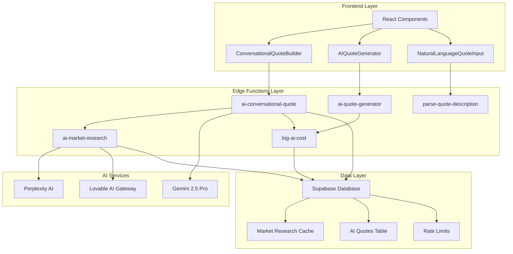
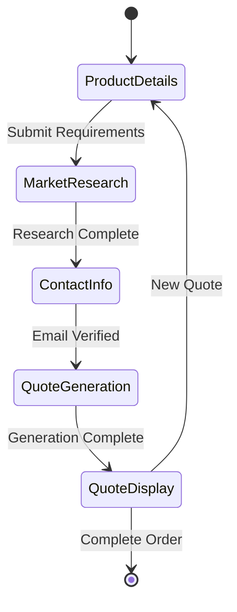
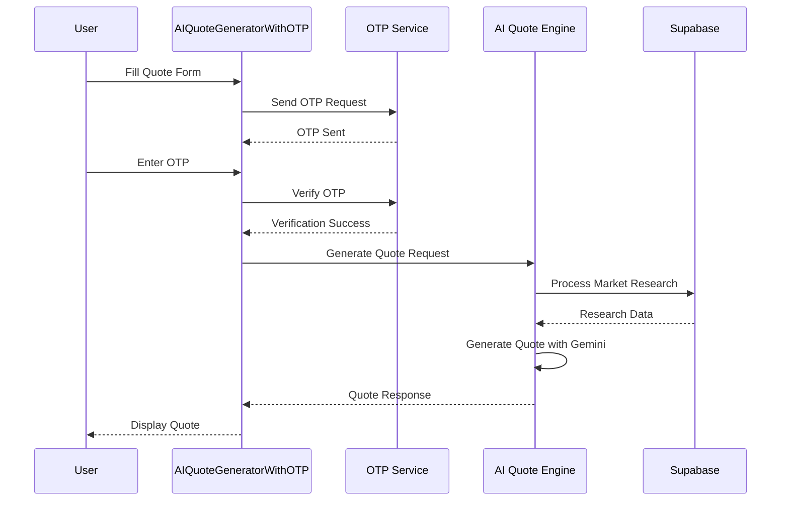
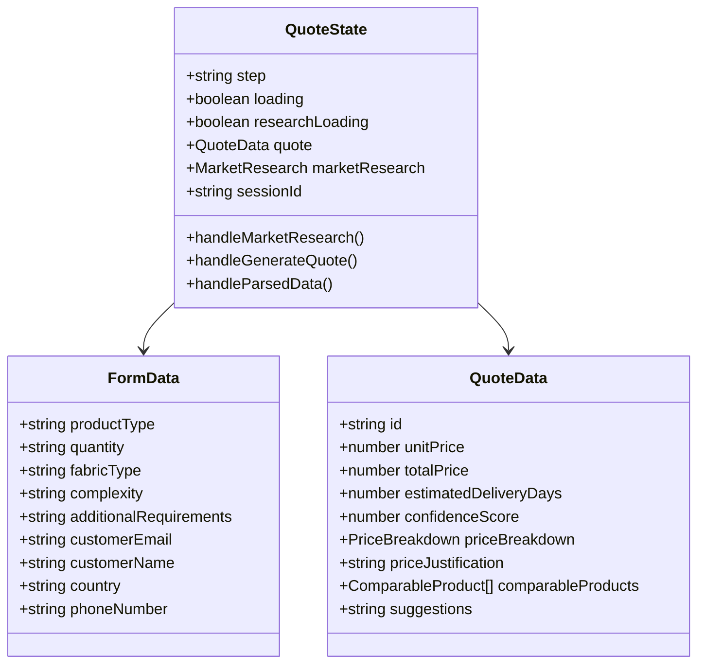
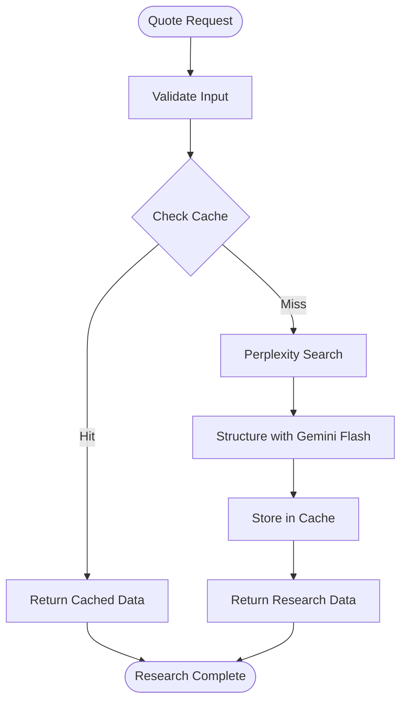
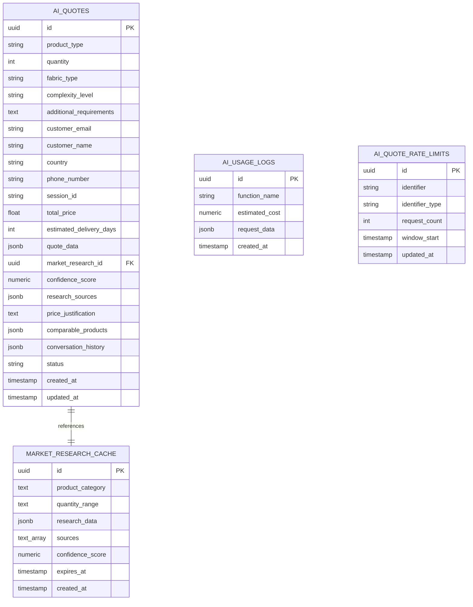
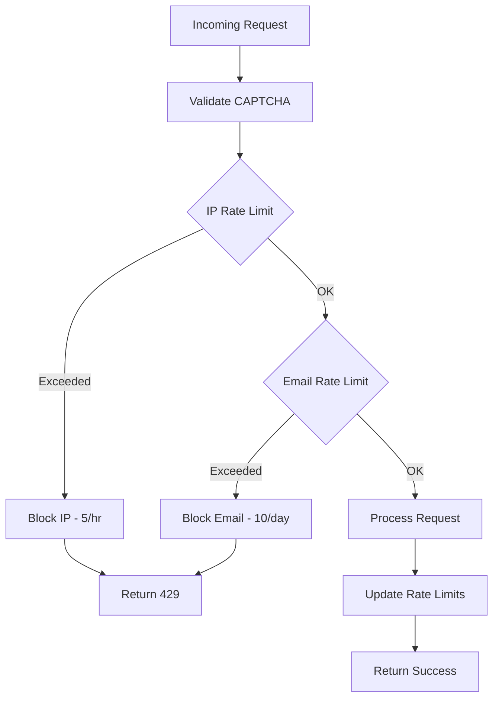
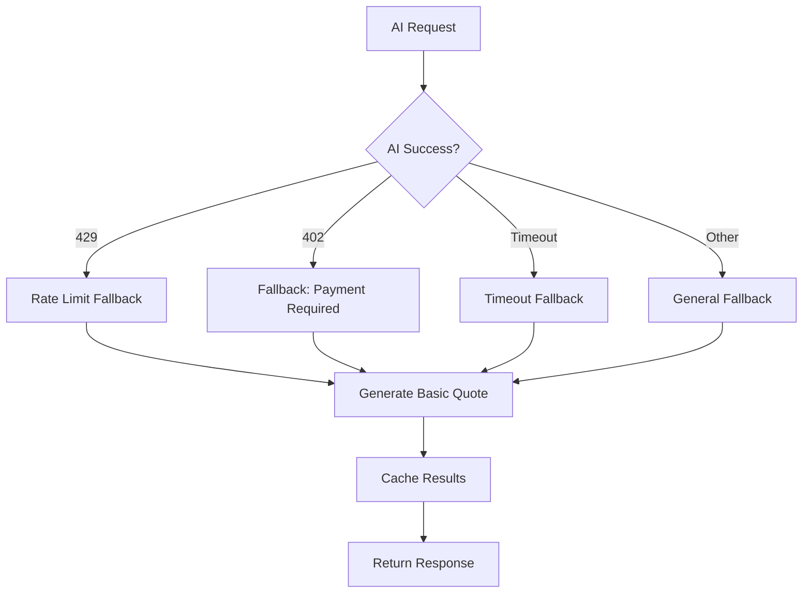
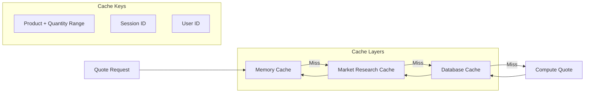

# AI Quote Generation System

<cite>
**Referenced Files in This Document**
- [ConversationalQuoteBuilder.tsx](file://src/components/quote/ConversationalQuoteBuilder.tsx)
- [AIQuoteGenerator.tsx](file://src/components/AIQuoteGenerator.tsx)
- [AIQuoteGeneratorWithOTP.tsx](file://src/components/AIQuoteGeneratorWithOTP.tsx)
- [NaturalLanguageQuoteInput.tsx](file://src/components/quote/NaturalLanguageQuoteInput.tsx)
- [InteractiveQuoteDisplay.tsx](file://src/components/quote/InteractiveQuoteDisplay.tsx)
- [QuoteLoadingStages.tsx](file://src/components/quote/QuoteLoadingStages.tsx)
- [ai-conversational-quote/index.ts](file://supabase/functions/ai-conversational-quote/index.ts)
- [ai-market-research/index.ts](file://supabase/functions/ai-market-research/index.ts)
- [ai-quote-generator/index.ts](file://supabase/functions/ai-quote-generator/index.ts)
- [log-ai-cost/index.ts](file://supabase/functions/log-ai-cost/index.ts)
- [aiQuote.ts](file://src/lib/api/aiQuote.ts)
- [parse-quote-description/index.ts](file://supabase/functions/parse-quote-description/index.ts)
</cite>

## Table of Contents
1. [Introduction](#introduction)
2. [System Architecture](#system-architecture)
3. [Core Components](#core-components)
4. [Frontend Integration](#frontend-integration)
5. [AI-Powered Processing Pipeline](#ai-powered-processing-pipeline)
6. [Data Model and Storage](#data-model-and-storage)
7. [Rate Limiting and Security](#rate-limiting-and-security)
8. [Error Handling and Fallback Mechanisms](#error-handling-and-fallback-mechanisms)
9. [Performance Optimization](#performance-optimization)
10. [Prompt Engineering Strategies](#prompt-engineering-strategies)
11. [Troubleshooting Guide](#troubleshooting-guide)
12. [Conclusion](#conclusion)

## Introduction

The AI Quote Generation system is a sophisticated, real-time pricing solution that enables buyers to receive instant, market-researched quotes for apparel manufacturing orders. Built on a serverless architecture using Supabase Edge Functions and powered by Lovable AI/Gemini, the system combines natural language processing, market research automation, and intelligent pricing algorithms to deliver accurate, competitive quotes within seconds.

The system serves as a bridge between buyers seeking apparel manufacturing solutions and the extensive network of Bangladeshi garment factories, providing instant pricing transparency while maintaining the flexibility to negotiate final terms based on specific requirements.

## System Architecture

The AI Quote Generation system follows a microservices architecture with clear separation between frontend presentation, backend processing, and AI-powered analysis:

**Diagram sources**
- [ConversationalQuoteBuilder.tsx](file://src/components/quote/ConversationalQuoteBuilder.tsx#L43-L363)
- [AIQuoteGenerator.tsx](file://src/components/AIQuoteGenerator.tsx#L66-L575)
- [ai-conversational-quote/index.ts](file://supabase/functions/ai-conversational-quote/index.ts#L26-L385)
- [ai-market-research/index.ts](file://supabase/functions/ai-market-research/index.ts#L20-L335)

## Core Components

### ConversationalQuoteBuilder

The primary frontend component that orchestrates the entire quote generation process through an intuitive, step-by-step workflow:

**Diagram sources**
- [ConversationalQuoteBuilder.tsx](file://src/components/quote/ConversationalQuoteBuilder.tsx#L43-L363)

The component manages state across three distinct phases:
- **Product Details Phase**: Collects initial requirements including product type, quantity, fabric, and complexity
- **Market Research Phase**: Performs real-time market analysis and displays comparative pricing
- **Quote Generation Phase**: Processes the final quote with confidence scoring and detailed breakdown

**Section sources**
- [ConversationalQuoteBuilder.tsx](file://src/components/quote/ConversationalQuoteBuilder.tsx#L43-L363)

### AIQuoteGeneratorWithOTP

A comprehensive quote generation system featuring OTP verification for enhanced security and reliability:

**Diagram sources**
- [AIQuoteGeneratorWithOTP.tsx](file://src/components/AIQuoteGeneratorWithOTP.tsx#L175-L331)

**Section sources**
- [AIQuoteGeneratorWithOTP.tsx](file://src/components/AIQuoteGeneratorWithOTP.tsx#L57-L800)

### NaturalLanguageQuoteInput

Enables users to describe their requirements in plain English, which is automatically parsed into structured quote parameters:

**Section sources**
- [NaturalLanguageQuoteInput.tsx](file://src/components/quote/NaturalLanguageQuoteInput.tsx#L22-L131)

## Frontend Integration

### State Management Architecture

The system employs a sophisticated state management approach combining React hooks with Supabase integration:

**Diagram sources**
- [ConversationalQuoteBuilder.tsx](file://src/components/quote/ConversationalQuoteBuilder.tsx#L12-L63)

### OTP Verification Flow

The OTP verification system ensures secure quote generation with multiple fallback mechanisms:

**Section sources**
- [AIQuoteGeneratorWithOTP.tsx](file://src/components/AIQuoteGeneratorWithOTP.tsx#L192-L268)

### Real-Time Response Parsing

The system processes AI-generated responses with robust error handling and data validation:

**Section sources**
- [NaturalLanguageQuoteInput.tsx](file://src/components/quote/NaturalLanguageQuoteInput.tsx#L27-L74)

## AI-Powered Processing Pipeline

### Market Research Engine

The market research component performs comprehensive analysis using multiple AI services:

**Diagram sources**
- [ai-market-research/index.ts](file://supabase/functions/ai-market-research/index.ts#L112-L335)

**Section sources**
- [ai-market-research/index.ts](file://supabase/functions/ai-market-research/index.ts#L112-L335)

### Quote Generation Pipeline

The core quote generation process utilizes Gemini 2.5 Pro for sophisticated pricing analysis:

**Section sources**
- [ai-conversational-quote/index.ts](file://supabase/functions/ai-conversational-quote/index.ts#L196-L385)

### Response Processing and Validation

The system implements multiple layers of validation for AI-generated content:

**Section sources**
- [parse-quote-description/index.ts](file://supabase/functions/parse-quote-description/index.ts#L89-L126)

## Data Model and Storage

### Quote Data Structure

The system maintains a comprehensive data model for storing and retrieving quote information:

**Diagram sources**
- [ai-conversational-quote/index.ts](file://supabase/functions/ai-conversational-quote/index.ts#L288-L313)
- [ai-market-research/index.ts](file://supabase/functions/ai-market-research/index.ts#L277-L288)

### Cost Tracking System

The log-ai-cost function provides comprehensive tracking of AI service usage:

**Section sources**
- [log-ai-cost/index.ts](file://supabase/functions/log-ai-cost/index.ts#L17-L96)

## Rate Limiting and Security

### Multi-Level Rate Limiting

The system implements tiered rate limiting to prevent abuse while maintaining accessibility:

**Diagram sources**
- [ai-conversational-quote/index.ts](file://supabase/functions/ai-conversational-quote/index.ts#L85-L146)

### Security Measures

The system incorporates multiple security layers:

**Section sources**
- [ai-conversational-quote/index.ts](file://supabase/functions/ai-conversational-quote/index.ts#L42-L83)
- [ai-market-research/index.ts](file://supabase/functions/ai-market-research/index.ts#L70-L110)

## Error Handling and Fallback Mechanisms

### Comprehensive Error Recovery

The system implements multiple fallback strategies for different failure scenarios:

**Diagram sources**
- [ai-quote-generator/index.ts](file://supabase/functions/ai-quote-generator/index.ts#L620-L640)

### Retry Logic Implementation

The frontend API implements sophisticated retry mechanisms with exponential backoff:

**Section sources**
- [aiQuote.ts](file://src/lib/api/aiQuote.ts#L49-L146)

### Graceful Degradation

When AI services are unavailable, the system falls back to pre-calculated pricing models:

**Section sources**
- [ai-market-research/index.ts](file://supabase/functions/ai-market-research/index.ts#L259-L268)

## Performance Optimization

### Caching Strategy

The system employs multi-tier caching to optimize performance:

**Diagram sources**
- [ai-market-research/index.ts](file://supabase/functions/ai-market-research/index.ts#L120-L142)

### Loading State Management

The system provides comprehensive loading indicators to enhance user experience:

**Section sources**
- [QuoteLoadingStages.tsx](file://src/components/quote/QuoteLoadingStages.tsx#L50-L139)

### Performance Monitoring

Real-time monitoring tracks system performance and identifies optimization opportunities:

**Section sources**
- [log-ai-cost/index.ts](file://supabase/functions/log-ai-cost/index.ts#L60-L83)

## Prompt Engineering Strategies

### Market Research Prompts

The system uses carefully crafted prompts to elicit accurate market research data:

**Section sources**
- [ai-market-research/index.ts](file://supabase/functions/ai-market-research/index.ts#L152-L165)

### Quote Generation Prompts

Sophisticated prompts guide Gemini 2.5 Pro in generating comprehensive quotes:

**Section sources**
- [ai-conversational-quote/index.ts](file://supabase/functions/ai-conversational-quote/index.ts#L202-L248)

### Natural Language Processing

The parse-quote-description function uses specialized prompts for requirement extraction:

**Section sources**
- [parse-quote-description/index.ts](file://supabase/functions/parse-quote-description/index.ts#L89-L126)

## Troubleshooting Guide

### Common Issues and Solutions

| Issue | Symptoms | Solution |
|-------|----------|----------|
| AI Timeout | Quote generation hangs for >30 seconds | Check AI service availability and retry with simplified requirements |
| Rate Limit Exceeded | HTTP 429 errors | Wait for rate limit reset or use different email/IP |
| CAPTCHA Failure | Verification fails repeatedly | Ensure reCAPTCHA is enabled and check browser settings |
| Market Research Cache Miss | Slow initial research | Allow time for cache population or manually trigger research |
| Invalid JSON Response | Parsing errors from AI | Verify input format and retry with clearer requirements |

### Debugging Tools

The system provides comprehensive logging and monitoring capabilities:

**Section sources**
- [ai-conversational-quote/index.ts](file://supabase/functions/ai-conversational-quote/index.ts#L371-L385)
- [ai-market-research/index.ts](file://supabase/functions/ai-market-research/index.ts#L321-L335)

### Performance Diagnostics

Monitor system performance through built-in analytics:

**Section sources**
- [log-ai-cost/index.ts](file://supabase/functions/log-ai-cost/index.ts#L60-L83)

## Conclusion

The AI Quote Generation system represents a sophisticated approach to automated pricing that combines cutting-edge AI technology with robust engineering practices. Through its multi-layered architecture, comprehensive error handling, and intelligent caching strategies, the system delivers reliable, accurate quotes while maintaining excellent user experience.

Key strengths of the system include:

- **Real-time Processing**: Instant quote generation within seconds
- **Market Intelligence**: Comprehensive market research with confidence scoring
- **Security First**: Multi-factor authentication with rate limiting
- **Resilience**: Robust fallback mechanisms and error recovery
- **Scalability**: Serverless architecture with efficient caching
- **Transparency**: Detailed pricing breakdowns with justification

The system continues to evolve with ongoing improvements in AI prompting, caching strategies, and user experience enhancements, positioning it as a leading solution for AI-powered quote generation in the apparel manufacturing industry.