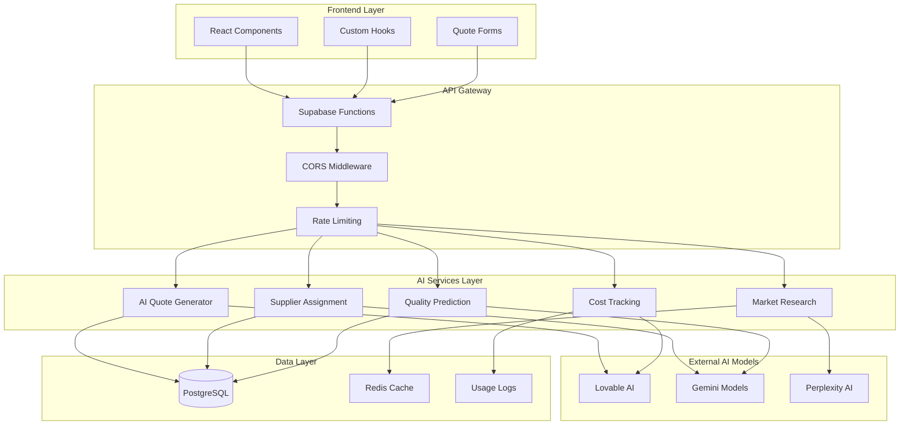
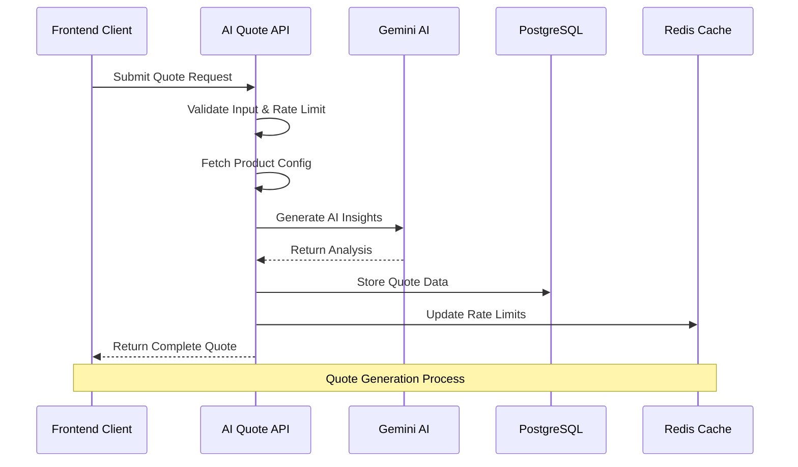
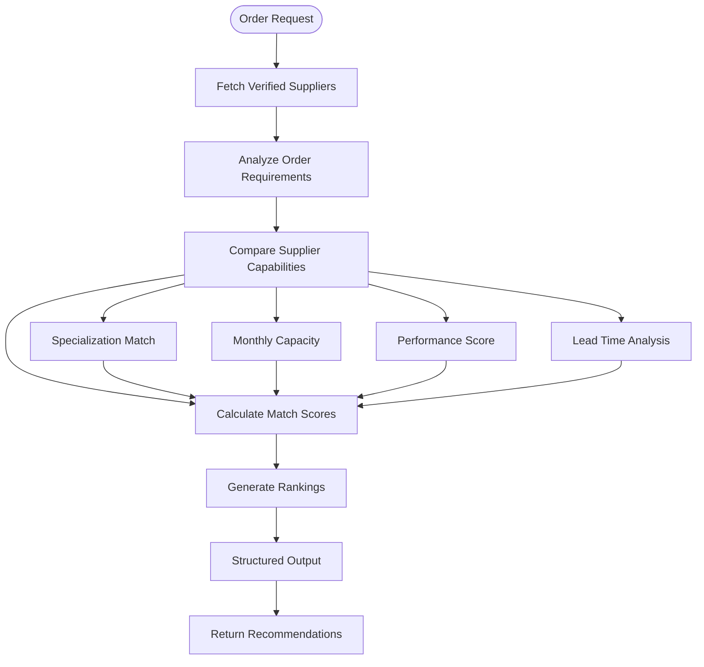
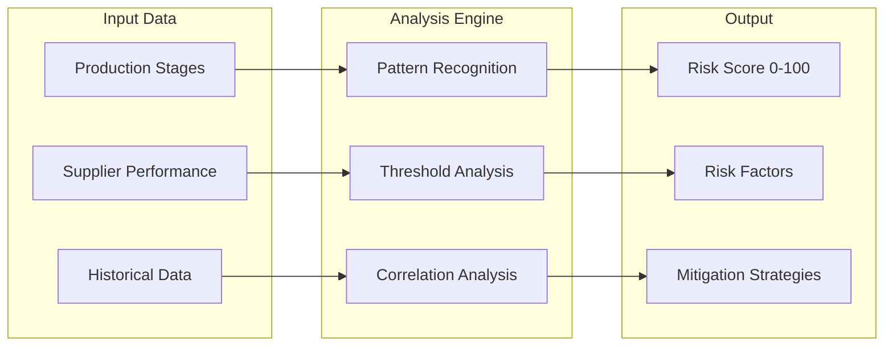
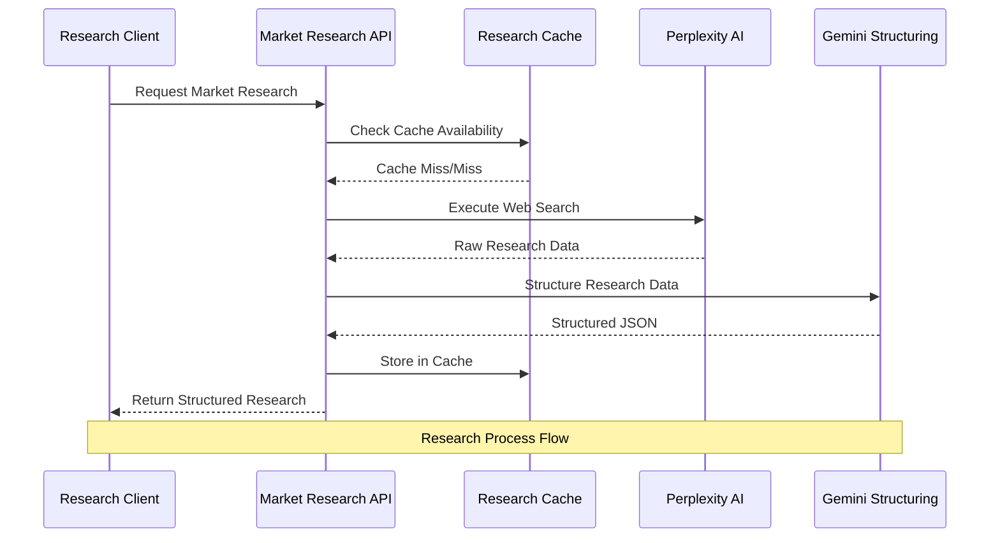
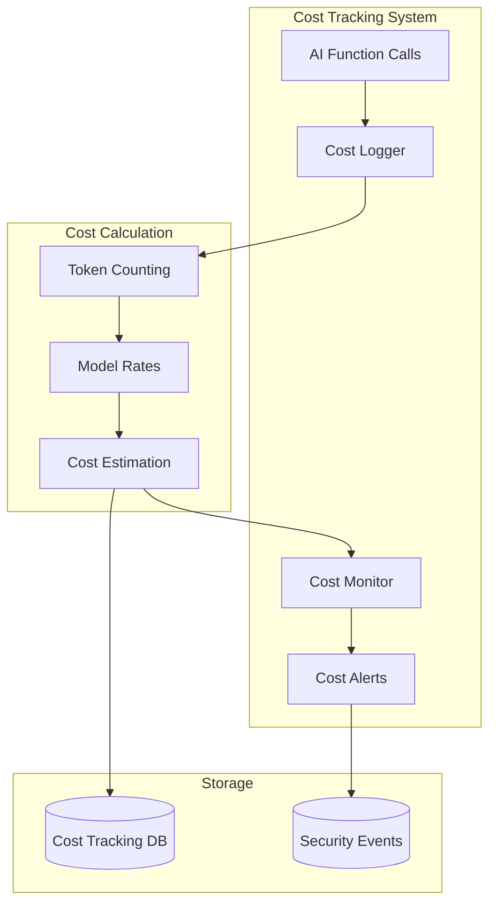
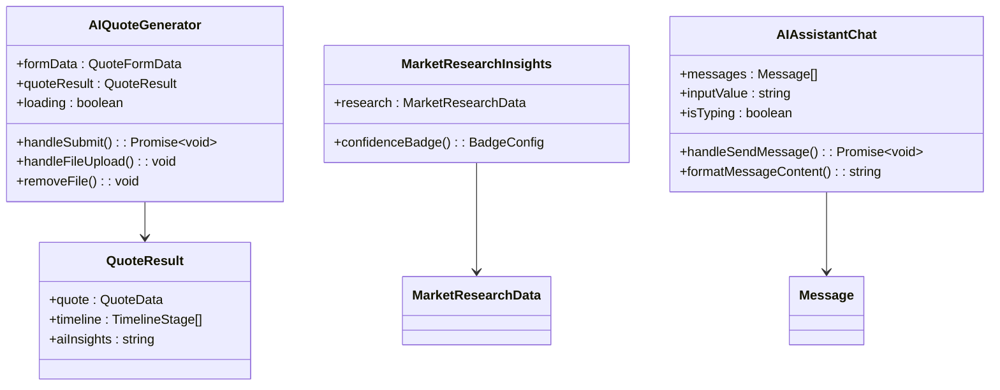
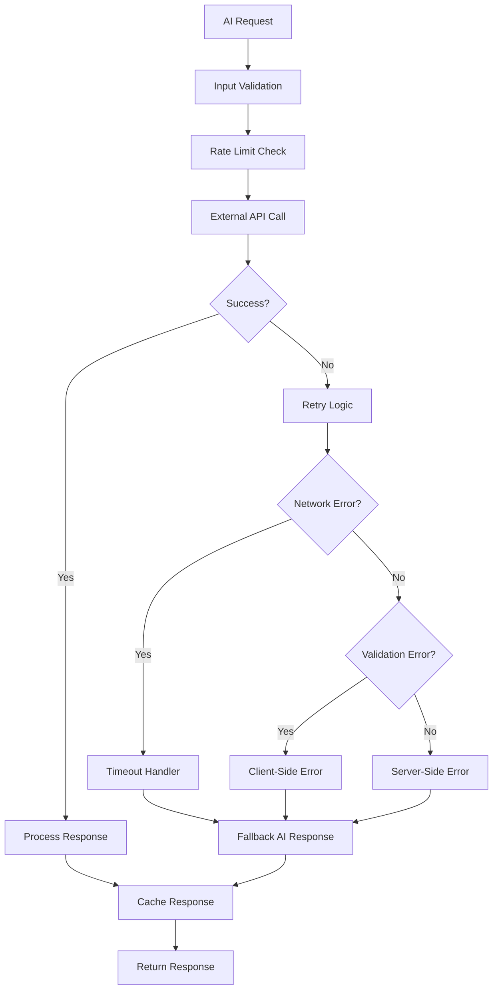
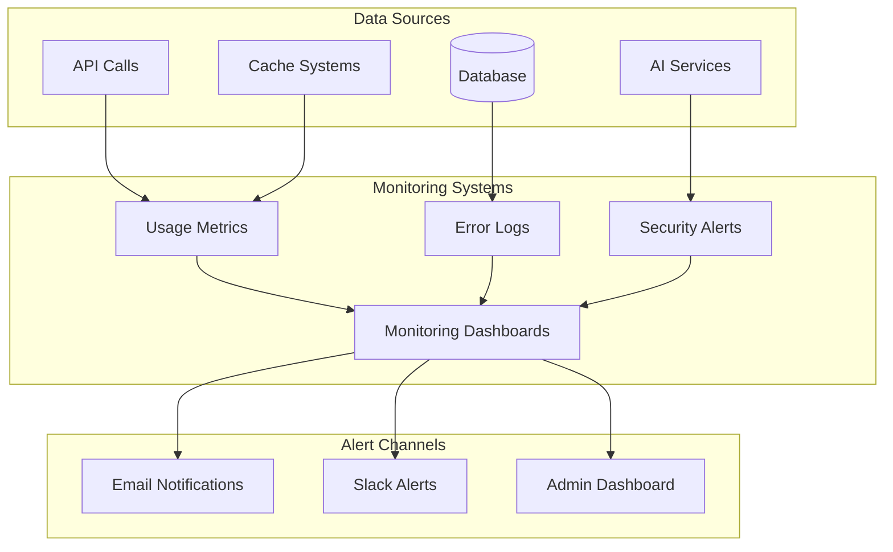

# AI Services

<cite>
**Referenced Files in This Document**
- [aiQuote.ts](file://src/lib/api/aiQuote.ts)
- [AIQuoteGenerator.tsx](file://src/components/AIQuoteGenerator.tsx)
- [ai-quote-generator/index.ts](file://supabase/functions/ai-quote-generator/index.ts)
- [ai-supplier-assignment/index.ts](file://supabase/functions/ai-supplier-assignment/index.ts)
- [predict-quality-risks/index.ts](file://supabase/functions/predict-quality-risks/index.ts)
- [ai-market-research/index.ts](file://supabase/functions/ai-market-research/index.ts)
- [log-ai-cost/index.ts](file://supabase/functions/log-ai-cost/index.ts)
- [useQualityPrediction.ts](file://src/hooks/useQualityPrediction.ts)
- [MarketResearchInsights.tsx](file://src/components/quote/MarketResearchInsights.tsx)
- [AIAssistantChat.tsx](file://src/components/AIAssistantChat.tsx)
- [RateLimitMonitoringDashboard.tsx](file://src/components/admin/RateLimitMonitoringDashboard.tsx)
- [20251124164837_4eda3cf0-ab6f-4305-a5fe-82a19c7948d3.sql](file://supabase/migrations/20251124164837_4eda3cf0-ab6f-4305-a5fe-82a19c7948d3.sql)
</cite>

## Table of Contents
1. [Introduction](#introduction)
2. [Architecture Overview](#architecture-overview)
3. [Core AI Services](#core-ai-services)
4. [AI Quote Generator](#ai-quote-generator)
5. [Supplier Assignment System](#supplier-assignment-system)
6. [Quality Risk Prediction](#quality-risk-prediction)
7. [Market Research Engine](#market-research-engine)
8. [Cost Tracking and Rate Limiting](#cost-tracking-and-rate-limiting)
9. [Frontend Integration Patterns](#frontend-integration-patterns)
10. [Error Handling and Fallback Mechanisms](#error-handling-and-fallback-mechanisms)
11. [Security and Monitoring](#security-and-monitoring)
12. [Performance Optimization](#performance-optimization)
13. [Troubleshooting Guide](#troubleshooting-guide)

## Introduction

The SleekApparels AI Services platform represents a comprehensive intelligent decision-making system that leverages advanced AI models to power critical business functions. Built on a robust architecture utilizing Lovable AI and Gemini models, the system provides automated quote generation, intelligent supplier assignment, predictive quality risk assessment, and real-time market research capabilities.

This platform serves as the cognitive backbone of the apparel manufacturing ecosystem, enabling data-driven decisions while maintaining high reliability and performance standards. The AI services integrate seamlessly with the frontend components through well-defined APIs and provide sophisticated error handling, rate limiting, and cost tracking mechanisms.

## Architecture Overview

The AI Services architecture follows a serverless function-based approach with Supabase as the backend infrastructure. The system employs a multi-layered design that separates concerns between data processing, AI model interactions, and frontend integration.



**Diagram sources**
- [ai-quote-generator/index.ts](file://supabase/functions/ai-quote-generator/index.ts#L1-L50)
- [ai-supplier-assignment/index.ts](file://supabase/functions/ai-supplier-assignment/index.ts#L1-L30)
- [predict-quality-risks/index.ts](file://supabase/functions/predict-quality-risks/index.ts#L1-L30)

**Section sources**
- [ai-quote-generator/index.ts](file://supabase/functions/ai-quote-generator/index.ts#L1-L100)
- [ai-supplier-assignment/index.ts](file://supabase/functions/ai-supplier-assignment/index.ts#L1-L50)

## Core AI Services

The platform implements four primary AI services, each designed to address specific business needs through specialized algorithms and model configurations.

### Service Categories

| Service | Purpose | Model | Output Format |
|---------|---------|-------|---------------|
| AI Quote Generator | Automated pricing and timeline generation | Gemini Flash/Pro | Structured JSON with AI insights |
| Supplier Assignment | Intelligent supplier matching | Gemini Flash | Ranked supplier recommendations |
| Quality Risk Prediction | Predictive quality assessment | Gemini Flash | Risk scores and mitigation strategies |
| Market Research | Real-time industry analysis | Perplexity + Gemini | Structured market data |

### AI Model Selection Strategy

The system employs a strategic model selection approach based on task complexity and performance requirements:

- **Gemini Flash**: Fast inference for routine tasks, cost-effective processing
- **Gemini Pro**: Advanced reasoning for complex analyses requiring deeper understanding
- **Perplexity AI**: Web-based research and market intelligence
- **Lovable AI**: Specialized business domain expertise

**Section sources**
- [ai-quote-generator/index.ts](file://supabase/functions/ai-quote-generator/index.ts#L590-L600)
- [ai-supplier-assignment/index.ts](file://supabase/functions/ai-supplier-assignment/index.ts#L59-L70)

## AI Quote Generator

The AI Quote Generator represents the flagship service, combining natural language processing with manufacturing domain expertise to deliver instant, accurate quotes with AI-powered insights.

### Architecture and Workflow



**Diagram sources**
- [ai-quote-generator/index.ts](file://supabase/functions/ai-quote-generator/index.ts#L250-L350)
- [AIQuoteGenerator.tsx](file://src/components/AIQuoteGenerator.tsx#L120-L200)

### Natural Language Processing Capabilities

The quote generator employs sophisticated NLP techniques to extract requirements from user input:

#### Input Processing Pipeline

1. **Requirement Extraction**: Natural language parsing to identify product specifications
2. **Context Normalization**: Standardization of product categories and terminology
3. **Complexity Assessment**: Automatic evaluation of manufacturing complexity
4. **Customization Detection**: Identification of special requirements (embroidery, printing, etc.)

#### Prompt Engineering Strategies

The system utilizes carefully crafted prompts optimized for manufacturing domain expertise:

```typescript
// Example prompt structure for complex analysis
const complexPrompt = `
You are an expert garment manufacturing consultant from Bangladesh with deep knowledge of 2025 industry standards.

CUSTOMER REQUEST:
- Product Type: ${sanitizedProduct}
- Quantity: ${requestData.quantity} pieces
- Complexity Level: ${complexity}
- Fabric Type: ${sanitizedFabric}
- Additional Requirements: ${sanitizedRequirements}

CALCULATED ESTIMATE:
- Total Cost: $${totalPrice.toFixed(2)} (${(totalPrice / requestData.quantity).toFixed(2)} per unit)
- Production Timeline: ${totalDays} days

BANGLADESH MANUFACTURING CONTEXT (2025):
- MOQ Standards: 50-100 units minimum, higher volumes get better pricing
- Base Costs: T-shirts $3-6, Polos $4-7, Hoodies $8-15, Uniforms $5-10
- Customization Costs: Embroidery +$1-3, Screen Print +$0.5-2, DTG +$2-4
- Volume Discounts: 101-500 units (-10%), 501-1000 (-20%), 1001+ (-25%)

PROVIDE A PROFESSIONAL ASSESSMENT:
1. Cost Optimization (2-3 sentences): Analyze if the quantity hits optimal pricing tiers. Suggest specific adjustments.
2. Alternative Options (1 option with specifics): Provide ONE concrete alternative that could save money or time.
3. Risk Factors (2-3 key points): Identify specific risks for this order.
4. Value-Add Suggestions (1-2 points): Recommend extras that improve ROI.

Keep response professional, specific to Bangladesh manufacturing, and actionable. Use exact numbers and percentages.
`;
```

### Structured Output Generation

The system generates comprehensive quote responses with multiple data layers:

#### Quote Data Structure
```typescript
interface QuoteResponse {
  success: boolean;
  quote: {
    id: string;
    total_price: number;
    estimated_delivery_days: number;
    quote_data: {
      breakdown: {
        baseUnitPrice: number;
        complexityFactor: number;
        volumeDiscount: number;
        finalUnitPrice: number;
        totalPrice: number;
      };
      timeline: {
        samplingDays: number;
        productionDays: number;
        bufferDays: number;
        totalDays: number;
        estimatedDeliveryDate: string;
      };
      moqRange: {
        min: number;
        max: number;
        requested: number;
      };
    };
    ai_suggestions: string;
  };
  timeline: Array<{
    stage: string;
    days: number;
    startDate: string;
    endDate: string;
  }>;
  aiInsights: string;
}
```

**Section sources**
- [ai-quote-generator/index.ts](file://supabase/functions/ai-quote-generator/index.ts#L580-L650)
- [AIQuoteGenerator.tsx](file://src/components/AIQuoteGenerator.tsx#L28-L65)

## Supplier Assignment System

The intelligent supplier assignment system leverages capability matching algorithms to identify optimal manufacturing partners based on comprehensive criteria analysis.

### Capability Matching Algorithm



**Diagram sources**
- [ai-supplier-assignment/index.ts](file://supabase/functions/ai-supplier-assignment/index.ts#L20-L80)

### Supplier Evaluation Criteria

The system evaluates suppliers across multiple dimensions:

#### Technical Capabilities
- **Specialization Alignment**: Matching product type expertise
- **Monthly Capacity**: Available production capacity
- **Equipment Sophistication**: Technology level and capabilities

#### Operational Excellence
- **Performance Score**: Historical performance metrics (0-100 scale)
- **On-time Delivery Rate**: Consistency in meeting deadlines
- **Quality Control Processes**: QC standards and procedures

#### Business Reliability
- **Total Orders Completed**: Experience and volume
- **Lead Time Consistency**: Predictability in delivery schedules
- **Certifications**: ISO, WRAP, GOTS compliance

### Tool-Based Output Generation

The supplier assignment system utilizes structured tool calls for precise output formatting:

```typescript
const toolDefinition = {
  type: "function",
  function: {
    name: "recommend_suppliers",
    description: "Recommend top suppliers for an order",
    parameters: {
      type: "object",
      properties: {
        recommendations: {
          type: "array",
          items: {
            type: "object",
            properties: {
              supplier_id: { type: "string" },
              rank: { type: "number" },
              confidence_score: { type: "number", description: "0-100" },
              reasoning: { type: "string" }
            },
            required: ["supplier_id", "rank", "confidence_score", "reasoning"]
          }
        }
      },
      required: ["recommendations"]
    }
  }
};
```

**Section sources**
- [ai-supplier-assignment/index.ts](file://supabase/functions/ai-supplier-assignment/index.ts#L59-L120)

## Quality Risk Prediction

The quality risk prediction system implements machine learning-based assessment to proactively identify potential quality issues in production processes.

### Risk Assessment Framework



**Diagram sources**
- [predict-quality-risks/index.ts](file://supabase/functions/predict-quality-risks/index.ts#L20-L80)

### Risk Factor Analysis

The system identifies and quantifies various risk factors:

#### Production Stage Risks
- **Completion Percentage**: Current stage completion rates
- **Timeline Adherence**: Schedule deviation analysis
- **Quality Control Status**: QC checkpoint compliance

#### Supplier Performance Risks
- **Historical Defect Rates**: Past quality performance
- **Lead Time Variability**: Consistency in delivery
- **Resource Availability**: Capacity and staffing stability

#### Environmental Risks
- **Material Quality**: Raw material consistency
- **Process Stability**: Manufacturing consistency
- **External Dependencies**: Supply chain vulnerabilities

### Predictive Modeling Implementation

The quality prediction system employs a structured approach to risk assessment:

```typescript
const riskAssessmentPrompt = `
Production Analysis:

Stages Progress:
${stages?.map(s => `- ${s.stage_name}: ${s.completion_percentage}% (Status: ${s.status})${s.target_date ? `, Target: ${s.target_date}` : ''}`).join('\n')}

Supplier Performance:
- Performance Score: ${supplierOrder.suppliers?.performance_score || 'N/A'}/100
- On-time Delivery Rate: ${supplierOrder.suppliers?.on_time_delivery_rate || 'N/A'}%
- Total Orders Completed: ${supplierOrder.suppliers?.total_orders_completed || 0}

Analyze for quality risks and provide:
1. Overall risk score (0-100, where 100 is highest risk)
2. Specific risk factors identified
3. Recommendations to mitigate risks
`;
```

**Section sources**
- [predict-quality-risks/index.ts](file://supabase/functions/predict-quality-risks/index.ts#L45-L120)
- [useQualityPrediction.ts](file://src/hooks/useQualityPrediction.ts#L12-L56)

## Market Research Engine

The market research engine provides real-time industry intelligence through web-based research and structured data extraction, enabling informed pricing and strategic decision-making.

### Research Pipeline Architecture



**Diagram sources**
- [ai-market-research/index.ts](file://supabase/functions/ai-market-research/index.ts#L120-L200)

### Data Collection and Processing

The market research system employs a multi-stage approach to gather and structure industry intelligence:

#### Web Research Integration
- **Perplexity AI**: Advanced web search with context-aware queries
- **Source Verification**: Multiple credible source validation
- **Real-time Updates**: Current year (2025) focused data collection

#### Structured Data Extraction
- **JSON Schema Validation**: Consistent data format
- **Confidence Scoring**: Research reliability assessment (0-100 scale)
- **Source Attribution**: Transparent source tracking

### Research Data Structure

```typescript
interface MarketResearchData {
  averageUnitCost: number;
  materialCostPerUnit: number;
  leadTimeDays: number;
  markupPercentage: number;
  comparableProducts: Array<{
    name: string;
    price: number;
    source: string;
  }>;
  sources: string[];
  confidenceScore: number;
}
```

### Caching Strategy

The system implements intelligent caching to optimize performance and reduce API costs:

#### Cache Configuration
- **TTL**: 24-hour expiration
- **Granular Keys**: Product category + quantity range combinations
- **Fallback Mechanism**: Graceful degradation when cache unavailable

#### Cache Key Strategy
```typescript
const quantityRanges = {
  '0-100': 'small_orders',
  '101-500': 'medium_orders', 
  '501-1000': 'large_orders',
  '1000+': 'enterprise_orders'
};
```

**Section sources**
- [ai-market-research/index.ts](file://supabase/functions/ai-market-research/index.ts#L120-L335)
- [MarketResearchInsights.tsx](file://src/components/quote/MarketResearchInsights.tsx#L1-L140)

## Cost Tracking and Rate Limiting

The platform implements comprehensive cost tracking and rate limiting mechanisms to ensure sustainable AI usage and protect against abuse.

### Cost Tracking Architecture



**Diagram sources**
- [log-ai-cost/index.ts](file://supabase/functions/log-ai-cost/index.ts#L20-L60)

### Token-Based Cost Calculation

The system tracks costs at the token level with model-specific pricing:

#### Cost Per Million Tokens
| Model | Input Cost | Output Cost | Use Case |
|-------|------------|-------------|----------|
| Gemini Flash | $0.075 | $0.30 | Routine tasks |
| Gemini Pro | $1.25 | $5.00 | Complex analysis |
| Sonar Small | $0.20 | $0.20 | Research queries |
| Sonar Large | $1.00 | $1.00 | Comprehensive analysis |

### Rate Limiting Strategy

The platform implements tiered rate limiting based on user authentication status:

#### Authentication Levels
- **Anonymous Users**: 3 quotes per session, 15 per IP daily
- **Authenticated Users**: 20 quotes per day
- **Administrative Access**: Unlimited (with monitoring)

#### Rate Limiting Implementation
```typescript
async function checkAndUpdateRateLimit(
  identifier: string,
  identifierType: 'session' | 'user' | 'ip',
  dailyLimit: number
): Promise<{ allowed: boolean; remaining: number }> {
  // Check existing rate limit record
  const { data: existing } = await supabaseClient
    .from('ai_quote_rate_limits')
    .select('*')
    .eq('identifier', identifier)
    .eq('identifier_type', identifierType)
    .gte('window_start', windowStart.toISOString())
    .single();

  if (!existing) {
    // Create new rate limit record
    await supabaseClient.from('ai_quote_rate_limits').insert({
      identifier,
      identifier_type: identifierType,
      request_count: 1,
      window_start: windowStart.toISOString()
    });
    return { allowed: true, remaining: dailyLimit - 1 };
  }

  // Check if limit exceeded
  if (existing.request_count >= dailyLimit) {
    return { allowed: false, remaining: 0 };
  }

  // Increment count
  await supabaseClient.from('ai_quote_rate_limits').update({ 
    request_count: existing.request_count + 1,
    updated_at: now.toISOString()
  }).eq('id', existing.id);

  return { 
    allowed: true, 
    remaining: dailyLimit - existing.request_count - 1 
  };
}
```

**Section sources**
- [log-ai-cost/index.ts](file://supabase/functions/log-ai-cost/index.ts#L1-L96)
- [ai-quote-generator/index.ts](file://supabase/functions/ai-quote-generator/index.ts#L39-L94)

## Frontend Integration Patterns

The frontend components demonstrate sophisticated integration patterns that handle AI responses, manage state, and provide seamless user experiences.

### Component Architecture



**Diagram sources**
- [AIQuoteGenerator.tsx](file://src/components/AIQuoteGenerator.tsx#L28-L65)
- [MarketResearchInsights.tsx](file://src/components/quote/MarketResearchInsights.tsx#L6-L18)
- [AIAssistantChat.tsx](file://src/components/AIAssistantChat.tsx#L9-L15)

### State Management Patterns

The frontend implements reactive state management for AI interactions:

#### Quote Generation State Flow
1. **Form Submission**: User input validation and preparation
2. **Loading States**: Progressive loading indicators
3. **AI Processing**: Background AI analysis execution
4. **Result Presentation**: Structured display of AI insights
5. **Error Handling**: Graceful error recovery and user feedback

#### File Upload Integration
The system supports multiple file types for enhanced AI analysis:
- **Image Files**: PNG, JPEG, GIF for visual reference analysis
- **PDF Documents**: Tech packs and design specifications
- **Size Limits**: 20MB maximum per file, 3 files per request
- **Preview Generation**: Real-time thumbnail previews

### Response Parsing and Display

The frontend implements sophisticated response parsing for AI-generated content:

#### Markdown Processing
```typescript
const formatMessageContent = (content: string) => {
  // Simple markdown-like formatting
  const formatted = content
    .split('\n')
    .map((line, i) => {
      // Bold text
      line = line.replace(/\*\*(.*?)\*\*/g, '<strong>$1</strong>');
      
      // Bullet points
      if (line.trim().startsWith('•') || line.trim().startsWith('-')) {
        return `<li key=${i} class="ml-4">${line.substring(1)}</li>`;
      }
      
      // Headers (lines starting with ##)
      if (line.trim().startsWith('##')) {
        return `<h3 key=${i} class="font-semibold mt-2 mb-1">${line.replace('##', '').trim()}</h3>`;
      }
      
      return line ? `<p key=${i} class="mb-2">${line}</p>` : '<br />';
    })
    .join('');

  // Sanitize HTML to prevent XSS attacks
  return DOMPurify.sanitize(formatted, {
    ALLOWED_TAGS: ['p', 'br', 'strong', 'em', 'li', 'h3', 'span'],
    ALLOWED_ATTR: ['class', 'key']
  });
};
```

**Section sources**
- [AIQuoteGenerator.tsx](file://src/components/AIQuoteGenerator.tsx#L120-L235)
- [AIAssistantChat.tsx](file://src/components/AIAssistantChat.tsx#L158-L185)

## Error Handling and Fallback Mechanisms

The platform implements comprehensive error handling and fallback strategies to ensure reliable operation under various failure conditions.

### Multi-Level Error Handling



**Diagram sources**
- [ai-quote-generator/index.ts](file://supabase/functions/ai-quote-generator/index.ts#L748-L800)

### Retry Logic Implementation

The system implements sophisticated retry mechanisms with exponential backoff:

#### Retry Configuration
- **Maximum Retries**: 2 attempts for most operations
- **Timeout Handling**: 30-second client timeout, 25-second AI timeout
- **Backoff Strategy**: Exponential delay with jitter
- **Error Classification**: Retryable vs. non-retryable errors

#### Error Classification Matrix
| Error Type | Retryable | Delay Strategy | Max Attempts |
|------------|-----------|----------------|--------------|
| Network Timeout | Yes | 2^n * 1000ms | 3 |
| Rate Limit | Yes | 5-30 seconds | 1 |
| Validation Error | No | Immediate | 0 |
| AI API Error | Yes | 3-5 seconds | 2 |
| Database Error | Yes | 5 seconds | 2 |

### Fallback Mechanisms

#### AI Service Degradation
When external AI services become unavailable, the system provides graceful fallbacks:

```typescript
// AI API fallback implementation
const aiFallbackResponses = {
  timeout: 'AI analysis timed out. Your quote is based on verified manufacturing data and industry standards.',
  rate_limited: 'AI analysis temporarily unavailable due to high demand. Quote pricing is still accurate based on our manufacturing data.',
  payment_required: 'AI analysis temporarily unavailable. Quote pricing is based on our verified manufacturing data.',
  unavailable: 'AI analysis temporarily unavailable. Using standard manufacturing recommendations based on industry expertise.'
};
```

#### Database Fallback
The system maintains database resilience through:
- **Service Role Access**: Direct database access bypassing Row Level Security
- **Connection Pooling**: Efficient resource utilization
- **Transaction Rollback**: Atomic operations with rollback capabilities

**Section sources**
- [ai-quote-generator/index.ts](file://supabase/functions/ai-quote-generator/index.ts#L62-L140)
- [ai-quote-generator/index.ts](file://supabase/functions/ai-quote-generator/index.ts#L748-L800)

## Security and Monitoring

The platform implements comprehensive security measures and monitoring capabilities to ensure safe and reliable operation.

### Security Measures

#### Input Validation and Sanitization
- **Zod Schema Validation**: Comprehensive input validation
- **SQL Injection Prevention**: Parameterized queries only
- **XSS Protection**: HTML sanitization for user-generated content
- **File Upload Security**: MIME type checking and size limits

#### Authentication and Authorization
- **Session Management**: Secure session handling
- **Role-Based Access Control**: Different permissions for users and admins
- **IP Whitelisting**: Origin validation for API requests
- **Rate Limiting**: Protection against abuse and DDoS attacks

### Monitoring and Alerting



**Diagram sources**
- [RateLimitMonitoringDashboard.tsx](file://src/components/admin/RateLimitMonitoringDashboard.tsx#L1-L50)

#### Real-Time Monitoring
The system provides comprehensive monitoring through dedicated dashboards:

##### Rate Limit Monitoring
- **Request Volume Tracking**: Real-time request counting
- **Usage Pattern Analysis**: Identifying abuse patterns
- **Alert Thresholds**: Configurable warning levels
- **Historical Trends**: Long-term usage analysis

##### Cost Monitoring
- **Hourly Cost Tracking**: Real-time cost calculation
- **Budget Alerts**: Threshold-based notifications
- **Model Usage Analytics**: Which models are most expensive
- **ROI Analysis**: Cost-effectiveness metrics

**Section sources**
- [RateLimitMonitoringDashboard.tsx](file://src/components/admin/RateLimitMonitoringDashboard.tsx#L1-L204)
- [ai-quote-generator/index.ts](file://supabase/functions/ai-quote-generator/index.ts#L130-L200)

## Performance Optimization

The platform implements multiple optimization strategies to ensure fast response times and efficient resource utilization.

### Caching Strategies

#### Multi-Level Caching
1. **Application Cache**: In-memory caching for frequently accessed data
2. **Database Cache**: Query result caching with TTL
3. **CDN Cache**: Static asset optimization
4. **Browser Cache**: Client-side caching strategies

#### Cache Invalidation
- **Time-Based Expiration**: Automatic cache clearing
- **Event-Driven Updates**: Cache invalidation on data changes
- **Manual Refresh**: Administrative cache management
- **Fallback Mechanisms**: Graceful degradation when cache unavailable

### API Optimization

#### Request Optimization
- **Batch Processing**: Multiple operations in single requests
- **Compression**: Gzip compression for large responses
- **Pagination**: Efficient data retrieval for large datasets
- **Selective Fields**: Request only needed data fields

#### Connection Management
- **Connection Pooling**: Efficient database connections
- **Keep-Alive**: Persistent HTTP connections
- **Timeout Configuration**: Appropriate timeout values
- **Retry Logic**: Intelligent retry mechanisms

### Performance Metrics

| Metric | Target | Monitoring Method |
|--------|--------|-------------------|
| API Response Time | < 2 seconds | Load testing |
| AI Processing Time | < 30 seconds | Timing logs |
| Cache Hit Rate | > 80% | Cache analytics |
| Error Rate | < 1% | Error tracking |
| Throughput | 1000+ requests/hour | Performance monitoring |

## Troubleshooting Guide

This section provides comprehensive troubleshooting guidance for common issues encountered with the AI Services platform.

### Common Issues and Solutions

#### Quote Generation Failures

**Issue**: AI quote generation timeouts
**Symptoms**: Request hangs for >30 seconds
**Solution**: 
1. Simplify requirements (reduce complexity level)
2. Reduce file sizes (< 20MB each)
3. Check internet connectivity
4. Verify AI service availability

**Issue**: Validation errors during quote submission
**Symptoms**: "Invalid input data" errors
**Solution**:
1. Verify required fields are completed
2. Check quantity is between 50-100,000
3. Ensure email format is valid
4. Review additional requirements length

#### AI Service Unavailability

**Issue**: AI API errors (429, 402, 500)
**Symptoms**: "AI analysis temporarily unavailable"
**Solution**:
1. Wait for rate limit reset (typically 24 hours)
2. Reduce request frequency
3. Check API key configuration
4. Monitor service status page

#### Market Research Failures

**Issue**: Research data not available
**Symptoms**: Empty or outdated market data
**Solution**:
1. Verify internet connectivity
2. Check CAPTCHA verification
3. Wait for cache refresh (24 hours)
4. Contact support for specific product types

### Debugging Tools

#### Logging and Diagnostics
- **Request IDs**: Unique identifiers for tracing requests
- **Error Codes**: Standardized error codes for troubleshooting
- **Stack Traces**: Detailed error information for developers
- **Performance Metrics**: Response time and resource usage data

#### Monitoring Dashboards
- **Rate Limit Dashboard**: Monitor usage patterns
- **Cost Tracking**: Track AI service expenses
- **Error Analytics**: Identify recurring issues
- **Service Health**: Monitor AI service availability

### Support Procedures

#### Escalation Levels
1. **Self-Service**: Basic troubleshooting guides
2. **Community Support**: Forum-based assistance
3. **Technical Support**: Dedicated support team
4. **Engineering Support**: Direct developer contact

#### Incident Response
- **Detection**: Automated monitoring alerts
- **Assessment**: Impact analysis and priority determination
- **Resolution**: Coordinated fix implementation
- **Communication**: Regular status updates
- **Post-Incident**: Root cause analysis and prevention

**Section sources**
- [ai-quote-generator/index.ts](file://supabase/functions/ai-quote-generator/index.ts#L748-L800)
- [RateLimitMonitoringDashboard.tsx](file://src/components/admin/RateLimitMonitoringDashboard.tsx#L29-L80)