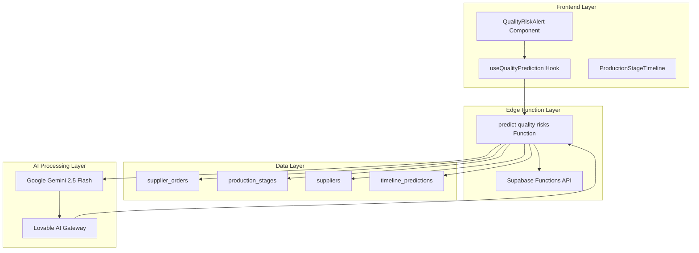
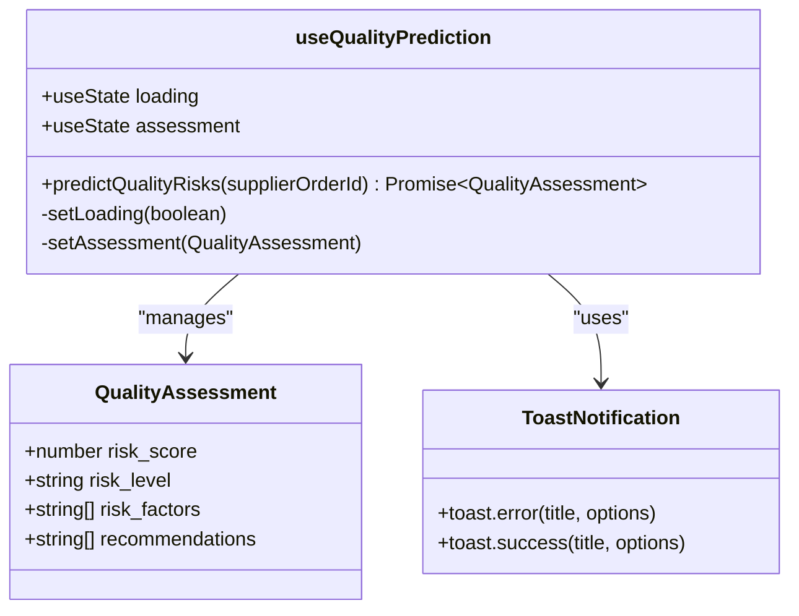
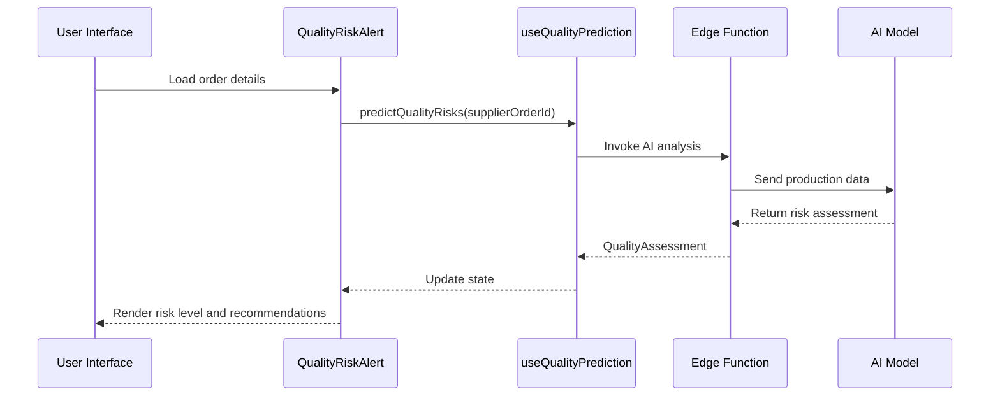
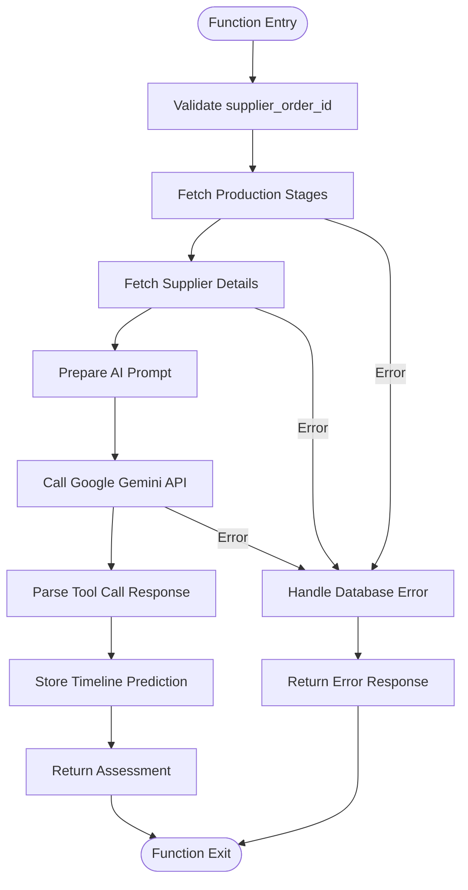
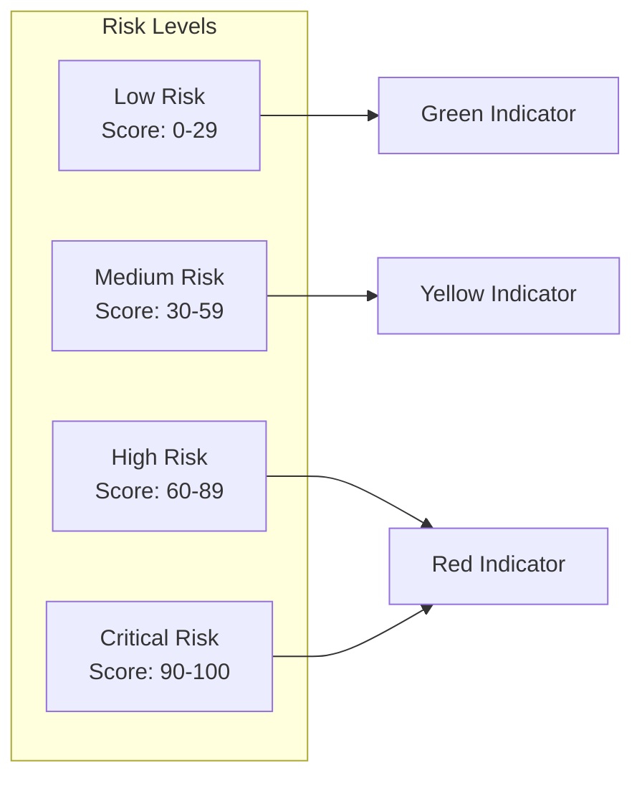
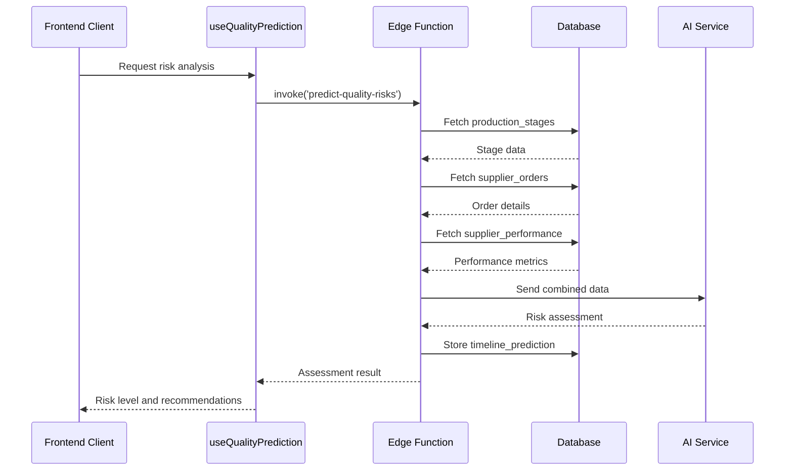
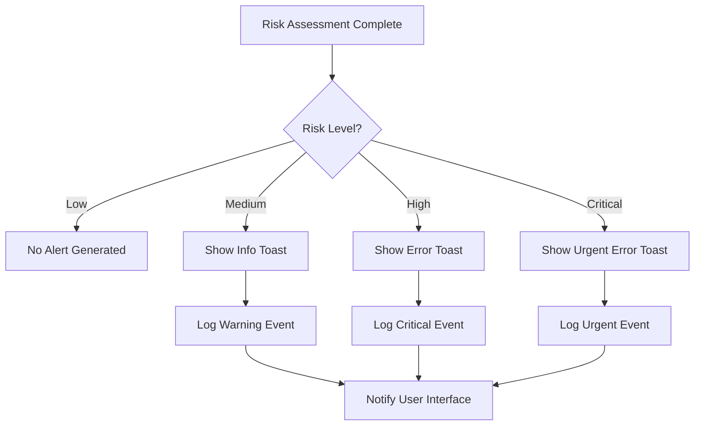
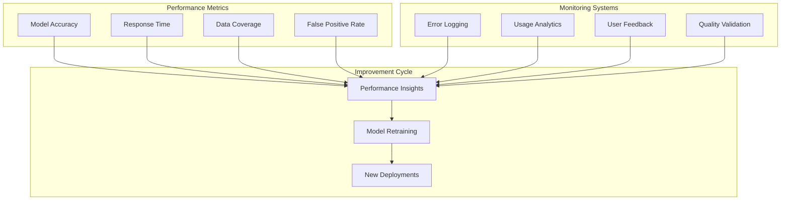
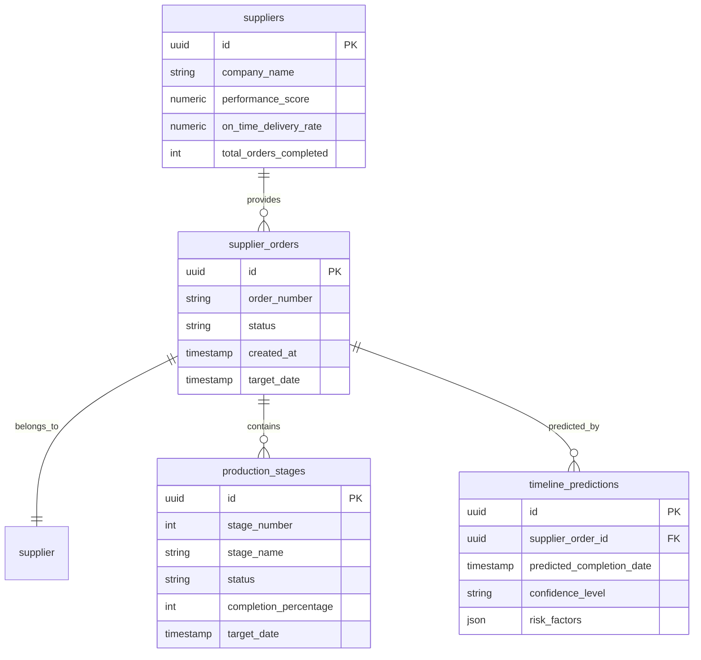

# Quality Risk Prediction System

<cite>
**Referenced Files in This Document**
- [useQualityPrediction.ts](file://src/hooks/useQualityPrediction.ts)
- [QualityRiskAlert.tsx](file://src/components/production/QualityRiskAlert.tsx)
- [predict-quality-risks/index.ts](file://supabase/functions/predict-quality-risks/index.ts)
- [ProductionStageTimeline.tsx](file://src/components/production/ProductionStageTimeline.tsx)
- [ProductionTracking.tsx](file://src/pages/ProductionTracking.tsx)
- [AIQualityScanner.tsx](file://src/components/production/AIQualityScanner.tsx)
- [order.ts](file://src/types/order.ts)
- [ModernSupplierDashboard.tsx](file://src/pages/ModernSupplierDashboard.tsx)
- [SupplierPerformanceMetrics.tsx](file://src/components/supplier/SupplierPerformanceMetrics.tsx)
</cite>

## Table of Contents
1. [Introduction](#introduction)
2. [System Architecture](#system-architecture)
3. [Core Components](#core-components)
4. [AI Model Integration](#ai-model-integration)
5. [Risk Assessment Schema](#risk-assessment-schema)
6. [Data Flow and Processing](#data-flow-and-processing)
7. [Alerting and Notification System](#alerting-and-notification-system)
8. [Performance Monitoring](#performance-monitoring)
9. [Integration with Production Workflows](#integration-with-production-workflows)
10. [Implementation Examples](#implementation-examples)
11. [Troubleshooting and Best Practices](#troubleshooting-and-best-practices)

## Introduction

The Quality Risk Prediction system is an advanced AI-powered solution designed to proactively identify potential manufacturing defects and production delays in real-time. Built on the LoopTrace platform, this system leverages historical supplier performance data, order complexity analysis, and production timeline intelligence to assess and communicate quality risks across the supply chain.

The system operates through a sophisticated Edge Function architecture that combines machine learning capabilities with real-time data processing to deliver actionable insights for manufacturers, buyers, and suppliers. By integrating with existing production workflows, it provides continuous monitoring and predictive analytics to minimize quality issues and optimize production outcomes.

## System Architecture

The Quality Risk Prediction system follows a distributed architecture pattern with clear separation of concerns across frontend, backend, and AI processing layers.

**Diagram sources**
- [QualityRiskAlert.tsx](file://src/components/production/QualityRiskAlert.tsx#L1-L113)
- [useQualityPrediction.ts](file://src/hooks/useQualityPrediction.ts#L1-L56)
- [predict-quality-risks/index.ts](file://supabase/functions/predict-quality-risks/index.ts#L1-L131)

**Section sources**
- [QualityRiskAlert.tsx](file://src/components/production/QualityRiskAlert.tsx#L1-L113)
- [useQualityPrediction.ts](file://src/hooks/useQualityPrediction.ts#L1-L56)
- [predict-quality-risks/index.ts](file://supabase/functions/predict-quality-risks/index.ts#L1-L131)

## Core Components

### useQualityPrediction Hook

The `useQualityPrediction` hook serves as the primary interface for quality risk assessment functionality, managing API calls, state updates, and user notifications.

**Diagram sources**
- [useQualityPrediction.ts](file://src/hooks/useQualityPrediction.ts#L5-L10)
- [useQualityPrediction.ts](file://src/hooks/useQualityPrediction.ts#L12-L56)

The hook provides three main functionalities:
- **Risk Prediction**: Initiates AI-powered quality risk analysis for specific supplier orders
- **State Management**: Maintains loading states and assessment results
- **Notification System**: Provides real-time alerts for high-risk situations

### QualityRiskAlert Component

The `QualityRiskAlert` component renders visual risk assessments with contextual information and actionable recommendations.

**Diagram sources**
- [QualityRiskAlert.tsx](file://src/components/production/QualityRiskAlert.tsx#L16-L25)
- [useQualityPrediction.ts](file://src/hooks/useQualityPrediction.ts#L16-L48)
- [predict-quality-risks/index.ts](file://supabase/functions/predict-quality-risks/index.ts#L16-L41)

**Section sources**
- [QualityRiskAlert.tsx](file://src/components/production/QualityRiskAlert.tsx#L1-L113)
- [useQualityPrediction.ts](file://src/hooks/useQualityPrediction.ts#L1-L56)

## AI Model Integration

### Edge Function Implementation

The `predict-quality-risks` Edge Function orchestrates the AI analysis pipeline, combining historical data with real-time production information.

**Diagram sources**
- [predict-quality-risks/index.ts](file://supabase/functions/predict-quality-risks/index.ts#L16-L131)

### AI Model Configuration

The system utilizes Google Gemini 2.5 Flash through the Lovable AI gateway for quality risk assessment:

| Configuration Parameter | Value | Purpose |
|------------------------|-------|---------|
| Model | google/gemini-2.5-flash | High-performance multimodal AI |
| System Prompt | Quality control expert analysis | Defines AI role and expertise |
| Tool Definition | assess_quality_risk function | Structured output specification |
| Confidence Threshold | 14-day prediction window | Standard timeline analysis |

**Section sources**
- [predict-quality-risks/index.ts](file://supabase/functions/predict-quality-risks/index.ts#L45-L131)

## Risk Assessment Schema

### QualityAssessment Interface

The system defines a comprehensive risk assessment schema that captures all aspects of quality risk evaluation:

| Field | Type | Description | Range |
|-------|------|-------------|-------|
| risk_score | number | Overall risk quantification | 0-100 |
| risk_level | string | Categorized risk severity | low, medium, high, critical |
| risk_factors | string[] | Identified risk indicators | Array of descriptive factors |
| recommendations | string[] | Mitigation action suggestions | Array of actionable steps |

### Risk Level Classification

**Diagram sources**
- [predict-quality-risks/index.ts](file://supabase/functions/predict-quality-risks/index.ts#L114-L116)
- [QualityRiskAlert.tsx](file://src/components/production/QualityRiskAlert.tsx#L39-L55)

**Section sources**
- [useQualityPrediction.ts](file://src/hooks/useQualityPrediction.ts#L5-L10)
- [predict-quality-risks/index.ts](file://supabase/functions/predict-quality-risks/index.ts#L78-L96)

## Data Flow and Processing

### Information Gathering Pipeline

The system collects and processes multiple data sources to generate comprehensive risk assessments:

**Diagram sources**
- [predict-quality-risks/index.ts](file://supabase/functions/predict-quality-risks/index.ts#L24-L41)
- [useQualityPrediction.ts](file://src/hooks/useQualityPrediction.ts#L16-L48)

### Data Sources and Features

| Data Source | Fields Analyzed | Risk Impact |
|-------------|----------------|-------------|
| Production Stages | Completion percentage, status, target dates | Timeline reliability |
| Supplier Performance | Performance score, on-time delivery rate, total orders | Historical reliability |
| Order Complexity | Quantity, product type, customization level | Manufacturing difficulty |

**Section sources**
- [predict-quality-risks/index.ts](file://supabase/functions/predict-quality-risks/index.ts#L48-L61)
- [ProductionTracking.tsx](file://src/pages/ProductionTracking.tsx#L1-L200)

## Alerting and Notification System

### Multi-Level Alert Strategy

The system implements a sophisticated alerting mechanism that escalates notifications based on risk severity:

**Diagram sources**
- [useQualityPrediction.ts](file://src/hooks/useQualityPrediction.ts#L31-L36)
- [QualityRiskAlert.tsx](file://src/components/production/QualityRiskAlert.tsx#L17-L21)

### Notification Types and Triggers

| Trigger Condition | Notification Type | Visual Indicator | Action Required |
|-------------------|------------------|------------------|-----------------|
| High Risk Factor | Error Toast | Red background | Immediate review |
| Critical Risk Factor | Error Toast | Red background | Emergency response |
| Medium Risk Factor | Info Toast | Yellow background | Scheduled review |
| Low Risk Factor | Success Toast | Green background | Monitor status |

**Section sources**
- [useQualityPrediction.ts](file://src/hooks/useQualityPrediction.ts#L31-L36)
- [QualityRiskAlert.tsx](file://src/components/production/QualityRiskAlert.tsx#L57-L66)

## Performance Monitoring

### Model Accuracy Tracking

The system incorporates built-in mechanisms for monitoring AI model performance and system effectiveness:

### Key Performance Indicators

| Metric | Target Value | Monitoring Method |
|--------|-------------|-------------------|
| Model Accuracy | >90% | Cross-validation testing |
| Response Time | <2 seconds | API latency tracking |
| Coverage Rate | >95% | Data completeness monitoring |
| False Positive Rate | <5% | Manual validation cycles |

**Section sources**
- [predict-quality-risks/index.ts](file://supabase/functions/predict-quality-risks/index.ts#L102-L104)

## Integration with Production Workflows

### Timeline Prediction Integration

The system seamlessly integrates with existing production timeline management through the `timeline_predictions` table:

**Diagram sources**
- [predict-quality-risks/index.ts](file://supabase/functions/predict-quality-risks/index.ts#L112-L117)
- [ProductionStageTimeline.tsx](file://src/components/production/ProductionStageTimeline.tsx#L6-L16)

### Supplier Performance Enhancement

The quality risk system enhances supplier performance metrics by incorporating risk assessment data:

| Performance Dimension | Traditional Metric | Enhanced Metric |
|----------------------|-------------------|-----------------|
| Reliability | On-time delivery rate | Risk-adjusted delivery probability |
| Quality | Pass/fail rates | Predictive quality risk score |
| Capacity | Order volume | Risk-weighted capacity utilization |
| Compliance | Audit scores | Proactive compliance risk assessment |

**Section sources**
- [ModernSupplierDashboard.tsx](file://src/pages/ModernSupplierDashboard.tsx#L118-L152)
- [SupplierPerformanceMetrics.tsx](file://src/components/supplier/SupplierPerformanceMetrics.tsx#L45-L84)

## Implementation Examples

### Example 1: High-Risk Order Analysis

For a supplier order with the following characteristics:
- **Order Complexity**: High (custom embroidery, multiple sizes)
- **Supplier History**: Mixed performance (75% on-time delivery)
- **Current Stage**: Sewing (60% complete, 2 days behind schedule)

The AI analysis would likely identify:
- **Risk Factors**: 
  - Delayed sewing stage impacting timeline
  - Supplier's mixed quality history
  - Custom embroidery complexity
- **Recommendations**:
  - Increase inspection frequency during sewing
  - Monitor embroidery quality closely
  - Prepare contingency plans for delays

### Example 2: Medium-Risk Order Analysis

For a standard order with:
- **Order Complexity**: Medium (standard sizing, basic design)
- **Supplier History**: Consistent performance (95% on-time delivery)
- **Current Stage**: Cutting (80% complete, on schedule)

The AI analysis might show:
- **Risk Factors**:
  - Standard order complexity
  - Good supplier track record
  - On-schedule cutting progress
- **Recommendations**:
  - Maintain current inspection standards
  - Monitor for unexpected quality issues
  - Prepare for next stage transitions

### Example 3: Low-Risk Order Analysis

For a routine order with:
- **Order Complexity**: Low (standard sizing, simple design)
- **Supplier History**: Excellent performance (98% on-time delivery)
- **Current Stage**: Pattern making (100% complete)

The system would confirm:
- **Risk Factors**: None significant
- **Recommendations**: Continue current monitoring approach

**Section sources**
- [predict-quality-risks/index.ts](file://supabase/functions/predict-quality-risks/index.ts#L48-L61)
- [QualityRiskAlert.tsx](file://src/components/production/QualityRiskAlert.tsx#L87-L109)

## Troubleshooting and Best Practices

### Common Issues and Solutions

| Issue | Symptoms | Solution |
|-------|----------|----------|
| Slow Response | Long loading times | Check AI API connectivity and retry logic |
| Missing Data | Null assessment results | Verify database connections and data availability |
| Incorrect Risk Levels | Unexpected risk classifications | Review AI prompt engineering and training data |
| API Errors | 500 server errors | Check function logs and environment variables |

### Best Practices for Implementation

1. **Data Quality**: Ensure comprehensive supplier and order data collection
2. **Model Training**: Regularly update AI models with new quality data
3. **Monitoring**: Implement comprehensive logging and alerting
4. **Feedback Loops**: Establish mechanisms for continuous improvement
5. **User Training**: Provide clear guidance on interpreting risk assessments

### Performance Optimization

- **Caching**: Implement intelligent caching for frequently accessed risk assessments
- **Batch Processing**: Group multiple risk analyses for efficiency
- **Resource Management**: Monitor Edge Function resource usage
- **Error Handling**: Implement robust fallback mechanisms

**Section sources**
- [predict-quality-risks/index.ts](file://supabase/functions/predict-quality-risks/index.ts#L124-L131)
- [useQualityPrediction.ts](file://src/hooks/useQualityPrediction.ts#L42-L48)