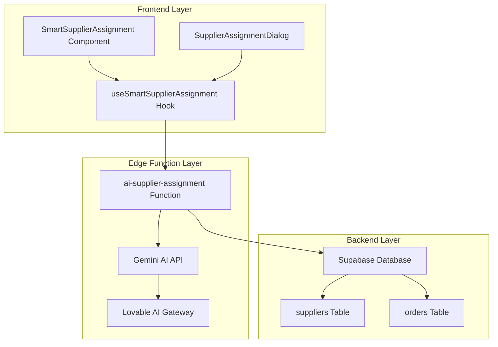
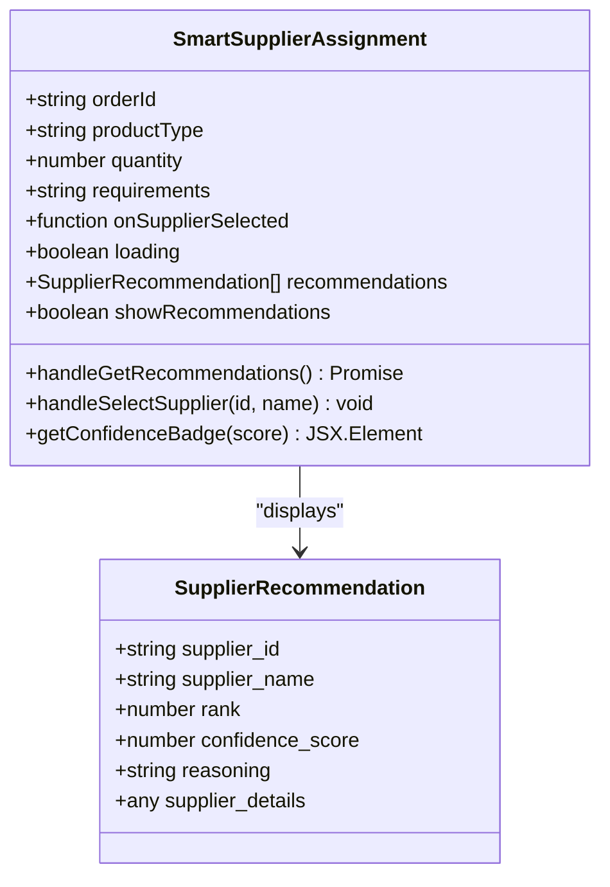
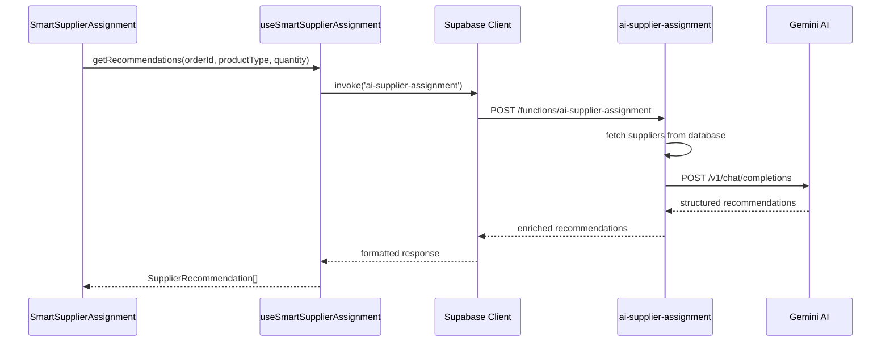
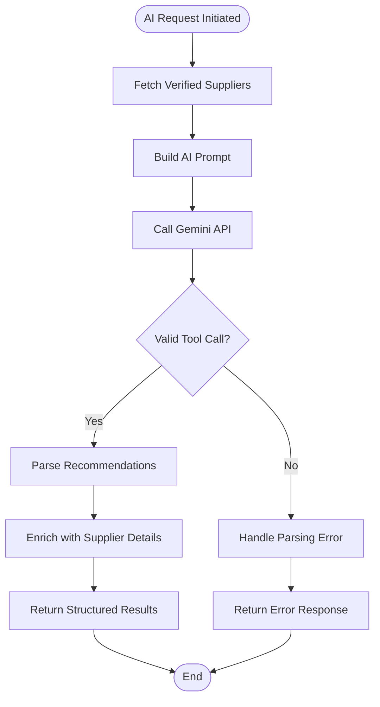
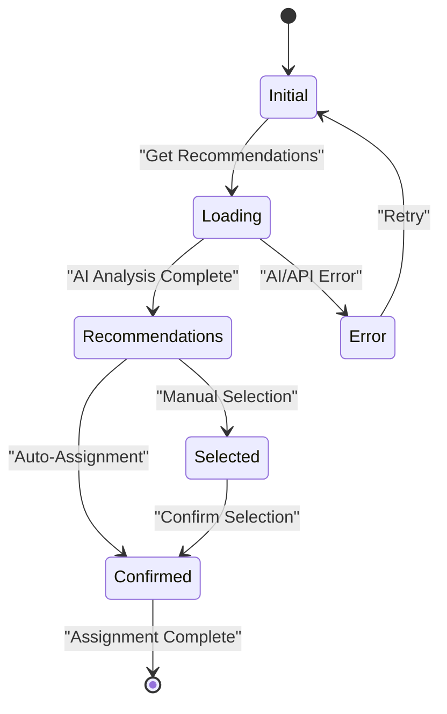
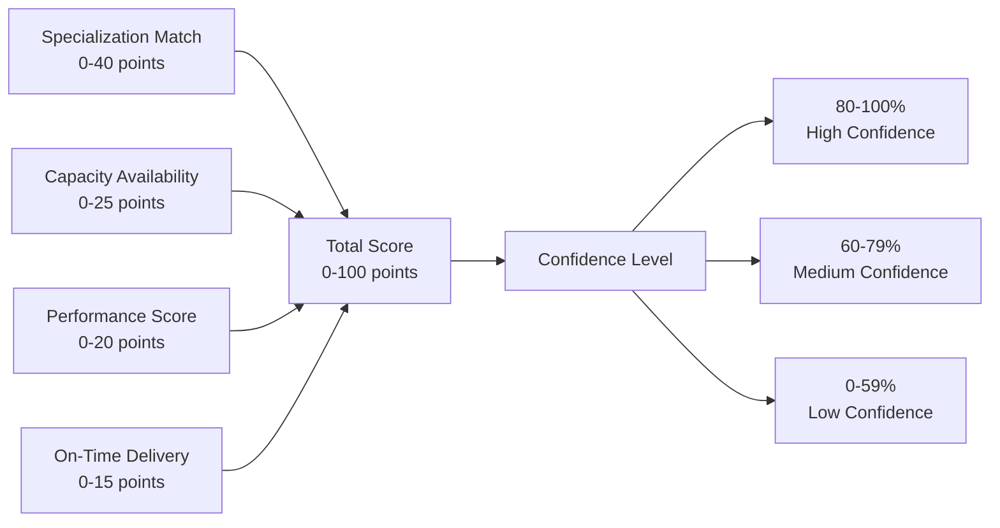
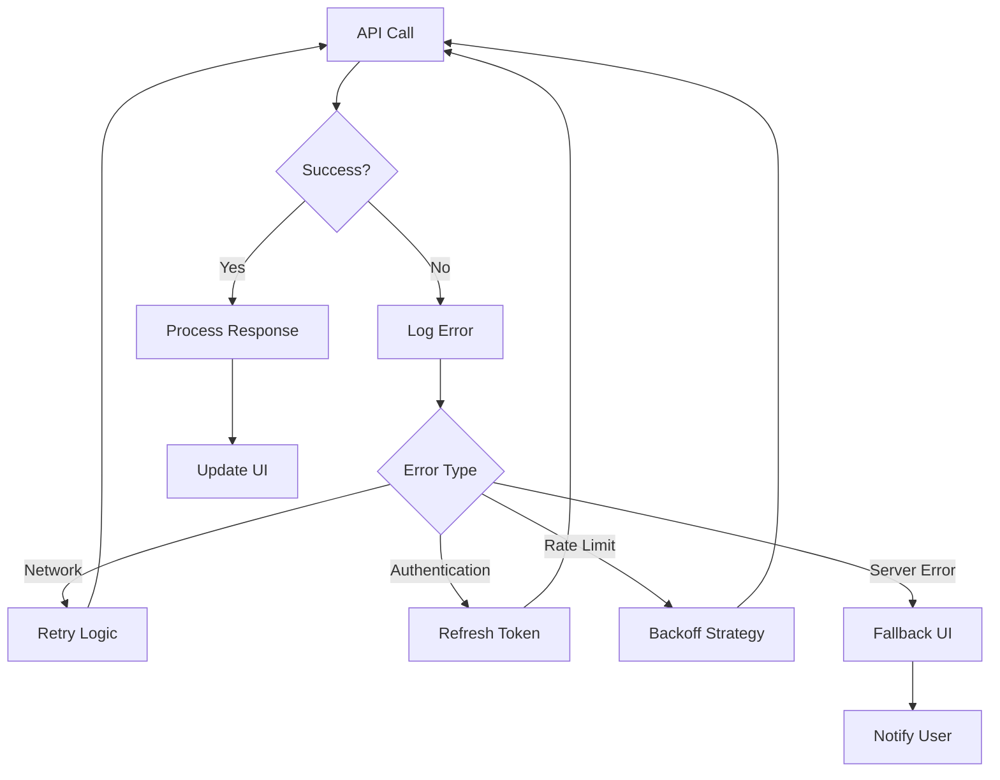

# Smart Supplier Assignment

<cite>
**Referenced Files in This Document**
- [SmartSupplierAssignment.tsx](file://src/components/admin/SmartSupplierAssignment.tsx)
- [useSmartSupplierAssignment.ts](file://src/hooks/useSmartSupplierAssignment.ts)
- [ai-supplier-assignment/index.ts](file://supabase/functions/ai-supplier-assignment/index.ts)
- [SupplierAssignmentDialog.tsx](file://src/components/admin/SupplierAssignmentDialog.tsx)
- [SupplierMatchingSystem.tsx](file://src/components/admin/SupplierMatchingSystem.tsx)
- [useSupplierCapabilities.ts](file://src/hooks/useSupplierCapabilities.ts)
- [useQualityPrediction.ts](file://src/hooks/useQualityPrediction.ts)
</cite>

## Table of Contents
1. [Introduction](#introduction)
2. [System Architecture](#system-architecture)
3. [Core Components](#core-components)
4. [AI-Powered Supplier Evaluation](#ai-powered-supplier-evaluation)
5. [Hook Orchestration](#hook-orchestration)
6. [Admin Interface](#admin-interface)
7. [Supplier Filtering Logic](#supplier-filtering-logic)
8. [Confidence Scoring](#confidence-scoring)
9. [Reasoning Generation](#reasoning-generation)
10. [Real-World Matching Scenarios](#real-world-matching-scenarios)
11. [Error Recovery Patterns](#error-recovery-patterns)
12. [Performance Considerations](#performance-considerations)
13. [Troubleshooting Guide](#troubleshooting-guide)
14. [Conclusion](#conclusion)

## Introduction

The Smart Supplier Assignment system is an intelligent AI-powered solution that automates the process of matching manufacturing orders to optimal suppliers. Built on a robust architecture combining React frontend components, Supabase Edge Functions, and Lovable AI/Gemini integration, the system evaluates supplier capabilities, capacity, lead times, and performance scores to provide data-driven recommendations for order assignments.

This system serves as a critical component in the supply chain management ecosystem, enabling administrators to efficiently allocate orders while maintaining quality standards and optimizing operational efficiency. The AI-driven approach ensures that supplier selection considers multiple factors simultaneously, reducing human bias and improving overall assignment accuracy.

## System Architecture

The Smart Supplier Assignment system follows a layered architecture pattern with clear separation of concerns:



**Diagram sources**
- [SmartSupplierAssignment.tsx](file://src/components/admin/SmartSupplierAssignment.tsx#L1-L127)
- [useSmartSupplierAssignment.ts](file://src/hooks/useSmartSupplierAssignment.ts#L1-L55)
- [ai-supplier-assignment/index.ts](file://supabase/functions/ai-supplier-assignment/index.ts#L1-L134)

The architecture consists of four primary layers:

1. **Frontend Layer**: React components and hooks that handle user interactions and display recommendations
2. **Edge Function Layer**: Serverless functions that orchestrate AI analysis and database operations
3. **Backend Layer**: Supabase database storing supplier and order information
4. **External AI Layer**: Lovable AI/Gemini integration for intelligent analysis

**Section sources**
- [SmartSupplierAssignment.tsx](file://src/components/admin/SmartSupplierAssignment.tsx#L1-L127)
- [useSmartSupplierAssignment.ts](file://src/hooks/useSmartSupplierAssignment.ts#L1-L55)
- [ai-supplier-assignment/index.ts](file://supabase/functions/ai-supplier-assignment/index.ts#L1-L134)

## Core Components

### SmartSupplierAssignment Component

The main UI component that presents AI-generated supplier recommendations to administrators:



**Diagram sources**
- [SmartSupplierAssignment.tsx](file://src/components/admin/SmartSupplierAssignment.tsx#L9-L15)
- [useSmartSupplierAssignment.ts](file://src/hooks/useSmartSupplierAssignment.ts#L5-L12)

### useSmartSupplierAssignment Hook

The orchestration layer that manages function invocation and response handling:



**Diagram sources**
- [useSmartSupplierAssignment.ts](file://src/hooks/useSmartSupplierAssignment.ts#L18-L47)
- [ai-supplier-assignment/index.ts](file://supabase/functions/ai-supplier-assignment/index.ts#L22-L126)

**Section sources**
- [SmartSupplierAssignment.tsx](file://src/components/admin/SmartSupplierAssignment.tsx#L1-L127)
- [useSmartSupplierAssignment.ts](file://src/hooks/useSmartSupplierAssignment.ts#L1-L55)

## AI-Powered Supplier Evaluation

The system leverages Lovable AI/Gemini to perform sophisticated supplier analysis through structured tool calling with predefined schemas.

### Evaluation Criteria

The AI evaluates suppliers across multiple dimensions:

| Criterion | Weight | Description |
|-----------|--------|-------------|
| Specialization Match | 40 points | Alignment with product requirements |
| Capacity Availability | 25 points | Current workload and production capacity |
| Performance Score | 20 points | Historical performance metrics |
| On-Time Delivery | 15 points | Reliability in meeting deadlines |

### Tool Calling Implementation

The system uses structured tool calling to ensure consistent and reliable AI responses:



**Diagram sources**
- [ai-supplier-assignment/index.ts](file://supabase/functions/ai-supplier-assignment/index.ts#L38-L121)

**Section sources**
- [ai-supplier-assignment/index.ts](file://supabase/functions/ai-supplier-assignment/index.ts#L38-L121)

## Hook Orchestration

The `useSmartSupplierAssignment` hook serves as the central orchestrator for AI supplier recommendation requests:

### Function Invocation Pattern

The hook implements a standardized pattern for edge function communication:

- **Parameter Validation**: Ensures required parameters are present
- **Error Handling**: Provides comprehensive error reporting and user feedback
- **Loading State Management**: Controls UI feedback during API calls
- **Response Processing**: Transforms raw API responses into usable data structures

### Response Handling

The hook processes AI responses through multiple stages:

1. **Raw API Response**: Direct JSON response from the edge function
2. **Recommendation Extraction**: Isolates the recommendations array
3. **State Updates**: Updates React state with new recommendations
4. **User Feedback**: Provides toast notifications for success/failure

**Section sources**
- [useSmartSupplierAssignment.ts](file://src/hooks/useSmartSupplierAssignment.ts#L1-L55)

## Admin Interface

The admin interface provides multiple pathways for supplier assignment, combining AI recommendations with manual oversight.

### Smart Supplier Assignment Panel

The primary interface for AI-driven supplier recommendations:



**Diagram sources**
- [SmartSupplierAssignment.tsx](file://src/components/admin/SmartSupplierAssignment.tsx#L27-L37)

### Manual Assignment Workflow

The SupplierAssignmentDialog provides a fallback mechanism for manual supplier selection:

- **Supplier Discovery**: Real-time search and filtering
- **Pricing Configuration**: Dynamic margin calculations
- **Special Instructions**: Custom requirement capture
- **Bulk Operations**: Support for multiple assignment patterns

**Section sources**
- [SmartSupplierAssignment.tsx](file://src/components/admin/SmartSupplierAssignment.tsx#L1-L127)
- [SupplierAssignmentDialog.tsx](file://src/components/admin/SupplierAssignmentDialog.tsx#L1-L238)

## Supplier Filtering Logic

The system implements sophisticated filtering mechanisms to ensure only qualified suppliers participate in the matching process.

### Verification Status Filtering

Only suppliers with verified status are considered for recommendations:

```typescript
// Filter criteria from database query
.eq('verification_status', 'verified')
.eq('active', true)
```

### Capability-Based Filtering

Suppliers are evaluated against product-specific requirements:

- **Specialization Matching**: Exact and partial product type alignment
- **Material Compatibility**: Available material types and specifications
- **Technical Capabilities**: Required manufacturing techniques and equipment

### Capacity-Based Filtering

Dynamic capacity assessment prevents over-allocation:

- **Current Workload**: Existing order commitments
- **Monthly Capacity**: Maximum production limits
- **Lead Time Calculation**: Availability timeline analysis

**Section sources**
- [ai-supplier-assignment/index.ts](file://supabase/functions/ai-supplier-assignment/index.ts#L24-L30)
- [SupplierMatchingSystem.tsx](file://src/components/admin/SupplierMatchingSystem.tsx#L146-L196)

## Confidence Scoring

The system implements a multi-dimensional confidence scoring mechanism to rate the reliability of AI recommendations.

### Scoring Algorithm

The confidence score is calculated based on multiple factors:



**Diagram sources**
- [SupplierMatchingSystem.tsx](file://src/components/admin/SupplierMatchingSystem.tsx#L199-L228)

### Confidence Badge System

Visual indicators help administrators quickly assess recommendation reliability:

- **High Confidence (80-100%)**: Green badge with automatic assignment suggestions
- **Medium Confidence (60-79%)**: Secondary badge for cautious consideration
- **Low Confidence (0-59%)**: Outline badge requiring manual review

**Section sources**
- [SmartSupplierAssignment.tsx](file://src/components/admin/SmartSupplierAssignment.tsx#L39-L43)
- [SupplierMatchingSystem.tsx](file://src/components/admin/SupplierMatchingSystem.tsx#L199-L228)

## Reasoning Generation

The AI system generates detailed reasoning for each recommendation, providing transparency into the decision-making process.

### Structured Reasoning Output

Each recommendation includes:

- **Match Analysis**: Explanation of why the supplier is recommended
- **Strength Factors**: Key attributes contributing to the recommendation
- **Potential Concerns**: Any limitations or considerations
- **Alternative Options**: Other suitable suppliers and their characteristics

### Reasoning Categories

The AI generates reasoning across several domains:

1. **Technical Fit**: Specialization and capability alignment
2. **Operational Efficiency**: Capacity and lead time considerations
3. **Quality Assurance**: Performance history and reliability metrics
4. **Cost Optimization**: Pricing competitiveness and value proposition

**Section sources**
- [ai-supplier-assignment/index.ts](file://supabase/functions/ai-supplier-assignment/index.ts#L66-L70)
- [SmartSupplierAssignment.tsx](file://src/components/admin/SmartSupplierAssignment.tsx#L98-L101)

## Real-World Matching Scenarios

The system handles various complex matching scenarios commonly encountered in manufacturing environments.

### Scenario 1: High-Margin Fashion Order

**Order Characteristics**:
- Product Type: Women's Apparel
- Quantity: 1,000 units
- Requirements: Premium quality, fast turnaround
- Target Price: $20/unit

**AI Analysis**:
- Identifies suppliers with fashion specialization
- Prioritizes capacity for quick fulfillment
- Considers performance scores for quality assurance
- Evaluates lead times against deadline requirements

**Recommended Supplier**:
- **Rank**: 1
- **Confidence**: 92%
- **Reasoning**: "Excellent specialization in women's apparel with proven track record of on-time delivery (95% success rate) and high performance score (92/100). Monthly capacity of 1,500 units comfortably covers order volume."

### Scenario 2: Bulk Technical Components

**Order Characteristics**:
- Product Type: Industrial Components
- Quantity: 10,000 units
- Requirements: Standard quality, cost-sensitive
- Target Price: $5/unit

**AI Analysis**:
- Focuses on capacity and cost efficiency
- Evaluates bulk production capabilities
- Considers historical performance for reliability
- Balances lead time against cost considerations

**Recommended Supplier**:
- **Rank**: 1
- **Confidence**: 85%
- **Reasoning**: "Strong industrial manufacturing capabilities with excellent cost competitiveness. Performance score of 88/100 and consistent on-time delivery rate of 92%. Monthly capacity of 15,000 units ensures timely completion."

### Scenario 3: Custom Specialty Goods

**Order Characteristics**:
- Product Type: Custom Embroidered Products
- Quantity: 500 units
- Requirements: High customization, quality focus
- Target Price: $30/unit

**AI Analysis**:
- Prioritizes specialized capabilities
- Evaluates customization expertise
- Considers quality assurance processes
- Accounts for lead time complexity

**Recommended Supplier**:
- **Rank**: 1
- **Confidence**: 78%
- **Reasoning**: "Specialized in embroidery and custom textile manufacturing with strong quality control measures. Performance score of 85/100 and 89% on-time delivery. Monthly capacity of 800 units sufficient for order volume with appropriate lead time considerations."

## Error Recovery Patterns

The system implements comprehensive error handling and recovery mechanisms to ensure reliability in production environments.

### API Error Handling

Multiple layers of error handling protect against various failure scenarios:



**Diagram sources**
- [useSmartSupplierAssignment.ts](file://src/hooks/useSmartSupplierAssignment.ts#L41-L47)
- [ai-supplier-assignment/index.ts](file://supabase/functions/ai-supplier-assignment/index.ts#L127-L133)

### Fallback Mechanisms

When AI recommendations fail, the system provides alternative pathways:

1. **Manual Assignment**: Direct supplier selection without AI assistance
2. **Default Recommendations**: Basic supplier lists based on availability
3. **Partial Results**: Graceful degradation when some data is unavailable
4. **Cached Responses**: Temporary caching for improved performance

### Error Reporting

Comprehensive logging and monitoring ensure issues can be diagnosed and resolved:

- **Structured Logging**: JSON-formatted logs for easy parsing
- **Error Classification**: Automatic categorization of error types
- **User Impact Tracking**: Monitoring of user-facing errors
- **Performance Metrics**: Tracking of response times and success rates

**Section sources**
- [useSmartSupplierAssignment.ts](file://src/hooks/useSmartSupplierAssignment.ts#L41-L47)
- [ai-supplier-assignment/index.ts](file://supabase/functions/ai-supplier-assignment/index.ts#L127-L133)

## Performance Considerations

The system is designed for high-performance operation in production environments with careful attention to scalability and responsiveness.

### Optimization Strategies

1. **Edge Function Caching**: Intelligent caching of frequently accessed supplier data
2. **Parallel Processing**: Concurrent API calls for improved response times
3. **Lazy Loading**: Progressive loading of recommendation details
4. **Debounced Inputs**: Preventing excessive API calls during user interaction

### Scalability Features

- **Horizontal Scaling**: Edge functions automatically scale with demand
- **Database Optimization**: Indexed queries and efficient data structures
- **CDN Integration**: Static asset delivery optimization
- **Load Balancing**: Distribution of traffic across multiple instances

### Monitoring and Metrics

Key performance indicators tracked include:

- **Response Time**: Average time for AI recommendation generation
- **Success Rate**: Percentage of successful API calls
- **Error Rate**: Frequency of various error types
- **Throughput**: Number of recommendations processed per minute

## Troubleshooting Guide

Common issues and their resolutions when working with the Smart Supplier Assignment system.

### Issue: AI Recommendations Not Loading

**Symptoms**: "Get AI Recommendations" button appears but no results appear

**Possible Causes**:
1. Missing LOVABLE_API_KEY environment variable
2. Network connectivity issues
3. Database query failures
4. AI service unavailability

**Resolution Steps**:
1. Verify environment variable configuration
2. Check network connectivity to Lovable AI services
3. Review database connection status
4. Monitor AI service health metrics

### Issue: Poor Quality Recommendations

**Symptoms**: AI suggests unsuitable suppliers or irrelevant matches

**Possible Causes**:
1. Insufficient training data
2. Ambiguous order requirements
3. Outdated supplier information
4. Incorrect scoring weights

**Resolution Steps**:
1. Review and refine order specification requirements
2. Update supplier capability data
3. Adjust scoring algorithm parameters
4. Provide additional training examples

### Issue: Slow Response Times

**Symptoms**: Long delays in receiving recommendations

**Possible Causes**:
1. Database query performance issues
2. AI service latency
3. Network bottlenecks
4. High system load

**Resolution Steps**:
1. Optimize database queries and indexing
2. Implement response caching
3. Monitor network performance
4. Scale edge function resources

**Section sources**
- [ai-supplier-assignment/index.ts](file://supabase/functions/ai-supplier-assignment/index.ts#L35-L36)
- [useSmartSupplierAssignment.ts](file://src/hooks/useSmartSupplierAssignment.ts#L41-L47)

## Conclusion

The Smart Supplier Assignment system represents a sophisticated approach to automated supplier matching that combines artificial intelligence with domain expertise. By leveraging Lovable AI/Gemini for intelligent analysis and implementing robust error handling and fallback mechanisms, the system provides reliable, scalable solutions for complex supply chain management challenges.

Key strengths of the system include:

- **Intelligent Analysis**: Multi-dimensional evaluation of supplier capabilities
- **Transparency**: Detailed reasoning behind each recommendation
- **Flexibility**: Multiple assignment pathways for different scenarios
- **Reliability**: Comprehensive error handling and recovery mechanisms
- **Scalability**: Designed for enterprise-level production environments

The system continues to evolve with ongoing improvements to AI models, expanded supplier capabilities, and enhanced user interfaces. Future developments may include additional evaluation criteria, real-time performance monitoring, and integration with external supply chain systems.