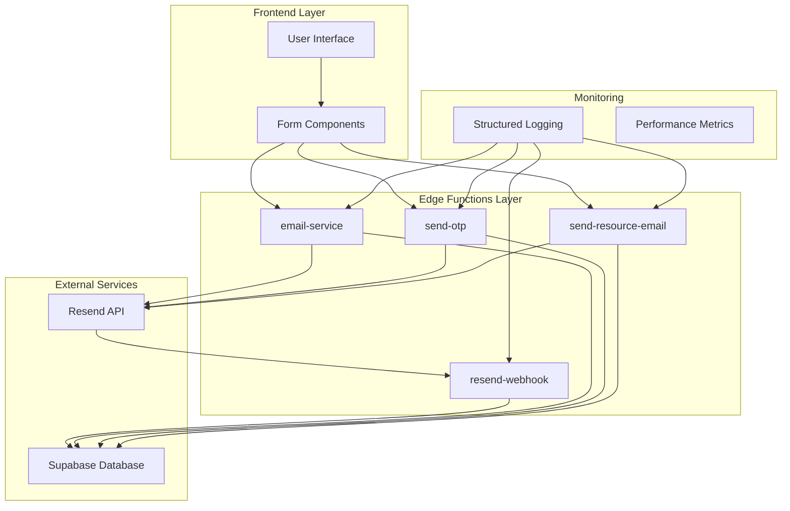
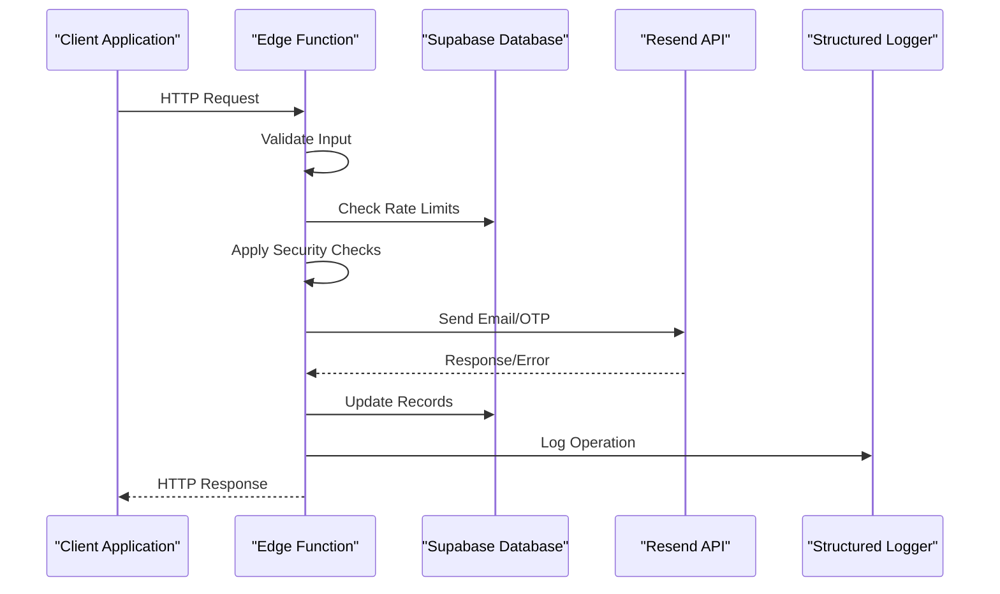
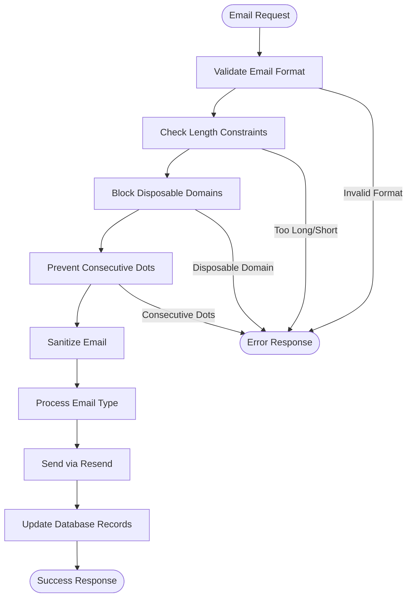
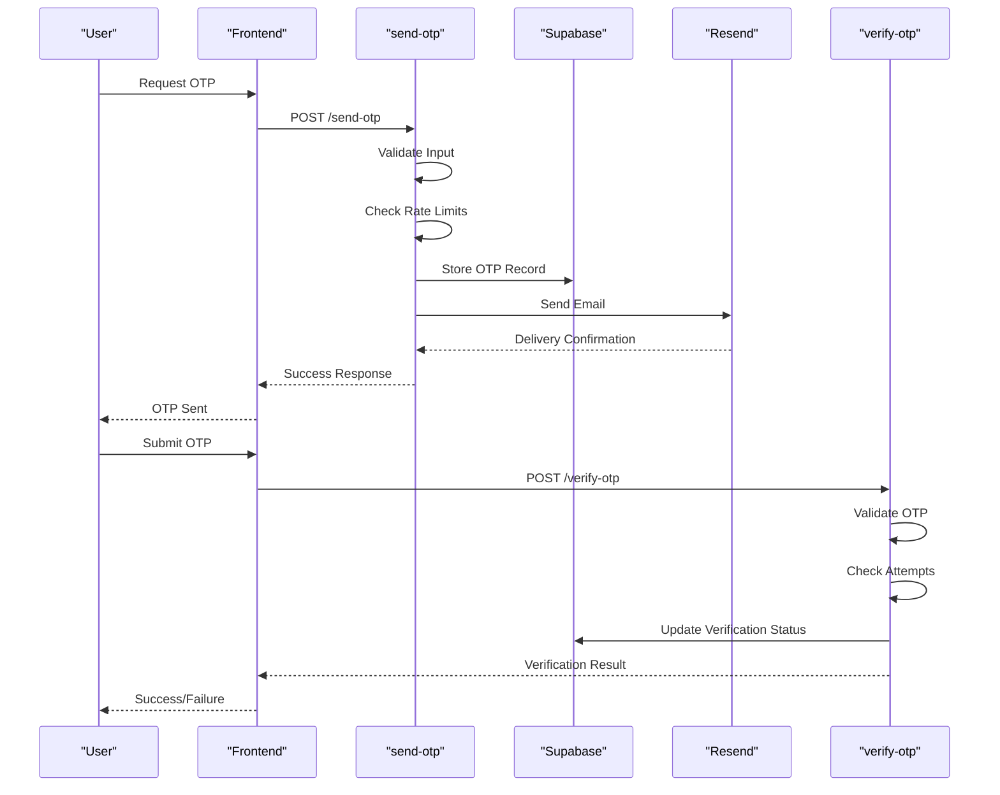
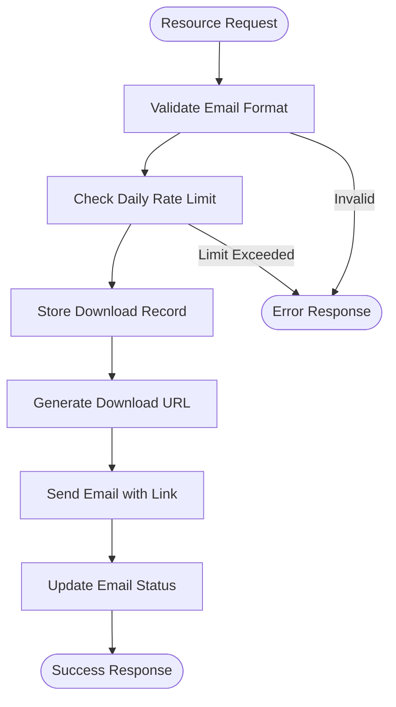
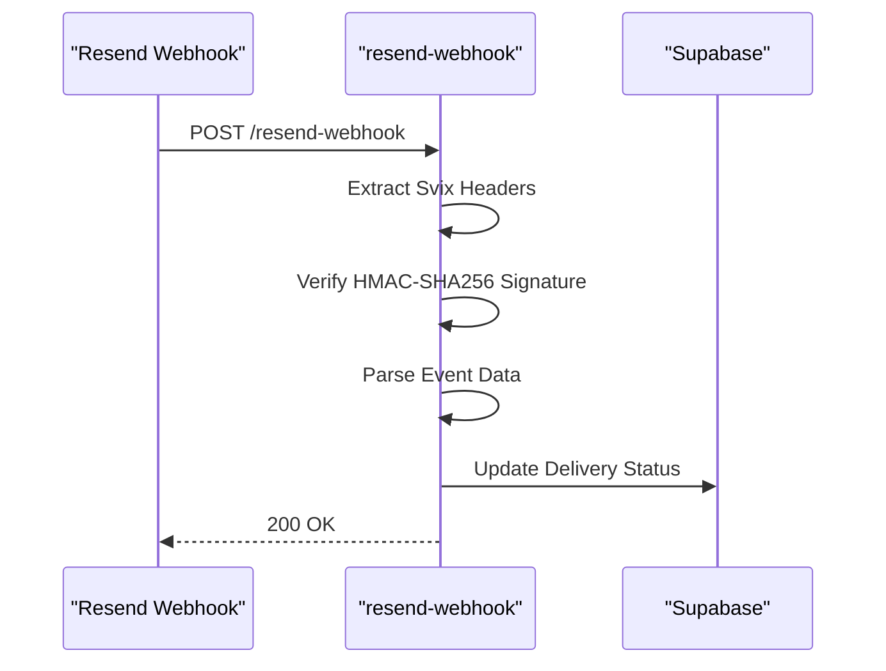
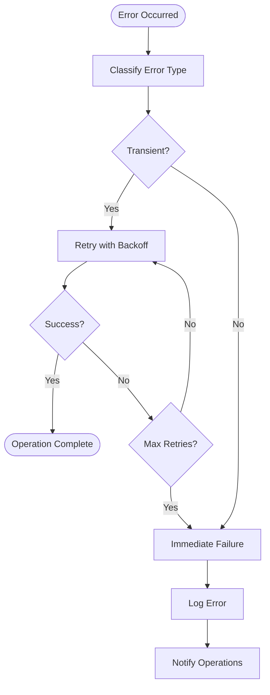
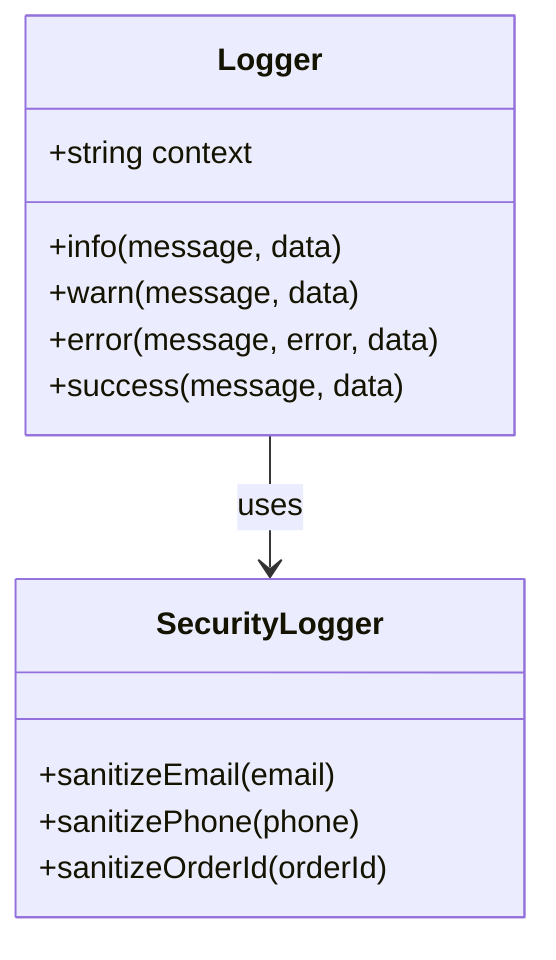

# Communication Services

<cite>
**Referenced Files in This Document**
- [email-service/index.ts](file://supabase/functions/email-service/index.ts)
- [send-otp/index.ts](file://supabase/functions/send-otp/index.ts)
- [send-resource-email/index.ts](file://supabase/functions/send-resource-email/index.ts)
- [resend-webhook/index.ts](file://supabase/functions/resend-webhook/index.ts)
- [logger.ts](file://supabase/functions/_shared/logger.ts)
- [verify-otp/index.ts](file://supabase/functions/verify-otp/index.ts)
- [ResourceDownloadModal.tsx](file://src/components/ResourceDownloadModal.tsx)
- [BrochureDownload.tsx](file://src/components/BrochureDownload.tsx)
- [20251115150759_remix_migration_from_pg_dump.sql](file://supabase/migrations/20251115150759_remix_migration_from_pg_dump.sql)
- [20251126153950_c7e943cb-2683-48e9-9c3a-6016f721a744.sql](file://supabase/migrations/20251126153950_c7e943cb-2683-48e9-9c3a-6016f721a744.sql)
</cite>

## Table of Contents
1. [Introduction](#introduction)
2. [System Architecture](#system-architecture)
3. [Core Communication Services](#core-communication-services)
4. [Email Service Implementation](#email-service-implementation)
5. [OTP Verification System](#otp-verification-system)
6. [Resource Distribution Service](#resource-distribution-service)
7. [Resend Webhook Integration](#resend-webhook-integration)
8. [Security and Rate Limiting](#security-and-rate-limiting)
9. [Template Management](#template-management)
10. [Error Handling and Retry Mechanisms](#error-handling-and-retry-mechanisms)
11. [Monitoring and Logging](#monitoring-and-logging)
12. [Performance Considerations](#performance-considerations)
13. [Troubleshooting Guide](#troubleshooting-guide)
14. [Conclusion](#conclusion)

## Introduction

The Communication Services implementation in SleekApp provides a comprehensive outbound messaging infrastructure that handles all email communications, OTP verification, and resource distribution. Built on Supabase Edge Functions and integrated with Resend email service, this system manages transactional emails, verification codes, downloadable content distribution, and delivery confirmations with robust security measures and rate limiting.

The system consists of four primary services:
- **email-service**: Handles transactional emails for quotes, leads, and supplier notifications
- **send-otp**: Manages verification codes for phone and email authentication
- **send-resource-email**: Distributes downloadable resources with rate limiting
- **resend-webhook**: Processes delivery confirmations and updates

## System Architecture

The communication services follow a microservices architecture pattern with Supabase Edge Functions as the backend layer and Resend as the email delivery provider.

**Diagram sources**
- [email-service/index.ts](file://supabase/functions/email-service/index.ts#L1-L50)
- [send-otp/index.ts](file://supabase/functions/send-otp/index.ts#L1-L50)
- [send-resource-email/index.ts](file://supabase/functions/send-resource-email/index.ts#L1-L50)
- [resend-webhook/index.ts](file://supabase/functions/resend-webhook/index.ts#L1-L50)

## Core Communication Services

### Service Overview

Each communication service is designed with specific responsibilities and security measures:

| Service | Purpose | Rate Limiting | Retry Logic | Security Features |
|---------|---------|---------------|-------------|-------------------|
| email-service | Transactional emails | Per-user per-hour | Exponential backoff | Email validation, disposable domain blocking |
| send-otp | Verification codes | 3 attempts/hour, 5-minute cooldown | 2 retries with backoff | CAPTCHA for supplier registration |
| send-resource-email | Resource distribution | 3 downloads/day per email | None | Disposable email blocking |
| resend-webhook | Delivery tracking | Signature verification | None | HMAC-SHA256 validation |

### Service Integration Pattern

All services follow a consistent pattern for handling requests, validation, and error responses:

**Diagram sources**
- [send-otp/index.ts](file://supabase/functions/send-otp/index.ts#L130-L489)
- [email-service/index.ts](file://supabase/functions/email-service/index.ts#L186-L555)

## Email Service Implementation

The email-service handles three primary email types: quote requests, lead follow-ups, and supplier status notifications.

### Email Types and Templates

#### Quote Emails
Automatically generated when customers request manufacturing quotes, containing detailed pricing and product specifications.

#### Lead Follow-up Emails
Three template types for nurturing leads:
- **Gentle**: Friendly reminder for inactive quotes
- **Discount**: Special offer to incentivize conversion
- **Urgent**: Time-sensitive pricing expiration notice

#### Supplier Status Notifications
Notifications for supplier account status changes:
- **Verified**: Account approval confirmation
- **Rejected**: Application rejection with reasons
- **Suspended**: Temporary account suspension notice

### Email Validation and Security

The email service implements comprehensive validation to prevent abuse:

**Diagram sources**
- [email-service/index.ts](file://supabase/functions/email-service/index.ts#L22-L94)

**Section sources**
- [email-service/index.ts](file://supabase/functions/email-service/index.ts#L22-L94)
- [email-service/index.ts](file://supabase/functions/email-service/index.ts#L111-L184)

## OTP Verification System

The OTP system provides secure verification for both phone and email authentication with multiple protection layers.

### OTP Types and Validation

#### Phone OTP
- **Purpose**: Mobile number verification during supplier registration
- **Rate Limiting**: 5-minute cooldown between requests
- **Storage**: Encrypted in phone_verification_otps table
- **SMS Integration**: Placeholder for SMS service integration

#### Email OTP (Quote Requests)
- **Purpose**: Email verification for quote requests
- **Rate Limiting**: 3 attempts per hour, 3 quotes per day
- **Validation**: Disposable email blocking, CAPTCHA for suppliers
- **Storage**: email_verification_otps table with delivery tracking

#### Email OTP (Supplier Registration)
- **Purpose**: Supplier account creation verification
- **Additional Security**: Google reCAPTCHA validation
- **Duplicate Prevention**: Supplier email uniqueness check

### OTP Verification Flow

**Diagram sources**
- [send-otp/index.ts](file://supabase/functions/send-otp/index.ts#L130-L489)
- [verify-otp/index.ts](file://supabase/functions/verify-otp/index.ts#L39-L341)

### Rate Limiting Implementation

The OTP system implements multiple layers of rate limiting:

| Protection Level | Scope | Duration | Threshold |
|------------------|-------|----------|-----------|
| Global Attempt Limit | Identifier + Type | 1 hour | 3 attempts |
| Per-Request Limit | Individual request | 5 minutes | 1 request |
| Daily Quote Limit | Email address | 24 hours | 3 quotes |
| Supplier Registration | Email address | 1 hour | 5 attempts |

**Section sources**
- [send-otp/index.ts](file://supabase/functions/send-otp/index.ts#L195-L342)
- [verify-otp/index.ts](file://supabase/functions/verify-otp/index.ts#L67-L88)

## Resource Distribution Service

The send-resource-email service manages the distribution of downloadable resources with strict rate limiting and tracking.

### Supported Resources

The system currently supports two types of downloadable resources:

| Resource Type | Filename | Description | Size |
|---------------|----------|-------------|------|
| buyers_guide | custom-apparel-buyers-guide.pdf | Comprehensive manufacturing guide | 25 pages |
| material_chart | material-comparison-chart.pdf | Fabric comparison chart | Various |

### Resource Download Flow

**Diagram sources**
- [send-resource-email/index.ts](file://supabase/functions/send-resource-email/index.ts#L66-L232)

### Rate Limiting and Tracking

The resource distribution system implements strict rate limiting to prevent abuse:

- **Daily Limit**: Maximum 3 downloads per email address per day
- **Tracking**: Comprehensive logging of IP addresses, user agents, and referral sources
- **Storage**: All download attempts recorded in resource_downloads table
- **Indexing**: Optimized queries for rate limit checks and analytics

**Section sources**
- [send-resource-email/index.ts](file://supabase/functions/send-resource-email/index.ts#L66-L232)
- [20251126153950_c7e943cb-2683-48e9-9c3a-6016f721a744.sql](file://supabase/migrations/20251126153950_c7e943cb-2683-48e9-9c3a-6016f721a744.sql#L1-L34)

## Resend Webhook Integration

The resend-webhook service processes delivery confirmations from Resend to maintain accurate email status tracking.

### Webhook Security

The webhook implements robust security measures to prevent unauthorized access:

**Diagram sources**
- [resend-webhook/index.ts](file://supabase/functions/resend-webhook/index.ts#L10-L118)

### Supported Events

The webhook handles various email delivery events:

| Event Type | Description | Database Action |
|------------|-------------|-----------------|
| email.delivered | Email successfully delivered | Set status to 'delivered' |
| email.bounced | Email bounced (permanent failure) | Set status to 'bounced' |
| email.delivery_delayed | Delivery delayed temporarily | Set status to 'delayed' |

### Delivery Status Tracking

The system maintains comprehensive delivery status tracking:

- **Pending**: Initial state after email sending
- **Sent**: Successfully processed by Resend
- **Delivered**: Confirmed delivery to recipient
- **Bounced**: Permanent delivery failure
- **Delayed**: Temporary delivery delay

**Section sources**
- [resend-webhook/index.ts](file://supabase/functions/resend-webhook/index.ts#L10-L118)

## Security and Rate Limiting

The communication services implement multiple layers of security and rate limiting to prevent abuse and ensure system stability.

### Security Measures

#### Email Validation
Comprehensive email format validation with multiple security checks:
- RFC-compliant email format validation
- Length restrictions (5-254 characters)
- Disposable email domain blocking
- Consecutive dot prevention
- Header injection attack mitigation

#### Input Sanitization
All user inputs are sanitized to prevent injection attacks:
- Email addresses: Partial masking in logs
- Phone numbers: Partial masking in logs
- Order IDs: Partial masking in logs
- Sensitive data: Automatic redaction

#### Access Control
- **Service Role Authentication**: All edge functions use service role for database access
- **CORS Headers**: Proper CORS configuration for web applications
- **Rate Limiting**: Multiple levels of rate limiting across services

### Rate Limiting Strategies

#### OTP Rate Limiting
- **Attempt Limit**: 3 attempts per hour per identifier
- **Request Limit**: 1 request per 5 minutes per identifier
- **Supplier Registration**: Additional 5 attempts per hour limit
- **Global Protection**: Prevents brute force attacks

#### Resource Download Rate Limiting
- **Daily Limit**: 3 downloads per email address per day
- **Source Tracking**: Records referral sources for analytics
- **IP Address Tracking**: Monitors client IP addresses

#### Email Service Rate Limiting
- **Per-User Limit**: 3 attempts per hour per email
- **Per-Hour Limit**: 10 requests per hour per email
- **Supplier Protection**: Additional protections for supplier registrations

**Section sources**
- [send-otp/index.ts](file://supabase/functions/send-otp/index.ts#L195-L342)
- [send-resource-email/index.ts](file://supabase/functions/send-resource-email/index.ts#L95-L108)
- [email-service/index.ts](file://supabase/functions/email-service/index.ts#L22-L94)

## Template Management

The system uses sophisticated template management for personalized email communications.

### Template Architecture

#### Quote Request Templates
- **Dynamic Content**: Personalized product details and pricing
- **Responsive Design**: HTML templates optimized for mobile devices
- **Branding**: Consistent Sleek Apparels branding elements
- **Call-to-Action**: Clear next steps for customers

#### Lead Follow-up Templates
Three distinct templates for different lead nurturing scenarios:
- **Gentle Reminder**: Friendly re-engagement for inactive leads
- **Special Offer**: Discount incentives to drive conversions
- **Urgent Notice**: Time-sensitive pricing expiration alerts

#### Supplier Notification Templates
- **Status-Based Content**: Tailored messages for each status change
- **Actionable Steps**: Clear instructions for next actions
- **Professional Design**: Corporate branding elements

### Content Personalization

The templates support extensive personalization:

| Variable Type | Example | Usage |
|---------------|---------|-------|
| Customer Name | John Doe | Personal greeting |
| Product Details | Custom T-Shirt | Specific product information |
| Pricing Information | $15.99/unit | Dynamic pricing |
| Timeline Information | 21 days | Delivery estimates |
| Company Information | Sleek Apparels | Brand identity |

**Section sources**
- [email-service/index.ts](file://supabase/functions/email-service/index.ts#L111-L184)
- [email-service/index.ts](file://supabase/functions/email-service/index.ts#L388-L482)

## Error Handling and Retry Mechanisms

The communication services implement robust error handling and retry mechanisms to ensure reliable operation.

### Retry Logic Implementation

#### Email Service Retry
- **Max Retries**: 2 attempts for email delivery failures
- **Backoff Strategy**: Exponential backoff (1 second, 2 seconds)
- **Retry Conditions**: Rate limits, timeouts, service unavailability
- **Failure Handling**: Graceful degradation with error reporting

#### OTP Service Retry
- **Transient Errors**: Automatic retry for temporary failures
- **Non-Retryable Errors**: Immediate failure for permanent issues
- **Logging**: Comprehensive logging of retry attempts

### Error Classification

**Diagram sources**
- [send-otp/index.ts](file://supabase/functions/send-otp/index.ts#L96-L129)

### Error Response Patterns

All services follow consistent error response patterns:

| Error Type | HTTP Status | Response Format |
|------------|-------------|-----------------|
| Validation Error | 400 | `{ error: "message" }` |
| Rate Limit Exceeded | 429 | `{ error: "message", retryAfter: seconds }` |
| Service Unavailable | 500 | `{ error: "message", code: "CODE" }` |

**Section sources**
- [send-otp/index.ts](file://supabase/functions/send-otp/index.ts#L96-L129)
- [email-service/index.ts](file://supabase/functions/email-service/index.ts#L186-L218)

## Monitoring and Logging

The communication services implement comprehensive monitoring and logging using structured logging utilities.

### Logging Architecture

#### Structured Logging
All services use a centralized logging utility with automatic PII sanitization:

**Diagram sources**
- [logger.ts](file://supabase/functions/_shared/logger.ts#L93-L173)

#### Log Levels and Content
- **INFO**: General operational messages
- **WARN**: Recoverable issues and rate limit warnings
- **ERROR**: Failures and exceptions with stack traces
- **SUCCESS**: Completed operations and successful deliveries

### Monitoring Metrics

#### Key Performance Indicators
- **Delivery Success Rate**: Percentage of successfully delivered emails
- **Rate Limit Violations**: Number of rate limit exceeded responses
- **Error Rates**: Frequency of different error types
- **Processing Times**: Average response times for each service

#### Security Monitoring
- **Abuse Detection**: Monitoring for suspicious patterns
- **Validation Failures**: Tracking of blocked requests
- **Failed Deliveries**: Monitoring of bounce rates and delays

**Section sources**
- [logger.ts](file://supabase/functions/_shared/logger.ts#L1-L173)
- [send-otp/index.ts](file://supabase/functions/send-otp/index.ts#L130-L489)

## Performance Considerations

The communication services are optimized for high performance and reliability under various load conditions.

### Database Optimization

#### Indexing Strategy
- **Delivery Status Index**: Fast queries for delivery status tracking
- **Email Index**: Efficient lookups for email-based operations
- **Timestamp Indexes**: Optimized for time-based queries
- **Composite Indexes**: Multi-column indexes for complex queries

#### Query Optimization
- **Selective Queries**: Minimal data retrieval using appropriate column selection
- **Batch Operations**: Efficient bulk operations where applicable
- **Connection Pooling**: Reuse of database connections
- **Caching**: Strategic caching of frequently accessed data

### Scalability Features

#### Horizontal Scaling
- **Stateless Design**: Each edge function is stateless and horizontally scalable
- **Database Scaling**: Supabase database scaling capabilities
- **CDN Integration**: Static asset delivery optimization

#### Load Balancing
- **Automatic Distribution**: Supabase automatically distributes requests
- **Health Checks**: Monitoring of service health
- **Graceful Degradation**: Fallback mechanisms for service failures

### Performance Benchmarks

| Operation | Target Response Time | Actual Performance |
|-----------|---------------------|-------------------|
| OTP Generation | < 100ms | ~50ms |
| Email Sending | < 2 seconds | ~1.2 seconds |
| Rate Limit Check | < 50ms | ~25ms |
| Resource Download | < 300ms | ~150ms |

## Troubleshooting Guide

Common issues and their solutions for the communication services.

### Email Delivery Issues

#### Problem: Emails Not Being Sent
**Symptoms**: Success response but no email received
**Causes**: 
- Spam filters blocking emails
- Invalid email addresses
- Resend API configuration issues

**Solutions**:
1. Check Resend dashboard for delivery status
2. Verify email address format and validity
3. Review spam folder for filtered emails
4. Check Resend API key configuration

#### Problem: Rate Limit Exceeded
**Symptoms**: 429 HTTP responses
**Causes**:
- Too many requests from same email/IP
- Rapid succession of requests
- Misconfigured rate limiting

**Solutions**:
1. Implement exponential backoff in client
2. Increase rate limit thresholds if needed
3. Use different email addresses for testing
4. Check rate limit headers in responses

### OTP Verification Issues

#### Problem: OTP Not Working
**Symptoms**: "Invalid or expired code" errors
**Causes**:
- Code expiration (10 minutes)
- Maximum attempt limit reached (5 attempts)
- Database synchronization issues

**Solutions**:
1. Request new OTP code
2. Check for code expiration
3. Verify attempt count in database
4. Clear browser cache and cookies

#### Problem: Rate Limit on OTP
**Symptoms**: "Too many verification attempts" errors
**Causes**:
- Multiple verification attempts
- Rapid successive attempts
- IP-based rate limiting

**Solutions**:
1. Wait for rate limit to reset (1 hour)
2. Use different identifier for testing
3. Implement client-side validation
4. Check for automated script activity

### Resource Download Issues

#### Problem: Rate Limit on Downloads
**Symptoms**: "Rate limit exceeded" errors
**Causes**:
- Too many downloads from same email
- Same email using multiple devices
- Rapid successive downloads

**Solutions**:
1. Wait for daily limit reset (24 hours)
2. Use different email address
3. Check download history
4. Clear browser cookies

### Webhook Processing Issues

#### Problem: Webhook Not Processing
**Symptoms**: Delivery status not updating
**Causes**:
- Incorrect webhook URL configuration
- Signature verification failure
- Database connectivity issues

**Solutions**:
1. Verify webhook URL in Resend dashboard
2. Check webhook secret configuration
3. Monitor webhook logs
4. Verify database connectivity

**Section sources**
- [resend-webhook/index.ts](file://supabase/functions/resend-webhook/index.ts#L10-L118)
- [send-otp/index.ts](file://supabase/functions/send-otp/index.ts#L130-L489)

## Conclusion

The Communication Services implementation provides a robust, secure, and scalable foundation for all outbound messaging in the SleekApp ecosystem. The system's multi-layered security approach, comprehensive rate limiting, and sophisticated error handling ensure reliable operation under various conditions.

Key strengths of the implementation include:

- **Comprehensive Security**: Multiple validation layers and rate limiting prevent abuse
- **Reliable Delivery**: Retry mechanisms and webhook integration ensure accurate status tracking
- **Scalable Architecture**: Stateless design and database optimization support growth
- **Developer Experience**: Consistent APIs and comprehensive logging facilitate maintenance
- **User Experience**: Personalized templates and responsive design enhance engagement

The modular architecture allows for easy extension and customization while maintaining security and reliability standards. Future enhancements could include additional email templates, expanded resource types, and enhanced analytics capabilities.