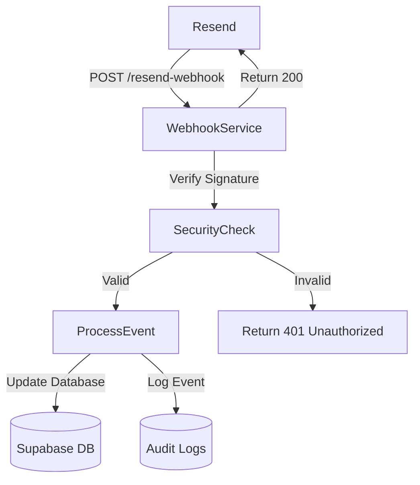
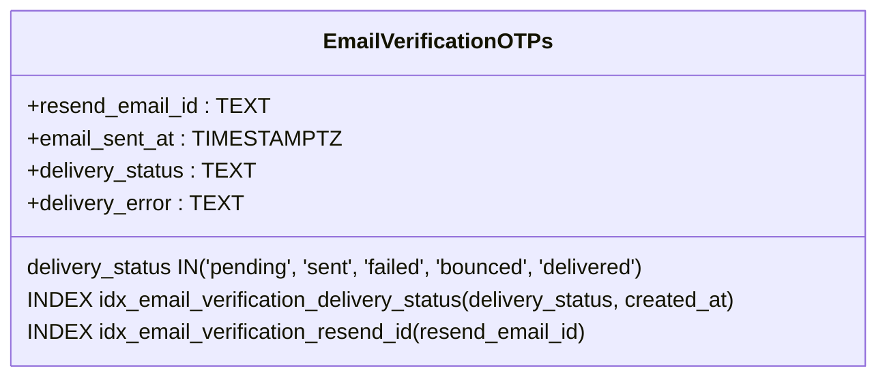
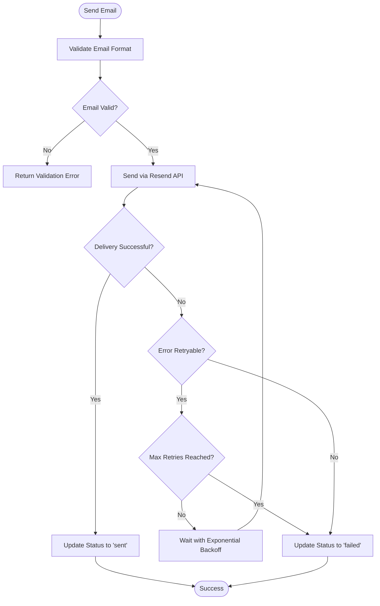
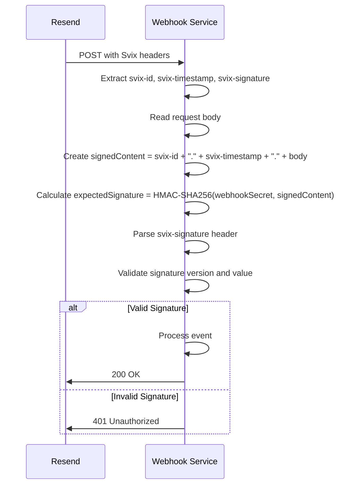
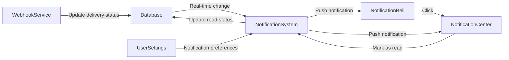

# Email Webhook Service

<cite>
**Referenced Files in This Document**   
- [resend-webhook/index.ts](file://supabase/functions/resend-webhook/index.ts)
- [email-service/index.ts](file://supabase/functions/email-service/index.ts)
- [send-otp/index.ts](file://supabase/functions/send-otp/index.ts)
- [20251119140029_887f03c6-bdb2-46d4-ac7b-4b4868f9a169.sql](file://supabase/migrations/20251119140029_887f03c6-bdb2-46d4-ac7b-4b4868f9a169.sql)
- [NotificationBell.tsx](file://src/components/NotificationBell.tsx)
- [NotificationCenter.tsx](file://src/components/NotificationCenter.tsx)
- [useNotifications.ts](file://src/hooks/useNotifications.ts)
- [database.ts](file://src/types/database.ts)
- [config.toml](file://supabase/config.toml)
</cite>

## Table of Contents
1. [Introduction](#introduction)
2. [Endpoint Configuration](#endpoint-configuration)
3. [Payload Structure and Event Types](#payload-structure-and-event-types)
4. [Delivery Status Synchronization](#delivery-status-synchronization)
5. [Failure Alerts and Retry Logic](#failure-alerts-and-retry-logic)
6. [Security Measures](#security-measures)
7. [Audit Logging Integration](#audit-logging-integration)
8. [User Communication History](#user-communication-history)
9. [Integration with Notification Components](#integration-with-notification-components)
10. [Conclusion](#conclusion)

## Introduction
The Email Webhook Service processes delivery confirmations and bounce notifications from Resend, enabling real-time tracking of email delivery status for critical business communications. This service ensures reliable email delivery monitoring for OTP verification, quote requests, and supplier communications. The system integrates with the database to maintain delivery status, triggers alerts on delivery failures, and maintains comprehensive user communication history. Security measures including signature verification and payload validation protect against spoofed webhook calls, while retry logic handles internal processing failures. The service also integrates with the audit logging system and informs the NotificationBell and NotificationCenter components about email delivery events.

**Section sources**
- [resend-webhook/index.ts](file://supabase/functions/resend-webhook/index.ts)
- [email-service/index.ts](file://supabase/functions/email-service/index.ts)

## Endpoint Configuration
The email webhook service is configured as a Supabase Edge Function deployed at `/functions/v1/resend-webhook`. The endpoint is secured with a secret key stored in the `RESEND_WEBHOOK_SECRET` environment variable and configured to bypass JWT verification in Supabase, as specified in the `supabase/config.toml` file. The service accepts POST requests containing email delivery events from Resend and responds with appropriate HTTP status codes. CORS headers are configured to allow requests from any origin, with specific headers permitted including `svix-id`, `svix-timestamp`, and `svix-signature` which are used for signature verification.

**Diagram sources**
- [resend-webhook/index.ts](file://supabase/functions/resend-webhook/index.ts)
- [config.toml](file://supabase/config.toml)

**Section sources**
- [resend-webhook/index.ts](file://supabase/functions/resend-webhook/index.ts)
- [config.toml](file://supabase/config.toml)

## Payload Structure and Event Types
The webhook service processes Resend webhook payloads containing email delivery events. The payload structure follows the Resend webhook format with a `type` field indicating the event type and a `data` object containing event-specific information. The service handles three primary event types: `email.delivered` for successful deliveries, `email.bounced` for delivery failures due to invalid addresses, and `email.delivery_delayed` for temporary delivery issues. Each event includes the `email_id` from Resend, which is used to correlate the delivery status with the corresponding email in the database. The service also logs unhandled event types for monitoring and potential future implementation.

**Section sources**
- [resend-webhook/index.ts](file://supabase/functions/resend-webhook/index.ts)

## Delivery Status Synchronization
The service synchronizes email delivery status with the database by updating the `email_verification_otps` table in Supabase. When a delivery confirmation is received, the service updates the `delivery_status` field to 'delivered' and clears any previous `delivery_error`. For bounced emails, the status is set to 'bounced', and for delayed deliveries, it's set to 'delayed'. The full event data is stored in the `delivery_error` field as a JSON string for diagnostic purposes. The database schema includes optimized indexes on both `delivery_status` and `resend_email_id` fields to ensure efficient querying and updates. The `email_sent_at` timestamp is also maintained to track when emails were successfully dispatched.

**Diagram sources**
- [resend-webhook/index.ts](file://supabase/functions/resend-webhook/index.ts)
- [20251119140029_887f03c6-bdb2-46d4-ac7b-4b4868f9a169.sql](file://supabase/migrations/20251119140029_887f03c6-bdb2-46d4-ac7b-4b4868f9a169.sql)

**Section sources**
- [resend-webhook/index.ts](file://supabase/functions/resend-webhook/index.ts)
- [20251119140029_887f03c6-bdb2-46d4-ac7b-4b4868f9a169.sql](file://supabase/migrations/20251119140029_887f03c6-bdb2-46d4-ac7b-4b4868f9a169.sql)

## Failure Alerts and Retry Logic
The system implements comprehensive failure handling for email delivery issues. When an email bounces or fails to deliver, the service updates the database with the failure details and triggers appropriate alerts. The `send-otp` function includes retry logic for transient email delivery failures, with exponential backoff between attempts. The retry mechanism identifies retryable errors such as rate limiting, timeouts, or temporary service unavailability, and attempts to resend the email up to two times. Each retry attempt is logged for audit purposes. For permanent failures like invalid email addresses, the system immediately reports the failure without retrying. The service also validates email addresses before sending to prevent known disposable email domains from receiving verification emails.

**Diagram sources**
- [send-otp/index.ts](file://supabase/functions/send-otp/index.ts)
- [resend-webhook/index.ts](file://supabase/functions/resend-webhook/index.ts)

**Section sources**
- [send-otp/index.ts](file://supabase/functions/send-otp/index.ts)
- [resend-webhook/index.ts](file://supabase/functions/resend-webhook/index.ts)

## Security Measures
The email webhook service implements multiple security measures to protect against spoofed webhook calls and unauthorized access. The primary security mechanism is signature verification using Svix headers (`svix-id`, `svix-timestamp`, and `svix-signature`) provided by Resend. The service constructs a signed content string by concatenating these headers with the request body and verifies it against the expected signature using HMAC-SHA256 with the `RESEND_WEBHOOK_SECRET`. Only requests with valid signatures are processed. The service also validates that all required Svix headers are present before processing the request. Additionally, the endpoint is configured in Supabase to bypass JWT verification while relying on the signature verification as the primary authentication mechanism, creating a secure but accessible webhook endpoint.

**Diagram sources**
- [resend-webhook/index.ts](file://supabase/functions/resend-webhook/index.ts)

**Section sources**
- [resend-webhook/index.ts](file://supabase/functions/resend-webhook/index.ts)

## Audit Logging Integration
The email webhook service integrates with the audit logging system to maintain a comprehensive record of email delivery events and processing activities. While the webhook service itself doesn't directly call the audit logging functions, it contributes to the overall audit trail by updating the email delivery status in the database. The `email_verification_otps` table serves as a record of all email verification attempts, including delivery status and error information. Other services that send emails, such as the `send-otp` function, integrate directly with the audit logging system by calling the `log-audit-action` edge function. This creates a complete audit trail of email communications, including when emails were sent, their delivery status, and any related security events. The audit logs capture important metadata including timestamps, user agents, and IP addresses when available.

**Section sources**
- [resend-webhook/index.ts](file://supabase/functions/resend-webhook/index.ts)
- [log-audit-action/index.ts](file://supabase/functions/log-audit-action/index.ts)
- [auditLog.ts](file://src/lib/auditLog.ts)

## User Communication History
The service maintains user communication history through the `email_verification_otps` table, which tracks all email verification attempts and their delivery status. This table stores the email address, OTP code, creation timestamp, expiration time, verification status, and delivery tracking information including the Resend email ID, sent timestamp, delivery status, and delivery error details. The schema is designed to support querying by delivery status and Resend email ID, enabling efficient monitoring and troubleshooting of email delivery issues. The communication history is used to enforce business rules such as limiting the number of quote requests per day and preventing abuse of the verification system. Historical data is also valuable for analyzing email delivery performance and identifying patterns in delivery failures.

**Section sources**
- [resend-webhook/index.ts](file://supabase/functions/resend-webhook/index.ts)
- [20251119140029_887f03c6-bdb2-46d4-ac7b-4b4868f9a169.sql](file://supabase/migrations/20251119140029_887f03c6-bdb2-46d4-ac7b-4b4868f9a169.sql)
- [send-otp/index.ts](file://supabase/functions/send-otp/index.ts)

## Integration with Notification Components
The email delivery status information flows to the NotificationBell and NotificationCenter components through the application's notification system. When email delivery events are processed, they can trigger user notifications that are displayed in these components. The NotificationBell component shows an unread count badge when new notifications are available, while the NotificationCenter provides a detailed list of notifications with timestamps and read/unread status. The notification system uses Supabase's real-time capabilities to push updates to the client, ensuring users are promptly informed about important email delivery events. The components are designed to handle various notification types with appropriate icons and styling, providing a clear visual indication of the notification category. User preferences for email notifications are managed in the UserSettings component, allowing users to control which types of notifications they receive.

**Diagram sources**
- [NotificationBell.tsx](file://src/components/NotificationBell.tsx)
- [NotificationCenter.tsx](file://src/components/NotificationCenter.tsx)
- [useNotifications.ts](file://src/hooks/useNotifications.ts)

**Section sources**
- [NotificationBell.tsx](file://src/components/NotificationBell.tsx)
- [NotificationCenter.tsx](file://src/components/NotificationCenter.tsx)
- [useNotifications.ts](file://src/hooks/useNotifications.ts)

## Conclusion
The Email Webhook Service provides a robust solution for tracking email delivery status from Resend, ensuring reliable communication with users for critical operations like OTP verification and quote requests. The service implements comprehensive security measures including signature verification to prevent spoofed calls, while maintaining accurate delivery status in the database. Integration with the audit logging system provides visibility into email delivery events, and the retry logic handles transient failures gracefully. The service's data informs the NotificationBell and NotificationCenter components, keeping users informed about important email delivery events. The architecture balances security, reliability, and performance, with optimized database indexes and efficient error handling. This system forms a critical part of the application's communication infrastructure, ensuring that important emails are delivered and their status is accurately tracked.