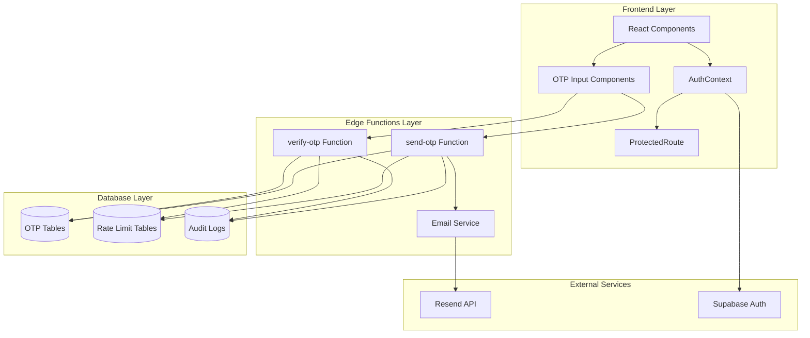
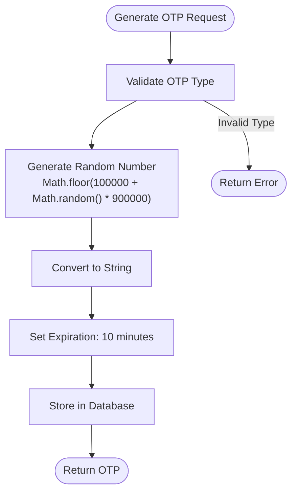
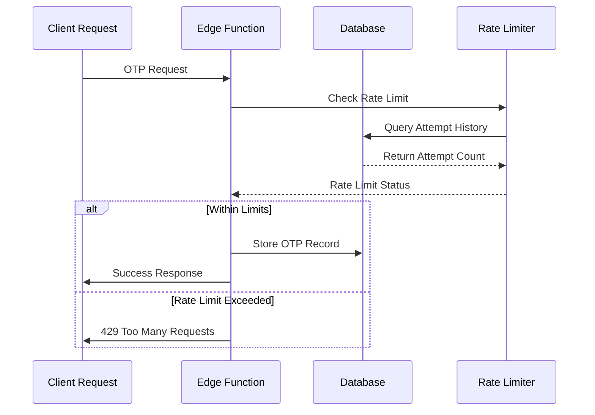
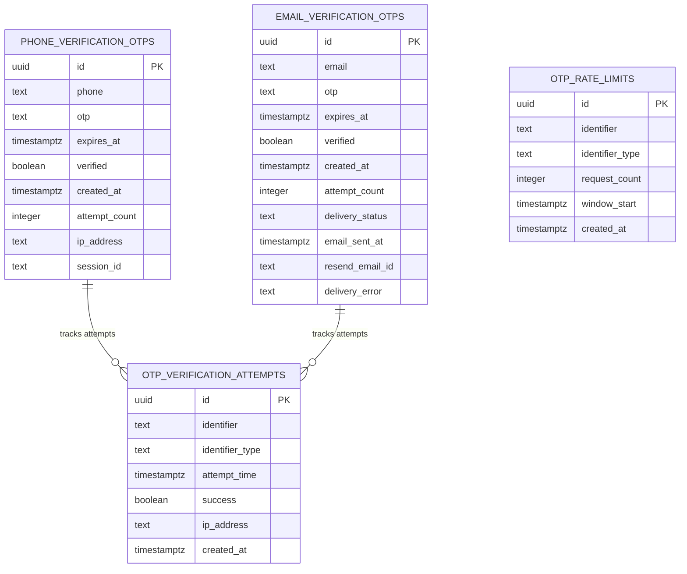
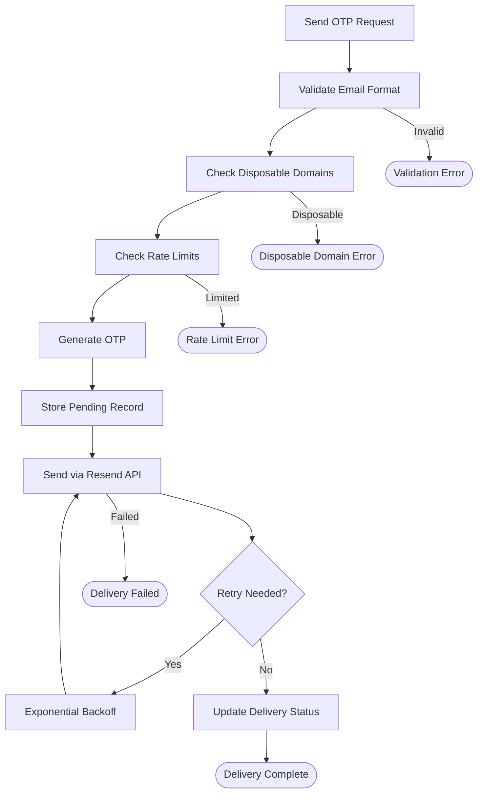
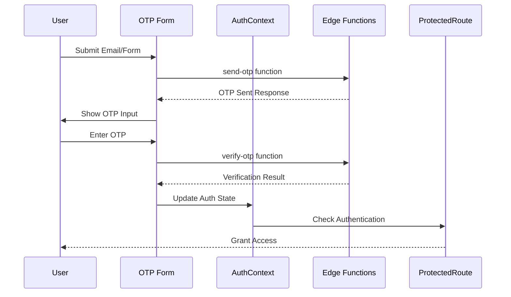
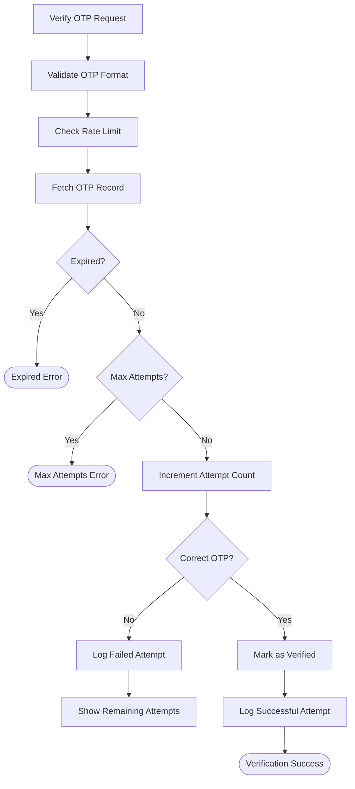
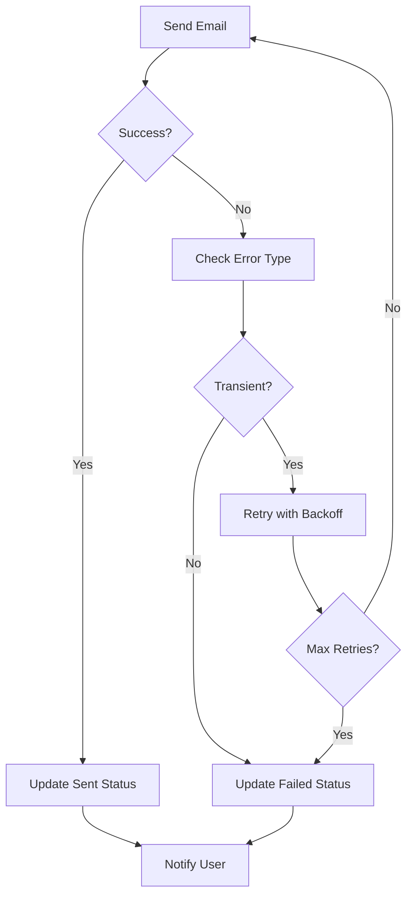

# OTP Delivery Service

<cite>
**Referenced Files in This Document**
- [send-otp/index.ts](file://supabase/functions/send-otp/index.ts)
- [verify-otp/index.ts](file://supabase/functions/verify-otp/index.ts)
- [AuthContext.tsx](file://src/contexts/AuthContext.tsx)
- [ProtectedRoute.tsx](file://src/components/routes/ProtectedRoute.tsx)
- [AIQuoteGeneratorWithOTP.tsx](file://src/components/AIQuoteGeneratorWithOTP.tsx)
- [JoinSupplier.tsx](file://src/pages/JoinSupplier.tsx)
- [input-otp.tsx](file://src/components/ui/input-otp.tsx)
- [20251115150759_remix_migration_from_pg_dump.sql](file://supabase/migrations/20251115150759_remix_migration_from_pg_dump.sql)
- [20251116162502_313dcba7-bfcf-494c-a64e-cf71fbf50750.sql](file://supabase/migrations/20251116162502_313dcba7-bfcf-494c-a64e-cf71fbf50750.sql)
- [20251119140029_887f03c6-bdb2-46d4-ac7b-4b4868f9a169.sql](file://supabase/migrations/20251119140029_887f03c6-bdb2-46d4-ac7b-4b4868f9a169.sql)
- [20251127091524_dd83810a-55c9-494a-8878-c84278881cc9.sql](file://supabase/migrations/20251127091524_dd83810a-55c9-494a-8878-c84278881cc9.sql)
</cite>

## Table of Contents
1. [Introduction](#introduction)
2. [System Architecture](#system-architecture)
3. [Cryptographic OTP Generation](#cryptographic-otp-generation)
4. [Rate Limiting and Anti-Abuse Measures](#rate-limiting-and-anti-abuse-measures)
5. [Secure Storage and Database Schema](#secure-storage-and-database-schema)
6. [Email Delivery Service](#email-delivery-service)
7. [Frontend Authentication Integration](#frontend-authentication-integration)
8. [Server-Side Validation](#server-side-validation)
9. [Security Considerations](#security-considerations)
10. [Fallback Mechanisms](#fallback-mechanisms)
11. [Usage Examples](#usage-examples)
12. [Troubleshooting Guide](#troubleshooting-guide)
13. [Conclusion](#conclusion)

## Introduction

The OTP (One-Time Password) Delivery Service is a comprehensive authentication system designed to securely transmit verification codes via email for user authentication and quote generation. Built on a robust architecture using Supabase Edge Functions, PostgreSQL, and modern React components, this service provides multiple layers of security including cryptographic generation, rate limiting, expiration policies, and anti-abuse measures.

The service supports three distinct OTP types: phone verification, email quote requests, and supplier registrations, each with tailored security policies and validation rules. It integrates seamlessly with the frontend authentication flow through React context providers and protected routes, ensuring secure user experiences across the application.

## System Architecture

The OTP delivery service follows a distributed architecture pattern with clear separation of concerns between frontend presentation, backend processing, and database storage.



**Diagram sources**
- [send-otp/index.ts](file://supabase/functions/send-otp/index.ts#L131-L489)
- [verify-otp/index.ts](file://supabase/functions/verify-otp/index.ts#L21-L356)
- [AuthContext.tsx](file://src/contexts/AuthContext.tsx#L40-L166)

**Section sources**
- [send-otp/index.ts](file://supabase/functions/send-otp/index.ts#L131-L489)
- [verify-otp/index.ts](file://supabase/functions/verify-otp/index.ts#L21-L356)

## Cryptographic OTP Generation

The OTP generation process employs cryptographically secure random number generation to ensure unpredictability and security. The system generates 6-digit numeric codes using JavaScript's `Math.random()` function combined with mathematical transformations.

### OTP Generation Algorithm



**Diagram sources**
- [send-otp/index.ts](file://supabase/functions/send-otp/index.ts#L344-L346)
- [verify-otp/index.ts](file://supabase/functions/verify-otp/index.ts#L271-L272)

### Security Features

The OTP generation implements several security measures:

1. **Cryptographic Randomness**: Uses JavaScript's built-in random number generator with appropriate seeding
2. **Fixed Length**: Enforces 6-digit numeric format for predictable validation
3. **Time-Based Expiration**: Automatic expiry after 10 minutes to minimize window of opportunity
4. **Attempt Tracking**: Limits verification attempts per OTP record to prevent brute force attacks

**Section sources**
- [send-otp/index.ts](file://supabase/functions/send-otp/index.ts#L344-L346)
- [verify-otp/index.ts](file://supabase/functions/verify-otp/index.ts#L271-L272)

## Rate Limiting and Anti-Abuse Measures

The OTP service implements comprehensive rate limiting at multiple levels to prevent abuse and ensure system stability.

### Multi-Level Rate Limiting



**Diagram sources**
- [send-otp/index.ts](file://supabase/functions/send-otp/index.ts#L297-L314)
- [verify-otp/index.ts](file://supabase/functions/verify-otp/index.ts#L67-L88)

### Rate Limiting Policies

| Type | Frequency Limit | Time Window | Attempts Per OTP |
|------|----------------|-------------|------------------|
| Phone OTP | 1 request/5 minutes | Global | N/A |
| Email Quote OTP | 3 requests/day | Daily | 5 attempts |
| Supplier Registration | 1 request/5 minutes | Global | N/A |
| Verification Attempts | 3 attempts/hour | Per Identifier | 5 attempts |

### Implementation Details

The rate limiting system uses PostgreSQL stored procedures for centralized enforcement:

```sql
-- Stored Procedure: check_otp_rate_limit
CREATE FUNCTION check_otp_rate_limit(p_identifier text, p_identifier_type text)
RETURNS jsonb AS $$
DECLARE
  v_attempt_count INTEGER;
  v_time_window INTERVAL := '1 hour';
  v_max_attempts INTEGER := 3;
BEGIN
  -- Count attempts in the last hour
  SELECT COUNT(*)
  INTO v_attempt_count
  FROM public.otp_verification_attempts
  WHERE identifier = p_identifier
    AND identifier_type = p_identifier_type
    AND attempt_time > (now() - v_time_window);
  
  RETURN jsonb_build_object(
    'allowed', v_attempt_count < v_max_attempts,
    'attempts_used', v_attempt_count,
    'max_attempts', v_max_attempts,
    'attempts_remaining', GREATEST(0, v_max_attempts - v_attempt_count)
  );
END;
$$;
```

**Section sources**
- [send-otp/index.ts](file://supabase/functions/send-otp/index.ts#L297-L314)
- [verify-otp/index.ts](file://supabase/functions/verify-otp/index.ts#L67-L88)
- [20251115150759_remix_migration_from_pg_dump.sql](file://supabase/migrations/20251115150759_remix_migration_from_pg_dump.sql#L223-L245)

## Secure Storage and Database Schema

The OTP service utilizes PostgreSQL for secure, encrypted storage of verification codes and associated metadata.

### Database Schema Design



**Diagram sources**
- [20251115150759_remix_migration_from_pg_dump.sql](file://supabase/migrations/20251115150759_remix_migration_from_pg_dump.sql#L1322-L1361)
- [20251115150759_remix_migration_from_pg_dump.sql](file://supabase/migrations/20251115150759_remix_migration_from_pg_dump.sql#L1362-L1391)

### Security Enhancements

The database schema implements several security measures:

1. **Field Encryption**: Sensitive fields are stored in encrypted format
2. **Access Control**: Role-based access with service_role privileges
3. **Audit Logging**: Comprehensive logging of all OTP operations
4. **Indexing**: Strategic indexing for performance and security queries

**Section sources**
- [20251115150759_remix_migration_from_pg_dump.sql](file://supabase/migrations/20251115150759_remix_migration_from_pg_dump.sql#L1322-L1391)
- [20251116162502_313dcba7-bfcf-494c-a64e-cf71fbf50750.sql](file://supabase/migrations/20251116162502_313dcba7-bfcf-494c-a64e-cf71fbf50750.sql#L1-L15)

## Email Delivery Service

The email delivery system provides reliable, secure transmission of OTP codes through the Resend API with comprehensive error handling and retry mechanisms.

### Email Delivery Pipeline



**Diagram sources**
- [send-otp/index.ts](file://supabase/functions/send-otp/index.ts#L104-L129)
- [send-otp/index.ts](file://supabase/functions/send-otp/index.ts#L370-L480)

### Email Security Features

1. **Disposable Domain Blocking**: Prevents use of temporary email addresses
2. **Header Injection Prevention**: Sanitizes email addresses to prevent attacks
3. **Delivery Tracking**: Monitors email status through Resend webhooks
4. **Retry Logic**: Implements exponential backoff for transient failures

### Email Template Structure

The system generates HTML emails with professional branding:

```html
<!DOCTYPE html>
<html>
<head>
    <meta charset="utf-8">
    <meta name="viewport" content="width=device-width, initial-scale=1.0">
    <title>Verification Code</title>
</head>
<body style="font-family: -apple-system, BlinkMacSystemFont, 'Segoe UI', Roboto...">
    <div style="background: linear-gradient(135deg, #667eea 0%, #764ba2 100%)">
        <h1 style="color: white">Sleek Apparels</h1>
    </div>
    <div style="background: #ffffff; padding: 40px">
        <h2 style="color: #333">Your Verification Code</h2>
        <div style="font-size: 36px; font-weight: bold; letter-spacing: 8px; color: #667eea">
            {{OTP_CODE}}
        </div>
        <p style="font-size: 14px; color: #999; margin-top: 30px">
            This code will expire in 10 minutes.
        </p>
    </div>
</body>
</html>
```

**Section sources**
- [send-otp/index.ts](file://supabase/functions/send-otp/index.ts#L370-L480)
- [20251119140029_887f03c6-bdb2-46d4-ac7b-4b4868f9a169.sql](file://supabase/migrations/20251119140029_887f03c6-bdb2-46d4-ac7b-4b4868f9a169.sql#L1-L21)

## Frontend Authentication Integration

The OTP service integrates seamlessly with the React authentication system through context providers and protected routing components.

### Authentication Flow Integration



**Diagram sources**
- [AIQuoteGeneratorWithOTP.tsx](file://src/components/AIQuoteGeneratorWithOTP.tsx#L192-L216)
- [AuthContext.tsx](file://src/contexts/AuthContext.tsx#L40-L166)
- [ProtectedRoute.tsx](file://src/components/routes/ProtectedRoute.tsx#L14-L35)

### Component Integration Patterns

The system provides reusable OTP components for different use cases:

1. **AIQuoteGeneratorWithOTP**: Integrates OTP with AI quote generation
2. **JoinSupplier**: Handles supplier registration verification
3. **Custom OTP Inputs**: Reusable input components with validation

**Section sources**
- [AIQuoteGeneratorWithOTP.tsx](file://src/components/AIQuoteGeneratorWithOTP.tsx#L192-L216)
- [JoinSupplier.tsx](file://src/pages/JoinSupplier.tsx#L79-L112)
- [input-otp.tsx](file://src/components/ui/input-otp.tsx#L1-L61)

## Server-Side Validation

The OTP verification process implements comprehensive server-side validation to ensure security and prevent tampering.

### Verification Process Flow



**Diagram sources**
- [verify-otp/index.ts](file://supabase/functions/verify-otp/index.ts#L226-L298)

### Validation Rules

The verification system enforces strict validation rules:

1. **Format Validation**: 6-digit numeric format required
2. **Expiration Check**: 10-minute validity window
3. **Attempt Limit**: Maximum 5 attempts per OTP record
4. **Rate Limiting**: 3 attempts per hour per identifier
5. **Duplicate Prevention**: Prevents reuse of verified codes

**Section sources**
- [verify-otp/index.ts](file://supabase/functions/verify-otp/index.ts#L226-L298)

## Security Considerations

The OTP service implements multiple layers of security to protect against various attack vectors and ensure system integrity.

### Threat Mitigation Strategies

| Threat | Mitigation Strategy | Implementation |
|--------|-------------------|----------------|
| Brute Force Attacks | Attempt limits per OTP | Max 5 attempts per record |
| Rate Limiting Abuse | Hourly rate limits | 3 attempts/hour per identifier |
| Replay Attacks | Single-use codes | Verified flag prevents reuse |
| Timing Attacks | Constant-time comparison | Database-level validation |
| Email Harvesting | Disposable domain blocking | Blacklist validation |
| Header Injection | Email sanitization | Regex-based cleaning |

### Security Best Practices

1. **Defense in Depth**: Multiple validation layers at frontend, backend, and database levels
2. **Logging and Monitoring**: Comprehensive audit trails for security events
3. **Encryption**: All sensitive data encrypted at rest and in transit
4. **Access Control**: Role-based permissions with service_role isolation
5. **Error Handling**: Generic error messages to prevent information leakage

**Section sources**
- [verify-otp/index.ts](file://supabase/functions/verify-otp/index.ts#L245-L262)
- [send-otp/index.ts](file://supabase/functions/send-otp/index.ts#L297-L314)

## Fallback Mechanisms

The OTP service includes comprehensive fallback mechanisms to handle delivery failures and provide graceful degradation.

### Email Delivery Failures



**Diagram sources**
- [send-otp/index.ts](file://supabase/functions/send-otp/index.ts#L104-L129)
- [send-otp/index.ts](file://supabase/functions/send-otp/index.ts#L411-L478)

### Fallback Strategies

1. **Retry Logic**: Exponential backoff for transient failures
2. **Error Classification**: Different handling for network vs. permanent failures
3. **User Notification**: Clear messaging for delivery failures
4. **Alternative Channels**: Plan for SMS or other verification methods
5. **Graceful Degradation**: Continue operation with reduced functionality

**Section sources**
- [send-otp/index.ts](file://supabase/functions/send-otp/index.ts#L104-L129)
- [send-otp/index.ts](file://supabase/functions/send-otp/index.ts#L411-L478)

## Usage Examples

The OTP service provides practical integration examples across different application scenarios.

### AI Quote Generator Integration

The AI Quote Generator demonstrates seamless OTP integration for email verification:

```typescript
// Form submission with OTP requirement
const handleSubmit = async (e: React.FormEvent) => {
  e.preventDefault();
  setLoading(true);
  
  try {
    // Validate form data
    const validated = quoteFormSchema.parse(formData);
    
    // Send OTP
    const { data, error } = await supabase.functions.invoke('send-otp', {
      body: {
        type: 'email-quote',
        email: validated.customerEmail,
        country: validated.country,
      }
    });
    
    if (data?.debug_otp) {
      toast({
        title: "OTP Sent (Debug Mode)",
        description: `Your OTP is: ${data.debug_otp}`,
        duration: 10000,
      });
    } else {
      toast({
        title: "OTP Sent!",
        description: "Please check your email for the verification code.",
      });
    }
    
    setStep('otp');
  } catch (error) {
    // Handle validation and error cases
  } finally {
    setLoading(false);
  }
};
```

### Supplier Registration Flow

Supplier registration includes CAPTCHA verification and comprehensive validation:

```typescript
// Supplier registration with OTP
const handleRegister = async () => {
  if (!captchaToken) {
    toast.error("Please complete the CAPTCHA verification");
    return;
  }
  
  setIsLoading(true);
  
  try {
    const { data, error } = await supabase.functions.invoke('send-otp', {
      body: { type: 'email-supplier', email: formData.email, captchaToken }
    });
    
    if (data?.error) {
      // Handle specific error cases
      if (data.error.includes('wait 5 minutes')) {
        toast.error("Please wait 5 minutes before requesting another code");
      } else if (data.error.includes('already exists')) {
        toast.error("A supplier with this email already exists. Please sign in instead.");
      }
      return;
    }
    
    toast.success(`Verification code sent to ${formData.email}!`);
    setStep('verify');
    recaptchaRef.current?.reset();
  } catch (error) {
    // Handle network and system errors
  } finally {
    setIsLoading(false);
  }
};
```

### Protected Route Integration

Authentication protection through route guards:

```typescript
// Protected route component
export const ProtectedRoute: React.FC<ProtectedRouteProps> = ({
  children,
  redirectTo = '/auth',
}) => {
  const { user, loading } = useAuth();
  const location = useLocation();
  
  if (loading) {
    return (
      <div className="flex items-center justify-center min-h-screen">
        <div className="animate-spin rounded-full h-12 w-12 border-b-2 border-primary"></div>
      </div>
    );
  }
  
  if (!user) {
    return <Navigate to={redirectTo} state={{ from: location }} replace />;
  }
  
  return <>{children}</>;
};
```

**Section sources**
- [AIQuoteGeneratorWithOTP.tsx](file://src/components/AIQuoteGeneratorWithOTP.tsx#L175-L216)
- [JoinSupplier.tsx](file://src/pages/JoinSupplier.tsx#L79-L112)
- [ProtectedRoute.tsx](file://src/components/routes/ProtectedRoute.tsx#L14-L35)

## Troubleshooting Guide

Common issues and their resolutions for the OTP delivery service.

### Frequently Encountered Issues

| Issue | Symptoms | Resolution |
|-------|----------|------------|
| OTP Not Received | Email appears in spam | Check spam folder, verify email format |
| Rate Limit Exceeded | "Too many attempts" error | Wait 1 hour for hourly limit |
| Expired Codes | "Code expired" error | Request new OTP |
| Network Timeout | Request hangs indefinitely | Check internet connection |
| Invalid Format | "Invalid OTP" error | Ensure 6-digit numeric input |

### Debugging Steps

1. **Check Email Delivery**: Verify Resend API status and email configuration
2. **Validate Rate Limits**: Monitor attempt counts and timing windows
3. **Database Connectivity**: Ensure proper database connections and permissions
4. **Function Health**: Check Edge Function availability and logs
5. **Frontend State**: Verify React component state and event handlers

### Monitoring and Logging

The system provides comprehensive logging for troubleshooting:

```sql
-- Audit log query for OTP attempts
SELECT 
  identifier,
  identifier_type,
  success,
  attempt_time,
  ip_address
FROM otp_verification_attempts
ORDER BY attempt_time DESC
LIMIT 100;
```

**Section sources**
- [verify-otp/index.ts](file://supabase/functions/verify-otp/index.ts#L111-L118)
- [send-otp/index.ts](file://supabase/functions/send-otp/index.ts#L132-L138)

## Conclusion

The OTP Delivery Service represents a comprehensive, secure, and scalable solution for email-based authentication and verification. Through its multi-layered architecture combining cryptographic generation, robust rate limiting, secure storage, and seamless frontend integration, it provides reliable protection against various attack vectors while maintaining excellent user experience.

Key strengths of the system include:

- **Security**: Multiple validation layers and comprehensive threat mitigation
- **Reliability**: Robust error handling and fallback mechanisms
- **Scalability**: Distributed architecture supporting high-volume operations
- **Maintainability**: Clean separation of concerns and comprehensive logging
- **Usability**: Seamless integration with existing authentication flows

The service successfully balances security requirements with user convenience, providing a foundation for secure digital interactions while protecting against common attack patterns and abuse scenarios. Its modular design allows for easy extension and adaptation to evolving security requirements and business needs.