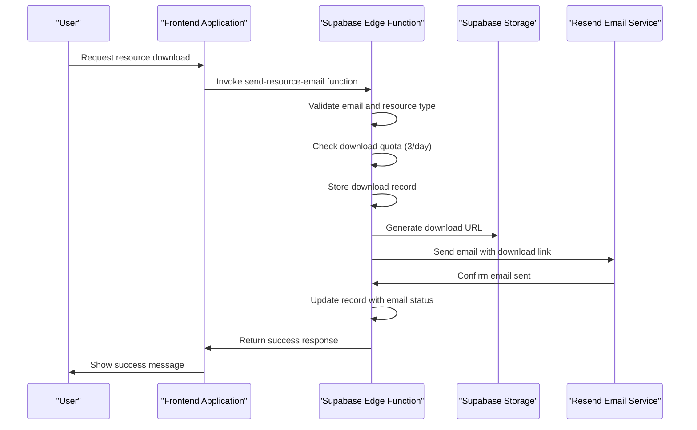
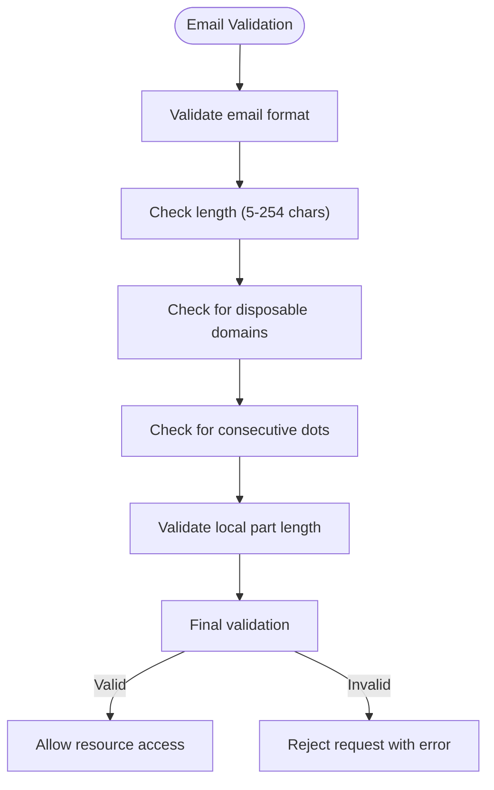
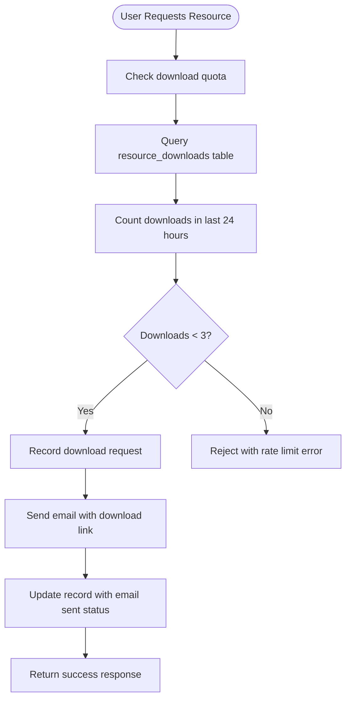
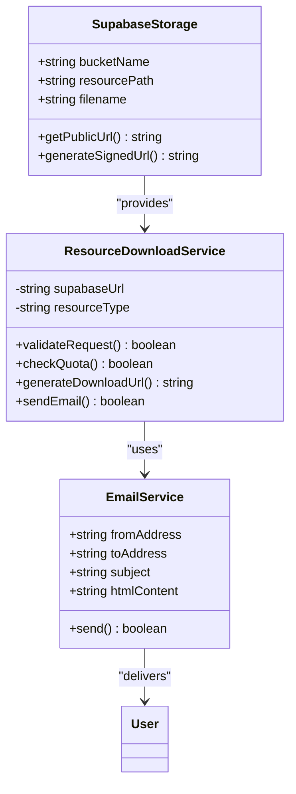
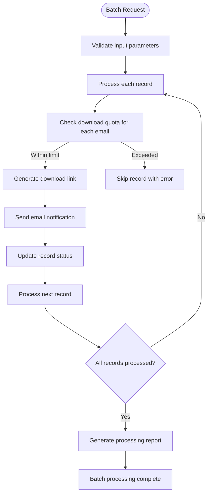
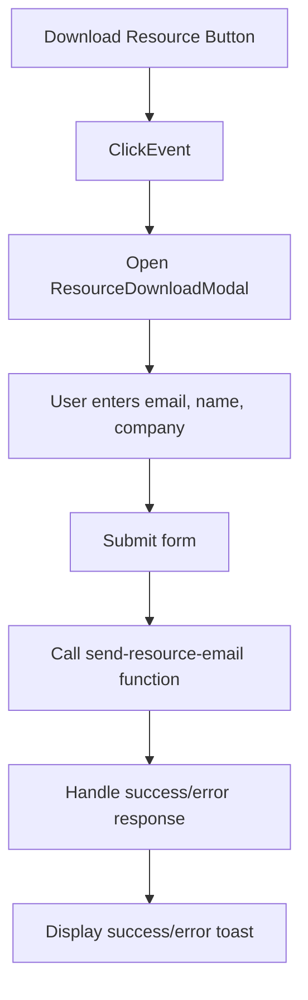
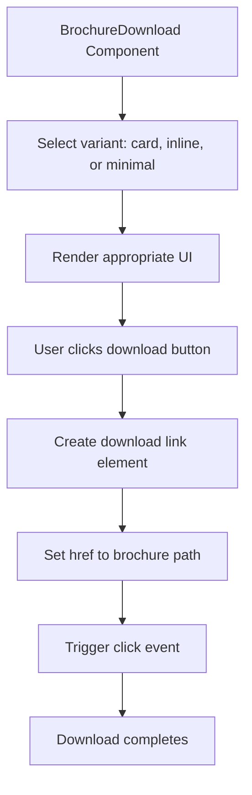

# Resource Distribution Service

<cite>
**Referenced Files in This Document**   
- [ResourceDownloadModal.tsx](file://src/components/ResourceDownloadModal.tsx)
- [BrochureDownload.tsx](file://src/components/BrochureDownload.tsx)
- [send-resource-email/index.ts](file://supabase/functions/send-resource-email/index.ts)
- [20251126153950_c7e943cb-2683-48e9-9c3a-6016f721a744.sql](file://supabase/migrations/20251126153950_c7e943cb-2683-48e9-9c3a-6016f721a744.sql)
- [ResourcesSection.tsx](file://src/components/ResourcesSection.tsx)
- [BACKEND_CONFIGURATION_AUDIT.md](file://BACKEND_CONFIGURATION_AUDIT.md)
</cite>

## Table of Contents
1. [Introduction](#introduction)
2. [Workflow Overview](#workflow-overview)
3. [Core Components](#core-components)
4. [Access Validation](#access-validation)
5. [Download Quota Enforcement](#download-quota-enforcement)
6. [Supabase Storage Integration](#supabase-storage-integration)
7. [Template Customization](#template-customization)
8. [Batch Processing Capabilities](#batch-processing-capabilities)
9. [Error Handling](#error-handling)
10. [Integration Examples](#integration-examples)
11. [Analytics and Tracking](#analytics-and-tracking)

## Introduction

The Resource Distribution Service manages automated delivery of downloadable content such as brochures, catalogs, and technical documents. This service handles the complete workflow from user request to email delivery, including access validation, download quota enforcement, and attachment generation. The system integrates with Supabase Storage for asset retrieval, generates secure pre-signed URLs, and tracks download events for analytics purposes.

The service supports multiple resource types including buyer's guides and material charts, with customizable templates and robust error handling for missing or restricted resources. It provides both modal-based and direct download interfaces for different user experience requirements.

**Section sources**
- [ResourceDownloadModal.tsx](file://src/components/ResourceDownloadModal.tsx#L1-L187)
- [BrochureDownload.tsx](file://src/components/BrochureDownload.tsx#L1-L93)

## Workflow Overview

The resource distribution workflow follows a structured process from user request to successful delivery:



**Diagram sources**
- [send-resource-email/index.ts](file://supabase/functions/send-resource-email/index.ts#L72-L231)
- [ResourceDownloadModal.tsx](file://src/components/ResourceDownloadModal.tsx#L42-L54)

## Core Components

The Resource Distribution Service consists of several key components that work together to deliver downloadable content:

1. **ResourceDownloadModal**: A React component that provides a modal interface for users to request resources by entering their email and other optional information.

2. **BrochureDownload**: A component that enables direct brochure downloads with multiple presentation variants (card, inline, minimal).

3. **send-resource-email**: A Supabase Edge Function that handles the server-side processing of resource requests, including validation, quota enforcement, and email delivery.

4. **resource_downloads table**: A database table that tracks all download requests for analytics and quota enforcement.

**Section sources**
- [ResourceDownloadModal.tsx](file://src/components/ResourceDownloadModal.tsx#L1-L187)
- [BrochureDownload.tsx](file://src/components/BrochureDownload.tsx#L1-L93)
- [send-resource-email/index.ts](file://supabase/functions/send-resource-email/index.ts#L72-L231)

## Access Validation

The service implements comprehensive access validation to ensure only legitimate users can download resources:

### Email Validation
The system performs multiple validation checks on email addresses:
- Format validation using a comprehensive regex pattern
- Length validation (5-254 characters)
- Disposable email domain blocking
- Consecutive dot prevention
- Local part length validation (max 64 characters)



**Diagram sources**
- [send-resource-email/index.ts](file://supabase/functions/send-resource-email/index.ts#L13-L41)
- [email-service/index.ts](file://supabase/functions/email-service/index.ts#L32-L65)

## Download Quota Enforcement

The service enforces a strict download quota of 3 resources per email address per day to prevent abuse:



The quota enforcement is implemented in the `send-resource-email` edge function, which queries the `resource_downloads` table to count the number of downloads for the requesting email address within the past 24 hours. If the count reaches 3 or more, the request is rejected with a 429 status code.

**Section sources**
- [send-resource-email/index.ts](file://supabase/functions/send-resource-email/index.ts#L95-L108)
- [20251126153950_c7e943cb-2683-48e9-9c3a-6016f721a744.sql#L1-L34)

## Supabase Storage Integration

The service integrates with Supabase Storage to manage and deliver downloadable resources:

### Storage Architecture


### URL Generation Process
The service generates download URLs by transforming the Supabase URL to a custom domain:
```
https://eqpftggctumujhutomom.supabase.co/resources/{filename}
↓
https://lovable.app/resources/{filename}
```

This custom domain approach provides a branded experience and allows for better tracking and analytics.

**Section sources**
- [send-resource-email/index.ts](file://supabase/functions/send-resource-email/index.ts#L135-L136)
- [BACKEND_CONFIGURATION_AUDIT.md](file://BACKEND_CONFIGURATION_AUDIT.md#L72-L76)

## Template Customization

The service supports template customization for different resource types and use cases:

### Resource Types
The system currently supports two resource types with distinct templates:

| Resource Type | Title | Filename | Subject Line |
|---------------|-------|---------|-------------|
| buyers_guide | Custom Apparel Buyer's Guide | custom-apparel-buyers-guide.pdf | Your Custom Apparel Buyer's Guide is Ready |
| material_chart | Material Comparison Chart | material-comparison-chart.pdf | Your Material Comparison Chart is Ready |

### Email Template Structure
The email templates include:
- Branded header with gradient background
- Personalized greeting with optional name
- Resource details with title, description, and download button
- Call-to-action section promoting the LoopTrace™ platform
- Company value proposition with key selling points
- Contact information and footer

The templates are fully customizable and can be extended to support additional resource types and branding requirements.

**Section sources**
- [send-resource-email/index.ts](file://supabase/functions/send-resource-email/index.ts#L51-L64)
- [send-resource-email/index.ts](file://supabase/functions/send-resource-email/index.ts#L142-L197)

## Batch Processing Capabilities

While the primary focus is on individual resource downloads, the system architecture supports batch processing capabilities through integration with other services:

### Batch Processing Workflow


The batch processing capabilities are primarily handled by the `batch-processor` edge function, which can orchestrate multiple operations including resource distribution. This allows for bulk distribution of resources to mailing lists or customer segments while respecting individual download quotas.

**Section sources**
- [batch-processor/index.ts](file://supabase/functions/batch-processor/index.ts#L56-L376)
- [send-resource-email/index.ts](file://supabase/functions/send-resource-email/index.ts#L72-L231)

## Error Handling

The service implements comprehensive error handling for various failure scenarios:

### Error Types and Responses
| Error Type | HTTP Status | Response Message | Handling Strategy |
|-----------|------------|------------------|-------------------|
| Invalid email | 400 | "Email is required" or format-specific error | Client-side validation with user feedback |
| Disposable email | 400 | "Disposable email addresses are not allowed" | Block known disposable domains |
| Invalid resource type | 400 | "Invalid resource type" | Validate against allowed types |
| Rate limit exceeded | 429 | "Rate limit exceeded. Please try again tomorrow." | Track downloads by email and 24-hour window |
| Database error | 500 | "Failed to process request" | Log error and fail gracefully |
| Email service error | 500 | "Unknown error" | Log error and return generic message |

### Client-Side Error Handling
The `ResourceDownloadModal` component handles errors by displaying appropriate toast notifications:
- Rate limit errors show a specific message about the daily limit
- Disposable email errors prompt users to use permanent addresses
- General errors provide a generic failure message with retry suggestion

The error handling ensures a smooth user experience while maintaining system security and reliability.

**Section sources**
- [send-resource-email/index.ts](file://supabase/functions/send-resource-email/index.ts#L221-L228)
- [ResourceDownloadModal.tsx](file://src/components/ResourceDownloadModal.tsx#L66-L75)

## Integration Examples

The service provides two primary integration patterns for different use cases:

### ResourceDownloadModal Integration
The modal component is designed for gated content where users must provide their information:



**Section sources**
- [ResourcesSection.tsx](file://src/components/ResourcesSection.tsx#L7-89)
- [ResourceDownloadModal.tsx](file://src/components/ResourceDownloadModal.tsx#L17-L187)

### BrochureDownload Integration
The direct download component is designed for immediate access without information collection:



The BrochureDownload component supports three variants:
- **Card**: Prominent display with icon, title, description, and download button
- **Inline**: Button with download icon, suitable for within content
- **Minimal**: Link-style button with minimal styling

**Section sources**
- [BrochureDownload.tsx](file://src/components/BrochureDownload.tsx#L1-L93)
- [Brochure.tsx](file://src/pages/Brochure.tsx#L1-L193)

## Analytics and Tracking

The service includes comprehensive analytics and tracking capabilities:

### Database Schema
The `resource_downloads` table captures detailed information about each download request:

```sql
CREATE TABLE IF NOT EXISTS public.resource_downloads (
  id UUID PRIMARY KEY DEFAULT gen_random_uuid(),
  email TEXT NOT NULL,
  full_name TEXT,
  company_name TEXT,
  resource_type TEXT NOT NULL CHECK (resource_type IN ('buyers_guide', 'material_chart')),
  source TEXT DEFAULT 'homepage',
  ip_address TEXT,
  user_agent TEXT,
  email_sent BOOLEAN DEFAULT false,
  email_sent_at TIMESTAMPTZ,
  created_at TIMESTAMPTZ DEFAULT now()
);
```

### Tracking Data Points
For each download request, the system captures:
- User information (email, name, company)
- Resource type requested
- Source of the request
- IP address and user agent
- Timestamp of request
- Email delivery status and timestamp

### Indexing and Performance
The table includes optimized indexes for common queries:
- `idx_resource_downloads_email` on email field
- `idx_resource_downloads_created_at` on created_at field (descending)
- `idx_resource_downloads_resource_type` on resource_type field

These indexes ensure fast query performance for analytics and quota enforcement operations.

**Section sources**
- [20251126153950_c7e943cb-2683-48e9-9c3a-6016f721a744.sql](file://supabase/migrations/20251126153950_c7e943cb-2683-48e9-9c3a-6016f721a744.sql#L1-L34)
- [send-resource-email/index.ts](file://supabase/functions/send-resource-email/index.ts#L115-L127)