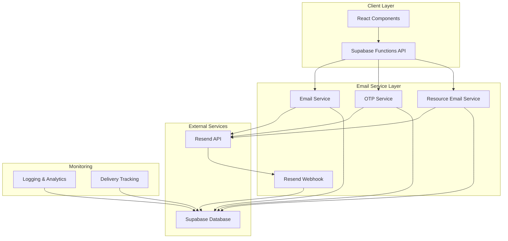
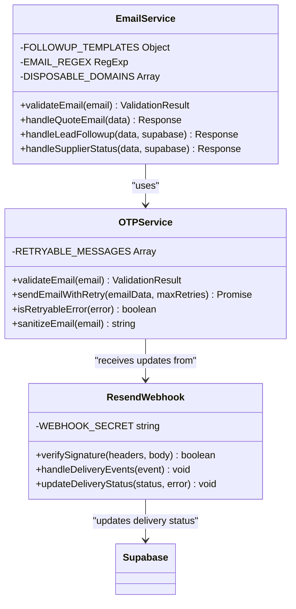
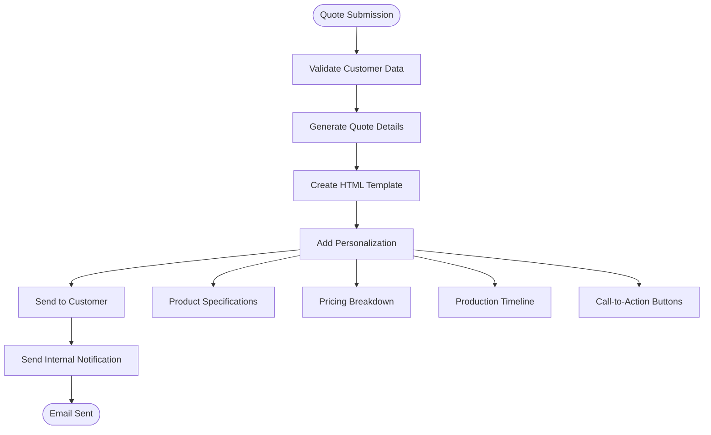
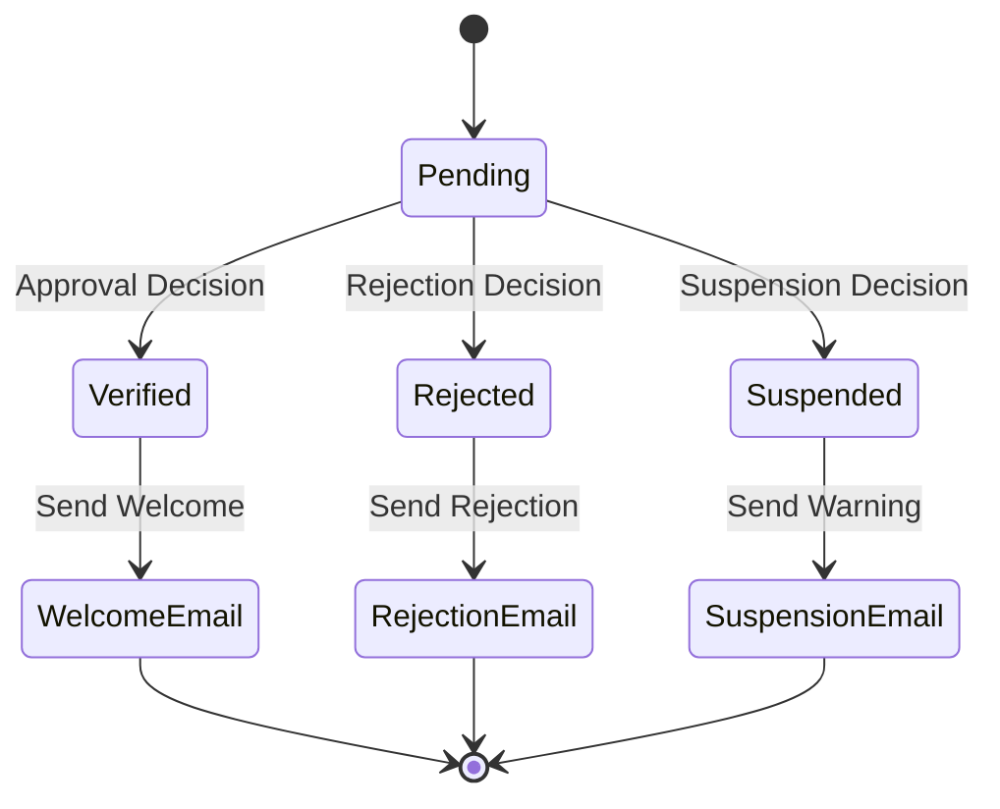
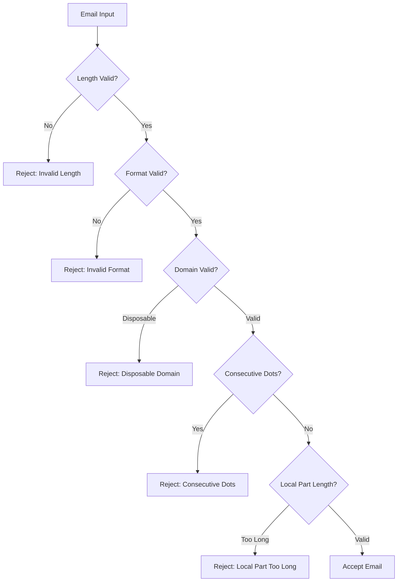
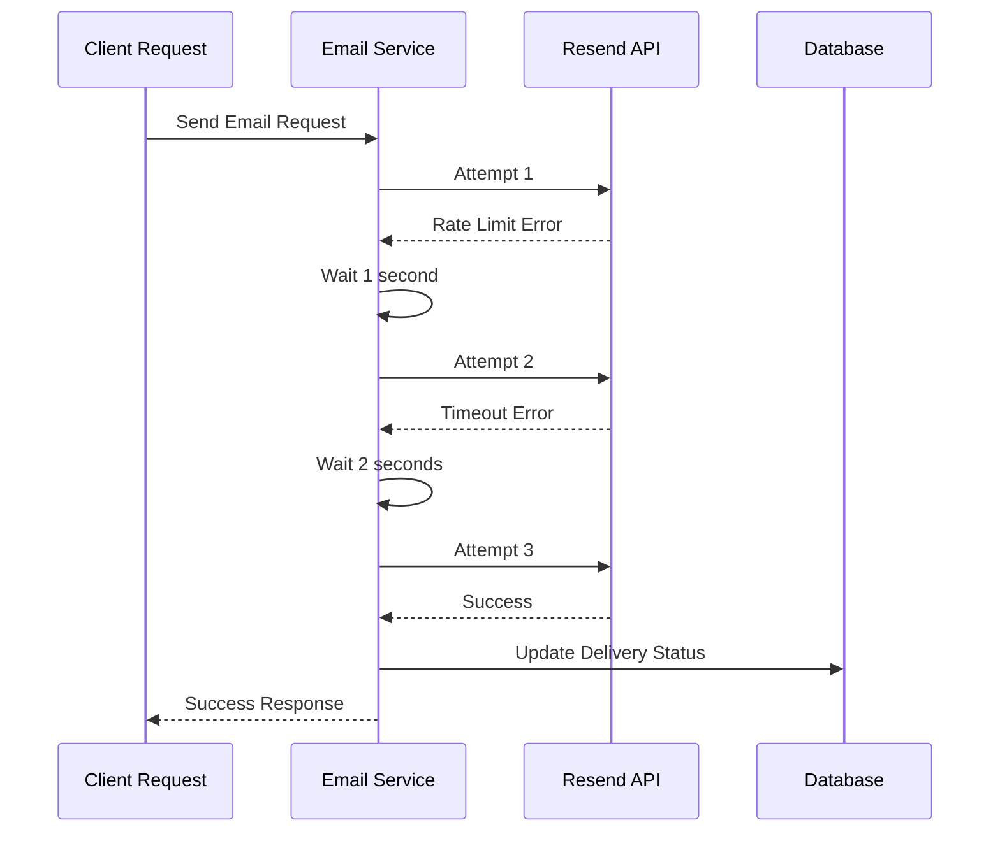
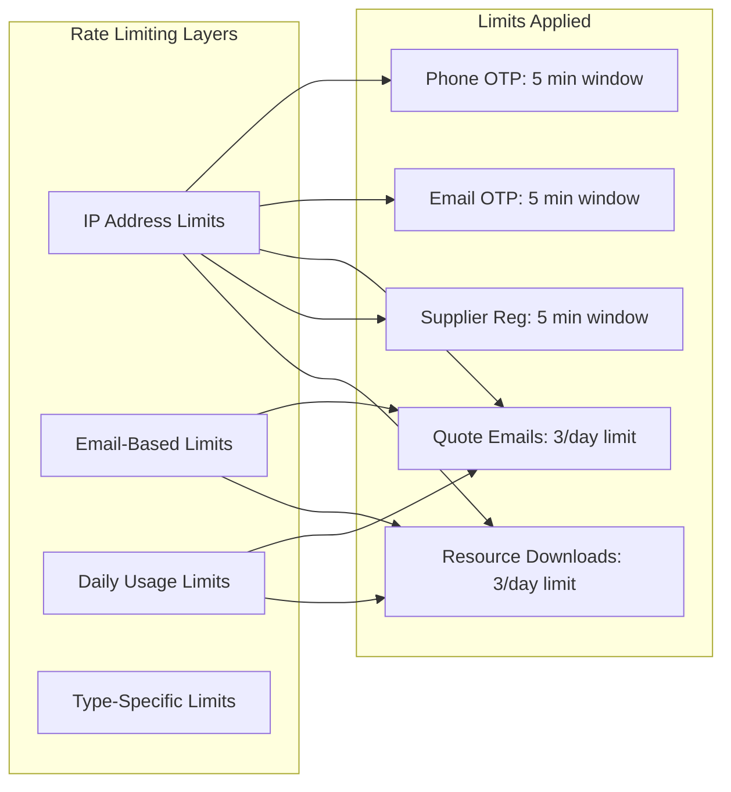
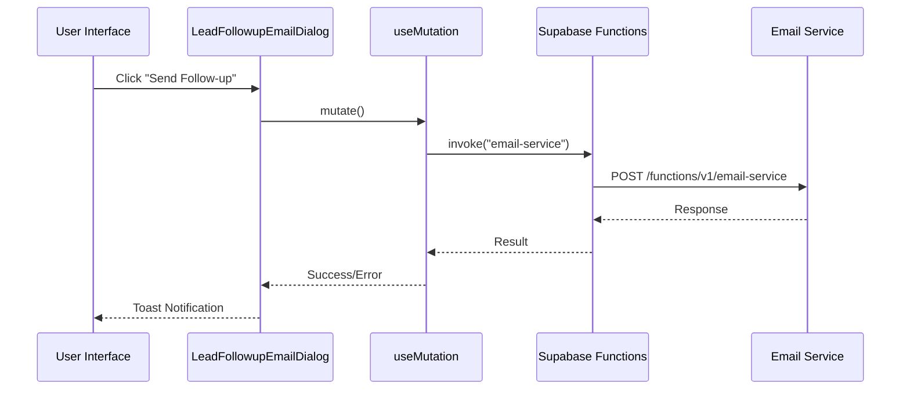
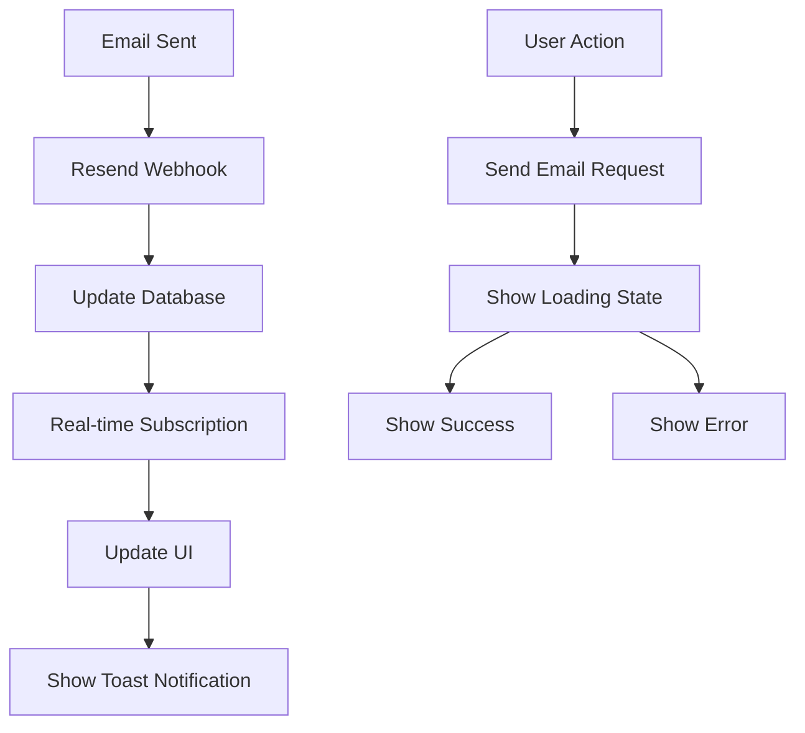
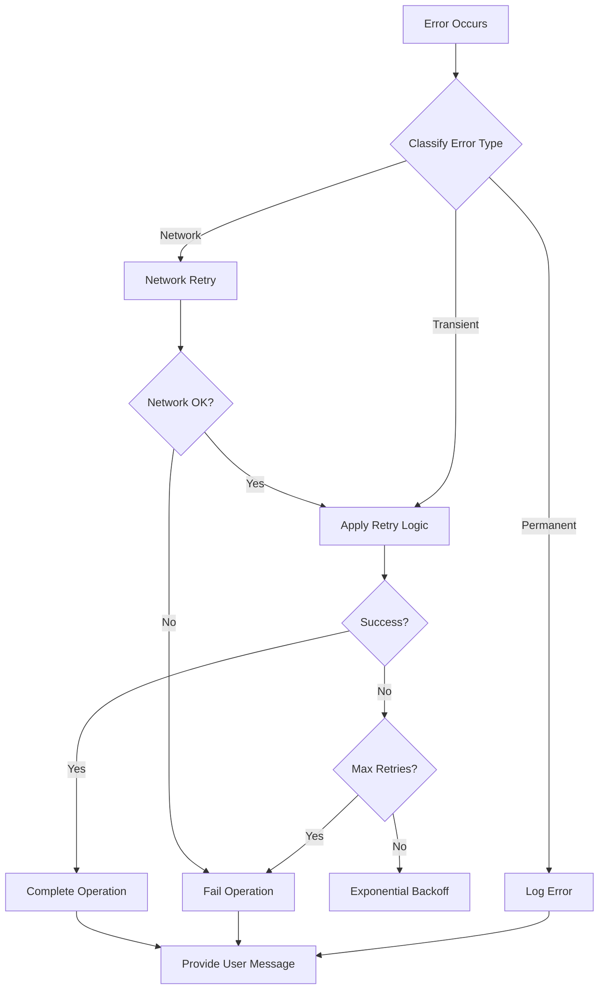

# Transactional Email Service

<cite>
**Referenced Files in This Document**
- [email-service/index.ts](file://supabase/functions/email-service/index.ts)
- [send-otp/index.ts](file://supabase/functions/send-otp/index.ts)
- [resend-webhook/index.ts](file://supabase/functions/resend-webhook/index.ts)
- [send-resource-email/index.ts](file://supabase/functions/send-resource-email/index.ts)
- [LeadFollowupEmailDialog.tsx](file://src/components/LeadFollowupEmailDialog.tsx)
- [20251119140029_887f03c6-bdb2-46d4-ac7b-4b4868f9a169.sql](file://supabase/migrations/20251119140029_887f03c6-bdb2-46d4-ac7b-4b4868f9a169.sql)
- [NotificationBell.tsx](file://src/components/NotificationBell.tsx)
- [UserSettings.tsx](file://src/pages/UserSettings.tsx)
</cite>

## Table of Contents
1. [Introduction](#introduction)
2. [System Architecture](#system-architecture)
3. [Core Components](#core-components)
4. [Email Templates and Personalization](#email-templates-and-personalization)
5. [Security and Validation](#security-and-validation)
6. [Delivery Management](#delivery-management)
7. [Rate Limiting and Abuse Prevention](#rate-limiting-and-abuse-prevention)
8. [Client-Side Integration](#client-side-integration)
9. [Monitoring and Analytics](#monitoring-and-analytics)
10. [Error Handling and Recovery](#error-handling-and-recovery)
11. [Best Practices](#best-practices)

## Introduction

The Sleek Apparels transactional email service is a comprehensive system built on Supabase Functions that handles all outbound communication including order confirmations, production updates, quote deliveries, and system notifications. The service integrates with Resend API for reliable email delivery while implementing robust security measures, rate limiting, and delivery tracking capabilities.

The system supports multiple email types including quote confirmations, lead follow-ups, supplier status notifications, and resource downloads, with dynamic content personalization based on user context and order data.

## System Architecture

The email service follows a microservices architecture with clear separation of concerns:



**Diagram sources**
- [email-service/index.ts](file://supabase/functions/email-service/index.ts#L1-L50)
- [send-otp/index.ts](file://supabase/functions/send-otp/index.ts#L1-L50)
- [resend-webhook/index.ts](file://supabase/functions/resend-webhook/index.ts#L1-L50)

**Section sources**
- [email-service/index.ts](file://supabase/functions/email-service/index.ts#L1-L100)
- [send-otp/index.ts](file://supabase/functions/send-otp/index.ts#L1-L100)

## Core Components

### Email Service Function

The primary email service handles various email types with comprehensive validation and delivery tracking:



**Diagram sources**
- [email-service/index.ts](file://supabase/functions/email-service/index.ts#L12-L100)
- [send-otp/index.ts](file://supabase/functions/send-otp/index.ts#L50-L130)
- [resend-webhook/index.ts](file://supabase/functions/resend-webhook/index.ts#L15-L80)

### Email Types and Handlers

The system supports three primary email types:

| Email Type | Purpose | Trigger Conditions | Delivery Features |
|------------|---------|-------------------|-------------------|
| `quote` | Quote confirmations and customer notifications | Quote submission completion | Dynamic pricing, product details, CTAs |
| `lead-followup` | Sales lead nurturing | Admin manual triggers | Template-based messaging, custom content |
| `supplier-status` | Supplier application updates | Application status changes | Status-specific templates, dashboard links |

**Section sources**
- [email-service/index.ts](file://supabase/functions/email-service/index.ts#L67-L100)
- [email-service/index.ts](file://supabase/functions/email-service/index.ts#L187-L220)

## Email Templates and Personalization

### Quote Confirmation Template

The quote confirmation template dynamically generates personalized content based on order specifics:



**Diagram sources**
- [email-service/index.ts](file://supabase/functions/email-service/index.ts#L221-L352)

### Lead Follow-up Templates

The system provides three distinct follow-up templates for different sales scenarios:

| Template Type | Use Case | Key Features | Timing |
|---------------|----------|--------------|--------|
| `gentle` | Initial follow-up | Friendly tone, open-ended questions | 24-48 hours after quote |
| `discount` | Urgent conversion | Special offers, time-limited discounts | 72-96 hours after quote |
| `urgent` | Last chance reminder | Quote expiration warnings | 5-7 days after quote |

**Section sources**
- [email-service/index.ts](file://supabase/functions/email-service/index.ts#L111-L184)

### Supplier Status Notifications

Supplier status emails use status-specific templates with appropriate branding and action items:



**Diagram sources**
- [email-service/index.ts](file://supabase/functions/email-service/index.ts#L414-L552)

**Section sources**
- [email-service/index.ts](file://supabase/functions/email-service/index.ts#L414-L552)

## Security and Validation

### Email Validation Pipeline

The system implements comprehensive email validation to prevent abuse and ensure deliverability:



**Diagram sources**
- [send-otp/index.ts](file://supabase/functions/send-otp/index.ts#L51-L94)
- [email-service/index.ts](file://supabase/functions/email-service/index.ts#L51-L65)

### Security Measures

| Security Layer | Implementation | Purpose |
|----------------|----------------|---------|
| **Email Sanitization** | Header injection prevention | Prevents malicious email headers |
| **Disposable Domain Blocking** | Whitelist/blacklist validation | Blocks temporary email services |
| **Rate Limiting** | Per-email and per-day limits | Prevents abuse and spam |
| **Webhook Authentication** | HMAC signature verification | Ensures webhook authenticity |
| **Input Validation** | Comprehensive regex patterns | Validates email format and structure |

**Section sources**
- [send-otp/index.ts](file://supabase/functions/send-otp/index.ts#L46-L50)
- [send-otp/index.ts](file://supabase/functions/send-otp/index.ts#L18-L23)
- [resend-webhook/index.ts](file://supabase/functions/resend-webhook/index.ts#L40-L58)

## Delivery Management

### Retry Mechanism with Exponential Backoff

The system implements intelligent retry logic for transient failures:



**Diagram sources**
- [send-otp/index.ts](file://supabase/functions/send-otp/index.ts#L104-L129)

### Delivery Status Tracking

The system tracks email delivery through multiple states:

| Delivery Status | Description | Action Required |
|-----------------|-------------|-----------------|
| `pending` | Email queued for delivery | Monitor delivery attempts |
| `sent` | Successfully delivered to Resend | Wait for final status |
| `delivered` | Email received by recipient | Complete tracking |
| `bounced` | Email rejected by recipient | Investigate bounce reason |
| `failed` | Permanent delivery failure | Manual intervention needed |

**Section sources**
- [resend-webhook/index.ts](file://supabase/functions/resend-webhook/index.ts#L69-L103)
- [20251119140029_887f03c6-bdb2-46d4-ac7b-4b4868f9a169.sql](file://supabase/migrations/20251119140029_887f03c6-bdb2-46d4-ac7b-4b4868f9a169.sql#L1-L21)

## Rate Limiting and Abuse Prevention

### Multi-Level Rate Limiting

The system implements comprehensive rate limiting across different email types:



**Diagram sources**
- [send-otp/index.ts](file://supabase/functions/send-otp/index.ts#L205-L342)
- [send-resource-email/index.ts](file://supabase/functions/send-resource-email/index.ts#L95-L108)

### Abuse Prevention Features

| Protection Level | Implementation | Thresholds |
|------------------|----------------|------------|
| **OTP Attempts** | Maximum 5 verification attempts per email | Automatic blocking after 5 failed attempts |
| **Daily Quota** | 3 quote requests per email per day | Rate limit enforcement with clear messaging |
| **Download Limits** | 3 resource downloads per email per day | Graceful degradation with retry suggestions |
| **CAPTCHA Protection** | Google reCAPTCHA for supplier registration | Bot detection and prevention |

**Section sources**
- [send-otp/index.ts](file://supabase/functions/send-otp/index.ts#L205-L342)
- [send-resource-email/index.ts](file://supabase/functions/send-resource-email/index.ts#L95-L108)

## Client-Side Integration

### React Component Integration

The system provides seamless React component integration for triggering emails:



**Diagram sources**
- [LeadFollowupEmailDialog.tsx](file://src/components/LeadFollowupEmailDialog.tsx#L31-L65)

### Real-time Notification System

The client-side notification system provides real-time feedback on email status:



**Diagram sources**
- [LeadFollowupEmailDialog.tsx](file://src/components/LeadFollowupEmailDialog.tsx#L31-L65)
- [NotificationBell.tsx](file://src/components/NotificationBell.tsx#L46-L69)

**Section sources**
- [LeadFollowupEmailDialog.tsx](file://src/components/LeadFollowupEmailDialog.tsx#L1-L160)
- [NotificationBell.tsx](file://src/components/NotificationBell.tsx#L39-L85)

## Monitoring and Analytics

### Delivery Analytics

The system tracks comprehensive metrics for email delivery performance:

| Metric Category | Tracked Data | Purpose |
|-----------------|--------------|---------|
| **Delivery Metrics** | Success rates, bounce rates, delivery delays | Monitor service reliability |
| **User Engagement** | Open rates, click-through rates | Measure campaign effectiveness |
| **Error Tracking** | Failure reasons, retry counts | Identify and resolve issues |
| **Rate Limiting** | Violations, blocked requests | Optimize limits and thresholds |

### Database Schema Enhancements

The email delivery tracking schema includes comprehensive fields:

```sql
-- Enhanced email tracking schema
ALTER TABLE email_verification_otps 
ADD COLUMN resend_email_id TEXT,
ADD COLUMN email_sent_at TIMESTAMPTZ,
ADD COLUMN delivery_status TEXT DEFAULT 'pending' CHECK (delivery_status IN ('pending', 'sent', 'failed', 'bounced', 'delivered')),
ADD COLUMN delivery_error TEXT;

-- Supporting indexes for performance
CREATE INDEX idx_email_verification_delivery_status 
ON email_verification_otps(delivery_status, created_at);

CREATE INDEX idx_email_verification_resend_id 
ON email_verification_otps(resend_email_id) 
WHERE resend_email_id IS NOT NULL;
```

**Section sources**
- [20251119140029_887f03c6-bdb2-46d4-ac7b-4b4868f9a169.sql](file://supabase/migrations/20251119140029_887f03c6-bdb2-46d4-ac7b-4b4868f9a169.sql#L1-L21)

## Error Handling and Recovery

### Comprehensive Error Management

The system implements layered error handling with graceful degradation:



**Diagram sources**
- [send-otp/index.ts](file://supabase/functions/send-otp/index.ts#L96-L129)

### Error Recovery Strategies

| Error Type | Recovery Strategy | Fallback Action |
|------------|------------------|-----------------|
| **Rate Limiting** | Exponential backoff with user notification | Clear error messaging with retry timing |
| **API Failures** | Automatic retry with circuit breaker | Graceful degradation with alternative delivery |
| **Validation Errors** | Immediate user feedback | Form field highlighting with specific guidance |
| **Network Issues** | Progressive retry with increasing delays | Offline queue with sync-on-connect |

**Section sources**
- [send-otp/index.ts](file://supabase/functions/send-otp/index.ts#L96-L129)
- [resend-webhook/index.ts](file://supabase/functions/resend-webhook/index.ts#L110-L117)

## Best Practices

### Email Design Guidelines

1. **Responsive Design**: All templates use responsive HTML with mobile-first principles
2. **Accessibility**: Proper semantic HTML and ARIA attributes for screen readers
3. **Branding Consistency**: Unified color schemes and typography across all communications
4. **Clear CTAs**: Prominent call-to-action buttons with clear labeling

### Security Best Practices

1. **Input Sanitization**: All user inputs are sanitized to prevent injection attacks
2. **HTTPS Enforcement**: All API communications use HTTPS encryption
3. **Rate Limiting**: Comprehensive rate limiting prevents abuse and ensures fair usage
4. **Webhook Security**: HMAC signature verification for all incoming webhooks

### Performance Optimization

1. **Caching**: Frequently accessed templates are cached for improved performance
2. **Batch Processing**: Multiple notifications are processed efficiently
3. **Async Operations**: Non-blocking email sending with immediate response
4. **CDN Integration**: Static resources served through CDN for faster loading

### Monitoring and Maintenance

1. **Real-time Alerts**: Automated monitoring for delivery failures and rate limit violations
2. **Analytics Integration**: Comprehensive tracking of email performance metrics
3. **Regular Audits**: Scheduled reviews of email content and delivery performance
4. **Template Versioning**: Controlled updates to email templates with rollback capability