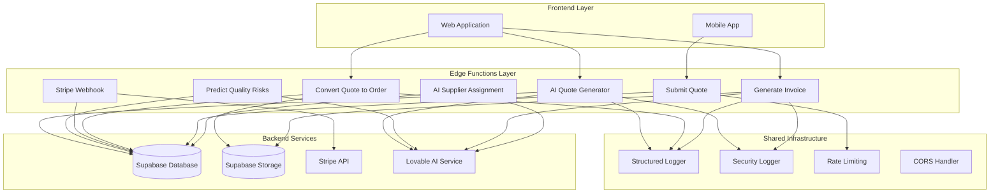
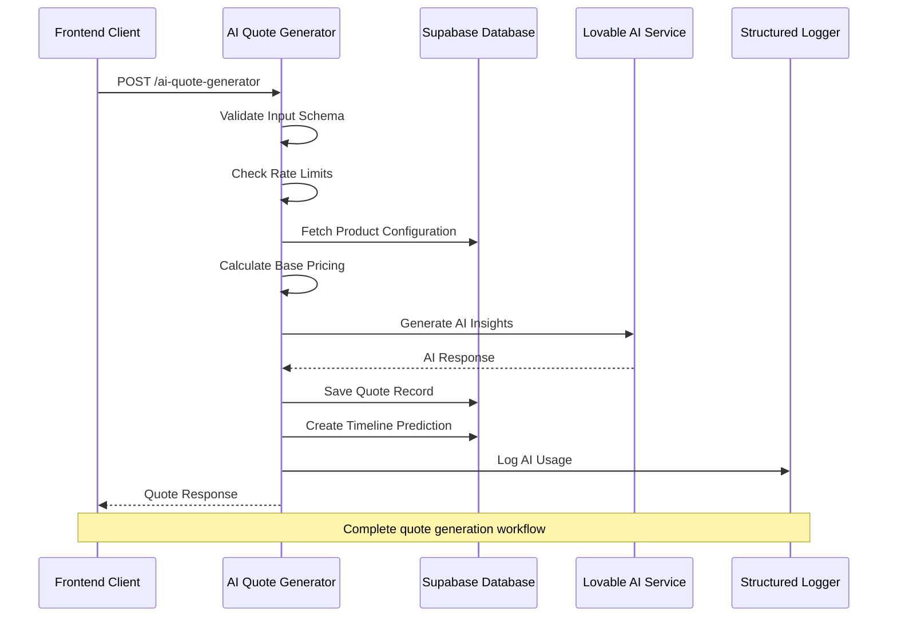
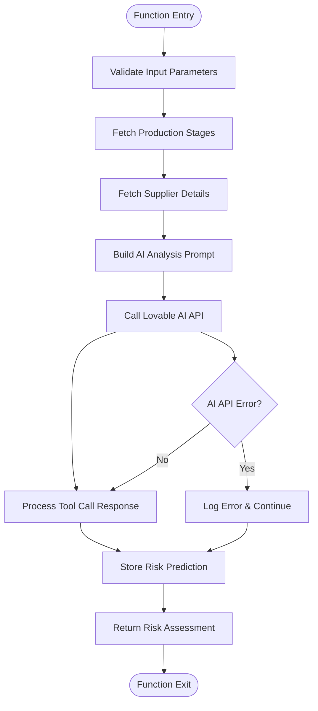
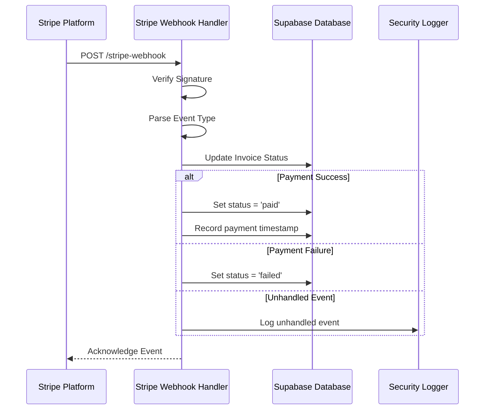
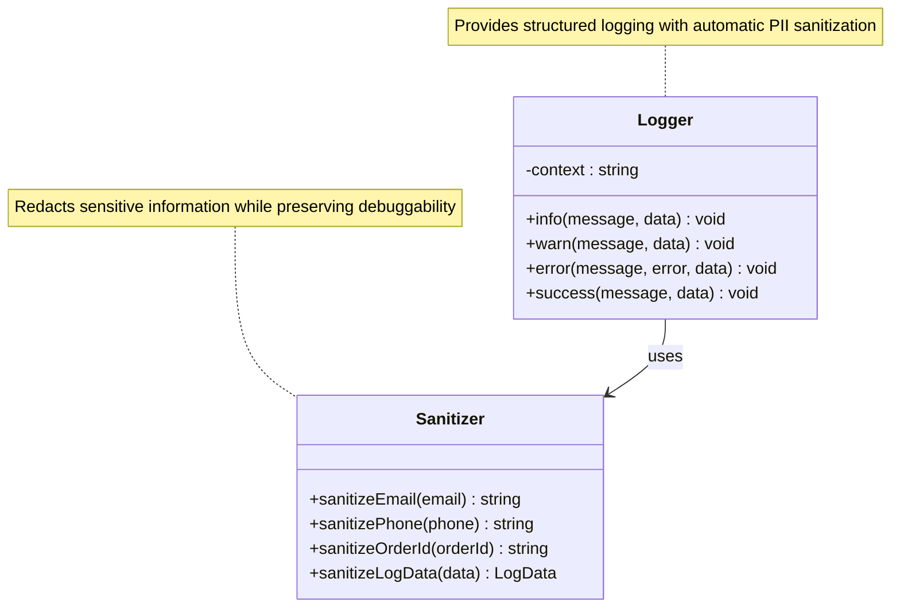
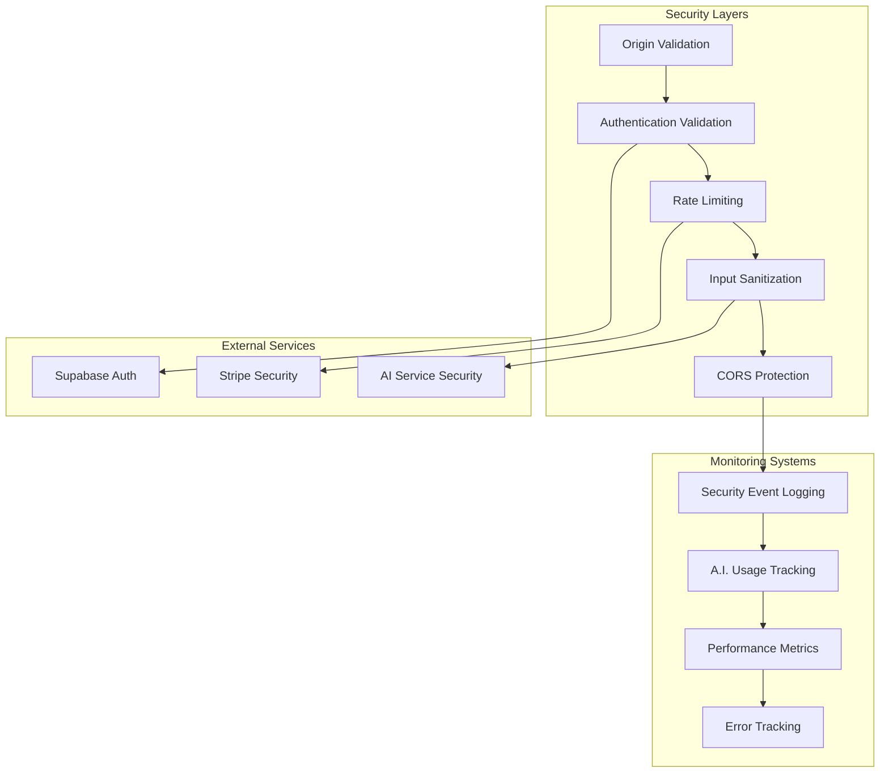
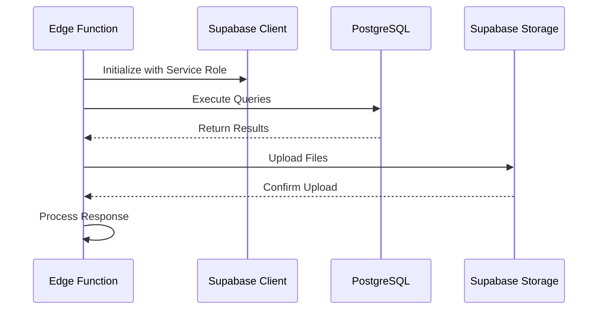
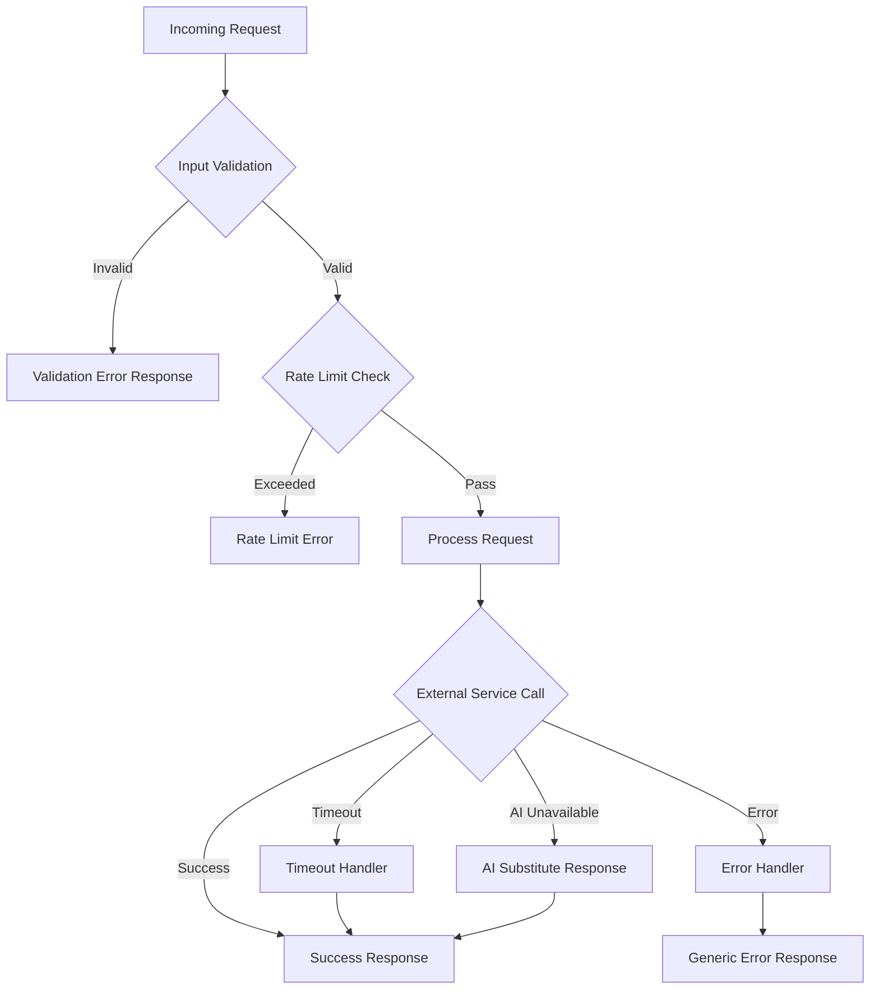

# Edge Functions Implementation

<cite>
**Referenced Files in This Document**
- [index.ts](file://supabase/functions/ai-quote-generator/index.ts)
- [index.ts](file://supabase/functions/predict-quality-risks/index.ts)
- [index.ts](file://supabase/functions/stripe-webhook/index.ts)
- [index.ts](file://supabase/functions/convert-quote-to-order/index.ts)
- [index.ts](file://supabase/functions/generate-invoice/index.ts)
- [index.ts](file://supabase/functions/submit-quote/index.ts)
- [index.ts](file://supabase/functions/ai-supplier-assignment/index.ts)
- [logger.ts](file://supabase/functions/_shared/logger.ts)
- [securityLogger.ts](file://supabase/functions/shared/securityLogger.ts)
- [tsconfig.json](file://supabase/functions/tsconfig.json)
- [deno.d.ts](file://supabase/functions/deno.d.ts)
- [20250122000000_create_marketplace_system.sql](file://supabase/migrations/20250122000000_create_marketplace_system.sql)
</cite>

## Table of Contents
1. [Introduction](#introduction)
2. [Architecture Overview](#architecture-overview)
3. [Core Edge Functions](#core-edge-functions)
4. [Shared Utilities](#shared-utilities)
5. [Security and Monitoring](#security-and-monitoring)
6. [Integration Patterns](#integration-patterns)
7. [Scalability and Performance](#scalability-and-performance)
8. [Error Handling and Resilience](#error-handling-and-resilience)
9. [Deployment and Configuration](#deployment-and-configuration)
10. [Monitoring and Observability](#monitoring-and-observability)

## Introduction

The Sleek Apparels Edge Functions implementation serves as the backend logic layer for the garment manufacturing marketplace, providing serverless functions that handle critical operations including AI-powered quote generation, production risk prediction, payment processing, and supplier management. Built on Supabase Edge Functions using Deno runtime, this architecture enables scalable, secure, and efficient handling of B2B manufacturing workflows.

The edge functions ecosystem encompasses AI-driven quote generation, quality risk assessment, payment processing via Stripe webhooks, order conversion, invoice generation, and intelligent supplier assignment. Each function is designed with security, reliability, and performance in mind, leveraging external AI services for enhanced functionality while maintaining strict data privacy controls.

## Architecture Overview

The Edge Functions architecture follows a modular, event-driven design pattern that separates concerns across specialized functions while maintaining seamless integration through Supabase database and storage services.

**Diagram sources**
- [index.ts](file://supabase/functions/ai-quote-generator/index.ts#L1-L50)
- [index.ts](file://supabase/functions/predict-quality-risks/index.ts#L1-L30)
- [index.ts](file://supabase/functions/stripe-webhook/index.ts#L1-L30)
- [index.ts](file://supabase/functions/convert-quote-to-order/index.ts#L1-L30)

**Section sources**
- [index.ts](file://supabase/functions/ai-quote-generator/index.ts#L1-L100)
- [index.ts](file://supabase/functions/predict-quality-risks/index.ts#L1-L50)
- [index.ts](file://supabase/functions/stripe-webhook/index.ts#L1-L50)

## Core Edge Functions

### AI Quote Generator

The AI Quote Generator represents the flagship function, combining sophisticated pricing algorithms with AI-powered insights to deliver competitive manufacturing quotes.

**Diagram sources**
- [index.ts](file://supabase/functions/ai-quote-generator/index.ts#L250-L350)
- [index.ts](file://supabase/functions/ai-quote-generator/index.ts#L450-L550)

#### Key Features:
- **Tiered Rate Limiting**: IP-based (15/day), session-based (3/day), and authenticated user (20/day) limits
- **Dynamic Pricing Engine**: Calculates base prices with volume discounts and complexity multipliers
- **AI-Powered Insights**: Uses Gemini models for design analysis and manufacturing recommendations
- **Configuration Management**: Robust fallback mechanisms for product categories
- **Timeline Prediction**: Generates detailed production timelines with stage breakdowns

#### Technical Implementation:
The function employs a multi-stage validation pipeline with Zod schema validation, comprehensive input sanitization, and tiered rate limiting. It integrates with Lovable AI for both text and image analysis, supporting file uploads for design review.

**Section sources**
- [index.ts](file://supabase/functions/ai-quote-generator/index.ts#L1-L807)

### Predict Quality Risks

The Quality Risk Prediction function applies machine learning to assess potential production quality issues by analyzing supplier performance and production stage data.

**Diagram sources**
- [index.ts](file://supabase/functions/predict-quality-risks/index.ts#L15-L100)

#### Risk Assessment Model:
The function evaluates multiple risk factors including:
- **Production Stage Progress**: Completion percentages and status indicators
- **Supplier Performance**: Historical performance scores and delivery rates
- **Timeline Confidence**: Predicted completion dates vs. actual progress
- **Quality Indicators**: Historical defect rates and inspection results

**Section sources**
- [index.ts](file://supabase/functions/predict-quality-risks/index.ts#L1-L131)

### Stripe Webhook Handler

The Stripe Webhook function securely processes payment events and updates order/invoice statuses accordingly.

**Diagram sources**
- [index.ts](file://supabase/functions/stripe-webhook/index.ts#L50-L100)

#### Security Measures:
- **Signature Verification**: Validates webhook signatures using HMAC-SHA256
- **Event Filtering**: Processes only approved event types
- **Idempotency**: Prevents duplicate processing through database checks
- **Logging**: Comprehensive audit trail for compliance

**Section sources**
- [index.ts](file://supabase/functions/stripe-webhook/index.ts#L1-L114)

### Convert Quote to Order

The Order Conversion function transforms approved quotes into production-ready orders while managing user creation and email notifications.

#### Workflow Process:
1. **Quote Validation**: Verifies quote existence and conversion status
2. **User Management**: Creates or retrieves buyer accounts
3. **Order Creation**: Generates production order with tracking tokens
4. **Status Updates**: Marks quote as converted and updates order status
5. **Notification**: Sends confirmation emails with tracking links

**Section sources**
- [index.ts](file://supabase/functions/convert-quote-to-order/index.ts#L1-L223)

### Generate Invoice

The Invoice Generation function creates professional invoices using AI-generated HTML templates and manages email distribution.

#### Key Features:
- **Template Generation**: AI-powered HTML invoice creation
- **Secure Access**: Token-based invoice retrieval
- **Storage Integration**: PDF storage in Supabase Storage
- **Email Automation**: Automated invoice delivery with tracking

**Section sources**
- [index.ts](file://supabase/functions/generate-invoice/index.ts#L1-L243)

### AI Supplier Assignment

The Supplier Assignment function uses AI to match orders with optimal manufacturing partners based on capabilities and performance metrics.

#### Matching Algorithm:
The function analyzes:
- **Product Specialization**: Supplier expertise in specific garment types
- **Capacity Constraints**: Monthly production limits and current workload
- **Performance History**: Historical quality scores and delivery reliability
- **Lead Time**: Estimated production timelines
- **Cost Efficiency**: Competitive pricing within quality constraints

**Section sources**
- [index.ts](file://supabase/functions/ai-supplier-assignment/index.ts#L1-L134)

### Submit Quote

The Quote Submission function handles initial customer inquiries with basic validation and rate limiting.

#### Security Features:
- **Origin Validation**: Whitelist-based CORS enforcement
- **Rate Limiting**: In-memory rate limiting (10/hour/IP)
- **Input Sanitization**: Comprehensive form validation
- **Session Tracking**: Anonymous session management

**Section sources**
- [index.ts](file://supabase/functions/submit-quote/index.ts#L1-L222)

## Shared Utilities

### Structured Logging System

The logging framework provides comprehensive, PII-sanitized logging across all edge functions.

**Diagram sources**
- [logger.ts](file://supabase/functions/_shared/logger.ts#L90-L170)

#### Logging Features:
- **PII Sanitization**: Automatic redaction of emails, phone numbers, and order IDs
- **Structured Format**: JSON-formatted logs with timestamps and context
- **Multiple Levels**: INFO, WARN, ERROR, SUCCESS categorization
- **Automatic Redaction**: Passwords, tokens, and secret fields masked

**Section sources**
- [logger.ts](file://supabase/functions/_shared/logger.ts#L1-L173)

### Security Logging

The security logging utility tracks security events and AI cost monitoring across the edge functions ecosystem.

#### Security Event Types:
- **Captcha Failures**: Bot detection and prevention
- **Rate Limit Violations**: Abuse detection and mitigation
- **Suspicious Patterns**: Anomaly detection and investigation
- **Cost Alerts**: Budget monitoring and optimization

#### Cost Tracking:
The system monitors AI API usage with granular token counting and cost estimation for budget control.

**Section sources**
- [securityLogger.ts](file://supabase/functions/shared/securityLogger.ts#L1-L88)

## Security and Monitoring

### Multi-Layer Security Architecture

The edge functions implement comprehensive security measures across multiple layers:

**Diagram sources**
- [index.ts](file://supabase/functions/ai-quote-generator/index.ts#L130-L200)
- [securityLogger.ts](file://supabase/functions/shared/securityLogger.ts#L1-L50)

### Rate Limiting Strategies

The system implements tiered rate limiting to prevent abuse while maintaining user experience:

| Identifier Type | Daily Limit | Session Duration | Purpose |
|----------------|-------------|------------------|---------|
| IP Address | 15 requests | 24 hours | Anti-bot protection |
| Session ID | 3 requests | Until browser close | Anonymous user protection |
| User ID | 20 requests | 24 hours | Authenticated user allowance |

### Origin Validation

Cross-origin requests are validated against a whitelist of approved domains to prevent unauthorized access:

- **Production**: Strict validation against approved domains
- **Development**: Relaxed validation for local development
- **Referer Headers**: Additional validation for enhanced security

**Section sources**
- [index.ts](file://supabase/functions/ai-quote-generator/index.ts#L139-L200)
- [index.ts](file://supabase/functions/submit-quote/index.ts#L50-L110)

## Integration Patterns

### Frontend Invocation Patterns

Edge functions are invoked through standardized HTTP endpoints with consistent error handling and response formats.

#### Common Request Patterns:
- **JSON Body**: Standard JSON payload with validation
- **Authorization Headers**: Bearer token authentication
- **Content-Type**: `application/json` for all requests
- **CORS Headers**: Preflight request handling

#### Response Format Standardization:
All functions return consistent JSON responses with:
- **Success/Error Status**: Boolean indicator
- **Error Details**: Structured error information
- **Request ID**: Unique identifier for debugging
- **Rate Limit Headers**: Current limits and remaining quota

### Database Integration

Functions integrate with Supabase through service role keys for bypassing Row Level Security (RLS):

**Diagram sources**
- [index.ts](file://supabase/functions/ai-quote-generator/index.ts#L247-L250)
- [index.ts](file://supabase/functions/generate-invoice/index.ts#L49-L52)

### External Service Integration

#### AI Service Integration:
- **Lovable AI**: Gemini model access for quote generation and analysis
- **Authentication**: API key-based authentication
- **Timeout Management**: 25-second timeouts with graceful degradation
- **Fallback Mechanisms**: Graceful handling of AI service unavailability

#### Payment Service Integration:
- **Stripe Webhooks**: Secure event processing with signature verification
- **Idempotency**: Duplicate event prevention through database checks
- **Error Handling**: Comprehensive error handling for payment failures

**Section sources**
- [index.ts](file://supabase/functions/ai-quote-generator/index.ts#L590-L650)
- [index.ts](file://supabase/functions/stripe-webhook/index.ts#L35-L50)

## Scalability and Performance

### Cold Start Optimization

The Deno runtime provides efficient cold start performance through:

- **Module Caching**: Pre-loaded dependencies reduce startup time
- **Minimal Dependencies**: Lightweight function bundles
- **Efficient Memory Usage**: Optimized memory allocation patterns
- **Parallel Processing**: Concurrent execution of independent operations

### Horizontal Scaling

Edge functions scale automatically based on request volume:

- **Auto-scaling**: Functions automatically scale with demand
- **Concurrency Limits**: Configurable concurrency for resource management
- **Load Distribution**: Even request distribution across function instances
- **Resource Isolation**: Each function instance operates independently

### Performance Monitoring

Key performance metrics tracked across functions:

| Metric | Measurement | Threshold |
|--------|-------------|-----------|
| Response Time | Milliseconds | < 2000ms |
| Memory Usage | MB | < 128MB |
| CPU Utilization | Percentage | < 80% |
| Error Rate | Percentage | < 1% |

### Caching Strategies

While edge functions are stateless, several caching approaches optimize performance:

- **In-Memory Caching**: Rate limiting and configuration caching
- **Database Query Caching**: Frequently accessed data caching
- **AI Response Caching**: Similar requests receive cached responses
- **Static Asset Caching**: Generated invoices and documents cached

**Section sources**
- [index.ts](file://supabase/functions/ai-quote-generator/index.ts#L38-L48)
- [index.ts](file://supabase/functions/submit-quote/index.ts#L23-L42)

## Error Handling and Resilience

### Comprehensive Error Management

The edge functions implement multi-layered error handling with graceful degradation:

**Diagram sources**
- [index.ts](file://supabase/functions/ai-quote-generator/index.ts#L748-L807)
- [index.ts](file://supabase/functions/generate-invoice/index.ts#L232-L242)

### Error Classification and Response

#### Validation Errors:
- **Structured Responses**: Detailed field-specific error information
- **User-Friendly Messages**: Clear guidance for correction
- **Retryable Flag**: Indicates whether the operation can be retried

#### System Errors:
- **Generic Responses**: Prevent information disclosure
- **Retry Headers**: HTTP retry-after headers for transient failures
- **Logging**: Comprehensive error logging for debugging

#### External Service Errors:
- **Graceful Degradation**: Fallback responses when services unavailable
- **Timeout Handling**: Configurable timeouts with partial results
- **Circuit Breaker**: Temporary service disabling during outages

### Resilience Patterns

#### Retry Logic:
- **Exponential Backoff**: Progressive delay increases for retries
- **Maximum Attempts**: Configurable retry limits
- **Jitter**: Random variation to prevent thundering herd

#### Circuit Breaker Pattern:
- **Failure Threshold**: Configurable failure rate triggers
- **Recovery Period**: Gradual service restoration
- **Fallback Responses**: Predefined responses during outages

**Section sources**
- [index.ts](file://supabase/functions/ai-quote-generator/index.ts#L748-L807)
- [index.ts](file://supabase/functions/generate-invoice/index.ts#L232-L242)

## Deployment and Configuration

### Environment Management

The edge functions rely on environment variables for configuration:

#### Required Environment Variables:
- **SUPABASE_URL**: Supabase project URL
- **SUPABASE_SERVICE_ROLE_KEY**: Service role authentication
- **LOVABLE_API_KEY**: AI service access key
- **STRIPE_SECRET_KEY**: Payment processing credentials
- **STRIPE_WEBHOOK_SECRET**: Webhook signature verification

#### Security Configuration:
- **Environment Isolation**: Separate environments for development and production
- **Secret Rotation**: Regular credential rotation policies
- **Access Controls**: Minimal permissions principle for service accounts

### Deployment Pipeline

Functions are deployed through Supabase CLI with automated testing:

1. **Code Validation**: TypeScript compilation and linting
2. **Dependency Resolution**: Module bundling and optimization
3. **Testing**: Unit and integration test execution
4. **Deployment**: Automated function deployment
5. **Health Checks**: Post-deployment validation

### Configuration Management

#### Database Schema Evolution:
The system uses Supabase migrations for database schema management:

- **Version Control**: Git-based migration tracking
- **Rollback Capability**: Safe rollback procedures
- **Environment Consistency**: Synchronized schema across environments
- **Data Integrity**: Constraint enforcement and validation

**Section sources**
- [tsconfig.json](file://supabase/functions/tsconfig.json#L1-L21)
- [deno.d.ts](file://supabase/functions/deno.d.ts#L1-L52)

## Monitoring and Observability

### Logging Strategy

Comprehensive logging provides visibility into function execution:

#### Log Categories:
- **Application Logs**: Function execution traces
- **Security Events**: Access attempts and violations
- **Performance Metrics**: Timing and resource utilization
- **Error Tracking**: Exception details and stack traces

#### Log Aggregation:
- **Structured Format**: JSON-formatted logs for easy parsing
- **Centralized Collection**: Unified log collection across functions
- **Retention Policies**: Configurable log retention periods
- **Search Capabilities**: Full-text search across log entries

### Performance Monitoring

#### Key Metrics Tracked:
- **Execution Time**: Function response time measurements
- **Memory Usage**: Peak memory consumption tracking
- **Error Rates**: Failure rate monitoring
- **Throughput**: Requests per second measurements
- **Cold Start Frequency**: Startup performance analysis

#### Alerting Configuration:
- **Threshold-Based Alerts**: Automated notifications for metric breaches
- **Anomaly Detection**: Machine learning-based anomaly identification
- **SLA Monitoring**: Service level agreement compliance tracking
- **Capacity Planning**: Resource utilization forecasting

### Debugging and Troubleshooting

#### Debug Tools:
- **Request ID Tracking**: Correlation across function calls
- **Stack Trace Analysis**: Detailed error reporting
- **Performance Profiling**: Execution time breakdown
- **Resource Monitoring**: Memory and CPU usage tracking

#### Troubleshooting Procedures:
1. **Issue Identification**: Log analysis and metric review
2. **Impact Assessment**: Scope determination and user impact
3. **Mitigation Steps**: Immediate fixes and workarounds
4. **Root Cause Analysis**: Deep dive into underlying causes
5. **Prevention Measures**: Long-term improvements and safeguards

**Section sources**
- [logger.ts](file://supabase/functions/_shared/logger.ts#L100-L173)
- [securityLogger.ts](file://supabase/functions/shared/securityLogger.ts#L14-L37)