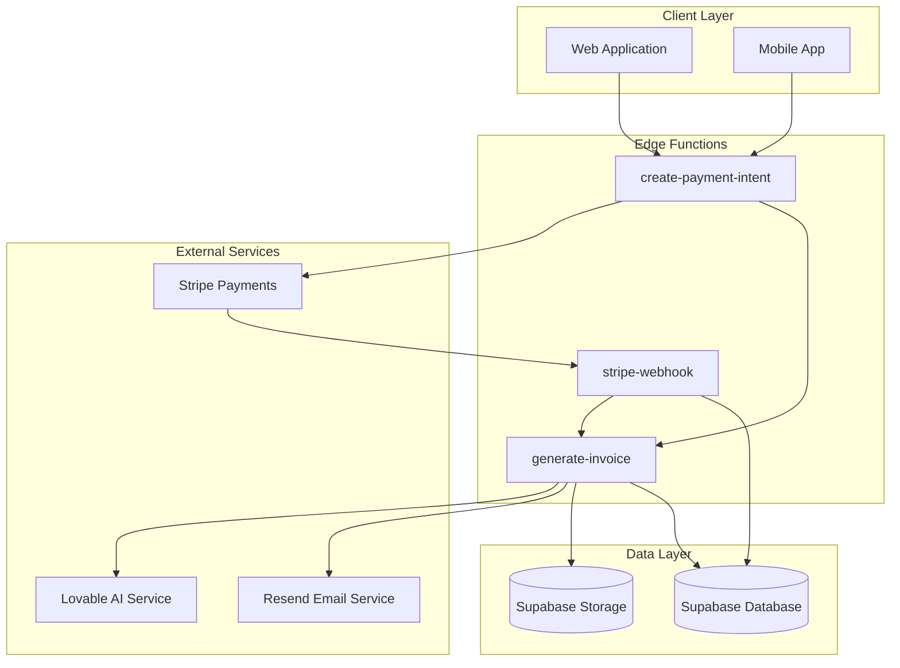
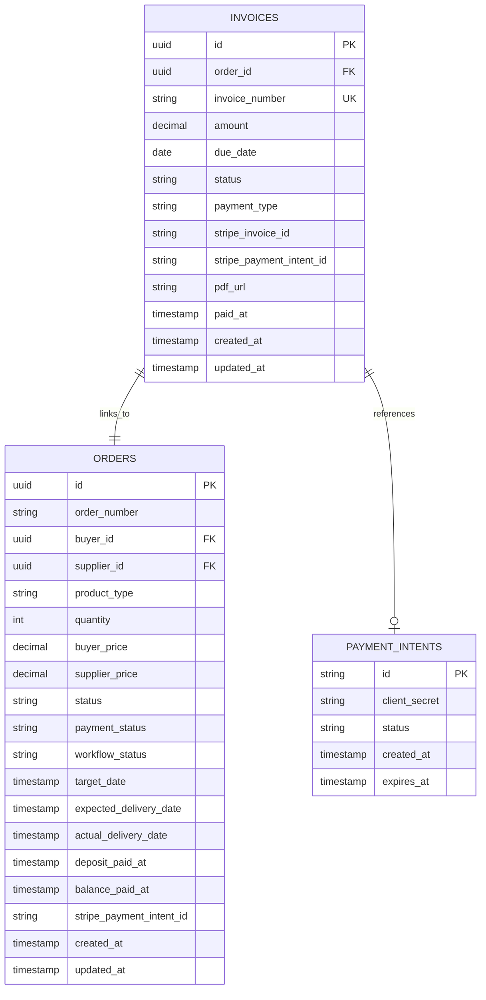
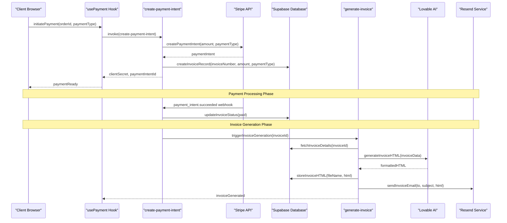
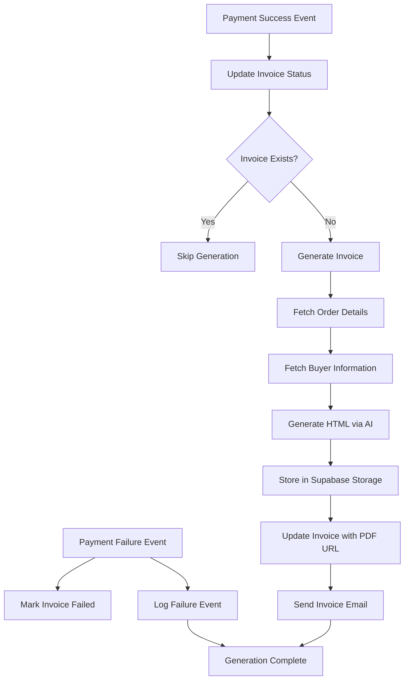
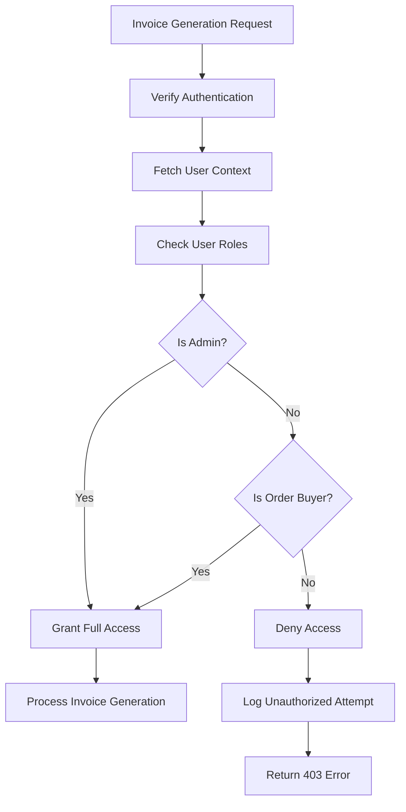
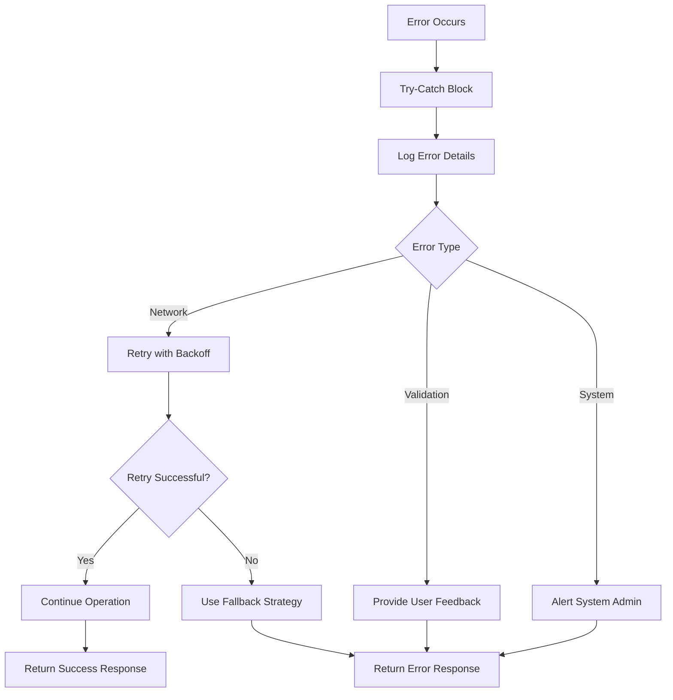

# Invoice Generation Workflow

<cite>
**Referenced Files in This Document**
- [generate-invoice/index.ts](file://supabase/functions/generate-invoice/index.ts)
- [database.ts](file://src/types/database.ts)
- [stripe-webhook/index.ts](file://supabase/functions/stripe-webhook/index.ts)
- [create-payment-intent/index.ts](file://supabase/functions/create-payment-intent/index.ts)
- [usePayment.ts](file://src/hooks/usePayment.ts)
- [PaymentSuccess.tsx](file://src/pages/PaymentSuccess.tsx)
- [enhancedAuditLog.ts](file://src/lib/enhancedAuditLog.ts)
- [20251121004548_412ae5d9-7426-4e57-a6d0-4e35e860ef95.sql](file://supabase/migrations/20251121004548_412ae5d9-7426-4e57-a6d0-4e35e860ef95.sql)
</cite>

## Table of Contents
1. [Introduction](#introduction)
2. [System Architecture Overview](#system-architecture-overview)
3. [Invoice Data Model](#invoice-data-model)
4. [Payment Processing Workflow](#payment-processing-workflow)
5. [Invoice Generation Trigger](#invoice-generation-trigger)
6. [PDF Generation and Storage](#pdf-generation-and-storage)
7. [Security and Access Control](#security-and-access-control)
8. [Error Handling and Compliance](#error-handling-and-compliance)
9. [Integration Points](#integration-points)
10. [Performance Considerations](#performance-considerations)
11. [Troubleshooting Guide](#troubleshooting-guide)
12. [Conclusion](#conclusion)

## Introduction

The Invoice Generation workflow in Sleek Apparels is a sophisticated automated system that creates professional PDF invoices after successful payments. This workflow integrates seamlessly with Stripe payment processing, Supabase database management, and external AI services to deliver compliant financial documentation with company branding and audit trail capabilities.

The system operates on a trigger-based architecture where successful payment webhooks automatically initiate invoice generation, ensuring timely delivery of professional billing documents while maintaining strict security controls and compliance standards.

## System Architecture Overview

The invoice generation system follows a serverless architecture with multiple interconnected components working together to provide a seamless financial documentation experience.

**Diagram sources**
- [generate-invoice/index.ts](file://supabase/functions/generate-invoice/index.ts#L1-L243)
- [stripe-webhook/index.ts](file://supabase/functions/stripe-webhook/index.ts#L1-L114)
- [create-payment-intent/index.ts](file://supabase/functions/create-payment-intent/index.ts#L1-L288)

## Invoice Data Model

The invoice system is built around a comprehensive data model that maintains relationships between orders, payments, and financial records.

**Diagram sources**
- [database.ts](file://src/types/database.ts#L312-L326)
- [20251121004548_412ae5d9-7426-4e57-a6d0-4e35e860ef95.sql](file://supabase/migrations/20251121004548_412ae5d9-7426-4e57-a6d0-4e35e860ef95.sql#L1-L44)

### Key Data Model Features

| Field | Type | Description | Constraints |
|-------|------|-------------|-------------|
| `invoice_number` | String | Unique invoice identifier (INV-YYYY-XXXX) | Auto-generated, unique constraint |
| `amount` | Decimal | Total invoice amount in USD | Must be positive |
| `due_date` | Date | Payment due date | Calculated from creation date |
| `status` | String | Invoice status (pending/paid/failed) | Enum validation |
| `payment_type` | String | Deposit/balance/full payment | Linked to payment workflow |
| `stripe_invoice_id` | String | Stripe invoice identifier | Nullable for manual invoices |
| `stripe_payment_intent_id` | String | Associated payment intent | Links to payment processing |

**Section sources**
- [database.ts](file://src/types/database.ts#L312-L326)

## Payment Processing Workflow

The payment processing workflow initiates invoice generation through a series of coordinated steps involving payment creation, webhook processing, and invoice generation triggers.

**Diagram sources**
- [create-payment-intent/index.ts](file://supabase/functions/create-payment-intent/index.ts#L247-L267)
- [stripe-webhook/index.ts](file://supabase/functions/stripe-webhook/index.ts#L62-L94)
- [generate-invoice/index.ts](file://supabase/functions/generate-invoice/index.ts#L60-L242)

### Payment Intent Creation

The payment process begins when a client initiates payment through the frontend application. The [`create-payment-intent`](file://supabase/functions/create-payment-intent/index.ts#L247-L267) function handles the complete payment workflow:

1. **Invoice Creation**: Generates a unique invoice number using the pattern `INV-{year}-{random4digits}`
2. **Payment Intent**: Creates Stripe payment intent with appropriate amount and payment type
3. **Database Updates**: Records invoice and payment intent relationships
4. **Order Status**: Updates order with payment intent references

**Section sources**
- [create-payment-intent/index.ts](file://supabase/functions/create-payment-intent/index.ts#L247-L267)

## Invoice Generation Trigger

The invoice generation process is triggered automatically through multiple mechanisms, ensuring comprehensive coverage of payment scenarios.

### Webhook-Based Triggers

The primary trigger mechanism relies on Stripe webhook events:

**Diagram sources**
- [stripe-webhook/index.ts](file://supabase/functions/stripe-webhook/index.ts#L62-L94)
- [generate-invoice/index.ts](file://supabase/functions/generate-invoice/index.ts#L60-L242)

### Database Trigger Mechanism

A sophisticated database trigger ensures invoice generation when orders reach specific completion milestones:

The [`trigger_invoice_generation`](file://supabase/migrations/20251121004548_412ae5d9-7426-4e57-a6d0-4e35e860ef95.sql#L11-L37) function monitors order workflow status changes and automatically triggers invoice generation under specific conditions:

- **Order Completion**: When workflow status transitions to 'completed'
- **Deposit Paid**: When deposit payment is confirmed
- **Unique Prevention**: Prevents duplicate invoice generation for the same payment type

**Section sources**
- [20251121004548_412ae5d9-7426-4e57-a6d0-4e35e860ef95.sql](file://supabase/migrations/20251121004548_412ae5d9-7426-4e57-a6d0-4e35e860ef95.sql#L11-L37)

## PDF Generation and Storage

The invoice generation system employs a multi-stage process for creating professional PDF documents with company branding and secure storage.

### AI-Driven HTML Generation

The [`generate-invoice`](file://supabase/functions/generate-invoice/index.ts#L108-L167) function utilizes Lovable AI to create professionally formatted invoice HTML:

**AI Prompt Structure**:
- **System Message**: Expert invoice HTML generation expertise
- **User Content**: Structured invoice data with company branding placeholders
- **Requirements**: Professional styling, print-friendly design, complete HTML document

**Generated Content Includes**:
- Professional header with company logo placeholder
- Clean table layout for invoice details
- Payment terms (Net 7 days)
- Bank details section placeholder
- Footer with contact information
- Modern, clean styling with good spacing
- Print-friendly design optimization

### Storage and Distribution

Once generated, invoices are stored securely in Supabase Storage with the following characteristics:

| Storage Feature | Implementation | Security |
|----------------|----------------|----------|
| **File Naming** | `invoices/{invoice_number}.html` | Predictable, organized structure |
| **Content Type** | `text/html` | Proper MIME type specification |
| **Access Control** | Public URLs with controlled access | Supabase storage policies |
| **Versioning** | Upsert capability for updates | Overwrite protection |

**Section sources**
- [generate-invoice/index.ts](file://supabase/functions/generate-invoice/index.ts#L108-L186)

## Security and Access Control

The invoice generation system implements comprehensive security measures to protect sensitive financial data and ensure compliance with access control requirements.

### Authentication and Authorization

The [`generate-invoice`](file://supabase/functions/generate-invoice/index.ts#L86-L106) function enforces strict access controls:

**Diagram sources**
- [generate-invoice/index.ts](file://supabase/functions/generate-invoice/index.ts#L86-L106)

### Security Controls

| Security Layer | Implementation | Purpose |
|---------------|----------------|---------|
| **Authentication** | Bearer token validation | Verify user identity |
| **Authorization** | Role-based access control | Restrict to buyers/admins |
| **Data Validation** | Input sanitization | Prevent injection attacks |
| **Logging** | Comprehensive audit trails | Monitor access attempts |
| **Encryption** | HTTPS transmission | Secure data in transit |

**Section sources**
- [generate-invoice/index.ts](file://supabase/functions/generate-invoice/index.ts#L86-L106)

## Error Handling and Compliance

The invoice generation system incorporates robust error handling mechanisms and compliance features to ensure reliable operation and regulatory adherence.

### Error Management Strategy

The system implements multi-layered error handling across all components:

**Diagram sources**
- [generate-invoice/index.ts](file://supabase/functions/generate-invoice/index.ts#L232-L241)
- [stripe-webhook/index.ts](file://supabase/functions/stripe-webhook/index.ts#L106-L112)

### Compliance Features

The system maintains comprehensive compliance through several mechanisms:

**Audit Logging**:
- [`logEnhancedAudit`](file://src/lib/enhancedAuditLog.ts#L101-L228) tracks all invoice generation activities
- Records user actions, timestamps, and system events
- Maintains immutable audit trails for regulatory requirements

**Data Protection**:
- Encryption at rest and in transit
- Role-based data access controls
- Automated data retention policies

**Regulatory Compliance**:
- Financial transaction documentation
- Payment processing transparency
- Tax calculation and reporting support

**Section sources**
- [enhancedAuditLog.ts](file://src/lib/enhancedAuditLog.ts#L101-L228)

## Integration Points

The invoice generation system integrates with multiple external services and internal components to provide a comprehensive financial management solution.

### External Service Integrations

| Service | Purpose | Integration Method | Reliability |
|---------|---------|-------------------|-------------|
| **Stripe** | Payment processing | Webhook events | High availability |
| **Lovable AI** | HTML generation | REST API calls | Managed service |
| **Resend** | Email delivery | SMTP-compatible API | Reliable delivery |
| **Supabase Storage** | File storage | REST API uploads | Scalable storage |

### Internal System Integration

The system coordinates with various internal components:

**Payment Management**:
- [`usePayment`](file://src/hooks/usePayment.ts#L9-L68) hook manages payment lifecycle
- Real-time payment status updates
- Invoice retrieval and management

**Order Management**:
- Seamless order-to-invoice correlation
- Automatic invoice generation triggers
- Payment status synchronization

**User Interface**:
- [`PaymentSuccess`](file://src/pages/PaymentSuccess.tsx#L1-L68) page confirms successful transactions
- Invoice download and viewing capabilities
- Payment history tracking

**Section sources**
- [usePayment.ts](file://src/hooks/usePayment.ts#L9-L68)
- [PaymentSuccess.tsx](file://src/pages/PaymentSuccess.tsx#L1-L68)

## Performance Considerations

The invoice generation system is designed for high performance and scalability through several optimization strategies.

### Optimization Strategies

**Asynchronous Processing**:
- Non-blocking invoice generation
- Parallel processing of multiple requests
- Background task execution for heavy operations

**Caching Mechanisms**:
- Database query result caching
- Generated HTML caching where applicable
- CDN integration for static assets

**Resource Management**:
- Efficient memory usage in Edge Functions
- Optimized database queries with proper indexing
- Minimal external service dependencies

### Scalability Features

| Aspect | Implementation | Scaling Benefits |
|--------|----------------|------------------|
| **Serverless Architecture** | Deno Edge Functions | Automatic scaling |
| **Database Optimization** | Indexed queries | Fast data retrieval |
| **Storage Efficiency** | Compressed file storage | Reduced bandwidth |
| **CDN Integration** | Static asset delivery | Global performance |

## Troubleshooting Guide

Common issues and their resolutions in the invoice generation workflow.

### Payment Processing Issues

**Problem**: Invoice not generated after successful payment
**Diagnosis Steps**:
1. Verify Stripe webhook endpoint configuration
2. Check [`stripe-webhook`](file://supabase/functions/stripe-webhook/index.ts#L62-L94) function logs
3. Confirm invoice record exists in database
4. Review webhook signature verification

**Solution**: Ensure proper webhook configuration and retry failed deliveries

### AI Generation Failures

**Problem**: Invoice HTML generation fails
**Diagnosis Steps**:
1. Check Lovable AI service availability
2. Verify API key configuration
3. Review AI prompt formatting
4. Monitor response timeouts

**Solution**: Implement retry logic and fallback mechanisms

### Storage Upload Issues

**Problem**: Generated invoices not accessible
**Diagnosis Steps**:
1. Verify Supabase Storage permissions
2. Check file naming conventions
3. Review storage quota limits
4. Confirm public URL generation

**Solution**: Update storage policies and monitor quotas

**Section sources**
- [generate-invoice/index.ts](file://supabase/functions/generate-invoice/index.ts#L232-L241)
- [stripe-webhook/index.ts](file://supabase/functions/stripe-webhook/index.ts#L106-L112)

## Conclusion

The Invoice Generation workflow in Sleek Apparels represents a sophisticated, automated financial documentation system that combines modern technologies with robust security and compliance features. Through its integration of Stripe payment processing, AI-driven document generation, and comprehensive audit logging, the system delivers professional invoice creation with enterprise-grade reliability.

Key strengths of the system include:

- **Automated Trigger Mechanisms**: Multiple pathways ensure invoice generation regardless of payment method
- **Professional Branding**: AI-powered HTML generation maintains consistent corporate identity
- **Security-First Design**: Multi-layered access controls protect sensitive financial data
- **Comprehensive Compliance**: Built-in audit logging and regulatory support
- **Scalable Architecture**: Serverless design enables automatic scaling and cost efficiency

The system's modular design allows for easy maintenance and future enhancements while maintaining backward compatibility and operational stability. As the business grows, the foundation provided by this invoice generation workflow supports continued expansion of financial operations and reporting capabilities.