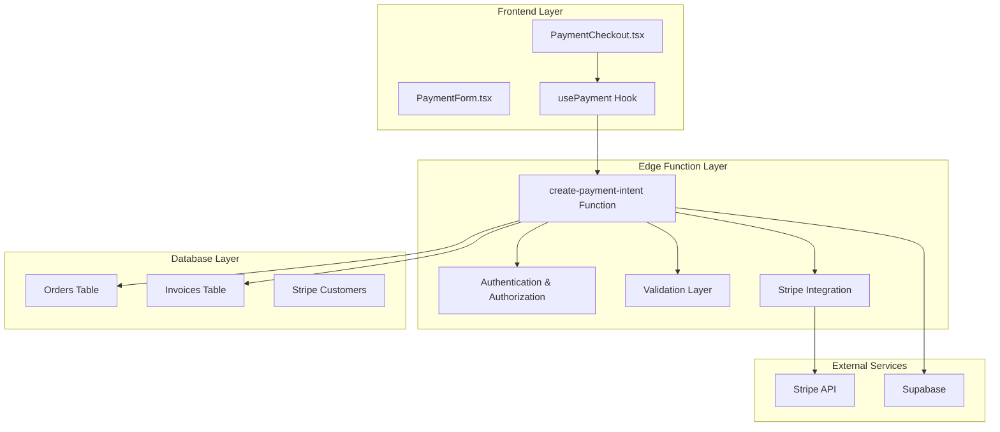
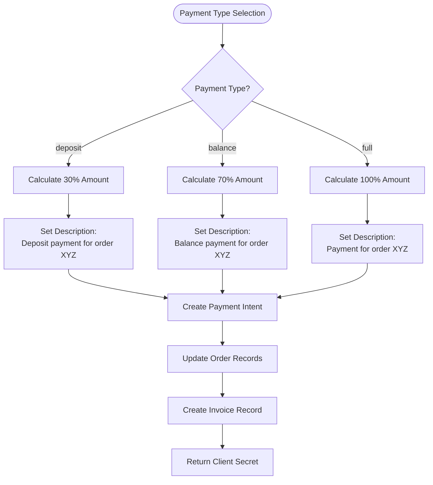
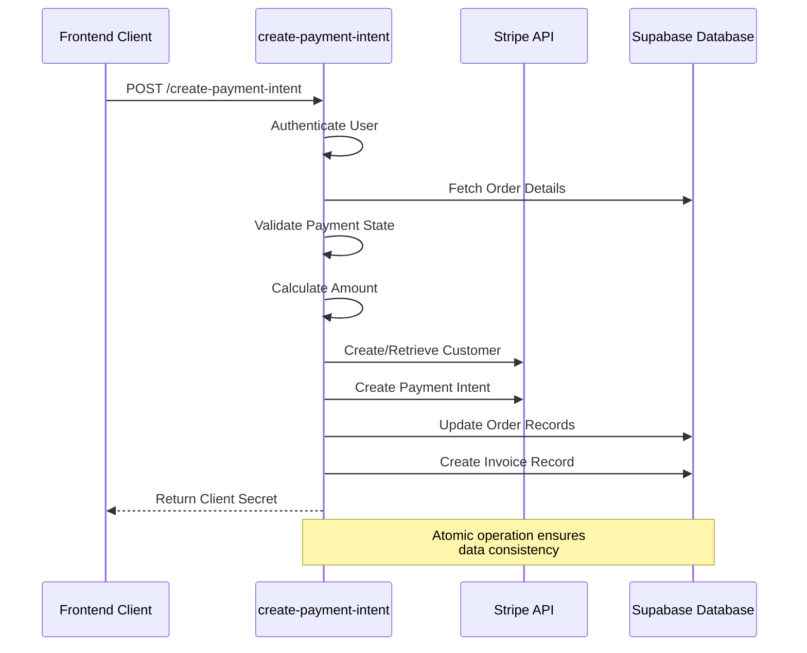
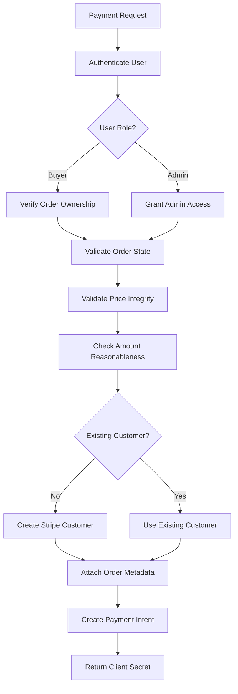
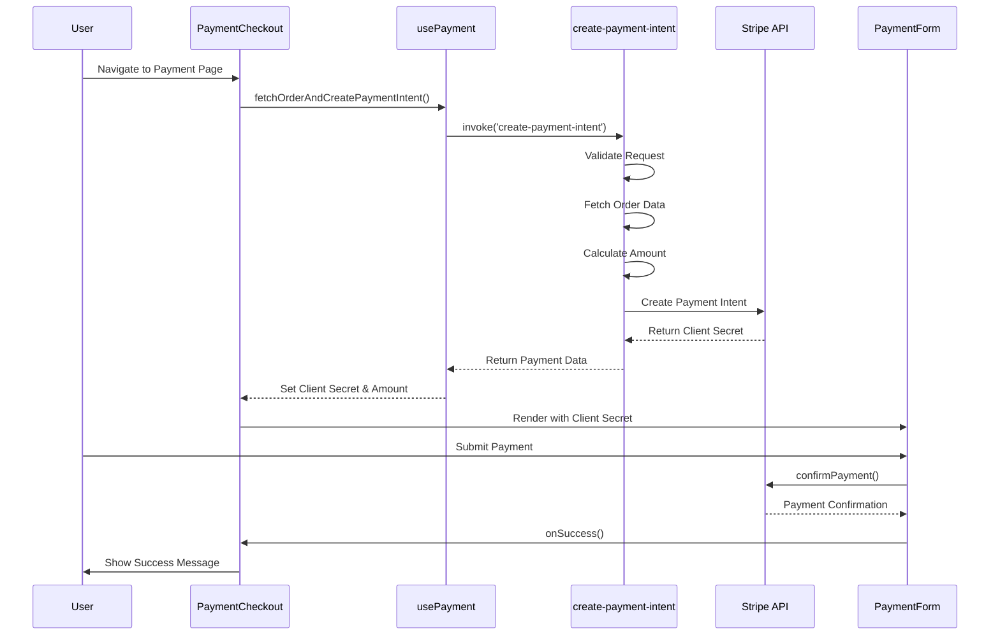

# Payment Initialization

<cite>
**Referenced Files in This Document**
- [PaymentCheckout.tsx](file://src/pages/PaymentCheckout.tsx)
- [create-payment-intent/index.ts](file://supabase/functions/create-payment-intent/index.ts)
- [PaymentForm.tsx](file://src/components/payment/PaymentForm.tsx)
- [usePayment.ts](file://src/hooks/usePayment.ts)
- [logger.ts](file://supabase/functions/_shared/logger.ts)
- [order.ts](file://src/types/order.ts)
- [InvoicesPaymentsSection.tsx](file://src/components/buyer/InvoicesPaymentsSection.tsx)
- [InvoiceViewer.tsx](file://src/components/payment/InvoiceViewer.tsx)
</cite>

## Table of Contents
1. [Introduction](#introduction)
2. [System Architecture Overview](#system-architecture-overview)
3. [Payment Type Parameter Usage](#payment-type-parameter-usage)
4. [Amount Calculation Logic](#amount-calculation-logic)
5. [Edge Function Implementation](#edge-function-implementation)
6. [Customer Management and Metadata](#customer-management-and-metadata)
7. [Security Practices and PII Protection](#security-practices-and-pii-protection)
8. [Error Handling and Loading States](#error-handling-and-loading-states)
9. [Integration Flow Analysis](#integration-flow-analysis)
10. [Idempotency and Retry Considerations](#idempotency-and-retry-considerations)
11. [Troubleshooting Guide](#troubleshooting-guide)
12. [Best Practices](#best-practices)

## Introduction

The Payment Initialization process in the Sleek Apparels system securely creates Stripe payment intents through a sophisticated Edge Function architecture. This system handles three distinct payment scenarios: deposits (30%), balance payments (70%), and full payments, while maintaining strict security protocols and comprehensive error handling.

The payment flow integrates seamlessly between the frontend React application and Supabase Edge Functions, utilizing Stripe Elements for secure payment processing. The system implements robust security measures including PII protection, price validation, and tampering detection mechanisms.

## System Architecture Overview

The payment initialization system follows a multi-layered architecture that ensures security, reliability, and scalability:

**Diagram sources**
- [PaymentCheckout.tsx](file://src/pages/PaymentCheckout.tsx#L15-L174)
- [create-payment-intent/index.ts](file://supabase/functions/create-payment-intent/index.ts#L13-L288)

**Section sources**
- [PaymentCheckout.tsx](file://src/pages/PaymentCheckout.tsx#L1-L174)
- [create-payment-intent/index.ts](file://supabase/functions/create-payment-intent/index.ts#L1-L288)

## Payment Type Parameter Usage

The system supports three distinct payment types, each serving specific business requirements:

### Deposit Payments (30%)
- **Use Case**: Initial payment requirement for order processing
- **Calculation**: 30% of the order total price
- **Metadata**: `paymentType: 'deposit'`
- **Amount Display**: Shows remaining balance (70%)

### Balance Payments (70%)
- **Use Case**: Final payment after deposit completion
- **Calculation**: 70% of the order total price
- **Metadata**: `paymentType: 'balance'`
- **Amount Display**: Shows deposit amount and remaining balance

### Full Payments
- **Use Case**: Single payment covering entire order amount
- **Calculation**: 100% of the order total price
- **Metadata**: `paymentType: 'full'`
- **Amount Display**: Shows total order amount

**Diagram sources**
- [create-payment-intent/index.ts](file://supabase/functions/create-payment-intent/index.ts#L161-L170)

**Section sources**
- [PaymentCheckout.tsx](file://src/pages/PaymentCheckout.tsx#L25-L26)
- [create-payment-intent/index.ts](file://supabase/functions/create-payment-intent/index.ts#L161-L170)

## Amount Calculation Logic

The amount calculation process implements precise mathematical operations with currency conversion and validation:

### Mathematical Precision
- **Currency Conversion**: Convert dollar amounts to cents (multiplied by 100)
- **Rounding**: Uses `Math.round()` for accurate currency representation
- **Minimum Threshold**: Enforces $1.00 minimum payment amount

### Price Validation
- **Quote Verification**: Validates order price against original quote (±0.5% tolerance)
- **Tampering Detection**: Monitors recent order modifications (< 5 minutes)
- **Price Integrity**: Ensures order price is positive and reasonable

### Calculation Examples
- **Deposit**: `orderPrice * 0.30 * 100` → Rounded to nearest cent
- **Balance**: `orderPrice * 0.70 * 100` → Rounded to nearest cent
- **Full Payment**: `orderPrice * 100` → Rounded to nearest cent

**Section sources**
- [create-payment-intent/index.ts](file://supabase/functions/create-payment-intent/index.ts#L158-L176)

## Edge Function Implementation

The `create-payment-intent` Edge Function serves as the core payment orchestration layer, implementing comprehensive security and validation logic:

### Authentication and Authorization
- **User Verification**: Validates authenticated user session
- **Role Checking**: Confirms user is either buyer or admin
- **Order Ownership**: Verifies user's right to pay for specific order

### Security Controls
- **Price Validation**: Implements quote-based price verification
- **Tampering Detection**: Monitors recent order modifications
- **Rate Limiting**: Built-in protection against abuse
- **CORS Headers**: Proper cross-origin resource sharing configuration

### Database Operations
- **Order Retrieval**: Fetches order with buyer profile data
- **Quote Validation**: Compares order price against original quote
- **State Validation**: Ensures order is in payable state
- **Atomic Updates**: Maintains data consistency across operations

**Diagram sources**
- [create-payment-intent/index.ts](file://supabase/functions/create-payment-intent/index.ts#L18-L288)

**Section sources**
- [create-payment-intent/index.ts](file://supabase/functions/create-payment-intent/index.ts#L18-L288)

## Customer Management and Metadata

The system implements intelligent customer management with comprehensive metadata attachment:

### Customer Creation Strategy
- **Idempotent Creation**: Checks for existing Stripe customer before creation
- **Fallback Data**: Uses profile data as primary, falls back to order data
- **Automatic Updates**: Stores Stripe customer ID in order records

### Metadata Attachment
- **Order Identification**: Links customer to specific order via `orderId` and `orderNumber`
- **Payment Tracking**: Associates payment intent with order context
- **Audit Trail**: Maintains searchable payment history

### Customer Data Flow
1. **Check Existing**: Query order for existing `stripe_customer_id`
2. **Create New**: If missing, create Stripe customer with metadata
3. **Store Reference**: Update order with new customer ID
4. **Link Payment**: Associate payment intent with customer

**Section sources**
- [create-payment-intent/index.ts](file://supabase/functions/create-payment-intent/index.ts#L184-L208)

## Security Practices and PII Protection

The system implements comprehensive security measures to protect sensitive information:

### PII Sanitization
- **Email Protection**: Redacts email addresses (e.g., `john.doe@example.com` → `joh***@example.com`)
- **Phone Number Masking**: Masks phone numbers (e.g., `+8801234567890` → `+880****90`)
- **Order ID Obfuscation**: Truncates UUIDs to first 8 characters
- **Token Redaction**: Masks passwords, tokens, and secret keys

### Access Control
- **User Authentication**: Requires valid Supabase JWT token
- **Role-Based Access**: Differentiates between buyers and admins
- **Order Ownership**: Validates user's right to access specific order
- **IP Whitelisting**: Configurable IP restrictions (not shown in code)

### Data Validation
- **Price Integrity**: Validates order prices against quotes
- **Tampering Detection**: Monitors recent order modifications
- **Amount Validation**: Ensures reasonable payment amounts
- **State Validation**: Prevents duplicate payments

**Diagram sources**
- [create-payment-intent/index.ts](file://supabase/functions/create-payment-intent/index.ts#L18-L288)
- [logger.ts](file://supabase/functions/_shared/logger.ts#L61-L81)

**Section sources**
- [logger.ts](file://supabase/functions/_shared/logger.ts#L1-L173)
- [create-payment-intent/index.ts](file://supabase/functions/create-payment-intent/index.ts#L18-L288)

## Error Handling and Loading States

The system implements comprehensive error handling and user experience management:

### Frontend Error Handling
- **Toast Notifications**: Provides user-friendly error messages
- **Loading States**: Displays appropriate loading indicators
- **Graceful Degradation**: Handles missing Stripe configuration
- **Navigation Fallbacks**: Redirects on critical errors

### Backend Error Management
- **Structured Logging**: Comprehensive error logging with context
- **HTTP Status Codes**: Appropriate HTTP response codes
- **Error Propagation**: Clear error messages to frontend
- **Retry Logic**: Built-in resilience for transient failures

### Error Categories
- **Authentication Errors**: Invalid or missing credentials
- **Authorization Errors**: Insufficient permissions
- **Business Logic Errors**: Invalid payment states, price mismatches
- **Technical Errors**: Stripe API failures, database connectivity

**Section sources**
- [PaymentCheckout.tsx](file://src/pages/PaymentCheckout.tsx#L54-L62)
- [create-payment-intent/index.ts](file://supabase/functions/create-payment-intent/index.ts#L279-L286)

## Integration Flow Analysis

The payment initialization process involves seamless integration between multiple system components:

### Frontend Integration
- **Route Parameters**: Extracts `orderId` and `paymentType` from URL
- **State Management**: Manages loading, error, and success states
- **Stripe Elements**: Integrates with Stripe React components
- **User Feedback**: Provides real-time payment status updates

### Supabase Function Invocation
- **REST API Call**: Invokes Edge Function via Supabase Functions API
- **Body Parameters**: Sends `orderId` and `paymentType` as JSON payload
- **Response Handling**: Processes client secret and amount data
- **Error Propagation**: Handles function errors gracefully

### Payment Form Integration
- **Amount Display**: Shows calculated payment amounts
- **Payment Element**: Renders Stripe payment form
- **Processing State**: Manages form submission state
- **Success Callback**: Handles successful payment completion

**Diagram sources**
- [PaymentCheckout.tsx](file://src/pages/PaymentCheckout.tsx#L31-L65)
- [usePayment.ts](file://src/hooks/usePayment.ts#L9-L34)
- [PaymentForm.tsx](file://src/components/payment/PaymentForm.tsx#L20-L56)

**Section sources**
- [PaymentCheckout.tsx](file://src/pages/PaymentCheckout.tsx#L31-L65)
- [usePayment.ts](file://src/hooks/usePayment.ts#L9-L34)
- [PaymentForm.tsx](file://src/components/payment/PaymentForm.tsx#L14-L94)

## Idempotency and Retry Considerations

While the current implementation focuses on atomic operations, several idempotency considerations enhance system reliability:

### Current Idempotency Features
- **Stripe Payment Intents**: Stripe automatically handles idempotency
- **Customer Creation**: Idempotent customer retrieval/checking
- **Order Updates**: Atomic database operations prevent race conditions
- **Invoice Generation**: Unique invoice number generation prevents duplicates

### Retry Strategy Recommendations
- **Client-Side**: Implement exponential backoff for network failures
- **Server-Side**: Add retry logic for transient Stripe API failures
- **Idempotency Keys**: Use Stripe's built-in idempotency mechanism
- **State Recovery**: Maintain payment state across retries

### Best Practices for Idempotency
- **Unique Identifiers**: Generate unique request IDs for each payment attempt
- **State Tracking**: Maintain payment state in database for recovery
- **Conditional Operations**: Check for existing payment intents before creation
- **Compensation Logic**: Implement rollback mechanisms for failed attempts

**Section sources**
- [create-payment-intent/index.ts](file://supabase/functions/create-payment-intent/index.ts#L184-L208)

## Troubleshooting Guide

Common issues and their resolutions during payment initialization:

### Authentication Issues
- **Symptom**: "Authentication required" error
- **Cause**: Missing or invalid Supabase JWT token
- **Solution**: Ensure user is properly authenticated before accessing payment page

### Authorization Problems
- **Symptom**: "You are not authorized to pay for this order" error
- **Cause**: User lacks permission for specified order
- **Solution**: Verify user role and order ownership relationship

### Price Validation Failures
- **Symptom**: "Order price does not match quote" error
- **Cause**: Price discrepancy between order and quote
- **Solution**: Refresh page and verify quote hasn't changed

### Payment State Issues
- **Symptom**: "Order has already been paid" error
- **Cause**: Attempting to pay for completed order
- **Solution**: Check order status and verify payment completion

### Stripe Integration Problems
- **Symptom**: "Failed to initialize payment" error
- **Cause**: Stripe API connectivity or configuration issues
- **Solution**: Verify Stripe API keys and account status

**Section sources**
- [create-payment-intent/index.ts](file://supabase/functions/create-payment-intent/index.ts#L279-L286)

## Best Practices

### Security Implementation
- **Always validate**: Never trust client-side data
- **Sanitize inputs**: Implement comprehensive input validation
- **Protect PII**: Use automated sanitization for sensitive data
- **Monitor access**: Log all payment-related activities

### Performance Optimization
- **Cache customers**: Reuse Stripe customer IDs when possible
- **Batch operations**: Group related database updates
- **Async processing**: Handle non-critical operations asynchronously
- **CDN integration**: Serve static assets efficiently

### User Experience Enhancement
- **Clear messaging**: Provide actionable error messages
- **Loading states**: Show progress indicators for long operations
- **Graceful fallbacks**: Handle edge cases elegantly
- **Mobile optimization**: Ensure responsive design across devices

### Monitoring and Maintenance
- **Structured logging**: Implement comprehensive audit trails
- **Error tracking**: Monitor and alert on payment failures
- **Performance metrics**: Track payment initiation times
- **Security monitoring**: Detect suspicious payment patterns