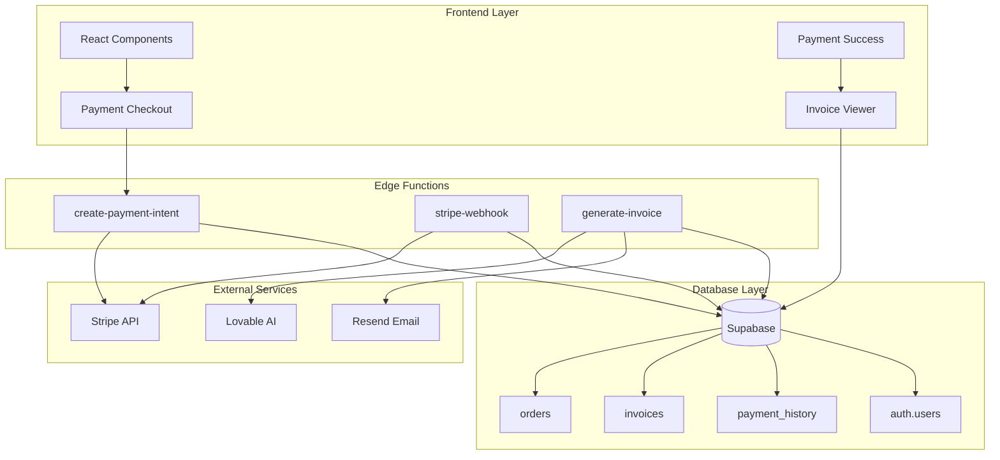
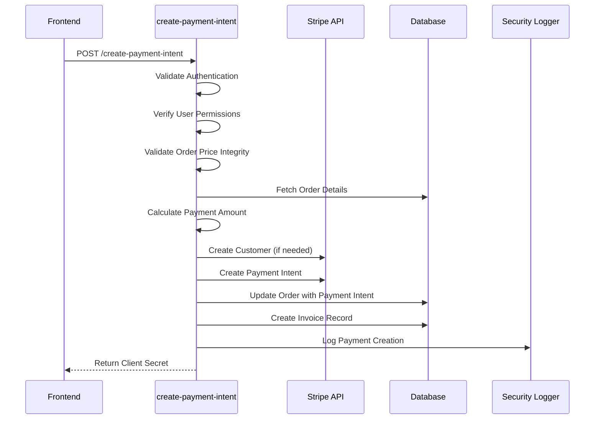
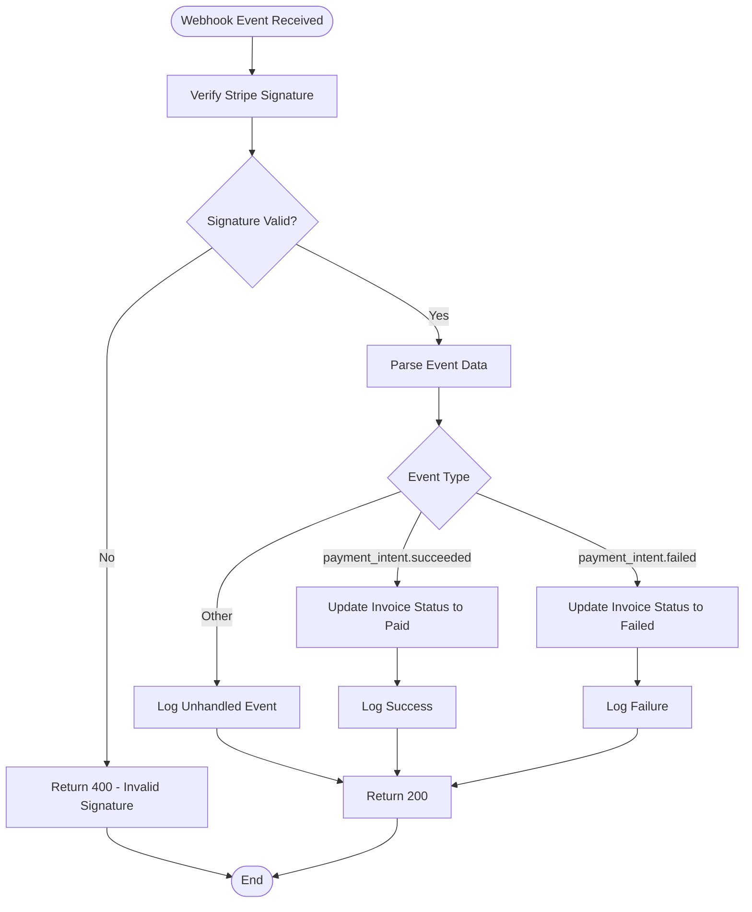
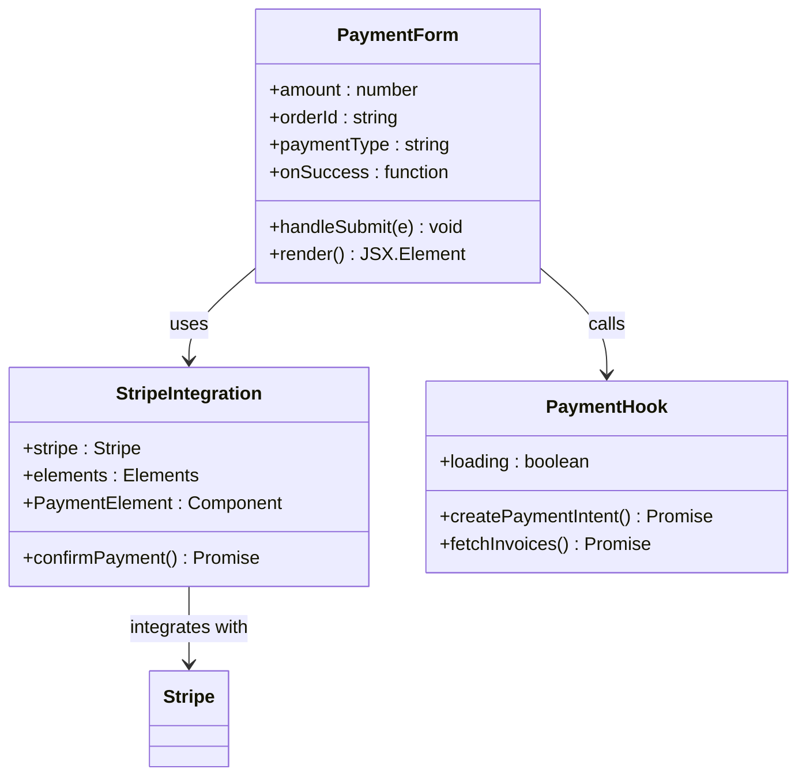
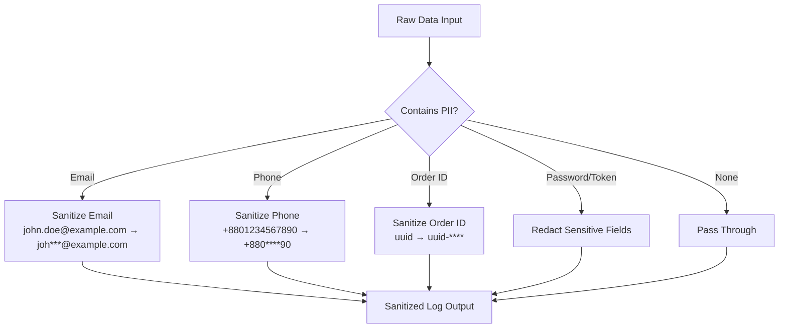
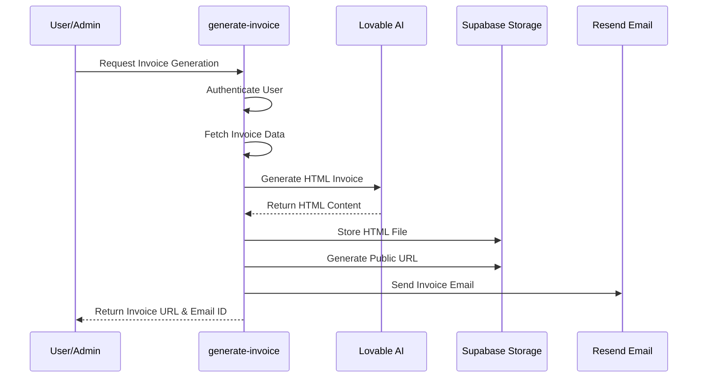
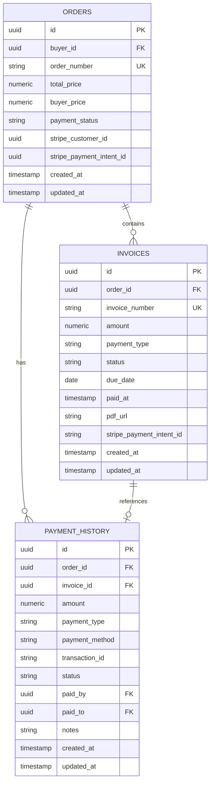
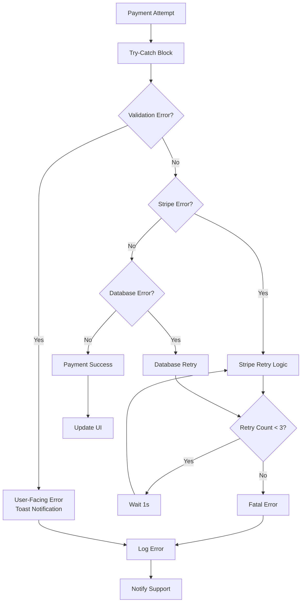
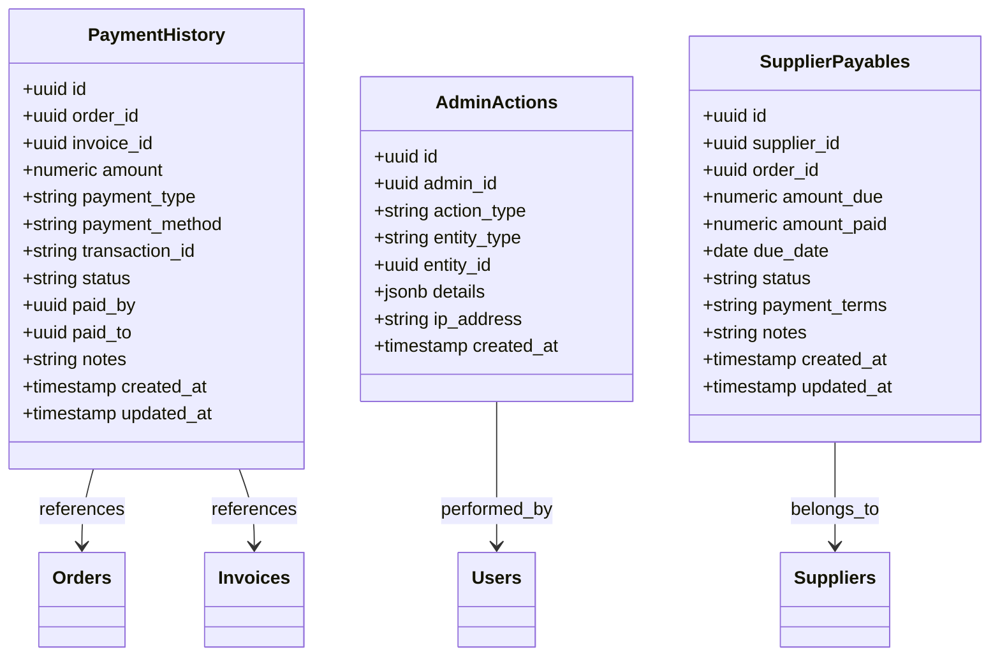

# Payment Processing Implementation

<cite>
**Referenced Files in This Document**
- [create-payment-intent/index.ts](file://supabase/functions/create-payment-intent/index.ts)
- [stripe-webhook/index.ts](file://supabase/functions/stripe-webhook/index.ts)
- [generate-invoice/index.ts](file://supabase/functions/generate-invoice/index.ts)
- [usePayment.ts](file://src/hooks/usePayment.ts)
- [PaymentForm.tsx](file://src/components/payment/PaymentForm.tsx)
- [PaymentCheckout.tsx](file://src/pages/PaymentCheckout.tsx)
- [PaymentSuccess.tsx](file://src/pages/PaymentSuccess.tsx)
- [PaymentManagement.tsx](file://src/components/admin/PaymentManagement.tsx)
- [InvoiceViewer.tsx](file://src/components/payment/InvoiceViewer.tsx)
- [logger.ts](file://supabase/functions/_shared/logger.ts)
- [client.ts](file://src/integrations/supabase/client.ts)
- [types.ts](file://src/integrations/supabase/types.ts)
- [20251115150759_remix_migration_from_pg_dump.sql](file://supabase/migrations/20251115150759_remix_migration_from_pg_dump.sql)
- [20251120233928_2016afb8-d720-4858-9e12-7fb4ebbd5de0.sql](file://supabase/migrations/20251120233928_2016afb8-d720-4858-9e12-7fb4ebbd5de0.sql)
</cite>

## Table of Contents
1. [Introduction](#introduction)
2. [System Architecture](#system-architecture)
3. [Core Payment Functions](#core-payment-functions)
4. [Security Implementation](#security-implementation)
5. [Invoice Generation System](#invoice-generation-system)
6. [Payment State Management](#payment-state-management)
7. [Error Handling and Retry Logic](#error-handling-and-retry-logic)
8. [Compliance and Reconciliation](#compliance-and-reconciliation)
9. [Performance Considerations](#performance-considerations)
10. [Troubleshooting Guide](#troubleshooting-guide)

## Introduction

The Sleek Apparels payment processing system is a comprehensive financial transaction platform built on modern web technologies, integrating Stripe for payment processing and Supabase for backend services. The system handles secure financial transactions, invoice generation, and payment state management while maintaining strict security standards and compliance requirements.

The payment system supports multiple payment types (deposit, balance, full payment) and integrates with Stripe's payment intents for secure transaction processing. It includes robust security measures, automated invoice generation using AI, and comprehensive audit trails for financial compliance.

## System Architecture

The payment processing system follows a serverless architecture with edge functions handling payment operations, integrated with Stripe's API for payment processing and Supabase for data persistence and authentication.



**Diagram sources**
- [PaymentCheckout.tsx](file://src/pages/PaymentCheckout.tsx#L1-L174)
- [create-payment-intent/index.ts](file://supabase/functions/create-payment-intent/index.ts#L1-L288)
- [stripe-webhook/index.ts](file://supabase/functions/stripe-webhook/index.ts#L1-L114)
- [generate-invoice/index.ts](file://supabase/functions/generate-invoice/index.ts#L1-L243)

**Section sources**
- [PaymentCheckout.tsx](file://src/pages/PaymentCheckout.tsx#L1-L174)
- [create-payment-intent/index.ts](file://supabase/functions/create-payment-intent/index.ts#L1-L288)
- [stripe-webhook/index.ts](file://supabase/functions/stripe-webhook/index.ts#L1-L114)
- [generate-invoice/index.ts](file://supabase/functions/generate-invoice/index.ts#L1-L243)

## Core Payment Functions

### Create Payment Intent

The `create-payment-intent` function serves as the primary entry point for initiating payments, handling order validation, customer creation, and payment intent generation.



**Diagram sources**
- [create-payment-intent/index.ts](file://supabase/functions/create-payment-intent/index.ts#L18-L288)

The function implements comprehensive security checks including:

- **Authentication Verification**: Validates JWT tokens and ensures user authentication
- **Authorization Checks**: Verifies user permissions (buyer or admin access)
- **Price Integrity Validation**: Compares order prices against original quotes with ±0.5% tolerance
- **Tampering Detection**: Monitors recent order modifications
- **Duplicate Prevention**: Prevents multiple payment intents for the same order

**Section sources**
- [create-payment-intent/index.ts](file://supabase/functions/create-payment-intent/index.ts#L18-L288)

### Stripe Webhook Processing

The webhook handler processes Stripe events to maintain payment state synchronization between Stripe and the application database.



**Diagram sources**
- [stripe-webhook/index.ts](file://supabase/functions/stripe-webhook/index.ts#L40-L114)

**Section sources**
- [stripe-webhook/index.ts](file://supabase/functions/stripe-webhook/index.ts#L1-L114)

### Payment Form Integration

The frontend payment form integrates with Stripe Elements for secure payment collection and handles the payment confirmation flow.



**Diagram sources**
- [PaymentForm.tsx](file://src/components/payment/PaymentForm.tsx#L1-L94)
- [usePayment.ts](file://src/hooks/usePayment.ts#L1-L68)

**Section sources**
- [PaymentForm.tsx](file://src/components/payment/PaymentForm.tsx#L1-L94)
- [usePayment.ts](file://src/hooks/usePayment.ts#L1-L68)

## Security Implementation

### PII Protection and Data Sanitization

The system implements comprehensive data protection measures to safeguard personally identifiable information (PII) throughout the payment process.



**Diagram sources**
- [logger.ts](file://supabase/functions/_shared/logger.ts#L14-L76)

The security logger implements the following sanitization rules:

- **Email Protection**: Shows first 3 characters and domain, masking the rest
- **Phone Number Protection**: Preserves country code and last 2 digits, masking middle digits
- **Order ID Protection**: Shows first 8 characters, masking UUID portion
- **Token Protection**: Redacts passwords, tokens, and secrets entirely

**Section sources**
- [logger.ts](file://supabase/functions/_shared/logger.ts#L1-L173)

### Webhook Signature Verification

All webhook endpoints implement Stripe's signature verification to prevent unauthorized access and ensure message authenticity.

**Section sources**
- [stripe-webhook/index.ts](file://supabase/functions/stripe-webhook/index.ts#L40-L51)

### Authentication and Authorization

The system implements role-based access control with multiple authorization layers:

- **User Authentication**: JWT-based authentication for all payment operations
- **Permission Verification**: Buyer access only for their own orders, admin access for all
- **Service Role Access**: Dedicated service roles for backend operations
- **Row-Level Security**: Database-level access controls for sensitive financial data

**Section sources**
- [create-payment-intent/index.ts](file://supabase/functions/create-payment-intent/index.ts#L39-L98)
- [generate-invoice/index.ts](file://supabase/functions/generate-invoice/index.ts#L85-L106)

## Invoice Generation System

### AI-Powered Invoice Creation

The invoice generation system leverages AI to create professional, customizable invoice documents with automated content generation.



**Diagram sources**
- [generate-invoice/index.ts](file://supabase/functions/generate-invoice/index.ts#L108-L243)

### Invoice Template Structure

The system generates professional invoices with the following structure:

| Component | Content | Purpose |
|-----------|---------|---------|
| Header | Company logo, invoice number, date | Brand identity and identification |
| Bill To | Recipient name, company, contact details | Clear billing address |
| From | Sender information (Sleek Apparels) | Company details |
| Order Details | Order number, product type, quantity, amount | Transaction breakdown |
| Payment Terms | Net 7 days, bank details | Payment instructions |
| Footer | Contact information, legal details | Additional information |

**Section sources**
- [generate-invoice/index.ts](file://supabase/functions/generate-invoice/index.ts#L108-L243)

### Invoice State Management

Invoices maintain comprehensive state tracking throughout the payment lifecycle:

```mermaid
stateDiagram-v2
[*] --> pending : Create Invoice
pending --> paid : Payment Success
pending --> failed : Payment Failed
paid --> [*] : Complete
failed --> [*] : Complete
note right of pending : Status : 'pending'<br/>Created at : timestamp<br/>Due date : 7 days from creation
note right of paid : Status : 'paid'<br/>Paid at : timestamp<br/>PDF URL : Generated invoice
note right of failed : Status : 'failed'<br/>Error details logged
```

**Diagram sources**
- [20251115150759_remix_migration_from_pg_dump.sql](file://supabase/migrations/20251115150759_remix_migration_from_pg_dump.sql#L1148-L1164)

**Section sources**
- [20251115150759_remix_migration_from_pg_dump.sql](file://supabase/migrations/20251115150759_remix_migration_from_pg_dump.sql#L1148-L1164)

## Payment State Management

### Database Schema Design

The payment system utilizes a comprehensive database schema with strong referential integrity and audit capabilities.



**Diagram sources**
- [20251115150759_remix_migration_from_pg_dump.sql](file://supabase/migrations/20251115150759_remix_migration_from_pg_dump.sql#L1148-L1164)
- [20251120233928_2016afb8-d720-4858-9e12-7fb4ebbd5de0.sql](file://supabase/migrations/20251120233928_2016afb8-d720-4858-9e12-7fb4ebbd5de0.sql#L59-L74)

### Payment Lifecycle Tracking

The system maintains comprehensive payment lifecycle tracking with immutable audit trails:

- **Payment History Records**: Complete transaction history with timestamps
- **State Transitions**: Clear progression from pending to paid/failed
- **Reference Integrity**: Strong relationships between orders, invoices, and payments
- **Immutable Logs**: Non-deletable audit trails for compliance

**Section sources**
- [20251120233928_2016afb8-d720-4858-9e12-7fb4ebbd5de0.sql](file://supabase/migrations/20251120233928_2016afb8-d720-4858-9e12-7fb4ebbd5de0.sql#L59-L74)

## Error Handling and Retry Logic

### Comprehensive Error Management

The payment system implements multi-layered error handling with graceful degradation and user feedback:



**Diagram sources**
- [create-payment-intent/index.ts](file://supabase/functions/create-payment-intent/index.ts#L279-L288)
- [stripe-webhook/index.ts](file://supabase/functions/stripe-webhook/index.ts#L106-L113)

### Idempotency and Duplicate Prevention

The system implements several mechanisms to prevent duplicate payments and handle idempotent operations:

- **Payment Intent ID Tracking**: Unique identifiers prevent duplicate processing
- **Order State Validation**: Checks payment status before processing
- **Webhook Deduplication**: Stripe's webhook signatures prevent replay attacks
- **Database Constraints**: Unique indexes prevent duplicate records

**Section sources**
- [create-payment-intent/index.ts](file://supabase/functions/create-payment-intent/index.ts#L151-L155)
- [stripe-webhook/index.ts](file://supabase/functions/stripe-webhook/index.ts#L60-L99)

## Compliance and Reconciliation

### Audit Trail Implementation

The system maintains comprehensive audit trails for financial compliance:



**Diagram sources**
- [20251120233928_2016afb8-d720-4858-9e12-7fb4ebbd5de0.sql](file://supabase/migrations/20251120233928_2016afb8-d720-4858-9e12-7fb4ebbd5de0.sql#L59-L89)

### Compliance Features

The system includes several compliance-enhancing features:

- **Immutable Records**: Payment history cannot be deleted or modified
- **Detailed Logging**: Complete audit trails for all financial operations
- **Role-Based Access**: Administrative separation for financial operations
- **Data Retention**: Configurable retention policies for compliance
- **Export Capabilities**: Structured data export for accounting systems

**Section sources**
- [20251120233928_2016afb8-d720-4858-9e12-7fb4ebbd5de0.sql](file://supabase/migrations/20251120233928_2016afb8-d720-4858-9e12-7fb4ebbd5de0.sql#L117-L131)

## Performance Considerations

### Optimization Strategies

The payment system implements several performance optimization strategies:

- **Database Indexing**: Strategic indexes on frequently queried fields
- **Connection Pooling**: Efficient database connection management
- **Caching Layers**: Edge caching for static payment data
- **Async Processing**: Non-blocking operations for invoice generation
- **Batch Operations**: Efficient bulk updates for webhook processing

### Scalability Features

- **Horizontal Scaling**: Stateless edge functions support unlimited scaling
- **Database Partitioning**: Large table partitioning for performance
- **CDN Integration**: Static assets served through CDN
- **Rate Limiting**: Built-in rate limiting for security and performance

## Troubleshooting Guide

### Common Issues and Solutions

#### Payment Intent Creation Failures

**Symptoms**: Payment intent creation fails with authentication errors
**Causes**: 
- Invalid JWT token
- Insufficient user permissions
- Expired session

**Solutions**:
1. Verify user authentication status
2. Check user role permissions
3. Refresh authentication token
4. Validate order ownership

#### Webhook Processing Issues

**Symptoms**: Payments not updating in database
**Causes**:
- Invalid webhook signature
- Missing webhook endpoint configuration
- Database connectivity issues

**Solutions**:
1. Verify webhook signing secret
2. Check endpoint URL configuration
3. Monitor database connectivity
4. Review webhook logs

#### Invoice Generation Problems

**Symptoms**: Invoice generation fails or produces blank documents
**Causes**:
- AI service unavailability
- Missing order data
- Storage permission issues

**Solutions**:
1. Verify AI service availability
2. Check order data completeness
3. Validate storage permissions
4. Review AI response content

### Monitoring and Debugging

The system provides comprehensive monitoring capabilities:

- **Structured Logging**: JSON-formatted logs with PII sanitization
- **Performance Metrics**: Response times and error rates
- **Security Events**: Authentication and authorization logs
- **Payment Traces**: Complete payment lifecycle tracking

**Section sources**
- [logger.ts](file://supabase/functions/_shared/logger.ts#L1-L173)