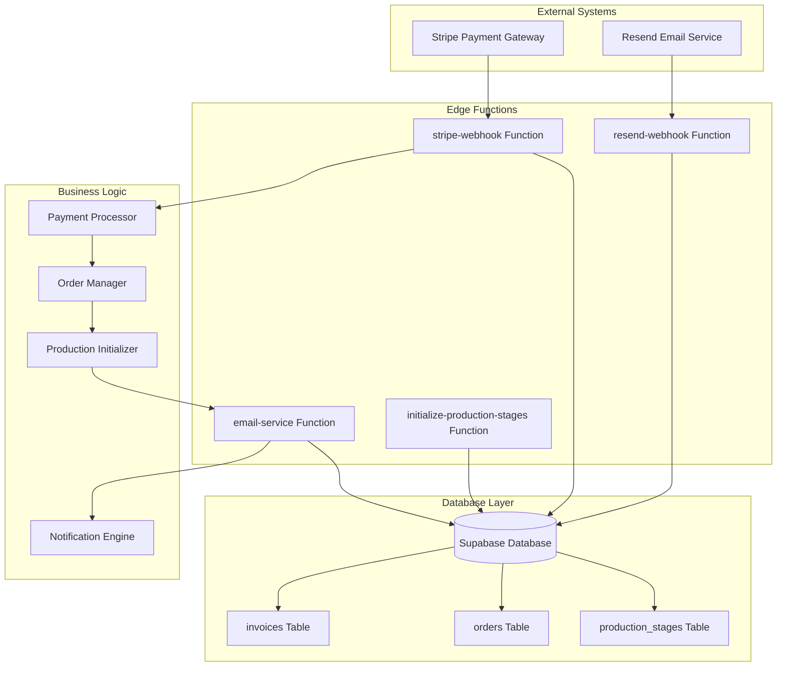
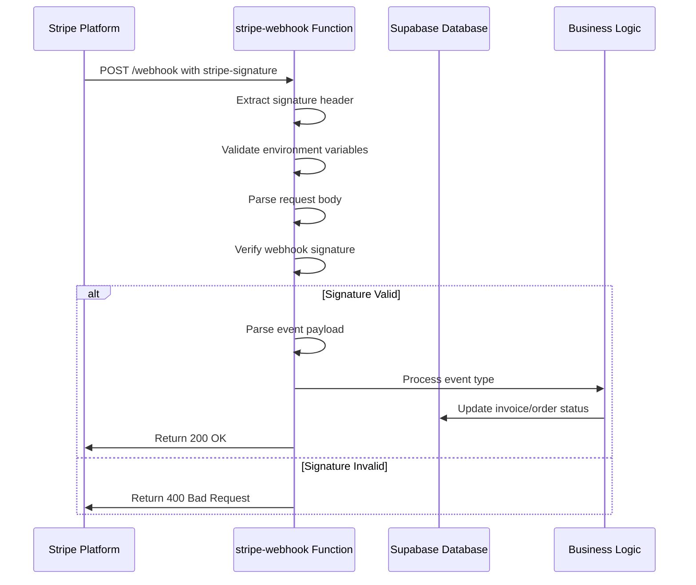
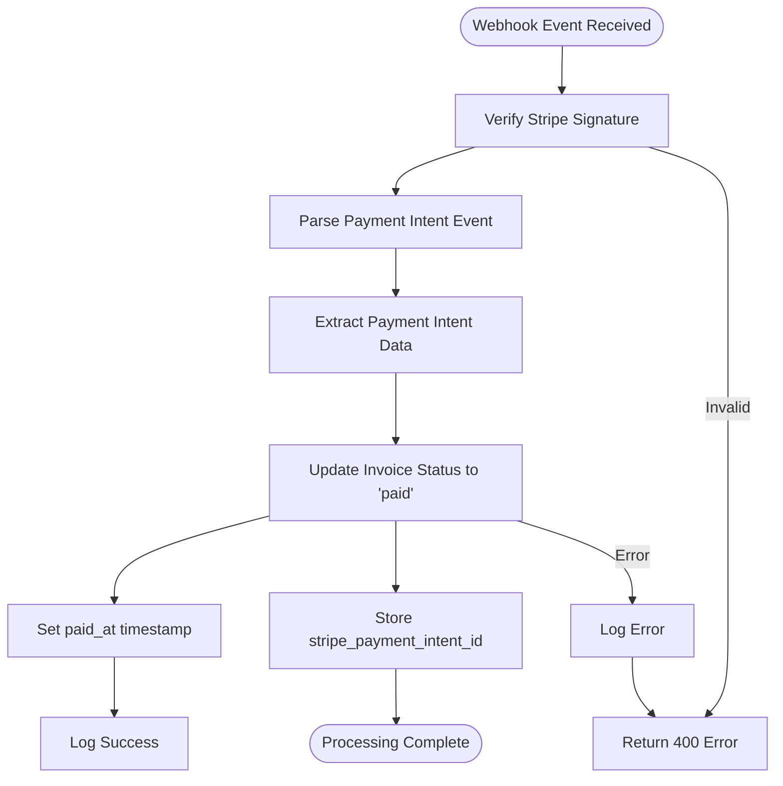
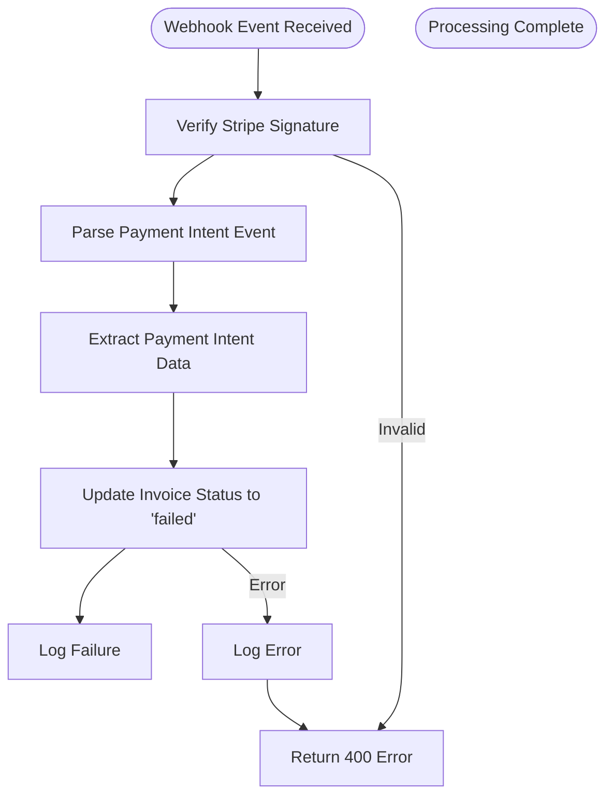
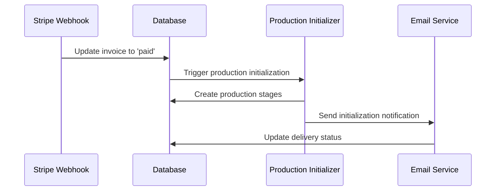
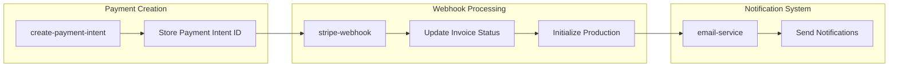

# Webhook Event Processing System

<cite>
**Referenced Files in This Document**
- [supabase/functions/stripe-webhook/index.ts](file://supabase/functions/stripe-webhook/index.ts)
- [src/types/database.ts](file://src/types/database.ts)
- [supabase/functions/create-payment-intent/index.ts](file://supabase/functions/create-payment-intent/index.ts)
- [supabase/functions/initialize-production-stages/index.ts](file://supabase/functions/initialize-production-stages/index.ts)
- [supabase/functions/email-service/index.ts](file://supabase/functions/email-service/index.ts)
- [supabase/functions/resend-webhook/index.ts](file://supabase/functions/resend-webhook/index.ts)
- [supabase/functions/resend-webhook/index.ts](file://supabase/functions/resend-webhook/index.ts)
</cite>

## Table of Contents
1. [Introduction](#introduction)
2. [System Architecture](#system-architecture)
3. [Stripe Webhook Implementation](#stripe-webhook-implementation)
4. [Event Processing Logic](#event-processing-logic)
5. [Database Schema Changes](#database-schema-changes)
6. [Security Considerations](#security-considerations)
7. [Error Handling and Reliability](#error-handling-and-reliability)
8. [Integration Patterns](#integration-patterns)
9. [Troubleshooting Guide](#troubleshooting-guide)
10. [Best Practices](#best-practices)

## Introduction

The Webhook Event Processing system is a critical component of the Sleek Apparels platform that handles Stripe payment lifecycle events in real-time. This system ensures reliable payment processing, order status synchronization, and automated business workflows through secure webhook validation and robust event handling mechanisms.

The system processes two primary Stripe webhook events: `payment_intent.succeeded` and `payment_intent.payment_failed`, which trigger corresponding database updates and business logic execution. It maintains strict security standards through signature verification, implements replay attack prevention, and provides comprehensive error handling for reliable event delivery.

## System Architecture

The webhook processing system follows a serverless architecture built on Supabase Edge Functions, utilizing Deno runtime for secure, scalable event processing.



**Diagram sources**
- [supabase/functions/stripe-webhook/index.ts](file://supabase/functions/stripe-webhook/index.ts#L1-L114)
- [supabase/functions/email-service/index.ts](file://supabase/functions/email-service/index.ts#L1-L555)
- [supabase/functions/resend-webhook/index.ts](file://supabase/functions/resend-webhook/index.ts#L1-L117)

## Stripe Webhook Implementation

### Signature Verification Process

The Stripe webhook implementation employs robust signature verification to ensure event authenticity and prevent unauthorized access.



**Diagram sources**
- [supabase/functions/stripe-webhook/index.ts](file://supabase/functions/stripe-webhook/index.ts#L16-L50)

### Environment Configuration

The webhook function requires specific environment variables for secure operation:

| Variable | Purpose | Security Level |
|----------|---------|----------------|
| `STRIPE_SECRET_KEY` | Stripe API authentication | High |
| `STRIPE_WEBHOOK_SECRET` | Webhook signature verification | High |
| `SUPABASE_URL` | Database connection endpoint | Medium |
| `SUPABASE_SERVICE_ROLE_KEY` | Database access credentials | High |

**Section sources**
- [supabase/functions/stripe-webhook/index.ts](file://supabase/functions/stripe-webhook/index.ts#L16-L18)

### CORS and Header Management

The system implements comprehensive CORS headers to support cross-origin requests while maintaining security:

```typescript
const corsHeaders = {
  'Access-Control-Allow-Origin': '*',
  'Access-Control-Allow-Headers': 'authorization, x-client-info, apikey, content-type, stripe-signature'
};
```

**Section sources**
- [supabase/functions/stripe-webhook/index.ts](file://supabase/functions/stripe-webhook/index.ts#L5-L8)

## Event Processing Logic

### Payment Success Handling

When a `payment_intent.succeeded` event is received, the system performs the following operations:



**Diagram sources**
- [supabase/functions/stripe-webhook/index.ts](file://supabase/functions/stripe-webhook/index.ts#L62-L78)

The payment success event triggers comprehensive database updates:

```typescript
// Update invoice status to 'paid'
const { error: updateError } = await supabase
  .from('invoices')
  .update({
    status: 'paid',
    paid_at: new Date().toISOString(),
    stripe_payment_intent_id: paymentIntent.id,
  })
  .eq('stripe_payment_intent_id', paymentIntent.id);
```

**Section sources**
- [supabase/functions/stripe-webhook/index.ts](file://supabase/functions/stripe-webhook/index.ts#L66-L74)

### Payment Failure Handling

For `payment_intent.payment_failed` events, the system updates the invoice status to 'failed':



**Diagram sources**
- [supabase/functions/stripe-webhook/index.ts](file://supabase/functions/stripe-webhook/index.ts#L82-L93)

**Section sources**
- [supabase/functions/stripe-webhook/index.ts](file://supabase/functions/stripe-webhook/index.ts#L86-L90)

### Unhandled Event Types

The system gracefully handles unanticipated event types by logging them for monitoring:

```typescript
default:
  console.log('Unhandled event type:', event.type);
```

**Section sources**
- [supabase/functions/stripe-webhook/index.ts](file://supabase/functions/stripe-webhook/index.ts#L97-L98)

## Database Schema Changes

### Invoice Table Modifications

The database schema includes specific fields to support Stripe payment tracking:

| Column | Type | Purpose | Nullable |
|--------|------|---------|----------|
| `stripe_payment_intent_id` | string | Unique identifier for Stripe payment intents | Yes |
| `status` | string | Current invoice status (pending, paid, failed) | No |
| `paid_at` | timestamp | Timestamp when payment was completed | Yes |

**Section sources**
- [src/types/database.ts](file://src/types/database.ts#L312-L325)

### Order Table Enhancements

Orders also utilize the `stripe_payment_intent_id` field for payment correlation:

| Column | Type | Purpose | Nullable |
|--------|------|---------|----------|
| `stripe_payment_intent_id` | string | Associated Stripe payment intent | Yes |
| `payment_status` | enum | Current payment status | No |

**Section sources**
- [src/types/database.ts](file://src/types/database.ts#L399-L438)

### Production Stage Initialization

Upon successful payment, the system automatically initializes production stages through the `initialize-production-stages` function:



**Diagram sources**
- [supabase/functions/initialize-production-stages/index.ts](file://supabase/functions/initialize-production-stages/index.ts#L65-L133)

**Section sources**
- [supabase/functions/initialize-production-stages/index.ts](file://supabase/functions/initialize-production-stages/index.ts#L20-L133)

## Security Considerations

### Webhook Signature Validation

The system implements Stripe's recommended webhook signature verification:

```typescript
try {
  event = stripe.webhooks.constructEvent(body, signature, stripeWebhookSecret);
} catch (err: any) {
  console.error('Webhook signature verification failed:', err.message);
  return new Response(JSON.stringify({ error: 'Invalid signature' }), {
    status: 400,
    headers: { ...corsHeaders, 'Content-Type': 'application/json' },
  });
}
```

**Section sources**
- [supabase/functions/stripe-webhook/index.ts](file://supabase/functions/stripe-webhook/index.ts#L43-L50)

### Replay Attack Prevention

While the current implementation doesn't explicitly implement timestamp validation, Stripe webhooks inherently provide protection against replay attacks through:

1. **Unique Event IDs**: Each webhook carries a unique event ID
2. **Signature Validation**: Events are cryptographically signed
3. **Idempotent Processing**: Database operations are designed to handle duplicate events safely

### Error Response Standards

The system provides standardized error responses for different failure scenarios:

| Status Code | Scenario | Response Body |
|-------------|----------|---------------|
| 400 | Missing signature or invalid signature | `{ error: 'Invalid signature' }` |
| 400 | Missing Stripe configuration | `{ error: 'Stripe configuration missing' }` |
| 500 | Internal processing error | `{ error: 'Internal server error' }` |

**Section sources**
- [supabase/functions/stripe-webhook/index.ts](file://supabase/functions/stripe-webhook/index.ts#L22-L50)

## Error Handling and Reliability

### Comprehensive Error Logging

The system implements extensive logging for debugging and monitoring:

```typescript
console.error('Webhook signature verification failed:', err.message);
console.error('Error updating invoice:', updateError);
console.error('Webhook error:', error);
```

### Graceful Degradation

When database operations fail, the system continues processing subsequent events while logging errors for later investigation:

```typescript
if (updateError) {
  console.error('Error updating invoice:', updateError);
}
```

**Section sources**
- [supabase/functions/stripe-webhook/index.ts](file://supabase/functions/stripe-webhook/index.ts#L76-L92)

### Idempotency Considerations

The database queries use equality conditions to ensure idempotent processing:

```typescript
.eq('stripe_payment_intent_id', paymentIntent.id)
```

This prevents duplicate updates when processing replayed events.

### Retry Mechanisms

While not explicitly implemented in the current webhook handler, the system architecture supports retry mechanisms through:

1. **Stripe's Built-in Retries**: Stripe automatically retries failed webhook deliveries
2. **Database Transaction Safety**: Operations are designed to be safe for retry attempts
3. **Idempotent Updates**: Duplicate processing doesn't cause data inconsistencies

## Integration Patterns

### Payment Lifecycle Integration

The webhook system integrates seamlessly with the broader payment lifecycle:



**Diagram sources**
- [supabase/functions/create-payment-intent/index.ts](file://supabase/functions/create-payment-intent/index.ts#L1-L287)
- [supabase/functions/stripe-webhook/index.ts](file://supabase/functions/stripe-webhook/index.ts#L1-L114)

### Email Notification Workflow

Failed payment events trigger automated follow-up notifications through the email service:

```typescript
// Payment failure triggers notification workflow
case 'payment_intent.payment_failed': {
  const paymentIntent = event.data.object as Stripe.PaymentIntent;
  console.log('Payment failed:', paymentIntent.id);
  
  // Update invoice status
  const { error: updateError } = await supabase
    .from('invoices')
    .update({ status: 'failed' })
    .eq('stripe_payment_intent_id', paymentIntent.id);
  
  if (updateError) {
    console.error('Error updating invoice:', updateError);
  }
  break;
}
```

**Section sources**
- [supabase/functions/stripe-webhook/index.ts](file://supabase/functions/stripe-webhook/index.ts#L82-L94)

## Troubleshooting Guide

### Common Issues and Solutions

#### 1. Missing Stripe Configuration

**Symptom**: "Stripe configuration missing" error
**Cause**: Missing environment variables (`STRIPE_SECRET_KEY` or `STRIPE_WEBHOOK_SECRET`)
**Solution**: Verify environment variable configuration in Supabase dashboard

#### 2. Invalid Webhook Signature

**Symptom**: "Invalid signature" error
**Cause**: Incorrect webhook secret or tampered request
**Solution**: 
- Verify webhook secret matches Stripe dashboard configuration
- Check for network interception or modification
- Ensure proper header transmission

#### 3. Database Update Failures

**Symptom**: Error logs showing database update failures
**Cause**: Database connectivity issues or constraint violations
**Solution**:
- Check database connection status
- Verify table permissions for service role
- Review constraint violations in error logs

#### 4. Event Processing Delays

**Symptom**: Webhook events not processed immediately
**Cause**: Function cold starts or database latency
**Solution**:
- Monitor function execution metrics
- Optimize database queries
- Consider connection pooling

### Debugging Tools

#### Log Analysis
Monitor system logs for:
- Signature verification failures
- Database operation errors
- Event processing timestamps

#### Health Checks
Implement health checks for:
- Stripe webhook endpoint availability
- Database connectivity status
- Function execution performance

**Section sources**
- [supabase/functions/stripe-webhook/index.ts](file://supabase/functions/stripe-webhook/index.ts#L20-L50)

## Best Practices

### Security Hardening

1. **Environment Variable Protection**: Store sensitive keys in encrypted environment variables
2. **Minimal Permissions**: Use service role keys with minimal required permissions
3. **Regular Rotation**: Implement periodic rotation of webhook secrets
4. **Network Security**: Restrict webhook endpoint access to trusted IP ranges

### Performance Optimization

1. **Connection Pooling**: Reuse database connections across function invocations
2. **Async Processing**: Use asynchronous database operations where possible
3. **Caching**: Implement caching for frequently accessed data
4. **Monitoring**: Set up comprehensive monitoring and alerting

### Operational Excellence

1. **Idempotency**: Design all operations to be idempotent
2. **Error Handling**: Implement comprehensive error handling and logging
3. **Testing**: Create automated tests for webhook processing
4. **Documentation**: Maintain up-to-date documentation for all webhook endpoints

### Monitoring and Observability

1. **Metrics Collection**: Track webhook processing metrics
2. **Error Rates**: Monitor error rates and processing times
3. **Alerting**: Set up alerts for webhook failures
4. **Audit Logs**: Maintain comprehensive audit trails

The Webhook Event Processing system provides a robust foundation for handling Stripe payment lifecycle events with strong security guarantees, comprehensive error handling, and seamless integration with the broader business logic. Its design prioritizes reliability, security, and maintainability while supporting the complex requirements of an e-commerce manufacturing platform.