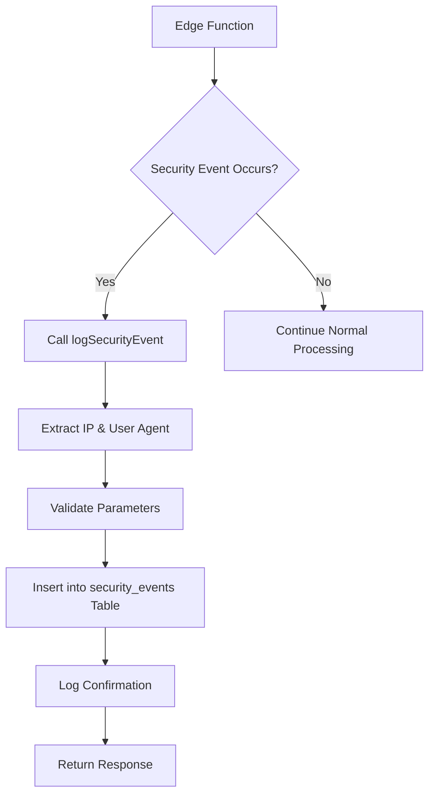
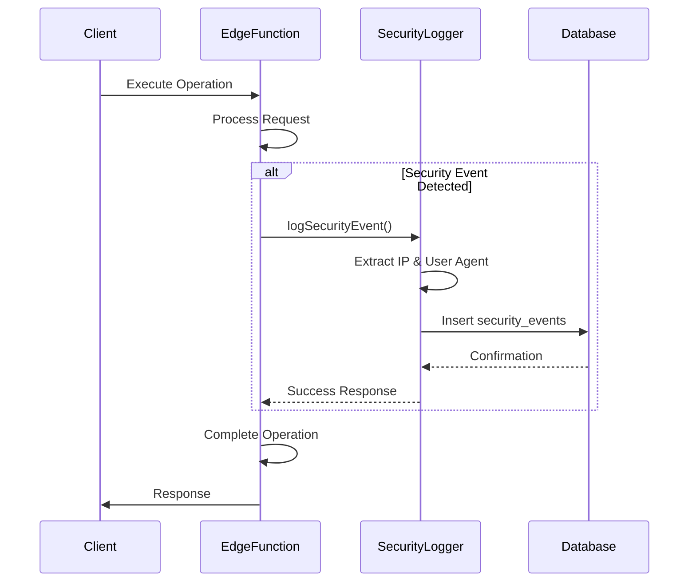
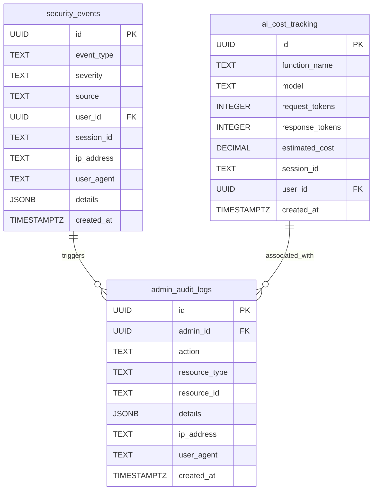

# Shared Utilities

<cite>
**Referenced Files in This Document**   
- [_shared/logger.ts](file://supabase/functions/_shared/logger.ts)
- [shared/securityLogger.ts](file://supabase/functions/shared/securityLogger.ts)
- [log-audit-action/index.ts](file://supabase/functions/log-audit-action/index.ts)
- [log-security-event/index.ts](file://supabase/functions/log-security-event/index.ts)
- [migrations/20251127194411_08e21416-fb07-4471-a062-d1c8e91e52c3.sql](file://supabase/migrations/20251127194411_08e21416-fb07-4471-a062-d1c8e91e52c3.sql)
- [src/lib/auditLog.ts](file://src/lib/auditLog.ts)
- [src/lib/enhancedAuditLog.ts](file://src/lib/enhancedAuditLog.ts)
- [create-payment-intent/index.ts](file://supabase/functions/create-payment-intent/index.ts)
- [send-otp/index.ts](file://supabase/functions/send-otp/index.ts)
- [verify-otp/index.ts](file://supabase/functions/verify-otp/index.ts)
</cite>

## Table of Contents
1. [Introduction](#introduction)
2. [Core Logging Utilities](#core-logging-utilities)
3. [Security Event Logging](#security-event-logging)
4. [Audit Trail Management](#audit-trail-management)
5. [Usage Examples](#usage-examples)
6. [Data Models](#data-models)
7. [Integration with Monitoring](#integration-with-monitoring)
8. [Best Practices](#best-practices)

## Introduction

The Shared Utilities implementation provides a comprehensive logging and monitoring framework for all edge functions in the SleekApparels platform. This system ensures consistent logging practices, sensitive data protection, and comprehensive audit trails across all backend services. The utilities are designed to support operational monitoring, security analysis, compliance requirements, and troubleshooting capabilities.

The logging infrastructure consists of three main components: structured application logging with PII sanitization, centralized security event handling, and audit trail management for critical operations. These utilities are consumed by all edge functions to maintain consistency in logging format, security practices, and data governance.

**Section sources**
- [supabase/functions/_shared/logger.ts](file://supabase/functions/_shared/logger.ts)
- [supabase/functions/shared/securityLogger.ts](file://supabase/functions/shared/securityLogger.ts)
- [supabase/functions/log-audit-action/index.ts](file://supabase/functions/log-audit-action/index.ts)

## Core Logging Utilities

The `_shared/logger.ts` utility provides structured logging capabilities with automatic PII (Personally Identifiable Information) sanitization. This logger ensures that sensitive data is never exposed in log outputs while maintaining the ability to debug and monitor system behavior effectively.

The logger implements four primary logging levels:
- **INFO**: General operational messages and routine events
- **WARN**: Recoverable issues and potential problems
- **ERROR**: Failures and exceptions that require attention
- **SUCCESS**: Successful completion of important operations

Each log entry follows a standardized JSON format with the following structure:
```json
{
  "level": "INFO|WARN|ERROR|SUCCESS",
  "timestamp": "ISO8601 format",
  "context": "Source function or component",
  "message": "Human-readable message",
  "data": "Additional structured data (sanitized)"
}
```

The logger automatically sanitizes known PII fields in log data, including email addresses, phone numbers, order IDs, and authentication tokens. Email addresses are masked to show only the first three characters and domain (e.g., joh***@example.com), phone numbers show only the first four and last two digits (e.g., +880****90), and order IDs display only the first eight characters (e.g., 550e8400-****). Passwords, tokens, and secrets are completely redacted as "[REDACTED]".

Edge functions create logger instances with a specific context identifier, allowing for easy filtering and analysis of logs by function or component. For example, the `create-payment-intent` function creates its logger with `createLogger('create-payment-intent')`, ensuring all logs from this function are clearly identified.

**Section sources**
- [supabase/functions/_shared/logger.ts](file://supabase/functions/_shared/logger.ts)
- [create-payment-intent/index.ts](file://supabase/functions/create-payment-intent/index.ts)
- [send-otp/index.ts](file://supabase/functions/send-otp/index.ts)

## Security Event Logging

The `shared/securityLogger.ts` utility centralizes security event handling across all edge functions. This module provides functions for logging security-related events and tracking AI service costs, ensuring comprehensive monitoring of potential threats and resource usage.

Security events are categorized into four types with corresponding severity levels:
- **captcha_failure**: Failed CAPTCHA verification attempts
- **rate_limit_violation**: Excessive request patterns from a single source
- **suspicious_pattern**: Anomalous behavior indicating potential attacks
- **cost_alert**: High-cost operations or potential abuse of AI services

Each security event includes contextual information such as IP address, user agent, session ID, and user ID (when available). This data enables security teams to analyze patterns, identify potential threats, and respond to incidents effectively.

The security logger also includes functionality for tracking AI service costs through the `logAICost` function. This tracks usage of AI models (such as Google Gemini and Perplexity Sonar) by recording request and response token counts, estimating costs based on known pricing models, and storing this information for financial monitoring and optimization.

Security events are stored in the `security_events` database table, which is protected by Row Level Security (RLS) policies that restrict access to service_role accounts only, ensuring that security monitoring data remains protected.



**Diagram sources **
- [supabase/functions/shared/securityLogger.ts](file://supabase/functions/shared/securityLogger.ts)
- [supabase/migrations/20251127194411_08e21416-fb07-4471-a062-d1c8e91e52c3.sql)

**Section sources**
- [supabase/functions/shared/securityLogger.ts](file://supabase/functions/shared/securityLogger.ts)
- [supabase/migrations/20251127194411_08e21416-fb07-4471-a062-d1c8e91e52c3.sql)

## Audit Trail Management

The audit trail system captures detailed records of critical operations through the `log-audit-action` and `log-security-event` edge functions. These utilities ensure comprehensive tracking of administrative actions, security events, and sensitive operations for compliance and accountability purposes.

The `log-audit-action` function captures administrative and operational actions in the `admin_audit_logs` table. Each audit log entry includes:
- **admin_id**: The authenticated user ID (validated via JWT)
- **action**: The operation performed (e.g., 'product_created', 'settings_changed')
- **resource_type**: The type of resource affected
- **resource_id**: The identifier of the specific resource
- **details**: Additional context about the operation
- **ip_address**: Client IP address extracted from headers
- **user_agent**: Client user agent string

The function implements strict security controls by validating the JWT token to authenticate the user and extract their ID, rather than trusting user-provided IDs in the request body. This prevents spoofing and ensures audit integrity.

The `log-security-event` function captures security-related events in the `security_events` table, providing a centralized repository for monitoring suspicious activities, rate limit violations, and other security concerns.

Both functions support CORS and include comprehensive error handling to ensure audit logging does not fail the primary operation while still recording any issues with the logging process itself.



**Diagram sources **
- [supabase/functions/log-audit-action/index.ts](file://supabase/functions/log-audit-action/index.ts)
- [supabase/functions/log-security-event/index.ts](file://supabase/functions/log-security-event/index.ts)

**Section sources**
- [supabase/functions/log-audit-action/index.ts](file://supabase/functions/log-audit-action/index.ts)
- [supabase/functions/log-security-event/index.ts](file://supabase/functions/log-security-event/index.ts)

## Usage Examples

The shared logging utilities are consistently used across various edge functions to ensure standardized logging practices. The `create-payment-intent` function demonstrates comprehensive logging implementation, using the logger for informational messages, warnings, errors, and success notifications.

For example, when creating a payment intent, the function logs:
- INFO: "Creating payment intent" with order and amount details
- WARN: "Order recently modified before payment" if applicable
- ERROR: Various validation failures with context
- SUCCESS: "Payment intent created" with the intent ID

The `send-otp` and `verify-otp` functions showcase security-focused logging, capturing OTP request patterns, CAPTCHA verification results, and rate limit violations. These functions use the logger to monitor for potential abuse while protecting sensitive data through sanitization.

Frontend components also utilize audit logging through the `enhancedAuditLog.ts` utility, which wraps the edge function calls and provides a convenient interface for logging user actions. This ensures consistent audit trail creation from both frontend and backend components.

The logging system is designed to be minimally invasive, requiring only a few lines of code to implement comprehensive logging in any edge function. Functions typically create a logger instance at the top of their file and then use it throughout their execution to capture relevant events.

**Section sources**
- [create-payment-intent/index.ts](file://supabase/functions/create-payment-intent/index.ts)
- [send-otp/index.ts](file://supabase/functions/send-otp/index.ts)
- [verify-otp/index.ts](file://supabase/functions/verify-otp/index.ts)
- [src/lib/enhancedAuditLog.ts](file://src/lib/enhancedAuditLog.ts)

## Data Models

The logging and audit system relies on several database tables to store and organize event data. The primary tables are `security_events`, `ai_cost_tracking`, and `admin_audit_logs`, each designed with specific purposes and access controls.

The `security_events` table stores security-related incidents with fields for event type, severity, source function, user context, IP address, user agent, and additional details in JSON format. This table is indexed for efficient querying by event type, severity, and IP address, enabling rapid analysis of security patterns.

The `ai_cost_tracking` table records AI service usage and estimated costs, allowing for financial monitoring and optimization of AI-powered features. It includes fields for the calling function, AI model used, token counts, and calculated costs based on current pricing.

The `admin_audit_logs` table captures administrative actions and sensitive operations, providing a complete trail of changes for compliance and accountability. This table is used by both backend services and frontend components through the edge function API.

All security and audit tables are protected by Row Level Security (RLS) policies that restrict access to service_role accounts, ensuring that monitoring data cannot be accessed or tampered with by unauthorized users.



**Diagram sources **
- [supabase/migrations/20251127194411_08e21416-fb07-4471-a062-d1c8e91e52c3.sql](file://supabase/migrations/20251127194411_08e21416-fb07-4471-a062-d1c8e91e52c3.sql)

**Section sources**
- [supabase/migrations/20251127194411_08e21416-fb07-4471-a062-d1c8e91e52c3.sql](file://supabase/migrations/20251127194411_08e21416-fb07-4471-a062-d1c8e91e52c3.sql)

## Integration with Monitoring

The logging utilities are integrated with monitoring and analytics dashboards to provide real-time visibility into system operations and security status. The `SecurityMonitoringDashboard` component in the admin interface displays key metrics derived from the logged data.

The system includes database views that aggregate security and cost data for efficient reporting:
- `ai_hourly_costs`: Aggregates AI service costs by hour, function, and model
- `daily_security_summary`: Summarizes security events by day, type, and severity

These views enable the admin dashboard to display trends in AI service usage costs and security event frequency without requiring complex queries on raw data. The dashboard shows metrics such as daily AI costs, recent security events, and patterns of suspicious activity.

The structured JSON format of logs enables integration with external monitoring services and log analysis platforms. The consistent schema allows for automated parsing, alerting, and anomaly detection across all edge functions.

Security events with high or critical severity trigger alerts for immediate investigation, while patterns of lower-severity events (such as multiple rate limit violations) are analyzed for potential coordinated attacks.

**Section sources**
- [src/components/admin/SecurityMonitoringDashboard.tsx](file://src/components/admin/SecurityMonitoringDashboard.tsx)
- [supabase/migrations/20251127194411_08e21416-fb07-4471-a062-d1c8e91e52c3.sql](file://supabase/migrations/20251127194411_08e21416-fb07-4471-a062-d1c8e91e52c3.sql)

## Best Practices

The shared utilities implementation follows several best practices for logging and monitoring in a production environment:

1. **Consistent Context**: All edge functions create logger instances with descriptive context names, enabling easy filtering and analysis of logs by component.

2. **PII Protection**: Sensitive data is automatically sanitized in all log outputs, preventing accidental exposure of personal information.

3. **Structured Format**: JSON-formatted logs with standardized fields enable automated parsing, analysis, and integration with monitoring tools.

4. **Comprehensive Coverage**: Critical operations are logged at multiple levels (info, warn, error, success) to provide complete visibility into system behavior.

5. **Security First**: Audit logging validates user identity through JWT rather than trusting client-provided user IDs, ensuring the integrity of audit trails.

6. **Performance Considerations**: Logging operations are designed to be non-blocking and resilient, with error handling that prevents logging failures from affecting primary functionality.

7. **Cost Awareness**: AI service usage is tracked and cost-estimated, enabling financial monitoring and optimization of AI-powered features.

8. **Compliance Ready**: Audit trails capture sufficient detail for regulatory compliance, including user identity, timestamps, IP addresses, and operation details.

These utilities ensure that all edge functions in the SleekApparels platform maintain consistent logging standards, enabling effective monitoring, troubleshooting, and security analysis across the entire system.

**Section sources**
- [supabase/functions/_shared/logger.ts](file://supabase/functions/_shared/logger.ts)
- [supabase/functions/shared/securityLogger.ts](file://supabase/functions/shared/securityLogger.ts)
- [supabase/functions/log-audit-action/index.ts](file://supabase/functions/log-audit-action/index.ts)