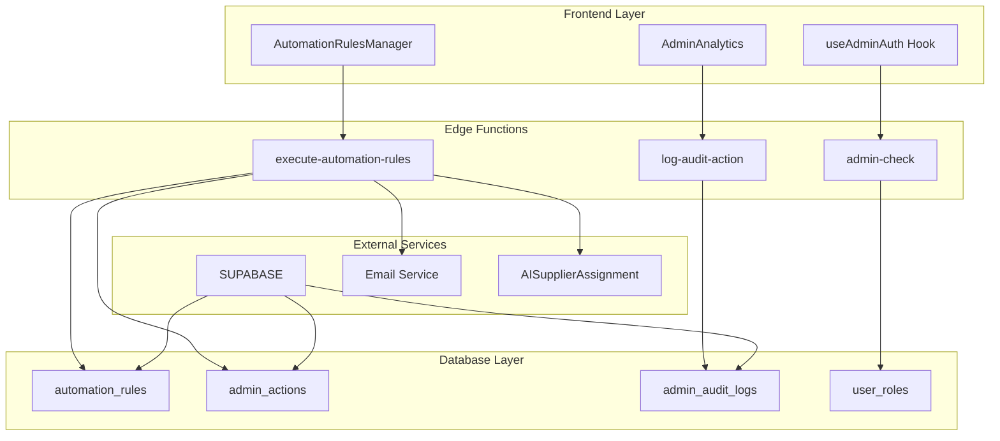
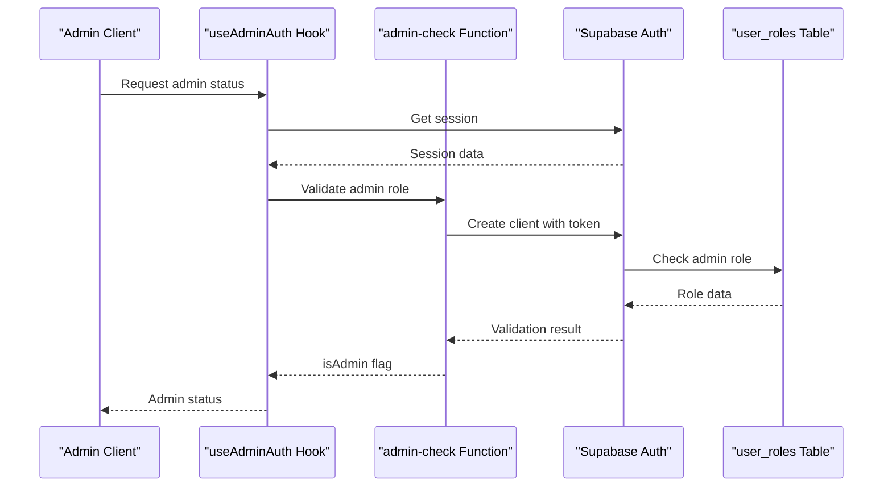
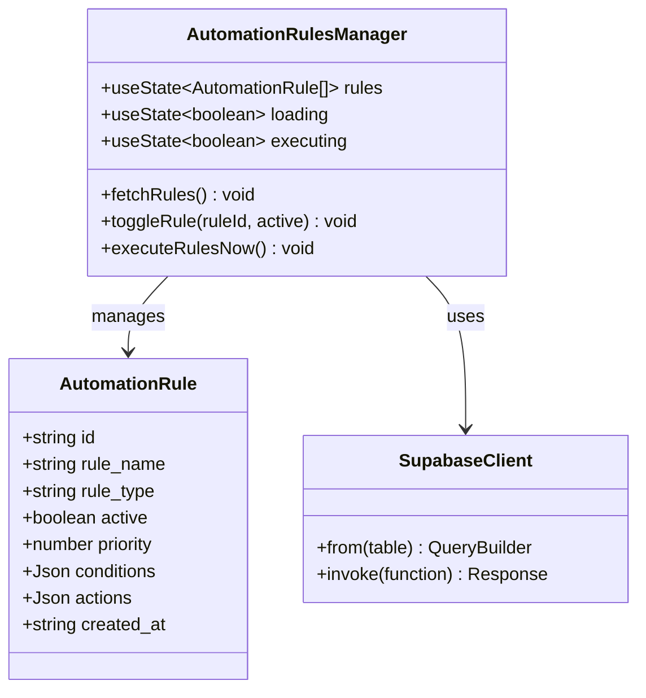
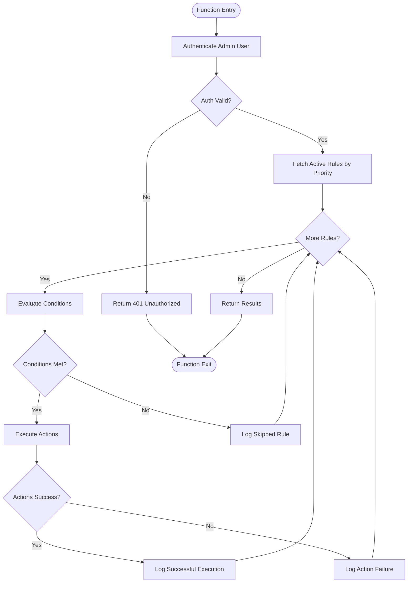
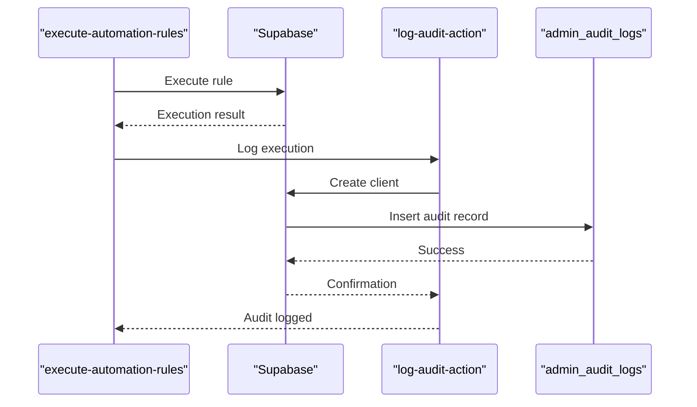
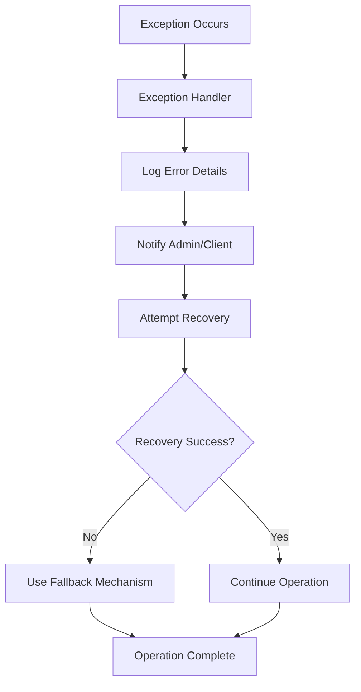

# Automation Rules Engine

<cite>
**Referenced Files in This Document**
- [execute-automation-rules/index.ts](file://supabase/functions/execute-automation-rules/index.ts)
- [AutomationRulesManager.tsx](file://src/components/admin/AutomationRulesManager.tsx)
- [useAdminAuth.ts](file://src/hooks/useAdminAuth.ts)
- [admin-check/index.ts](file://supabase/functions/admin-check/index.ts)
- [enhancedAuditLog.ts](file://src/lib/enhancedAuditLog.ts)
- [auditLog.ts](file://src/lib/auditLog.ts)
- [log-audit-action/index.ts](file://supabase/functions/log-audit-action/index.ts)
- [AdminAnalytics.tsx](file://src/pages/AdminAnalytics.tsx)
- [types.ts](file://src/integrations/supabase/types.ts)
- [database.ts](file://src/types/database.ts)
</cite>

## Table of Contents
1. [Introduction](#introduction)
2. [System Architecture](#system-architecture)
3. [Authentication and Security](#authentication-and-security)
4. [Rule Management System](#rule-management-system)
5. [Rule Execution Engine](#rule-execution-engine)
6. [Audit and Monitoring](#audit-and-monitoring)
7. [Error Handling and Logging](#error-handling-and-logging)
8. [Performance Considerations](#performance-considerations)
9. [Troubleshooting Guide](#troubleshooting-guide)
10. [Best Practices](#best-practices)

## Introduction

The Automation Rules Engine is a sophisticated system that applies business logic automatically across the Sleek Apparels platform. It enables administrators to define conditional rules that trigger automated actions based on specific events or data states, ensuring consistent business processes and reducing manual administrative overhead.

The engine operates through a combination of serverless functions, database-driven rule definitions, and comprehensive audit logging to maintain security, compliance, and operational transparency.

## System Architecture

The Automation Rules Engine follows a distributed architecture with clear separation of concerns:



**Diagram sources**
- [AutomationRulesManager.tsx](file://src/components/admin/AutomationRulesManager.tsx#L1-L172)
- [execute-automation-rules/index.ts](file://supabase/functions/execute-automation-rules/index.ts#L1-L193)
- [admin-check/index.ts](file://supabase/functions/admin-check/index.ts#L1-L74)

## Authentication and Security

### Admin User Authentication

The system implements a multi-layered authentication approach to ensure only authorized administrators can execute automation rules:



**Diagram sources**
- [useAdminAuth.ts](file://src/hooks/useAdminAuth.ts#L1-L47)
- [admin-check/index.ts](file://supabase/functions/admin-check/index.ts#L1-L74)

### Security Implementation Details

The authentication system employs several security measures:

1. **Token Validation**: All requests include JWT tokens validated against Supabase's authentication service
2. **Role-Based Access Control**: Admin privileges verified through the `has_role` database function
3. **Service Role Isolation**: Edge functions operate with service role permissions only
4. **CORS Protection**: Strict CORS headers prevent cross-origin attacks

**Section sources**
- [execute-automation-rules/index.ts](file://supabase/functions/execute-automation-rules/index.ts#L36-L67)
- [admin-check/index.ts](file://supabase/functions/admin-check/index.ts#L33-L60)

## Rule Management System

### AutomationRulesManager Component

The frontend management interface provides comprehensive rule lifecycle management:



**Diagram sources**
- [AutomationRulesManager.tsx](file://src/components/admin/AutomationRulesManager.tsx#L10-L19)
- [AutomationRulesManager.tsx](file://src/components/admin/AutomationRulesManager.tsx#L21-L172)

### Rule Lifecycle Management

The system supports complete rule lifecycle management:

| Operation | Description | Security Level | Audit Trail |
|-----------|-------------|----------------|-------------|
| **Create Rule** | Define new automation rules with conditions and actions | Admin Only | Full details captured |
| **Activate/Deactivate** | Toggle rule execution state | Admin Only | Activation/deactivation events |
| **Manual Execution** | Force immediate rule evaluation | Admin Only | Execution results logged |
| **Delete Rule** | Remove inactive rules | Admin Only | Deletion audit trail |
| **View History** | Monitor rule execution results | Admin Only | Complete execution logs |

**Section sources**
- [AutomationRulesManager.tsx](file://src/components/admin/AutomationRulesManager.tsx#L54-L85)

## Rule Execution Engine

### Core Execution Logic

The rule execution engine operates through the `execute-automation-rules` function:



**Diagram sources**
- [execute-automation-rules/index.ts](file://supabase/functions/execute-automation-rules/index.ts#L25-L141)

### Supported Action Types

The system supports various automation actions:

| Action Type | Purpose | Parameters | Security Level |
|-------------|---------|------------|----------------|
| **send_email** | Send automated notifications | recipient, template, data | Service Role Only |
| **update_status** | Modify record statuses | table, id, new_status | Service Role Only |
| **assign_supplier** | Auto-assign suppliers | order_id, criteria | Service Role Only |
| **custom_action** | Extensible actions | dynamic params | Service Role Only |

### Condition Evaluation System

The condition evaluation system currently provides placeholder functionality with extensibility built-in:

```typescript
// Simplified condition evaluation (placeholder)
async function evaluateConditions(client: SupabaseClient, conditions: unknown): Promise<boolean> {
  console.log("Evaluating conditions:", conditions);
  return true; // Placeholder - implement full logic
}
```

**Section sources**
- [execute-automation-rules/index.ts](file://supabase/functions/execute-automation-rules/index.ts#L143-L148)
- [execute-automation-rules/index.ts](file://supabase/functions/execute-automation-rules/index.ts#L150-L193)

## Audit and Monitoring

### Comprehensive Audit Logging

The system maintains detailed audit trails for all administrative actions:



**Diagram sources**
- [execute-automation-rules/index.ts](file://supabase/functions/execute-automation-rules/index.ts#L102-L108)
- [log-audit-action/index.ts](file://supabase/functions/log-audit-action/index.ts#L60-L72)

### Audit Log Structure

The audit system captures comprehensive information:

| Field | Description | Security Level |
|-------|-------------|----------------|
| **admin_id** | User ID of administrator | Service Role Only |
| **action** | Type of action performed | Full details |
| **resource_type** | Category of affected resource | Full details |
| **resource_id** | Specific resource identifier | Full details |
| **details** | Action-specific metadata | Full details |
| **ip_address** | Client IP address | Captured securely |
| **user_agent** | Browser/device information | Captured securely |

**Section sources**
- [enhancedAuditLog.ts](file://src/lib/enhancedAuditLog.ts#L101-L132)
- [auditLog.ts](file://src/lib/auditLog.ts#L55-L65)

## Error Handling and Logging

### Exception Management

The system implements robust error handling across all components:



### Error Categories and Responses

| Error Type | Response Strategy | Logging Level | User Impact |
|------------|-------------------|---------------|-------------|
| **Authentication Failures** | Immediate rejection | Error level | Access denied |
| **Rule Execution Failures** | Continue with next rule | Warning level | Partial failure |
| **Database Errors** | Retry with exponential backoff | Error level | Temporary failure |
| **Network Timeouts** | Graceful degradation | Warning level | Slow response |
| **System Errors** | Fallback to safe mode | Critical level | Service interruption |

**Section sources**
- [execute-automation-rules/index.ts](file://supabase/functions/execute-automation-rules/index.ts#L117-L126)
- [AutomationRulesManager.tsx](file://src/components/admin/AutomationRulesManager.tsx#L47-L67)

## Performance Considerations

### Optimization Strategies

The Automation Rules Engine implements several performance optimization techniques:

1. **Priority-Based Execution**: Rules execute in priority order to ensure critical rules process first
2. **Parallel Processing**: Individual rule actions execute concurrently when possible
3. **Caching**: Frequently accessed rule definitions cached in memory
4. **Batch Operations**: Multiple rule evaluations processed efficiently
5. **Connection Pooling**: Database connections managed through Supabase's connection pooling

### Scalability Features

- **Horizontal Scaling**: Edge functions scale automatically with demand
- **Database Optimization**: Proper indexing on rule tables and audit logs
- **Memory Management**: Efficient memory usage in rule evaluation
- **Timeout Handling**: Configurable timeouts prevent long-running operations

## Troubleshooting Guide

### Common Issues and Solutions

| Issue | Symptoms | Diagnosis | Solution |
|-------|----------|-----------|----------|
| **Rule Not Executing** | Expected actions not occurring | Check rule activation and conditions | Verify rule status and condition logic |
| **Permission Denied** | 401/403 errors during execution | Authentication failure | Verify admin role assignment |
| **Slow Performance** | Delayed rule execution | Database query bottlenecks | Optimize rule conditions and indexes |
| **Incomplete Logging** | Missing audit entries | Service role permissions | Check function permissions |
| **Action Failures** | Some actions succeed, others fail | Individual action errors | Review action-specific logs |

### Debugging Tools

The system provides several debugging capabilities:

1. **Console Logging**: Detailed execution logs in edge function console
2. **Audit Trail**: Complete history of all rule executions
3. **Error Reporting**: Structured error messages with stack traces
4. **Performance Metrics**: Execution timing and resource usage

**Section sources**
- [execute-automation-rules/index.ts](file://supabase/functions/execute-automation-rules/index.ts#L117-L126)
- [AutomationRulesManager.tsx](file://src/components/admin/AutomationRulesManager.tsx#L70-L85)

## Best Practices

### Rule Design Guidelines

1. **Keep Conditions Simple**: Avoid complex nested conditions that impact performance
2. **Use Appropriate Priorities**: Higher priority rules should be critical business logic
3. **Implement Fallback Actions**: Always provide fallback mechanisms for critical rules
4. **Test Thoroughly**: Validate rules in development environments before production deployment
5. **Monitor Performance**: Regularly review rule execution times and resource usage

### Security Best Practices

1. **Principle of Least Privilege**: Grant minimal necessary permissions
2. **Regular Audits**: Conduct periodic reviews of active rules and their effects
3. **Secure Parameterization**: Never expose sensitive data in rule conditions
4. **Environment Separation**: Maintain separate rule sets for different environments
5. **Backup and Recovery**: Regular backups of rule configurations and audit logs

### Maintenance Procedures

1. **Regular Cleanup**: Remove unused or outdated rules periodically
2. **Performance Monitoring**: Track rule execution metrics and optimize as needed
3. **Documentation Updates**: Keep rule documentation synchronized with actual behavior
4. **Testing Protocols**: Establish testing procedures for rule modifications
5. **Change Management**: Implement formal change control for rule modifications

The Automation Rules Engine provides a robust, secure, and scalable foundation for automating business processes while maintaining comprehensive audit trails and operational visibility. Its modular design ensures easy maintenance and future extensibility while adhering to security best practices and compliance requirements.