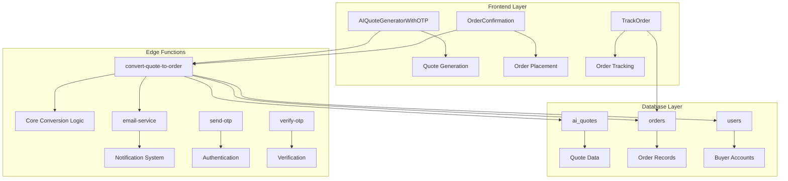
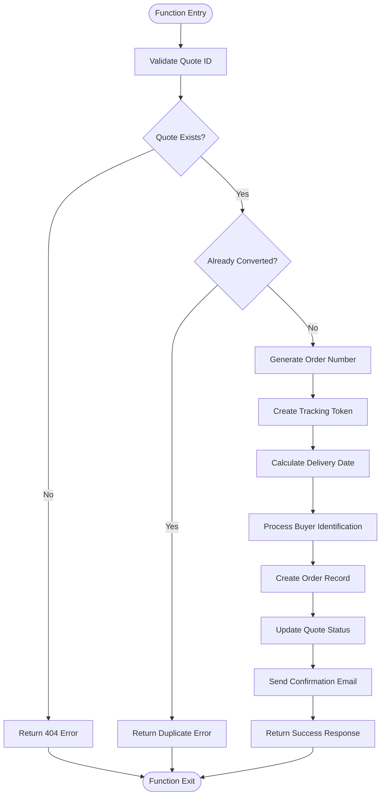
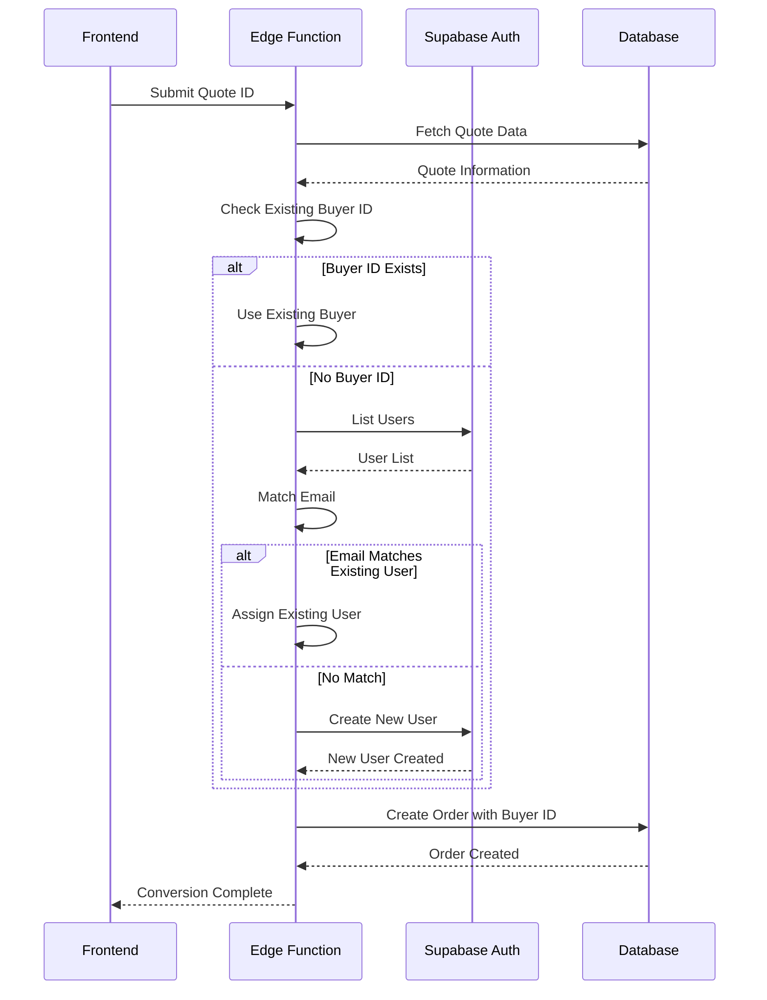
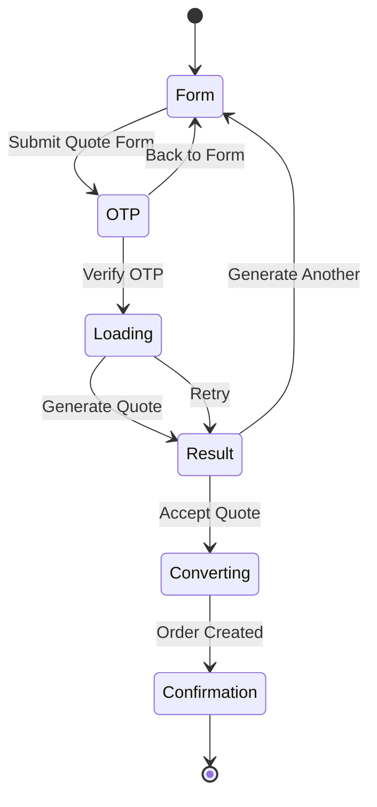
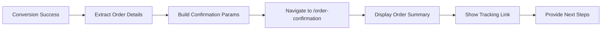
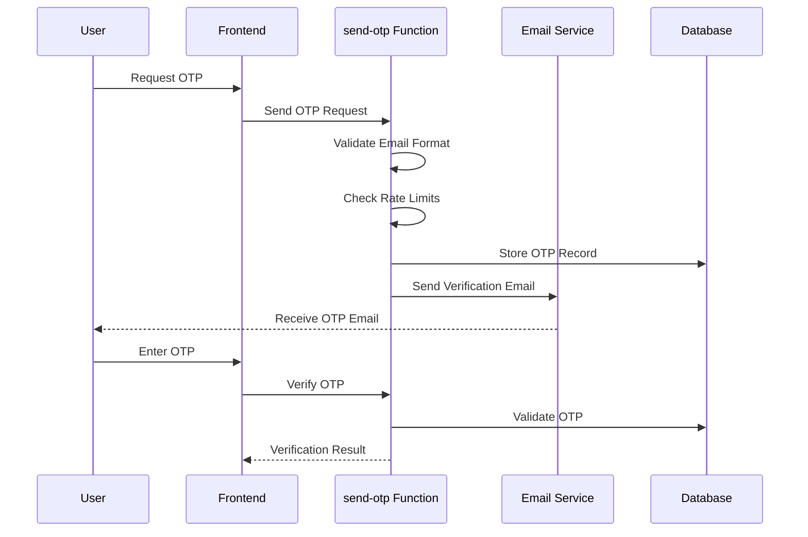
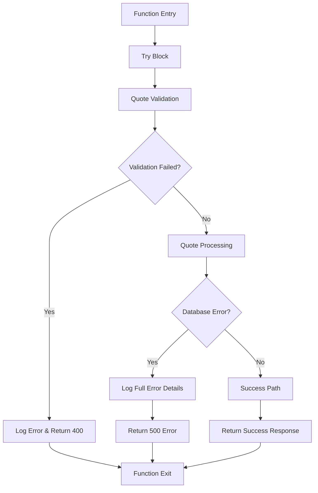
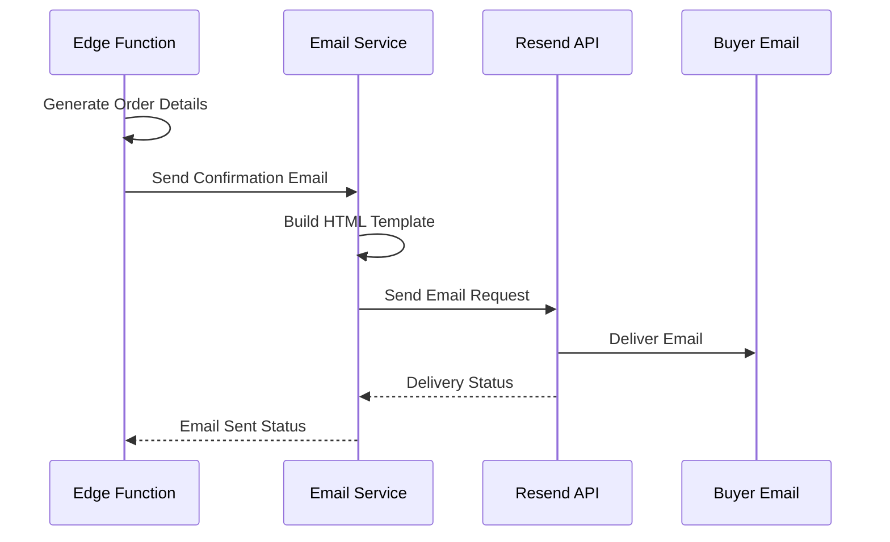
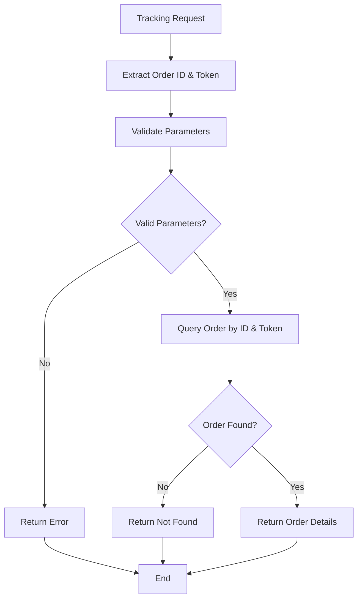

# Order Conversion Implementation

<cite>
**Referenced Files in This Document**
- [supabase/functions/convert-quote-to-order/index.ts](file://supabase/functions/convert-quote-to-order/index.ts)
- [src/components/AIQuoteGeneratorWithOTP.tsx](file://src/components/AIQuoteGeneratorWithOTP.tsx)
- [src/pages/OrderConfirmation.tsx](file://src/pages/OrderConfirmation.tsx)
- [src/pages/TrackOrder.tsx](file://src/pages/TrackOrder.tsx)
- [src/hooks/useOrderManagement.ts](file://src/hooks/useOrderManagement.ts)
- [src/types/database.ts](file://src/types/database.ts)
- [supabase/functions/email-service/index.ts](file://supabase/functions/email-service/index.ts)
- [supabase/functions/send-otp/index.ts](file://supabase/functions/send-otp/index.ts)
- [supabase/functions/verify-otp/index.ts](file://supabase/functions/verify-otp/index.ts)
- [src/components/buyer/QuotesManagementSection.tsx](file://src/components/buyer/QuotesManagementSection.tsx)
- [src/lib/api/aiQuote.ts](file://src/lib/api/aiQuote.ts)
</cite>

## Table of Contents
1. [Introduction](#introduction)
2. [System Architecture Overview](#system-architecture-overview)
3. [Edge Function Implementation](#edge-function-implementation)
4. [Frontend Workflow Integration](#frontend-workflow-integration)
5. [Data Model and Schema](#data-model-and-schema)
6. [Security and Authentication](#security-and-authentication)
7. [Error Handling and Validation](#error-handling-and-validation)
8. [Email Notification System](#email-notification-system)
9. [Order Tracking and Management](#order-tracking-and-management)
10. [Performance Considerations](#performance-considerations)
11. [Troubleshooting Guide](#troubleshooting-guide)
12. [Conclusion](#conclusion)

## Introduction

The Order Conversion implementation transforms approved quotes into production orders within the Sleek Apparels manufacturing platform. This system enables seamless transitions from quote generation to order fulfillment, maintaining data integrity across the entire lifecycle while providing robust validation, authentication, and notification capabilities.

The conversion process involves multiple components working together: an Edge Function that handles the core conversion logic, frontend components that manage user interaction and state, database schemas that define the data structure, and email services that notify stakeholders of order status changes.

## System Architecture Overview

The Order Conversion system follows a serverless architecture with clear separation of concerns between frontend, backend services, and database operations.



**Diagram sources**
- [supabase/functions/convert-quote-to-order/index.ts](file://supabase/functions/convert-quote-to-order/index.ts#L1-L223)
- [src/components/AIQuoteGeneratorWithOTP.tsx](file://src/components/AIQuoteGeneratorWithOTP.tsx#L1-L1046)
- [src/pages/OrderConfirmation.tsx](file://src/pages/OrderConfirmation.tsx#L1-L239)

## Edge Function Implementation

The core conversion logic resides in the `convert-quote-to-order` Edge Function, which performs comprehensive validation and creates corresponding order records.

### Quote Validation and Status Checking

The function begins by validating the incoming quote request and checking the quote's current status:



**Diagram sources**
- [supabase/functions/convert-quote-to-order/index.ts](file://supabase/functions/convert-quote-to-order/index.ts#L26-L151)

### Unique Order Number Generation

The system generates unique order numbers using a timestamp-based approach that ensures uniqueness across the platform:

```typescript
// Order number generation logic
const orderNumber = `ORD-${Date.now().toString().slice(-8)}`;
```

This approach creates order numbers like `ORD-12345678` that are both human-readable and guaranteed to be unique within the current system.

### Tracking Token Creation

Secure tracking tokens are generated using cryptographic randomization:

```typescript
// Secure tracking token generation
const trackingToken = crypto.randomUUID().replace(/-/g, '');
```

These tokens enable anonymous order tracking while maintaining security through cryptographically secure random generation.

### Delivery Date Calculation

Expected delivery dates are calculated based on the quote's estimated delivery days:

```typescript
// Delivery date calculation
const expectedDeliveryDate = new Date();
expectedDeliveryDate.setDate(expectedDeliveryDate.getDate() + quote.estimated_delivery_days);
```

This ensures accurate timeline communication with customers.

**Section sources**
- [supabase/functions/convert-quote-to-order/index.ts](file://supabase/functions/convert-quote-to-order/index.ts#L57-L66)

### Buyer Identification Process

The system handles buyer identification through a sophisticated process that manages both existing and new users:



**Diagram sources**
- [supabase/functions/convert-quote-to-order/index.ts](file://supabase/functions/convert-quote-to-order/index.ts#L67-L101)

**Section sources**
- [supabase/functions/convert-quote-to-order/index.ts](file://supabase/functions/convert-quote-to-order/index.ts#L67-L101)

## Frontend Workflow Integration

The frontend components orchestrate the entire quote-to-order conversion workflow, managing state, user interaction, and navigation.

### AIQuoteGeneratorWithOTP Component

This component serves as the primary interface for quote generation and order conversion:



**Diagram sources**
- [src/components/AIQuoteGeneratorWithOTP.tsx](file://src/components/AIQuoteGeneratorWithOTP.tsx#L57-L60)

### State Management During Conversion

The frontend maintains comprehensive state throughout the conversion process:

| State | Purpose | Navigation |
|-------|---------|------------|
| `form` | Quote submission and OTP verification | Form → OTP → Loading |
| `otp` | Email verification | OTP → Loading |
| `loading` | Quote generation progress | Loading → Result |
| `result` | Quote presentation and conversion | Result → Converting |
| `confirming` | Order creation | Converting → Confirmation |

### Order Conversion Trigger

The conversion process is initiated through a dedicated API call:

```typescript
// Order conversion API call
const { data, error } = await supabase.functions.invoke('convert-quote-to-order', {
  body: { quoteId: quoteResult.quote.id }
});
```

**Section sources**
- [src/components/AIQuoteGeneratorWithOTP.tsx](file://src/components/AIQuoteGeneratorWithOTP.tsx#L574-L594)

### Order Confirmation Page

After successful conversion, users are redirected to a confirmation page that displays order details:



**Diagram sources**
- [src/pages/OrderConfirmation.tsx](file://src/pages/OrderConfirmation.tsx#L16-L35)

**Section sources**
- [src/pages/OrderConfirmation.tsx](file://src/pages/OrderConfirmation.tsx#L16-L35)

## Data Model and Schema

The system utilizes a comprehensive database schema that supports both quotes and orders with full lifecycle tracking.

### AI Quotes Table Structure

The `ai_quotes` table stores all quote-related information:

| Column | Type | Purpose | Constraints |
|--------|------|---------|-------------|
| `id` | UUID | Primary key | Not null |
| `customer_email` | Text | Buyer contact | Nullable |
| `customer_name` | Text | Buyer name | Nullable |
| `product_type` | Text | Product description | Not null |
| `quantity` | Integer | Order quantity | Not null, > 0 |
| `total_price` | Numeric | Quote total | Not null |
| `estimated_delivery_days` | Integer | Delivery timeline | Not null |
| `status` | Text | Quote status | Not null |
| `converted_to_order_id` | UUID | Associated order | Nullable |

### Orders Table Structure

The `orders` table captures production order details:

| Column | Type | Purpose | Constraints |
|--------|------|---------|-------------|
| `id` | UUID | Primary key | Not null |
| `order_number` | Text | Unique order identifier | Unique, Not null |
| `buyer_id` | UUID | Customer reference | Not null |
| `product_type` | Text | Product description | Not null |
| `quantity` | Integer | Order quantity | Not null, > 0 |
| `status` | Text | Order status | Not null |
| `tracking_token` | Text | Secure tracking key | Unique, Not null |
| `expected_delivery_date` | Date | Estimated completion | Not null |
| `created_at` | Timestamp | Record creation | Not null |

**Section sources**
- [src/types/database.ts](file://src/types/database.ts#L45-L438)

## Security and Authentication

The system implements multiple layers of security to protect against unauthorized access and ensure data integrity.

### OTP-Based Authentication

Email verification uses a six-digit OTP system with comprehensive validation:



**Diagram sources**
- [supabase/functions/send-otp/index.ts](file://supabase/functions/send-otp/index.ts#L131-L489)
- [supabase/functions/verify-otp/index.ts](file://supabase/functions/verify-otp/index.ts#L21-L356)

### Rate Limiting and Protection

The system implements multiple rate limiting mechanisms:

| Protection | Mechanism | Duration | Purpose |
|------------|-----------|----------|---------|
| OTP Requests | 5-minute cooldown | 5 minutes | Prevent abuse |
| Daily Quote Limit | Per-email quota | 24 hours | Control usage |
| Verification Attempts | 5 attempts per OTP | Session | Prevent brute force |
| Hourly Rate Limit | 3 attempts per hour | 1 hour | Anti-spam measure |

### Email Validation and Security

Comprehensive email validation prevents common security issues:

```typescript
// Email validation with multiple security checks
const EMAIL_REGEX = /^[a-zA-Z0-9]([a-zA-Z0-9._+-]{0,63}[a-zA-Z0-9])?@[a-zA-Z0-9]([a-zA-Z0-9-]{0,61}[a-zA-Z0-9])?(\.[a-zA-Z0-9]([a-zA-Z0-9-]{0,61}[a-zA-Z0-9])?)*\.[a-zA-Z]{2,}$/;

// Disposable email prevention
const DISPOSABLE_DOMAINS = [
  'tempmail.com', 'throwaway.email', '10minutemail.com'
];
```

**Section sources**
- [supabase/functions/send-otp/index.ts](file://supabase/functions/send-otp/index.ts#L15-L23)
- [supabase/functions/verify-otp/index.ts](file://supabase/functions/verify-otp/index.ts#L188-L194)

## Error Handling and Validation

The system implements comprehensive error handling at multiple levels to ensure reliability and provide meaningful feedback to users.

### Edge Function Error Handling

The conversion function includes robust error handling with detailed logging:



**Diagram sources**
- [supabase/functions/convert-quote-to-order/index.ts](file://supabase/functions/convert-quote-to-order/index.ts#L205-L219)

### Duplicate Conversion Prevention

The system prevents duplicate conversions through multiple checks:

```typescript
// Duplicate detection logic
if (quote.converted_to_order_id) {
  return new Response(
    JSON.stringify({ 
      error: "Quote already converted to order", 
      orderId: quote.converted_to_order_id 
    }),
    { status: 400, headers: { ...corsHeaders, "Content-Type": "application/json" } }
  );
}
```

### Frontend Error Management

The frontend handles various error scenarios gracefully:

| Error Type | Handling Strategy | User Feedback |
|------------|------------------|---------------|
| Network Errors | Retry mechanism | Loading indicator |
| Validation Errors | Form validation | Inline error messages |
| Conversion Failures | Error boundary | Toast notifications |
| Authentication Issues | Redirect to login | Clear messaging |

**Section sources**
- [supabase/functions/convert-quote-to-order/index.ts](file://supabase/functions/convert-quote-to-order/index.ts#L49-L54)
- [src/components/AIQuoteGeneratorWithOTP.tsx](file://src/components/AIQuoteGeneratorWithOTP.tsx#L595-L601)

## Email Notification System

The email service provides comprehensive notification capabilities for order confirmation and status updates.

### Order Confirmation Email Template

The system sends detailed confirmation emails with order information:



**Diagram sources**
- [supabase/functions/convert-quote-to-order/index.ts](file://supabase/functions/convert-quote-to-order/index.ts#L152-L187)
- [supabase/functions/email-service/index.ts](file://supabase/functions/email-service/index.ts#L186-L555)

### Email Template Structure

The confirmation email includes comprehensive order information:

| Section | Content | Purpose |
|---------|---------|---------|
| Header | Order number, product details | Quick identification |
| Summary | Quantity, price, delivery timeline | Order overview |
| Tracking | Secure tracking link | Order monitoring |
| Next Steps | Follow-up actions | Customer guidance |
| Contact | Support information | Assistance access |

### Email Delivery Reliability

The email service implements retry logic for transient failures:

```typescript
// Retry logic for email delivery
async function sendEmailWithRetry(emailData: any, maxRetries: number = 2) {
  for (let attempt = 1; attempt <= maxRetries; attempt++) {
    try {
      const response = await resend.emails.send(emailData);
      if (!response.error || !isRetryableError(response.error)) {
        return response;
      }
      await new Promise(resolve => setTimeout(resolve, 1000 * attempt));
    } catch (error) {
      if (attempt === maxRetries) throw error;
      await new Promise(resolve => setTimeout(resolve, 1000 * attempt));
    }
  }
}
```

**Section sources**
- [supabase/functions/email-service/index.ts](file://supabase/functions/email-service/index.ts#L104-L128)

## Order Tracking and Management

The system provides comprehensive order tracking capabilities through multiple interfaces.

### Tracking Token Validation

Order tracking uses secure tokens that prevent unauthorized access:



**Diagram sources**
- [src/pages/TrackOrder.tsx](file://src/pages/TrackOrder.tsx#L27-L61)

### Order Status Management

The system tracks orders through multiple status levels:

| Status Level | Description | Transitions |
|-------------|-------------|-------------|
| `pending` | Initial order state | → in_progress |
| `in_progress` | Active production | → completed |
| `completed` | Order finished | → delivered |
| `cancelled` | Order cancelled | → None |

### Production Stage Tracking

Detailed production stages are tracked for transparency:

```typescript
// Production stage definitions
export type ProductionStage = 
  | 'yarn_received'
  | 'knitting'
  | 'linking'
  | 'washing_finishing'
  | 'final_qc'
  | 'packing'
  | 'ready_to_ship';
```

**Section sources**
- [src/pages/TrackOrder.tsx](file://src/pages/TrackOrder.tsx#L27-L61)
- [src/types/database.ts](file://src/types/database.ts#L19-L26)

## Performance Considerations

The system is designed for optimal performance across all components.

### Database Optimization

- **Indexing**: Strategic indexing on frequently queried columns (`quote_id`, `tracking_token`, `buyer_id`)
- **Connection Pooling**: Efficient database connection management
- **Query Optimization**: Minimal data retrieval with selective field queries

### Edge Function Performance

- **Cold Start Mitigation**: Efficient initialization and minimal dependencies
- **Memory Management**: Optimized memory usage for concurrent requests
- **Timeout Handling**: Configured timeouts to prevent hanging requests

### Caching Strategies

- **OTP Caching**: Temporary storage of verification codes
- **User Lookup Caching**: Reduced repeated user lookups
- **Rate Limiting**: Efficient caching of rate limit counters

## Troubleshooting Guide

Common issues and their solutions during the order conversion process.

### Quote Not Found Errors

**Symptoms**: 404 errors when converting quotes
**Causes**: 
- Invalid quote ID
- Quote deleted or expired
- Access permissions issues

**Solutions**:
1. Verify quote ID validity
2. Check quote status is appropriate for conversion
3. Ensure user has access to the quote

### Duplicate Conversion Errors

**Symptoms**: 400 errors indicating quote already converted
**Causes**:
- Multiple conversion attempts
- Race conditions in concurrent requests

**Solutions**:
1. Check `converted_to_order_id` field in quote record
2. Implement retry logic with exponential backoff
3. Use optimistic locking for concurrent operations

### Email Delivery Issues

**Symptoms**: Order confirmation emails not received
**Causes**:
- Email service failures
- Invalid email addresses
- Rate limiting restrictions

**Solutions**:
1. Check email service logs for delivery failures
2. Validate recipient email addresses
3. Monitor rate limit counters
4. Implement fallback notification methods

### Authentication Failures

**Symptoms**: 401/403 errors during conversion
**Causes**:
- Expired authentication tokens
- Insufficient user permissions
- Session timeout issues

**Solutions**:
1. Refresh authentication tokens
2. Verify user role and permissions
3. Implement automatic session renewal

**Section sources**
- [supabase/functions/convert-quote-to-order/index.ts](file://supabase/functions/convert-quote-to-order/index.ts#L42-L47)
- [supabase/functions/convert-quote-to-order/index.ts](file://supabase/functions/convert-quote-to-order/index.ts#L121-L141)

## Conclusion

The Order Conversion implementation provides a robust, secure, and user-friendly system for transforming quotes into production orders. Through careful architecture design, comprehensive validation, and reliable error handling, the system ensures data integrity while delivering excellent user experiences.

Key strengths of the implementation include:

- **Security**: Multi-layered authentication with OTP verification
- **Reliability**: Comprehensive error handling and retry mechanisms
- **Scalability**: Serverless architecture with efficient resource utilization
- **User Experience**: Seamless conversion workflow with clear feedback
- **Transparency**: Detailed tracking and notification systems

The system successfully bridges the gap between quote generation and order fulfillment, enabling efficient business processes while maintaining high standards of security and reliability. Future enhancements could include automated quote approval workflows, enhanced analytics dashboards, and expanded integration capabilities with external systems.