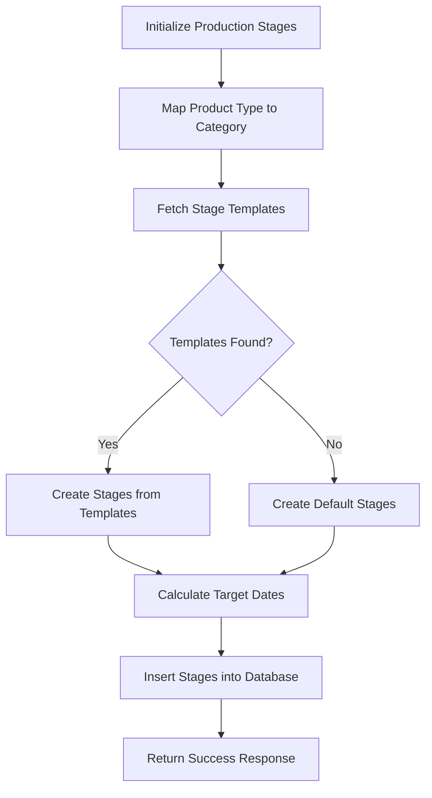
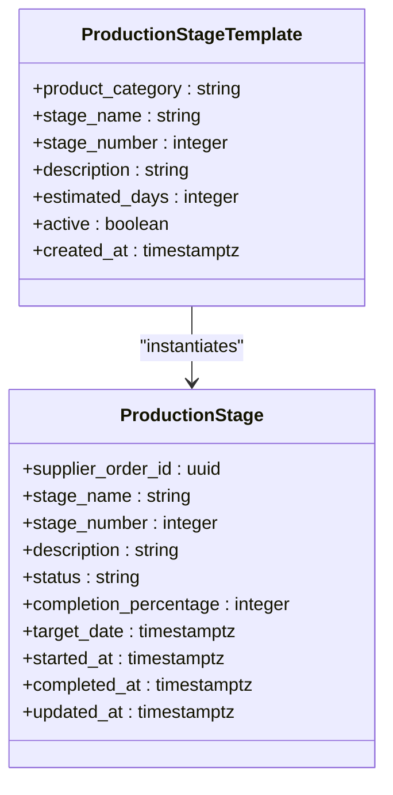
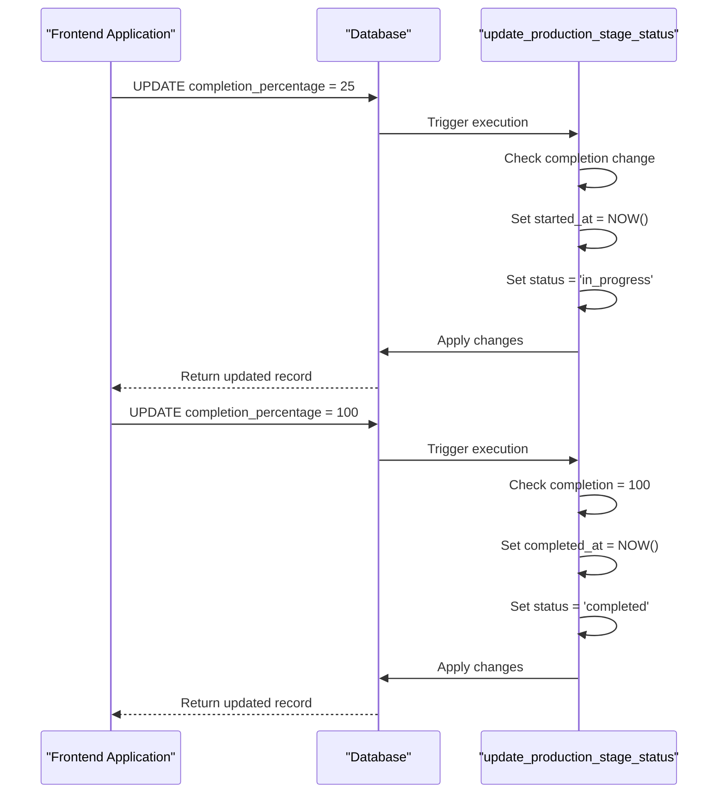
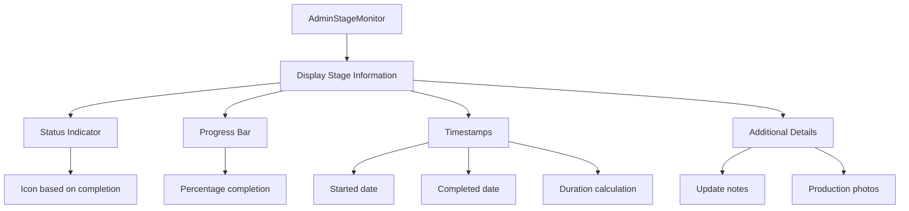
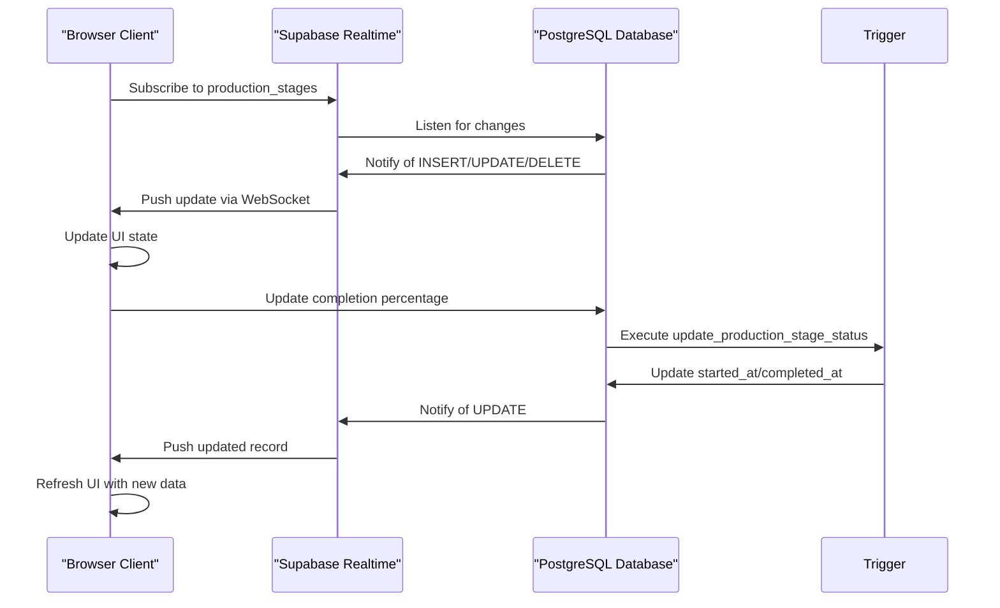
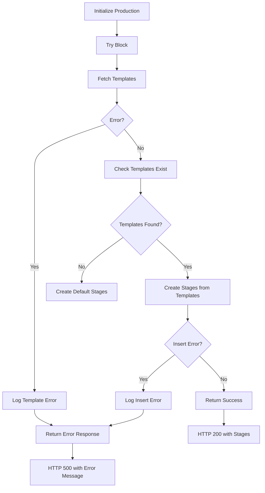

# Production Initialization

<cite>
**Referenced Files in This Document**   
- [initialize-production-stages/index.ts](file://supabase/functions/initialize-production-stages/index.ts)
- [AdminStageMonitor.tsx](file://src/components/admin/AdminStageMonitor.tsx)
- [ProductionStageTimeline.tsx](file://src/components/production/ProductionStageTimeline.tsx)
- [20251116120215_71189c74-c2d3-4f3e-a1af-87d7e6b5f8fa.sql](file://supabase/migrations/20251116120215_71189c74-c2d3-4f3e-a1af-87d7e6b5f8fa.sql)
- [20251120233928_2016afb8-d720-4858-9e12-7fb4ebbd5de0.sql](file://supabase/migrations/20251120233928_2016afb8-d720-4858-9e12-7fb4ebbd5de0.sql)
- [useOptimisticUpdate.ts](file://src/hooks/useOptimisticUpdate.ts)
- [ProductionTracking.tsx](file://src/pages/ProductionTracking.tsx)
</cite>

## Table of Contents
1. [Introduction](#introduction)
2. [Production Initialization Workflow](#production-initialization-workflow)
3. [Stage Template System](#stage-template-system)
4. [Database Triggers and Automation](#database-triggers-and-automation)
5. [Frontend Visualization Components](#frontend-visualization-components)
6. [Real-time Updates and State Management](#real-time-updates-and-state-management)
7. [Error Handling and Fallback Mechanisms](#error-handling-and-fallback-mechanisms)
8. [Conclusion](#conclusion)

## Introduction

The Production Initialization system is a critical component of the manufacturing workflow that establishes the production timeline for new orders. This system uses the `initialize-production-stages` Edge Function to create production stages with estimated dates, status tracking, and completion percentages based on predefined templates. The implementation ensures consistent stage progression across different product types while maintaining real-time visibility for administrative oversight.

The system integrates database triggers that automatically update `started_at` and `completed_at` timestamps based on completion percentage changes, ensuring accurate tracking of production timelines. Frontend components like `AdminStageMonitor` and `ProductionTimeline` provide comprehensive visualization of production workflows, enabling both real-time monitoring and historical analysis of manufacturing processes.

**Section sources**
- [initialize-production-stages/index.ts](file://supabase/functions/initialize-production-stages/index.ts#L1-L133)

## Production Initialization Workflow

The `initialize-production-stages` Edge Function orchestrates the creation of production stages when a new order is confirmed. The function accepts a `supplier_order_id` and `product_type` as input parameters and follows a systematic workflow to establish the production timeline.

The process begins by mapping the product type to a specific product category using a predefined category map. This mapping determines which set of stage templates will be used to initialize the production process. The function supports various product categories including casualwear, activewear, knitwear, and uniforms, each with its own specialized production workflow.

**Diagram sources**
- [initialize-production-stages/index.ts](file://supabase/functions/initialize-production-stages/index.ts#L24-L38)

**Section sources**
- [initialize-production-stages/index.ts](file://supabase/functions/initialize-production-stages/index.ts#L1-L133)

## Stage Template System

The production stage template system provides a flexible framework for defining standardized workflows across different product categories. Templates are stored in the `production_stage_templates` database table and include essential information such as stage name, sequence number, description, estimated duration in days, and active status.

Each template is associated with a specific product category, allowing the system to apply appropriate workflows based on the product type. For example, knitwear production requires specialized stages like "Knitting" and "Linking," while activewear production includes "Heat Transfer/Printing" for performance apparel. The system supports multiple product categories including:
- casualwear (t-shirts, hoodies, polos)
- activewear (joggers, leggings, sports bras)
- knitwear (sweaters, cardigans)
- uniforms (corporate apparel, teamwear)

When initializing production stages, the system queries the database for active templates matching the product category and orders them by stage number to ensure proper sequence. The target completion date for each stage is calculated by adding the estimated days to the current timestamp, creating a projected timeline for the entire production process.

**Diagram sources**
- [20251120233928_2016afb8-d720-4858-9e12-7fb4ebbd5de0.sql](file://supabase/migrations/20251120233928_2016afb8-d720-4858-9e12-7fb4ebbd5de0.sql#L92-L101)
- [initialize-production-stages/index.ts](file://supabase/functions/initialize-production-stages/index.ts#L44-L49)

**Section sources**
- [20251120233928_2016afb8-d720-4858-9e12-7fb4ebbd5de0.sql](file://supabase/migrations/20251120233928_2016afb8-d720-4858-9e12-7fb4ebbd5de0.sql#L92-L101)
- [initialize-production-stages/index.ts](file://supabase/functions/initialize-production-stages/index.ts#L44-L133)

## Database Triggers and Automation

The system employs database triggers to maintain data consistency and automate key aspects of production tracking. The `update_production_stage_status` trigger function automatically manages timestamps and status updates based on changes to the completion percentage, ensuring accurate and reliable tracking without requiring additional application logic.

The trigger implements two critical automation rules:
1. When a stage's completion percentage changes from 0 to any positive value and no `started_at` timestamp exists, the trigger sets `started_at` to the current time and updates the status to "in_progress"
2. When a stage's completion percentage reaches 100% and no `completed_at` timestamp exists, the trigger sets `completed_at` to the current time and updates the status to "completed"

This automation ensures that production timelines are accurately captured without relying on potentially inconsistent client-side updates. The trigger also updates the `updated_at` timestamp on every change, providing a complete audit trail of all modifications to production stages.

**Diagram sources**
- [20251116120215_71189c74-c2d3-4f3e-a1af-87d7e6b5f8fa.sql](file://supabase/migrations/20251116120215_71189c74-c2d3-4f3e-a1af-87d7e6b5f8fa.sql#L52-L74)

**Section sources**
- [20251116120215_71189c74-c2d3-4f3e-a1af-87d7e6b5f8fa.sql](file://supabase/migrations/20251116120215_71189c74-c2d3-4f3e-a1af-87d7e6b5f8fa.sql#L52-L74)

## Frontend Visualization Components

The frontend provides two primary components for visualizing production timelines: `AdminStageMonitor` for detailed administrative oversight and `ProductionStageTimeline` for customer-facing progress tracking. Both components consume the same underlying data but present it in formats optimized for their respective audiences.

The `AdminStageMonitor` component displays comprehensive information for each production stage, including:
- Stage name and description
- Current status and completion percentage
- Start and completion timestamps
- Actual duration calculation
- Latest update notes and photos
- Target completion date

The `ProductionStageTimeline` component presents a chronological timeline view with a vertical connector line and milestone cards for each stage. It uses color-coded indicators to show the current status of each stage and includes progress bars for stages in progress. The component also highlights potential delays by comparing the current date with the target completion date.

Both components are designed to handle real-time updates through Supabase's real-time subscriptions, ensuring that administrators and customers see the most current production status without requiring manual page refreshes.

**Diagram sources**
- [AdminStageMonitor.tsx](file://src/components/admin/AdminStageMonitor.tsx#L1-L127)
- [ProductionStageTimeline.tsx](file://src/components/production/ProductionStageTimeline.tsx#L1-L183)

**Section sources**
- [AdminStageMonitor.tsx](file://src/components/admin/AdminStageMonitor.tsx#L1-L127)
- [ProductionStageTimeline.tsx](file://src/components/production/ProductionStageTimeline.tsx#L1-L183)

## Real-time Updates and State Management

The system implements robust real-time updates and state management to ensure consistent data across all clients. The `ProductionTracking` page establishes a real-time subscription to the `production_stages` table, filtered by the selected order's supplier order ID. This subscription listens for all changes (insert, update, delete) and automatically refreshes the displayed data when updates occur.

For optimistic UI updates, the system uses the `useOptimisticStageUpdate` hook which immediately reflects user changes in the interface while asynchronously updating the database. If the database update fails, the hook automatically rolls back the UI to its previous state and displays an error message, providing a seamless user experience while maintaining data integrity.

The real-time subscription is implemented with proper cleanup in the component's useEffect cleanup function, preventing memory leaks and ensuring that subscriptions are removed when the component unmounts or when navigating away from the page. The subscription includes error handling and retry logic to maintain connectivity in unstable network conditions.

**Diagram sources**
- [ProductionTracking.tsx](file://src/pages/ProductionTracking.tsx#L65-L90)
- [useOptimisticUpdate.ts](file://src/hooks/useOptimisticUpdate.ts#L79-L125)

**Section sources**
- [ProductionTracking.tsx](file://src/pages/ProductionTracking.tsx#L65-L90)
- [useOptimisticUpdate.ts](file://src/hooks/useOptimisticUpdate.ts#L79-L125)

## Error Handling and Fallback Mechanisms

The production initialization system incorporates comprehensive error handling and fallback mechanisms to ensure reliability and continuity of operations. The `initialize-production-stages` function includes multiple layers of error handling, from input validation to database operation failures.

When no stage templates are found for a product category, the system automatically creates a set of default casualwear stages as a fallback. This ensures that production can proceed even if template data is missing or corrupted. The default stages include essential manufacturing steps such as Fabric Preparation, Cutting, Sewing, Quality Control, and Finishing, with reasonable estimated durations.

The function implements structured error logging using console.error statements that capture detailed information about failures, including the specific error object and context. This logging enables effective troubleshooting and monitoring of the Edge Function's operation. All errors are caught and returned as structured JSON responses with appropriate HTTP status codes, preventing unhandled exceptions from crashing the service.

For database operations, the system checks for errors after each query and transaction, providing specific error messages that help identify the root cause. The error handling distinguishes between different types of failures, such as template retrieval errors and stage insertion errors, allowing for targeted troubleshooting and resolution.

**Diagram sources**
- [initialize-production-stages/index.ts](file://supabase/functions/initialize-production-stages/index.ts#L51-L54)
- [initialize-production-stages/index.ts](file://supabase/functions/initialize-production-stages/index.ts#L84-L87)
- [initialize-production-stages/index.ts](file://supabase/functions/initialize-production-stages/index.ts#L115-L118)

**Section sources**
- [initialize-production-stages/index.ts](file://supabase/functions/initialize-production-stages/index.ts#L51-L133)

## Conclusion

The Production Initialization system provides a robust framework for establishing manufacturing timelines for new orders. By leveraging predefined templates, automated database triggers, and real-time frontend visualization, the system ensures consistent and transparent production workflows across different product categories.

The integration between the `initialize-production-stages` Edge Function and database triggers creates a reliable system for tracking production progress, with automatic timestamp management that reduces the potential for human error. The frontend components `AdminStageMonitor` and `ProductionTimeline` provide comprehensive visibility into production status, enabling both administrative oversight and customer transparency.

The system's fallback mechanisms, error handling, and real-time update capabilities ensure high availability and data consistency, making it a critical component of the overall manufacturing workflow. This implementation demonstrates a well-architected approach to production tracking that balances flexibility with standardization, providing a scalable solution for managing complex manufacturing processes.