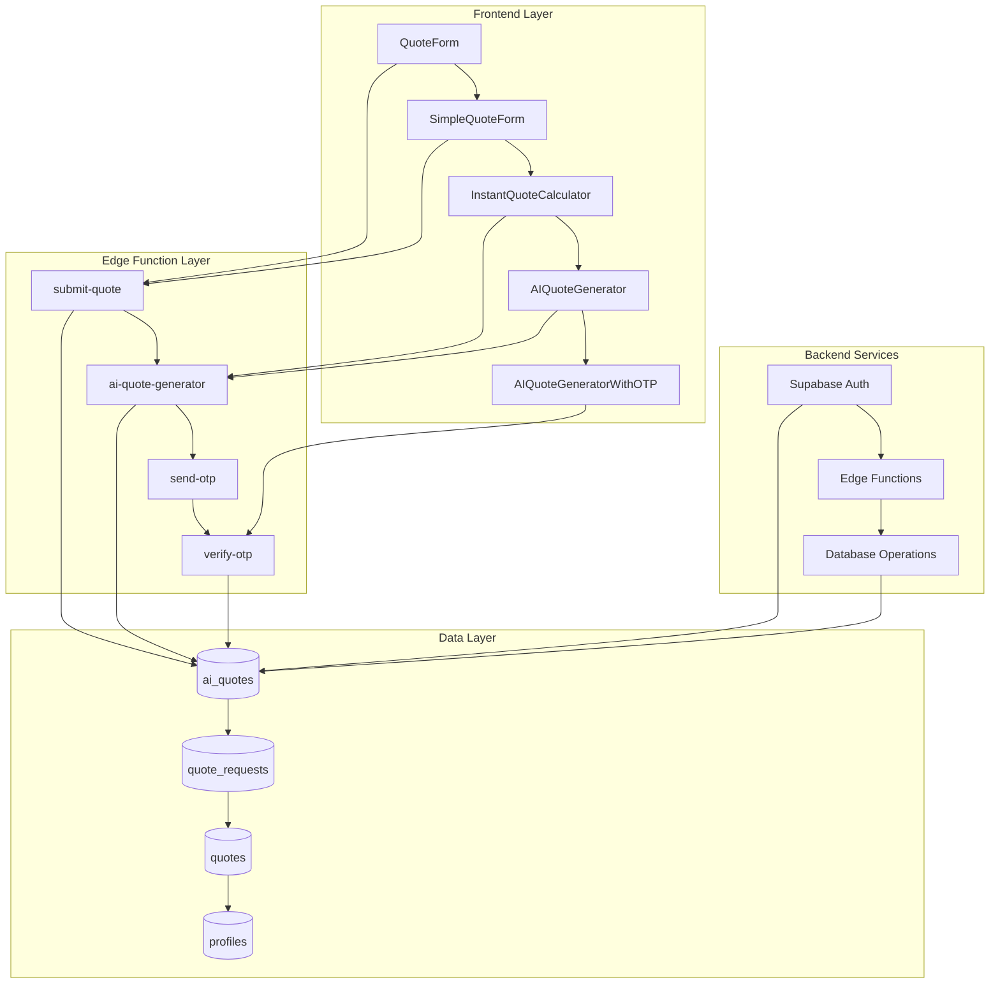
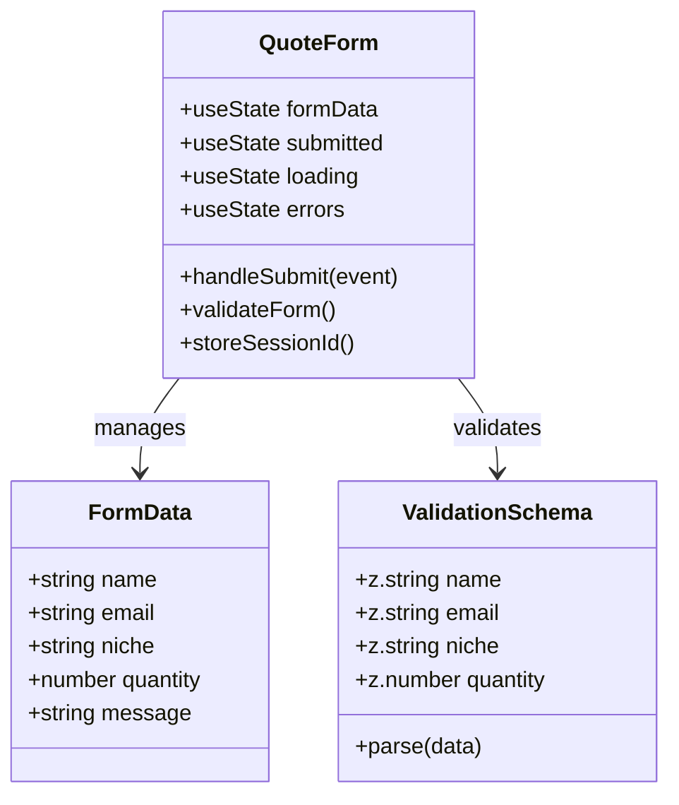
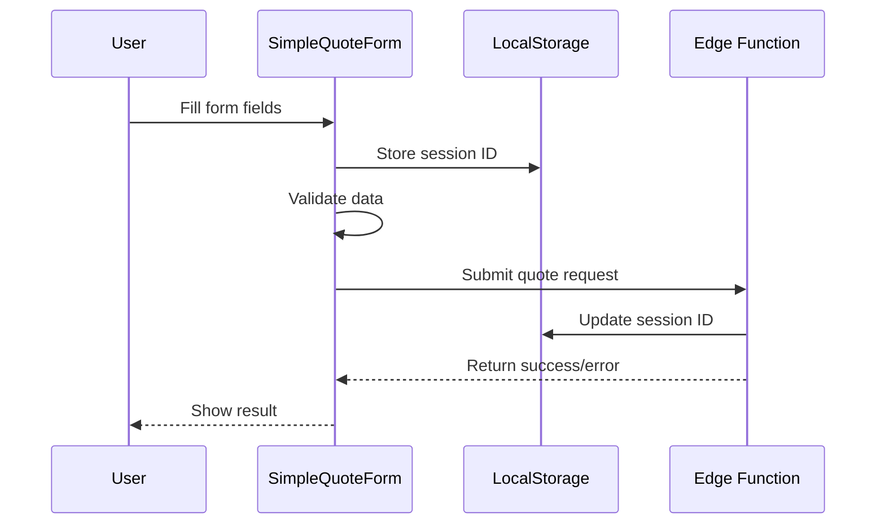
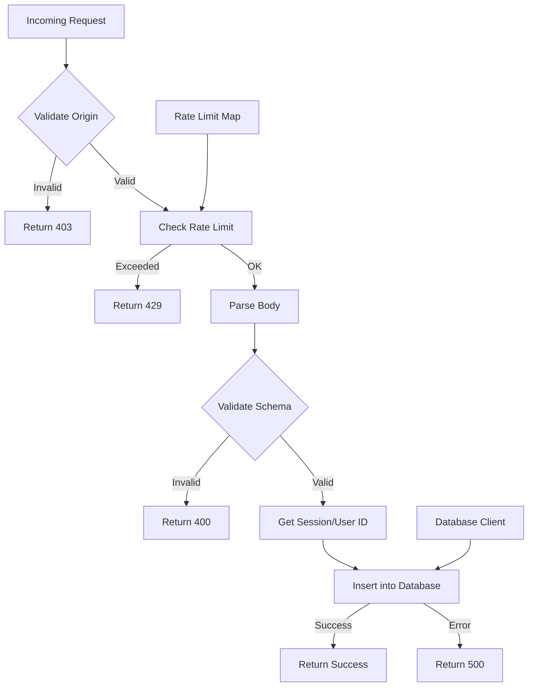
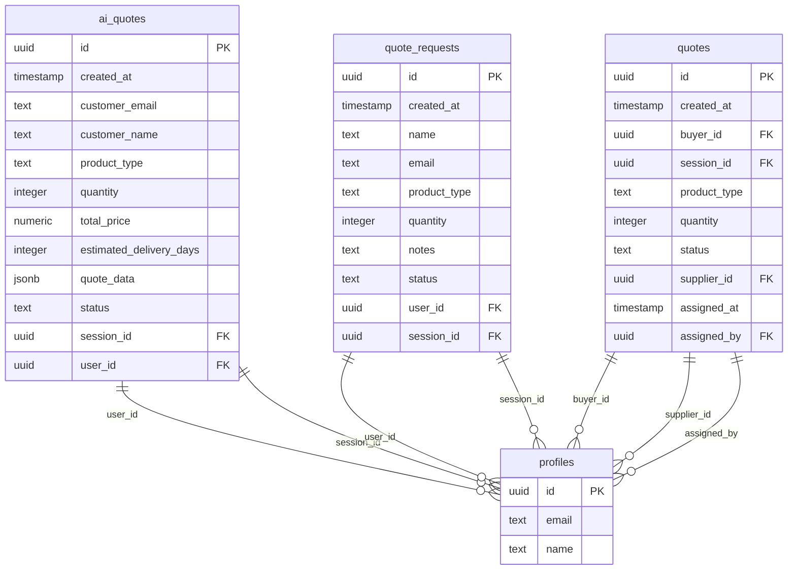
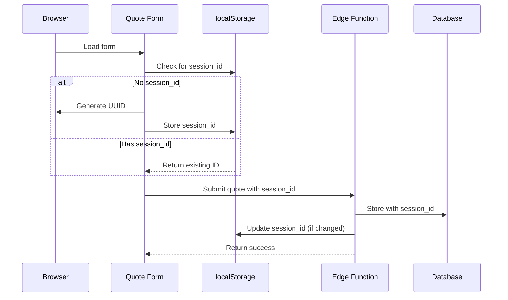
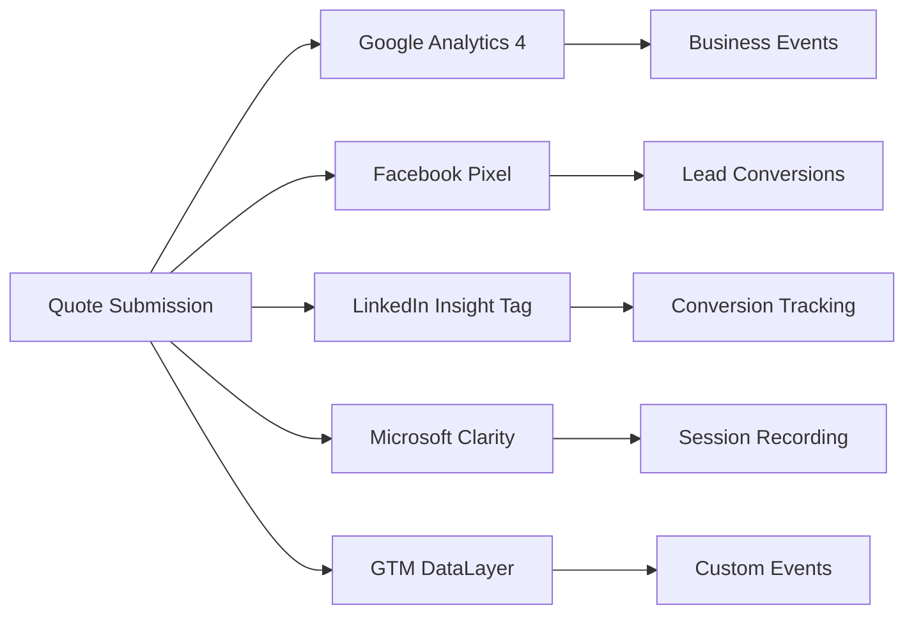
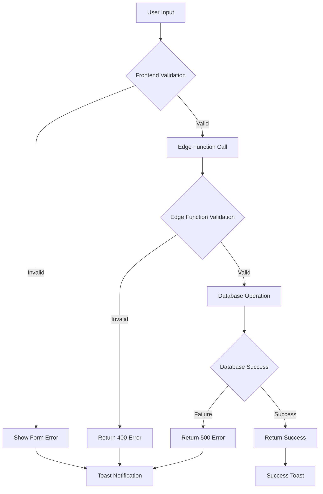

# Quote Submission Implementation

<cite>
**Referenced Files in This Document**
- [QuoteForm.tsx](file://src/components/QuoteForm.tsx)
- [SimpleQuoteForm.tsx](file://src/components/SimpleQuoteForm.tsx)
- [submit-quote/index.ts](file://supabase/functions/submit-quote/index.ts)
- [analytics.ts](file://src/lib/analytics.ts)
- [useQuotes.ts](file://src/hooks/useQuotes.ts)
- [InstantQuoteCalculator.tsx](file://src/components/InstantQuoteCalculator.tsx)
- [AIQuoteGenerator.tsx](file://src/components/AIQuoteGenerator.tsx)
- [AIQuoteGeneratorWithOTP.tsx](file://src/components/AIQuoteGeneratorWithOTP.tsx)
- [aiQuote.ts](file://src/lib/api/aiQuote.ts)
- [add_supplier_to_quotes.sql](file://supabase/migrations/add_supplier_to_quotes.sql)
- [20251124164837_4eda3cf0-ab6f-4305-a5fe-82a19c7948d3.sql](file://supabase/migrations/20251124164837_4eda3cf0-ab6f-4305-a5fe-82a19c7948d3.sql)
- [20251126173430_ebd0f1c8-4897-4156-9576-206e95a66988.sql](file://supabase/migrations/20251126173430_ebd0f1c8-4897-4156-9576-206e95a66988.sql)
</cite>

## Table of Contents
1. [Introduction](#introduction)
2. [System Architecture](#system-architecture)
3. [Frontend Forms](#frontend-forms)
4. [Edge Function Implementation](#edge-function-implementation)
5. [Data Validation and Persistence](#data-validation-and-persistence)
6. [Session Management](#session-management)
7. [Analytics Integration](#analytics-integration)
8. [Error Handling](#error-handling)
9. [Concurrency and Data Consistency](#concurrency-and-data-consistency)
10. [Performance Optimization](#performance-optimization)
11. [Security Measures](#security-measures)
12. [Troubleshooting Guide](#troubleshooting-guide)

## Introduction

The Quote Submission system is a comprehensive solution for capturing initial quote requests from buyers through multiple frontend interfaces. It implements a robust architecture combining React forms, Supabase Edge Functions, and PostgreSQL databases to handle quote requests efficiently while maintaining data consistency and providing excellent user experience.

The system supports two primary quote submission pathways:
- **Traditional Quote Form**: A multi-step form with detailed product specifications
- **Simple Quote Form**: An enhanced version with interactive sliders and step-by-step progression
- **Instant Quote Calculator**: A rapid estimation tool for quick pricing calculations
- **AI-Powered Quote Generator**: Advanced AI-driven quote generation with email verification

## System Architecture

The Quote Submission system follows a modern full-stack architecture with clear separation of concerns:

**Diagram sources**
- [QuoteForm.tsx](file://src/components/QuoteForm.tsx#L1-L213)
- [SimpleQuoteForm.tsx](file://src/components/SimpleQuoteForm.tsx#L1-L491)
- [submit-quote/index.ts](file://supabase/functions/submit-quote/index.ts#L1-L222)

## Frontend Forms

### QuoteForm Component

The traditional QuoteForm provides a comprehensive interface for collecting detailed quote information:

**Diagram sources**
- [QuoteForm.tsx](file://src/components/QuoteForm.tsx#L18-L101)

**Key Features:**
- Multi-field validation using Zod schema
- Session ID management for anonymous users
- Real-time error feedback
- Toast notifications for user feedback
- Responsive design with Tailwind CSS

**Section sources**
- [QuoteForm.tsx](file://src/components/QuoteForm.tsx#L1-L213)

### SimpleQuoteForm Component

The enhanced SimpleQuoteForm offers an improved user experience with interactive elements:

**Diagram sources**
- [SimpleQuoteForm.tsx](file://src/components/SimpleQuoteForm.tsx#L58-L149)

**Advanced Features:**
- Multi-step form progression with validation
- Slider controls for quantity selection
- File upload capabilities (images and PDFs)
- Prefilled data from instant calculator
- Progress indicators and loading states

**Section sources**
- [SimpleQuoteForm.tsx](file://src/components/SimpleQuoteForm.tsx#L1-L491)

### Instant Quote Calculator

The calculator provides rapid pricing estimates with real-time calculations:

**Section sources**
- [InstantQuoteCalculator.tsx](file://src/components/InstantQuoteCalculator.tsx#L1-L538)

### AI Quote Generators

Two AI-powered quote generators offer different user experiences:

**Section sources**
- [AIQuoteGenerator.tsx](file://src/components/AIQuoteGenerator.tsx#L1-L575)
- [AIQuoteGeneratorWithOTP.tsx](file://src/components/AIQuoteGeneratorWithOTP.tsx#L1-L800)

## Edge Function Implementation

The `submit-quote` Edge Function serves as the central processing hub for all quote submissions:

**Diagram sources**
- [submit-quote/index.ts](file://supabase/functions/submit-quote/index.ts#L44-L222)

**Key Implementation Details:**

**Validation Schema:**
The Edge Function implements a comprehensive validation schema that mirrors frontend validation:

| Field | Type | Constraints | Purpose |
|-------|------|-------------|---------|
| name | string | min(2), max(100) | Customer name validation |
| email | string | email format, max(255) | Email validation |
| productType | string | min(1), max(100) | Product identification |
| quantity | number | int, min(1), max(10000000) | Order quantity limits |
| notes | string | min(10), max(2000) | Detailed requirements |
| company | string | optional, max(200) | Company information |
| whatsapp | string | optional, max(20) | Contact method |

**Rate Limiting:**
- In-memory rate limiting with hourly reset
- 10 requests per IP address per hour
- Cold start reset mechanism

**Security Features:**
- Origin validation for production environments
- Referer header checking
- Service role authentication requirement

**Section sources**
- [submit-quote/index.ts](file://supabase/functions/submit-quote/index.ts#L1-L222)

## Data Validation and Persistence

### Database Schema Design

The system uses multiple tables for different quote types:

**Diagram sources**
- [add_supplier_to_quotes.sql](file://supabase/migrations/add_supplier_to_quotes.sql#L6-L18)
- [20251124164837_4eda3cf0-ab6f-4305-a5fe-82a19c7948d3.sql](file://supabase/migrations/20251124164837_4eda3cf0-ab6f-4305-a5fe-82a19c7948d3.sql#L33-L43)

### Data Persistence Strategy

**AI Quotes Table (`ai_quotes`):**
- Stores AI-generated quotes with detailed pricing information
- Supports both authenticated and anonymous users
- Includes confidence scores and market research data
- Enables session-based anonymous access

**Quote Requests Table (`quote_requests`):**
- Legacy table for traditional quote submissions
- Maintains backward compatibility
- Supports user and session-based access control

**Quotes Table (`quotes`):**
- New unified quotes system with supplier assignment
- Enhanced filtering and status tracking
- Supplier relationship management

**Section sources**
- [useQuotes.ts](file://src/hooks/useQuotes.ts#L1-L261)

## Session Management

### Anonymous User Tracking

The system implements sophisticated session management for anonymous users:

**Diagram sources**
- [QuoteForm.tsx](file://src/components/QuoteForm.tsx#L40-L45)
- [SimpleQuoteForm.tsx](file://src/components/SimpleQuoteForm.tsx#L65-L70)

### Session ID Generation and Management

**Implementation Details:**
- UUID v4 generation using `crypto.randomUUID()`
- Local storage persistence for browser sessions
- Automatic session ID creation on first visit
- Cross-tab synchronization through localStorage events

**Benefits:**
- Anonymous user tracking across sessions
- GDPR compliance with opt-out capability
- Session-based data retrieval for unauthenticated users
- Seamless user experience without registration

**Section sources**
- [QuoteForm.tsx](file://src/components/QuoteForm.tsx#L40-L45)
- [SimpleQuoteForm.tsx](file://src/components/SimpleQuoteForm.tsx#L65-L70)

## Analytics Integration

### Multi-Platform Tracking

The system integrates with multiple analytics platforms for comprehensive tracking:

**Diagram sources**
- [analytics.ts](file://src/lib/analytics.ts#L50-L142)

### Event Tracking Implementation

**Business Events:**
- `quote_request`: Tracks quote submission with product type and quantity
- `contact_form_submit`: Records form submissions
- `looptrace_signup`: Monitors platform signups

**Multi-Platform Events:**
- Synchronized tracking across Google Analytics, Facebook, LinkedIn, and Clarity
- Standardized event naming and parameter passing
- Automated event deduplication and conflict resolution

**Section sources**
- [analytics.ts](file://src/lib/analytics.ts#L1-L183)

## Error Handling

### Comprehensive Error Management

The system implements layered error handling across all components:

**Diagram sources**
- [QuoteForm.tsx](file://src/components/QuoteForm.tsx#L82-L98)
- [submit-quote/index.ts](file://supabase/functions/submit-quote/index.ts#L195-L221)

### Error Categories and Responses

**Frontend Validation Errors:**
- Zod schema validation failures
- Real-time field validation
- User-friendly error messages

**Edge Function Errors:**
- Validation schema mismatches
- Rate limiting violations
- Database connectivity issues
- Authentication failures

**Server-Side Errors:**
- Database constraint violations
- Network timeouts
- External service failures
- Internal processing errors

**Section sources**
- [QuoteForm.tsx](file://src/components/QuoteForm.tsx#L82-L98)
- [submit-quote/index.ts](file://supabase/functions/submit-quote/index.ts#L195-L221)

## Concurrency and Data Consistency

### Concurrent Submission Handling

The system implements several mechanisms to handle concurrent submissions safely:

**Rate Limiting:**
- In-memory rate limiting prevents abuse
- IP-based throttling with hourly reset
- Configurable limits per endpoint

**Database Constraints:**
- Unique constraints prevent duplicate entries
- Foreign key relationships maintain referential integrity
- Transaction isolation ensures atomic operations

**Session-Based Access Control:**
- Anonymous users access their own data only
- Time-windowed access for expired sessions
- IP binding for additional security

### Data Consistency Strategies

**Temporal Consistency:**
- Timestamp-based ordering for quote retrieval
- Session expiration after 5 minutes
- Graceful degradation for stale data

**Referential Integrity:**
- Cascading deletes for user profiles
- Null-safe foreign key relationships
- Soft deletion patterns for historical data

**Section sources**
- [submit-quote/index.ts](file://supabase/functions/submit-quote/index.ts#L23-L42)
- [20251126173430_ebd0f1c8-4897-4156-9576-206e95a66988.sql](file://supabase/migrations/20251126173430_ebd0f1c8-4897-4156-9576-206e95a66988.sql#L51-L67)

## Performance Optimization

### Caching and Optimization Strategies

**Client-Side Optimizations:**
- React Query for efficient data fetching
- Memoization for expensive calculations
- Debounced form submissions
- Progressive loading states

**Edge Function Optimizations:**
- Connection pooling for database operations
- Environment-specific configurations
- Timeout management (30-second limit)
- Retry logic with exponential backoff

**Database Optimizations:**
- Indexed lookups for session and user queries
- Prepared statements for repeated operations
- Connection pooling and keep-alive
- Query optimization for large datasets

### Scalability Considerations

**Horizontal Scaling:**
- Stateless Edge Function design
- Shared database infrastructure
- CDN caching for static assets
- Load balancer distribution

**Vertical Scaling:**
- Memory-efficient data structures
- Streaming responses for large datasets
- Compression for network transfers
- Efficient JSON serialization

## Security Measures

### Input Sanitization and Validation

**Frontend Validation:**
- Zod schema validation for all inputs
- Real-time field validation
- Character length restrictions
- Format validation for emails and numbers

**Edge Function Security:**
- Input sanitization and escaping
- Parameterized queries for database operations
- CORS policy enforcement
- Rate limiting and DDoS protection

**Database Security:**
- Row-level security policies
- Encrypted connections
- Regular backup and recovery
- Audit logging for sensitive operations

### Authentication and Authorization

**User Authentication:**
- Supabase Auth integration
- JWT token validation
- Session management
- Passwordless authentication options

**Access Control:**
- Role-based permissions
- Resource-level authorization
- IP-based restrictions
- Time-windowed access

**Section sources**
- [submit-quote/index.ts](file://supabase/functions/submit-quote/index.ts#L44-L114)

## Troubleshooting Guide

### Common Issues and Solutions

**Form Submission Failures:**
- **Issue**: Form validation errors
- **Solution**: Check Zod schema constraints and field requirements
- **Code Reference**: [QuoteForm.tsx](file://src/components/QuoteForm.tsx#L11-L17)

**Session ID Issues:**
- **Issue**: Anonymous user tracking failures
- **Solution**: Verify localStorage availability and permissions
- **Code Reference**: [QuoteForm.tsx](file://src/components/QuoteForm.tsx#L40-L45)

**Edge Function Errors:**
- **Issue**: 400 Bad Request responses
- **Solution**: Validate input data against schema requirements
- **Code Reference**: [submit-quote/index.ts](file://supabase/functions/submit-quote/index.ts#L130-L131)

**Database Connection Problems:**
- **Issue**: 500 Internal Server errors
- **Solution**: Check database connectivity and query performance
- **Code Reference**: [submit-quote/index.ts](file://supabase/functions/submit-quote/index.ts#L156-L174)

**Analytics Tracking Issues:**
- **Issue**: Missing or incorrect analytics data
- **Solution**: Verify analytics script loading and event configuration
- **Code Reference**: [analytics.ts](file://src/lib/analytics.ts#L17-L183)

### Debugging Tools and Techniques

**Console Logging:**
- Enable detailed logging for development
- Monitor Edge Function execution
- Track database query performance

**Network Monitoring:**
- Inspect API request/response cycles
- Monitor Edge Function invocation metrics
- Analyze database query execution plans

**Database Inspection:**
- Query quote submission logs
- Check for constraint violations
- Monitor session expiration

**Section sources**
- [QuoteForm.tsx](file://src/components/QuoteForm.tsx#L82-L98)
- [submit-quote/index.ts](file://supabase/functions/submit-quote/index.ts#L195-L221)