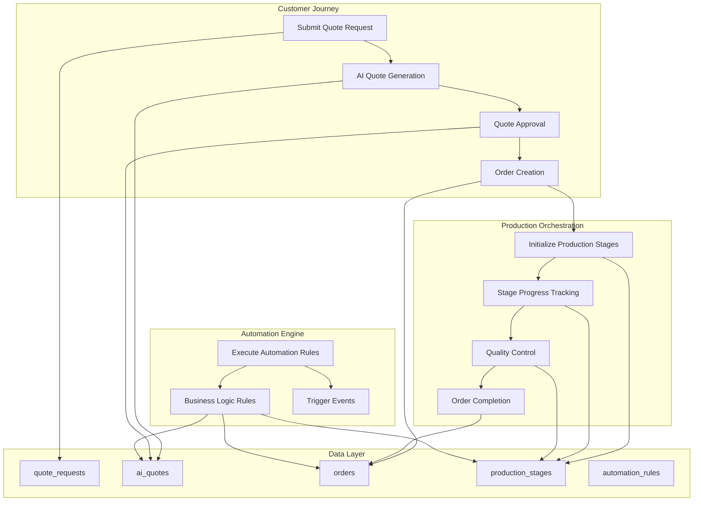
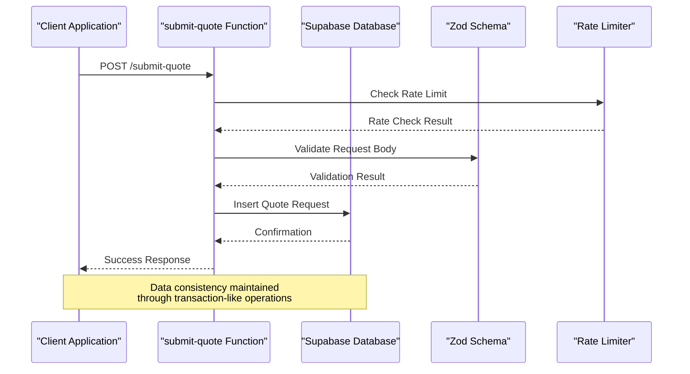
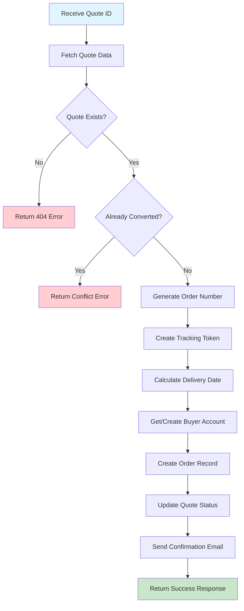
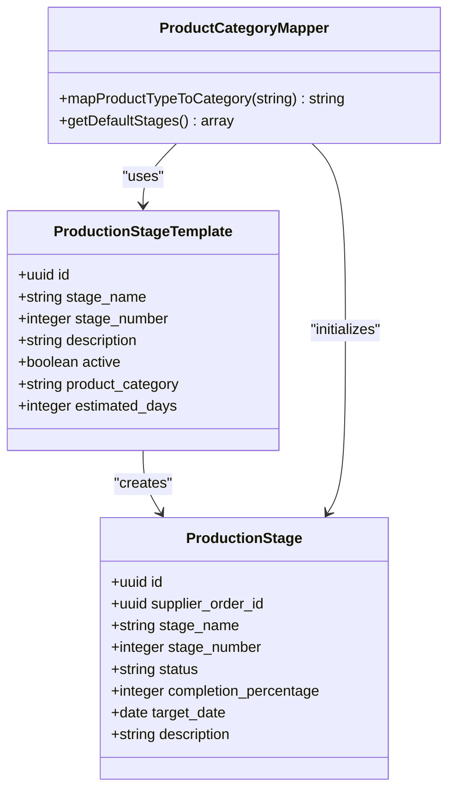
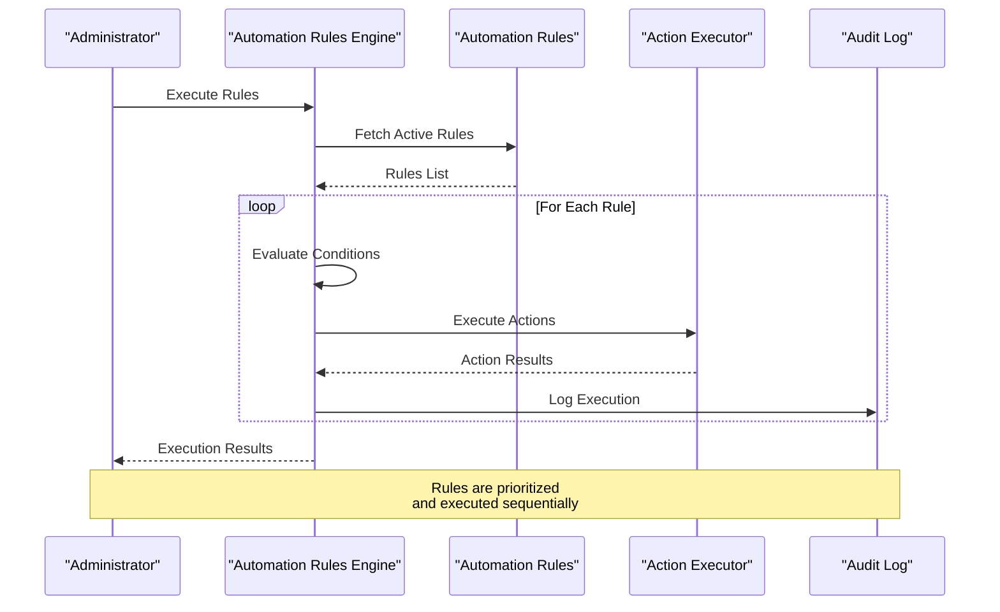
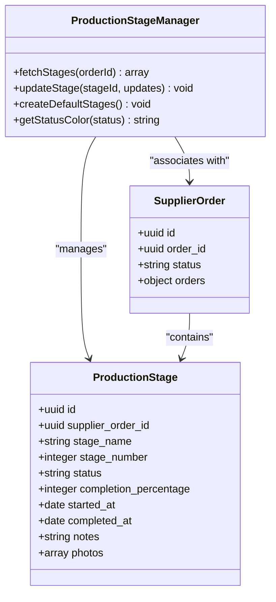
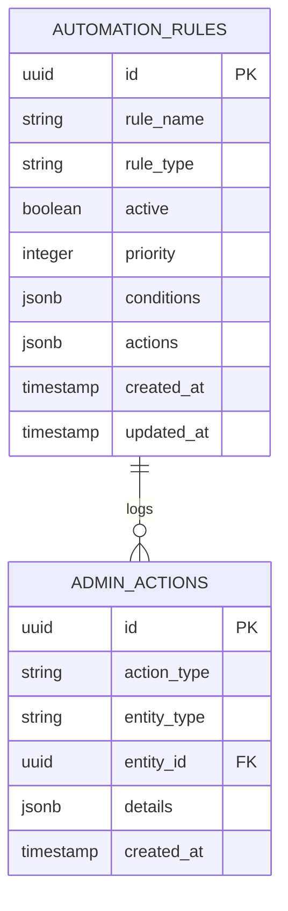
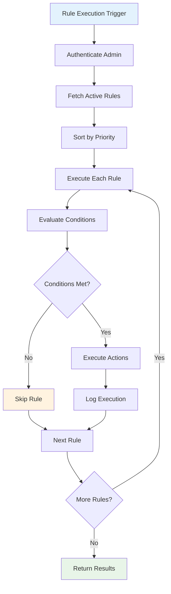
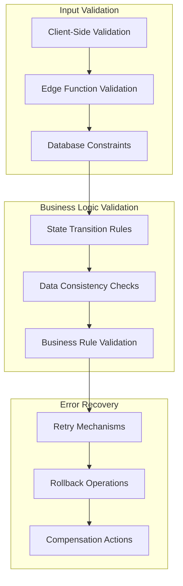
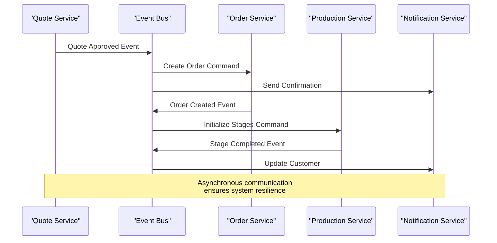

# Workflow Automation

<cite>
**Referenced Files in This Document**
- [submit-quote/index.ts](file://supabase/functions/submit-quote/index.ts)
- [convert-quote-to-order/index.ts](file://supabase/functions/convert-quote-to-order/index.ts)
- [initialize-production-stages/index.ts](file://supabase/functions/initialize-production-stages/index.ts)
- [execute-automation-rules/index.ts](file://supabase/functions/execute-automation-rules/index.ts)
- [ProductionStageManager.tsx](file://src/components/supplier/ProductionStageManager.tsx)
- [OrderStatusBoard.tsx](file://src/components/admin/OrderStatusBoard.tsx)
- [AutomationRulesManager.tsx](file://src/components/admin/AutomationRulesManager.tsx)
- [aiQuote.ts](file://src/lib/api/aiQuote.ts)
- [20251115150759_remix_migration_from_pg_dump.sql](file://supabase/migrations/20251115150759_remix_migration_from_pg_dump.sql)
- [add_supplier_to_quotes.sql](file://supabase/migrations/add_supplier_to_quotes.sql)
</cite>

## Table of Contents
1. [Introduction](#introduction)
2. [Workflow Architecture Overview](#workflow-architecture-overview)
3. [Core Workflow Functions](#core-workflow-functions)
4. [State Transitions and Data Flow](#state-transitions-and-data-flow)
5. [Production Stage Management](#production-stage-management)
6. [Automation Rules Engine](#automation-rules-engine)
7. [Data Validation and Error Recovery](#data-validation-and-error-recovery)
8. [Integration Patterns](#integration-patterns)
9. [Performance Considerations](#performance-considerations)
10. [Troubleshooting Guide](#troubleshooting-guide)

## Introduction

The Workflow Automation system orchestrates business processes across the Sleek Apparels platform, managing the complete journey from initial quote requests through production completion. This sophisticated automation framework ensures seamless data consistency, intelligent state transitions, and automated business logic execution while maintaining robust error handling and recovery mechanisms.

The system operates through four primary workflow functions that handle different stages of the business process: **submit-quote** captures initial requests, **convert-quote-to-order** transforms approved quotes into production orders, **initialize-production-stages** sets up the manufacturing timeline, and **execute-automation-rules** applies business logic automatically.

## Workflow Architecture Overview

The Workflow Automation system follows a state-driven architecture with clear separation of concerns between data capture, transformation, production orchestration, and business logic enforcement.

**Diagram sources**
- [submit-quote/index.ts](file://supabase/functions/submit-quote/index.ts#L1-L222)
- [convert-quote-to-order/index.ts](file://supabase/functions/convert-quote-to-order/index.ts#L1-L223)
- [initialize-production-stages/index.ts](file://supabase/functions/initialize-production-stages/index.ts#L1-L133)
- [execute-automation-rules/index.ts](file://supabase/functions/execute-automation-rules/index.ts#L1-L193)

## Core Workflow Functions

### Submit Quote Function

The **submit-quote** function serves as the entry point for customer requests, capturing initial quote submissions and performing comprehensive validation before persisting data to the database.

**Diagram sources**
- [submit-quote/index.ts](file://supabase/functions/submit-quote/index.ts#L44-L194)

The function implements several critical features:

- **Comprehensive Validation**: Uses Zod schema validation for all input fields including name, email, product type, quantity, and notes
- **Rate Limiting**: Prevents abuse through in-memory rate limiting (10 requests per hour per IP)
- **Origin Validation**: Secures against cross-origin attacks by validating request origins
- **Session Management**: Handles both authenticated and anonymous users with session ID generation
- **Error Handling**: Provides detailed error messages for validation failures

**Section sources**
- [submit-quote/index.ts](file://supabase/functions/submit-quote/index.ts#L1-L222)

### Convert Quote to Order Function

The **convert-quote-to-order** function transforms approved AI-generated quotes into production-ready orders, establishing the connection between quote data and operational order management.

**Diagram sources**
- [convert-quote-to-order/index.ts](file://supabase/functions/convert-quote-to-order/index.ts#L26-L204)

Key capabilities include:

- **Bidirectional Data Synchronization**: Updates both quote and order records to maintain consistency
- **Automated User Management**: Creates buyer accounts for anonymous users during order conversion
- **Order Number Generation**: Creates unique, timestamp-based order identifiers
- **Tracking Token Creation**: Generates secure tokens for order tracking
- **Email Automation**: Sends confirmation emails with tracking links
- **Error Recovery**: Comprehensive error handling with detailed logging

**Section sources**
- [convert-quote-to-order/index.ts](file://supabase/functions/convert-quote-to-order/index.ts#L1-L223)

### Initialize Production Stages Function

The **initialize-production-stages** function creates the manufacturing timeline based on product type, ensuring standardized production processes across different garment categories.

**Diagram sources**
- [initialize-production-stages/index.ts](file://supabase/functions/initialize-production-stages/index.ts#L24-L133)

The function provides:

- **Category-Based Templates**: Maps product types to predefined production stage templates
- **Fallback Mechanisms**: Creates default stages when no templates exist for a category
- **Dynamic Scheduling**: Calculates target dates based on estimated durations
- **Template Management**: Supports active/inactive templates for flexible production planning

**Section sources**
- [initialize-production-stages/index.ts](file://supabase/functions/initialize-production-stages/index.ts#L1-L133)

### Execute Automation Rules Function

The **execute-automation-rules** function serves as the central engine for business logic automation, applying configurable rules based on system state and conditions.

**Diagram sources**
- [execute-automation-rules/index.ts](file://supabase/functions/execute-automation-rules/index.ts#L71-L127)

**Section sources**
- [execute-automation-rules/index.ts](file://supabase/functions/execute-automation-rules/index.ts#L1-L193)

## State Transitions and Data Flow

The workflow maintains strict state transitions between quote, order, and production stages, ensuring data integrity and preventing invalid state changes.

### Quote Lifecycle States

| State | Description | Next States | Data Impact |
|-------|-------------|-------------|-------------|
| `pending` | Initial quote request | `draft`, `approved`, `converted` | Creates quote record |
| `draft` | AI-generated quote | `approved`, `rejected` | Populates AI quote data |
| `approved` | Customer acceptance | `converted` | Triggers order creation |
| `converted` | Order created | `processing`, `completed` | Links to order record |

### Order Lifecycle States

| State | Description | Production Status | Trigger |
|-------|-------------|-------------------|---------|
| `pending` | Order awaiting processing | `pending` | Quote conversion | 
| `processing` | In production pipeline | `in_progress` | Production start |
| `completed` | Finished goods ready | `completed` | Final QC passed |
| `shipped` | Delivered to customer | `delivered` | Shipping confirmation |

### Production Stage States

| Stage Number | Stage Name | Expected Duration | Quality Checks |
|--------------|------------|-------------------|----------------|
| 1 | Material Procurement | 2-3 days | Fabric inspection |
| 2 | Cutting & Preparation | 3-5 days | Pattern verification |
| 3 | Assembly & Stitching | 5-7 days | Sewing quality |
| 4 | Quality Inspection | 2-3 days | Defect detection |
| 5 | Washing & Finishing | 2-4 days | Fabric treatment |
| 6 | Final QC | 1-2 days | Complete inspection |
| 7 | Packing | 1-2 days | Packaging quality |
| 8 | Ready to Ship | Immediate | Shipping preparation |

**Section sources**
- [aiQuote.ts](file://src/lib/api/aiQuote.ts#L1-L274)

## Production Stage Management

The production stage management system provides comprehensive tracking and control over manufacturing processes through a modular, extensible architecture.

### Stage Management Components

**Diagram sources**
- [ProductionStageManager.tsx](file://src/components/supplier/ProductionStageManager.tsx#L1-L251)

### Stage Progress Tracking Features

- **Real-Time Updates**: Percentage-based completion tracking with automatic status updates
- **Visual Progress Indicators**: Color-coded badges and progress bars for stage visibility
- **Timestamp Management**: Automatic recording of start and completion timestamps
- **Photo Documentation**: Support for visual evidence submission at each stage
- **Notes System**: Structured communication for stage-specific information

**Section sources**
- [ProductionStageManager.tsx](file://src/components/supplier/ProductionStageManager.tsx#L1-L251)

## Automation Rules Engine

The automation rules engine provides powerful business logic automation through a configurable, event-driven architecture.

### Rule Configuration Structure

**Diagram sources**
- [execute-automation-rules/index.ts](file://supabase/functions/execute-automation-rules/index.ts#L71-L127)

### Supported Automation Actions

| Action Type | Parameters | Description | Use Cases |
|-------------|------------|-------------|-----------|
| `send_email` | `template`, `recipients`, `variables` | Automated email notifications | Order confirmations, status updates |
| `update_status` | `table`, `new_status`, `id` | State transitions | Workflow progression |
| `assign_supplier` | `quote_id`, `supplier_id` | Supplier assignment | Demand fulfillment |
| `create_notification` | `message`, `recipient_id` | System notifications | Alerts and reminders |

### Rule Execution Flow

**Diagram sources**
- [execute-automation-rules/index.ts](file://supabase/functions/execute-automation-rules/index.ts#L88-L127)

**Section sources**
- [execute-automation-rules/index.ts](file://supabase/functions/execute-automation-rules/index.ts#L1-L193)
- [AutomationRulesManager.tsx](file://src/components/admin/AutomationRulesManager.tsx#L1-L172)

## Data Validation and Error Recovery

The workflow automation system implements comprehensive validation and recovery mechanisms to ensure data integrity and system reliability.

### Validation Layers

### Error Handling Strategies

| Error Type | Handling Strategy | Recovery Method | Data Impact |
|------------|------------------|-----------------|-------------|
| Validation Errors | Immediate rejection | User notification | No data changes |
| Network Timeouts | Exponential backoff | Retry with delay | Temporary failure |
| Database Conflicts | Optimistic locking | Version comparison | Data synchronization |
| Business Logic Violations | Graceful degradation | Alternative path | Partial updates |

### Compensation Patterns

The system implements several compensation patterns for error recovery:

- **Saga Pattern**: Long-running transactions with compensating actions
- **Circuit Breaker**: Prevents cascade failures during system stress
- **Dead Letter Queues**: Captures permanently failed operations for manual review
- **Event Sourcing**: Maintains immutable event history for replay and debugging

**Section sources**
- [submit-quote/index.ts](file://supabase/functions/submit-quote/index.ts#L195-L222)
- [convert-quote-to-order/index.ts](file://supabase/functions/convert-quote-to-order/index.ts#L205-L223)

## Integration Patterns

The workflow automation system employs several integration patterns to ensure loose coupling and high cohesion between components.

### Event-Driven Architecture

### Service Composition Patterns

- **Choreography**: Services communicate through events without centralized coordination
- **Orchestration**: Centralized workflow management with explicit coordination
- **Pipeline**: Sequential processing with intermediate state persistence
- **Batch Processing**: Periodic consolidation of workflow operations

### External System Integration

The system integrates with external services through well-defined interfaces:

- **Email Service**: Automated notifications and confirmations
- **Authentication Service**: User identity and access management
- **Storage Service**: File uploads and media management
- **Analytics Service**: Usage tracking and performance monitoring

**Section sources**
- [convert-quote-to-order/index.ts](file://supabase/functions/convert-quote-to-order/index.ts#L152-L189)

## Performance Considerations

The workflow automation system is designed for high performance and scalability through several optimization strategies.

### Database Optimization

- **Indexing Strategy**: Strategic indexing on frequently queried fields (status, created_at, supplier_id)
- **Partitioning**: Large tables are partitioned by time periods for improved query performance
- **Connection Pooling**: Efficient database connection management to handle concurrent requests
- **Query Optimization**: Prepared statements and parameterized queries to prevent SQL injection

### Caching Strategy

- **Application-Level Caching**: Frequently accessed data cached in memory
- **Database-Level Caching**: Query result caching for expensive calculations
- **CDN Integration**: Static assets served through content delivery networks
- **Browser Caching**: Client-side caching for improved user experience

### Monitoring and Observability

The system includes comprehensive monitoring capabilities:

- **Performance Metrics**: Response times, throughput, and error rates
- **Business Metrics**: Quote conversion rates, order completion times
- **Infrastructure Metrics**: CPU, memory, and network utilization
- **Custom Dashboards**: Real-time visualization of workflow health

## Troubleshooting Guide

Common issues and their resolutions in the workflow automation system.

### Quote Submission Issues

**Problem**: Quote submission fails with validation errors
**Causes**: 
- Invalid email format
- Quantity outside acceptable range
- Missing required fields
- Rate limiting exceeded

**Resolution**:
1. Verify input data against validation schemas
2. Check rate limiting configuration
3. Review error messages for specific field issues
4. Clear browser cache and retry

### Order Conversion Failures

**Problem**: Convert quote to order fails unexpectedly
**Causes**:
- Quote not found or already converted
- User authentication issues
- Database connectivity problems
- Email service failures

**Resolution**:
1. Verify quote status is "approved"
2. Check user authentication token
3. Review database connection logs
4. Monitor email service status

### Production Stage Issues

**Problem**: Production stages not initializing correctly
**Causes**:
- Missing product category templates
- Insufficient permissions
- Database constraint violations
- Template configuration errors

**Resolution**:
1. Verify product category mappings
2. Check template configurations
3. Review permission settings
4. Validate database constraints

### Automation Rule Problems

**Problem**: Automation rules not executing as expected
**Causes**:
- Rule conditions not met
- Insufficient permissions
- Action execution failures
- Rule configuration errors

**Resolution**:
1. Verify rule conditions and priorities
2. Check administrator permissions
3. Review action execution logs
4. Validate rule configurations

**Section sources**
- [submit-quote/index.ts](file://supabase/functions/submit-quote/index.ts#L195-L222)
- [convert-quote-to-order/index.ts](file://supabase/functions/convert-quote-to-order/index.ts#L205-L223)
- [execute-automation-rules/index.ts](file://supabase/functions/execute-automation-rules/index.ts#L133-L140)