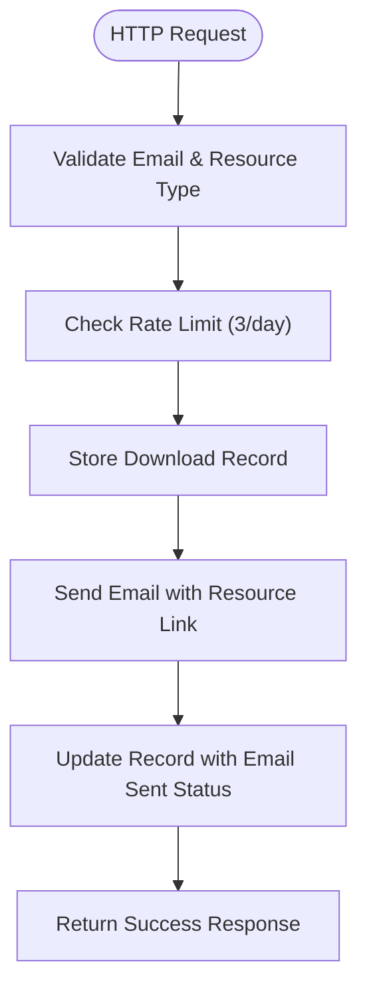

# Supabase Configuration

<cite>
**Referenced Files in This Document**   
- [config.toml](file://supabase/config.toml)
- [admin-check/index.ts](file://supabase/functions/admin-check/index.ts)
- [log-audit-action/index.ts](file://supabase/functions/log-audit-action/index.ts)
- [send-resource-email/index.ts](file://supabase/functions/send-resource-email/index.ts)
- [stripe-webhook/index.ts](file://supabase/functions/stripe-webhook/index.ts)
- [wishlist-add/index.ts](file://supabase/functions/wishlist-add/index.ts)
- [generate-invoice/index.ts](file://supabase/functions/generate-invoice/index.ts)
- [20251115150759_remix_migration_from_pg_dump.sql](file://supabase/migrations/20251115150759_remix_migration_from_pg_dump.sql)
- [RoleBasedRoute.tsx](file://src/components/routes/RoleBasedRoute.tsx)
</cite>

## Table of Contents
1. [Introduction](#introduction)
2. [Project Structure](#project-structure)
3. [Core Components](#core-components)
4. [Architecture Overview](#architecture-overview)
5. [Detailed Component Analysis](#detailed-component-analysis)
6. [Dependency Analysis](#dependency-analysis)
7. [Performance Considerations](#performance-considerations)
8. [Troubleshooting Guide](#troubleshooting-guide)
9. [Conclusion](#conclusion)

## Introduction
This document provides comprehensive architectural documentation for the Supabase project configuration via config.toml. It explains how the configuration file defines the Supabase project ID and configures individual Edge Functions with JWT verification settings. The document details the security implications of verify_jwt = true vs false for each function, mapping to public vs authenticated endpoints. It describes how this configuration enforces role-based access control at the infrastructure level, aligning with the application's RBAC model. Examples include stripe-webhook and send-resource-email being public (verify_jwt=false) while admin-check and log-audit-action require authentication. The document also covers best practices for managing function permissions and securing sensitive operations.

## Project Structure
The project structure is organized with a clear separation of concerns between frontend, backend, and Supabase configuration. The Supabase configuration is located in the supabase/ directory, containing functions, migrations, and the main config.toml file. The frontend components are organized by feature in the src/components/ directory, while business logic and hooks are separated into their own directories. This structure enables clear separation between authentication-protected and public endpoints.


**Diagram sources**
- [config.toml](file://supabase/config.toml)
- [functions](file://supabase/functions)

**Section sources**
- [config.toml](file://supabase/config.toml)
- [project_structure](file://project_structure)

## Core Components
The core components of the Supabase configuration include the config.toml file which defines the project ID and function-level JWT verification settings, the Edge Functions that implement business logic, and the database schema that supports role-based access control. The configuration enforces security policies at the infrastructure level, ensuring that sensitive operations require authentication while public endpoints remain accessible.

**Section sources**
- [config.toml](file://supabase/config.toml)
- [functions](file://supabase/functions)

## Architecture Overview
The Supabase configuration implements a security-first architecture where function-level JWT verification settings enforce access control policies. The config.toml file serves as the central configuration point, defining which functions require authentication (verify_jwt = true) and which are publicly accessible (verify_jwt = false). This approach aligns with the application's RBAC model by enforcing authentication requirements at the infrastructure level before requests reach business logic.


**Diagram sources**
- [config.toml](file://supabase/config.toml)
- [functions](file://supabase/functions)

## Detailed Component Analysis

### Supabase Configuration Analysis
The config.toml file defines the Supabase project ID and configures individual Edge Functions with JWT verification settings. This configuration enforces role-based access control at the infrastructure level, ensuring that sensitive operations require authentication while public endpoints remain accessible.

#### Configuration Structure
```toml
project_id = "eqpftggctumujhutomom"

[functions.send-resource-email]
verify_jwt = false

[functions.generate-invoice]
verify_jwt = true

[functions.admin-check]
verify_jwt = true

[functions.stripe-webhook]
verify_jwt = false
```

**Diagram sources**
- [config.toml](file://supabase/config.toml)

**Section sources**
- [config.toml](file://supabase/config.toml)

### Security Implications of JWT Verification Settings
The verify_jwt setting in the config.toml file determines whether a function requires JWT authentication. When verify_jwt = true, the function requires a valid JWT token in the Authorization header, enforcing authentication at the infrastructure level. When verify_jwt = false, the function is publicly accessible without authentication.

#### Public vs Authenticated Endpoints


**Diagram sources**
- [config.toml](file://supabase/config.toml)
- [send-resource-email/index.ts](file://supabase/functions/send-resource-email/index.ts)
- [stripe-webhook/index.ts](file://supabase/functions/stripe-webhook/index.ts)
- [admin-check/index.ts](file://supabase/functions/admin-check/index.ts)
- [log-audit-action/index.ts](file://supabase/functions/log-audit-action/index.ts)

**Section sources**
- [config.toml](file://supabase/config.toml)

### Role-Based Access Control Implementation
The configuration enforces role-based access control at the infrastructure level by requiring JWT authentication for sensitive operations. The application's RBAC model is implemented through the user_roles table and associated functions, with the config.toml file serving as the first line of defense.

#### RBAC Architecture


**Diagram sources**
- [20251115150759_remix_migration_from_pg_dump.sql](file://supabase/migrations/20251115150759_remix_migration_from_pg_dump.sql)
- [config.toml](file://supabase/config.toml)

**Section sources**
- [20251115150759_remix_migration_from_pg_dump.sql](file://supabase/migrations/20251115150759_remix_migration_from_pg_dump.sql)

### Function-Specific Analysis

#### admin-check Function
The admin-check function requires JWT authentication (verify_jwt = true) and verifies if the authenticated user has the 'admin' role by querying the user_roles table. This function is used to determine administrative privileges in the frontend.


**Diagram sources**
- [admin-check/index.ts](file://supabase/functions/admin-check/index.ts)
- [20251115150759_remix_migration_from_pg_dump.sql](file://supabase/migrations/20251115150759_remix_migration_from_pg_dump.sql)

**Section sources**
- [admin-check/index.ts](file://supabase/functions/admin-check/index.ts)

#### log-audit-action Function
The log-audit-action function requires JWT authentication (verify_jwt = true) and logs administrative actions to the admin_audit_logs table. It validates the JWT token and uses the authenticated user ID to record audit entries.


**Diagram sources**
- [log-audit-action/index.ts](file://supabase/functions/log-audit-action/index.ts)

**Section sources**
- [log-audit-action/index.ts](file://supabase/functions/log-audit-action/index.ts)

#### send-resource-email Function
The send-resource-email function is publicly accessible (verify_jwt = false) and allows users to request resources like buyer's guides and material charts. It implements rate limiting to prevent abuse.



**Diagram sources**
- [send-resource-email/index.ts](file://supabase/functions/send-resource-email/index.ts)

**Section sources**
- [send-resource-email/index.ts](file://supabase/functions/send-resource-email/index.ts)

#### stripe-webhook Function
The stripe-webhook function is publicly accessible (verify_jwt = false) but secured through Stripe signature verification. It processes payment events and updates invoice status in the database.


**Diagram sources**
- [stripe-webhook/index.ts](file://supabase/functions/stripe-webhook/index.ts)

**Section sources**
- [stripe-webhook/index.ts](file://supabase/functions/stripe-webhook/index.ts)

## Dependency Analysis
The Supabase configuration has dependencies between the config.toml file, Edge Functions, and the database schema. The config.toml file defines the security posture for each function, while the functions depend on the database schema for role-based access control and data storage.


**Diagram sources**
- [config.toml](file://supabase/config.toml)
- [functions](file://supabase/functions)
- [20251115150759_remix_migration_from_pg_dump.sql](file://supabase/migrations/20251115150759_remix_migration_from_pg_dump.sql)

**Section sources**
- [config.toml](file://supabase/config.toml)
- [functions](file://supabase/functions)
- [20251115150759_remix_migration_from_pg_dump.sql](file://supabase/migrations/20251115150759_remix_migration_from_pg_dump.sql)

## Performance Considerations
The configuration balances security and performance by allowing public access to non-sensitive functions while requiring authentication for protected operations. Public endpoints like send-resource-email implement rate limiting to prevent abuse without impacting performance for legitimate users. The use of JWT verification at the infrastructure level reduces the need for authentication checks within function code, improving performance.

## Troubleshooting Guide
When troubleshooting Supabase configuration issues, verify the project_id in config.toml matches the Supabase project. For authentication issues, ensure JWT tokens are properly included in requests to functions with verify_jwt = true. For public endpoints, verify that external security mechanisms (like Stripe signature verification) are properly configured. Check function logs for errors related to database connections or permission issues.

**Section sources**
- [config.toml](file://supabase/config.toml)
- [functions](file://supabase/functions)

## Conclusion
The Supabase configuration via config.toml provides a robust security framework that enforces role-based access control at the infrastructure level. By configuring JWT verification settings for individual Edge Functions, the system ensures that sensitive operations require authentication while allowing public access to non-sensitive endpoints. This approach aligns with the application's RBAC model and provides a secure foundation for the application. Best practices include using verify_jwt = true for all functions that access user-specific or sensitive data, implementing additional security measures for public endpoints, and regularly reviewing function permissions.