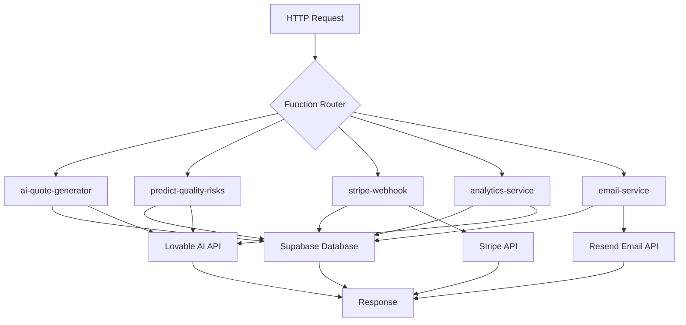
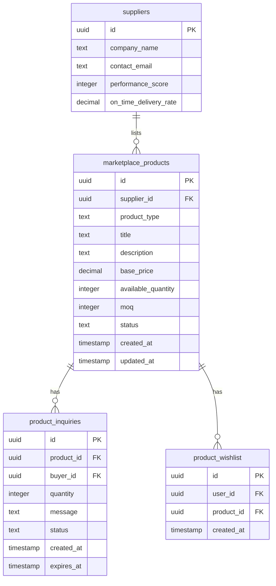

# Supabase Directory

<cite>
**Referenced Files in This Document**   
- [config.toml](file://supabase/config.toml)
- [ai-quote-generator/index.ts](file://supabase/functions/ai-quote-generator/index.ts)
- [predict-quality-risks/index.ts](file://supabase/functions/predict-quality-risks/index.ts)
- [stripe-webhook/index.ts](file://supabase/functions/stripe-webhook/index.ts)
- [email-service/index.ts](file://supabase/functions/email-service/index.ts)
- [analytics-service/index.ts](file://supabase/functions/analytics-service/index.ts)
- [health/index.ts](file://supabase/functions/health/index.ts)
- [shared/securityLogger.ts](file://supabase/functions/shared/securityLogger.ts)
- [_shared/logger.ts](file://supabase/functions/_shared/logger.ts)
- [20250122000000_create_marketplace_system.sql](file://supabase/migrations/20250122000000_create_marketplace_system.sql)
- [add_supplier_to_quotes.sql](file://supabase/migrations/add_supplier_to_quotes.sql)
</cite>

## Table of Contents
1. [Introduction](#introduction)
2. [Supabase Configuration with config.toml](#supabase-configuration-with-configtoml)
3. [Edge Functions Overview](#edge-functions-overview)
4. [AI-Powered Edge Functions](#ai-powered-edge-functions)
5. [Business Workflow and Integration Functions](#business-workflow-and-integration-functions)
6. [Database Schema and Migrations](#database-schema-and-migrations)
7. [Security and Rate Limiting](#security-and-rate-limiting)
8. [Function Deployment and Management](#function-deployment-and-management)
9. [Frontend Integration via Supabase Client](#frontend-integration-via-supabase-client)
10. [Conclusion](#conclusion)

## Introduction
The `supabase/` directory serves as the backbone of the backend infrastructure for the Sleek Apparels application, housing all serverless functions, database migration scripts, and project configuration. This directory enables a scalable, secure, and maintainable backend without requiring traditional server management. It leverages Supabase's Edge Functions—Deno-based serverless functions—to execute backend logic in response to HTTP requests or database events. The system is designed to support AI-powered features, real-time analytics, secure payment processing, and automated business workflows. This document provides a comprehensive overview of the directory's structure, focusing on its role in managing the Supabase project, including database schema evolution, edge function implementation, security considerations, and integration with the frontend.

## Supabase Configuration with config.toml
The `config.toml` file is the central configuration file for the Supabase project, defining settings for each edge function. It specifies the project ID and contains function-specific configurations, most notably the `verify_jwt` setting, which controls whether Supabase automatically verifies JSON Web Tokens (JWTs) for authentication before executing a function.

The configuration demonstrates a security-conscious approach by selectively enabling JWT verification. Functions that handle sensitive operations, such as `admin-check`, `predict-quality-risks`, and `create-payment-intent`, have `verify_jwt = true`, ensuring that only authenticated users can invoke them. Conversely, functions that must be publicly accessible, such as `ai-quote-generator`, `stripe-webhook`, and `track-product-interaction`, have `verify_jwt = false`. This allows these functions to be called from the frontend without requiring a user login or from external services like Stripe.

This granular control over authentication is critical for a modern web application. It enables a seamless user experience for public features while maintaining strict security for administrative and user-specific operations. The configuration also implicitly defines the function's environment, as each function's behavior and security posture are determined by its settings in this file.

**Section sources**
- [config.toml](file://supabase/config.toml)

## Edge Functions Overview
The `supabase/functions/` directory contains a collection of serverless Edge Functions, each implemented as a standalone Deno TypeScript module. These functions are deployed to Supabase's global edge network, allowing them to execute close to the user for low latency. Each function resides in its own subdirectory (e.g., `ai-quote-generator/`, `stripe-webhook/`) and contains an `index.ts` file that exports a handler function.

The architecture follows a microservices pattern, where each function is responsible for a single, well-defined task. This promotes code reusability, simplifies testing, and allows for independent scaling. The functions are designed to be stateless and idempotent, making them resilient to failures. They communicate with the Supabase PostgreSQL database using the Supabase client SDK and can call external APIs, such as the Lovable AI service for AI-powered insights or Resend for email delivery.

All functions implement a consistent pattern for handling Cross-Origin Resource Sharing (CORS) by responding to `OPTIONS` preflight requests with appropriate headers. They also include robust error handling and logging, often using shared utility modules like `_shared/logger.ts` to ensure consistent log formatting and PII (Personally Identifiable Information) sanitization.

**Diagram sources **
- [ai-quote-generator/index.ts](file://supabase/functions/ai-quote-generator/index.ts)
- [predict-quality-risks/index.ts](file://supabase/functions/predict-quality-risks/index.ts)
- [stripe-webhook/index.ts](file://supabase/functions/stripe-webhook/index.ts)
- [analytics-service/index.ts](file://supabase/functions/analytics-service/index.ts)
- [email-service/index.ts](file://supabase/functions/email-service/index.ts)

## AI-Powered Edge Functions
The application leverages AI to enhance user experience and operational efficiency through several specialized edge functions. These functions act as a secure bridge between the frontend and external AI services, handling authentication, input validation, rate limiting, and cost tracking.

The `ai-quote-generator` function is a prime example. It receives a product quote request from the frontend, validates the input using Zod, and applies a tiered rate-limiting strategy based on the user's authentication status and IP address. It then calculates a base price using data from the `quote_configurations` table and uses the Lovable AI service to generate professional, context-aware insights. The AI prompt is carefully crafted to include manufacturing context (e.g., Bangladesh standards, MOQs, lead times) to produce highly relevant recommendations. The function also logs AI usage for cost tracking and updates a `timeline_predictions` table in the database.

Similarly, the `predict-quality-risks` function uses AI to analyze production data. It fetches the progress of production stages and the supplier's performance history, then sends this data to the Lovable AI service. The AI model is instructed to return a structured JSON response with a risk score, risk factors, and recommendations, which are then stored in the database for display in the admin dashboard.

The `analytics-service` function provides a generic interface for AI-powered analytics, supporting different analysis types like `order-insights` and `quality-analysis`. This modular design allows the frontend to request different types of AI analysis without needing a dedicated function for each use case.

**Section sources**
- [ai-quote-generator/index.ts](file://supabase/functions/ai-quote-generator/index.ts)
- [predict-quality-risks/index.ts](file://supabase/functions/predict-quality-risks/index.ts)
- [analytics-service/index.ts](file://supabase/functions/analytics-service/index.ts)

## Business Workflow and Integration Functions
Beyond AI, the edge functions handle critical business workflows and third-party integrations. The `stripe-webhook` function is essential for processing payment events. It listens for webhooks from Stripe, verifies the signature for security, and updates the application's database accordingly. For example, when a `payment_intent.succeeded` event is received, it updates the corresponding invoice's status to "paid" and records the payment timestamp. This ensures that the application's state is always in sync with the payment processor.

The `email-service` function manages all outgoing email communications. It uses the Resend API to send transactional emails, such as quote confirmations, lead follow-ups, and supplier status notifications. It includes comprehensive email validation to block disposable email addresses and prevent spam. The function uses pre-defined HTML templates for consistency and includes dynamic content based on the data provided. For instance, it can send a "gentle" follow-up email or a "discount" offer to a lead based on the specified template type.

Other functions like `convert-quote-to-order` and `initialize-production-stages` automate internal business processes. When a quote is converted to an order, the former function likely creates the necessary records in the `supplier_orders` and `production_stages` tables, while the latter sets up the initial production timeline. This automation reduces manual work and ensures consistency across the application.

**Section sources**
- [stripe-webhook/index.ts](file://supabase/functions/stripe-webhook/index.ts)
- [email-service/index.ts](file://supabase/functions/email-service/index.ts)

## Database Schema and Migrations
The `supabase/migrations/` directory contains a series of SQL files that define the evolution of the database schema. Each migration file is prefixed with a timestamp (e.g., `20250122000000_`) to ensure they are applied in the correct order. This version-controlled approach allows the team to track changes, collaborate effectively, and deploy schema updates reliably across different environments.

The `20250122000000_create_marketplace_system.sql` migration is a comprehensive script that establishes the core of the marketplace system. It creates several key tables:
- `marketplace_products`: Stores product listings with pricing, inventory, and specifications.
- `product_inquiries`: Manages communication between buyers and suppliers.
- `product_wishlist`: Allows users to save products for later.
- `product_approval_log`: Tracks the history of product approval decisions.

The migration also implements Row Level Security (RLS) policies to enforce data access rules. For example, the policy `Anyone can view approved products` allows unauthenticated users to see products that are in the 'approved' status, while `Suppliers can view their own products` restricts suppliers to only their own listings. This ensures data privacy and security at the database level.

Another migration, `add_supplier_to_quotes.sql`, demonstrates how the schema evolves to meet new business requirements. It adds columns to the `quotes` table to support the assignment of suppliers to quotes by an admin, including `supplier_id`, `assigned_at`, and `assigned_by`. It also creates indexes to optimize query performance for these new fields.

**Diagram sources **
- [20250122000000_create_marketplace_system.sql](file://supabase/migrations/20250122000000_create_marketplace_system.sql)
- [add_supplier_to_quotes.sql](file://supabase/migrations/add_supplier_to_quotes.sql)

## Security and Rate Limiting
Security is a paramount concern, and the edge functions implement multiple layers of protection. The `config.toml` file provides the first layer by controlling JWT verification. Functions that process sensitive data require authentication, while public functions are explicitly marked as such.

Within the functions themselves, input validation is rigorous. The `ai-quote-generator` function uses Zod to validate the request body, ensuring that all required fields (like `customerEmail`) are present and correctly formatted. The `email-service` function includes a comprehensive email validation routine that checks format, length, and blocks disposable email domains.

Rate limiting is implemented to prevent abuse and protect backend resources. The `ai-quote-generator` function uses a sophisticated, tiered rate-limiting strategy. It tracks requests by IP address (15 per day), by user session (3 per day for anonymous users), and by authenticated user ID (20 per day). This prevents a single user or IP from overwhelming the AI service, which could incur significant costs.

For enhanced security logging, the `shared/securityLogger.ts` module provides functions to log security events and AI cost tracking. The `logSecurityEvent` function captures details of suspicious activities, such as rate limit violations, along with the IP address and user agent. The `logAICost` function estimates the cost of each AI API call based on the model and token usage, which is crucial for monitoring and budgeting.

**Section sources**
- [config.toml](file://supabase/config.toml)
- [ai-quote-generator/index.ts](file://supabase/functions/ai-quote-generator/index.ts)
- [email-service/index.ts](file://supabase/functions/email-service/index.ts)
- [shared/securityLogger.ts](file://supabase/functions/shared/securityLogger.ts)
- [_shared/logger.ts](file://supabase/functions/_shared/logger.ts)

## Function Deployment and Management
The edge functions are managed through the Supabase CLI. Developers can use commands like `supabase functions new <function-name>` to create a new function, which generates the necessary directory and `index.ts` file. The `supabase functions deploy` command compiles the TypeScript code, bundles dependencies, and deploys the function to the Supabase project.

The `tsconfig.json` file in the `functions/` directory configures the TypeScript compiler for the Deno runtime. It sets the target to ES2021 and includes paths for Deno and ESM modules, ensuring that the code is compatible with the edge environment. The `deno.d.ts` file provides type definitions for Deno's built-in APIs.

The deployment process is integrated into the CI/CD pipeline, ensuring that all functions are automatically deployed when changes are pushed to the main branch. This allows for rapid iteration and reliable deployments. The health check function (`health/index.ts`) provides a simple endpoint to monitor the availability of the edge functions, returning a 200 status if the function is running.

**Section sources**
- [tsconfig.json](file://supabase/functions/tsconfig.json)
- [health/index.ts](file://supabase/functions/health/index.ts)

## Frontend Integration via Supabase Client
The frontend, located in the `src/` directory, integrates with these backend functions using the Supabase client SDK. The `src/integrations/supabase/client.ts` file initializes the Supabase client with the project URL and a public API key. This client is then used throughout the application to call edge functions.

To invoke an edge function, the frontend uses the `supabase.functions.invoke()` method, passing the function name and the payload as JSON. For example, to generate a quote, the `AIQuoteGenerator` component would call `supabase.functions.invoke('ai-quote-generator', { body: quoteData })`. The response is then processed and displayed to the user.

This integration is seamless and type-safe, especially when combined with the Zod validation schemas used in the backend. The frontend can share or mirror these schemas to provide immediate feedback to users before the data is even sent to the server. This creates a robust and user-friendly experience, where the frontend and backend are tightly coupled through well-defined APIs.

**Section sources**
- [client.ts](file://src/integrations/supabase/client.ts)

## Conclusion
The `supabase/` directory is a well-architected, production-ready backend system that leverages the power of serverless functions and a managed PostgreSQL database. It effectively separates concerns, with clear responsibilities for configuration, business logic, and data management. The use of AI is thoughtfully integrated, providing significant value while being carefully managed for cost and security. The database schema is robust, with RLS policies ensuring data integrity and privacy. The combination of edge functions, version-controlled migrations, and a secure deployment process makes this a scalable and maintainable foundation for the Sleek Apparels application.