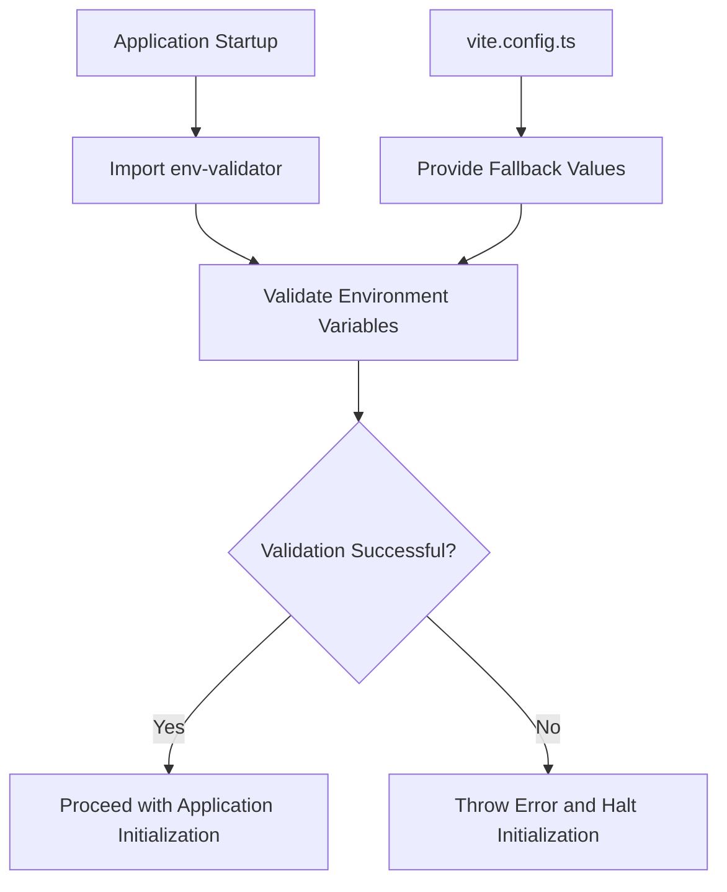
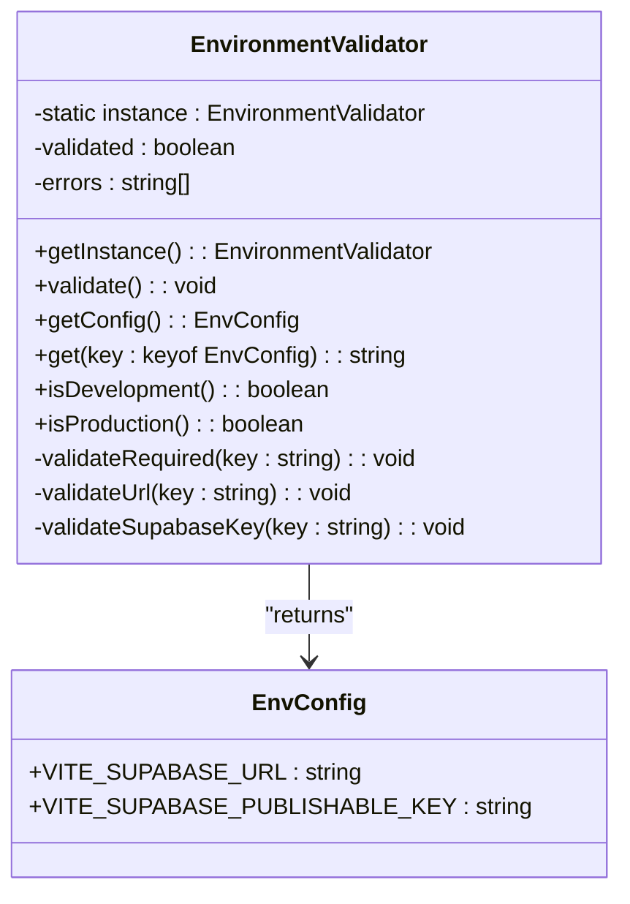
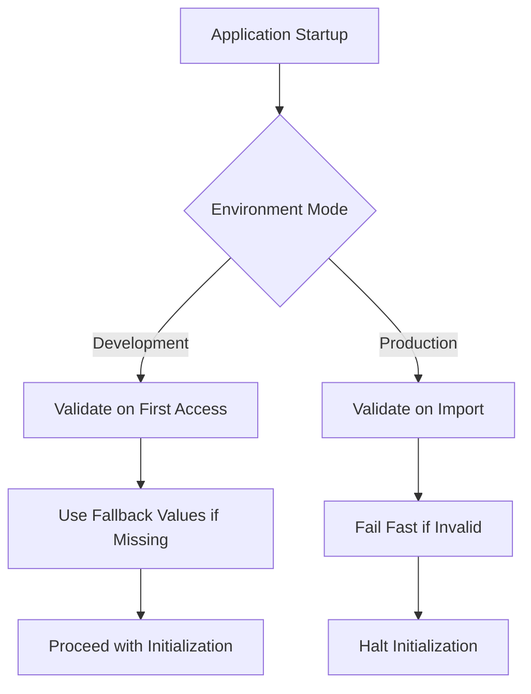
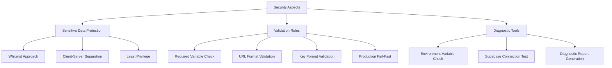
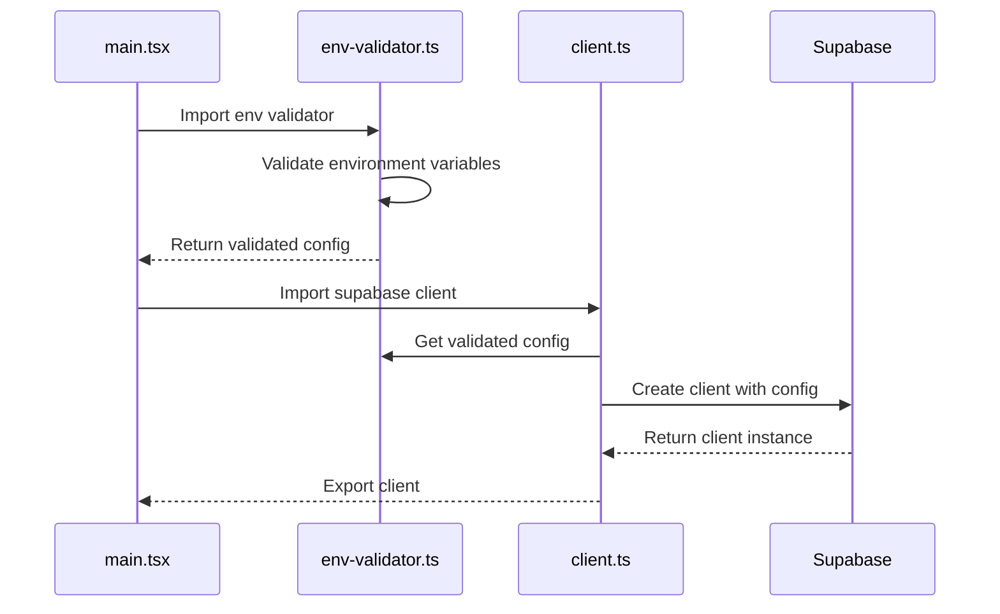
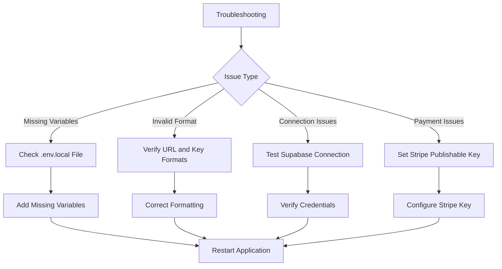

# Environment Configuration

<cite>
**Referenced Files in This Document**   
- [env-validator.ts](file://src/lib/env-validator.ts)
- [vite.config.ts](file://vite.config.ts)
- [client.ts](file://src/integrations/supabase/client.ts)
- [diagnostics.ts](file://src/lib/diagnostics.ts)
- [LOVABLE_ENVIRONMENT_SETUP.md](file://LOVABLE_ENVIRONMENT_SETUP.md)
- [main.tsx](file://src/main.tsx)
- [PaymentCheckout.tsx](file://src/pages/PaymentCheckout.tsx)
- [blogDebugger.ts](file://src/lib/blogDebugger.ts)
</cite>

## Table of Contents
1. [Introduction](#introduction)
2. [Environment Configuration System](#environment-configuration-system)
3. [Environment Validation with env-validator.ts](#environment-validation-with-env-validatorts)
4. [Environment Configuration for Different Environments](#environment-configuration-for-different-environments)
5. [Security Aspects of Environment Configuration](#security-aspects-of-environment-configuration)
6. [Usage of Environment Variables Throughout the Application](#usage-of-environment-variables-throughout-the-application)
7. [Setting Up New Environments](#setting-up-new-environments)
8. [Troubleshooting Common Configuration Issues](#troubleshooting-common-configuration-issues)
9. [Conclusion](#conclusion)

## Introduction

The environment configuration system in the SleekApparels application is a critical component that ensures the application can adapt to different deployment environments while maintaining security and reliability. This document provides a comprehensive overview of the environment configuration system, focusing on the implementation of environment variable management using Vite's `import.meta.env` system with validation through `env-validator.ts`. It covers the configuration for different environments (development, production), fallback mechanisms, security aspects, and provides guidance on setting up new environments and troubleshooting common configuration issues.

**Section sources**
- [env-validator.ts](file://src/lib/env-validator.ts)
- [vite.config.ts](file://vite.config.ts)

## Environment Configuration System

The environment configuration system in the SleekApparels application is built on Vite's `import.meta.env` system, which provides a robust and flexible way to manage environment variables across different deployment environments. The system is designed to ensure that the application can seamlessly transition between development, staging, and production environments while maintaining security and reliability.

The core of the environment configuration system is the `env-validator.ts` file, which implements a singleton pattern to validate required environment variables at application startup. This validation ensures that critical configuration values are present and correctly formatted before the application proceeds with initialization.

The system also includes fallback mechanisms in the `vite.config.ts` file, which provides default values for environment variables when they are not explicitly set. This is particularly useful in development environments where developers may not have access to production credentials.



**Diagram sources**
- [env-validator.ts](file://src/lib/env-validator.ts)
- [vite.config.ts](file://vite.config.ts)

**Section sources**
- [env-validator.ts](file://src/lib/env-validator.ts)
- [vite.config.ts](file://vite.config.ts)

## Environment Validation with env-validator.ts

The `env-validator.ts` file implements a comprehensive environment validation system that ensures all required environment variables are present and correctly formatted. The validation process is implemented as a singleton class `EnvironmentValidator` that provides a consistent interface for accessing validated environment variables throughout the application.

The validation process includes several key steps:

1. **Required Variable Check**: The system verifies that all required environment variables are present and not empty. For the SleekApparels application, the required variables are `VITE_SUPABASE_URL` and `VITE_SUPABASE_PUBLISHABLE_KEY`.

2. **URL Format Validation**: The system validates that the `VITE_SUPABASE_URL` is a properly formatted URL by attempting to create a `URL` object from its value.

3. **Supabase Key Format Validation**: The system performs a basic validation of the Supabase publishable key format, checking that it is not too short (less than 20 characters), which would indicate a malformed JWT-like token.

4. **Auto-Validation in Production**: In production mode, the environment validation is automatically triggered when the module is imported, ensuring that any configuration issues are caught early in the application lifecycle.

The validation system is designed to fail fast in production environments, throwing an error if any required variables are missing or invalid. This prevents the application from running with incorrect configuration that could lead to security vulnerabilities or operational issues.



**Diagram sources**
- [env-validator.ts](file://src/lib/env-validator.ts)

**Section sources**
- [env-validator.ts](file://src/lib/env-validator.ts)

## Environment Configuration for Different Environments

The environment configuration system supports different environments (development, production) through Vite's mode-based configuration and conditional logic in the `env-validator.ts` file. The system provides different behaviors and validation rules depending on the current environment.

In **development mode**, the environment validation is less strict, allowing developers to work without requiring all production credentials. The system still validates the format of environment variables but does not automatically validate them on import, giving developers more flexibility during development.

In **production mode**, the environment validation is more stringent, with automatic validation occurring on module import. This ensures that any configuration issues are caught immediately, preventing the application from running with incorrect settings.

The `vite.config.ts` file implements environment-specific configuration through the `define` property, which allows for the injection of environment variables at build time. The configuration includes fallback values for critical environment variables, ensuring that the application can still function even if certain variables are not explicitly set.



**Diagram sources**
- [vite.config.ts](file://vite.config.ts)
- [env-validator.ts](file://src/lib/env-validator.ts)

**Section sources**
- [vite.config.ts](file://vite.config.ts)
- [env-validator.ts](file://src/lib/env-validator.ts)

## Security Aspects of Environment Configuration

The environment configuration system incorporates several security measures to protect sensitive data and prevent common configuration-related vulnerabilities.

### Sensitive Data Protection

The system follows the principle of least privilege by only exposing the minimum required environment variables to the client-side application. Sensitive credentials such as database passwords, API secrets, and private keys are not exposed to the client-side and are only used in server-side functions.

The `env-validator.ts` file implements a whitelist approach, only allowing access to explicitly defined environment variables through the `getConfig()` and `get()` methods. This prevents accidental exposure of sensitive environment variables that might be present in the environment but are not intended for client-side use.

### Validation Rules

The system implements strict validation rules to prevent common configuration errors that could lead to security vulnerabilities:

1. **Required Variable Validation**: Ensures that critical configuration values are present, preventing the application from running with incomplete configuration.

2. **URL Format Validation**: Prevents injection attacks by ensuring that URL values are properly formatted.

3. **Key Format Validation**: Performs basic validation of cryptographic keys to ensure they meet minimum length requirements, reducing the risk of weak keys.

4. **Production Fail-Fast**: In production mode, the system fails fast if any configuration issues are detected, preventing the application from running in an insecure state.

The system also includes diagnostic tools in the `diagnostics.ts` file that can be used to verify the correctness of environment variables and detect potential configuration issues.



**Diagram sources**
- [env-validator.ts](file://src/lib/env-validator.ts)
- [diagnostics.ts](file://src/lib/diagnostics.ts)

**Section sources**
- [env-validator.ts](file://src/lib/env-validator.ts)
- [diagnostics.ts](file://src/lib/diagnostics.ts)

## Usage of Environment Variables Throughout the Application

Environment variables are used throughout the application to configure various components and services. The primary usage is in the Supabase integration, where the `VITE_SUPABASE_URL` and `VITE_SUPABASE_PUBLISHABLE_KEY` variables are used to configure the Supabase client.

The `client.ts` file in the `src/integrations/supabase/` directory demonstrates how environment variables are used to configure the Supabase client. The file imports the validated environment configuration from `env-validator.ts` and uses it to create a Supabase client instance.



**Diagram sources**
- [main.tsx](file://src/main.tsx)
- [env-validator.ts](file://src/lib/env-validator.ts)
- [client.ts](file://src/integrations/supabase/client.ts)

**Section sources**
- [main.tsx](file://src/main.tsx)
- [env-validator.ts](file://src/lib/env-validator.ts)
- [client.ts](file://src/integrations/supabase/client.ts)

## Setting Up New Environments

Setting up new environments for the SleekApparels application involves configuring the appropriate environment variables and ensuring that the environment validation system can properly validate them.

### Development Environment Setup

For development environments, the setup process is relatively simple:

1. Create a `.env.local` file in the project root directory
2. Add the required environment variables:
   - `VITE_SUPABASE_URL`: The URL of your Supabase project
   - `VITE_SUPABASE_PUBLISHABLE_KEY`: The publishable key for your Supabase project
   - `VITE_STRIPE_PUBLISHABLE_KEY` (optional): The publishable key for Stripe if using payment features

3. The `vite.config.ts` file provides fallback values for these variables, so they can be omitted if using the default Lovable Cloud configuration.

### Production Environment Setup

For production environments, the setup process is managed through the Lovable Cloud dashboard:

1. Access the Lovable Cloud dashboard and select your project
2. Navigate to the Environment Variables section
3. Verify that the following variables are set:
   - `VITE_SUPABASE_URL`: Should be automatically set by Lovable Cloud
   - `VITE_SUPABASE_PUBLISHABLE_KEY`: Should be automatically set by Lovable Cloud
   - `VITE_STRIPE_PUBLISHABLE_KEY`: Set manually if using payment features

4. The Lovable Cloud platform automatically manages the Supabase configuration based on your project's `supabase/config.toml` file.

### Environment-Specific Configuration

The application supports environment-specific configuration through Vite's mode system. Different configuration values can be specified for development, preview, and production modes by using the `--mode` flag when running Vite commands.

```mermaid
flowchart TD
A[Set Up New Environment] --> B{Environment Type}
B --> |Development| C[Create .env.local File]
B --> |Production| D[Configure in Lovable Cloud]
C --> C1[Add VITE_SUPABASE_URL]
C --> C2[Add VITE_SUPABASE_PUBLISHABLE_KEY]
C --> C3[Add VITE_STRIPE_PUBLISHABLE_KEY (optional)]
D --> D1[Verify Auto-Managed Variables]
D --> D2[Set Optional Service Keys]
D --> D3[Redeploy Application]
```

**Diagram sources**
- [vite.config.ts](file://vite.config.ts)
- [LOVABLE_ENVIRONMENT_SETUP.md](file://LOVABLE_ENVIRONMENT_SETUP.md)

**Section sources**
- [vite.config.ts](file://vite.config.ts)
- [LOVABLE_ENVIRONMENT_SETUP.md](file://LOVABLE_ENVIRONMENT_SETUP.md)

## Troubleshooting Common Configuration Issues

The environment configuration system includes several tools and mechanisms to help diagnose and resolve common configuration issues.

### Common Issues and Solutions

1. **Missing Required Environment Variables**
   - **Symptoms**: Application fails to load with errors about missing environment variables
   - **Solution**: Verify that the required variables (`VITE_SUPABASE_URL`, `VITE_SUPABASE_PUBLISHABLE_KEY`) are set in your environment or `.env.local` file

2. **Invalid URL Format**
   - **Symptoms**: "Invalid URL format" error in console
   - **Solution**: Verify that the `VITE_SUPABASE_URL` is a properly formatted URL (e.g., `https://your-project.supabase.co`)

3. **Supabase Connection Issues**
   - **Symptoms**: Authentication fails, database queries don't work
   - **Solution**: Verify that both the URL and publishable key are correct and match your Supabase project

4. **Stripe Integration Issues**
   - **Symptoms**: Payment checkout page shows errors
   - **Solution**: Set the `VITE_STRIPE_PUBLISHABLE_KEY` environment variable if using payment features

### Diagnostic Tools

The application includes several diagnostic tools to help identify and resolve configuration issues:

1. **Environment Variable Check**: The `checkEnvironmentVariables()` function in `diagnostics.ts` verifies that all required environment variables are set.

2. **Supabase Connection Test**: The `testSupabaseConnection()` function tests the connection to the Supabase backend.

3. **Diagnostic Report**: The `generateDiagnosticReport()` function compiles all diagnostic results into a comprehensive report.



**Diagram sources**
- [diagnostics.ts](file://src/lib/diagnostics.ts)
- [LOVABLE_ENVIRONMENT_SETUP.md](file://LOVABLE_ENVIRONMENT_SETUP.md)

**Section sources**
- [diagnostics.ts](file://src/lib/diagnostics.ts)
- [LOVABLE_ENVIRONMENT_SETUP.md](file://LOVABLE_ENVIRONMENT_SETUP.md)

## Conclusion

The environment configuration system in the SleekApparels application provides a robust and secure way to manage configuration across different deployment environments. By leveraging Vite's `import.meta.env` system and implementing comprehensive validation through `env-validator.ts`, the system ensures that the application can adapt to different environments while maintaining security and reliability.

The system's design emphasizes fail-fast behavior in production environments, preventing the application from running with incorrect configuration that could lead to security vulnerabilities or operational issues. The inclusion of diagnostic tools and clear documentation makes it easier for developers to set up new environments and troubleshoot common configuration issues.

By following the guidelines outlined in this document, developers can ensure that their environments are properly configured and secure, allowing the application to function correctly across all deployment scenarios.