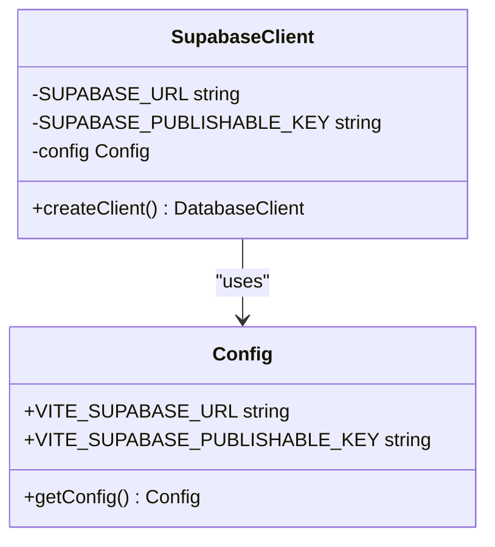
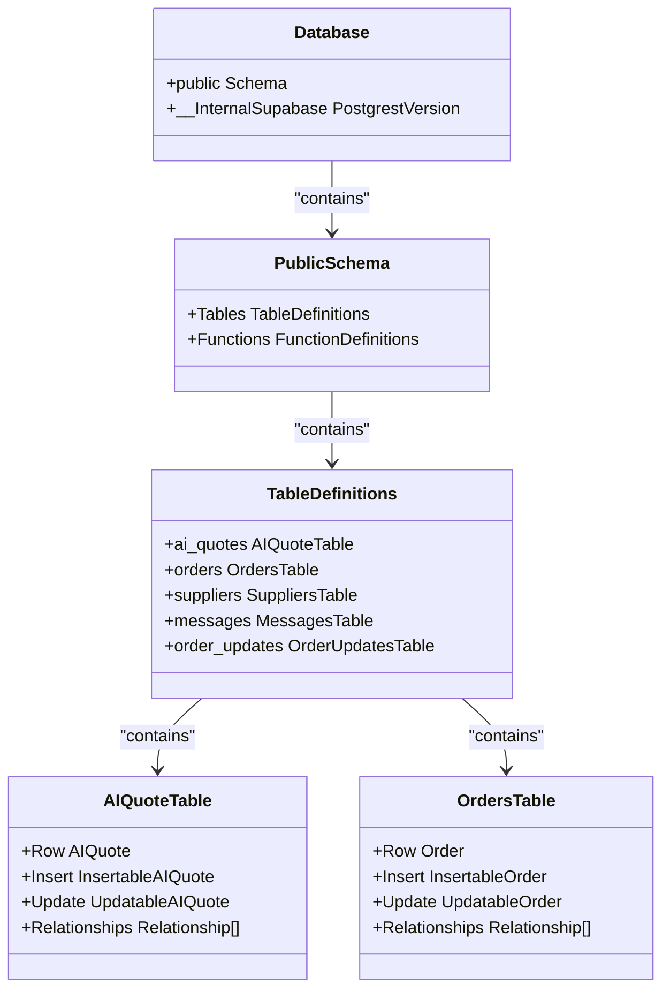
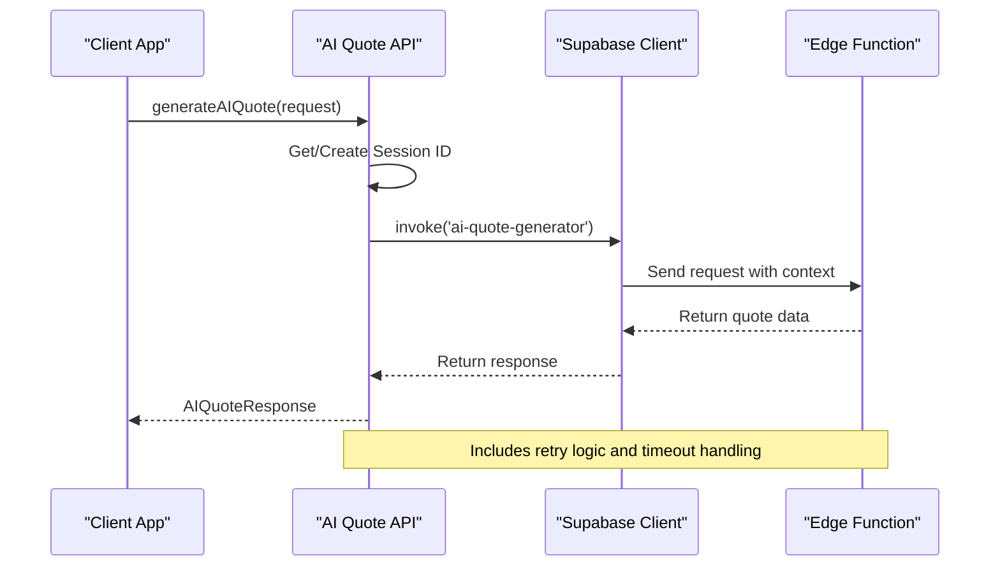
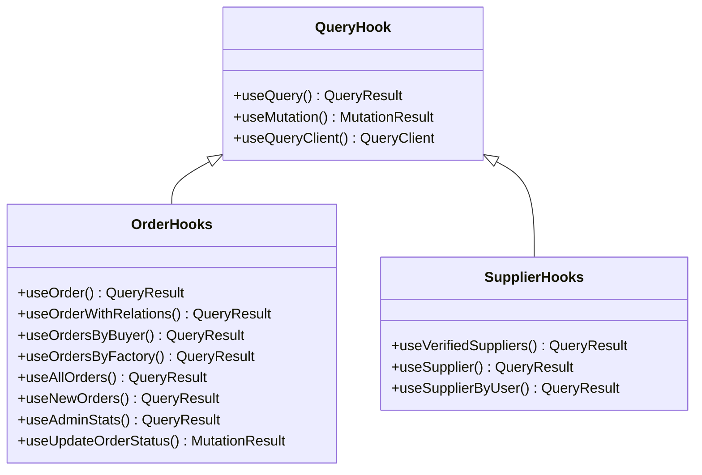
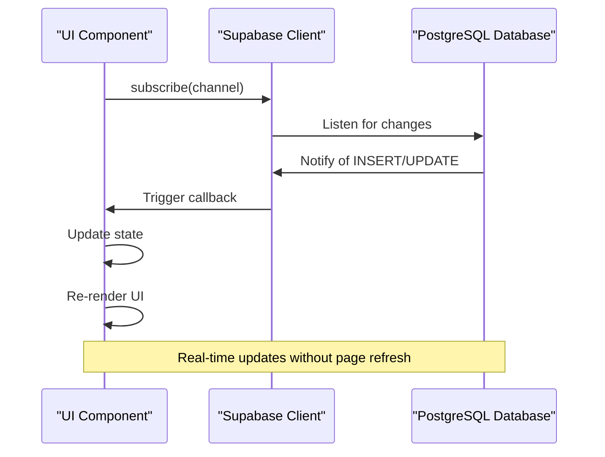
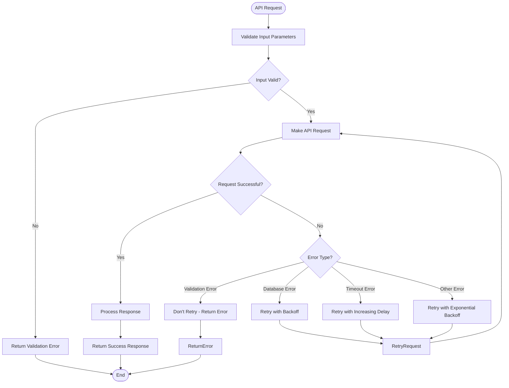
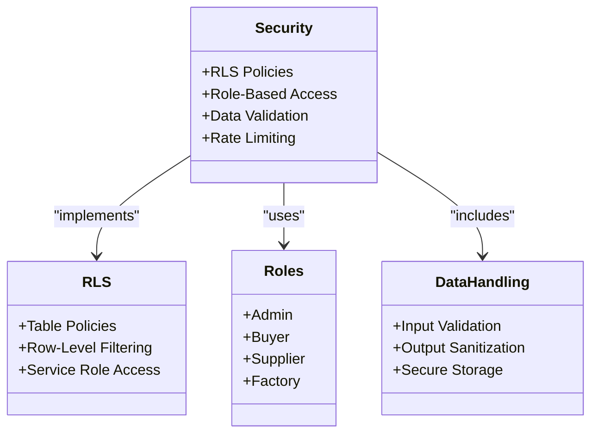
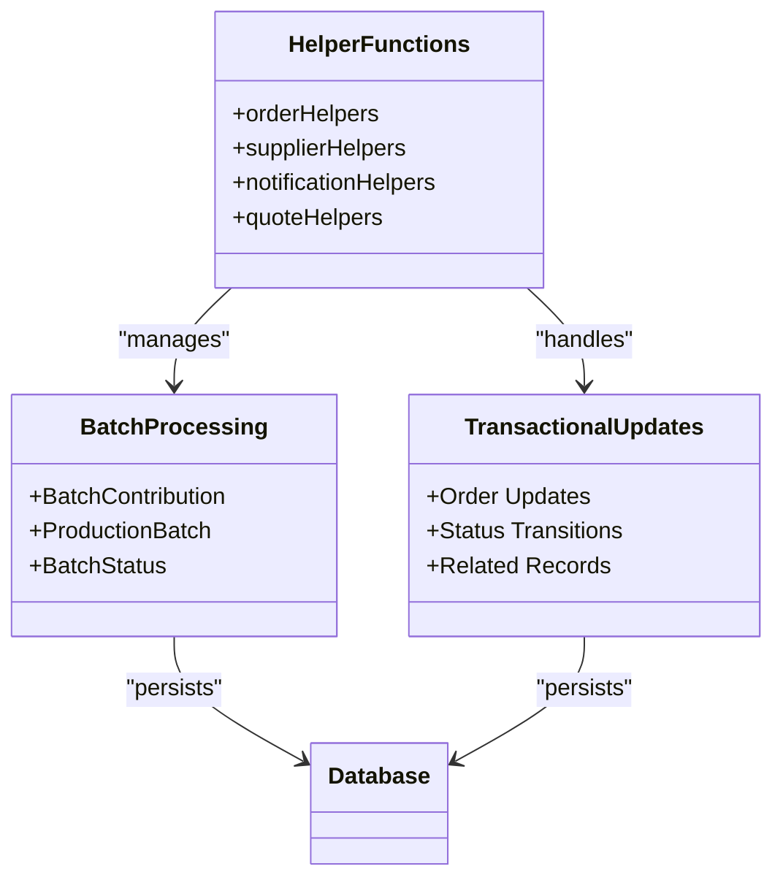

# API Integration Layer

<cite>
**Referenced Files in This Document**   
- [client.ts](file://src/integrations/supabase/client.ts)
- [types.ts](file://src/integrations/supabase/types.ts)
- [aiQuote.ts](file://src/lib/api/aiQuote.ts)
- [useOrders.ts](file://src/hooks/queries/useOrders.ts)
- [useSuppliers.ts](file://src/hooks/queries/useSuppliers.ts)
- [useRealtimeMessages.ts](file://src/hooks/useRealtimeMessages.ts)
- [OrderMessaging.tsx](file://src/components/OrderMessaging.tsx)
- [ProductionUpdatesFeed.tsx](file://src/components/ProductionUpdatesFeed.tsx)
- [supabaseHelpers.ts](file://src/lib/supabaseHelpers.ts)
- [database.ts](file://src/types/database.ts)
</cite>

## Table of Contents
1. [Introduction](#introduction)
2. [Supabase Client Configuration](#supabase-client-configuration)
3. [Type-Safe Database Integration](#type-safe-database-integration)
4. [AI Quote Generation API](#ai-quote-generation-api)
5. [Query Hook Patterns](#query-hook-patterns)
6. [Real-Time Subscriptions](#real-time-subscriptions)
7. [Error Handling and Network Resilience](#error-handling-and-network-resilience)
8. [Security Considerations](#security-considerations)
9. [Complex Data Operations](#complex-data-operations)
10. [Conclusion](#conclusion)

## Introduction

The API integration layer of the SleekApparels application provides a robust, type-safe interface between the frontend application and the Supabase backend. This documentation details the implementation of the Supabase client, type-safe database integration, AI-powered quote generation, query hook patterns, real-time subscriptions, error handling, security considerations, and complex data operations. The integration layer is designed to ensure reliability, performance, and security while providing a seamless user experience.

## Supabase Client Configuration

The Supabase client is configured in `client.ts` to provide a centralized, type-safe connection to the Supabase backend. The configuration includes environment variable validation, authentication settings, and proper session management.

**Diagram sources**
- [client.ts](file://src/integrations/supabase/client.ts#L1-L20)

**Section sources**
- [client.ts](file://src/integrations/supabase/client.ts#L1-L20)

The client is initialized with the following configuration:
- Environment variables are validated on import using the env-validator module
- Authentication settings include localStorage persistence, session persistence, and automatic token refresh
- The client is exported as a singleton instance for consistent usage throughout the application

## Type-Safe Database Integration

The integration layer uses a comprehensive type system to ensure type safety when interacting with the Supabase database. The types are defined in `types.ts` and `database.ts`, providing TypeScript interfaces for all database tables and their relationships.

**Diagram sources**
- [types.ts](file://src/integrations/supabase/types.ts#L1-L800)
- [database.ts](file://src/types/database.ts#L1-L200)

**Section sources**
- [types.ts](file://src/integrations/supabase/types.ts#L1-L800)
- [database.ts](file://src/types/database.ts#L1-L200)

The type system includes:
- Row types for database records
- Insert types for new records (with optional fields)
- Update types for modified records (with optional fields)
- Relationship definitions for foreign key constraints
- Enum types for standardized values (e.g., AppRole, VerificationStatus)

## AI Quote Generation API

The AI quote generation system is implemented in `aiQuote.ts` and integrates with Supabase Edge Functions to provide AI-powered quote generation with Bangladesh manufacturing intelligence. The system includes retry logic, timeout handling, and local pricing context to improve AI accuracy.

**Diagram sources**
- [aiQuote.ts](file://src/lib/api/aiQuote.ts#L1-L274)

**Section sources**
- [aiQuote.ts](file://src/lib/api/aiQuote.ts#L1-L274)

Key features of the AI quote generation API:
- Session-based tracking using localStorage for anonymous users
- Maximum of 2 retries with exponential backoff for failed requests
- 30-second timeout with abort controller for long-running requests
- Local pricing estimates provided as context to improve AI accuracy
- Comprehensive error handling with specific retry strategies for different error types
- Integration with Bangladesh manufacturing standards for accurate pricing and timeline calculations

## Query Hook Patterns

The application uses React Query hooks in the `queries/` directory to manage data fetching, caching, and mutation operations. The hooks follow a consistent pattern for queries and mutations, with proper query key management and optimistic updates.

**Diagram sources**
- [useOrders.ts](file://src/hooks/queries/useOrders.ts#L1-L152)
- [useSuppliers.ts](file://src/hooks/queries/useSuppliers.ts#L1-L49)

**Section sources**
- [useOrders.ts](file://src/hooks/queries/useOrders.ts#L1-L152)
- [useSuppliers.ts](file://src/hooks/queries/useSuppliers.ts#L1-L49)

The query hook patterns include:
- Consistent query key structure using the Query Key Factory pattern
- Proper dependency management with enabled flags
- Optimistic updates for mutations with rollback on error
- Automatic refetching after successful mutations
- Error handling with user-friendly toast notifications
- Type-safe queries using the database type definitions

## Real-Time Subscriptions

The application implements real-time updates using Supabase's real-time capabilities in components like OrderMessaging and ProductionUpdatesFeed. These components subscribe to database changes and update the UI in real-time without requiring manual refreshes.

**Diagram sources**
- [OrderMessaging.tsx](file://src/components/OrderMessaging.tsx#L1-L217)
- [ProductionUpdatesFeed.tsx](file://src/components/ProductionUpdatesFeed.tsx#L1-L240)

**Section sources**
- [OrderMessaging.tsx](file://src/components/OrderMessaging.tsx#L1-L217)
- [ProductionUpdatesFeed.tsx](file://src/components/ProductionUpdatesFeed.tsx#L1-L240)

Real-time subscription implementation details:
- OrderMessaging subscribes to order_messages table for a specific order
- ProductionUpdatesFeed subscribes to order_updates table for production progress
- Both components use the Supabase channel API with postgres_changes events
- Subscriptions are properly cleaned up on component unmount
- Real-time updates trigger toast notifications for new production updates
- Profile data is fetched separately to enrich real-time updates with user information

## Error Handling and Network Resilience

The integration layer implements comprehensive error handling and network resilience strategies to ensure a reliable user experience even under adverse conditions.

**Diagram sources**
- [aiQuote.ts](file://src/lib/api/aiQuote.ts#L49-L145)
- [supabaseHelpers.ts](file://src/lib/supabaseHelpers.ts#L1-L376)

**Section sources**
- [aiQuote.ts](file://src/lib/api/aiQuote.ts#L49-L145)
- [supabaseHelpers.ts](file://src/lib/supabaseHelpers.ts#L1-L376)

Error handling and network resilience strategies:
- Validation errors are not retried and returned immediately to the user
- Database errors are retried with a 5-second delay as specified by the server
- Timeout errors are retried with increasing delays (2s, 4s, 8s)
- Other errors use exponential backoff with a maximum delay of 5 seconds
- All errors are logged to the console for debugging
- User-friendly error messages are displayed using toast notifications
- Optimistic updates are rolled back on mutation errors
- Real-time subscriptions are automatically re-established if disconnected

## Security Considerations

The integration layer adheres to strict security policies, including Row Level Security (RLS) enforcement, proper role-based access control, and secure data handling practices.

**Diagram sources**
- [20251127091524_dd83810a-55c9-494a-8878-c84278881cc9.sql](file://supabase/migrations/20251127091524_dd83810a-55c9-494a-8878-c84278881cc9.sql#L1-L31)
- [20251120233928_2016afb8-d720-4858-9e12-7fb4ebbd5de0.sql](file://supabase/migrations/20251120233928_2016afb8-d720-4858-9e12-7fb4ebbd5de0.sql#L156-L189)

**Section sources**
- [20251127091524_dd83810a-55c9-494a-8878-c84278881cc9.sql](file://supabase/migrations/20251127091524_dd83810a-55c9-494a-8878-c84278881cc9.sql#L1-L31)
- [20251120233928_2016afb8-d720-4858-9e12-7fb4ebbd5de0.sql](file://supabase/migrations/20251120233928_2016afb8-d720-4858-9e12-7fb4ebbd5de0.sql#L156-L189)

Security implementation details:
- Comprehensive RLS policies ensure users can only access data they are authorized to see
- Service role is used for administrative operations with proper access controls
- All user-facing operations are validated against the user's role and permissions
- Rate limiting is implemented for sensitive operations to prevent abuse
- Input validation is performed on both client and server sides
- Sensitive data is not exposed in client-side queries
- Authentication state is properly managed and validated

## Complex Data Operations

The integration layer supports complex data operations including batch processing and transactional updates through carefully designed helper functions and database interactions.

**Diagram sources**
- [supabaseHelpers.ts](file://src/lib/supabaseHelpers.ts#L33-L106)
- [database.ts](file://src/types/database.ts#L84-L93)

**Section sources**
- [supabaseHelpers.ts](file://src/lib/supabaseHelpers.ts#L33-L106)
- [database.ts](file://src/types/database.ts#L84-L93)

Complex data operations include:
- Batch processing for production batches with multiple contributions
- Transactional updates for order status changes that affect related records
- Atomic operations for quote conversion to orders
- Helper functions that encapsulate complex database interactions
- Type-safe operations that ensure data consistency
- Proper error handling for partial failures in batch operations

## Conclusion

The API integration layer of the SleekApparels application provides a robust, secure, and type-safe interface between the frontend and backend systems. By leveraging Supabase's capabilities, the integration layer delivers real-time updates, AI-powered functionality, and reliable data operations while maintaining strict security standards. The use of React Query hooks, comprehensive error handling, and well-structured helper functions ensures a maintainable and scalable codebase that can adapt to future requirements.