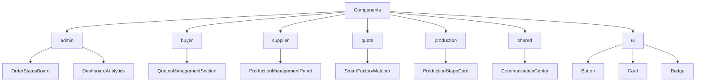
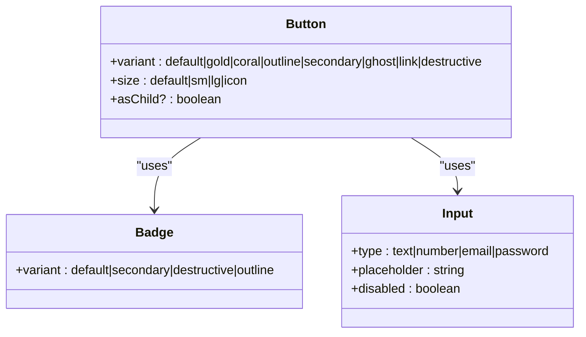
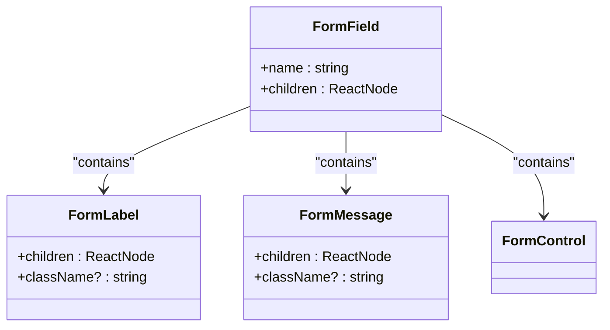
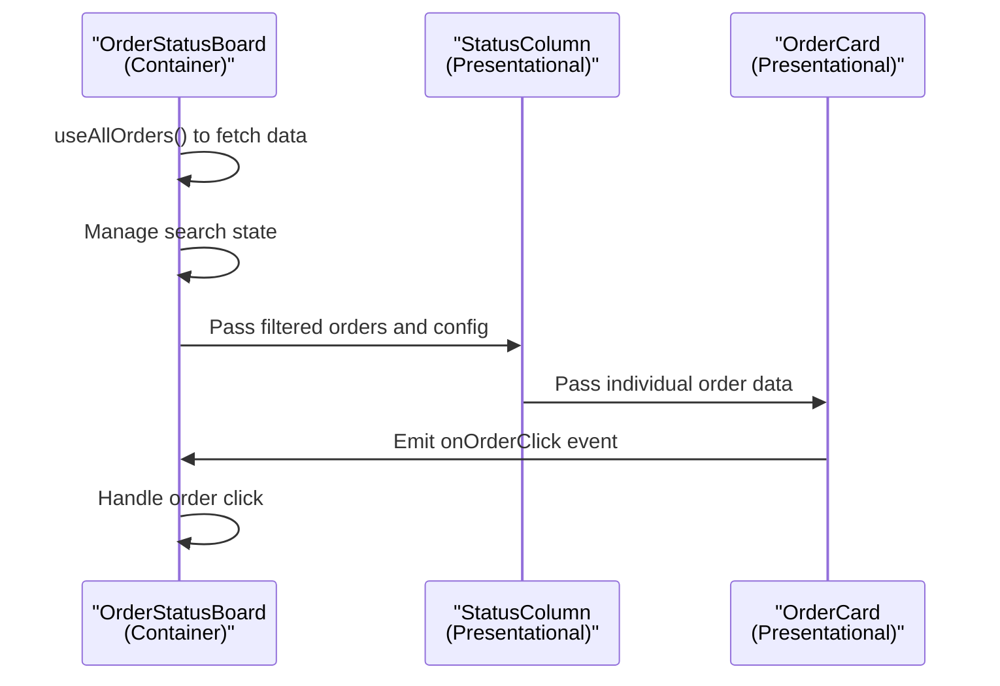
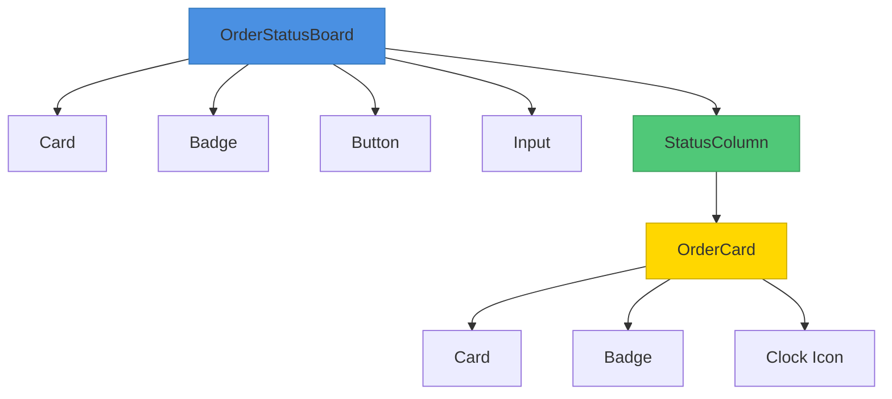
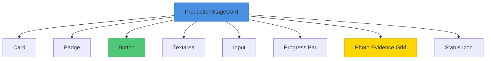
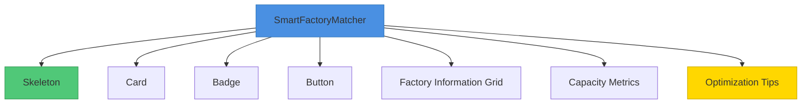
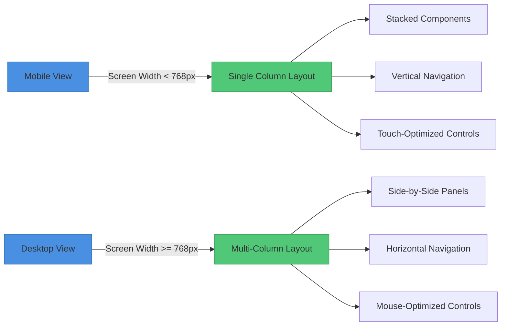
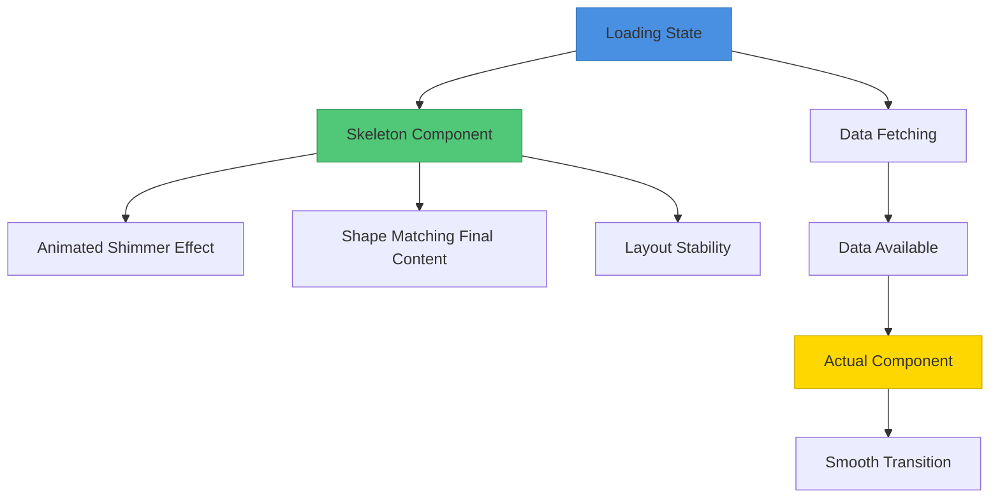

# Component Architecture

<cite>
**Referenced Files in This Document**   
- [OrderStatusBoard.tsx](file://src/components/admin/OrderStatusBoard.tsx)
- [ProductionStageCard.tsx](file://src/components/production/ProductionStageCard.tsx)
- [SmartFactoryMatcher.tsx](file://src/components/quote/SmartFactoryMatcher.tsx)
- [button.tsx](file://src/components/ui/button.tsx)
- [card.tsx](file://src/components/ui/card.tsx)
- [badge.tsx](file://src/components/ui/badge.tsx)
- [skeleton.tsx](file://src/components/ui/skeleton.tsx)
- [dialog.tsx](file://src/components/ui/dialog.tsx)
- [form.tsx](file://src/components/ui/form.tsx)
- [label.tsx](file://src/components/ui/label.tsx)
- [QuoteSkeleton.tsx](file://src/components/quote/QuoteSkeleton.tsx)
- [ErrorBoundary.tsx](file://src/components/ErrorBoundary.tsx)
- [CommunicationCenter.tsx](file://src/components/shared/CommunicationCenter.tsx)
- [tailwind.config.ts](file://tailwind.config.ts)
- [components.json](file://components.json)
</cite>

## Table of Contents
1. [Introduction](#introduction)
2. [Feature Domain Organization](#feature-domain-organization)
3. [Atomic Design Principles](#atomic-design-principles)
4. [Container and Presentational Patterns](#container-and-presentational-patterns)
5. [shadcn/ui Implementation](#shadcnui-implementation)
6. [Component Composition Examples](#component-composition-examples)
7. [Accessibility and Responsive Design](#accessibility-and-responsive-design)
8. [Theming and Styling System](#theming-and-styling-system)
9. [Loading States and Skeletons](#loading-states-and-skeletons)
10. [Error Boundaries and UX](#error-boundaries-and-ux)
11. [Component Extension Guidelines](#component-extension-guidelines)

## Introduction
The frontend application employs a sophisticated component architecture that organizes UI elements by feature domains while maintaining consistency through atomic design principles and reusable UI components. The architecture leverages the shadcn/ui library for base components, which are then customized and extended to meet the specific needs of the application. Components are organized by feature domains such as admin, buyer, supplier, quote, and production, enabling focused development and maintenance. The system implements container/presentational patterns to separate data logic from UI rendering, and incorporates accessibility, responsive behavior, and theming support throughout.

**Section sources**
- [OrderStatusBoard.tsx](file://src/components/admin/OrderStatusBoard.tsx)
- [ProductionStageCard.tsx](file://src/components/production/ProductionStageCard.tsx)
- [SmartFactoryMatcher.tsx](file://src/components/quote/SmartFactoryMatcher.tsx)

## Feature Domain Organization
The component architecture is organized by feature domains, with each domain having its own dedicated directory under the components folder. This organization enables focused development and maintenance of components related to specific business functions.

The primary feature domains include:
- **admin**: Components for administrative functions such as analytics, order management, and supplier verification
- **buyer**: Components specific to buyer functionality including quotes management and invoices
- **supplier**: Components for supplier operations such as production management and order tracking
- **quote**: Components related to the quoting process including quote builders and comparison tools
- **production**: Components for production tracking and quality control

This domain-based organization allows for clear separation of concerns and enables teams to work on specific areas of the application without affecting unrelated functionality. Each domain can evolve independently while still leveraging shared UI components and patterns.



**Diagram sources**
- [src/components](file://src/components)
- [OrderStatusBoard.tsx](file://src/components/admin/OrderStatusBoard.tsx)
- [ProductionStageCard.tsx](file://src/components/production/ProductionStageCard.tsx)
- [SmartFactoryMatcher.tsx](file://src/components/quote/SmartFactoryMatcher.tsx)

**Section sources**
- [src/components](file://src/components)

## Atomic Design Principles
The component architecture follows atomic design principles, organizing UI elements into a hierarchical structure from basic building blocks to complex organisms. This approach ensures consistency and reusability across the application.

The atomic design structure is implemented as follows:

### Atoms
Basic UI elements such as buttons, badges, and inputs are implemented in the ui directory. These components are highly reusable and form the foundation of the design system.



**Diagram sources**
- [button.tsx](file://src/components/ui/button.tsx)
- [badge.tsx](file://src/components/ui/badge.tsx)

### Molecules
Combinations of atoms that form relatively simple UI components. Examples include form fields with labels and error messages, or cards with headers and content.



**Diagram sources**
- [form.tsx](file://src/components/ui/form.tsx)
- [label.tsx](file://src/components/ui/label.tsx)

### Organisms
Complex components that combine multiple molecules and atoms to create substantial UI sections. These components often represent specific feature functionality.

**Section sources**
- [form.tsx](file://src/components/ui/form.tsx)
- [label.tsx](file://src/components/ui/label.tsx)

## Container and Presentational Patterns
The application implements a clear separation between container and presentational components, following the container/presentational pattern. This separation enhances reusability, testability, and maintainability of the component architecture.

### Container Components
Container components are responsible for data fetching, state management, and business logic. They typically do not contain significant UI markup but instead compose presentational components with the necessary data and callbacks.

For example, the OrderStatusBoard component acts as a container that:
- Fetches order data using the useAllOrders hook
- Manages search and filtering state
- Handles order click events
- Passes data and callbacks to presentational subcomponents

### Presentational Components
Presentational components focus solely on rendering UI based on props. They are typically stateless and can be reused across different contexts.

The StatusColumn and OrderCard components are presentational components that:
- Receive data as props
- Render UI elements based on that data
- Emit events through callback props
- Have no knowledge of data fetching or business logic

This pattern enables the same presentational components to be used in different contexts while maintaining consistent UI and behavior.



**Diagram sources**
- [OrderStatusBoard.tsx](file://src/components/admin/OrderStatusBoard.tsx)

**Section sources**
- [OrderStatusBoard.tsx](file://src/components/admin/OrderStatusBoard.tsx)

## shadcn/ui Implementation
The application leverages shadcn/ui as the foundation for its component library, extending and customizing the base components to match the application's design requirements. The implementation integrates shadcn/ui components with Tailwind CSS for consistent styling across the application.

### Base Component Integration
The ui directory contains shadcn/ui-based components that have been customized for the application's design system. These components use Tailwind CSS classes and the class-variance-authority (cva) library to define variants and styles.

The Button component demonstrates this integration:
- Uses cva to define variants for different visual styles (default, gold, coral, etc.)
- Applies Tailwind CSS classes for layout, spacing, and visual properties
- Extends the base shadcn/ui implementation with application-specific variants

### Component Customization
Base components are customized through:
- Theme-specific color variants that align with the brand palette
- Size variants optimized for the application's layout requirements
- Accessibility enhancements including proper ARIA attributes
- Responsive behavior adjustments for different screen sizes

The configuration in components.json specifies the component library setup, while tailwind.config.ts defines the design tokens and theme variables that ensure consistency across all components.

**Section sources**
- [button.tsx](file://src/components/ui/button.tsx)
- [card.tsx](file://src/components/ui/card.tsx)
- [tailwind.config.ts](file://tailwind.config.ts)
- [components.json](file://components.json)

## Component Composition Examples
The component architecture demonstrates effective composition patterns through key components such as OrderStatusBoard, ProductionStageCard, and SmartFactoryMatcher. These components illustrate how atomic design principles and container/presentational patterns work together to create complex, interactive UIs.

### OrderStatusBoard Composition
The OrderStatusBoard component showcases a comprehensive composition pattern that combines multiple smaller components to create a workflow visualization.



**Diagram sources**
- [OrderStatusBoard.tsx](file://src/components/admin/OrderStatusBoard.tsx)

### ProductionStageCard Composition
The ProductionStageCard component demonstrates a complex interactive component that manages state and provides multiple interaction points.



**Diagram sources**
- [ProductionStageCard.tsx](file://src/components/production/ProductionStageCard.tsx)

### SmartFactoryMatcher Composition
The SmartFactoryMatcher component illustrates data-driven composition with conditional rendering based on loading states and data availability.



**Diagram sources**
- [SmartFactoryMatcher.tsx](file://src/components/quote/SmartFactoryMatcher.tsx)

**Section sources**
- [OrderStatusBoard.tsx](file://src/components/admin/OrderStatusBoard.tsx)
- [ProductionStageCard.tsx](file://src/components/production/ProductionStageCard.tsx)
- [SmartFactoryMatcher.tsx](file://src/components/quote/SmartFactoryMatcher.tsx)

## Accessibility and Responsive Design
The component architecture prioritizes accessibility and responsive behavior to ensure an inclusive user experience across devices and assistive technologies.

### Accessibility Features
Components implement comprehensive accessibility features including:
- Proper semantic HTML structure
- ARIA attributes for interactive elements
- Keyboard navigation support
- Screen reader compatibility
- Sufficient color contrast
- Focus management

The ErrorBoundary component demonstrates accessibility considerations with:
- Clear error messages with descriptive text
- Visible focus indicators on interactive elements
- Proper heading hierarchy
- Alternative text for icons
- High contrast color scheme for error states

### Responsive Behavior
The responsive design system adapts to different screen sizes through:
- Mobile-first CSS approach
- Breakpoint-specific layout adjustments
- Touch-friendly interactive elements
- Adaptive component behavior

The useIsMobile hook provides a reliable way to detect mobile devices and adjust component behavior accordingly. Components like CommunicationCenter adapt their layout from a single column on mobile to a multi-column layout on larger screens, optimizing the user experience for each device type.



**Diagram sources**
- [use-mobile.tsx](file://src/hooks/use-mobile.tsx)
- [CommunicationCenter.tsx](file://src/components/shared/CommunicationCenter.tsx)

**Section sources**
- [ErrorBoundary.tsx](file://src/components/ErrorBoundary.tsx)
- [use-mobile.tsx](file://src/hooks/use-mobile.tsx)
- [CommunicationCenter.tsx](file://src/components/shared/CommunicationCenter.tsx)

## Theming and Styling System
The application implements a comprehensive theming and styling system that ensures visual consistency across all components while allowing for theme variations.

### Design Token System
The styling system is built on a foundation of design tokens defined in Tailwind configuration, which include:
- Color palette with semantic names (primary, secondary, accent, etc.)
- Spacing scale with consistent increments
- Typography scale with defined font sizes and weights
- Border radii with standardized values
- Shadow levels for depth and elevation

### Theme Implementation
Themes are implemented through:
- CSS custom properties (variables) for dynamic theme switching
- Utility-first approach with Tailwind CSS
- Component-specific styling that extends base themes
- Dark mode support with automatic detection

The button component demonstrates theme implementation with multiple variants (default, gold, coral, outline) that inherit from the base theme while providing distinct visual treatments for different use cases.

**Section sources**
- [tailwind.config.ts](file://tailwind.config.ts)
- [button.tsx](file://src/components/ui/button.tsx)
- [card.tsx](file://src/components/ui/card.tsx)

## Loading States and Skeletons
The component architecture implements sophisticated loading states and skeleton screens to enhance user experience during data loading and processing.

### Skeleton Components
Skeleton components provide visual placeholders that maintain layout stability and reduce perceived loading time. The QuoteSkeleton component demonstrates this pattern with:
- Animated shimmer effects to indicate loading
- Shape and size that match the final content
- Hierarchical structure that mirrors the actual component
- Smooth transition to fully loaded state



**Diagram sources**
- [QuoteSkeleton.tsx](file://src/components/quote/QuoteSkeleton.tsx)

### Loading State Management
Loading states are managed through:
- Conditional rendering based on data loading status
- Optimistic updates for improved perceived performance
- Real-time subscriptions for automatic updates
- Error fallbacks for failed requests

The SmartFactoryMatcher component demonstrates effective loading state management by showing a skeleton screen while factory data is being fetched, providing immediate feedback to the user.

**Section sources**
- [QuoteSkeleton.tsx](file://src/components/quote/QuoteSkeleton.tsx)
- [SmartFactoryMatcher.tsx](file://src/components/quote/SmartFactoryMatcher.tsx)

## Error Boundaries and UX
The application implements robust error handling through error boundaries and thoughtful UX patterns to maintain usability even when errors occur.

### Error Boundary Implementation
The ErrorBoundary component provides a safety net for UI errors with:
- Graceful degradation when components fail
- User-friendly error messages
- Recovery options to retry the operation
- Error reporting for debugging

```mermaid
classDiagram
class ErrorBoundary {
-hasError : boolean
-error : Error | null
+getDerivedStateFromError()
+componentDidCatch()
+render()
}
class ErrorFallback {
+error : Error
+resetError : () => void
+render()
}
ErrorBoundary --> ErrorFallback : "renders when error"
ErrorBoundary --> ErrorBoundary : "handles its own errors"
note right of ErrorBoundary
Implements React's error boundary
lifecycle methods to catch
errors in child components
end note
```

**Diagram sources**
- [ErrorBoundary.tsx](file://src/components/ErrorBoundary.tsx)

### UX Considerations
Error handling prioritizes user experience through:
- Clear, non-technical error messages
- Visual distinction between error states and normal UI
- Actionable recovery options
- Error context to help users understand what went wrong
- Non-disruptive presentation that doesn't require page reloads

The CommunicationCenter component demonstrates thoughtful error handling by showing toast notifications for specific error types (upload errors, message sending errors) while maintaining the overall interface usability.

**Section sources**
- [ErrorBoundary.tsx](file://src/components/ErrorBoundary.tsx)
- [CommunicationCenter.tsx](file://src/components/shared/CommunicationCenter.tsx)

## Component Extension Guidelines
The component architecture provides clear guidelines for extending existing components and creating new ones while maintaining consistency with project conventions.

### Extending Existing Components
When extending existing components, follow these guidelines:
- Use composition over inheritance when possible
- Maintain the same API patterns and prop types
- Preserve accessibility features
- Follow the same file organization and naming conventions
- Document new props and their usage

### Creating New Components
When creating new components, adhere to these conventions:
- Organize components by feature domain
- Implement atomic design principles
- Separate container and presentational logic
- Use TypeScript for type safety
- Include loading and error states
- Ensure accessibility compliance
- Test responsive behavior
- Document component usage and props

### Naming Conventions
Follow consistent naming patterns:
- Use PascalCase for component files and exports
- Use descriptive names that reflect component purpose
- Include domain prefix for feature-specific components
- Use "Skeleton" suffix for loading state components
- Use "Dialog" suffix for modal components

These guidelines ensure that new components integrate seamlessly with the existing architecture and maintain the high quality standards of the application.

**Section sources**
- [src/components](file://src/components)
- [components.json](file://components.json)
- [tailwind.config.ts](file://tailwind.config.ts)