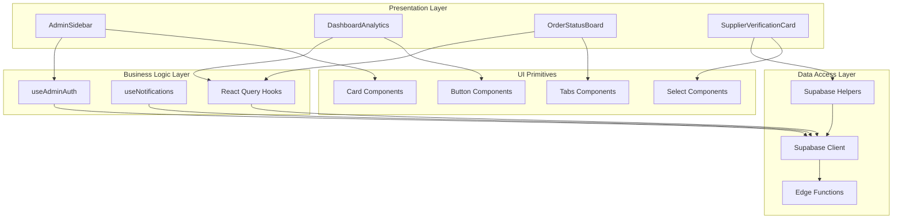
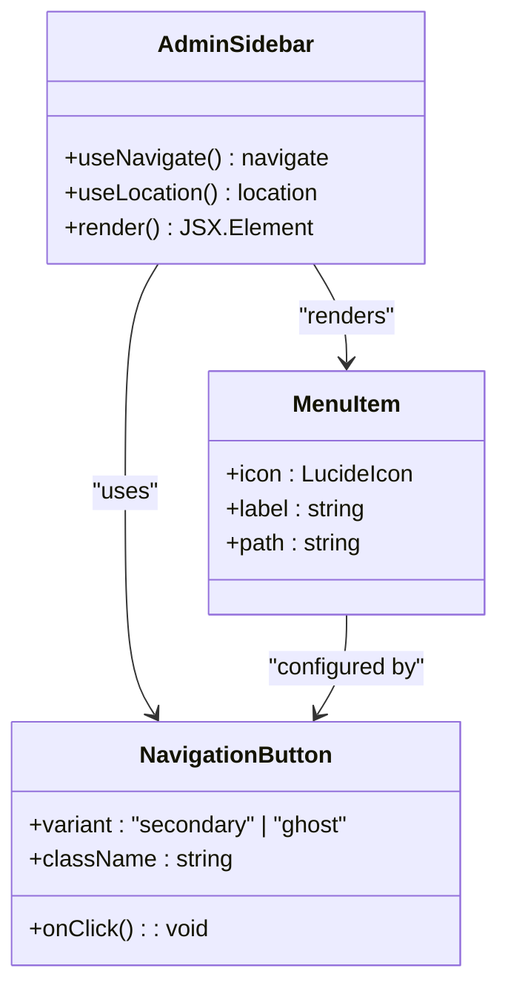
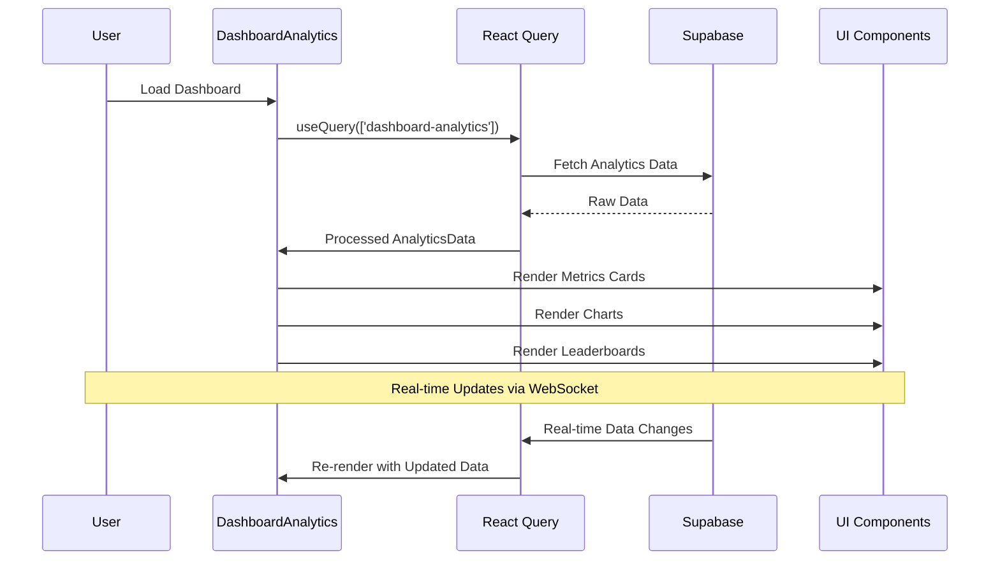
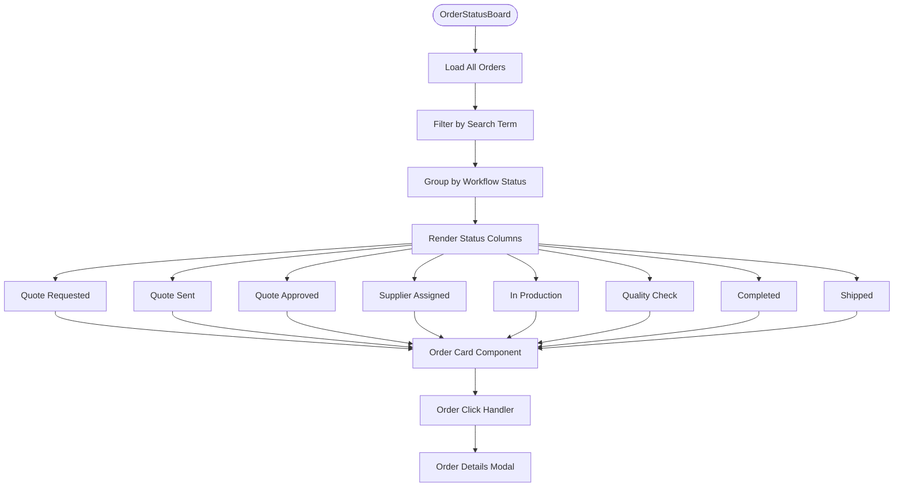
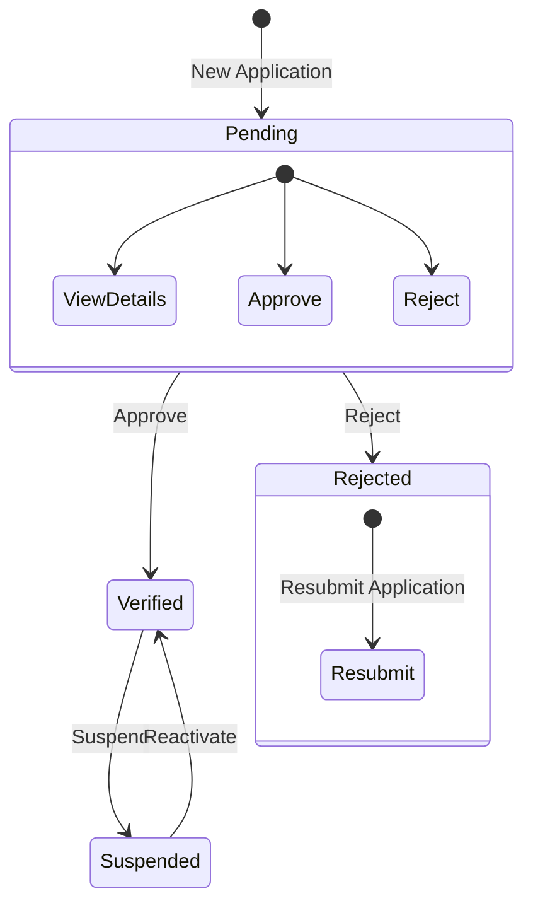
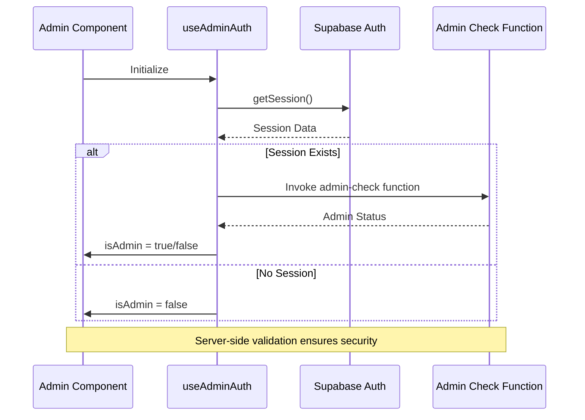
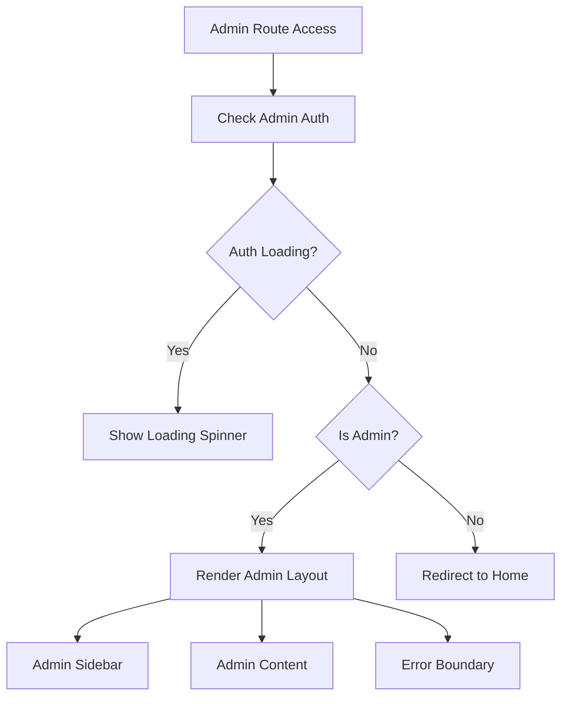
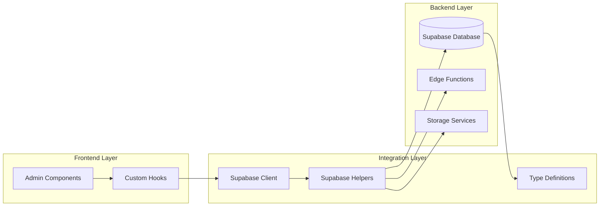
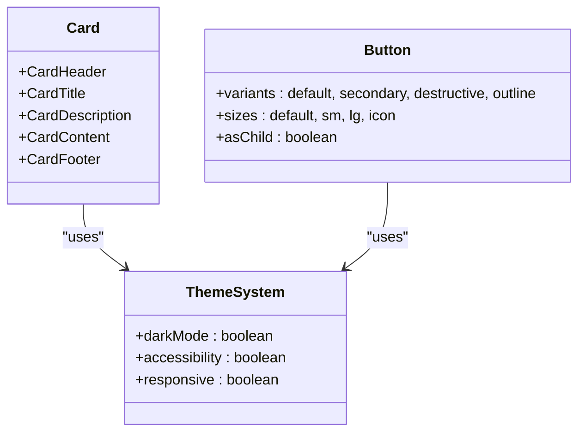
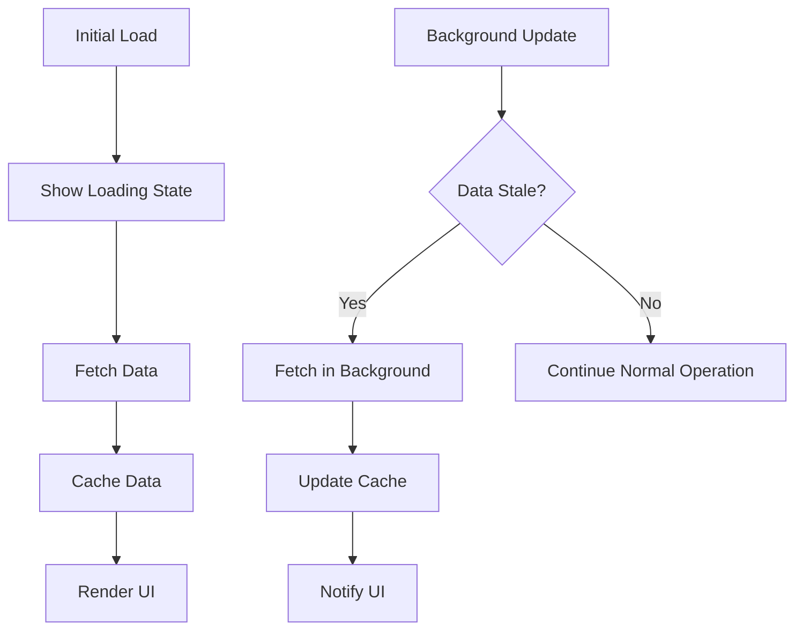

# Admin Components

<cite>
**Referenced Files in This Document**
- [AdminSidebar.tsx](file://src/components/AdminSidebar.tsx)
- [DashboardAnalytics.tsx](file://src/components/admin/DashboardAnalytics.tsx)
- [OrderStatusBoard.tsx](file://src/components/admin/OrderStatusBoard.tsx)
- [SupplierVerificationCard.tsx](file://src/components/admin/SupplierVerificationCard.tsx)
- [useAdminAuth.ts](file://src/hooks/useAdminAuth.ts)
- [useNotifications.ts](file://src/hooks/useNotifications.ts)
- [AdminLayout.tsx](file://src/pages/admin/AdminLayout.tsx)
- [AdminAnalytics.tsx](file://src/pages/AdminAnalytics.tsx)
- [Analytics.tsx](file://src/pages/admin/Analytics.tsx)
- [client.ts](file://src/integrations/supabase/client.ts)
- [supabaseHelpers.ts](file://src/lib/supabaseHelpers.ts)
- [card.tsx](file://src/components/ui/card.tsx)
- [button.tsx](file://src/components/ui/button.tsx)
</cite>

## Table of Contents
1. [Introduction](#introduction)
2. [Architecture Overview](#architecture-overview)
3. [Core Admin Components](#core-admin-components)
4. [Authentication and Authorization](#authentication-and-authorization)
5. [Data Integration](#data-integration)
6. [Styling and Accessibility](#styling-and-accessibility)
7. [Performance Optimization](#performance-optimization)
8. [Extension Points](#extension-points)
9. [Troubleshooting Guide](#troubleshooting-guide)
10. [Best Practices](#best-practices)

## Introduction

The sleekapp-v100 admin system provides a comprehensive suite of UI components designed for administrative oversight and management. Built with React and TypeScript, these components integrate seamlessly with Supabase backend services to deliver real-time data visualization, order management, supplier verification, and analytics capabilities.

The admin components follow a modular architecture with clear separation of concerns, utilizing shadcn/ui primitives for consistent styling and accessibility. They implement role-based rendering logic and leverage React Query for efficient data fetching and caching.

## Architecture Overview

The admin system follows a layered architecture pattern with distinct separation between presentation, business logic, and data access layers.



**Diagram sources**
- [AdminSidebar.tsx](file://src/components/AdminSidebar.tsx#L29-L68)
- [DashboardAnalytics.tsx](file://src/components/admin/DashboardAnalytics.tsx#L82-L101)
- [useAdminAuth.ts](file://src/hooks/useAdminAuth.ts#L5-L46)
- [client.ts](file://src/integrations/supabase/client.ts#L14-L20)

## Core Admin Components

### AdminSidebar

The AdminSidebar component serves as the primary navigation interface for the admin panel, providing intuitive access to all administrative sections.



**Diagram sources**
- [AdminSidebar.tsx](file://src/components/AdminSidebar.tsx#L16-L26)
- [AdminSidebar.tsx](file://src/components/AdminSidebar.tsx#L48-L58)

#### Key Features:
- **Responsive Design**: Hidden on mobile devices, visible on desktop screens
- **Active State Management**: Dynamic highlighting of current page
- **Icon Integration**: Consistent visual indicators using Lucide icons
- **Navigation Control**: Centralized routing management

#### Role-Based Rendering Logic:
The sidebar itself doesn't implement role-based rendering but works in conjunction with the AdminLayout component to ensure only authorized users can access admin routes.

**Section sources**
- [AdminSidebar.tsx](file://src/components/AdminSidebar.tsx#L1-L69)
- [AdminLayout.tsx](file://src/pages/admin/AdminLayout.tsx#L1-L44)

### DashboardAnalytics

The DashboardAnalytics component provides comprehensive data visualization and analytics capabilities with real-time data updates.



**Diagram sources**
- [DashboardAnalytics.tsx](file://src/components/admin/DashboardAnalytics.tsx#L100-L101)
- [useNotifications.ts](file://src/hooks/useNotifications.ts#L37-L63)

#### Data Processing Capabilities:
- **Quote Analytics**: Total quotes, pending, assigned, and converted orders
- **Financial Metrics**: Revenue, average quote value, conversion rates
- **Performance Indicators**: Average response times, supplier utilization
- **Trend Analysis**: Historical data visualization with configurable time ranges

#### Real-Time Data Updates:
The component leverages React Query's caching and background refetching capabilities to ensure data remains fresh while minimizing unnecessary API calls.

**Section sources**
- [DashboardAnalytics.tsx](file://src/components/admin/DashboardAnalytics.tsx#L1-L784)

### OrderStatusBoard

The OrderStatusBoard provides a Kanban-style interface for managing and tracking order workflows across different stages.



**Diagram sources**
- [OrderStatusBoard.tsx](file://src/components/admin/OrderStatusBoard.tsx#L149-L175)
- [OrderStatusBoard.tsx](file://src/components/admin/OrderStatusBoard.tsx#L109-L142)

#### Workflow Status Management:
The component supports a comprehensive order workflow with 8 distinct stages, each represented by specific icons and color coding.

#### Search and Filtering:
Built-in search functionality allows administrators to quickly locate specific orders by number or product type.

**Section sources**
- [OrderStatusBoard.tsx](file://src/components/admin/OrderStatusBoard.tsx#L1-L222)

### SupplierVerificationCard

The SupplierVerificationCard handles supplier onboarding and verification processes with approval/rejection workflows.



**Diagram sources**
- [SupplierVerificationCard.tsx](file://src/components/admin/SupplierVerificationCard.tsx#L52-L63)
- [SupplierVerificationCard.tsx](file://src/components/admin/SupplierVerificationCard.tsx#L137-L170)

#### Verification Status Management:
- **Pending**: New applications awaiting review
- **Verified**: Approved suppliers ready for business
- **Rejected**: Applications declined with rejection reasons
- **Suspended**: Verified suppliers temporarily suspended

#### Approval Workflows:
The component provides streamlined approval processes with confirmation dialogs and rejection reason collection.

**Section sources**
- [SupplierVerificationCard.tsx](file://src/components/admin/SupplierVerificationCard.tsx#L1-L212)

## Authentication and Authorization

### useAdminAuth Hook

The useAdminAuth hook provides centralized authentication and authorization logic for admin functionality.



**Diagram sources**
- [useAdminAuth.ts](file://src/hooks/useAdminAuth.ts#L14-L45)
- [AdminLayout.tsx](file://src/pages/admin/AdminLayout.tsx#L10-L24)

#### Security Features:
- **Server-Side Validation**: Uses Supabase Edge Functions for secure admin checks
- **Session Management**: Automatic token refresh and persistence
- **Redirect Logic**: Non-admin users are redirected to homepage
- **Loading States**: Graceful handling of authentication state transitions

#### Implementation Details:
The hook performs a dual-layer validation: client-side session verification followed by server-side admin status confirmation.

**Section sources**
- [useAdminAuth.ts](file://src/hooks/useAdminAuth.ts#L1-L47)
- [AdminLayout.tsx](file://src/pages/admin/AdminLayout.tsx#L1-L44)

### Role-Based Rendering

The system implements role-based rendering through the AdminLayout component, which wraps all admin routes and enforces access control.



**Diagram sources**
- [AdminLayout.tsx](file://src/pages/admin/AdminLayout.tsx#L10-L24)

**Section sources**
- [AdminLayout.tsx](file://src/pages/admin/AdminLayout.tsx#L1-L44)

## Data Integration

### Supabase Backend Services

The admin components integrate with Supabase through multiple layers of abstraction for optimal performance and maintainability.



**Diagram sources**
- [client.ts](file://src/integrations/supabase/client.ts#L14-L20)
- [supabaseHelpers.ts](file://src/lib/supabaseHelpers.ts#L1-L376)

### Real-Time Data Updates

The system leverages Supabase's real-time capabilities through WebSockets for immediate data synchronization.

#### Notification System:
The useNotifications hook demonstrates real-time functionality with automatic toast notifications for new activities.

#### Background Refetching:
React Query automatically refreshes data in the background when connections are restored or data becomes stale.

**Section sources**
- [useNotifications.ts](file://src/hooks/useNotifications.ts#L1-L106)
- [client.ts](file://src/integrations/supabase/client.ts#L1-L20)

## Styling and Accessibility

### shadcn/ui Integration

The admin components utilize shadcn/ui primitives for consistent styling and accessibility compliance.



**Diagram sources**
- [card.tsx](file://src/components/ui/card.tsx#L1-L44)
- [button.tsx](file://src/components/ui/button.tsx#L1-L51)

### Accessibility Features:
- **Semantic HTML**: Proper heading hierarchy and semantic markup
- **Keyboard Navigation**: Full keyboard accessibility for all interactive elements
- **Screen Reader Support**: ARIA labels and roles for assistive technologies
- **Focus Management**: Logical focus order and visible focus indicators
- **Color Contrast**: WCAG-compliant color ratios and high contrast modes

### Responsive Design:
Components adapt gracefully across different screen sizes while maintaining usability and visual hierarchy.

**Section sources**
- [card.tsx](file://src/components/ui/card.tsx#L1-L44)
- [button.tsx](file://src/components/ui/button.tsx#L1-L51)

## Performance Optimization

### React Query Optimization

The admin components implement several React Query optimization strategies:

#### Caching Strategies:
- **Stale-While-Revalidate**: Background updates without blocking UI
- **Selective Refetching**: Only affected queries are refreshed
- **Query Deduplication**: Prevents duplicate requests for identical queries

#### Memory Management:
- **Automatic Cleanup**: Query subscriptions are cleaned up on component unmount
- **Garbage Collection**: Unused query data is automatically removed

### Data Loading Patterns:



### Performance Monitoring:
- **Query Timing**: Built-in performance metrics for query execution
- **Memory Usage**: Automatic cleanup of unused query data
- **Network Optimization**: Request deduplication and intelligent polling

## Extension Points

### Adding New Admin Features

The admin system provides several extension points for adding new functionality:

#### Component Extension:
```typescript
// Example: Adding a new admin component
export function NewAdminFeature() {
  // Implementation with consistent styling
  return (
    <Card>
      <CardHeader>
        <CardTitle>New Feature</CardTitle>
      </CardHeader>
      <CardContent>
        {/* Feature implementation */}
      </CardContent>
    </Card>
  );
}
```

#### Hook Extensions:
Custom hooks can be created following the established patterns for data fetching and state management.

#### Sidebar Integration:
New admin sections can be easily added to the AdminSidebar menu configuration.

### Configuration Options:

| Option | Description | Default Value |
|--------|-------------|---------------|
| Time Range | Analytics data time periods | 'month' |
| Refresh Interval | Auto-refresh frequency | 30000ms |
| Page Size | Items per page for lists | 20 |
| Cache Duration | Query cache lifetime | 5 minutes |

### Customization Points:
- **Theme Customization**: Modify CSS variables for brand-specific styling
- **Icon Replacement**: Swap Lucide icons with custom icon sets
- **Layout Adaptation**: Adjust grid layouts for different content types
- **Permission Granularity**: Extend role-based access control

## Troubleshooting Guide

### Permission-Related Issues

#### Common Problems:
1. **Unauthorized Access**: Users accessing admin routes without proper permissions
2. **Session Expiration**: Authentication tokens becoming invalid
3. **Edge Function Failures**: Server-side admin validation failing

#### Solutions:
```typescript
// Debugging admin authentication
const debugAdminAuth = async () => {
  try {
    const { data: { session } } = await supabase.auth.getSession();
    console.log('Session:', session);
    
    const { data, error } = await supabase.functions.invoke('admin-check', {
      headers: { Authorization: `Bearer ${session?.access_token}` }
    });
    console.log('Admin Check:', { data, error });
  } catch (error) {
    console.error('Auth Debug:', error);
  }
};
```

### Data Loading Issues

#### Symptoms:
- **Empty Dashboards**: Analytics data not loading
- **Slow Performance**: Long loading times for admin views
- **Error Boundaries**: Unexpected crashes in admin components

#### Diagnostic Steps:
1. **Check Network Requests**: Verify API calls are succeeding
2. **Validate Supabase Connection**: Ensure database connectivity
3. **Review Query Configuration**: Check React Query settings
4. **Monitor Console Errors**: Look for JavaScript exceptions

### Real-Time Updates Not Working

#### Possible Causes:
- **WebSocket Disconnections**: Network issues affecting real-time functionality
- **Edge Function Errors**: Server-side functions failing
- **Client-Side Subscriptions**: Missing or improperly configured subscriptions

#### Resolution:
```typescript
// Force refresh real-time subscriptions
const forceRefreshSubscriptions = () => {
  // Clear existing subscriptions
  // Re-establish connections
  // Log subscription status
};
```

### Performance Issues

#### Memory Leaks:
- **Unmount Components**: Ensure proper cleanup of event listeners
- **Query Cleanup**: Verify React Query subscriptions are cleared
- **Event Handlers**: Remove DOM event listeners on component unmount

#### Slow Rendering:
- **Virtualization**: Implement virtual scrolling for large lists
- **Memoization**: Use React.memo for expensive component renders
- **Code Splitting**: Lazy-load heavy components

## Best Practices

### Development Guidelines:

#### Component Design:
- **Single Responsibility**: Each component should have one clear purpose
- **Props Interface**: Define clear prop types and default values
- **Error Boundaries**: Wrap potentially error-prone operations
- **Accessibility**: Always include ARIA labels and keyboard navigation

#### Data Management:
- **Type Safety**: Use TypeScript interfaces for all data structures
- **Validation**: Validate data at the boundaries (API responses, user input)
- **Caching**: Leverage React Query for intelligent caching
- **Error Handling**: Implement graceful degradation for network failures

#### Security Considerations:
- **Server-Side Validation**: Never trust client-side permissions
- **Input Sanitization**: Validate and sanitize all user inputs
- **Rate Limiting**: Implement appropriate rate limits for admin actions
- **Audit Logging**: Log all administrative actions for accountability

### Testing Strategies:

#### Unit Testing:
```typescript
// Example test structure for admin components
describe('Admin Component Tests', () => {
  it('should render with proper permissions', async () => {
    // Test role-based rendering
  });
  
  it('should handle data loading states', async () => {
    // Test loading and error states
  });
  
  it('should update data in real-time', async () => {
    // Test WebSocket functionality
  });
});
```

#### Integration Testing:
- **End-to-End Flows**: Test complete admin workflows
- **API Integration**: Verify backend service communication
- **Authentication**: Test login and permission scenarios
- **Real-Time Features**: Validate WebSocket connections

### Maintenance Recommendations:

#### Code Organization:
- **Feature Modules**: Group related components and hooks together
- **Shared Utilities**: Extract reusable functionality into helper modules
- **Type Definitions**: Maintain comprehensive TypeScript interfaces
- **Documentation**: Keep component documentation up to date

#### Performance Monitoring:
- **Bundle Analysis**: Monitor bundle sizes and optimize imports
- **Runtime Performance**: Track component render times
- **Memory Usage**: Monitor memory consumption in production
- **Network Performance**: Analyze API call efficiency