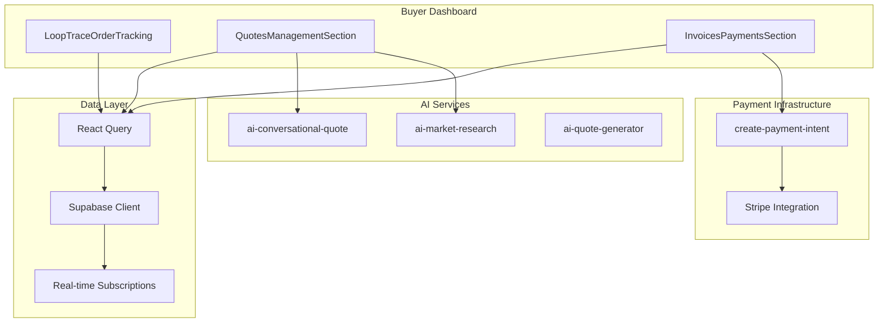
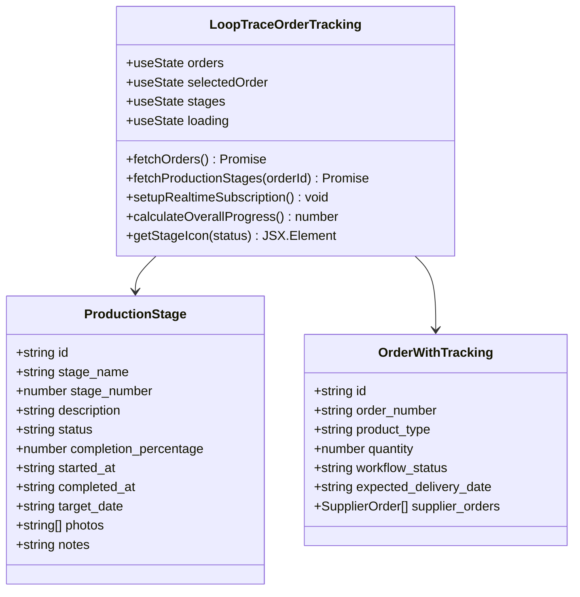
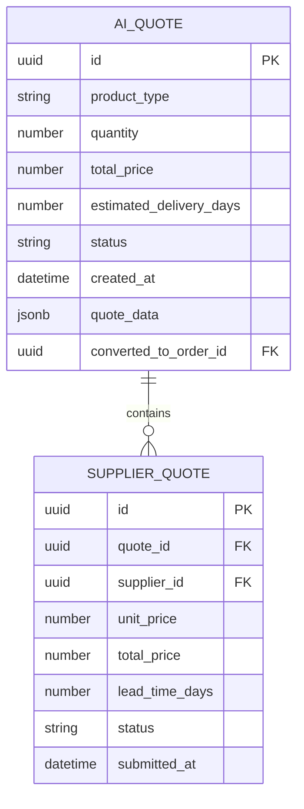
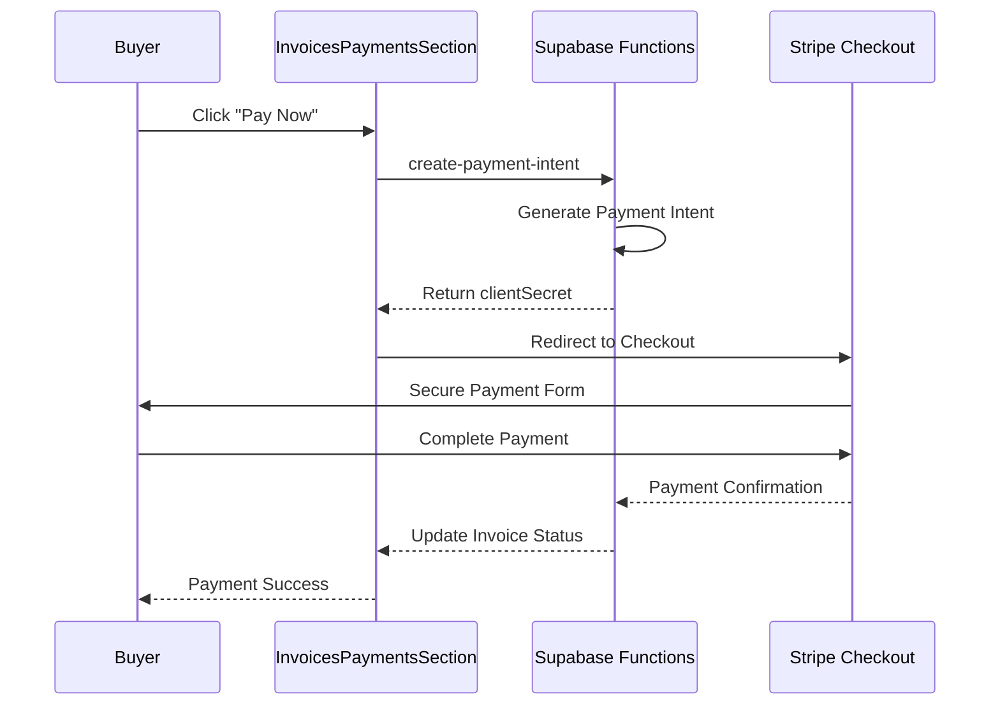
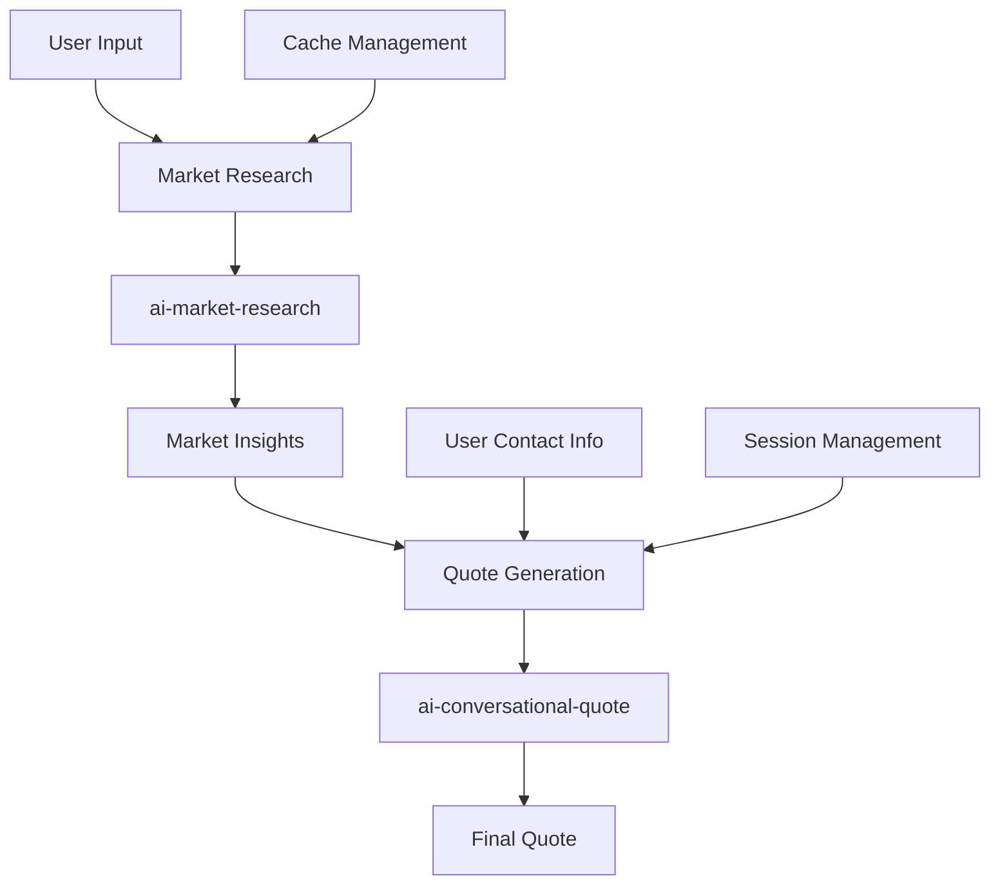
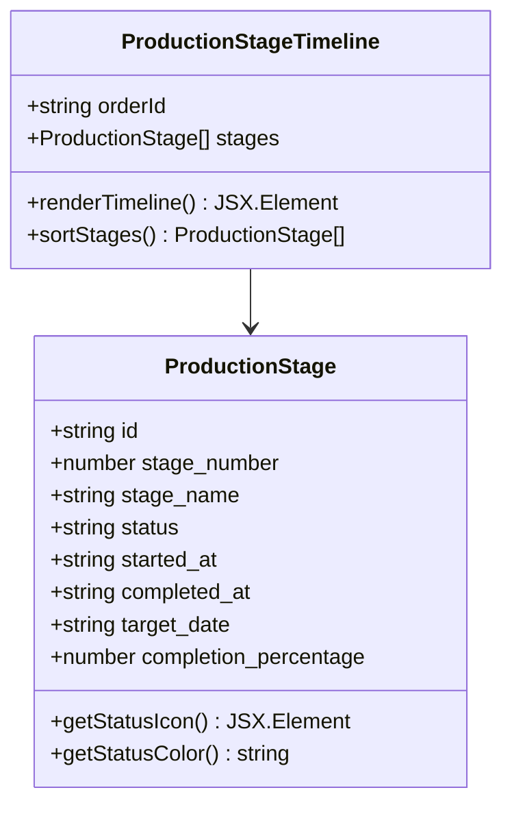
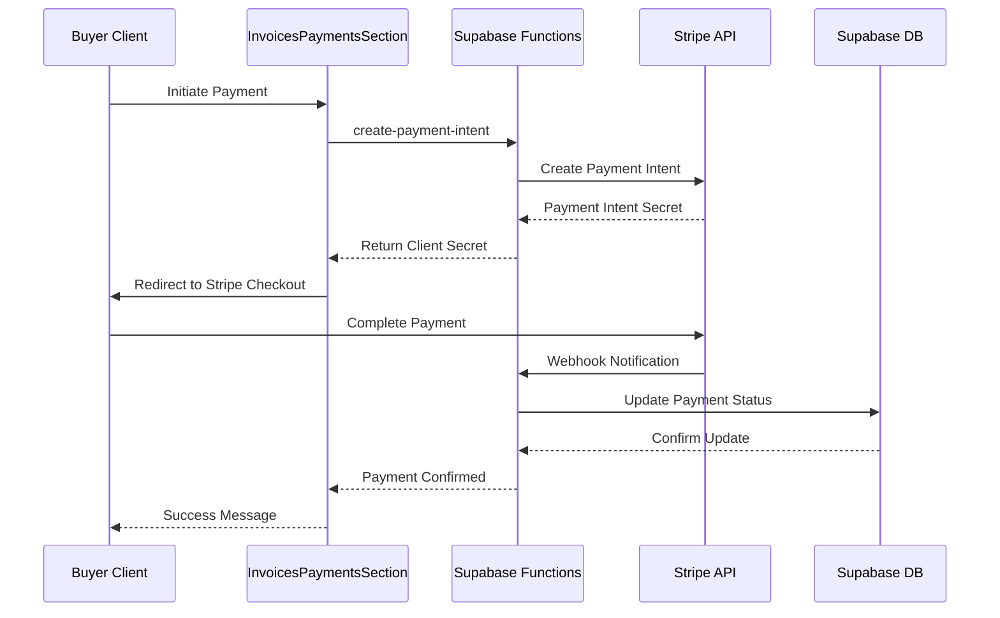

# Buyer Components

<cite>
**Referenced Files in This Document**
- [LoopTraceOrderTracking.tsx](file://src/components/buyer/LoopTraceOrderTracking.tsx)
- [QuotesManagementSection.tsx](file://src/components/buyer/QuotesManagementSection.tsx)
- [InvoicesPaymentsSection.tsx](file://src/components/buyer/InvoicesPaymentsSection.tsx)
- [ConversationalQuoteBuilder.tsx](file://src/components/quote/ConversationalQuoteBuilder.tsx)
- [ProductionStageTimeline.tsx](file://src/components/production/ProductionStageTimeline.tsx)
- [useOrders.ts](file://src/hooks/queries/useOrders.ts)
- [useQuotes.ts](file://src/hooks/useQuotes.ts)
- [usePayment.ts](file://src/hooks/usePayment.ts)
- [supabase/client.ts](file://src/integrations/supabase/client.ts)
- [supabaseHelpers.ts](file://src/lib/supabaseHelpers.ts)
</cite>

## Table of Contents
1. [Introduction](#introduction)
2. [Architecture Overview](#architecture-overview)
3. [Core Buyer Components](#core-buyer-components)
4. [Real-Time Data Management](#real-time-data-management)
5. [AI-Powered Quote Generation](#ai-powered-quote-generation)
6. [Production Monitoring](#production-monitoring)
7. [Financial Transactions](#financial-transactions)
8. [State Management Patterns](#state-management-patterns)
9. [Error Handling Strategies](#error-handling-strategies)
10. [Responsive Design Considerations](#responsive-design-considerations)
11. [Accessibility Compliance](#accessibility-compliance)
12. [Performance Optimization](#performance-optimization)

## Introduction

The sleekapp-v100 buyer-facing components provide a comprehensive suite of tools for managing the complete procurement lifecycle. These components leverage React Query hooks for efficient data fetching and caching, Supabase for real-time database operations, and AI-powered backend functions to deliver intelligent, automated solutions for buyers in the apparel manufacturing ecosystem.

The buyer dashboard encompasses three primary functional areas: real-time production monitoring through LoopTraceOrderTracking, comprehensive quote lifecycle management via QuotesManagementSection, and seamless financial transaction handling through InvoicesPaymentsSection. Together, these components create a unified platform that streamlines the buying process while providing deep visibility into production workflows and financial obligations.

## Architecture Overview

The buyer components follow a modular architecture pattern built on React Query for state management and Supabase for data persistence. The system employs real-time subscriptions for live updates and implements sophisticated caching strategies to optimize performance.



**Diagram sources**
- [LoopTraceOrderTracking.tsx](file://src/components/buyer/LoopTraceOrderTracking.tsx#L1-L50)
- [QuotesManagementSection.tsx](file://src/components/buyer/QuotesManagementSection.tsx#L1-L50)
- [InvoicesPaymentsSection.tsx](file://src/components/buyer/InvoicesPaymentsSection.tsx#L1-L50)

## Core Buyer Components

### LoopTraceOrderTracking.tsx - Real-Time Production Monitoring

The LoopTraceOrderTracking component serves as the central hub for monitoring production progress across the supply chain. It provides comprehensive visibility into order status, production stages, and delivery timelines through an intuitive timeline interface.

#### Key Features

- **Multi-Order Management**: View and switch between multiple active orders
- **Production Stage Tracking**: Real-time visualization of each production phase
- **Progress Calculation**: Automatic calculation of overall completion percentage
- **Real-Time Updates**: Live notifications for production stage changes
- **Supplier Information**: Display associated supplier details and contact information

#### Component Architecture



**Diagram sources**
- [LoopTraceOrderTracking.tsx](file://src/components/buyer/LoopTraceOrderTracking.tsx#L11-L40)

#### Real-Time Subscription Implementation

The component establishes real-time subscriptions to production stages using Supabase's PostgreSQL change notifications:

```typescript
// Real-time subscription setup for production stages
const setupRealtimeSubscription = async () => {
  const supplierOrderId = await getSupplierOrderId();
  if (!supplierOrderId) return;

  const channel = supabase
    .channel('production-stages-changes')
    .on(
      'postgres_changes',
      {
        event: '*', // Listen to INSERT, UPDATE, DELETE
        schema: 'public',
        table: 'production_stages',
        filter: `supplier_order_id=eq.${supplierOrderId}`
      },
      (payload) => {
        // Handle real-time updates
        fetchProductionStages(selectedOrder);
      }
    )
    .subscribe();
};
```

**Section sources**
- [LoopTraceOrderTracking.tsx](file://src/components/buyer/LoopTraceOrderTracking.tsx#L58-L119)

### QuotesManagementSection.tsx - Quote Lifecycle Management

The QuotesManagementSection component manages the complete lifecycle of AI-generated quotes, from initial creation through conversion to orders. It provides filtering capabilities, status tracking, and seamless conversion workflows.

#### Quote Management Features

- **Status-Based Filtering**: Filter quotes by draft, approved, rejected, or converted status
- **Quote Details Display**: Comprehensive information including pricing, delivery estimates, and product specifications
- **Conversion Workflow**: Direct conversion of approved quotes to orders
- **PDF Downloads**: Export quotes as downloadable PDF documents
- **Status Indicators**: Visual status badges and progress indicators

#### Quote Data Model



**Diagram sources**
- [QuotesManagementSection.tsx](file://src/components/buyer/QuotesManagementSection.tsx#L10-L20)
- [useQuotes.ts](file://src/hooks/useQuotes.ts#L5-L35)

**Section sources**
- [QuotesManagementSection.tsx](file://src/components/buyer/QuotesManagementSection.tsx#L1-L191)

### InvoicesPaymentsSection.tsx - Financial Transaction Management

The InvoicesPaymentsSection component handles all financial aspects of the buyer experience, including invoice management, payment processing, and payment history tracking.

#### Financial Management Capabilities

- **Invoice Tracking**: View all invoices linked to active orders
- **Payment Status Monitoring**: Real-time payment status updates
- **Multiple Payment Types**: Support for deposit, balance, and full payment scenarios
- **Payment History**: Comprehensive record of all payment transactions
- **Secure Payment Processing**: Integration with Stripe for secure online payments

#### Payment Processing Workflow



**Diagram sources**
- [InvoicesPaymentsSection.tsx](file://src/components/buyer/InvoicesPaymentsSection.tsx#L101-L120)
- [usePayment.ts](file://src/hooks/usePayment.ts#L9-L34)

**Section sources**
- [InvoicesPaymentsSection.tsx](file://src/components/buyer/InvoicesPaymentsSection.tsx#L1-L280)

## Real-Time Data Management

### React Query Integration

The buyer components leverage React Query for sophisticated data management, implementing caching strategies, optimistic updates, and automatic refetching mechanisms.

#### Query Configuration Patterns

```typescript
// Order management with React Query
export function useOrdersByBuyer(buyerId: string) {
  return useQuery({
    queryKey: orderKeys.byBuyer(buyerId),
    queryFn: async () => {
      const { data, error } = await orderHelpers.getByBuyerId(buyerId);
      if (error) throw error;
      return data;
    },
    enabled: !!buyerId,
  });
}

// Optimistic updates for order status
export function useUpdateOrderStatus() {
  const queryClient = useQueryClient();

  return useMutation({
    mutationFn: async ({ orderId, status, notes }: UpdateParams) => {
      const { data, error } = await orderHelpers.updateStatus(orderId, status, notes);
      if (error) throw error;
      return data;
    },
    onMutate: async ({ orderId, status }) => {
      // Optimistic update
      const previousOrder = queryClient.getQueryData<Order>(orderKeys.detail(orderId));
      queryClient.setQueryData<Order>(orderKeys.detail(orderId), {
        ...previousOrder!,
        status,
        updated_at: new Date().toISOString(),
      });
      return { previousOrder };
    },
  });
}
```

**Section sources**
- [useOrders.ts](file://src/hooks/queries/useOrders.ts#L43-L152)

### Supabase Real-Time Subscriptions

The components utilize Supabase's real-time capabilities to provide instant updates without polling:

#### Subscription Implementation Patterns

```typescript
// Production stage real-time updates
const setupRealtimeSubscription = async () => {
  const channel = supabase
    .channel('production-stages-changes')
    .on('postgres_changes', {
      event: '*',
      schema: 'public',
      table: 'production_stages',
      filter: `supplier_order_id=eq.${supplierOrderId}`
    }, (payload) => {
      // Handle real-time updates
      fetchProductionStages(selectedOrder);
    })
    .subscribe();
};
```

**Section sources**
- [LoopTraceOrderTracking.tsx](file://src/components/buyer/LoopTraceOrderTracking.tsx#L58-L119)

## AI-Powered Quote Generation

### ConversationalQuoteBuilder.tsx Integration

The ConversationalQuoteBuilder component integrates with AI-powered backend functions to provide intelligent quote generation capabilities. It combines market research with conversational AI to deliver accurate, competitive pricing.

#### AI Function Integration



**Diagram sources**
- [ConversationalQuoteBuilder.tsx](file://src/components/quote/ConversationalQuoteBuilder.tsx#L65-L142)

#### Market Research Process

The market research functionality leverages the `ai-market-research` function to gather competitive pricing data:

```typescript
const handleMarketResearch = async () => {
  const { data, error } = await supabase.functions.invoke('ai-market-research', {
    body: {
      productType,
      quantity: parseInt(quantity),
      fabricType: fabricType || undefined,
      complexity: complexity || undefined,
      additionalRequirements: additionalRequirements || undefined,
    },
  });

  if (data.success) {
    setMarketResearch(data.research);
    setMarketResearchId(data.cache_id);
    setStep(2);
  }
};
```

#### Quote Generation Process

The quote generation utilizes the `ai-conversational-quote` function for intelligent pricing:

```typescript
const handleGenerateQuote = async () => {
  const { data, error } = await supabase.functions.invoke('ai-conversational-quote', {
    body: {
      productType,
      quantity: parseInt(quantity),
      customerEmail,
      customerName: customerName || undefined,
      marketResearchId,
      sessionId,
    },
  });

  if (data.success) {
    setQuote(data.quote);
    setStep(3);
  }
};
```

**Section sources**
- [ConversationalQuoteBuilder.tsx](file://src/components/quote/ConversationalQuoteBuilder.tsx#L65-L163)

## Production Monitoring

### ProductionStageTimeline.tsx Visualization

The ProductionStageTimeline component provides a comprehensive visualization of production workflows using a timeline interface that displays each stage with progress indicators and status updates.

#### Timeline Visualization Features

- **Stage Progress Bars**: Visual representation of completion percentages
- **Status Indicators**: Color-coded icons for stage status (pending, in progress, completed, delayed)
- **Date Tracking**: Display of start dates, completion dates, and target dates
- **Interactive Elements**: Clickable stages with detailed information
- **Responsive Design**: Adaptive layout for different screen sizes

#### Production Stage Data Model



**Diagram sources**
- [ProductionStageTimeline.tsx](file://src/components/production/ProductionStageTimeline.tsx#L6-L20)

**Section sources**
- [ProductionStageTimeline.tsx](file://src/components/production/ProductionStageTimeline.tsx#L1-L147)

## Financial Transactions

### Payment Processing Integration

The payment system integrates seamlessly with Stripe through Supabase functions, providing secure, PCI-compliant payment processing with comprehensive transaction tracking.

#### Payment Flow Architecture



**Diagram sources**
- [InvoicesPaymentsSection.tsx](file://src/components/buyer/InvoicesPaymentsSection.tsx#L101-L120)
- [usePayment.ts](file://src/hooks/usePayment.ts#L9-L34)

#### Invoice Management Features

- **Automated Invoice Generation**: Invoices created automatically upon order completion
- **Payment Type Flexibility**: Support for partial payments, deposits, and full payment scenarios
- **Due Date Tracking**: Automatic calculation and display of payment due dates
- **PDF Generation**: Downloadable invoice PDFs with professional formatting
- **Payment History**: Comprehensive record of all payment transactions with status tracking

**Section sources**
- [InvoicesPaymentsSection.tsx](file://src/components/buyer/InvoicesPaymentsSection.tsx#L28-L280)
- [usePayment.ts](file://src/hooks/usePayment.ts#L1-L68)

## State Management Patterns

### React Query State Patterns

The buyer components implement sophisticated state management patterns using React Query's caching and synchronization capabilities:

#### Optimistic Updates Pattern

```typescript
// Optimistic update implementation
export function useUpdateOrderStatus() {
  const queryClient = useQueryClient();

  return useMutation({
    mutationFn: async ({ orderId, status, notes }: UpdateParams) => {
      const { data, error } = await orderHelpers.updateStatus(orderId, status, notes);
      if (error) throw error;
      return data;
    },
    onMutate: async ({ orderId, status }) => {
      // Cancel outgoing refetches
      await queryClient.cancelQueries({ queryKey: orderKeys.detail(orderId) });

      // Snapshot previous value
      const previousOrder = queryClient.getQueryData<Order>(orderKeys.detail(orderId));

      // Optimistically update
      queryClient.setQueryData<Order>(orderKeys.detail(orderId), {
        ...previousOrder!,
        status,
        updated_at: new Date().toISOString(),
      });

      return { previousOrder };
    },
    onError: (error, variables, context) => {
      // Rollback on error
      if (context?.previousOrder) {
        queryClient.setQueryData(orderKeys.detail(variables.orderId), context.previousOrder);
      }
    },
  });
}
```

#### Query Key Management

The components use structured query keys for efficient caching and invalidation:

```typescript
export const orderKeys = {
  all: ['orders'] as const,
  lists: () => [...orderKeys.all, 'list'] as const,
  details: () => [...orderKeys.all, 'detail'] as const,
  detail: (id: string) => [...orderKeys.details(), id] as const,
  byBuyer: (buyerId: string) => [...orderKeys.lists(), 'buyer', buyerId] as const,
};
```

**Section sources**
- [useOrders.ts](file://src/hooks/queries/useOrders.ts#L110-L152)

## Error Handling Strategies

### Comprehensive Error Management

The buyer components implement multi-layered error handling strategies to ensure robust user experiences:

#### Component-Level Error Boundaries

```typescript
// Loading state management
if (loading) {
  return (
    <div className="flex items-center justify-center py-12">
      <Loader2 className="h-8 w-8 animate-spin text-primary" />
    </div>
  );
}

// Error state handling
try {
  const { data, error } = await supabase.functions.invoke('ai-conversational-quote', {
    body: { /* quote data */ },
  });
  
  if (error) throw error;
  // Handle successful response
} catch (error: any) {
  toast({
    variant: "destructive",
    title: "Quote Generation Failed",
    description: error.message || "Unable to generate quote",
  });
}
```

#### Toast Notification System

The components utilize a centralized toast notification system for user feedback:

```typescript
// Error notification pattern
toast({
  variant: "destructive",
  title: "Error",
  description: error.message,
});

// Success notification pattern
toast({
  title: "Success",
  description: "Operation completed successfully",
});
```

#### Graceful Degradation

Components implement graceful degradation for network failures and service unavailability:

```typescript
// Network failure handling
const fetchOrders = async () => {
  try {
    setLoading(true);
    const { data, error } = await orderHelpers.getByBuyerId(buyerId);
    if (error) throw error;
    setOrders(data || []);
  } catch (error: any) {
    toast({
      variant: "destructive",
      title: "Network Error",
      description: "Unable to load orders. Please check your connection.",
    });
  } finally {
    setLoading(false);
  }
};
```

**Section sources**
- [LoopTraceOrderTracking.tsx](file://src/components/buyer/LoopTraceOrderTracking.tsx#L180-L189)
- [ConversationalQuoteBuilder.tsx](file://src/components/quote/ConversationalQuoteBuilder.tsx#L153-L160)

## Responsive Design Considerations

### Mobile-First Design Approach

The buyer components implement a mobile-first responsive design strategy that ensures optimal user experiences across all device types:

#### Breakpoint Strategy

```typescript
// Grid layout adaptation
<div className="grid lg:grid-cols-3 gap-6">
  {/* Order List - Full width on mobile */}
  <div className="lg:col-span-1">
    {/* Order selection interface */}
  </div>
  
  {/* Production Stages - Takes remaining space */}
  <div className="lg:col-span-2">
    {/* Production timeline and details */}
  </div>
</div>
```

#### Touch-Friendly Interactions

- **Large Tap Targets**: Buttons and interactive elements meet minimum touch target sizes
- **Gesture Support**: Swipe gestures for navigation and quick actions
- **Responsive Typography**: Scalable text that adapts to screen sizes
- **Flexible Layouts**: Adaptive grid systems that reflow content appropriately

#### Accessibility Features

```typescript
// Keyboard navigation support
<button
  onClick={() => setSelectedOrder(order.id)}
  className={`w-full text-left p-3 rounded-lg transition-colors ${
    selectedOrder === order.id
      ? 'bg-primary text-primary-foreground'
      : 'bg-secondary hover:bg-secondary/80'
  }`}
  aria-selected={selectedOrder === order.id}
>
  <div className="font-semibold">#{order.order_number}</div>
</button>
```

## Accessibility Compliance

### WCAG 2.1 AA Compliance

The buyer components implement comprehensive accessibility features to ensure compliance with WCAG 2.1 AA standards:

#### Semantic HTML Structure

```typescript
// Proper heading hierarchy
<h2 className="text-2xl font-bold">LoopTrace™ Order Tracking</h2>
<p className="text-muted-foreground">Real-time production tracking with AI-powered insights</p>

// Accessible form controls
<Input
  id="productType"
  placeholder="e.g., T-shirts, Hoodies, Uniforms"
  value={productType}
  onChange={(e) => setProductType(e.target.value)}
  aria-required="true"
/>
```

#### Screen Reader Support

- **ARIA Labels**: Descriptive labels for complex interactive elements
- **Live Regions**: Dynamic content updates announced to screen readers
- **Focus Management**: Logical tab order and focus indicators
- **Alternative Text**: Descriptive alt text for all images and graphics

#### Keyboard Navigation

```typescript
// Keyboard-accessible modal
const handleKeyDown = (event: KeyboardEvent) => {
  if (event.key === 'Escape') {
    onClose();
  }
};

useEffect(() => {
  document.addEventListener('keydown', handleKeyDown);
  return () => document.removeEventListener('keydown', handleKeyDown);
}, []);
```

## Performance Optimization

### Caching Strategies

The buyer components implement sophisticated caching strategies to minimize network requests and improve user experience:

#### Query Caching Patterns

```typescript
// Intelligent caching with React Query
export function useOrdersByBuyer(buyerId: string) {
  return useQuery({
    queryKey: orderKeys.byBuyer(buyerId),
    queryFn: async () => {
      const { data, error } = await orderHelpers.getByBuyerId(buyerId);
      if (error) throw error;
      return data;
    },
    staleTime: 5 * 60 * 1000, // 5 minutes
    gcTime: 10 * 60 * 1000, // 10 minutes garbage collection
  });
}
```

#### Memoization Techniques

```typescript
// React.memo for expensive components
const ProductionStageTimeline = memo(({ stages }: Props) => {
  const sortedStages = useMemo(() => 
    [...stages].sort((a, b) => a.stage_number - b.stage_number),
    [stages]
  );
  
  return (
    <div className="space-y-6">
      {sortedStages.map((stage) => (
        // Render stage components
      ))}
    </div>
  );
});
```

#### Lazy Loading Implementation

```typescript
// Dynamic imports for heavy components
const HeavyComponent = lazy(() => import('./HeavyComponent'));

// Suspense boundary for loading states
<Suspense fallback={<LoadingSpinner />}>
  <HeavyComponent />
</Suspense>
```

### Real-Time Performance

#### Subscription Management

```typescript
// Efficient subscription cleanup
useEffect(() => {
  const channel = supabase
    .channel('production-updates')
    .on('postgres_changes', filter, callback)
    .subscribe();

  return () => {
    supabase.removeChannel(channel);
  };
}, [filter]);
```

#### Debounced Updates

```typescript
// Debounced real-time updates
const debouncedCallback = useCallback(
  debounce((payload) => {
    // Handle update
  }, 300),
  []
);
```

**Section sources**
- [useOrders.ts](file://src/hooks/queries/useOrders.ts#L43-L52)
- [LoopTraceOrderTracking.tsx](file://src/components/buyer/LoopTraceOrderTracking.tsx#L112-L116)