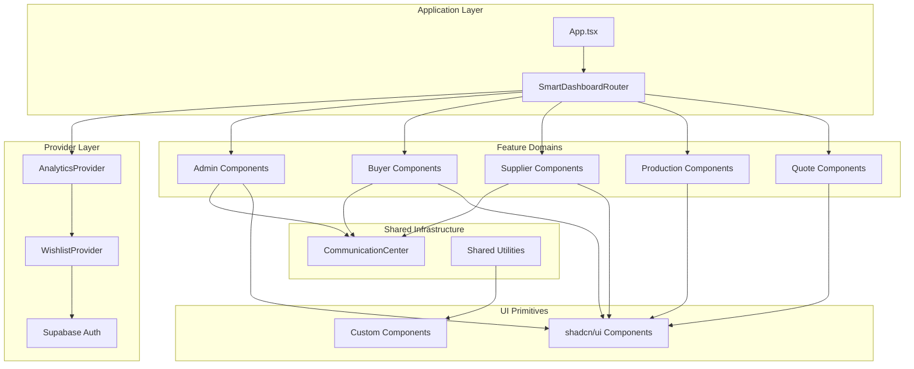
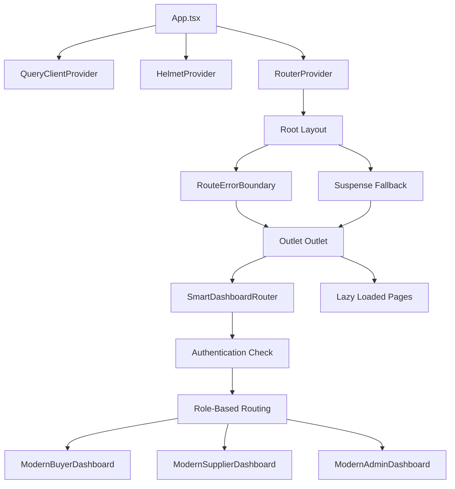
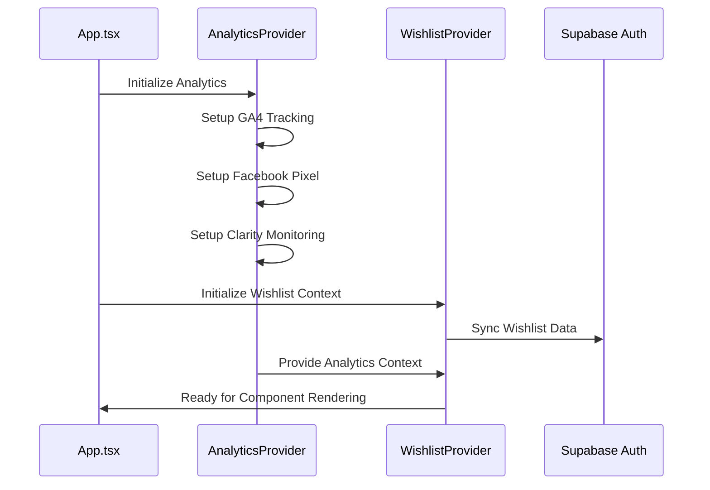
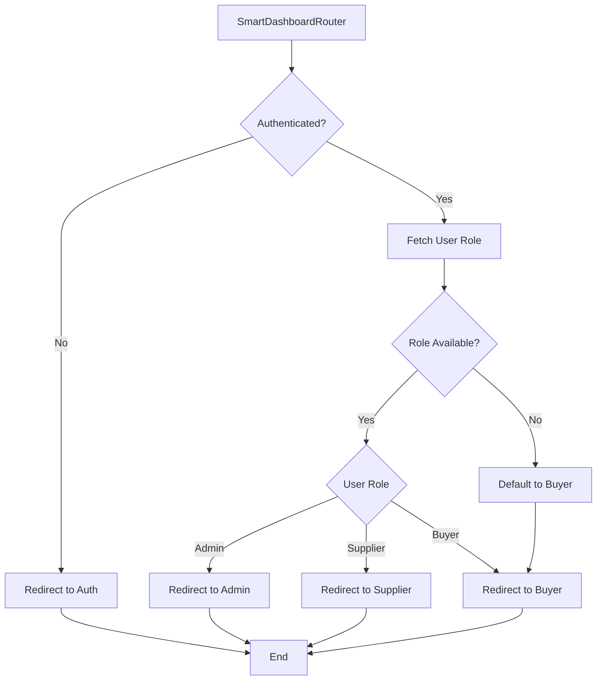
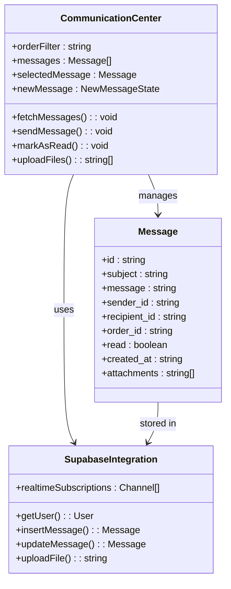
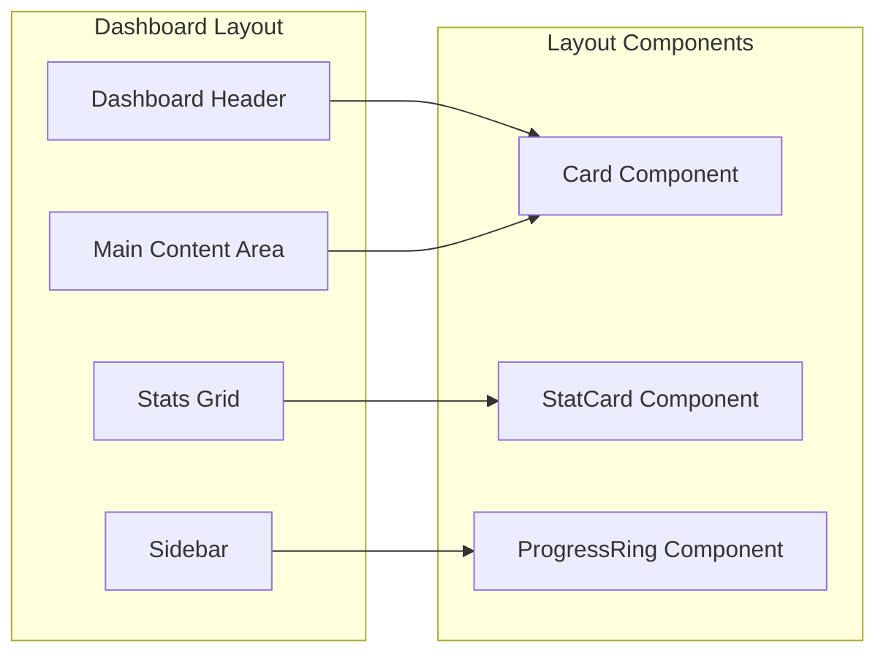
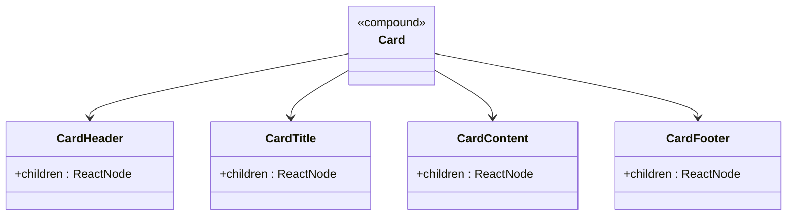
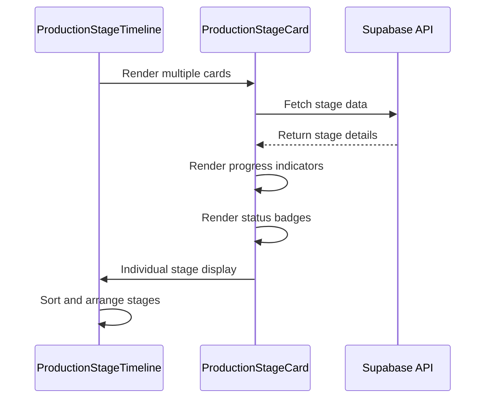
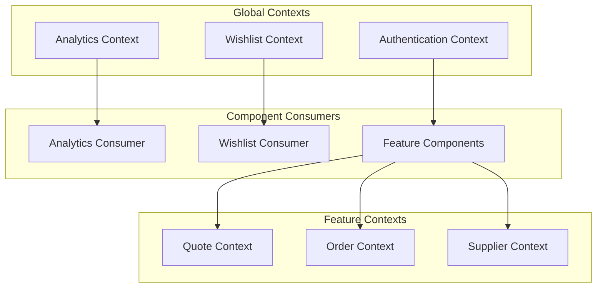

# Component Architecture

<cite>
**Referenced Files in This Document**
- [App.tsx](file://src/App.tsx)
- [SmartDashboardRouter.tsx](file://src/components/SmartDashboardRouter.tsx)
- [CommunicationCenter.tsx](file://src/components/shared/CommunicationCenter.tsx)
- [ProductionStageTimeline.tsx](file://src/components/production/ProductionStageTimeline.tsx)
- [ProductionStageCard.tsx](file://src/components/production/ProductionStageCard.tsx)
- [ModernBuyerDashboard.tsx](file://src/pages/ModernBuyerDashboard.tsx)
- [ModernSupplierDashboard.tsx](file://src/pages/ModernSupplierDashboard.tsx)
- [WishlistContext.tsx](file://src/contexts/WishlistContext.tsx)
- [AnalyticsProvider.tsx](file://src/components/AnalyticsProvider.tsx)
- [card.tsx](file://src/components/ui/card.tsx)
- [button.tsx](file://src/components/ui/button.tsx)
- [ConversationalQuoteBuilder.tsx](file://src/components/quote/ConversationalQuoteBuilder.tsx)
- [DashboardAnalytics.tsx](file://src/components/admin/DashboardAnalytics.tsx)
</cite>

## Table of Contents
1. [Introduction](#introduction)
2. [Component Architecture Overview](#component-architecture-overview)
3. [Hierarchical Component Structure](#hierarchical-component-structure)
4. [Feature-Domain Organization](#feature-domain-organization)
5. [Higher-Order Components](#higher-order-components)
6. [Shared Components and Cross-Functional Communication](#shared-components-and-cross-functional-communication)
7. [Component Composition Patterns](#component-composition-patterns)
8. [State Management and Context Patterns](#state-management-and-context-patterns)
9. [Best Practices and Design Patterns](#best-practices-and-design-patterns)
10. [Creating New Components](#creating-new-components)
11. [Performance Considerations](#performance-considerations)
12. [Troubleshooting Guide](#troubleshooting-guide)

## Introduction

The sleekapp-v100 component architecture follows a sophisticated React-based design pattern that emphasizes modularity, reusability, and scalability. Built with TypeScript and utilizing shadcn/ui design system, the architecture demonstrates advanced component composition techniques, role-based rendering, and cross-functional communication patterns.

The application serves multiple user personas (buyers, suppliers, admins) through a unified component system that adapts functionality based on user roles while maintaining consistent design language and interaction patterns.

## Component Architecture Overview

The component architecture is structured around several key principles:

### Design System Foundation
The application leverages shadcn/ui as its foundational design system, providing consistent typography, spacing, and component variants. This ensures visual coherence across all feature domains.

### Role-Based Adaptation
Components adapt their functionality and appearance based on user roles through the SmartDashboardRouter system, which dynamically routes users to appropriate dashboards and controls component visibility.

### Modular Feature Organization
Features are organized into distinct domain folders (admin, buyer, supplier, production, quote) with clear separation of concerns and reusable component patterns.



**Diagram sources**
- [App.tsx](file://src/App.tsx#L1-L344)
- [SmartDashboardRouter.tsx](file://src/components/SmartDashboardRouter.tsx#L1-L139)
- [AnalyticsProvider.tsx](file://src/components/AnalyticsProvider.tsx#L1-L256)

## Hierarchical Component Structure

The component hierarchy follows a clear parent-child relationship pattern with specialized routing and provider systems.

### Application Root Structure

The main application entry point establishes the global context providers and routing infrastructure:



**Diagram sources**
- [App.tsx](file://src/App.tsx#L299-L344)
- [SmartDashboardRouter.tsx](file://src/components/SmartDashboardRouter.tsx#L11-L139)

### Provider Chain Architecture

The provider chain establishes global state management and analytics tracking:



**Diagram sources**
- [App.tsx](file://src/App.tsx#L300-L339)
- [AnalyticsProvider.tsx](file://src/components/AnalyticsProvider.tsx#L16-L256)
- [WishlistContext.tsx](file://src/contexts/WishlistContext.tsx#L17-L34)

**Section sources**
- [App.tsx](file://src/App.tsx#L1-L344)
- [AnalyticsProvider.tsx](file://src/components/AnalyticsProvider.tsx#L1-L256)
- [WishlistContext.tsx](file://src/contexts/WishlistContext.tsx#L1-L34)

## Feature-Domain Organization

The component architecture organizes features into distinct domains, each with specialized components and patterns.

### Domain Structure

| Domain | Purpose | Key Components |
|--------|---------|----------------|
| **Admin** | Administrative oversight and management | DashboardAnalytics, OrderManagement, SupplierVerification |
| **Buyer** | Buyer order tracking and quote management | OrdersList, QuoteHistory, OrderTracking |
| **Supplier** | Supplier production management and performance | ProductionManagement, SupplierOrders, PerformanceMetrics |
| **Production** | Production stage tracking and coordination | ProductionStageTimeline, ProductionStageCard |
| **Quote** | Quote generation and management | ConversationalQuoteBuilder, InteractiveQuoteDisplay |

### Component Naming Conventions

The architecture follows consistent naming patterns:

- **Domain-specific components**: `{Domain}{ComponentName}.tsx` (e.g., `AdminDashboardAnalytics.tsx`)
- **Feature-specific components**: `{Feature}{ComponentName}.tsx` (e.g., `ProductionStageCard.tsx`)
- **Utility components**: `{ComponentName}.tsx` (e.g., `CommunicationCenter.tsx`)
- **Compound components**: `{Parent}{Child}.tsx` (e.g., `CardHeader.tsx`, `CardTitle.tsx`)

**Section sources**
- [ModernBuyerDashboard.tsx](file://src/pages/ModernBuyerDashboard.tsx#L1-L584)
- [ModernSupplierDashboard.tsx](file://src/pages/ModernSupplierDashboard.tsx#L1-L669)
- [DashboardAnalytics.tsx](file://src/components/admin/DashboardAnalytics.tsx#L1-L200)

## Higher-Order Components

### SmartDashboardRouter

The SmartDashboardRouter serves as the primary higher-order component for role-based rendering and authentication management.



**Diagram sources**
- [SmartDashboardRouter.tsx](file://src/components/SmartDashboardRouter.tsx#L11-L139)

### Authentication and Role Management

The router implements sophisticated authentication and role detection:

- **Session Validation**: Verifies active sessions through Supabase authentication
- **Role Resolution**: Fetches user roles from the database with retry logic
- **Fallback Mechanisms**: Provides timeout handling and error recovery
- **Security**: Prevents unauthorized access through multiple validation layers

**Section sources**
- [SmartDashboardRouter.tsx](file://src/components/SmartDashboardRouter.tsx#L1-L139)

## Shared Components and Cross-Functional Communication

### CommunicationCenter

The CommunicationCenter exemplifies cross-functional communication patterns, enabling seamless interaction between buyers, suppliers, and administrators.



**Diagram sources**
- [CommunicationCenter.tsx](file://src/components/shared/CommunicationCenter.tsx#L12-L27)

### Real-Time Communication Features

The CommunicationCenter implements several advanced patterns:

- **Real-time Subscriptions**: Uses Supabase realtime capabilities for live message updates
- **File Upload Integration**: Supports multiple file types with cloud storage
- **Order-Specific Filtering**: Enables targeted communication within order contexts
- **Read Status Tracking**: Maintains message read/unread states across sessions

**Section sources**
- [CommunicationCenter.tsx](file://src/components/shared/CommunicationCenter.tsx#L1-L451)

## Component Composition Patterns

### Children Prop Pattern

The application extensively uses React's children prop for flexible layout composition, particularly evident in the dashboard layouts.



**Diagram sources**
- [ModernBuyerDashboard.tsx](file://src/pages/ModernBuyerDashboard.tsx#L366-L578)
- [ModernSupplierDashboard.tsx](file://src/pages/ModernSupplierDashboard.tsx#L461-L661)

### Compound Component Pattern

The shadcn/ui components demonstrate the compound component pattern, where related components work together to form cohesive UI elements.



**Diagram sources**
- [card.tsx](file://src/components/ui/card.tsx#L5-L43)

### Production Stage Composition

The production system demonstrates sophisticated composition patterns through timeline and card components:



**Diagram sources**
- [ProductionStageTimeline.tsx](file://src/components/production/ProductionStageTimeline.tsx#L22-L147)
- [ProductionStageCard.tsx](file://src/components/production/ProductionStageCard.tsx#L50-L357)

**Section sources**
- [ModernBuyerDashboard.tsx](file://src/pages/ModernBuyerDashboard.tsx#L366-L578)
- [ModernSupplierDashboard.tsx](file://src/pages/ModernSupplierDashboard.tsx#L461-L661)
- [card.tsx](file://src/components/ui/card.tsx#L1-L44)
- [ProductionStageTimeline.tsx](file://src/components/production/ProductionStageTimeline.tsx#L1-L147)
- [ProductionStageCard.tsx](file://src/components/production/ProductionStageCard.tsx#L1-L357)

## State Management and Context Patterns

### Context Provider Architecture

The application implements a layered context system for state management:



**Diagram sources**
- [WishlistContext.tsx](file://src/contexts/WishlistContext.tsx#L15-L34)
- [AnalyticsProvider.tsx](file://src/components/AnalyticsProvider.tsx#L16-L256)

### Optimistic Updates Pattern

The application implements optimistic updates for improved user experience, particularly in production stage management:

- **Immediate UI Feedback**: Updates appear instantly while backend operations complete
- **Automatic Rollback**: Failed operations revert to previous state automatically
- **Conflict Resolution**: Handles concurrent updates gracefully

### Event Handling Patterns

The architecture demonstrates sophisticated event handling patterns:

- **Debounced Analytics**: Prevents excessive API calls for user interactions
- **Real-time Subscriptions**: Maintains live data synchronization
- **Error Boundaries**: Provides graceful error handling and recovery

**Section sources**
- [WishlistContext.tsx](file://src/contexts/WishlistContext.tsx#L1-L34)
- [AnalyticsProvider.tsx](file://src/components/AnalyticsProvider.tsx#L1-L256)

## Best Practices and Design Patterns

### Props Drilling Prevention

The architecture minimizes props drilling through several strategies:

1. **Context Providers**: Global state management eliminates deep prop passing
2. **Compound Components**: Related functionality grouped within single components
3. **Hook Abstractions**: Custom hooks encapsulate complex state logic
4. **Provider Chains**: Hierarchical context providers reduce nesting

### State Lifting Strategies

The application employs intelligent state lifting patterns:

- **Local Component State**: For UI-specific state (form inputs, modal visibility)
- **Context State**: For cross-component shared state (user preferences, theme)
- **Server State**: For persistent data managed by React Query
- **Optimistic State**: For immediate UI feedback during async operations

### Event Handling Optimization

Advanced event handling patterns include:

- **Memoization**: Prevents unnecessary re-renders through React.memo and useCallback
- **Debouncing**: Reduces API calls for search and input events
- **Error Boundaries**: Provides graceful error handling without crashing the app
- **Retry Logic**: Implements automatic retry mechanisms for failed operations

**Section sources**
- [ConversationalQuoteBuilder.tsx](file://src/components/quote/ConversationalQuoteBuilder.tsx#L1-L200)
- [DashboardAnalytics.tsx](file://src/components/admin/DashboardAnalytics.tsx#L1-L200)

## Creating New Components

### Component Creation Guidelines

When creating new components in the sleekapp-v100 architecture:

#### 1. Folder Structure and Naming
- Place components in appropriate domain folders
- Use PascalCase naming convention
- Include descriptive file names that indicate purpose

#### 2. Component Structure Template
```typescript
// Example template for new components
import { useState, useEffect } from 'react';
import { Card, CardContent, CardHeader, CardTitle } from '@/components/ui/card';
import { Button } from '@/components/ui/button';
import { useToast } from '@/hooks/use-toast';

interface ComponentProps {
  // Define props interface
}

export const ComponentName = ({ /* props */ }: ComponentProps) => {
  const { toast } = useToast();
  
  // Component logic
  
  return (
    <Card>
      <CardHeader>
        <CardTitle>Component Title</CardTitle>
      </CardHeader>
      <CardContent>
        {/* Component content */}
      </CardContent>
    </Card>
  );
};
```

#### 3. Integration Patterns
- Extend existing design system components when possible
- Implement proper TypeScript interfaces for props
- Include accessibility attributes and ARIA labels
- Follow established naming conventions

#### 4. Testing and Documentation
- Include JSDoc comments for complex functionality
- Implement proper error boundaries where appropriate
- Consider performance implications and memoization needs

### Component Composition Guidelines

#### For Layout Components
- Use the children prop pattern for flexible content insertion
- Implement responsive design principles
- Consider mobile-first approaches

#### For Functional Components
- Leverage React hooks for state management
- Implement proper cleanup in useEffect
- Consider performance optimization with memoization

#### For Compound Components
- Follow shadcn/ui pattern with separate header/title/content/footer components
- Implement proper displayName for debugging
- Consider forwardRef for interactive components

**Section sources**
- [ConversationalQuoteBuilder.tsx](file://src/components/quote/ConversationalQuoteBuilder.tsx#L43-L200)
- [card.tsx](file://src/components/ui/card.tsx#L1-L44)

## Performance Considerations

### Bundle Optimization

The architecture implements several performance optimization strategies:

- **Code Splitting**: Routes and components are lazily loaded
- **Tree Shaking**: Unused code eliminated through proper imports
- **Critical Path Loading**: Essential components load immediately
- **Resource Optimization**: Images and assets optimized for performance

### Rendering Performance

Advanced rendering optimizations include:

- **React.memo**: Prevents unnecessary re-renders for stable components
- **useMemo/useCallback**: Memoizes expensive calculations and function creation
- **Virtual Scrolling**: Handles large lists efficiently
- **Progressive Loading**: Components load progressively based on user interaction

### Memory Management

The application implements careful memory management:

- **Cleanup Functions**: Proper cleanup in useEffect hooks
- **Event Listener Management**: Automatic removal of event listeners
- **Subscription Management**: Real-time subscriptions cleaned up on unmount
- **State Optimization**: Minimal state updates to prevent re-renders

## Troubleshooting Guide

### Common Component Issues

#### Authentication Problems
- **Issue**: Users redirected to auth despite being logged in
- **Solution**: Check Supabase session validity and role resolution
- **Debug**: Verify authentication tokens and user role database entries

#### Context Provider Issues
- **Issue**: Context values not available in child components
- **Solution**: Ensure components are wrapped in appropriate providers
- **Debug**: Verify provider hierarchy and context creation

#### Performance Issues
- **Issue**: Slow component rendering or memory leaks
- **Solution**: Implement proper memoization and cleanup
- **Debug**: Use React DevTools profiler to identify bottlenecks

#### Real-time Communication Failures
- **Issue**: Messages not updating in real-time
- **Solution**: Check Supabase realtime subscriptions and network connectivity
- **Debug**: Verify channel subscriptions and event handlers

### Debugging Strategies

1. **Console Logging**: Strategic logging throughout component lifecycle
2. **React DevTools**: Component tree inspection and state monitoring
3. **Network Tab**: API call monitoring and timing analysis
4. **Performance Profiler**: Identifying rendering bottlenecks
5. **Error Boundaries**: Graceful error handling and reporting

**Section sources**
- [SmartDashboardRouter.tsx](file://src/components/SmartDashboardRouter.tsx#L11-L139)
- [WishlistContext.tsx](file://src/contexts/WishlistContext.tsx#L17-L34)