# Production Components

<cite>
**Referenced Files in This Document**
- [ProductionTracking.tsx](file://src/pages/ProductionTracking.tsx)
- [ProductionStageTimeline.tsx](file://src/components/production/ProductionStageTimeline.tsx)
- [ProductionStageCard.tsx](file://src/components/production/ProductionStageCard.tsx)
- [ProductionAnalytics.tsx](file://src/components/production/ProductionAnalytics.tsx)
- [PredictiveDelayAlert.tsx](file://src/components/production/PredictiveDelayAlert.tsx)
- [QualityRiskAlert.tsx](file://src/components/production/QualityRiskAlert.tsx)
- [ConnectionStatusIndicator.tsx](file://src/components/production/ConnectionStatusIndicator.tsx)
- [SupplierCoordinationPanel.tsx](file://src/components/production/SupplierCoordinationPanel.tsx)
- [useQualityPrediction.ts](file://src/hooks/useQualityPrediction.ts)
- [useOptimisticStageUpdate.ts](file://src/hooks/useOptimisticUpdate.ts)
- [supabase/client.ts](file://src/integrations/supabase/client.ts)
- [database.ts](file://src/types/database.ts)
</cite>

## Table of Contents
1. [Introduction](#introduction)
2. [Architecture Overview](#architecture-overview)
3. [Core Production Components](#core-production-components)
4. [Data Flow and Real-time Updates](#data-flow-and-real-time-updates)
5. [AI-Powered Insights](#ai-powered-insights)
6. [Real-time Monitoring](#real-time-monitoring)
7. [Cross-Factory Communication](#cross-factory-communication)
8. [Error Handling and Network Resilience](#error-handling-and-network-resilience)
9. [Performance Optimization](#performance-optimization)
10. [Integration Patterns](#integration-patterns)
11. [Troubleshooting Guide](#troubleshooting-guide)
12. [Conclusion](#conclusion)

## Introduction

The sleekapp-v100 production tracking system represents a sophisticated implementation of LoopTrace™ Technology, providing real-time visibility into manufacturing processes through a comprehensive suite of interconnected components. This system leverages Supabase for backend services, React for frontend interactivity, and machine learning for predictive analytics to deliver a seamless production tracking experience.

The production tracking ecosystem consists of eight primary components that work together to provide end-to-end visibility, predictive insights, and collaborative communication capabilities. These components integrate seamlessly to offer buyers and suppliers real-time updates, quality predictions, delay warnings, and coordinated communication channels.

## Architecture Overview

The production tracking system follows a modular architecture pattern with clear separation of concerns between presentation, business logic, and data layers.

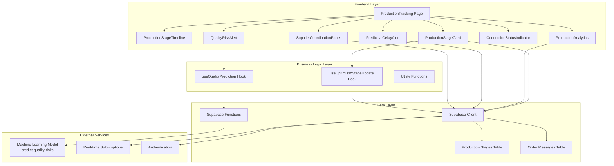

**Diagram sources**
- [ProductionTracking.tsx](file://src/pages/ProductionTracking.tsx#L49-L522)
- [ProductionStageTimeline.tsx](file://src/components/production/ProductionStageTimeline.tsx#L1-L147)
- [ProductionStageCard.tsx](file://src/components/production/ProductionStageCard.tsx#L1-L357)
- [supabase/client.ts](file://src/integrations/supabase/client.ts#L1-L20)

**Section sources**
- [ProductionTracking.tsx](file://src/pages/ProductionTracking.tsx#L1-L522)
- [ProductionStageTimeline.tsx](file://src/components/production/ProductionStageTimeline.tsx#L1-L147)

## Core Production Components

### ProductionStageTimeline.tsx - Central Visualization Hub

The ProductionStageTimeline serves as the primary visualization component for LoopTrace™ Technology, providing a chronological representation of manufacturing stages with interactive elements and status indicators.

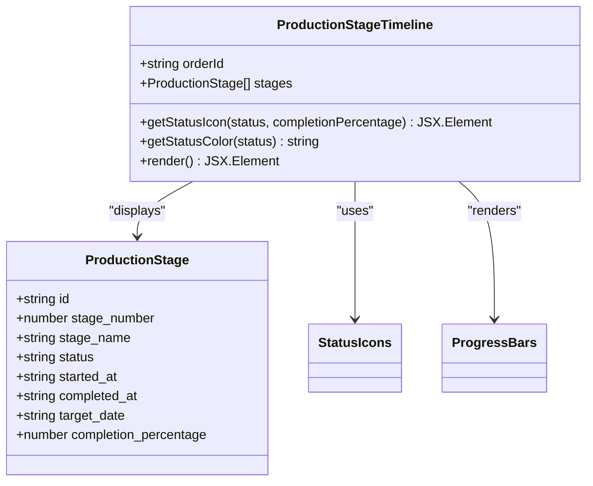

**Diagram sources**
- [ProductionStageTimeline.tsx](file://src/components/production/ProductionStageTimeline.tsx#L6-L15)
- [ProductionStageTimeline.tsx](file://src/components/production/ProductionStageTimeline.tsx#L22-L147)

Key features include:
- **Vertical Timeline Layout**: Chronological progression through manufacturing stages
- **Interactive Status Indicators**: Visual icons representing stage status (completed, in progress, delayed, pending)
- **Progress Visualization**: Animated progress bars with percentage completion
- **Date Tracking**: Comprehensive date information including start, completion, and target dates
- **Responsive Design**: Adaptive layout for various screen sizes

**Section sources**
- [ProductionStageTimeline.tsx](file://src/components/production/ProductionStageTimeline.tsx#L1-L147)

### ProductionStageCard.tsx - Individual Phase Management

Each ProductionStageCard manages individual manufacturing phases with comprehensive CRUD operations and optimistic UI updates.

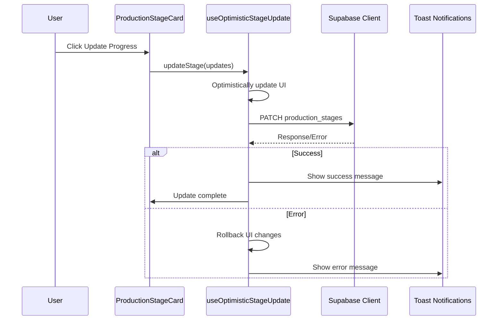

**Diagram sources**
- [ProductionStageCard.tsx](file://src/components/production/ProductionStageCard.tsx#L142-L208)
- [useOptimisticStageUpdate.ts](file://src/hooks/useOptimisticUpdate.ts#L79-L125)

**Section sources**
- [ProductionStageCard.tsx](file://src/components/production/ProductionStageCard.tsx#L1-L357)
- [useOptimisticStageUpdate.ts](file://src/hooks/useOptimisticUpdate.ts#L79-L125)

### ProductionAnalytics.tsx - Performance Metrics Dashboard

The analytics component processes real-time data to generate comprehensive performance metrics and insights.

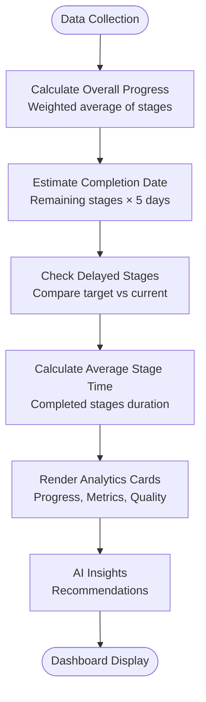

**Diagram sources**
- [ProductionAnalytics.tsx](file://src/components/production/ProductionAnalytics.tsx#L31-L87)
- [ProductionAnalytics.tsx](file://src/components/production/ProductionAnalytics.tsx#L89-L249)

**Section sources**
- [ProductionAnalytics.tsx](file://src/components/production/ProductionAnalytics.tsx#L1-L249)

## Data Flow and Real-time Updates

The production tracking system implements sophisticated real-time data synchronization using Supabase's PostgreSQL change data capture (CDC) capabilities.

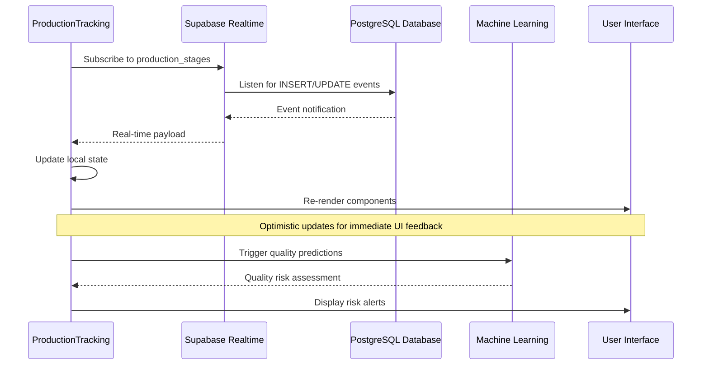

**Diagram sources**
- [ProductionTracking.tsx](file://src/pages/ProductionTracking.tsx#L63-L88)
- [ProductionStageCard.tsx](file://src/components/production/ProductionStageCard.tsx#L57-L69)

**Section sources**
- [ProductionTracking.tsx](file://src/pages/ProductionTracking.tsx#L63-L88)
- [ProductionStageCard.tsx](file://src/components/production/ProductionStageCard.tsx#L57-L69)

## AI-Powered Insights

### PredictiveDelayAlert.tsx - Machine Learning Predictions

The predictive delay alert system uses heuristic algorithms to forecast potential production delays based on current progress and timeline data.

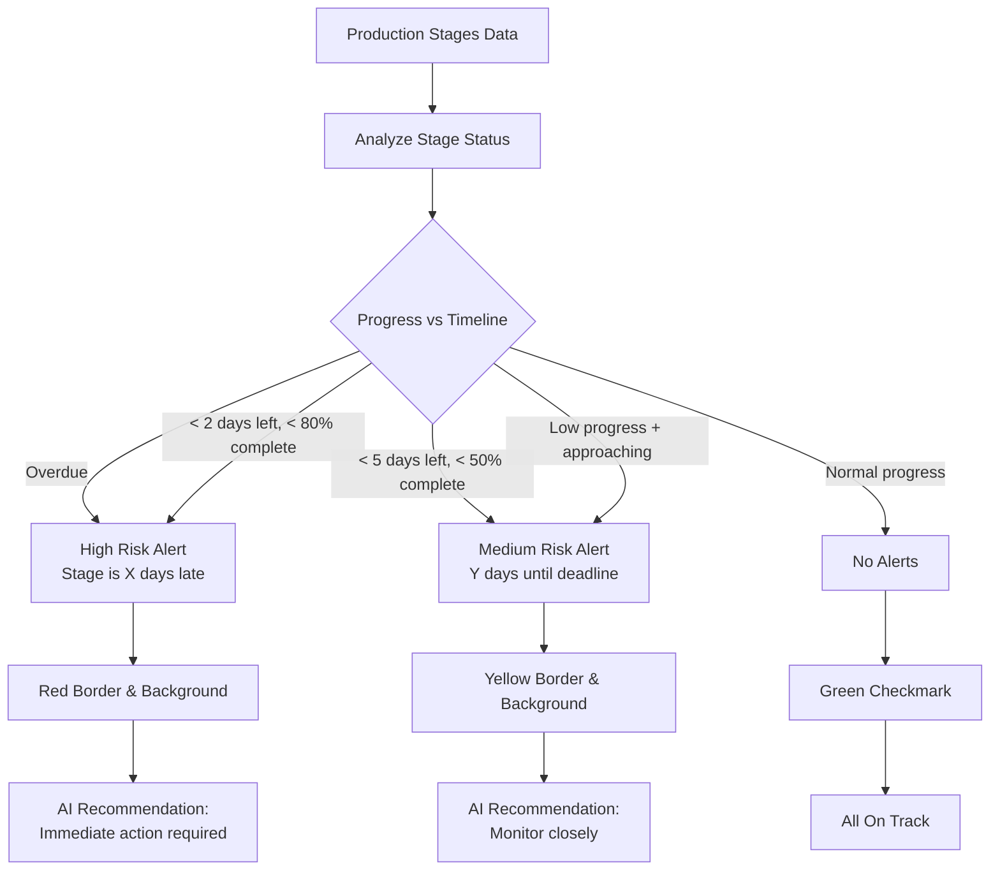

**Diagram sources**
- [PredictiveDelayAlert.tsx](file://src/components/production/PredictiveDelayAlert.tsx#L38-L108)
- [PredictiveDelayAlert.tsx](file://src/components/production/PredictiveDelayAlert.tsx#L110-L135)

**Section sources**
- [PredictiveDelayAlert.tsx](file://src/components/production/PredictiveDelayAlert.tsx#L1-L203)

### QualityRiskAlert.tsx - Defect Detection System

The quality risk alert system integrates with Supabase functions to provide AI-powered quality predictions.

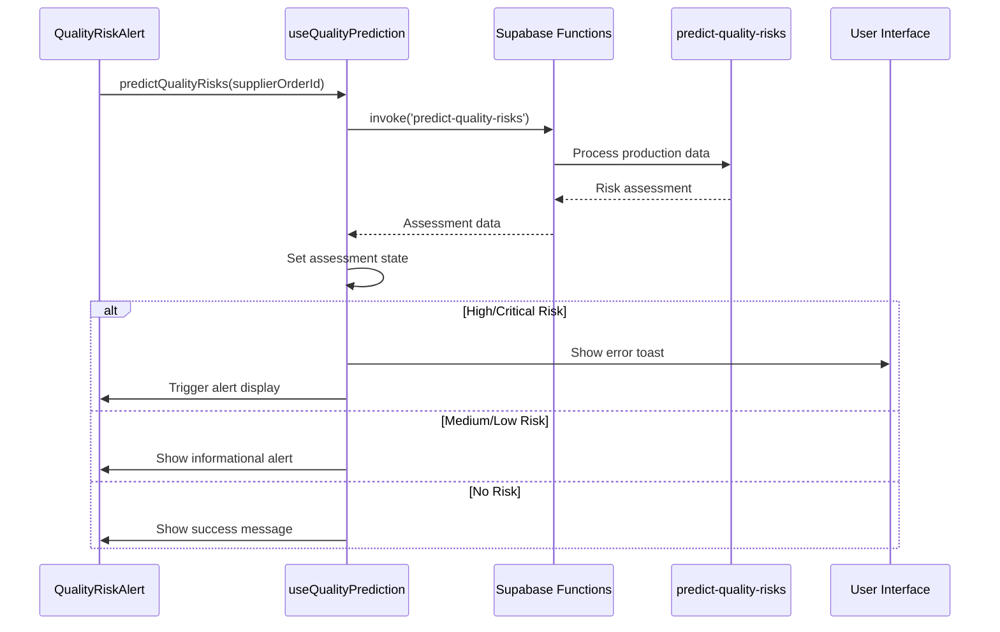

**Diagram sources**
- [QualityRiskAlert.tsx](file://src/components/production/QualityRiskAlert.tsx#L16-L25)
- [useQualityPrediction.ts](file://src/hooks/useQualityPrediction.ts#L16-L48)

**Section sources**
- [QualityRiskAlert.tsx](file://src/components/production/QualityRiskAlert.tsx#L1-L113)
- [useQualityPrediction.ts](file://src/hooks/useQualityPrediction.ts#L1-L56)

## Real-time Monitoring

### ConnectionStatusIndicator.tsx - Network Health Monitoring

The connection status indicator provides real-time feedback on the system's connectivity to Supabase services.

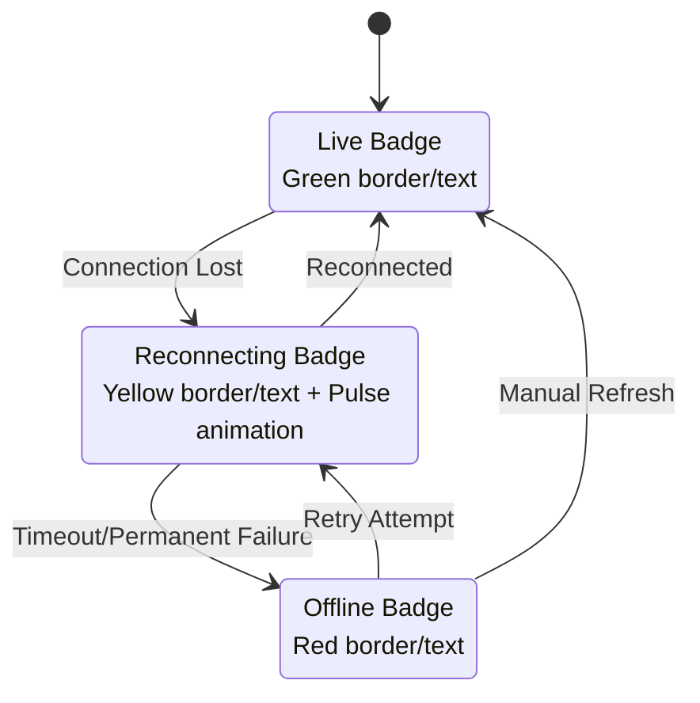

**Diagram sources**
- [ConnectionStatusIndicator.tsx](file://src/components/production/ConnectionStatusIndicator.tsx#L10-L76)

**Section sources**
- [ConnectionStatusIndicator.tsx](file://src/components/production/ConnectionStatusIndicator.tsx#L1-L76)

## Cross-Factory Communication

### SupplierCoordinationPanel.tsx - Collaborative Messaging

The supplier coordination panel enables real-time communication between buyers and suppliers with comprehensive messaging capabilities.

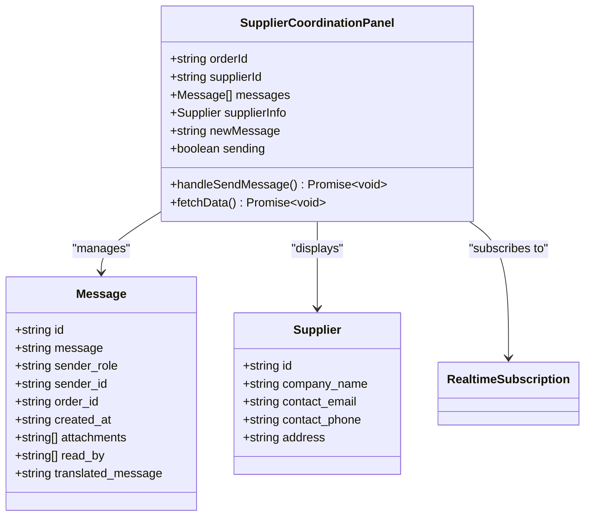

**Diagram sources**
- [SupplierCoordinationPanel.tsx](file://src/components/production/SupplierCoordinationPanel.tsx#L11-L30)
- [SupplierCoordinationPanel.tsx](file://src/components/production/SupplierCoordinationPanel.tsx#L37-L256)

**Section sources**
- [SupplierCoordinationPanel.tsx](file://src/components/production/SupplierCoordinationPanel.tsx#L1-L256)

## Error Handling and Network Resilience

The system implements comprehensive error handling strategies to ensure reliability during network interruptions and service failures.

### Network Interruption Handling

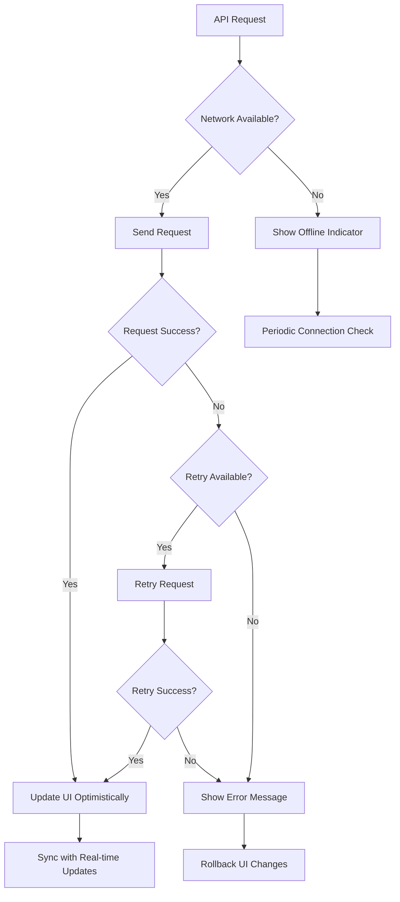

**Diagram sources**
- [ConnectionStatusIndicator.tsx](file://src/components/production/ConnectionStatusIndicator.tsx#L14-L48)
- [useOptimisticStageUpdate.ts](file://src/hooks/useOptimisticUpdate.ts#L107-L116)

### Error Recovery Mechanisms

The system employs several error recovery mechanisms:

1. **Automatic Retry Logic**: Failed requests are automatically retried with exponential backoff
2. **UI Rollback**: Optimistic updates are rolled back if server operations fail
3. **Connection Monitoring**: Continuous monitoring of network connectivity with automatic reconnection attempts
4. **Graceful Degradation**: Core functionality remains available even during partial service failures

**Section sources**
- [useOptimisticStageUpdate.ts](file://src/hooks/useOptimisticUpdate.ts#L107-L116)
- [ConnectionStatusIndicator.tsx](file://src/components/production/ConnectionStatusIndicator.tsx#L14-L48)

## Performance Optimization

### High-Frequency Update Optimization

The production tracking system implements several performance optimization strategies for handling high-frequency updates:

1. **Optimistic UI Updates**: Immediate UI feedback before server confirmation
2. **Selective Re-rendering**: Components only update when relevant data changes
3. **Real-time Subscription Filtering**: Efficient event filtering to minimize unnecessary updates
4. **Debounced Network Requests**: Prevent excessive API calls during rapid user interactions

### Memory Management

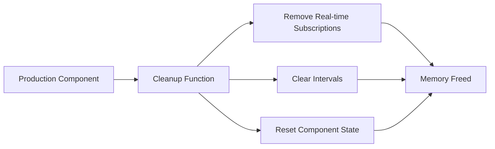

**Diagram sources**
- [ProductionTracking.tsx](file://src/pages/ProductionTracking.tsx#L85-L87)
- [ConnectionStatusIndicator.tsx](file://src/components/production/ConnectionStatusIndicator.tsx#L45-L48)

**Section sources**
- [ProductionTracking.tsx](file://src/pages/ProductionTracking.tsx#L85-L87)
- [ConnectionStatusIndicator.tsx](file://src/components/production/ConnectionStatusIndicator.tsx#L45-L48)

## Integration Patterns

### Supabase Integration Architecture

The system leverages Supabase's comprehensive suite of services for seamless integration:

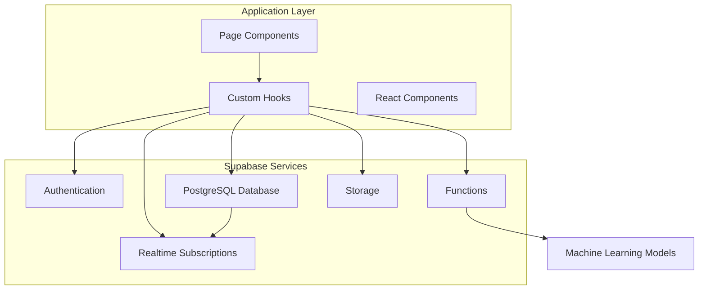

**Diagram sources**
- [supabase/client.ts](file://src/integrations/supabase/client.ts#L1-L20)
- [ProductionTracking.tsx](file://src/pages/ProductionTracking.tsx#L90-L139)

### Role-Based Access Control

The system implements role-based access control to ensure appropriate data visibility:

| Role | Access Level | Data Visibility |
|------|-------------|----------------|
| Admin/Staff | Full Access | All orders, all production data |
| Supplier | Supplier-Specific | Orders assigned to their factory |
| Buyer | Buyer-Specific | Orders placed by their account |

**Section sources**
- [ProductionTracking.tsx](file://src/pages/ProductionTracking.tsx#L117-L129)

## Troubleshooting Guide

### Common Issues and Solutions

#### Connection Issues
- **Symptom**: Connection status shows offline
- **Solution**: Check network connectivity and refresh the page
- **Prevention**: Enable automatic reconnection monitoring

#### Real-time Updates Not Working
- **Symptom**: Changes not reflecting immediately
- **Solution**: Verify subscription permissions and refresh the page
- **Debug**: Check browser console for subscription errors

#### Quality Risk Alerts Not Appearing
- **Symptom**: No quality risk notifications
- **Solution**: Verify supplier order ID and check ML model availability
- **Debug**: Review console logs for prediction errors

#### Performance Issues During High-Frequency Updates
- **Symptom**: Slow UI responsiveness
- **Solution**: Implement update throttling and optimize component rendering
- **Prevention**: Use selective re-rendering strategies

### Debugging Tools

The system provides several debugging capabilities:

1. **Console Logging**: Detailed logs for development and debugging
2. **Error Boundaries**: Graceful error handling with fallback UI
3. **Network Monitoring**: Real-time connection status tracking
4. **State Inspection**: Component state debugging tools

**Section sources**
- [ConnectionStatusIndicator.tsx](file://src/components/production/ConnectionStatusIndicator.tsx#L14-L48)
- [useQualityPrediction.ts](file://src/hooks/useQualityPrediction.ts#L42-L46)

## Conclusion

The sleekapp-v100 production tracking system represents a comprehensive implementation of LoopTrace™ Technology, delivering real-time visibility, predictive insights, and collaborative communication capabilities. Through its modular architecture, sophisticated real-time updates, and AI-powered analytics, the system transforms traditional manufacturing oversight into a dynamic, proactive management experience.

Key strengths of the implementation include:

- **Seamless Real-time Integration**: Supabase's realtime capabilities enable immediate updates across all connected components
- **AI-Driven Predictive Analytics**: Machine learning models provide actionable insights for delay prevention and quality assurance
- **Robust Error Handling**: Comprehensive error recovery ensures system reliability during network interruptions
- **Performance Optimization**: Optimistic updates and selective re-rendering maintain responsive user experience
- **Scalable Architecture**: Modular design supports easy extension and maintenance

The system successfully addresses the core challenges of modern manufacturing visibility, providing stakeholders with the tools necessary to monitor, predict, and optimize production processes in real-time. Its integration of cutting-edge technologies with practical manufacturing workflows establishes a new standard for production tracking solutions.